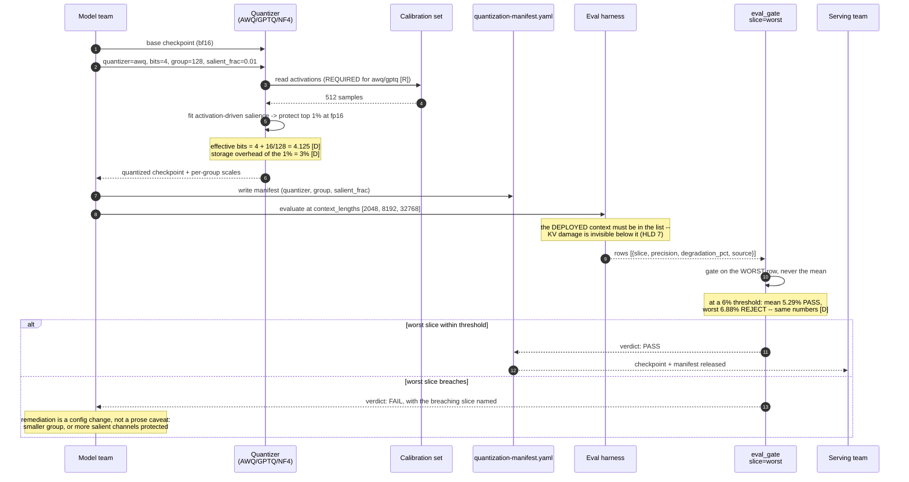
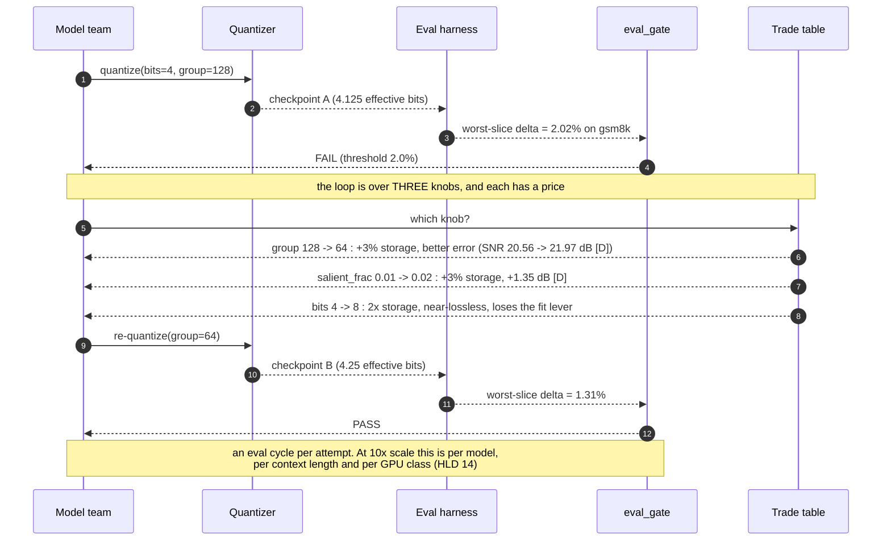
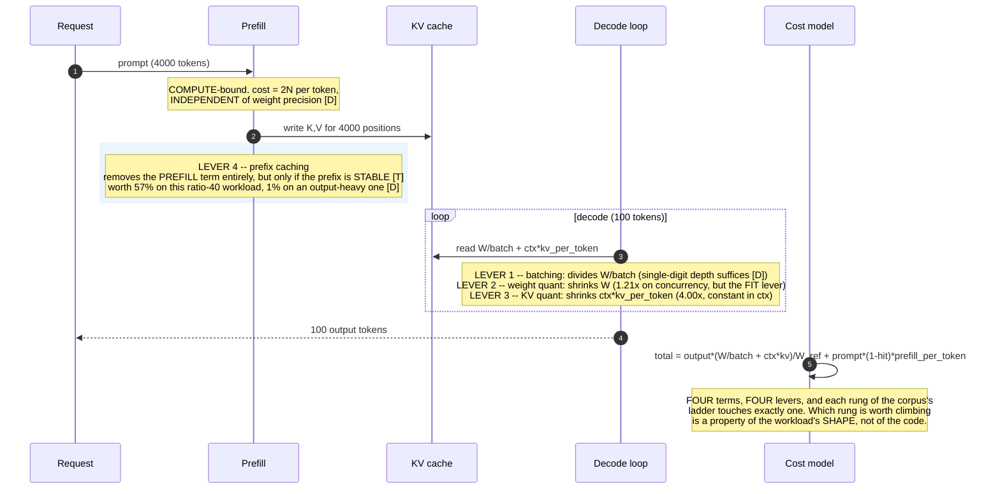
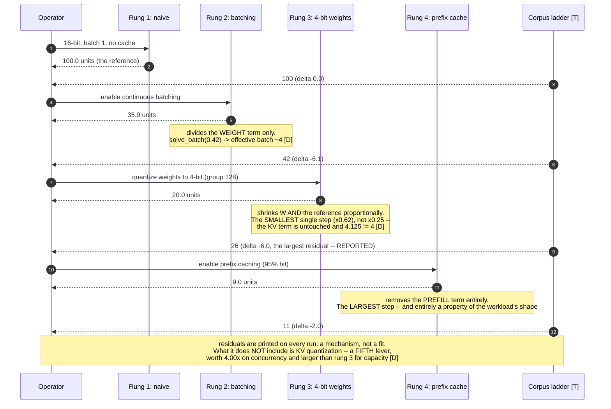
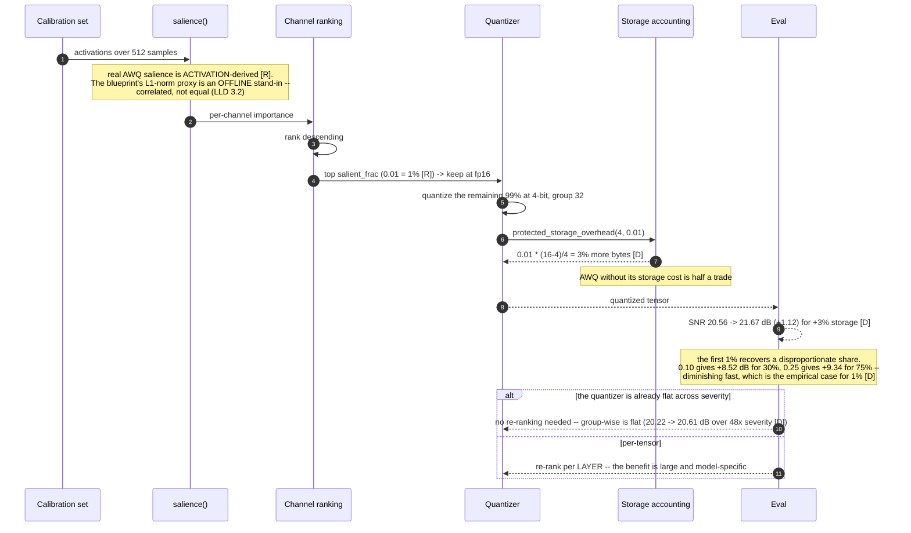

# T10 — Quantization: sequence diagrams

> `T10` · **Transcript coverage:** partial · [HLD](../HLD.md) · [LLD](../LLD.md) · [Runnable core](../run.py) · [Production](../production/README.md)

Six flows. Each one is a decision the HLD argues for, rendered as the order in which things happen
— because in this topic **the order is the design**. The common failure is not a wrong setting but a
right setting applied at the wrong stage (KV precision decided before the checkpoint, re-evaluation
skipped after a KV retune, the gate run on the mean).

---

## 1. Offline quantization, with the gate

The artefact path. Every step before the gate is reversible; the gate is where the deployment
decision is made.



**The gate's position is the design.** It sits between "quantized" and "released", not after
release — and it returns the *breaching slice*, because the remediation (a smaller group, or a
higher `salient_frac`) is chosen from which slice broke.

---

## 2. A gate rejection and the re-quantization loop

The loop that costs an eval cycle, and the reason HLD §12.1 says a flat quantizer does not need a
gate while a per-tensor one does.



**The loop has an exit that is not another quantization: the `no-quantization-control` route.** If
every configuration breaches on the worst slice, the answer is that this model does not tolerate the
bit width — and the honest outcome is bf16 with fewer sequences, not a fourth attempt.

---

## 3. A KV retune, and the re-evaluation that is usually skipped

The most dangerous flow in the topic, because the change is a config flag — it *feels* like tuning —
and its damage is invisible to the evals most teams run.

```mermaid
sequenceDiagram
    autonumber
    participant OPS as Serving team
    participant CFG as engine-quant.yaml
    participant ENG as vLLM
    participant MET as metrics.promql
    participant EV as Eval harness

    OPS->>MET: concurrency is below target (query 1)
    MET-->>OPS: 52 sequences, expected 208
    OPS->>OPS: which lever? weights are already 4-bit -> KV is the untaken 4x
    OPS->>CFG: kv_cache_dtype: fp8 (was auto)
    Note over CFG: a RESTART-level change, not an artefact change

    CFG->>ENG: restart with calculate_kv_scales=true
    ENG-->>MET: concurrency 208 -> 417 sequences
    note over MET: 2.00x here (fp8); 4.00x at int4 [D]<br/>BOTH are constant in context length

    rect rgb(255, 235, 235)
        Note over OPS,EV: THE STEP THAT IS SKIPPED
        OPS->>EV: RE-EVALUATE at max_model_len (32768)
        EV-->>OPS: worst-slice delta 2.4% at 32k, 0.1% at 2k
        Note over EV: a short-context suite reports this change as FREE.<br/>It is not -- the damage accumulates over positions (HLD 7).
    end

    alt worst slice at the deployed ctx within threshold
        OPS->>ENG: keep fp8 KV
    else breach
        OPS->>CFG: kv_cache_dtype: int8 (2x, gentler) or auto
        Note over OPS: the lever has a middle setting,<br/>which is why the eval is worth running rather than skipping
    end
```

**The red block is the whole diagram.** Without it, this flow is a successful optimization; with it,
it is a validated one. HLD §7's table is the argument: weight quantization is visible on any
benchmark, KV quantization only on long-context ones.

---

## 4. The per-request accounting path — where the two levers act

What actually happens to one request, with the two levers acting on different terms of the same
expression (HLD §8).



**The `W_ref` in the denominator is a constant, and it has to be.** The decode term is a ratio; if
the reference were recomputed per precision, shrinking `W` would *inflate* the result and the ladder
would read 100 → 42 → **71** — "4-bit costs more than not quantizing" (LLD §3.4).

---

## 5. The ladder's four rungs as one traversal

The corpus's ladder `[T]` walked in order, with each rung's mechanism and its measured residual
against the corpus's own figure.



**Rung 3's residual is the largest, and it is reported rather than tuned away.** The model credits
weight quantization slightly more than the corpus's composite does; claiming a perfect reproduction
would be the dishonest move.

---

## 6. The AWQ salience scan

The one flow in the topic that is a *policy* rather than a format: quantize everything, then restore
the channels the activations say matter.



**The branch at the end is HLD §12.1.** AWQ's benefit depends on the quantizer beneath it: with
group-wise scales across the tensor, protection adds less because the error is already localised.
**The same policy is worth different amounts under different quantizers**, which is why the
calibration is part of the artefact rather than a one-off.

---

## Sources

- `refs/LLMOps_Agentic_AIOps_The_Hands-On_Playlist_2026_transcripts/Cut_LLM_Cost_Latency_KV_Cache_Batching_Quantization_vLLM.txt` — the ladder traversed in §5 (`[T]`); "always rerun your evals after quantizing" (§1); "caching only helps a stable prefix" (§4).
- `refs/ai-system-design-guide-main/ai-system-design-guide-main/03-training-and-adaptation/07-quantization-deep-dive.md` — AWQ's activation-derived 1% `[R]` (§6); "allow 4x higher concurrency on the same GPU" `[R]` (§3).
- `refs/ai-system-design-guide-main/ai-system-design-guide-main/04-inference-optimization/01-inference-fundamentals.md` — prefill's compute-bound character (§4), which makes the prefill term precision-independent.
- `refs/Agentic_AI_Infra_transcripts_2/Banghua_Zhu_-_Building_Frontier_Inference_and_Training_Infra_for_Agent_A_Case_St.txt` — the native low-precision training path behind §1's quantizer list.

Blueprint: [`HLD.md`](../HLD.md) §§3, 7, 8, 12 · [`LLD.md`](../LLD.md) §§3.2, 3.4, 4, 5 · [`production/README.md`](../production/README.md) §§1–5.
