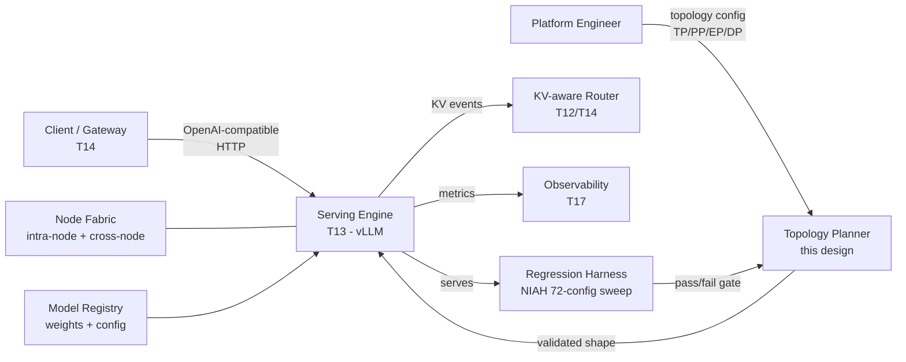
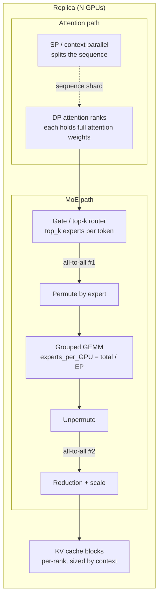
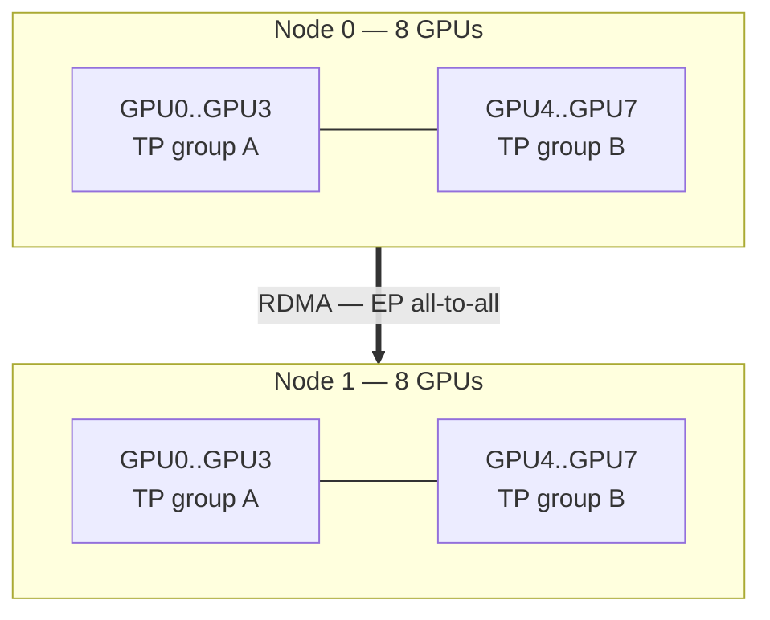

# HLD: Parallelism & MoE Serving Topology

> `T11` · **Transcript coverage:** primary · [LLD](LLD.md) · [Sequences](docs/SEQUENCES.md) · [Case study](../../01-case-studies/T11-parallelism-moe.md) · [Cheat sheet](../../00-cheat-sheets/T11-parallelism-moe.md) · [Interview bank](../../02-interview-questions/T11-parallelism-moe.md)

## 1. Problem & Scope

This designs the **execution topology layer** for serving large Mixture-of-Experts models: how a single
model replica is sharded across GPUs, which parallelism dimension carries which part of the model, and
how many GPUs a replica needs before throughput per GPU starts falling instead of rising.

**In scope:** the parallelism decision (which dimensions, at what degree), the memory and communication
arithmetic that constrains it, the MoE-specific kernel path, the deployment topology (nodes, fabric,
co-location), the NIAH-based regression harness that validates a topology change, and the capacity model
that turns a traffic requirement into a GPU count.

**Out of scope:** the serving engine's scheduler internals (T13), prefill/decode disaggregation as a
deployment strategy (T12 — this HLD assumes a replica is co-located and T12 disaggregates it), routing
policy across replicas (T14), and autoscaling (T15). Those are separate containers that consume this
layer's output, which is *a validated replica shape and a measured capacity per replica*.

## 2. Requirements

**Functional**

- F1: Serve one large MoE model (order 250–900 experts) at a target goodput.
- F2: Support a long-context profile — the corpus's own validation harness runs **10 needles ×
  concurrency × 3 shapes = 72 configurations** with a **≥7-of-10-needle pass threshold** `[T]`.
- F3: Allow the replica shape to be reconfigured (TP/PP/EP/DP degrees) and *re-validated* — the shape is
  a tuned parameter, not a constant.
- F4: Run on both intra-node and cross-node fabrics without changing the model code.

**Non-functional**

| Requirement | Target | Basis |
|---|---|---|
| Throughput per GPU must not fall when adding GPUs | monotonic non-decreasing | the failure this design exists to prevent `[T]` |
| Max concurrency on a 1P1D pair | ~20,000 sessions | corpus reference point `[T]` |
| Long-context behaviour must be characterised to the cliff | identify the concurrency at which KV recomputation starts | corpus documents a cliff at **28k inputs / concurrency 256** `[T]` |
| Fabric | TP confined to intra-node interconnect | corpus: TP stays inside the node `[T]` |
| Accelerator memory | 192 GB (MI300-class) / 288 GB (MI355-class) named in the corpus `[T]`; NVIDIA equivalents by configuration | |

**Explicit non-goals**

- No universal best configuration. The corpus's own conclusion is **"there is no universal winner"** `[T]`;
  this design produces a *search procedure and a validation harness*, not a blessed constant.
- No claim about hardware we cannot measure. Nothing in this blueprint asserts a measured GPU result.

## 3. System Context (C4 L1)



**What crosses the boundary.** The planner emits a topology specification — a tuple of degrees plus
engine flags. The harness emits a pass/fail verdict that gates promotion. The engine emits KV lifecycle
events that the router consumes downstream. Nothing in this design talks to clients directly.

## 4. Container View (C4 L2)

| Container | Responsibility | Technology | Scaling unit | State it owns |
|---|---|---|---|---|
| **Topology Planner** | Enumerate candidate shardings; apply memory and communication constraints; emit a ranked shortlist | Python, stdlib + the model's config JSON | one process per model | none (stateless; output is an artifact) |
| **Replica** | Hold the sharded model, run forward passes, manage KV | vLLM (or equivalent) with EP/DP/TP/PP enabled | one replica = N GPUs | model weights + KV cache |
| **MoE Kernel Path** | Route tokens to experts, grouped GEMM, unpermute | engine-internal, fused | per-replica | none |
| **Regression Harness** | Drive the 72-config NIAH sweep; score needle recall; gate | Python harness + a small eval client | one coordinator, N workers | the sweep results file |
| **Fabric** | Carry TP collectives intra-node, EP all-to-all cross-node | NVLink/Infinity Fabric intra-node; RDMA/roCE cross-node | physical | none |

Only **Replica** and **MoE Kernel Path** carry real design risk, and are decomposed in §5.

## 5. Component View (C4 L3)



**Why DP attention, not TP, for the wide dimension.** Each attention rank holds the *full* attention
weights and a slice of the batch, so attention needs no collective at all across the wide dimension.
That is what makes the wide topology viable — the corpus names this combination **WideEP: DP attention
plus EP MoE** `[T]`.

**The MoE path, and why the kernel count matters.** The naive implementation is **2 all-to-all
operations plus 6 kernels**; the fused form is **3 kernels** — top-k permute → grouped GEMMs → unpermute,
with the reduction and scaling folded in `[T]`. The all-to-all is unavoidable; the kernel launches and
the intermediate materialisation are not. A topology that increases EP degree increases the all-to-all
volume, so the fused path is what keeps the wide topology from being dominated by communication.

## 6. Data Flow

**Steady-state decode on an MoE replica:**

1. Request arrives at the engine with a prompt and a target output length. The engine allocates KV blocks.
2. The batch is formed across DP ranks — each rank takes a slice of sequences.
3. Attention runs locally per rank over its sequences; a short-context sequence parallel split applies
   only when the sequence exceeds the rank's local budget.
4. The gate computes top-k experts per token. `bytes ≈ tokens × top_k × hidden_dim × dtype_bytes × 2` `[D]`
   — the factor of 2 accounts for the outbound token and the returning result.
5. **All-to-all #1** dispatches tokens to the ranks owning their selected experts.
6. Grouped GEMMs compute the selected experts. Each GPU holds `experts_per_GPU = total_experts / EP_degree` `[D]`.
7. **All-to-all #2** returns results; unpermute, reduce and scale.
8. KV is appended; the block table is updated; the next token is sampled.

Full sequence diagrams, including cold start, scale-out and the KV-recomputation cliff, are in
[`docs/SEQUENCES.md`](docs/SEQUENCES.md).

## 7. Deployment Topology



**The rule.** Tensor parallelism is confined **inside** a node, because TP's all-reduce is on the critical
path of every layer and must ride the intra-node interconnect. Expert parallelism and data parallelism
carry the wide dimension across nodes `[T]`.

**The rule stated correctly.** "TP stays inside the node" is the position; **"TP stays 1" is not** `[T]`.
TP degree of 2 or 8 is entirely normal — the same team the corpus draws on runs **TP8 + 2P2D + EP8 + DP16** `[T]`.
What must not happen is TP spanning a node boundary.

**Co-location.** Attention weights and the KV cache are per-rank and stay resident. Expert weights are
partitioned — at EP8 with a 256-expert model, **32 experts per GPU**; at EP32 across four nodes, **8** `[D]`.
Higher EP degree means fewer experts per GPU and therefore less weight memory per GPU, which is the
mechanism that lets a bigger model fit at all.

## 8. Scaling Strategy

| Dimension | Scales how | Ceiling | Why |
|---|---|---|---|
| Batch size | vertical — more concurrent sequences per rank | KV memory | decode is memory-bandwidth-bound `[D]` |
| Context length | vertical within rank, then SP/DCP splits the sequence | KV memory per rank; recomputation cliff | corpus: cliff at 28k/256 `[T]` |
| Expert count | horizontal via EP | all-to-all bandwidth | each doubling of EP roughly doubles dispatch volume `[D]` |
| Replicas | horizontal via DP | gateway and KV-transfer budget | T14/T12 |
| TP degree | vertical **within a node only** | intra-node interconnect | TP collective is per-layer `[D]` |
| PP degree | vertical | pipeline bubble `(PP−1)/(microbatches+PP−1)` `[D]` | more stages, more bubble to hide |

**The non-scaling dimension is TP across a node boundary.** Everything else has a path; that one does not.

## 9. Failure Domains & Degradation

| Failure | Blast radius | Behaviour | Degradation |
|---|---|---|---|
| One GPU | 1/N of one replica | replica unusable (collectives hang) | replica drained; remaining replicas serve; capacity drops by 1/N |
| One node | all replicas spanning it | same | as above, multiplied |
| RDMA fabric degradation | every cross-node EP collective | all-to-all latency rises; ITL degrades, throughput drops | **fall back to a lower EP degree / intra-node-only topology** — the topology is reconfigurable (F3) |
| KV exhaustion | one replica | preemption and recomputation; the 28k/256 cliff `[T]` | admission control lowers concurrency; degraded, not dead |
| Engine crash | one replica | requests in flight lost unless the gateway retries | retry on another replica (T14) |
| Harness failure | none at serve time | promotions blocked | hold the current topology |

**The degradation ladder:** full wide topology → lower EP degree intra-node-only → reduced concurrency →
reduced SLO. The important property is that step two exists: because the topology is a configuration,
a fabric problem degrades to a narrower shape rather than to an outage.

## 10. Capacity Model

**Assumptions — all visible and re-derivable.** Everything below is `[D]`; the corpus supplies the
*relationships*, not these particular numbers.

```
Model:      L = 61 layers, H = 7168 hidden, E = 256 experts, top_k = 8, dtype = 2 bytes (fp16)
Accelerator: 192 GB per GPU (MI300-class `[T]`), usable for weights+cache after runtime overhead: 0.85
Node:       8 GPUs, intra-node interconnect; inter-node RDMA
```

**Step 1 — weight memory per GPU as a function of EP degree.**

```
experts_per_GPU    = E / EP_degree
expert_weight_bytes ≈ experts_per_GPU × 3 × H² × dtype_bytes      # gate/up/down per expert
                    = (256/EP) × 3 × 7168² × 2
                    = (256/EP) × 3.08e8 bytes ≈ (256/EP) × 0.308 GB

EP=8  → 32 experts/GPU → 9.9 GB
EP=16 → 16 experts/GPU → 4.9 GB
EP=32 →  8 experts/GPU → 2.5 GB
```

Attention weights are replicated across DP ranks and are independent of EP:

```
attention_bytes ≈ L × (4 × H²) × dtype_bytes = 61 × 4 × 7168² × 2 ≈ 25.1 GB
```

**Step 2 — what that leaves for KV, and the concurrency it buys.**

```
KV per token per sequence = 2 × L × kv_heads × head_dim × dtype_bytes
Assumption: kv_heads = 8, head_dim = 128  →  2 × 61 × 8 × 128 × 2 ≈ 250 KB/token/sequence

GPU budget = 192 × 0.85 ≈ 163 GB
EP=32:  163 − 25.1 − 2.5 ≈ 135 GB for KV  →  135e9 / 250e3 ≈ 540,000 token-slots per GPU
```

At a 4,000-token average context that is ~135 concurrent sequences per GPU, ~1,080 per 8-GPU node `[D]`.
The corpus's **~20,000 max concurrency on a 1P1D pair** `[T]` is a different and larger configuration;
the two are not comparable and this model does not claim to reproduce it.

**Step 3 — the result that drives the design.** Raise EP and weight memory per GPU falls (2.5 GB at
EP32 vs 9.9 GB at EP8), freeing KV — but all-to-all volume rises with EP. The optimum is a *balance*,
which is why the planner enumerates rather than solves, and why the harness exists to validate the
choice on the real workload.

**Step 4 — pipeline bubble.** With PP degree P and M microbatches: `bubble ≈ (P−1)/(M+P−1)` `[D]`.
At P=2, M=8: 1/9 ≈ 11% idle. At P=8, M=8: 7/15 ≈ 47% — which is why the corpus's tuned example uses
PP=2 rather than a deeper pipeline `[T]`.

## 11. Key Design Decisions

| Decision | Options | Chosen | Why | Revisit if |
|---|---|---|---|---|
| Wide dimension | TP across nodes vs EP+DP across nodes | **EP + DP wide; TP intra-node** | TP all-reduce is per-layer and on the critical path `[T]` | fabric offers a flat low-latency domain across nodes |
| Attention parallelism | TP vs **DP attention** | DP attention | no collective across the wide dimension `[T]` | attention weights stop fitting replicated |
| MoE kernel path | naive (2 A2A + 6 kernels) vs fused (3 kernels) | **fused** | kernel launch and materialisation dominate at high EP `[T]` | never — this is strictly better |
| Pipeline degree | 2 vs deeper | **PP=2** | bubble term grows as `(P−1)/(M+P−1)` `[D]`; corpus's tuned config uses 2 `[T]` | micro-batch count rises enough to hide a deeper pipe |
| 2P2D vs 2P4D | either | **2P2D** | corpus flags **2P4D as preliminary and not to be trusted** `[T]` | the preliminary result is corroborated |
| Topology | fixed constant vs reconfigurable | **reconfigurable + validated** | fabric and workload both change; corpus: "no universal winner" `[T]` | never |
| Vendor | NVIDIA vs AMD | whichever the WideEP enablement supports | corpus notes **AMD-vs-NVIDIA WideEP enablement gaps and pending PRs** `[T]` | the gaps close |

## 12. Build vs Buy

**Adopt:** the serving engine (vLLM or equivalent) — it already implements TP/PP/DP/EP/SP and the fused
MoE path. Reimplementing the parallel layers is a multi-quarter effort with no differentiation.

**Build:** the **Topology Planner** and the **Regression Harness**. Neither exists off the shelf, both are
small, and both encode decisions that are yours — your model's expert count, your fabric, your context
profile, your pass threshold. The corpus's own practice is exactly this: it reports its NIAH sweep and its
config search as *their* work, not as an engine feature `[T]`.

**The break-even.** Adopting the engine is free and immediate. Building the planner costs days and
recovers its cost the first time it prevents a topology that halves throughput per GPU — which is the
observed failure mode the corpus reports: a **naive single-host 8-way TP losing to a tuned
TP+PP+SP+EP mix across 16 GPUs per replica** `[T]`.

**Do not build:** a custom all-to-all, a custom grouped GEMM, or a scheduler. Those are engine and
library territory, and a bespoke version will lose to the maintained one.

## Sources

- `refs/vLLM_Inference_Meetup_Bengaluru_2026_transcripts/Distributed_Inference_on_ROCm_with_WideEP_on_vLLM_llm-d.txt`
  — WideEP (DP attention + EP MoE), the naive 2-all-to-all + 6-kernel path vs the fused 3-kernel path,
  `experts_per_GPU` at EP8/EP32, MI300 192 GB and MI355 288 GB, the naive-8-way-TP-vs-tuned-mix result,
  the 2P2D and 2P4D configurations with the preliminary flag, the 28k-inputs/concurrency-256 KV
  recomputation cliff, the NIAH 72-config sweep with the ≥7-needle threshold, ~20,000 max concurrency on
  a 1P1D pair, "there is no universal winner", TP-inside-the-node, and the AMD/NVIDIA WideEP enablement gaps.
- `refs/gpu-perf-engineering-resources-main/gpu-perf-engineering-resources-main/README.md` `[R]`
  — accelerator memory and interconnect reference material behind the topology table.
- `refs/ai-system-design-guide-main/ai-system-design-guide-main/04-inference-optimization/`
  — the engine's parallelism surface and configuration reference.

**Derived content in this HLD (`[D]`).** All arithmetic in §10 — the weight-memory model, the KV
bytes-per-token figure, the concurrency derivation, the bubble fraction, and the all-to-all volume
relationship — is mine, with assumptions stated at the point of use. None of it is a measured GPU
result, and none of it should be read as one. The container and component decompositions, the failure
table, and the build-vs-buy split are design judgements, not corpus claims. Where a corpus figure is
used it is attributed inline and marked `[T]` or `[R]`.
