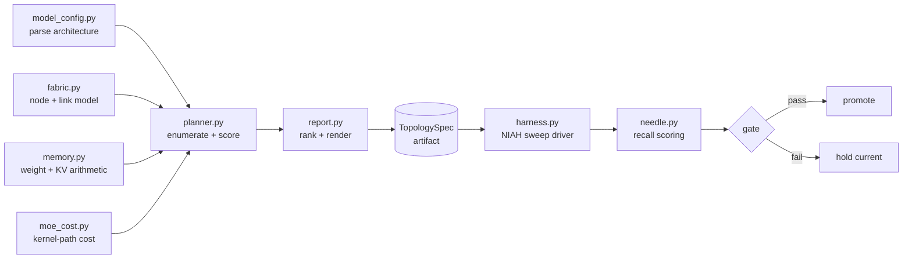
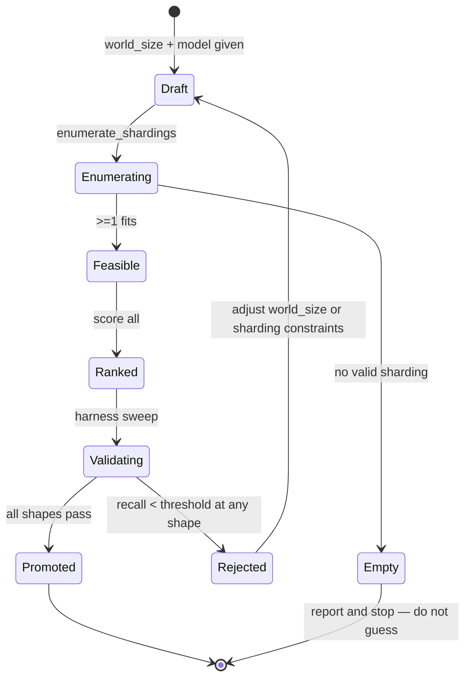
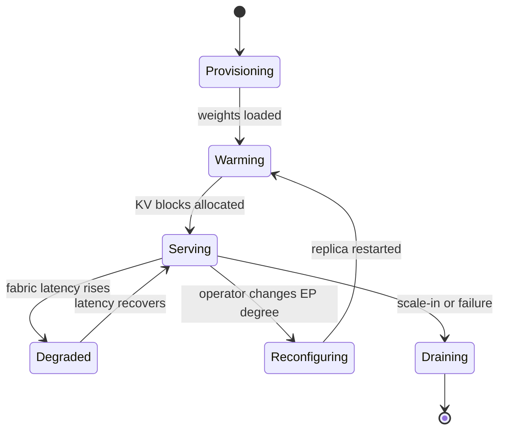

# LLD: Parallelism & MoE Serving Topology

> `T11` · **Transcript coverage:** primary · [HLD](HLD.md) · [Sequences](docs/SEQUENCES.md) · [Case study](../../01-case-studies/T11-parallelism-moe.md) · [Cheat sheet](../../00-cheat-sheets/T11-parallelism-moe.md) · [Interview bank](../../02-interview-questions/T11-parallelism-moe.md)

## 1. Module Map



**Responsibility boundaries — what each module must never do:**

| Module | Owns | Must never |
|---|---|---|
| `model_config` | parsing the architecture JSON into a typed `ModelSpec` | assume defaults for expert count, hidden size or head geometry |
| `memory` | pure arithmetic: bytes for weights, bytes for KV | read the filesystem or a GPU |
| `fabric` | the node/link model: which GPU pairs are intra-node, link bandwidths | assume a topology it was not given |
| `planner` | enumerating valid shardings and scoring them | emit a spec that violates a hard constraint |
| `report` | ranking and rendering | recompute arithmetic (it must render what it was given) |
| `harness` | driving the 72-config sweep | score its own results |
| `needle` | scoring recall against the ≥7 threshold | know which configuration produced the result |

The separation exists so the planner can be unit-tested without a GPU, and so a wrong number has exactly
one module to blame.

## 2. Core Data Structures

```python
# Illustrative shapes — see sim/ for the running versions.

@dataclass(frozen=True)
class ModelSpec:
    name: str
    layers: int                 # L
    hidden: int                 # H
    experts: int                # E — total expert count, e.g. 256 [T]
    top_k: int                  # experts activated per token, e.g. 8 [T]
    kv_heads: int
    head_dim: int
    dtype_bytes: int = 2        # fp16

@dataclass(frozen=True)
class Accelerator:
    name: str
    memory_gb: int              # 192 (MI300-class) / 288 (MI355-class) [T]
    usable_fraction: float = 0.85   # runtime + fragmentation headroom [D]

@dataclass(frozen=True)
class Fabric:
    gpus_per_node: int          # 8
    intra_node_bw_gbps: float   # TP collectives ride here
    inter_node_bw_gbps: float   # EP all-to-all rides here

@dataclass(frozen=True)
class Sharding:
    """One candidate parallel decomposition."""
    tp: int; pp: int; dp: int; ep: int; sp: int
    @property
    def world_size(self) -> int: return self.tp * self.pp * self.dp
```

**Invariants.**

- `tp` must divide `gpus_per_node` and `tp <= gpus_per_node` — the HLD's confinement rule. Enforced in
  `Sharding.__post_init__`, not at use sites.
- `ep` must divide `experts` exactly. A non-divisor leaves experts unowned, which is a silent
  correctness bug rather than a performance one.
- `world_size` must equal the number of GPUs the replica is actually given. A mismatch is what causes a
  collective to hang rather than error.
- `sp` and `tp` interact: `sp` splits the sequence dimension and requires the attention path to shard
  with it. Modelled as a constraint, not scored independently.

```python
@dataclass
class MemoryPlan:
    weights_per_gpu_gb: float
    kv_per_gpu_gb: float
    kv_bytes_per_token: float
    experts_per_gpu: int
    fits: bool
    binding_constraint: str     # "weights" | "kv" | "none"

@dataclass
class TopologySpec:
    sharding: Sharding
    memory: MemoryPlan
    bubble_fraction: float
    a2a_bytes_per_token: float
    score: float
    notes: list[str]            # every constraint that was checked, pass or fail
```

`TopologySpec.notes` matters more than it looks: the corpus's conclusion is that **there is no universal
winner** `[T]`, so the artifact's value is the *comparison*, and that means recording why each candidate
scored what it did.

## 3. Interfaces & Contracts

### 3.1 `parse_model_config(path: str) -> ModelSpec`

Reads a HuggingFace-style `config.json`. **Preconditions:** the file exists and parses. **Postconditions:**
a `ModelSpec` whose `experts` and `top_k` are present — not defaulted. **Errors:** `ConfigError` if
`num_experts` or `num_experts_per_tok` is absent when the architecture string contains `moe`; a dense
model is legal but then EP is degenerate and the planner returns a single candidate.

**Idempotent:** yes. **Threading:** pure function, safe to call concurrently.

### 3.2 `enumerate_shardings(spec, accel, fabric, world_size) -> Iterator[Sharding]`

Yields every *structurally valid* decomposition of `world_size`. **Preconditions:** `world_size > 0`.
**Postconditions:** every yielded `Sharding` satisfies the invariants in §2. **Errors:** none — an empty
iterator is a legal result and the caller reports it as "no valid sharding for this world size", which is
a real and common outcome.

**The enumeration is deliberately small.** For a 16-GPU replica with 8 GPUs per node the candidate set is
on the order of tens, not thousands. Exhaustive search is the right algorithm here; a heuristic would add
risk for no benefit.

### 3.3 `plan_memory(spec, accel, sharding) -> MemoryPlan`

Pure arithmetic. **Postconditions:** `fits` is `True` only if both weights and KV fit within
`accel.memory_gb × usable_fraction`. `binding_constraint` names whichever came closer.

### 3.4 `score(candidate, weights) -> float`

Combines the terms in §5. **Errors:** raises `ValueError` if a candidate marked `fits=False` is scored —
an infeasible configuration must be filtered, never ranked, or the report will recommend a topology that
cannot start.

### 3.5 `run_sweep(harness_cfg) -> SweepResult`

Drives the NIAH sweep. **Parameters:** needles (default 10), concurrency levels, context shapes (the
corpus's harness uses **3 shapes** `[T]`), pass threshold (default 7). **Returns:** per-configuration
recall. **Error modes:** a worker timeout yields `recall=None` for that cell rather than aborting the
sweep — a timing-out configuration is a *result*, not a harness failure.

**Idempotency:** the sweep is re-runnable; results are keyed by `(topology_hash, context_shape, concurrency)`
so a re-run overwrites rather than duplicates.

## 4. State Machines



**The `Empty → [*]` transition is deliberate.** When no sharding fits, the correct behaviour is to stop
and report, not to relax a constraint silently. Relaxing the TP confinement rule would produce a
configuration that runs and performs badly, which is worse than a clear failure.



**The `Degraded → Reconfiguring` edge is the HLD's degradation ladder in state form.** A fabric problem
does not have to be an outage; the topology is a configuration.

## 5. Algorithms

### 5.1 Weight and KV arithmetic

```
experts_per_gpu = experts / ep
weight_bytes    = experts_per_gpu × 3 × H² × dtype_bytes      # gate, up, down projections
                + L × 4 × H² × dtype_bytes                     # attention, replicated per DP rank
kv_bytes_token  = 2 × L × kv_heads × head_dim × dtype_bytes    # per sequence, per token
kv_per_gpu      = accel.memory_gb × usable_fraction − weight_bytes/1e9
max_tokens      = kv_per_gpu × 1e9 / kv_bytes_token
```

`O(1)`. The factor 3 on expert projections and 4 on attention assume a standard gated MLP and a
four-matrix attention block; both are assumptions the caller can override, and both are visible in the
report so a reader can disagree with them.

### 5.2 Pipeline bubble

```
bubble(P, M) = (P − 1) / (M + P − 1)
```

`O(1)`. With `M` microbatches and `P` stages. At `P=2, M=8` → 11%; at `P=8, M=8` → 47% `[D]`. This is
why the planner penalises deep pipelines unless `M` is large enough to hide them.

### 5.3 All-to-all volume

```
a2a_bytes_per_token = top_k × H × dtype_bytes × 2
```

`O(1)`. The `× 2` is the dispatch and the return `[D]`. **This term is independent of EP degree** — a
token is dispatched to `top_k` experts wherever they live. What grows with EP is the *number of peers*
each rank exchanges with and therefore the fixed per-message overhead and the tail latency, not the
payload. That distinction is the reason the planner models a2a as `payload + peers × overhead`, not as
payload alone.

### 5.4 Scoring

```
score = throughput_proxy
      × (1 − bubble_fraction)
      ÷ (1 + a2a_penalty)
      × feasibility_mask
```

where `throughput_proxy` is the KV tokens available per GPU divided by bytes-per-token — a proxy for
concurrency, not a measured throughput `[D]`. **This is a model, not a benchmark.** Nothing in it was
measured on hardware, and the report says so on every line.

**Complexity:** enumeration is `O(candidates × 1)`; the whole planner is `O(tens)`.

## 6. Concurrency & Locking

The planner is **single-threaded and stateless** — it holds no mutable state between calls, so there is
nothing to lock. This is a deliberate choice: the artifact it produces is consumed by humans and by a
deployment system, not by concurrent requests.

The **harness** is concurrent: `W` workers drive separate configurations. The discipline:

- Each worker owns its own result list and never writes to a shared one.
- Results are merged once, on the main thread, after `join()`.
- Workers never share a model handle or a KV cache; each is independent, so a worker crash costs one cell.
- The merge is order-independent and keyed, so a re-run is idempotent.

**Ordering guarantee:** none is required. The sweep's cells are independent by construction.

## 7. Error Handling

| Error | Class | Retryable | Caller sees | Logged |
|---|---|---|---|---|
| `ConfigError` — missing expert fields | fatal | no | exception with the missing key named | yes, at ERROR |
| No valid sharding | result, not an error | no | `Empty` state with the constraints that excluded everything | yes, at WARN with each constraint |
| Collective hang at startup | infra | yes, once, then fatal | replica never becomes ready | yes, with the world_size that was requested |
| Worker timeout in sweep | cell-level | yes | `recall=None` for that cell | yes, at WARN |
| All cells time out | fatal | no | sweep aborts with no verdict | yes, at ERROR |

**Retry semantics.** A replica that fails to start is retried **once** with the same topology. If it
fails again the topology is marked bad, not retried — a second identical failure is not a transient.
Backoff is not used at this layer; the deployment system owns pod-level backoff.

**Circuit breaking.** If more than half the sweep cells time out, the harness trips and stops scheduling
new cells, because a fabric that cannot complete half the sweep is a fabric problem, not a
configuration problem, and continuing wastes hours.

## 8. Resource Accounting

| Resource | Acquired when | Tracked in | Released | On abort |
|---|---|---|---|---|
| GPUs | replica scheduling | deployment system | replica teardown | deployment system reaps |
| Weight memory | replica start | `MemoryPlan.weights_per_gpu_gb` | process exit | CUDA/HIP context teardown |
| KV blocks | per request | engine's block manager (T13) | on request completion | blocks returned to the free pool |
| All-to-all buffers | replica start | engine | process exit | context teardown |
| Harness workers | sweep start | `harness.py` | sweep end | `finally` block joins every worker |

**The one that leaks if you are careless:** all-to-all buffers sized for the *largest* candidate EP degree.
If the planner is re-run with a smaller EP and the buffers are not resized, the memory plan is wrong by
the difference. The design fixes this by deriving buffer size from the `TopologySpec` at replica start,
never from a global default.

## 9. Configuration Surface

| Knob | Type | Default | Range | Effect | Tuning order |
|---|---|---|---|---|---|
| `tp` | int | derived | 1..gpus_per_node | splits attention within a node | 3rd — after EP and DP are fixed |
| `ep` | int | derived | divisor of `experts` | experts per GPU; all-to-all peers | 1st — the primary lever |
| `dp` | int | derived | fills world_size | replicas-within-a-replica for attention | 2nd |
| `pp` | int | 2 | 1..8 | pipeline stages; bubble cost | 4th |
| `sp` | int | 1 | 1..8 | splits the sequence dimension | 5th — only for long context |
| `max_num_batched_tokens` | int | 8192 | 1024..32768 | chunked-prefill chunk size | 6th |
| `gpu_memory_utilization` | float | 0.85 | 0.5..0.95 | fraction of VRAM the engine may use | pre-step — set before sizing KV |
| `enable_expert_parallel` | bool | true | — | turns the EP path on | required for any EP>1 |
| `enable_chunked_prefill` | bool | true | — | prevents one long prompt monopolising a step | required for the long-context profile |

**Tuning order matters.** EP first because it sets experts-per-GPU and therefore whether the model fits
at all; DP second because it fills the world size; TP third and confined; PP fourth; SP only when the
context genuinely requires it. Tuning TP first — the intuitive order — is the mistake that produces a
cross-node TP collective.

## 10. Observability Hooks

| Signal | Name | Tells you |
|---|---|---|
| Metric | `moe.experts_per_gpu` | confirms the intended EP degree is active |
| Metric | `moe.a2a_latency_p99` | the wide-dimension cost; degradation shows here first |
| Metric | `pp.bubble_fraction` | how much of the pipe is idle |
| Metric | `kv.usage_percent` | headroom before the recomputation cliff |
| Metric | `kv.preemption_rate` | **the cliff's leading indicator** — utilisation alone does not distinguish healthy-busy from thrashing |
| Metric | `throughput_per_gpu` | the HLD's F1 requirement; a fall here is the failure this design exists to prevent |
| Span | `replica.forward` | one per decode step, with batch size and expert hit distribution |
| Log | `topology.spec` at replica start | the exact sharding in force, so a result can be attributed to a shape |

**The one to alert on:** `throughput_per_gpu` trending down while GPU count trends up. That is the
observed failure mode, and it is invisible in utilisation, which stays high either way.

## 11. Test Strategy

**Unit — no GPU.** Every module in §1 except the harness is pure and testable:
- `memory`: assert the weight model against hand-computed values for a small spec; assert that doubling
  EP halves `experts_per_gpu` and reduces weight bytes monotonically.
- `planner`: assert the TP confinement invariant holds for every emitted `Sharding`; assert `ep` always
  divides `experts`; assert an `Empty` result when `world_size` is prime and greater than `gpus_per_node`.
- `bubble`: assert `bubble(1, M) == 0` and that bubble is monotonically increasing in `P` for fixed `M`.

**Integration — one node.** Start a replica with the chosen spec; assert it becomes ready within a
bounded time; assert `moe.experts_per_gpu` matches the spec. **The invariant worth asserting:** no
collective ever spans a node boundary with `tp > 1` — checked by inspecting the process group layout,
because a violation here costs throughput silently rather than failing.

**Load.** The NIAH sweep itself is the load test: 72 configurations at increasing concurrency, recording
where recall falls below 7-of-10. **Assert** that the configuration promoted at low concurrency still
passes at the target concurrency, and record the concurrency at which it stops passing — that number is
the real capacity of the shape.

**Chaos.** Degrade the inter-node fabric (add latency, then drop bandwidth) and assert the system
degrades to a narrower topology rather than to an outage, per §9 of the HLD.

## Sources

- `refs/vLLM_Inference_Meetup_Bengaluru_2026_transcripts/Distributed_Inference_on_ROCm_with_WideEP_on_vLLM_llm-d.txt`
  — WideEP, the fused MoE kernel path, `experts_per_GPU`, the NIAH sweep shape and threshold, the KV
  recomputation cliff, TP-inside-the-node, the 2P2D/2P4D configurations, and the "no universal winner"
  conclusion that shapes the report's design.
- `refs/gpu-perf-engineering-resources-main/gpu-perf-engineering-resources-main/README.md` `[R]`
  — accelerator and interconnect characteristics behind the `Accelerator` and `Fabric` structures.
- `refs/ai-system-design-guide-main/ai-system-design-guide-main/04-inference-optimization/`
  — the engine's configuration surface behind the knob table.

**Derived content in this LLD (`[D]`).** The module decomposition, all data structures and their
invariants, the interface contracts, both state machines, the scoring function, the concurrency model,
the error taxonomy, the resource-accounting table, and the test strategy are design work, not corpus
material. The arithmetic in §5.1–§5.3 states its assumptions inline. The `throughput_proxy` in §5.4 is a
model of a mechanism; it is **not** a measured throughput and must not be quoted as one.
