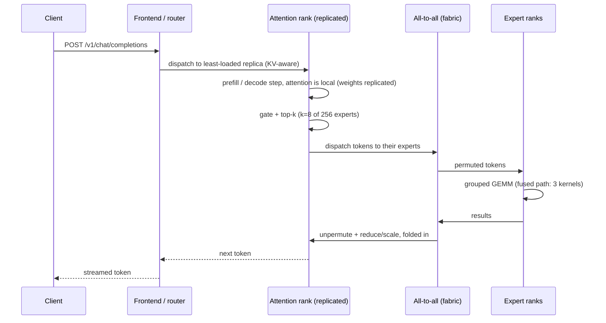
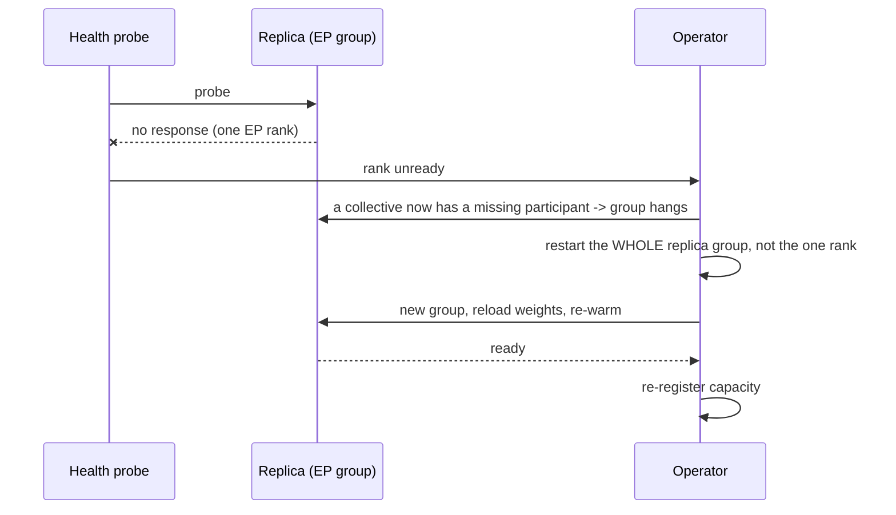
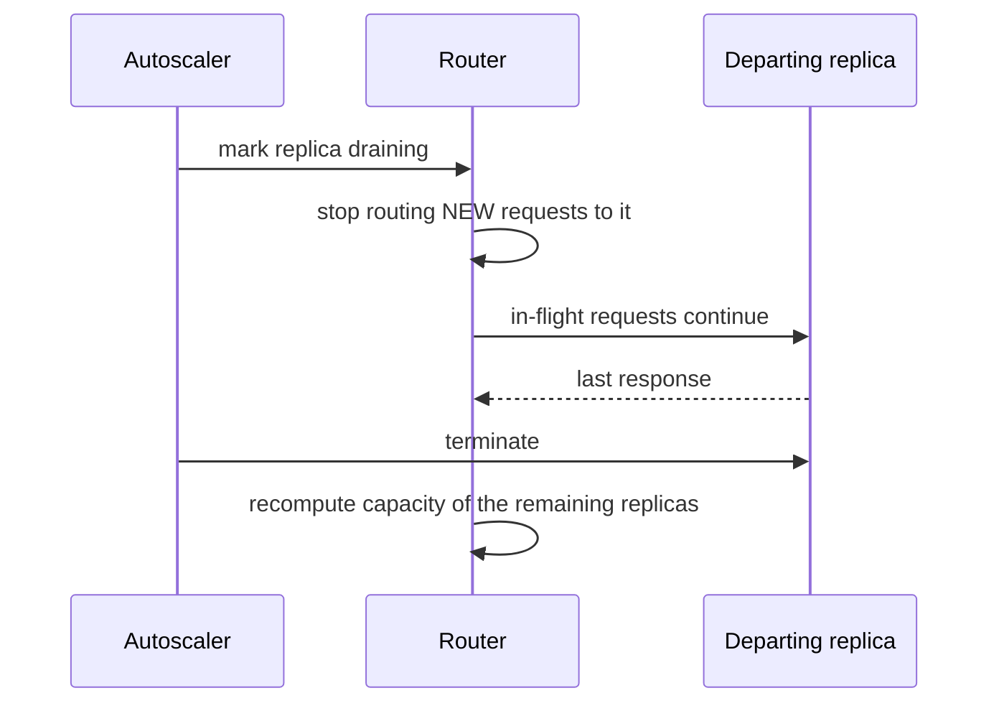

# T11 — End-to-end sequences

> `T11` · **Transcript coverage:** primary · [HLD](../HLD.md) · [LLD](../LLD.md)

Eight flows. Each carries a diagram, prose per step, and a **Where it fails** block — the
failure is the point of writing the sequence down, because every one of these flows has a
step that is silent when it goes wrong.

| # | Flow | The failure it exposes |
|---|---|---|
| 1 | Cold start (weights → first token) | weight-vs-KV race at startup |
| 2 | Steady state, single request | the all-to-all on the token's critical path |
| 3 | Cache hit (prefix reuse) | DP attention makes the cache *per-rank* |
| 4 | Long-context validation sweep | the KV-recomputation cliff |
| 5 | Fabric degradation → narrower EP | a silent latency regression |
| 6 | Rank failure and recovery | a collective hang, not an error |
| 7 | Scale-out (a replica joins) | the router's stale capacity view |
| 8 | Scale-in / drain | in-flight requests on a departing replica |

---

## 1. Cold start

```mermaid
sequenceDiagram
    participant Op as Operator
    participant Sched as Scheduler
    participant R as Replica (16 ranks)
    participant Store as Weight store
    Op->>Sched: apply topology ConfigMap (tp8 pp2 dp16 ep16)
    Sched->>Sched: find a node with 8 free accelerators
    Sched->>R: start 16 ranks, tp groups pinned node-local
    R->>R: read topology; assert tp <= gpusPerNode
    R->>Store: load checkpoint shards (rank-local slice)
    R->>R: plan_memory(): weights first, KV from the remainder
    R->>R: allocate KV pool at the ceiling the plan allows
    R->>R: warm up fused MoE path (compile / autotune)
    R-->>Sched: ready
    Sched-->>Op: replica registered with capacity
```

**Step by step.** The scheduler does not pick arbitrary nodes: a TP group of 8 must fit
inside one node, so the unit of placement is the node, not the pod. Each rank then loads
only its own slice — the attention block replicated (DP), the experts split
(`experts_per_gpu = 256 / 16 = 16`). Memory is planned **weights first**, because the KV
pool is the remainder: getting that order backwards is the classic startup OOM `[D]`.

**Where it fails.**

- *Weights don't fit.* `plan_memory` returns a non-positive KV budget and the replica must
  refuse to start rather than start with a token-sized cache. Silent alternative: it starts
  and serves, with a KV ceiling so low that throughput collapses under any concurrency.
- *TP group straddles a node.* The job still starts. The collective is promoted to the
  slow link and every token pays it — a latency regression with no error attached.
- *Warmup skipped.* First-request latency carries the fused-path autotune, so a fresh
  replica looks slower than a warm one and a naive rolling restart shows a phantom dip.

---

## 2. Steady state — one request through one MoE layer



**Step by step.** Attention is served **without a collective** — the weights are
replicated, so the attention block is local. The token then chooses 8 of 256 experts and
must reach wherever those experts live. That is the one communication event per layer, and
the fused path (`top-k permute → grouped GEMMs → unpermute`, with reduction and scaling
folded in) is what keeps it from being many `[T]`. The all-to-all count is unchanged from
the naive path — 2 — the fusion removes *launch and materialisation* overhead, not
communication `[T]`.

**Where it fails.**

- *Expert skew.* Top-k routing concentrates; a hot expert's rank saturates while others
  idle. The all-to-all does not slow down, one rank's queue does — and a per-replica
  latency metric hides it behind an average.
- *Fabric contention.* Because the all-to-all is *inside* the per-layer path, its latency
  multiplies by layer count. A small per-token fabric regression becomes a large
  end-to-end one.

---

## 3. Prefix cache hit

```mermaid
sequenceDiagram
    participant C as Client (long system prompt)
    participant F as Router
    participant R as Replica
    participant K as KV cache (per rank)
    C->>F: request with a shared prefix
    F->>F: prefix-aware routing: which replica holds this prefix?
    F->>R: route to that replica
    R->>K: look up prefix blocks
    alt hit
        K-->>R: reuse blocks; skip their prefill
        R-->>C: first token fast (TTFT drops)
    else miss
        R->>R: full prefill; write blocks to cache
        R-->>C: first token slow
    end
```

**Step by step.** Under DP attention the attention weights are replicated but the KV cache
is **not** — it belongs to the rank that computed it `[D]`. So a prefix cache is a
*per-replica* property, and a router that is not prefix-aware will send a request to a
replica that cannot reuse anything, silently paying full prefill.

**Where it fails.**

- *Prefix-blind routing.* The cache exists and the hit rate is near zero. This is the
  failure that looks like "caching doesn't help for us".
- *Cross-rank assumption.* An operator who assumes a cluster-wide cache sizes memory for
  it. Nothing breaks immediately; the KV ceiling is wrong under load.
- *Eviction.* Blocks evicted to make room are gone from *that rank*; a later request routed
  there re-prefills. Eviction is normal, repeated eviction of the same blocks is thrash —
  and thrash is what has to be alarmed on `[T]`.

---

## 4. Long-context validation sweep (the promotion gate)

```mermaid
sequenceDiagram
    participant CI as Validation job
    participant R as Replica
    participant J as Scorer
    CI->>CI: choose shape: 10 needles x context x concurrency
    loop for each (context, concurrency)
        CI->>R: NIAH batch at that shape
        R->>R: prefill the context; KV fills toward the ceiling
        R-->>CI: responses
        CI->>J: score needle recall
        J-->>CI: n of 10 needles found
    end
    CI->>CI: pass iff n >= 7 for the shape
```

**Step by step.** The sweep is **10 needles × 3 context shapes × rising concurrency** with
a **≥ 7-of-10** pass threshold `[T]`. Context shape is swept because the failure is a
function of *pressure*, not of concurrency alone — `concurrency × context` against the KV
ceiling. `run.py` §7 models exactly this and shows the three shapes failing at different
concurrencies (4k between 64 and 128; 32k between 8 and 32; 128k between 1 and 8).

**Where it fails.**

- *Concurrency-only sweep.* Passes at 4k, is promoted, and fails in production on 128k —
  the shape that was never tested.
- *The cliff.* The corpus documents a cliff at **~28k inputs / concurrency 256**,
  attributed to **KV recomputation** once the cache is exhausted `[T]`. Recall does not
  decay gently there; it falls off a shelf.
- *Trusting the model.* The cliff's *position* in `run.py` follows from that model's
  coefficients. It is a modelled cliff, not a measured one — the real sweep is the gate.

---

## 5. Fabric degradation → narrower EP

```mermaid
sequenceDiagram
    participant M as Monitoring
    participant Op as Operator
    participant R as Replica
    participant Rt as Router
    M->>M: inter-node bandwidth below the design assumption
    M-->>Op: alert
    Op->>Op: reduce EP 16 -> 8 (wider weights/GPU, tighter KV)
    Op->>R: rolling restart with the new topology ConfigMap
    R->>R: re-derive experts_per_gpu (=32), re-plan memory
    R->>R: shrink KV pool to fit the larger weight footprint
    R-->>Rt: re-register with a LOWER capacity
    Rt->>Rt: rebalance; shed to the replicas that are healthy
```

**Step by step.** EP is the dimension that crosses the slowest link, so it is narrowed
first. Narrowing EP *raises* `experts_per_gpu`, which raises weight memory, which *lowers*
the KV ceiling — the capacity the router is told about must be recomputed, not assumed.

**Where it fails.**

- *Capacity not re-registered.* The router keeps sending the old load to a replica that now
  holds fewer tokens. Overload, not error.
- *Narrowing the wrong dimension.* Reducing TP instead would put a latency-critical
  collective on the degraded link — the opposite of the intent.
- *Silent* — this is the key property. Nothing here throws. The only signal is a capacity
  number that changed, which is why the capacity re-registration is a named step.

---

## 6. Rank failure and recovery



**Step by step.** The unit of failure and the unit of restart are different. A single dead
EP rank does not degrade the replica gracefully — it removes a participant from a
collective, and the surviving ranks **hang** rather than error `[D]`.

**Where it fails.**

- *Restarting one rank.* It rejoins a group whose other members have already timed out, and
  the replica may never converge. Restart the group.
- *Treating it as a pod restart.* If the topology ConfigMap changed while the group was
  down, the new group comes up in a different shape than the router believes.
- *No warmup.* Recovery is not complete at "ready" — the fused path must be warm or the
  first requests after recovery are slow and look like the fault returning.

---

## 7. Scale-out — a replica joins

```mermaid
sequenceDiagram
    participant Auto as Autoscaler
    participant Sched as Scheduler
    participant R2 as New replica
    participant Rt as Router
    Auto->>Sched: scale to N+1
    Sched->>R2: place; TP group inside one node
    R2->>R2: cold start (flow 1)
    R2-->>Rt: register capacity (KV slots, not "requests")
    Rt->>Rt: begin sending; do NOT dump a full share immediately
    Rt-->>R2: ramp
```

**Step by step.** The new replica's capacity must be expressed in the same unit the router
balances on. If the router balances on request count while replicas differ in KV headroom,
it will overload the smallest.

**Where it fails.**

- *Cold-start dump.* Sending a full share to a replica still warming its fused path gives
  it a latency spike at birth.
- *Unit mismatch.* A replica with a smaller KV ceiling reports "ready" identically to a
  larger one.

---

## 8. Scale-in / drain



**Step by step.** Drain order matters: stop *dispatch* first, then wait. A replica killed
before its in-flight requests finish loses them — including any long-context request that
took the longest to prefilling, which is exactly the request most expensive to lose.

**Where it fails.**

- *Drain timeout too short.* Long-context requests outlive the grace period. Their KV is
  discarded and the client must re-prefill.
- *Capacity not recomputed.* The remaining replicas are now under-provisioned relative to
  the router's belief.

---

## The thread running through all eight

Every flow has one step that is **silent when it breaks**: a node-local placement
assumption (1), a fabric latency inside the layer path (2), a per-rank cache (3), an
untested context shape (4), a capacity number (5), a hung collective rather than an error
(6), a ready-replica that is warming (7), and in-flight work on a departing replica (8).
That is why the design's observability hooks (LLD §10) are attached to *these* steps and
not to generic host metrics.

## Sources

- `refs/vLLM_Inference_Meetup_Bengaluru_2026_transcripts/Distributed_Inference_on_ROCm_with_WideEP_on_vLLM_llm-d.txt`
  — WideEP; DP attention with expert parallelism; `experts_per_gpu = total / ep`; the fused
  3-kernel MoE path against the naive 6-kernel/2-all-to-all path; TP confined to the node;
  the 1P1D / 2P2D / 2P4D configurations and their preliminary status; the NIAH sweep
  (10 needles × 3 shapes × concurrency, ≥7 pass) and the ~28k-input / concurrency-256
  recomputation cliff.
- `refs/vLLM_Inference_Meetup_Bengaluru_2026_transcripts/Scaling_Agentic_AI_Distributed_Inference_with_llm-d.txt`
  — llm-d's treatment of KV-aware routing, the fabric as the shared scarce resource, and
  the "no universal winner" conclusion.
- `refs/ai-system-design-guide-main/ai-system-design-guide-main/04-inference-optimization/`
  — parallelisation vocabulary and the prefill/decode split this blueprint builds on.
