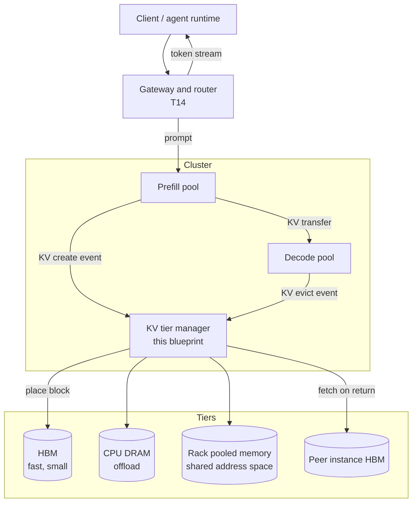
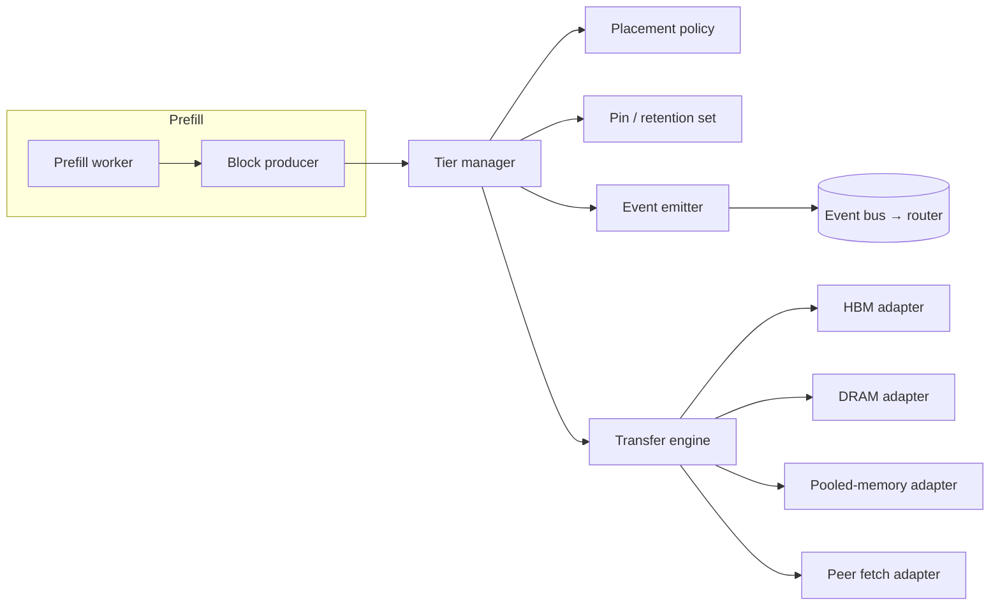

# T12 — Disaggregation & KV transfer: High-Level Design

> `T12` · **Transcript coverage:** primary · [LLD](LLD.md) · [Sequences](docs/SEQUENCES.md)

## 1. Problem & Scope

Prefill and decode want opposite things. Prefill is compute-bound: it processes the whole
prompt in one pass and its cost scales with prompt length. Decode is memory-bandwidth-bound:
it generates one token at a time and its cost scales with how much KV it must re-read per
token `[T]`. Serving both on the same accelerator means one workload's peak is the other's
idle — a long prompt stalls token generation for every sequence sharing that GPU.

Disaggregation separates them. Prefill runs in a **prefill pool**, decode in a **decode
pool**, each tuned independently, with the KV cache transferred between them `[T]`.

**In scope.** The prefill/decode split; the KV transfer path and its tiers
(HBM → CPU DRAM → rack-pooled memory → peer instance); the KV block lifecycle
(create → active → idle → offloaded → evicted) and the events it emits; the retention API
that lets a caller pin a block; the routing inputs this produces.

**Out of scope.** Token-level scheduling inside a pool (T08), the choice of attention
kernel (T07), expert-parallel placement (T11), and the gateway's own load-balancing
algorithm (T14) — although T12 defines the *events* T14 consumes.

**The single design question.** Where does the KV live between the moment prefill produces
it and the moment decode consumes it, and what happens to it after decode stops needing it
but the session might come back?

## 2. Requirements

### Functional

| id | Requirement |
|---|---|
| F1 | A prompt's KV must reach the decode instance without re-running prefill |
| F2 | The prefill:decode pool ratio must be tunable per workload, not fixed |
| F3 | A KV block must be movable to a slower, larger tier and back |
| F4 | A caller must be able to pin a block against eviction for a bounded time |
| F5 | Every create and every evict must emit an event a router can consume |
| F6 | A block must be attributable to the session that owns it |

### Non-functional

| id | Requirement | Target | Note |
|---|---|---|---|
| N1 | KV transfer must not dominate TTFT | transfer < prefill time saved | else disaggregation is a net loss `[D]` |
| N2 | Block movement must not contend with inference | no GPU-side PCIe saturation | the stated motivation for pooled memory `[T]` |
| N3 | Recovery must survive a decode-side OOM | prefill continues | KV is already in the pool `[T]` |
| N4 | Eviction must be observable | every evict is an event | thrash is invisible without it `[D]` |
| N5 | The transfer library must be replaceable | no topology baked into the transport | NIXL is a library, not a topology `[T]` |
| N6 | Session return after a pause must not re-prefill | see §10 | the 5× TTFT result `[T]` |

## 3. System Context



The gateway routes on the events the tier manager emits. That dependency is the reason
this blueprint defines a **schema** (LLD §3) rather than just a placement policy.

## 4. Container View

| Container | Responsibility | State it owns |
|---|---|---|
| Prefill worker | run prompt through the model, produce KV blocks | none after handoff |
| Decode worker | generate tokens, read KV per step | the KV it is actively reading |
| KV tier manager | place, move, pin, evict blocks; emit events | block → location map; pin set |
| Transfer engine | move bytes between tiers | in-flight transfers |
| Retained-session store | session → block ownership, pause metadata | session metadata |

The transfer engine is deliberately a *separate* container because it is the component
most likely to be replaced: the corpus describes NIXL as one supported library among
several on ROCm, not as the design `[T]`.

## 5. Component View



**Placement policy.** The tier choice is a small cost model, not a heuristic: promote a
block back up when the expected reuse benefit exceeds the transfer cost. The break-even is
computed in `sim/transfer.py` and printed by `run.py`.

**Pin / retention set.** The retention API's whole purpose is to keep a block that LRU
would evict but that a session is about to need again. It is bounded — an unbounded pin
set is a memory leak with extra steps `[D]`.

## 6. Data Flow

```
prompt ──► prefill worker ──► KV blocks
                                │
                    ┌───────────┴───────────┐
                    │                       │
              transfer to decode      retain for reuse
                    │                       │
              decode reads KV         tier manager places
                    │                  HBM → DRAM → POOL
              tokens stream out             │
                    │                  session returns?
              evict event emitted ──────────┘
                    │                       │
                    └──► router (T14) ◄─────┘
```

The loop back to the router is the point: eviction is not a garbage-collection detail, it
is routing input. A router that only sees creates will route to a replica whose blocks are
already gone.

## 7. Deployment Topology

| Unit | Composition | Why |
|---|---|---|
| Prefill node | N accelerators, no persistent KV | compute-dense; KV is transient |
| Decode node | N accelerators + large DRAM | KV-resident; DRAM is the offload tier |
| Pooled-memory box | rack-middle, shared address space | the corpus's four-server demo `[T]` |
| Tier manager | sidecar or per-node daemon | must see local tier state |

The pooled-memory tier is what makes this topology different from a conventional
disaggregated deployment. In the corpus's demo, four servers share one physical memory pool
and move KV by store/load to a shared address space, which the speaker reports is faster
than RDMA — and faster than TCP/IP by a wider margin `[T]`. That is a **vendor-reported**
result from a **very initial** performance number, and it is marked as such.

## 8. Scaling Strategy

| Signal | Action | Constraint |
|---|---|---|
| prefill queue depth rising | add prefill worker | decode pool unchanged |
| decode ITL rising | add decode worker | requires KV fetch from peer or recompute |
| KV tier pressure high | add DRAM or pool capacity | does not add compute |
| session return rate high | raise retention quota | costs capacity for active sessions |

The corpus's own observation is that the right P:D ratio **depends on the workload**: 2P2D
versus 3P1D performed differently, and with a prefill-heavy workload having more prefill
than decode helped `[T]`. There is no universal ratio — `run.py` §3 shows the ratio
tracking the prompt:output mix rather than a constant.

**Naming discipline.** 1P1D and 2P2D are the configurations the corpus tests nightly; 2P2D
is flagged **preliminary** `[T]`. 2P4D produced the best number in that talk *and the
speaker explicitly said not to look at the performance*, that these are preliminary and
very initial results `[T]`. **This blueprint does not size on 2P4D.**

## 9. Failure Domains & Degradation

| Failure | Blast radius | Response |
|---|---|---|
| Transfer engine down | new requests can't cross pools | fall back to co-located P+D for new traffic |
| Decode-side OOM | that decode worker | prefill continues; KV already in the pool `[T]` |
| Pooled memory unreachable | the retained tier | demote to DRAM; expect re-prefill on return |
| Tier manager down | placement stops | blocks stop moving; existing decode unaffected |
| Event bus down | **router goes stale** | most dangerous: routes to evicted blocks |

The last row is the one worth dwelling on. A stale router does not error — it sends a
request to an instance that no longer holds the prefix, and the request is served by
recomputation. Everything looks healthy; the cache hit rate quietly collapses.

**Eviction is not a failure.** It is a normal, evented stage of the lifecycle. The failure
is **thrash**: blocks evicted before they are reused, repeatedly. The design must never
describe eviction as "rampant" — that framing hides the actual defect, which is a capacity
or retention-policy error `[D]`.

## 10. Capacity Model

Assumptions, all `[D]`; the arithmetic is in `sim/transfer.py` and printed by `run.py`.

```
KV bytes/token   = 2 × layers × kv_heads × head_dim × dtype_bytes
                 = 2 × 61 × 8 × 128 × 2 = 249,856 B ≈ 244 KB/token/sequence
```

For a 32k-token prompt that is ≈ 7.8 GB of KV — larger than many models' weights, which is
why the tier exists at all.

**The break-even that decides offload versus recompute.** Offloading and reloading a block
costs:

```
t_offload = bytes / bw_down  +  bytes / bw_up  +  2 × tier_latency
```

Recomputing it costs:

```
t_recompute = prompt_tokens / prefill_tokens_per_second
```

Offload wins when `t_recompute > t_offload`. `run.py` §2 solves for the pause length at
which the two cross, per tier. The corpus's reported effect is up to **5× better TTFT** when
an agentic session returns after a pause `[T]` — a vendor-reported figure for a specific
workload, not a universal constant.

**The tier ordering is a cost ordering, not a preference ranking** `[D]`:

| Tier | Relative cost to read back | Capacity |
|---|---|---|
| HBM (local) | 1× | smallest |
| Peer instance HBM | ~1 order more | small |
| CPU DRAM (offload) | ~1 order more | large |
| Rack pooled memory | between the two, vendor-reported faster than RDMA `[T]` | large, shared |

## 11. Key Design Decisions

| # | Decision | Alternatives | Why |
|---|---|---|---|
| D1 | Transfer library is swappable | bake in one | NIXL is a library, not a topology `[T]` |
| D2 | Eviction emits an event | silent GC | router correctness depends on it `[T]` |
| D3 | Retention is an explicit API with a bound | "keep everything warm" | unbounded pins are a leak `[D]` |
| D4 | P:D ratio is configuration | a tuned constant | it tracks the workload `[T]` |
| D5 | Blocks carry session metadata | block-addressed only | needed for session-aware routing `[T]` |
| D6 | Pooled memory is a tier, not a replacement | put everything in the pool | compute stays on the accelerator `[D]` |
| D7 | 2P4D excluded from sizing | adopt the best-looking number | it is preliminary and disclaimed `[T]` |

## 12. Build vs Buy

**Buy:** the transfer library (NIXL or an equivalent), the RDMA transport, the pooled-memory
hardware. All are specialised and none is the differentiator.

**Build:** the placement policy, the retention API surface, the event schema, and the
session→block attribution. These encode *your* workload's pause and reuse pattern; no
vendor ships them.

The corpus's roadmap item here is explicit: a **KV cache retention API** with a PR from
NVIDIA, adding session metadata to KV blocks so the system knows which session a block
belongs to. It is **not shipped** — it is a PR `[T]`. Designing against it is designing
against an interface that does not exist yet, so the LLD treats it as an internal contract
that can later be satisfied by the upstream one.

## Sources

- `refs/vLLM_Inference_Meetup_Bengaluru_2026_transcripts/Scaling_Agentic_AI_Distributed_Inference_with_llm-d.txt`
  — prefill/decode disaggregation; KV transferred between prefill and decode nodes via
  NIXL; per-request create **and** evict KV events consumed by the router; precise versus
  approximate prefix routing; CPU KV offload giving up to ~5× TTFT on session return;
  2P2D versus 3P1D depending on workload; peer-to-peer KV fetch as the middle ground
  between queueing and recomputing; the KV retention API (an NVIDIA PR, not shipped) and
  session metadata on blocks.
- `refs/vLLM_Inference_Meetup_Bengaluru_2026_transcripts/Distributed_Inference_on_ROCm_with_WideEP_on_vLLM_llm-d.txt`
  — P/D split motivation (prefill compute-bound, decode memory-bound); KV transfer over
  RDMA; a GPU-initiated KV transfer engine with read and write modes; NIXL as one
  supported library among several; 1P1D and 2P2D as the nightly-tested policies; 2P4D
  presented as best-but-preliminary with an explicit "don't look at the performance";
  distributed inference as a communication, memory and systems problem rather than a
  computation problem.
- `refs/Agentic_AI_Infra_transcripts_2/Jongryool_Kim_-_Disaggregated_LLM_Serving_with_Shared_Memory_KV_Cache_at_Rack_Sc.txt`
  — **vendor talk (SK hynix)**: CXL physically-disaggregated pooled memory in two modes
  (pooling with per-node isolation, and sharing with a shared address space); a
  four-server rack demo using the pool to transfer KV from prefill to decode; KV retained
  in the pool and reused without an additional store; pooled-memory sharing reported
  faster than RDMA; prefill continuing while decode is out of memory; contention on GPU
  and network PCIe bandwidth removed; described by the speaker as a very initial number.
