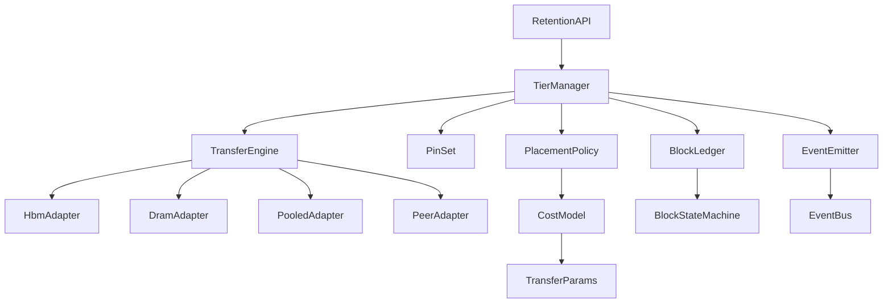
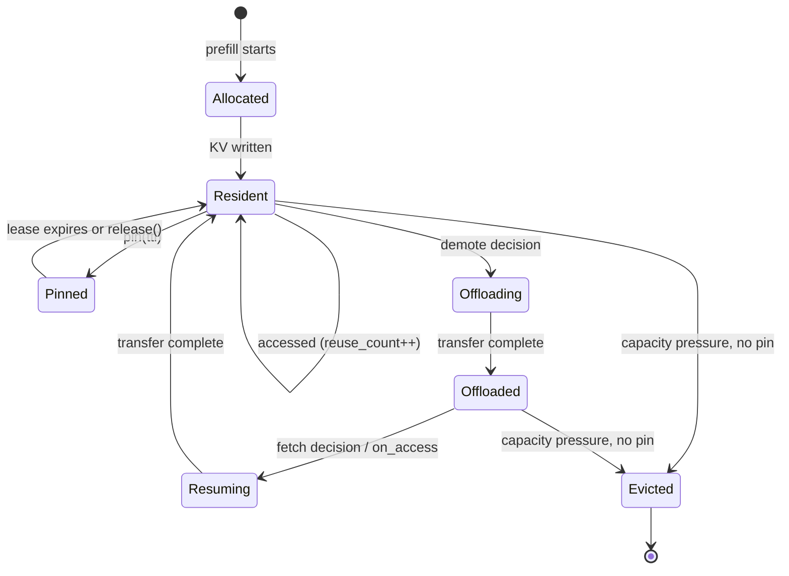
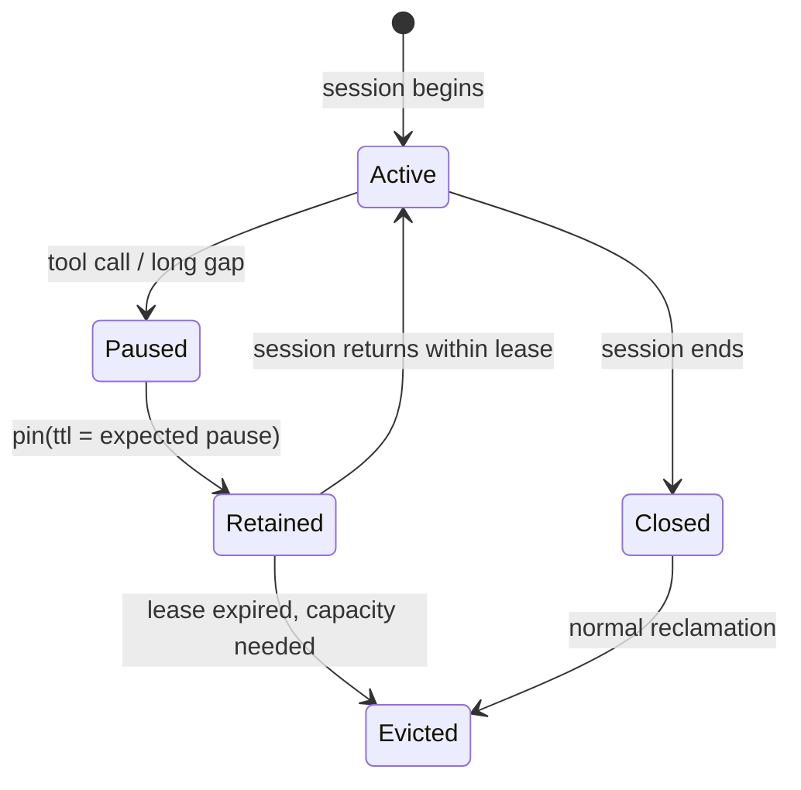

# T12 — Disaggregation & KV transfer: Low-Level Design

> `T12` · **Transcript coverage:** primary · [HLD](HLD.md) · [Sequences](docs/SEQUENCES.md)

## 1. Module Map



| Module | Owns | Never does |
|---|---|---|
| `TierManager` | the block → location map | move bytes itself |
| `PlacementPolicy` | the promote/demote decision | allocate |
| `CostModel` | transfer vs recompute arithmetic | touch a device |
| `TransferEngine` | in-flight transfers | decide |
| `PinSet` | bounded pin leases | outlive a lease silently |
| `BlockLedger` | per-block state and history | emit events for state it did not change |
| `EventEmitter` | the event schema | buffer unboundedly |

`sim/kv_lifecycle.py` and `sim/transfer.py` implement the parts of this that can be
modelled offline. Everything else here is design, not running code.

## 2. Core Data Structures

```python
@dataclass(frozen=True)
class BlockId:
    worker: str          # which prefill/decode worker produced it
    seq_hash: int        # hash of the token prefix this block covers
    index: int           # position within the sequence

@dataclass(frozen=True)
class Tier:
    name: str            # "hbm" | "dram" | "pooled" | "peer"
    bandwidth_gbps: float
    latency_us: float
    capacity_bytes: int
    cost_rank: int       # ordering only; NOT a measurement

@dataclass
class Block:
    id: BlockId
    nbytes: int
    location: str        # a Tier.name
    state: str           # see §4
    session_id: str | None
    lease_until: float | None   # retention pin expiry, monotonic seconds
    last_used: float
    reuse_count: int

@dataclass(frozen=True)
class Event:
    kind: str            # "created" | "evicted" | "moved" | "pinned" | "unpinned"
    block: BlockId
    tier: str
    session_id: str | None
    cause: str           # "decode_done" | "capacity" | "lease_expired" | ...
    ts: float
```

**Invariants.**

1. `Block.location` names a tier that currently holds the bytes — a block is never in two
   tiers, and is never in zero tiers while `state == "resident"`.
2. `lease_until is not None` implies the block must not be evicted for capacity reasons
   before that time.
3. Every state transition appends exactly one `Event`. The ledger is append-only.
4. `BlockId.seq_hash` must be computed over the *token prefix*, not the request id — two
   requests sharing a system prompt must land on the same block id, or nothing is ever
   reused `[D]`.

Invariant 4 is the one that silently fails. A request-id-keyed cache has a 0% hit rate
and an operator who concludes "caching doesn't work for us".

## 3. Interfaces & Contracts

### 3.1 TierManager.place

```
place(block: Block, target_tier: str) -> PlacementResult
```
Moves a block and updates the ledger atomically with respect to the ledger's lock. Returns
the achieved tier, which may differ from the requested one when the target is full and no
demotion candidate exists.

### 3.2 TierManager.on_access

```
on_access(block_id: BlockId) -> Resident | NotFound
```
Called by a decode worker before it begins reading. `NotFound` is not an error — it is a
cache miss, and the caller recomputes.

### 3.3 RetentionAPI.pin

```
pin(session_id: str, blocks: Sequence[BlockId], ttl_s: float) -> PinGrant
release(grant: PinGrant) -> None
```
**Contract:** a pin is a *bounded lease*, not a lock. It expires. `PinGrant` carries the
granted `ttl_s`, which may be shorter than requested if the pin quota is exhausted.

**Why bounded.** An unbounded pin set is indistinguishable from a memory leak, and it
starves the active traffic the cache exists to serve. The quota is the design's answer to
"the agent said it would come back" `[D]`.

### 3.4 EventEmitter.emit

```
emit(event: Event) -> None
```
Must not block the caller. Must drop with a counter on overflow rather than buffer without
bound — a stalled event bus must not stall inference.

**Schema stability.** The router (T14) consumes `created` and `evicted`. Those two kinds
and their fields are a **frozen interface**; adding fields is fine, changing `BlockId`
semantics is a breaking change.

### 3.5 TransferEngine.transfer

```
transfer(block: Block, src: str, dst: str) -> TransferHandle
await(handle) -> TransferResult      # bytes, elapsed, achieved_bw
```
The engine does not choose src/dst. It is the swappable seam: NIXL is one implementation
`[T]`.

## 4. State Machines

### 4.1 KV block lifecycle



**Every transition emits exactly one event**, including `Offloading → Offloaded` (a `moved`
event) and `Resident → Pinned` (a `pinned` event). A block that moves without an event is
a router desynchronisation waiting to happen.

**Note what is *not* here:** there is no `Thrashing` state. Thrash is not a state, it is a
*rate* — the same blocks cycling `Resident → Evicted` repeatedly before reuse. It is
detected by a counter (§10), not modelled as a state `[D]`.

### 4.2 Session return



## 5. Algorithms

### 5.1 KV size

```
kv_bytes_per_token = 2 × layers × kv_heads × head_dim × dtype_bytes
block_bytes        = block_tokens × kv_bytes_per_token
```

### 5.2 Transfer versus recompute

```python
def transfer_seconds(nbytes, tier, direction):
    return (nbytes * 8 / (tier.bandwidth_gbps * 1e9)) + tier.latency_us / 1e6

def recompute_seconds(prompt_tokens, prefill_tokens_per_s):
    return prompt_tokens / prefill_tokens_per_s

def offload_wins(prompt_tokens, nbytes, tier, prefill_tps):
    return recompute_seconds(prompt_tokens, prefill_tps) > (
        transfer_seconds(nbytes, tier, "down") + transfer_seconds(nbytes, tier, "up"))
```

**Complexity.** O(1). The interesting part is not the arithmetic, it is the *input*: the
pause length is unknown at pin time, so the policy pins for the *expected* pause and
accepts that a session returning later than its lease re-prefills.

### 5.3 Break-even pause

```python
def break_even_seconds(prompt_tokens, nbytes, tier, prefill_tps):
    """Pause beyond which offload+reload is cheaper than recompute. O(1)."""
    return max(0.0, recompute_seconds(prompt_tokens, prefill_tps)
               - (transfer_seconds(nbytes, tier, "down") + transfer_seconds(nbytes, tier, "up")))
```

`run.py` §2 tabulates this across tiers and prompt lengths. It is the number that decides
whether the offload tier earns its capacity.

### 5.4 P:D ratio

```python
def pd_ratio(prefill_share, decode_share, prefill_tps, decode_tps):
    """Counts, not a ratio string. O(1). prefill_share/decode_share are workload mix."""
    p = prefill_share / prefill_tps
    d = decode_share / decode_tps
    total = max(p + d, 1e-9)
    return round(N * p / total), round(N * d / total)
```

This is deliberately a **function of the workload**, because the corpus's finding is that
the best ratio changes with the mix and that no single ratio wins `[T]`. `run.py` §3 sweeps
the mix and shows the ratio moving.

### 5.5 Eviction choice

Deterministic order; ties broken by block id so behaviour is reproducible:

1. blocks whose lease has expired (oldest `last_used` first);
2. unpinned blocks with `reuse_count == 0` (never reused — evicting these is not thrash);
3. unpinned blocks by LRU.

Rule 2 matters: evicting a never-reused block is the *correct* outcome, and a thrash alarm
that fires on it is a noisy alarm.

## 6. Concurrency & Locking

| Shared thing | Protection | Why |
|---|---|---|
| Block ledger | one writer per block; global map under a sharded lock | the map is hot; a single lock serialises decode |
| Placement decision | compare-and-set on `Block.location` | concurrent promote/demote must not both win |
| Pin set | the pin quota is the contention point | over-granting silently degrades to unbounded |
| Event bus | lock-free enqueue, bounded | inference must not block on telemetry |

**The deadlock to avoid.** `pin()` must never take the ledger lock while holding the quota
lock if `evict()` takes them in the opposite order. The stated order is
**quota → ledger**, everywhere, and it is asserted in tests.

## 7. Error Handling

| Condition | Behaviour | Rationale |
|---|---|---|
| Target tier full, no eviction candidate | return the lower tier; do not fail the request | availability over placement optimality |
| Transfer fails mid-flight | block becomes `Evicted`; emit `evicted` with `cause="transfer_failed"` | the router must learn the block is gone |
| Event bus full | drop + increment `events_dropped` | never block decode |
| Pin requested beyond quota | grant a shorter TTL, report it | an unreported short grant is a lie to the caller |
| `on_access` misses a block the ledger says is resident | treat as a miss, emit a `ledger_desync` counter | the ledger is cache state; it must never be authoritative over reality |
| Pooled memory unreachable | demote tier to DRAM; re-evaluate pins | graceful degradation of capacity, not of correctness |

The fifth row is the important one: **the ledger is a hint, not the truth.** A decode worker
that reads KV must be prepared for the bytes not to be there.

## 8. Resource Accounting

```
tier_capacity   = Σ over tiers (capacity_bytes)
resident_bytes  = Σ over resident blocks
pinned_bytes    = Σ over pinned blocks
headroom        = tier_capacity - resident_bytes
pin_quota       = pin_fraction × tier_capacity          # default 0.10 [D]
```

A tier is over-subscribed when `resident_bytes / tier_capacity > high_watermark` (default
0.90 `[D]`). Over-subscription triggers demotion, never rejection — a rejected request is a
user-visible failure; a demoted block is a latency cost.

## 9. Configuration Surface

| Key | Default | Tuning order | Notes |
|---|---|---|---|
| `prefill_workers` | workload-derived | 1 | from §5.4; sweep, don't guess |
| `decode_workers` | workload-derived | 1 | |
| `block_tokens` | 16 | 4 | smaller blocks = better reuse granularity, more metadata |
| `pin_fraction` | 0.10 | 3 | raise only with measured session-return data |
| `pin_ttl_default_s` | 300 | 3 | must exceed the median tool-call pause |
| `tier_high_watermark` | 0.90 | 2 | |
| `offload_enabled` | true | 2 | turn off to measure recompute cost directly |
| `transfer_library` | `nixl` | 5 | the swappable seam; a library, not a topology `[T]` |

**Tuning order.** Fix the P:D split first (§5.4), because it changes the load each pool
sees. Then the offload decision (§5.2), which changes what the tiers must hold. Only then
the pin quota, which competes with active traffic for the same capacity.

## 10. Observability Hooks

| Hook | Type | Alarm condition |
|---|---|---|
| `kv_blocks_created_total` | counter | — (baseline) |
| `kv_blocks_evicted_total` | counter | — (baseline) |
| `kv_events_dropped_total` | counter | **> 0 sustained** — the router is now stale |
| `kv_thrash_rate` | derived | evictions of blocks with `reuse_count >= 1` before reuse exceeds a threshold `[D]` |
| `kv_tier_bytes{tier}` | gauge | headroom below 10% |
| `kv_pin_quota_utilisation` | gauge | approaching 1.0 — pins are crowding out active traffic |
| `kv_pin_efficiency` | derived | redeemed leases ÷ granted leases. **Falling** while hit rate is flat means the quota is being spent on sessions that never return — the measured form of over-pinning (`sim/kv_lifecycle.py`) |
| `kv_transfer_seconds{tier}` | histogram | p99 exceeding the recompute time for the same prompt |
| `kv_ledger_desync_total` | counter | **> 0** — the ledger is wrong and everything downstream is unreliable |

**`kv_events_dropped_total` is the single most important metric on this list.** It is the
only signal that the router's view has silently diverged from reality, and it is upstream
of every routing decision (T14) that follows.

`kv_thrash_rate` deliberately excludes `reuse_count == 0` evictions: a never-reused block
being evicted is the policy working, not failing.

## 11. Test Strategy

| Level | What it proves |
|---|---|
| Unit | `transfer_seconds` / `recompute_seconds` monotonicity; break-even sign changes at the predicted prompt length |
| Unit | every state transition appends exactly one event |
| Unit | pin quota never over-granted; leases expire deterministically |
| Property | for any access sequence, hit rate under a generous pin quota ≥ hit rate under a zero quota |
| Property | ledger and a ground-truth map never diverge unless `ledger_desync` incremented |
| Integration | kill the event bus: decode continues, `events_dropped` rises, no request fails |
| Integration | fill the tier past the high watermark: demotion happens, no rejection |
| Integration | session returns inside its lease: zero re-prefill tokens measured; outside: re-prefill happens and is *expected*, not an error |
| Chaos | drop the pooled tier mid-session: demotion to DRAM, no correctness loss |
| Load | sweep the prompt:output mix and confirm the P:D ratio from §5.4 tracks the observed bottleneck |

The last one is the honest test: it does not assert a particular ratio, it asserts that the
ratio *moves with the workload*, which is what the corpus says happens `[T]`.

## 12. What This Blueprint Deliberately Does Not Decide

- **The transfer library.** NIXL is named in the corpus and is one supported option among
  several on ROCm `[T]`. Pinning it here would be a topology decision disguised as an
  implementation detail.
- **The 2P4D ratio.** Preliminary, and disclaimed by the speaker `[T]`.
- **Whether the pooled tier is worth its cost.** That is a CAPEX question answered by §5.3
  on real pause distributions, not by a blueprint.

## Sources

- `refs/vLLM_Inference_Meetup_Bengaluru_2026_transcripts/Scaling_Agentic_AI_Distributed_Inference_with_llm-d.txt`
  — per-request KV create and evict events as router input; CPU KV offloading; precise
  versus approximate prefix cache routing; peer-to-peer KV fetch; 2P2D vs 3P1D workload
  dependence; the KV cache retention API (NVIDIA PR, not shipped) and session metadata.
- `refs/vLLM_Inference_Meetup_Bengaluru_2026_transcripts/Distributed_Inference_on_ROCm_with_WideEP_on_vLLM_llm-d.txt`
  — KV transfer engine (GPU-initiated, read and write modes); RDMA transfer; NIXL as one
  library among several; 1P1D/2P2D nightly policies; 2P4D preliminary and explicitly not
  to be trusted for performance.
- `refs/Agentic_AI_Infra_transcripts_2/Jongryool_Kim_-_Disaggregated_LLM_Serving_with_Shared_Memory_KV_Cache_at_Rack_Sc.txt`
  — **vendor talk**: pooled-memory modes, rack-scale shared-address-space KV transfer,
  prefill continuing through decode-side OOM, PCIe contention removal, and the speaker's
  own "very initial" framing of the numbers.
