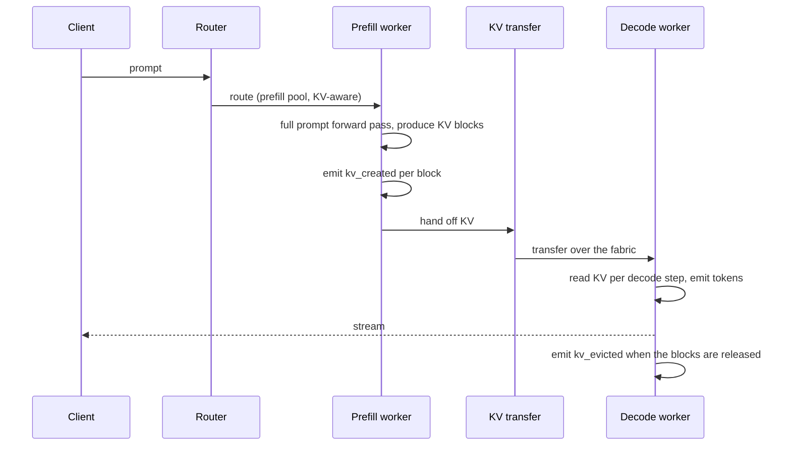
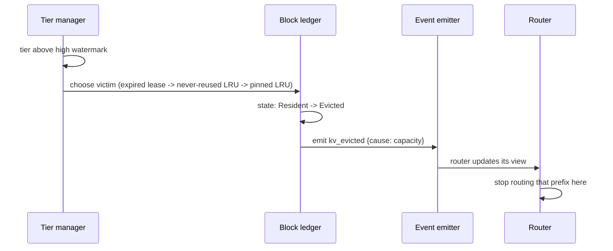
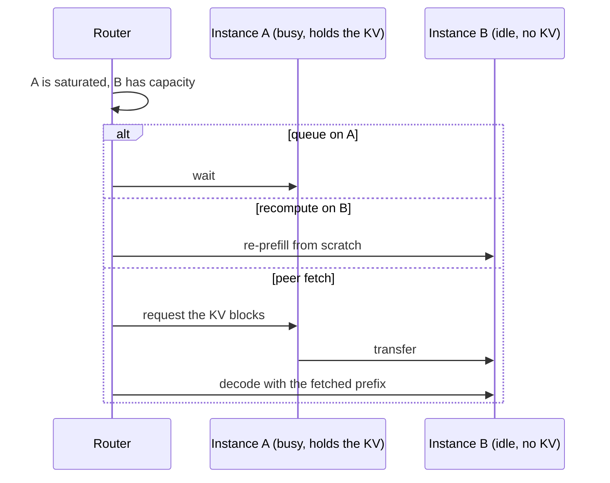
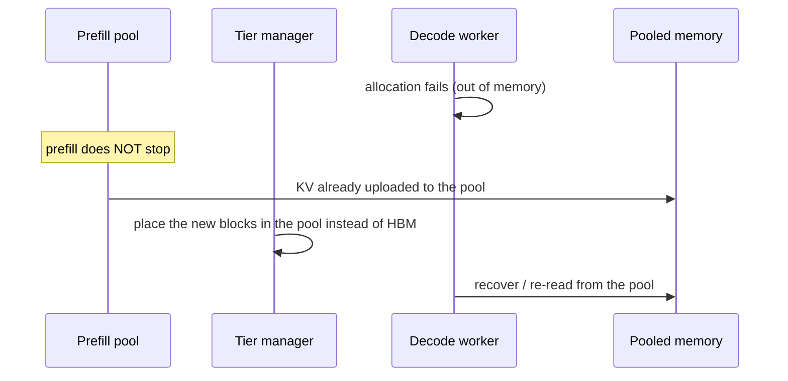

# T12 — End-to-end sequences

> `T12` · **Transcript coverage:** primary · [HLD](../HLD.md) · [LLD](../LLD.md)

Seven flows. Each has a diagram, prose per step, and a **Where it fails** block — because
the failure mode in a disaggregated system is almost always a *silent* one: nothing throws,
a number just quietly stops being true.

| # | Flow | The failure it exposes |
|---|---|---|
| 1 | Request through a 1P1D pair | the transfer is on the critical path |
| 2 | Session pauses (tool call) | whether the KV is retained or discarded |
| 3 | Session returns | the offload-vs-recompute decision |
| 4 | Eviction under capacity pressure | eviction is normal; thrash is not |
| 5 | Peer fetch when the local pool is full | the third option between queue and recompute |
| 6 | Decode-side OOM | prefill continues because the KV is already elsewhere |
| 7 | Event bus failure | the router goes stale with no error |

---

## 1. A request through a 1P1D pair



**Step by step.** Prefill is a single compute-bound pass; decode is a bandwidth-bound loop
that re-reads KV per token `[T]`. Separating them lets each pool be sized for its own
bottleneck. The transfer sits between them and is on the request's critical path — the
first decode token cannot be produced until the KV arrives.

**Where it fails.**

- *Transfer slower than the prefill it replaced.* Then disaggregation is a net loss. The
  crossover is a bandwidth (LLD §5.2): below it, recompute wins and the split should not be
  used for that workload.
- *Router routes the decode half to a different instance than the prefill half sent to.*
  The KV is never found and the request silently re-prefills — twice the work, correct
  answer, invisible.

---

## 2. Session pauses for a tool call

```mermaid
sequenceDiagram
    participant S as Agent session
    participant D as Decode worker
    participant T as Tier manager
    participant Tier as Pooled memory / DRAM
    S->>D: turn complete, calling a tool
    D->>D: emit kv_evicted (session idle)
    alt offload enabled
        D->>T: place(blocks, target=pooled|dram)
        T->>Tier: move blocks
        T->>T: pin(session, blocks, ttl)
        T->>T: emit kv_moved + kv_pinned
    else offload disabled
        D->>D: free the blocks
        Note over D: the prefix is gone; return will re-prefill
    end
```

**Step by step.** An agentic session pauses constantly — it calls a tool and comes back `[T]`.
Whether the KV survives that pause is the difference the corpus measures as up to **5×
better TTFT on return** `[T]`. The pin is a bounded lease: it must be, or an agent that
never returns holds capacity forever.

**Where it fails.**

- *Unbounded retention.* "Keep everything warm" starves active traffic. `run.py` §5 shows
  the pin quota sweep where raising the quota *lowers* the hit rate.
- *Pin lease shorter than the pause.* The block is evicted mid-tool-call and the return
  re-prefills. The lease default must exceed the measured median pause (LLD §9).
- *No session metadata on the block.* The system cannot tell which session owns a block, so
  it cannot pin the right ones. This is exactly what the unshipped retention API adds `[T]`.

---

## 3. Session returns

```mermaid
sequenceDiagram
    participant S as Agent session
    participant R as Router
    participant T as Tier manager
    participant D as Decode worker
    S->>R: new turn, same session
    R->>T: on_access(prefix blocks)
    alt still resident
        T-->>R: Resident
        R->>D: decode with the existing prefix
        Note over D: no re-prefill; this is the 5x case [T]
    else offloaded
        T->>D: fetch + reload (cost = 2 x transfer)
        D->>D: compare against recompute
    else evicted
        T-->>R: NotFound
        R->>D: re-prefill from scratch
    end
```

**Step by step.** Three outcomes, and the design must handle all three without treating any
of them as an error. `NotFound` is a cache miss, not a fault.

**Where it fails.**

- *Treating a miss as an exception.* A decode worker that errors on a missing prefix turns a
  performance event into an availability event.
- *Fetching when recompute would be cheaper.* Below the crossover bandwidth the fetch costs
  more than the prefill it saves (LLD §5.2). This is a real, common misconfiguration on
  slow tiers.
- *The ledger says resident, the bytes are gone.* The ledger is a hint. The worker must
  still handle the miss — see the `ledger_desync` counter in LLD §10.

---

## 4. Eviction under capacity pressure



**Step by step.** Eviction is a **normal, evented lifecycle stage** `[T]`. The victim order
matters: a block whose lease expired first, then a block that has never been reused, then
LRU among pinned blocks (which should never happen).

**Where it fails.**

- *Silent eviction.* A block that moves without an event desynchronises the router. The
  symptom is a hit rate that quietly collapses — no error anywhere.
- *Calling eviction "rampant".* Eviction being frequent is not the defect. The defect is
  **thrash**: blocks evicted after proving reusable, cycled repeatedly before their next
  use. `run.py` §4-5 measures exactly that distinction, and `thrash_rate` deliberately
  excludes never-reused evictions so the alarm is not noise.

---

## 5. Peer fetch when the local instance is full



**Step by step.** The corpus describes this explicitly as the **middle ground** between
queueing on a busy instance and recomputing on an idle one: fetch the KV from the instance
that already has it `[T]`. It is the option most teams do not implement, and it is often
the cheapest.

**Where it fails.**

- *Fetch storms.* Many idle instances fetching from one saturated holder turns a compute
  problem into a fabric problem on the busiest node.
- *No cost comparison.* Peer fetch is only the middle ground when the transfer beats the
  recompute *and* the queue wait. Without the §5.2 comparison it is a guess.

---

## 6. Decode-side OOM



**Step by step.** This is the corpus's reliability argument for the pooled tier: because the
KV was uploaded to the pool, a decode-side or prefill-side out-of-memory does not stop
prefill — the work is not lost `[T]`. The pool is what makes the failure survivable.

**Where it fails.**

- *Pool unreachable during the incident.* Then this is a cache-miss storm, not a graceful
  degradation. The demotion path to DRAM must exist and must be exercised.
- *Treating the pool as unbounded.* It is a tier with a capacity like any other; oversubscribing
  it converts a decode-side OOM into a pool-side OOM.

---

## 7. Event bus failure

```mermaid
sequenceDiagram
    participant E as Event bus
    participant T as Tier manager
    participant R as Router
    E--xT: bus unavailable
    T->>T: drop events, increment events_dropped
    Note over T: inference continues; telemetry must never block it
    R->>R: view is now stale
    R->>R: routes to blocks that are gone
    Note over R: requests recompute; no error, hit rate falls
```

**Step by step.** The tier manager must never block inference on telemetry — so it drops
events and counts them. That is the right call for availability and the wrong one for
routing, and the counter is the only way to know the second thing happened.

**Where it fails.**

- *No `events_dropped` counter.* Then the desynchronisation is undetectable, and the
  investigation goes to the model, the fabric, and the scheduler before anyone suspects
  the router's view.
- *Reconnecting without resynchronising.* The bus comes back; the router's view does not.
  A reconnect must trigger a full ledger resync, not just resume the stream.

---

## The thread running through all seven

Every flow has one step that is **silent when it breaks**: the transfer sitting on the
critical path (1), a lease shorter than the pause (2), a miss treated as an error (3), a
move without an event (4), a fetch with no cost comparison (5), an unreachable pool (6),
and a router whose view quietly diverged (7). The observability hooks in LLD §10 are
attached to those steps specifically — `kv_events_dropped_total` first among them, because
it is the only one that tells you the router is wrong rather than the system being slow.

## Sources

- `refs/vLLM_Inference_Meetup_Bengaluru_2026_transcripts/Scaling_Agentic_AI_Distributed_Inference_with_llm-d.txt`
  — prefill/decode disaggregation and KV transfer between the pools via NIXL; per-request
  KV create **and** evict events consumed by the router; precise versus approximate prefix
  routing; CPU KV offload giving up to ~5× TTFT on session return; peer-to-peer KV fetch as
  the middle ground between queueing and recomputing; 2P2D versus 3P1D workload dependence;
  the KV retention API (an NVIDIA PR, not shipped) and session metadata on blocks.
- `refs/vLLM_Inference_Meetup_Bengaluru_2026_transcripts/Distributed_Inference_on_ROCm_with_WideEP_on_vLLM_llm-d.txt`
  — the P/D split motivation (prefill compute-bound, decode memory-bound); KV transfer over
  RDMA; a GPU-initiated transfer engine with read and write modes; NIXL as one library
  among several; 1P1D/2P2D nightly policies; 2P4D preliminary and explicitly disclaimed.
- `refs/Agentic_AI_Infra_transcripts_2/Jongryool_Kim_-_Disaggregated_LLM_Serving_with_Shared_Memory_KV_Cache_at_Rack_Sc.txt`
  — **vendor talk (SK hynix)**: pooled memory in pooling and sharing modes; a four-server
  rack demo transferring KV from prefill to decode through the pool; KV retained in the
  pool and reused without an additional store; prefill continuing while a side is out of
  memory; PCIe contention removed; the speaker's own "very initial" framing.
