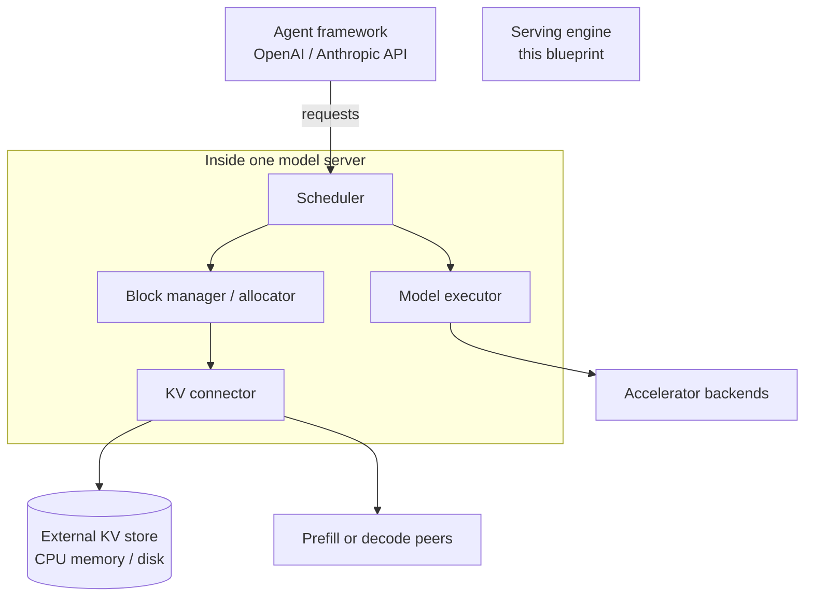
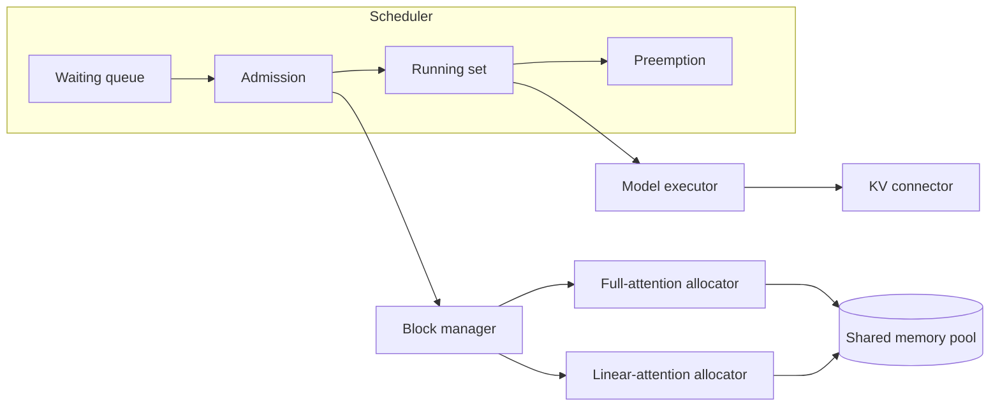

# T13 — Serving engines: High-Level Design

> `T13` · **Transcript coverage:** primary · [LLD](LLD.md) · [Sequences](docs/SEQUENCES.md)

## 1. Problem & Scope

A serving engine is not a wrapper around a model. It is the layer that turns a fixed piece
of hardware into a *policy* over three resources: accelerator memory, the batch, and the
parallelism topology. When the workload shifts — and it shifts continuously — the engine is
what either absorbs the shift or exposes it to the user.

The corpus frames the shift precisely: agents have changed the inference problem along
**three axes** `[T]`:

1. **Large models.** Frontier agent models are trillion-parameter, which makes model
   parallelism a necessity rather than an optimisation.
2. **Long context.** Sessions run for hundreds of turns, up to a million tokens, and the
   context only grows. Recomputing previous turns is pure waste.
3. **Enormous token demand.** Demand is effectively unbounded and growing faster than GPU
   supply, so the engine must extract tokens from whatever hardware is available.

**In scope.** The engine's internal architecture: the paged KV allocator (and specifically
the dynamic partitioning a hybrid model requires), the iteration-level scheduler, the KV
connector abstraction, the parallelism surface, and the hardware-backend plug-in structure.

**Out of scope.** The cross-node topology planning (T11), the prefill/decode pool split and
KV tiering (T12), and the gateway above the engine (T14). T13 is what happens *inside* one
model server.

**The single design question.** How does the engine keep its memory and scheduling
decisions correct when the workload that determines them keeps changing?

## 2. Requirements

### Functional

| id | Requirement |
|---|---|
| F1 | Serve both offline batch and online OpenAI/Anthropic-compatible endpoints |
| F2 | Page the KV cache so memory is allocated in blocks, not per-sequence spans |
| F3 | Partition memory dynamically between attention types with different growth behaviour |
| F4 | Admit work at iteration granularity, not batch granularity |
| F5 | Move idle KV out to external memory (CPU/disk) and bring it back |
| F6 | Expose a parallelism surface covering the decompositions the model needs |
| F7 | Support more than one hardware backend without forking the core |

### Non-functional

| id | Requirement | Target | Note |
|---|---|---|---|
| N1 | Memory must not be reserved for a consumer that is idle | 100% of pool lendable | the dynamic-partitioning claim `[T]` |
| N2 | Scheduling decisions at iteration granularity | no slot held for a retired sequence | continuous batching `[T]` |
| N3 | A turn already prefilled must never be recomputed | 0 recomputed tokens | while storage allows `[T]` |
| N4 | Parallelism is tunable per model/cluster/workload | no compiled-in topology | "no universal winner" `[T]` |
| N5 | The core is shared across backends | plug-in boundary, not a fork | 10+ backends `[T]` |
| N6 | Rejection is observable | every refusal is a counter | else capacity errors look like latency `[D]` |

## 3. System Context



The API surface is the stable part — the corpus is explicit that the agent-facing API today
looks much like it did a few years ago, and that **everything underneath it is what
changed** `[T]`. This blueprint is about the underneath.

## 4. Container View

| Container | Responsibility | State it owns |
|---|---|---|
| API front end | request intake, streaming, both API dialects | none |
| Scheduler | admission, preemption, iteration-level batching | the waiting/running queues |
| Block manager | paged allocation across attention types | the block table |
| Model executor | the forward pass, kernels, parallelism groups | weights, activations |
| KV connector | movement of KV to/from external memory and peers | in-flight transfers |
| Backend plug-in | device-specific kernels and collectives | device handles |

The block manager is the component this blueprint spends the most words on, because it is
where the hybrid-attention problem lands and where a wrong abstraction is expensive to
change later.

## 5. Component View



**The shared pool with two allocators is the central structural decision.** Full attention
grows linearly with context and wants many small blocks; linear attention keeps a
fixed-size state per sequence and wants one large block for the whole sequence. A single
allocator cannot serve both without either wasting memory or fragmenting. Giving each type
its own allocator over one pool lets the engine rebalance without a restart `[T]`.

## 6. Data Flow

```
request ──► scheduler (admit this iteration?)
              │
              ├─ no  ──► waiting queue  (observable: rejection / queue depth)
              │
              └─ yes ──► block manager
                            ├─ full-attention blocks: ceil(ctx / tokens_per_block)
                            └─ linear-attention block: one per sequence, fixed
                                  │
                            model executor (one iteration)
                                  │
                            token emitted ──► stream to client
                                  │
                            sequence finished?
                                  ├─ no  ──► stays in the running set
                                  └─ yes ──► blocks released
                                                │
                                          KV connector: keep, offload, or drop
```

The decision point that matters is at the bottom: **released is not the same as discarded**
`[T]`. For a long-lived intermittent agent session the block manager hands the KV to the
connector, which may park it in external memory rather than freeing it.

## 7. Deployment Topology

| Unit | Composition | Why |
|---|---|---|
| Model server | N accelerators + engine process | the unit users think in |
| Parallelism group | TP group, node-local | see T11 |
| Backend plug-in | per-device build of the same core | 10+ backends `[T]` |

The engine deliberately does not own the cross-server topology. It exposes a parallelism
surface; deciding what to put on it is T11's job.

## 8. Scaling Strategy

| Signal | Action | Constraint |
|---|---|---|
| queue depth rising, pool has room | raise the batch size | memory per sequence |
| pool exhausted, queue rising | lower max context, or cap per-sequence share | long requests lose |
| linear-partition pressure | rebalance the shared pool automatically | dynamic partitioning `[T]` |
| more hardware available | add a backend plug-in, not a fork | N5 |

**Rejection versus queueing is a policy choice, not an implementation detail.** The
simulation in `run.py` §4 shows the same pool admitting 41 or 57 requests depending only on
the per-sequence cap — and the difference is entirely who is refused.

## 9. Failure Domains & Degradation

| Failure | Blast radius | Response |
|---|---|---|
| Pool exhausted | new admissions refused | shed by policy; never OOM the process |
| One very long sequence | the whole server's latency | per-sequence cap (LLD §5.5) |
| KV connector unreachable | external tier only | keep KV local or drop it; requests still serve |
| Backend plug-in fault | that device | fail the group, not the fleet |
| Preemption storm | throughput | preemption is a normal scheduler act, but its RATE is the alarm |

**Preemption is normal; a preemption storm is not.** The same discipline as T12's eviction:
the act is part of the design, the *rate* is the signal. A scheduler that preempts
constantly is not "handling pressure", it is thrashing the batch.

## 10. Capacity Model

All arithmetic `[D]`; parameters visible in `sim/allocator.py` and printed by `run.py`.

```
full-attention blocks per sequence = ceil(ctx_tokens / tokens_per_block)
linear-attention blocks per sequence = 1 fixed-size state, independent of ctx

pool blocks = (KV budget bytes) / (tokens_per_block x kv_bytes_per_token)
```

With `tokens_per_block = 16` and a hybrid model whose linear state is modelled at 24
blocks, a 1024-block pool gives:

| Workload | Requests admitted (best static) | Requests admitted (dynamic) |
|---|---|---|
| short chat | 154 | **175** |
| mixed | 71 | **75** |
| long doc | 22 | **24** |

and the **best static split itself moves** — 65% for short chat, 80% for mixed and long
doc. That movement is the whole argument: a fixed split is a bet on a workload mix that
will change.

**Note on the numbers.** These are simulation outputs from a model whose coefficients are
stated in the source. They are not measurements, and the *direction* is the claim, not the
magnitude.

## 11. Key Design Decisions

| # | Decision | Alternatives | Why |
|---|---|---|---|
| D1 | One shared pool, one allocator per attention type | static percentage split | the optimum split moves with batch size and context length `[T]` |
| D2 | Paged blocks, not contiguous spans | contiguous per-sequence | reuse at block granularity; enables prefix sharing |
| D3 | Iteration-level admission | static batched groups | a slot is never held for a retired sequence `[T]` |
| D4 | KV connector as an abstraction | direct calls to one store | must work with third-party stores and with PD disaggregation `[T]` |
| D5 | Parallelism is configuration | compiled-in topology | no universal winner `[T]` |
| D6 | Backend as a plug-in sharing the core | per-device forks | the API is standard; only the kernels differ `[T]` |
| D7 | Admission control is explicit and separate | implicit in the scheduler | §8 — otherwise the policy is whatever happens |
| D8 | Released ≠ discarded | free on completion | agent sessions are intermittent and come back `[T]` |

## 12. Build vs Buy

**Buy (or adopt):** the engine itself. The corpus is blunt that this is a large, highly
collaborative open-source effort with contributions from multiple major vendors `[T]`, and
that bringing up new hardware "still requires retaking the entire inference stack from
ground up" `[T]`. Rewriting it is not a differentiator; it is a multi-year detour.

**Build:** the *policy* around it — the parallelism configuration for your model and
cluster, the admission rule, the retention policy for your session shapes, and the
observability that makes a rejection visible.

The corpus's own note that bringing up new hardware is getting easier *because of coding
agents* `[T]` is worth quoting precisely: it is a claim about the cost curve moving, not a
claim that the work has gone away.

## Sources

- `refs/Agentic_AI_Infra_transcripts_2/Woosuk_Kwon_-_vLLM_Building_Open_and_Efficient_Inference_for_Agents.txt`
  — the three axes agents changed inference along (large models, long context, token
  demand); the two usage modes (offline `LLM` class and `vllm serve`); seven kinds of
  parallelism including decode context parallelism around the KV cache; the tuned
  DeepSeek-Pro B200 prefill configuration against the naive 8-way TP baseline and why each
  parallel dimension earned its place; **"there's no universal winner"**; hybrid attention
  (full plus sliding-window/linear such as KDA) with different memory behaviour; the
  dynamic-partitioning shared pool with per-attention-type allocators; the KV connector for
  parking idle KV in CPU memory or disk, working with third-party stores and with prefill
  disaggregation, so previous turns are never recomputed while storage allows; the token
  economics flip; 10+ hardware backends with a plug-in structure; and that bringing up new
  hardware still requires retaking the whole stack.
- `refs/vLLM_Inference_Meetup_Bengaluru_2026_transcripts/Distributed_Inference_on_ROCm_with_WideEP_on_vLLM_llm-d.txt`
  — the same engine's parallelism surface exercised on a second hardware backend, and the
  "distributed inference is a communication and memory problem, not a computation problem"
  framing.
