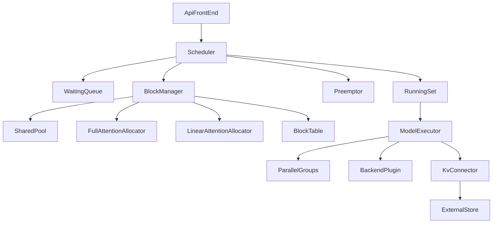
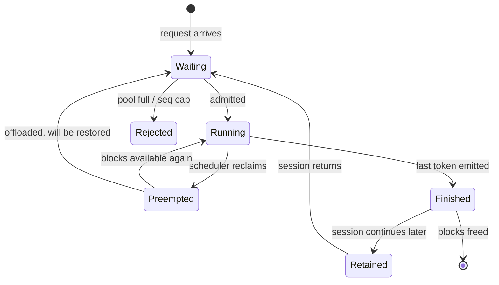
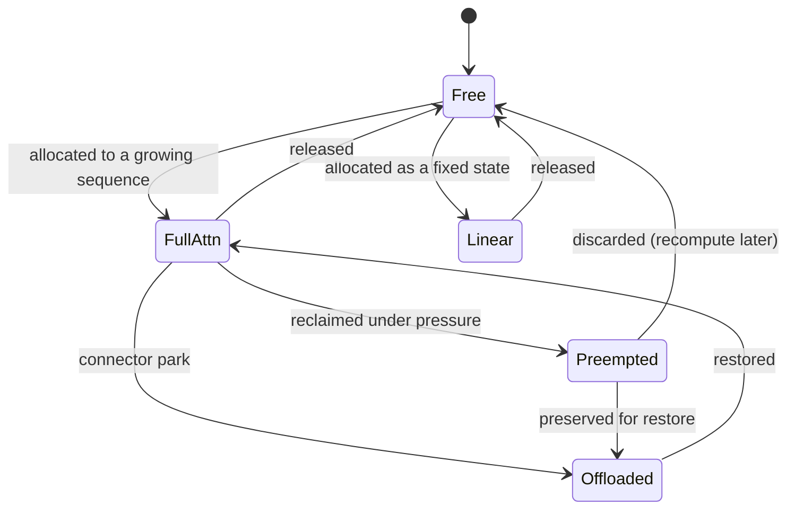

# T13 — Serving engines: Low-Level Design

> `T13` · **Transcript coverage:** primary · [HLD](HLD.md) · [Sequences](docs/SEQUENCES.md)

## 1. Module Map



| Module | Owns | Never does |
|---|---|---|
| `Scheduler` | the admission decision | allocate memory |
| `BlockManager` | the block table | decide who runs |
| `SharedPool` | free-block accounting | know about attention types |
| `FullAttentionAllocator` | growth proportional to context | reserve capacity |
| `LinearAttentionAllocator` | the fixed state per sequence | grow with context |
| `Preemptor` | victim selection and recompute policy | silently drop KV |
| `KvConnector` | movement to/from external tiers | own the retention policy |
| `BackendPlugin` | device kernels and collectives | fork the core |

`sim/allocator.py` and `sim/scheduler.py` implement the parts of this that can be modelled
offline. The executor and the plug-in boundary are design, not running code.

## 2. Core Data Structures

```python
@dataclass(frozen=True)
class BlockId:
    pool_index: int
    tier: str = "hbm"          # the connector may relocate the block

@dataclass
class BlockTable:
    """Per-sequence mapping from logical position to physical blocks."""
    seq_id: int
    full_blocks: list[BlockId]      # grows with context
    linear_block: BlockId | None    # ONE block, fixed size, independent of context

@dataclass(frozen=True)
class AttentionSpec:
    name: str                 # "full" | "linear" | "sliding_window"
    grows_with_context: bool
    blocks_for: Callable[[int], int]   # ctx_tokens -> blocks

@dataclass
class Sequence:
    seq_id: int
    ctx_tokens: int
    generated: int
    state: str                # WAITING | RUNNING | PREEMPTED | FINISHED
    table: BlockTable
    session_id: str | None    # for retention across turns

@dataclass(frozen=True)
class AdmissionDecision:
    admit: bool
    reason: str               # "fits" | "pool_full" | "seq_cap" | "preempted"
```

**Invariants.**

1. A sequence's `full_blocks` count equals `ceil(ctx_tokens / tokens_per_block)` — the
   block table is derived, never independently maintained.
2. A sequence has at most one `linear_block`, and its size does not vary with context. That
   asymmetry is the reason the two allocators exist `[T]`.
3. `pool.free >= 0` at all times. An allocator that cannot satisfy a request returns a
   refusal; it never over-commits.
4. Every refusal produces an `AdmissionDecision` with a reason. A refusal without a reason
   is unobservable, and unobservable rejections are how a capacity problem is
   misdiagnosed as a latency problem `[D]`.
5. A `PREEMPTED` sequence's blocks are either reclaimed or offloaded through the connector —
   never leaked.

## 3. Interfaces & Contracts

### 3.1 Scheduler.step

```
step() -> list[Sequence]        # the sequences to run in this iteration
```
Runs once per model iteration. Retires finished sequences, admits from the waiting queue,
optionally preempts. **The contract is that no slot is held for a sequence that has
finished** — that is what separates continuous from static batching.

### 3.2 BlockManager.allocate

```
allocate(seq: Sequence, additional_tokens: int) -> AllocResult
```
Returns either the new blocks or a refusal with a reason. Does not block, does not retry,
does not evict on its own — eviction is the preemptor's decision, because it has
consequences the block manager cannot see (a preempted sequence may need recomputation).

### 3.3 BlockManager.release

```
release(seq: Sequence, policy: str) -> None
# policy in {"free", "offload", "retain_for_session"}
```
This is decision D8 in the HLD: completion is not the same as disposal. `retain_for_session`
hands the blocks to the connector rather than returning them to the pool.

### 3.4 KvConnector

```
save(blocks, target_tier) -> Handle
load(block_ids) -> Handle | NotFound
```
Mirrors T12's contract deliberately: the engine should not know which store is behind it,
and the corpus's design point is that the same abstraction serves an external store, a
third-party KV store, and prefill disaggregation `[T]`.

### 3.5 ParallelGroups

```
build(model: ModelSpec, cluster: ClusterSpec, workload: WorkloadSpec) -> Config
```
Advisory, not automatic. The engine can *express* any decomposition; choosing one needs a
performance model the engine does not have `[T]`.

## 4. State Machines

### 4.1 Sequence lifecycle



**`Preempted → Waiting` with offload is the option most implementations skip.** Dropping a
preempted sequence's KV means its next admission re-prefills the whole context — expensive
and invisible.

### 4.2 Block lifecycle within the pool



There is no `Reserved-for-type` state, and that absence is the design: a block is never
earmarked for an attention type it is not currently serving `[T]`.

## 5. Algorithms

### 5.1 Block demand

```python
def full_blocks(ctx_tokens, tokens_per_block=16) -> int:
    return max(1, ceil(ctx_tokens / tokens_per_block))

def linear_blocks(ctx_tokens, per_seq_blocks=24) -> int:
    return per_seq_blocks          # independent of ctx_tokens -- that is the point
```

### 5.2 Admission

```python
def can_admit(seq, pool, max_seq_share) -> AdmissionDecision:
    if seq.full_blocks > pool.total * max_seq_share:
        return AdmissionDecision(False, "seq_cap")
    if pool.free() < seq.total_blocks:
        return AdmissionDecision(False, "pool_full")
    return AdmissionDecision(True, "fits")
```

O(1). The `seq_cap` branch is the one that is usually missing, and it is the branch that
decides whether one long sequence defines everyone's latency (`run.py` §4).

### 5.3 Continuous batching

Per iteration: retire → admit → run. The static alternative groups sequences and holds the
slot until the group's longest member finishes. Modelled in `sim/scheduler.py`; the measured
difference is a makespan 1.5–2.4× shorter and slot utilisation roughly doubled.

### 5.4 Preemption

Deterministic victim order:

1. the sequence with the most blocks and the least progress (largest reclaim, smallest
   loss of work);
2. ties by arrival order, so behaviour is reproducible;
3. never a sequence already preempted once this iteration — that is a preemption storm in
   the making.

### 5.5 Dynamic pool rebalancing

The two allocators share one pool, so the "split" is emergent rather than declared. The
rebalance is implicit: whichever allocator asks first gets the block, and a refusal is a
refusal regardless of type. The alternative — declared reservations — is what `run.py` §2
measures as fragmentation.

**Complexity.** Allocation and release are O(1) with a free list; the block table append is
O(1) amortised.

## 6. Concurrency & Locking

| Shared thing | Protection | Why |
|---|---|---|
| free-block list | per-pool lock, held briefly | it is touched every iteration by every sequence |
| block table | per-sequence, single writer | a sequence's own scheduler step is its only writer |
| waiting queue | the scheduler's own thread | one scheduler per engine process |
| connector handles | per-transfer handle table | transfers outlive the iteration that started them |
| device streams | per-parallel-group | collectives must not interleave across groups |

**The rule that keeps this simple: one scheduler thread.** Parallelising admission is where
engines acquire races that only appear under load. The forward pass is where the
parallelism belongs.

## 7. Error Handling

| Condition | Behaviour | Rationale |
|---|---|---|
| Pool exhausted at admission | refuse with `pool_full` | never OOM the process |
| Sequence exceeds the per-sequence cap | refuse with `seq_cap` | one sequence must not own the pool |
| Connector save fails | keep the blocks resident; count it | the safe failure is to use more memory, not to lose KV |
| Connector load misses | treat as a fresh prefill; count it | a miss is a cache event, not an error |
| A preempted sequence cannot be restored | it re-prefills from scratch | correctness is preserved; cost is not |
| Backend plug-in crashes | fail the group | a half-dead collective hangs, it does not error |

## 8. Resource Accounting

```
pool_total      = (kv_budget_bytes) / (tokens_per_block * kv_bytes_per_token)
pool_free       = pool_total - sum(allocated)
seq_blocks(s)   = ceil(s.ctx / tokens_per_block) + linear_state_blocks
max_seq_blocks  = pool_total * max_seq_share          # the admission cap
```

Two derived ratios are worth alarming on:

- `pool_free / pool_total` — headroom. Falling headroom is the leading indicator of
  refusals, which arrive later and look like latency.
- `linear_share = linear_allocated / pool_total` — under dynamic partitioning this moves on
  its own. A sudden move means the workload's shape changed, which is worth knowing before
  the queue tells you.

## 9. Configuration Surface

| Key | Default | Tuning order | Notes |
|---|---|---|---|
| `tokens_per_block` | 16 | 3 | smaller = finer reuse, more block-table overhead |
| `max_seq_share` | 0.50 | 1 | the admission cap; `run.py` §4 shows it trading long-request service for throughput |
| `max_batch_size` | hardware-derived | 2 | bound by memory, not by desire |
| `enable_continuous_batching` | true | 1 | turning it off is a diagnostic, not a configuration |
| `linear_state_blocks` | model-derived | 4 | must match the model; wrong value = silent OOM or waste |
| `kv_connector` | `none` | 3 | `none` disables external parking |
| `retain_completed_sessions` | false | 5 | costs pool capacity; see T12's retention policy |
| `preemption_policy` | `largest_least_progress` | 4 | |

**Tuning order.** Batch size and admission first, because they bound everything else. Then
block size, which changes both reuse granularity and the ceiling. Then the connector, which
only matters once retention is a decision.

## 10. Observability Hooks

| Hook | Type | Alarm condition |
|---|---|---|
| `pool_free_blocks` | gauge | headroom below ~10% — refusals follow |
| `admissions_refused_total{reason}` | counter | **split by reason.** `seq_cap` and `pool_full` are different problems |
| `batch_slot_utilisation` | gauge | falling — the scheduler is paying for unused slots |
| `preemptions_total` | counter | — (baseline) |
| `preemption_rate` | derived | **a storm** — the batch is thrashing |
| `recomputed_tokens_total` | counter | **> 0 in a session-based workload** — the retention path is not working |
| `linear_share` | gauge | a step change — the workload shape moved |
| `connector_save_failures_total` | counter | > 0 — the engine is silently using more memory than planned |

**`admissions_refused_total` split by reason is the most valuable metric here.** Aggregate
rejection tells you that something is wrong. The reason tells you whether to add memory
(`pool_full`) or change the admission policy (`seq_cap`) — two different fixes that look
identical from a queue-depth graph.

**`recomputed_tokens_total` is the one that catches the expensive bug.** The corpus's design
goal is that previous turns are never recomputed while storage allows `[T]`. A non-zero
counter on a session workload means either the connector is not retaining, or the session
identity is not being propagated — and the user-visible symptom is only "it feels slow".

## 11. Test Strategy

| Level | What it proves |
|---|---|
| Unit | `full_blocks` is monotonic in context; `linear_blocks` is constant |
| Unit | the free-block count is conserved across allocate/release cycles |
| Unit | every refusal carries a reason |
| Property | dynamic partitioning never admits fewer sequences than any static split, for any mix |
| Property | no sequence's block table ever disagrees with `ceil(ctx/tokens_per_block)` |
| Property | a preempted-and-restored sequence produces the same output as one never preempted |
| Integration | a hybrid model with both attention types runs to the pool limit without OOM |
| Integration | continuous batching makespan ≤ static batching makespan for the same sequence set |
| Integration | connector down: requests still serve, `save_failures` rises, no KV lost silently |
| Load | sweep the workload mix and confirm the best static split *moves*, which is the design's justification |
| Regression | a fixed `max_seq_share` on a shifting mix produces rising `seq_cap` refusals — the failure D7 exists to prevent |

The last two are the honest ones: they assert the *shape* of the behaviour rather than a
number, because the number is workload-dependent and the shape is not.

## Sources

- `refs/Agentic_AI_Infra_transcripts_2/Woosuk_Kwon_-_vLLM_Building_Open_and_Efficient_Inference_for_Agents.txt`
  — hybrid attention with different memory behaviour per layer type; the dynamic
  partitioning solution (one shared pool, an allocator per attention type, automatic
  rebalancing so no GPU memory is wasted); the KV connector abstraction for parking idle KV
  in CPU memory or disk, interoperating with third-party stores and with prefill
  disaggregation, so previous turns are never recomputed while storage allows; seven kinds
  of parallelism including decode context parallelism; no universal winner; the token
  economics flip; 10+ hardware backends via a plug-in structure.
- `refs/vLLM_Inference_Meetup_Bengaluru_2026_transcripts/Distributed_Inference_on_ROCm_with_WideEP_on_vLLM_llm-d.txt`
  — a second backend exercising the same engine surface; distributed inference as a
  communication and memory problem rather than a computation problem.
