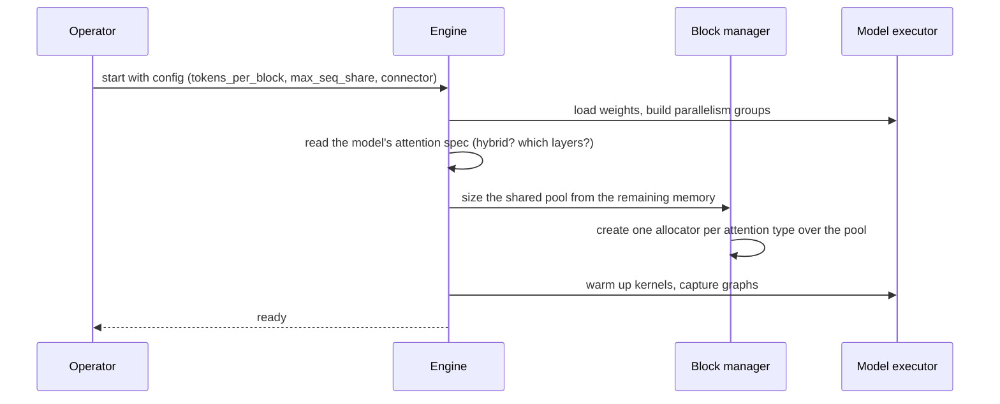
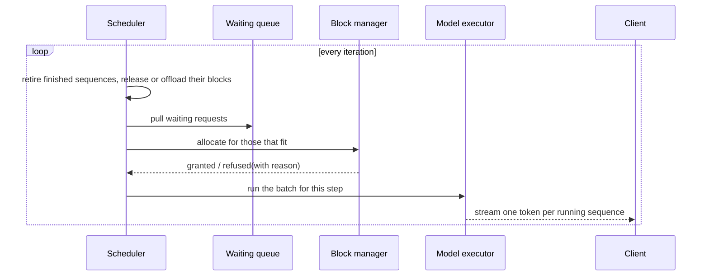
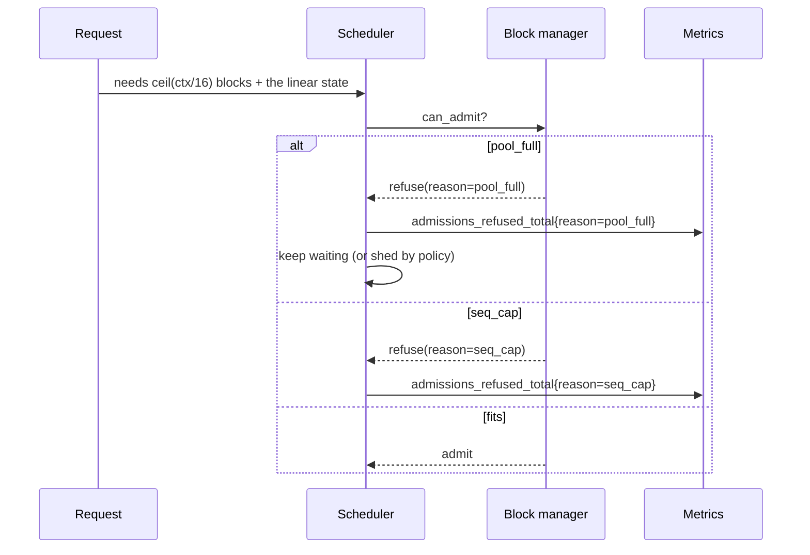
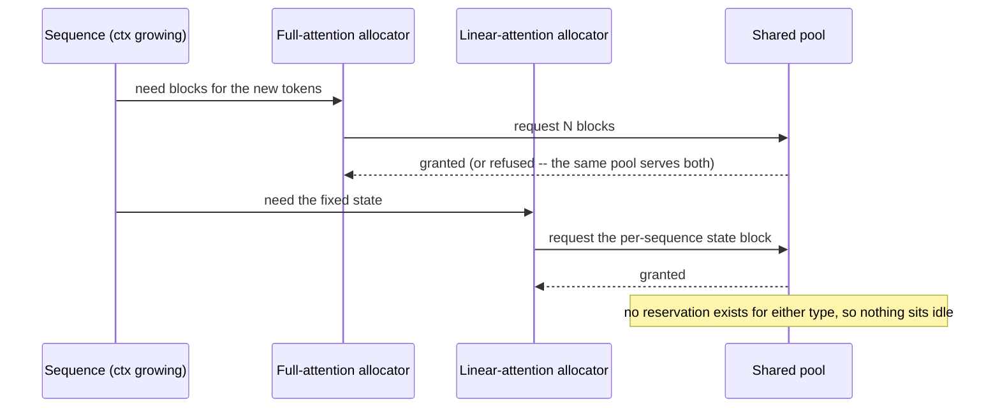
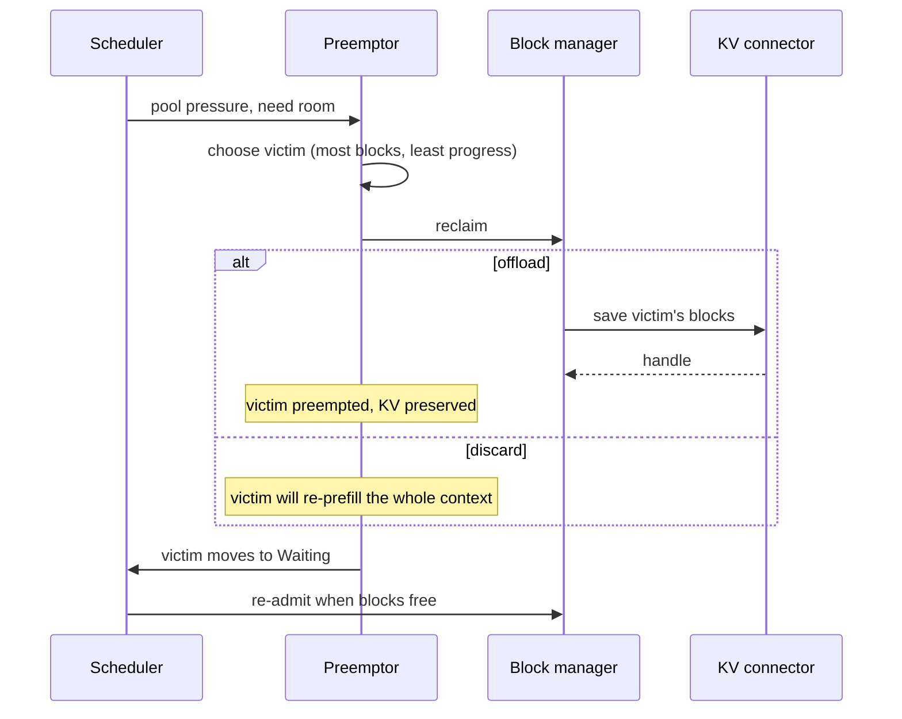
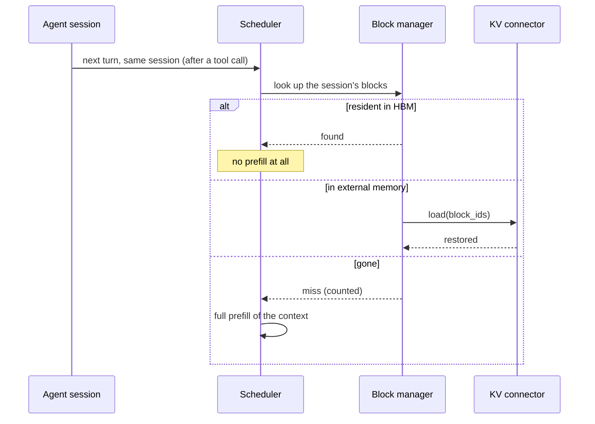
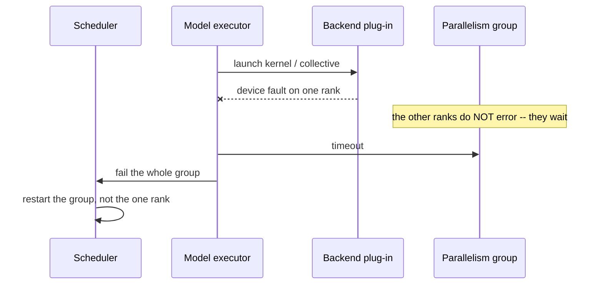

# T13 — End-to-end sequences

> `T13` · **Transcript coverage:** primary · [HLD](../HLD.md) · [LLD](../LLD.md)

Seven flows inside one model server. Each carries a diagram, prose per step, and a
**Where it fails** block — because the engine's characteristic failure is a *policy* that
is wrong in a way no error surfaces.

| # | Flow | The failure it exposes |
|---|---|---|
| 1 | Cold start to first iteration | the pool is sized before the workload is known |
| 2 | Steady-state iteration loop | a slot held for a retired sequence |
| 3 | Admission refusal | invisible rejection |
| 4 | Hybrid attention allocation | a static split wasting half the pool |
| 5 | Preemption and restore | losing KV that was expensive to build |
| 6 | Session resume through the connector | recomputation nobody measured |
| 7 | Backend plug-in failure | a hung collective, not an error |

---

## 1. Cold start

**Step by step.** The pool is sized **after** the weights, from what is left — never
reserved up front. Each attention type gets an allocator over the *same* pool rather than a
carve-out, which is the dynamic-partitioning decision `[T]`.

**Where it fails.**

- *A static split declared at startup.* The engine commits to a percentage before it has
  seen a single request. `run.py` §3 shows the best split moving from 65% to 80% across
  three workloads — the startup guess is wrong for at least one of them from minute one.
- *The model's attention spec read wrong.* A hybrid model served as if all layers were full
  attention over-allocates; the reverse under-allocates and OOMs under load. Neither
  produces a startup error.
- *Warmup skipped.* The first requests pay the autotune; a fresh replica looks slower than a
  warm one.

---

## 2. The steady-state iteration loop

**Step by step.** The order matters: **retire first, then admit.** Admitting before retiring
means the freed slots are not available in the same iteration, and the batch runs one step
behind for the rest of its life. That is the difference continuous batching makes `[T]`.

**Where it fails.**

- *Admit before retire.* Silent under-utilisation; `batch_slot_utilisation` drifts down and
  nothing else changes.
- *A slot held for a finished sequence.* That is static batching arriving by accident — and
  `run.py` §5 measures the cost as a makespan 1.5–2.4× longer.
- *Refusal without a reason.* The engine queues the request and the operator sees a queue
  depth. Whether to add memory or change the admission policy is then a guess (LLD §10).

---

## 3. Admission refusal

**Step by step.** Two refusals that look identical downstream and have opposite fixes.
`pool_full` means add memory. `seq_cap` means the per-sequence cap is refusing a request that
would fit — the pool is healthy and the *policy* is the constraint.

**Where it fails.**

- *Aggregated refusal counter.* The distinction is destroyed at the worst moment, which is
  during an incident.
- *No cap at all.* One long request is admitted, takes most of the pool, and every other
  request's latency becomes a function of its length. `run.py` §4 shows the trade: the cap
  costs long-request service and buys aggregate throughput.
- *Retrying instead of refusing.* Admission retries turn a capacity signal into a spin.

---

## 4. Hybrid attention allocation

**Step by step.** Full attention asks repeatedly as the context grows; the linear state is
asked for once and never grows. They draw from one pool, so the split between them is
whatever the workload demands *right now* rather than a number declared at startup `[T]`.

**Where it fails.**

- *Static reservation.* Capacity is held for a type that is idle, and the request is
  refused while memory sits unused. `run.py` §2 measures this as pool utilisation falling
  to 20% at an unlucky split.
- *The linear state treated as free.* It is fixed, not small. A pool full of concurrent
  sessions must budget for it — the model uses 24 blocks per sequence for exactly this
  reason.
- *Fragmentation from mixed block sizes.* One large fixed state per sequence plus many
  small growing blocks is a classic fragmentation pattern; a paged allocator is what keeps
  it bounded.

---

## 5. Preemption and restore

**Step by step.** Preemption is a normal scheduler act, not an error path. The decision that
matters is whether the victim's KV is preserved: `Preempted → Waiting` with an offload means
the sequence resumes; without it, the entire context is re-prefilled.

**Where it fails.**

- *Discarding on preemption.* Correct output, enormous hidden cost. `recomputed_tokens_total`
  is the only place it shows up.
- *A preemption storm.* Preempting constantly is the batch thrashing. The act is fine; the
  *rate* is the alarm — the same discipline T12 applies to eviction.
- *Preempting a sequence already preempted this iteration.* It will never make progress.
  The victim rule excludes this case explicitly (LLD §5.4).

---

## 6. Session resume through the connector

**Step by step.** The corpus's stated goal for this path is that a previous turn is never
recomputed while storage allows `[T]`. Three outcomes, and only the third costs a full
prefill.

**Where it fails.**

- *No session metadata on the blocks.* The engine cannot tell which blocks belong to the
  returning session, so it cannot restore them. This is the unshipped retention API's job
  in T12 `[T]`.
- *A miss with no counter.* Then the cost is invisible, and the only symptom is "it feels
  slow".
- *A save failure treated as fatal.* The right posture is to keep the blocks resident and
  count the failure — using more memory is recoverable, losing a session's KV is not.

---

## 7. Backend plug-in failure

**Step by step.** A collective with a missing participant hangs; it does not raise. That is
why the failure unit and the restart unit differ.

**Where it fails.**

- *Restarting one rank.* It rejoins a group whose members have already timed out.
- *Treating the plug-in as isolated.* It shares the core; a bug in a device kernel can
  corrupt state the core relies on. The plug-in boundary is a code boundary, not a
  fault-isolation boundary.

---

## The thread running through all seven

Every flow has one step that is **silent when it breaks**: a startup guess about the split
(1), admit-before-retire (2), an aggregated refusal counter (3), capacity reserved for an
idle consumer (4), a discarded preempted context (5), a session miss with no counter (6),
and a hung collective (7). The engine's observability hooks (LLD §10) are attached to those
steps, and two of them — `admissions_refused_total{reason}` and `recomputed_tokens_total` —
are the ones that turn an invisible policy error into a number.

## Sources

- `refs/Agentic_AI_Infra_transcripts_2/Woosuk_Kwon_-_vLLM_Building_Open_and_Efficient_Inference_for_Agents.txt`
  — hybrid attention with per-layer-type memory behaviour; dynamic partitioning over one
  shared pool with an allocator per attention type; the KV connector parking idle KV in CPU
  memory or disk and interoperating with third-party stores and prefill disaggregation, so
  previous turns are never recomputed while storage allows; seven kinds of parallelism
  including decode context parallelism; the offline and online serving entry points; the
  hardware plug-in structure across 10+ backends.
- `refs/vLLM_Inference_Meetup_Bengaluru_2026_transcripts/Distributed_Inference_on_ROCm_with_WideEP_on_vLLM_llm-d.txt`
  — the same engine's collective behaviour on a second backend; nightly end-to-end CI as
  the guard against parallelism regressions; 1P1D and 2P2D as tested policies.
