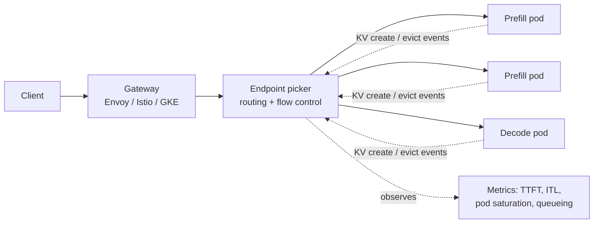

# T14 — Routing and Gateways: High-Level Design

> `T14` · **Transcript coverage:** primary · [LLD](LLD.md) · [Sequences](docs/SEQUENCES.md) · [Production](production/README.md)

The layer between the client and the fleet. In the agent era this stopped being a load
balancer, and the corpus is unusually direct about why: the router's job is to know where
the **KV cache** is, and the cache is created and destroyed continuously by the engines
behind it.

This document is the system-level view — what the component is for, where it sits, what it
must know, and how it fails. The [LLD](LLD.md) is the component-level view. `run.py` models
the two policies that carry the whole design: **placement** (routing) and **admission**
(flow control).

---

## 1. What changed, and what the router is now for

A classic layer-7 load balancer balances *connections*. That is the correct objective when
each request is independent and each backend is interchangeable. Neither holds here:

- **Requests are not independent.** Agent traffic is multi-turn sessions that share a
  growing prefix — system prompt, tool schemas, earlier turns, retrieved documents. A
  request that lands on an instance already holding that prefix skips prefill entirely.
- **Backends are not interchangeable.** An instance that holds a prefix is measurably
  different from an identical-looking instance that does not.

The corpus describes the resulting pipeline explicitly — build a **live view** of where the
cache is, then **filter** the candidate set by it, then **rank** what survives `[T]`. The
example given is a composed policy: a prefill filter, then a prefix-cache-identity filter,
then a token-load scorer, with decode traffic routed by an **active-request scorer**
instead, because a decode that pulls KV from a prefill worker has different needs from one
that does not `[T]`.

So the router is a **cache-state-aware placement engine**, and its input is an event feed
from the engines. Two responsibilities are conflated in the word "router" and are separated
throughout this blueprint:

| Responsibility | Question | Where it lives |
|---|---|---|
| **Routing** | *which* instance serves this request | placement, prefix-aware |
| **Flow control** | whether it is dispatched *at all* | admission, saturation-gated |

The corpus names the component for the second job as much as the first — it is an
**endpoint picker** that also does flow control, and the two are the reason it exists as a
single deployment rather than as a library inside each engine `[T]`.

## 2. Where it sits

The router is **a single deployment that sits between the pods and the gateway** `[T]`. It
does not replace the ingress; it hooks into it. In the corpus's deployment that means the
Gateway API Inference Extension, plugged into a gateway such as GKE's, Istio, or Envoy `[T]`.

Three properties of that picture matter more than the boxes.

**It is one deployment, not one per namespace or per model.** The corpus is explicit that
it is a single deployment serving the fleet `[T]`. That is what makes it a chokepoint and
also what makes the live cache view possible — a view assembled per-pod by each pod would
be a view of nothing.

**The event feed is the design.** Everything the router knows about the cache arrives as
events from the engines. The corpus states the router consumes the per-request **create**
event *and* the **evict** event `[T]`. Eviction is a normal stage of a block's lifecycle —
the same framing T12 uses — and the router treats it as a first-class input rather than an
error condition.

**It is not on the data path for KV.** The router decides placement; the KV itself moves
engine-to-engine. Conflating the two would make the router a bandwidth bottleneck, and the
corpus keeps them separate by design `[T]`.

## 3. The live view, and why it is the whole design

The router's belief about where prefixes live is its most valuable and most perishable
asset. The corpus's warning is about what happens when you keep only half the feed: the
approximate approach is hash-based and "**has all the consistency problems**" `[T]`.

`run.py` §2 models four placement policies against a Zipf-distributed prefix workload. The
result is not the one-sided story it is often told as:

| policy | hit rate | misroute % | peak/mean | usable instances (of 8) |
|---|---|---|---|---|
| round robin | 49.4% | 24.9% | 1.00 | 8.00 |
| least loaded | 49.4% | 24.9% | 1.00 | 8.00 |
| hash (approximate) | **81.8%** | 0.0% | 2.22 | 3.61 |
| live view (precise) | 77.3% | 0.0% | 1.46 | **5.48** |

Read honestly, this says three things.

**Load-aware routing alone is the naive answer, and the corpus is right about it.** Round
robin and least-loaded are indistinguishable here, and both misroute roughly a quarter of
all traffic — sending a request to an instance that cannot reuse the prefix while a
different instance holds it. That is a quarter of the fleet's prefill compute spent
recomputing what the cluster already had. It does not surface in a hit-rate average per
instance; it surfaces as TTFT nobody can explain.

**Hash routing's affinity advantage is real.** It posts the highest hit rate in the table.
Sticky placement is genuinely good for cache reuse, and a blueprint that dismissed it would
be wrong.

**What hash routing cannot do is balance, and that is the number that decides an SLO.**
Its peak instance carries 2.22× the mean, so only 3.61 of 8 instances are usable before
something saturates. The live view concedes 4.5 points of hit rate and buys back 52% more
usable cluster.

**The honest caveat, stated where it belongs.** This model does *not* reproduce the
corpus's precise-beats-approximate gap on cache hit rate — here hashing wins that column.
The corpus's comparison comes from a production deployment under KV saturation where cache
state moves continuously; this model has a fixed instance set and a stationary workload.
The precise view's advantage in this model shows up in *capacity*, which is the metric that
matters under saturation, and the disagreement on hit rate is recorded rather than tuned
away.

## 4. Saturation is operator-defined, and that is the point

Flow control is admission, and admission only matters once the cluster is saturated. The
corpus is precise that the saturation signal is **operator-defined** — the example given is
KV cache 80% full, or average active requests above eight `[T]`. Both of those are numbers a
human typed into a config. Neither is physics.

That has a consequence the corpus does not spell out but the design must confront:
**a saturation threshold is a statement about a cluster whose reachable capacity the router
itself has already changed.** `run.py` §6 puts the two halves together:

| policy | usable instances (of 8) | hit rate |
|---|---|---|
| round robin | 8.00 | 49.4% |
| hash | 3.61 | 81.8% |
| live view | 5.48 | 77.3% |

The flow controller's `saturation_active` threshold is guarding a fleet it believes has
eight instances. Under hash routing the fleet has, in capacity terms, about 3.6. The
threshold is not wrong; it is answering a question about a different cluster. This is the
real design argument for the live view, and it is not about hit rate.

## 5. Flow control: FCFS is not a policy

The corpus's own assessment of the naive default is dismissive: first-come-first-serve
"doesn't add anything extra to your policies because it's going to slow down everything"
`[T]`. `run.py` §5 agrees, and is blunter than the corpus is: FCFS and no-flow-control-at-all
produce **identical** rows. A queue with no policy inside it is not a policy.

What the corpus suggests instead is **priority bands** — under saturation, only premium
traffic is dispatched `[T]`. The model measures both sides:

| policy | premium SLO | best-effort SLO | dispatched | shed | mean wait |
|---|---|---|---|---|---|
| none | 2.9% | 11.1% | 4772 | 0 | 98.42 |
| fcfs | 2.9% | 11.1% | 4772 | 0 | 98.42 |
| priority bands | **99.3%** | 12.5% | 3448 | **1324** | 27.34 |

Priority bands take premium attainment from 2.9% to 99.3%. That is the intended effect and
it is not subtle. The part that is easy to leave unsaid is the mechanism: best-effort
traffic is not *slowed*, it is **starved**. Its attainment barely moves (11.1% → 12.5%),
1,324 requests are shed outright, and its **mean wait looks better** (98.42 → 27.34) purely
because the requests that would have waited longest were dropped instead of queued.

**Mean wait is a lying metric under a shedding policy.** Any dashboard that reports latency
without reporting sheds will show this change as an unambiguous improvement. This is a
trade an operator is entitled to make; it is not one they should make by accident.

## 6. Routing across a fleet that is itself moving

Three things move underneath the router, and each breaks a different assumption.

**Instances join and leave.** `run.py` §4 scales 8 instances to 10 at the midpoint. An
index-based hash remaps every prefix when the divisor changes; the approximate policy goes
from 0 misroutes to 1.8% and its imbalance worsens from 2.22× to 2.72×. The live view stays
at 0.0% misroutes and *gains* hit rate, because new instances emit creates like any other
and the view absorbs them.

The magnitude here should be stated honestly: **1.8% is small**, and a consistent-hash ring
would shrink it further by moving only ~1/n of prefixes. The durable point is not the size.
It is that even a perfect ring cannot tell the router *which* prefixes actually lost their
cache, because a hash-only router holds no evict signal to tell it with.

**Adding replicas does not fix a hot key.** `run.py` §3 grows the cluster from 4 to 32
instances against a fixed 512-prefix workload. Hash routing's imbalance gets *worse* with
scale — 1.52× at n=4 rising to 6.20× at n=32 — because a fixed set of hot prefixes
concentrates on proportionally fewer boxes. The live view tracks it down to 5.83× and then
stops, because it cannot go below the imbalance the *workload* has. 512 Zipf prefixes
against a cache holding 24 per instance is a working set far smaller than the cluster.
**Routing removes the imbalance that routing caused; it cannot remove the rest.**

**The workload itself is not one thing.** The corpus gives a worked composed policy where
decode traffic routes on an active-request score while prefill routes on prefix identity
`[T]`. A single scorer applied to both is a design error that looks like a tuning problem.

## 7. Observability: what the router must expose

The corpus lists the metrics for this layer as TTFT, ITL, pod saturation, and queueing
depth `[T]`. From `run.py`'s findings, three more are load-bearing and none of them are in
the default set:

| Metric | Why it exists | What it catches |
|---|---|---|
| `misroutes_total` | requests placed where the prefix was absent while resident elsewhere | the cost of a stale view — invisible in per-instance hit rate |
| `shed_total{priority}` | requests refused rather than queued | the hidden half of priority bands |
| `view_staleness_seconds` | age of the newest applied event per instance | the event feed degrading before anything else does |
| `effective_capacity` | n ÷ (peak/mean load) | the gap between the fleet the operator thinks they have and the one they reach |

`misroutes_total` and `shed_total` are the two that turn an invisible policy error into a
number. Without them, a stale event feed and an aggressive queue policy both present as
"latency is bad sometimes".

## 8. Failure modes at the design level

**A stalled event feed.** The router keeps serving from a view that is quietly ageing.
Nothing errors; hit rate decays. This is the highest-severity failure in the component
because every other guarantee depends on the view being true, and `view_staleness_seconds`
is the only thing that reveals it.

**The event feed and the router disagreeing about membership.** Instances that have left
still receive traffic for as long as the router believes they are present, and their
failures look like application errors rather than routing errors.

**Saturation thresholds tuned against a phantom fleet.** Section 4's point: the threshold
is a constant while the reachable capacity is a variable the router controls.

**Priority bands adopted without shed accounting.** Section 5's point. A policy that works
exactly as designed and produces an incident review six weeks later.

**Flow control that never engages.** If the saturation signal is derived from KV cache
occupancy and the deployment is prefill-heavy with rapid turnover, the cache may never
reach 80% even while the cluster is queueing. The signal and the symptom must be the same
thing; picking one that is merely correlated is a silent failure.

## 9. Design decisions worth defending

1. **One router deployment, not a sidecar per pod.** A per-pod view cannot see where else a
   prefix lives, which is the entire input to the filter step.
2. **Consume creates *and* evicts.** The approximate alternative is cheaper and has a
   higher hit rate in isolation — and the capacity it costs is the capacity the SLO depends
   on. This is a deliberate trade, not an oversight.
3. **Filter before rank, always.** Ranking without filtering is a load balancer with extra
   steps; the corpus's composed policy puts identity filters ahead of the load scorer for
   exactly this reason `[T]`.
4. **Saturation is configuration, but it is not a constant.** Ship it as a tunable with the
   observed effective capacity next to it.
5. **Report sheds as a first-class metric.** Any policy that can refuse work must count the
   refusals where the operator will see them.

## 10. What this blueprint does not claim

`run.py` models two policies. There is no gateway, no cluster and no engine anywhere in
this environment, and **no number in this blueprint or in `run.py` is a measurement of
anything.** The model's workload is stationary, its instances are homogeneous, and its
prefix distribution is synthetic. Where its findings agree with the corpus they are
corroboration of a mechanism; where they disagree — the hit-rate comparison in §3, the
small churn effect in §6 — the disagreement is written down rather than tuned out.

## Sources

- `refs/vLLM_Inference_Meetup_Bengaluru_2026_transcripts/Scaling_Agentic_AI_Distributed_Inference_with_llm-d.txt`
  — the router as an endpoint picker doing both placement and flow control; a single
  deployment between the pods and the gateway; the Gateway API Inference Extension and the
  GKE/Istio/Envoy hook-in; the build-a-view → filter → rank pipeline; the composed policy
  (prefill filter, prefix-cache-identity filter, token-load scorer) and the separate
  active-request scorer for decode; operator-defined saturation thresholds; FCFS "doesn't
  add anything extra to your policies"; priority bands under saturation; the metric list of
  TTFT, ITL, pod saturation and queueing; consumption of KV create and evict events.
- `refs/vLLM_Inference_Meetup_Bengaluru_2026_transcripts/Inside_vLLM_Semantic_Router.txt`
  — the router as a middleware layer; the ~50–60 headers carrying which model was chosen
  and its confidence; an encoder classifier fine-tuned on a regular cadence and republished
  to Hugging Face (**ASR garble unresolved**: the transcript renders it "ambert 32 model";
  ModernBERT and DeBERTa are both plausible readings and I could not settle it from the
  audio-derived text, so no name is asserted here); synthetic data generation for the
  simple/medium/reasoning split; the
  signal → partition → difficulty score → decision pipeline; the named algorithms
  (confidence, rem, fusion, workflow); publishing research before implementing; enterprise
  guardrails — input filtering, semantic classification, policy routing, PII and jailbreak
  detection, fact check; the bank case where sensitive data must not leave and the
  internal-agent case where routine queries must not reach frontier models.
- `refs/vLLM_Inference_Meetup_Bengaluru_2026_transcripts/Distributed_Inference_on_ROCm_with_WideEP_on_vLLM_llm-d.txt`
  — the same routing layer exercised against a second backend and a WideEP topology.
