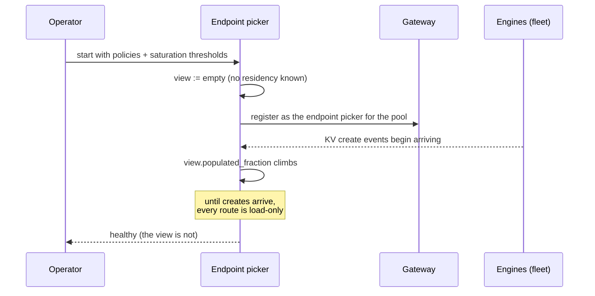
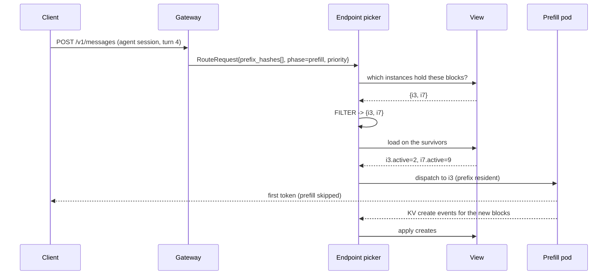
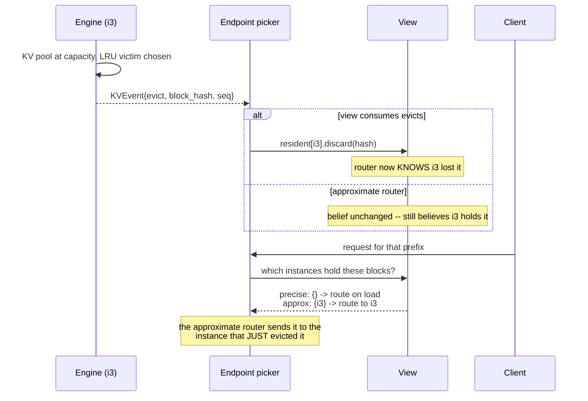
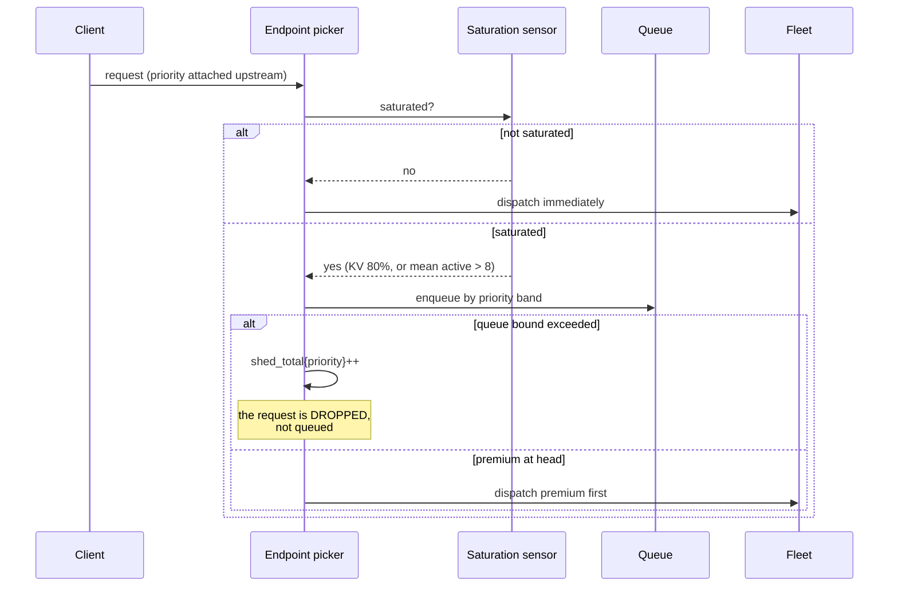
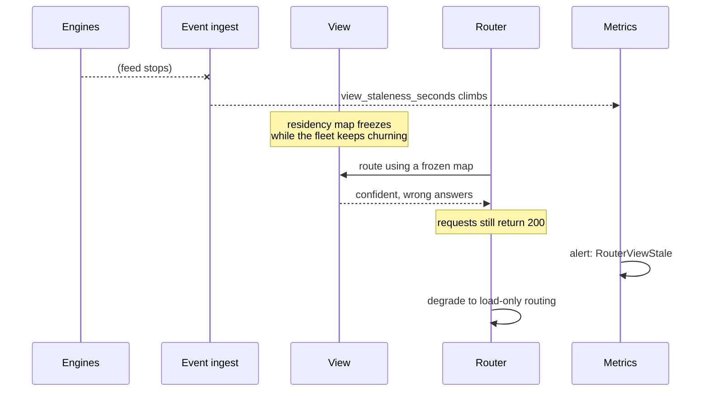

# T14 — End-to-end sequences

> `T14` · **Transcript coverage:** primary · [HLD](../HLD.md) · [LLD](../LLD.md)

Seven flows through the routing layer. Each carries a diagram, prose per step, and a
**Where it fails** block — because this component's characteristic failure is that it
**keeps returning 200s while placing requests badly**.

| # | Flow | The failure it exposes |
|---|---|---|
| 1 | Cold start | the view is empty and every route is a guess |
| 2 | Steady state, prefix hit | the filter stage earning its place |
| 3 | Prefix evicted under pressure | the evict event the approximate policy ignores |
| 4 | Scale-out | a hash remaps a fleet that did not move |
| 5 | Saturation and priority bands | shedding that looks like an improvement |
| 6 | Event feed stalls | the silent failure, and the only metric that reveals it |
| 7 | Instance leaves unannounced | traffic to a member the router still believes in |

---

## 1. Cold start



**Step by step.** The router starts with an empty view and is nonetheless *ready* — it
serves from load-only routing until creates arrive. That is the correct posture (a router
that refused traffic until its view was warm would turn a restart into an outage), and it is
also the window in which the fleet is being routed as if it had no cache at all.

**Where it fails.**

- *`view_populated_fraction` not emitted.* The rebuild is invisible. It is a degraded mode
  with a recovery curve, and the curve is the only thing that says whether it is going well.
  `alerts.yaml` carries a rule for a rebuild that takes more than ten minutes.
- *Readiness gated on an empty view.* The opposite error: a restart becomes an outage.
- *Policies not yet loaded.* Routing on defaults during the window in which the fleet is
  coldest is the worst possible time to route on defaults.

---

## 2. Steady state, prefix hit



**Step by step.** The filter runs first and the rank runs second, on the survivors only.
Had the order been reversed, the rank would have been computed over instances that cannot
reuse the prefix, and the result would be a load balancer with extra steps.

**Where it fails.**

- *Filter applied as a constraint rather than a preference.* If no instance holds the
  prefix and the filter refuses to fall back, a cache miss becomes a failed request. The
  `on_empty: pass_through` field exists for exactly this.
- *Rank-before-filter.* Section 2 of `run.py` measures the cost of the cache-blind version:
  **24.9–29.4% misroutes** on a Zipf workload, meaning a quarter of requests re-prefill
  something the fleet already held. Each instance's own hit rate looks fine; the waste is
  that a *different* instance held it. This is why `misroutes_total` exists as a metric and
  why no per-instance dashboard can see it.
- *Decode routed through the same pipeline.* Decode must use the active-request scorer;
  prefix identity is the wrong input for a request that will pull KV from a prefill worker.
  The symptom is decode ITL variance nobody can attribute.

---

## 3. Prefix evicted under pressure



**Step by step.** Eviction is a **normal lifecycle stage**, not an error — the same framing
T12 uses. The router consumes it as a first-class input.

**Where it fails.**

- *Creates only.* This is the approximate policy. In a stationary fleet it posts a *higher*
  hit rate (81.8% vs 77.3% in `run.py` §2) — and it is still the wrong choice, because its
  peak/mean load is 2.22 and only **3.61 of 8** instances remain usable before something
  saturates. The live view concedes 4.5 points of hit rate and buys 52% more usable cluster.
  Stated plainly: this is a deliberate trade, and the model's hit-rate column favours the
  policy the design rejects.
- *Aggregating refusals and evictions into one counter.* T13's argument about
  `admissions_refused_total{reason}` applies identically: the distinction is destroyed at
  the worst possible moment.
- *Treating offload as eviction.* A block parked in CPU memory has left HBM but has not
  ceased to exist. Collapsing the two makes a peer fetch impossible and forces a recompute —
  the exact middle ground T12 identifies between queueing and re-prefilling.

---

## 4. Scale-out

```mermaid
sequenceDiagram
    participant K as Cluster
    participant R as Endpoint picker
    participant V as View
    participant N as New instance
    K->>R: fleet 8 -> 10 instances
    alt hash-based
        R->>R: hash(prefix) % 10 != hash(prefix) % 8
        Note over R: EVERY prefix remaps at once
    else live view
        R->>V: keep existing residency, add i8/i9 empty
    end
    N-->>R: KV create events
    R->>V: applies creates; new instances become routable
```

**Step by step.** An index-based hash remaps every prefix when the divisor changes. A view
absorbs new instances as ordinary event emitters.

**Where it fails.**

- *Overstating this.* `run.py` §4 measures the damage at **1.8% misroutes**, and a
  consistent-hash ring would move only ~1/n of prefixes instead of all of them. The effect
  is small. The durable point is not its size: even a perfect ring cannot tell the router
  *which* prefixes actually lost their cache, because a hash-only router holds no evict
  signal to tell it with.
- *Assuming scale-out dilutes a hot key.* `run.py` §3 grows the fleet from 4 to 32 against a
  fixed 512-prefix workload: hash routing's imbalance gets **worse** (1.52× → 6.20×),
  because a fixed set of hot prefixes concentrates on proportionally fewer boxes. The live
  view tracks it to 5.83× and stops — it cannot go below the imbalance the *workload* has.
  **Routing removes the imbalance routing caused; it cannot remove the rest.** Adding
  replicas is not a fix for a hot key.
- *New instances excluded by a stale filter.* If the filter only considers instances it
  already knows, new capacity sits idle while the fleet queues.

---

## 5. Saturation and priority bands



**Step by step.** Saturation is **operator-defined** — the corpus's examples are KV cache
80% full or mean active requests above eight `[T]`. Both are constants a human typed in.
The policy only engages above that line, which is why the threshold is a design decision and
not a tuning parameter.

**Where it fails.**

- *FCFS.* The corpus's judgement is that first-come-first-serve "doesn't add anything extra
  to your policies because it's going to slow down everything" `[T]`. `run.py` §5 is blunter:
  FCFS and no-flow-control-at-all produce **identical rows**. A queue with no policy in it
  is not a policy.
- *Priority bands without shed accounting.* This is the important one. Priority bands take
  premium attainment from **2.9% to 99.3%** — and shed **1,324** requests, while
  best-effort's **mean wait improves** from 98.42 to 27.34, because the requests that would
  have waited longest were dropped rather than queued. **Mean wait is a lying metric under a
  shedding policy.** A dashboard showing latency and not sheds reports this as an
  unambiguous improvement. `alerts.yaml` carries the counterweight rule.
- *Saturation that never engages.* If the threshold is derived from KV occupancy and the
  deployment is prefill-heavy with fast turnover, the cache may never reach 80% while the
  fleet is queueing. **The signal and the symptom must be the same thing**, and picking a
  merely-correlated one is a silent failure.

---

## 6. The event feed stalls



**Step by step.** This is the highest-severity failure in the component, and it is the one
that produces no error. Every other guarantee depends on the view being true, and the view
is the only thing that can be quietly false.

**Where it fails.**

- *No staleness metric.* Then the only symptom is "latency is bad sometimes", and the
  investigation starts in the engines rather than in the router.
- *Treating a stalled feed as healthy because requests succeed.* They do. That is the
  problem.
- *Failing over to a second router without the view.* A cold standby has no residency
  either, so failover costs a rebuild window — the same degraded mode as §1, arriving at the
  worst possible moment.
- *Serving from a wrong view rather than degrading.* Degrading to load-only is worse for
  cache hit rate and better for correctness, because it is *honest* about what it knows.
  A wrong view is not.

---

## 7. Instance leaves unannounced

```mermaid
sequenceDiagram
    participant N as Instance i5
    participant R as Endpoint picker
    participant V as View
    participant H as Health probe
    N--xR: (crashes; no event, no goodbye)
    R->>V: still believes i5 is a member and holds blocks
    R->>N: route requests to i5
    N--xR: connection refused
    Note over R: this presents as APPLICATION failures,<br/>not routing failures
    H->>R: probe fails, remove i5
    R->>V: drop i5's residency
```

**Step by step.** Membership is not the same as belief. An instance that has left still
receives traffic for as long as the router believes it is present, and its failures surface
as client-visible errors with no routing signature on them.

**Where it fails.**

- *Health probes only, no view eviction.* Removing the instance from the fleet without
  dropping its residency leaves blocks believed-resident on a box that no longer exists.
  Requests that would have matched them are still filtered toward nothing.
- *Blast radius through the filter.* Requests whose prefix lived on the departed instance
  preferentially matched it, so the router sends *exactly the requests that would have hit*
  to a dead box. The failure is correlated with cache affinity, which is the worst version.
- *No correlation between member loss and misroute rate.* A spike in `misroutes_total` with
  a healthy event feed is the signature of a membership/belief mismatch, and it is worth
  saying so in the runbook.

---

## The thread running through all seven

Every flow has a step that is **silent when it breaks**: an empty view treated as healthy
(1), a filter that fails to fall back (2), an evict event that is consumed by no one (3), a
hash that remaps a fleet that did not move (4), a shed counter nobody reads (5), a feed that
stops without stopping the router (6), and a member the router still believes in (7).

Four metrics cover all seven, and none of them is in the standard set of TTFT, ITL, pod
saturation and queueing: `view_staleness_seconds`, `misroutes_total`,
`shed_total{priority}`, and `effective_capacity`.

The two that matter most are the last two, and they are the two that are hardest to put on a
dashboard, because both of them report that a policy is working exactly as designed.

## Sources

- `refs/vLLM_Inference_Meetup_Bengaluru_2026_transcripts/Scaling_Agentic_AI_Distributed_Inference_with_llm-d.txt`
  — the router as endpoint picker doing both placement and flow control; a single deployment
  between the pods and the gateway; the Gateway API Inference Extension and the GKE/Istio
  hook-in; the build-a-view → filter → rank pipeline; KV create and evict event consumption;
  the composed policy of prefill filter, prefix-cache-identity filter and token-load scorer,
  with an active-request scorer for decode; operator-defined saturation at 80% KV or 8 mean
  active requests; FCFS as "doesn't add anything extra"; priority bands under saturation;
  TTFT, ITL, pod saturation and queueing as the metric set.
- `refs/vLLM_Inference_Meetup_Bengaluru_2026_transcripts/Inside_vLLM_Semantic_Router.txt`
  — the router as middleware; the ~50–60 headers recording model choice and confidence;
  signal → partition → difficulty score → decision; the named algorithms (confidence, rem,
  fusion, workflow); guardrails — input filtering, semantic classification, policy routing,
  PII and jailbreak detection, fact check; the bank case where sensitive data must not leave
  and the internal-agent case where routine queries must not reach frontier models.
- `refs/vLLM_Inference_Meetup_Bengaluru_2026_transcripts/Distributed_Inference_on_ROCm_with_WideEP_on_vLLM_llm-d.txt`
  — the routing layer exercised against a second backend and a WideEP topology.
