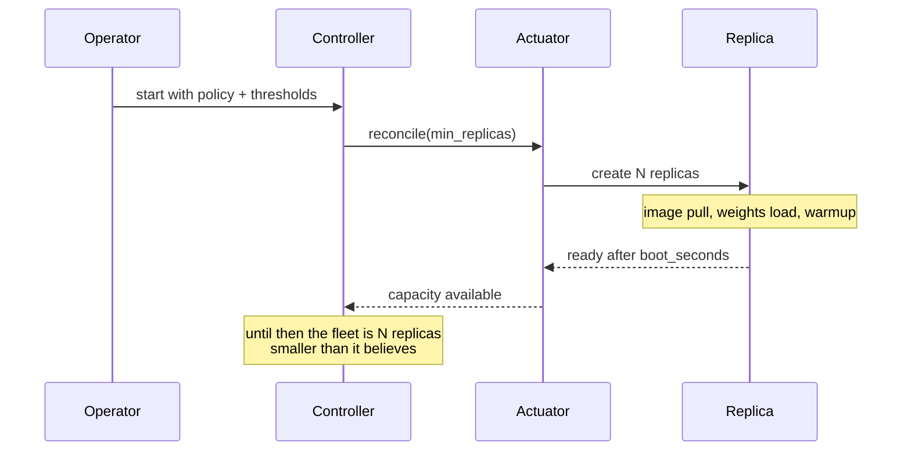
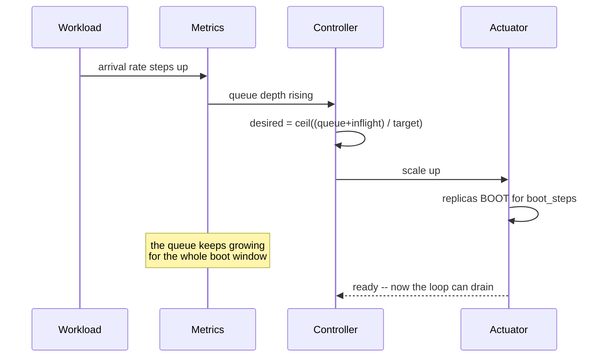
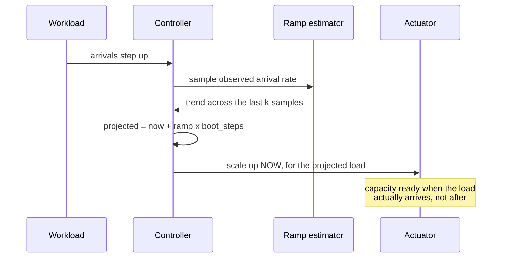
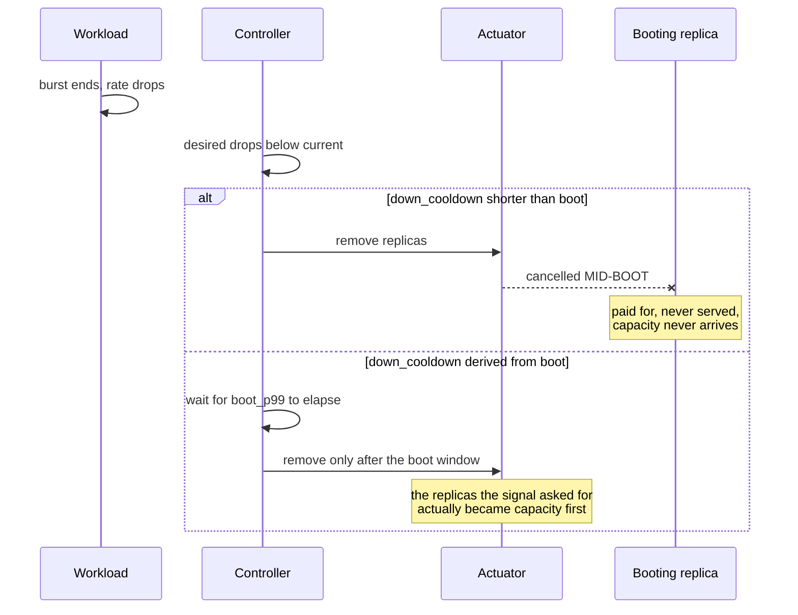
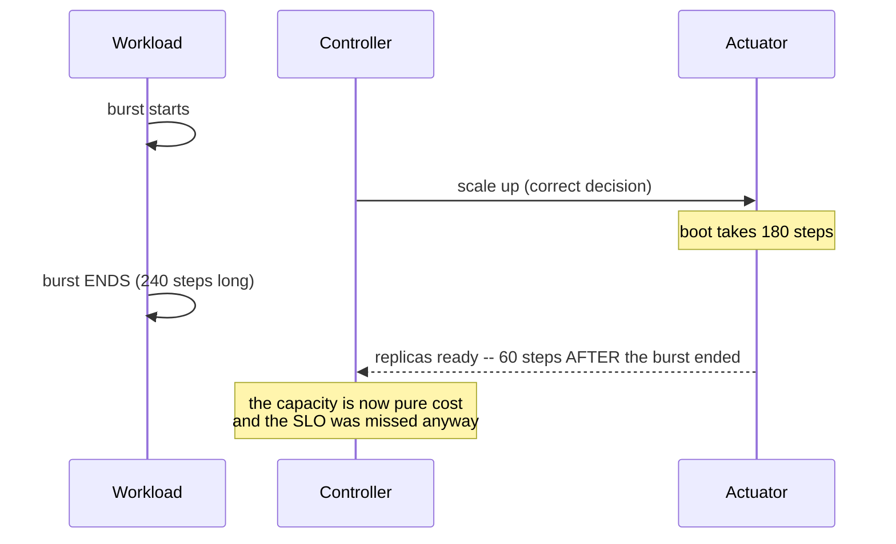
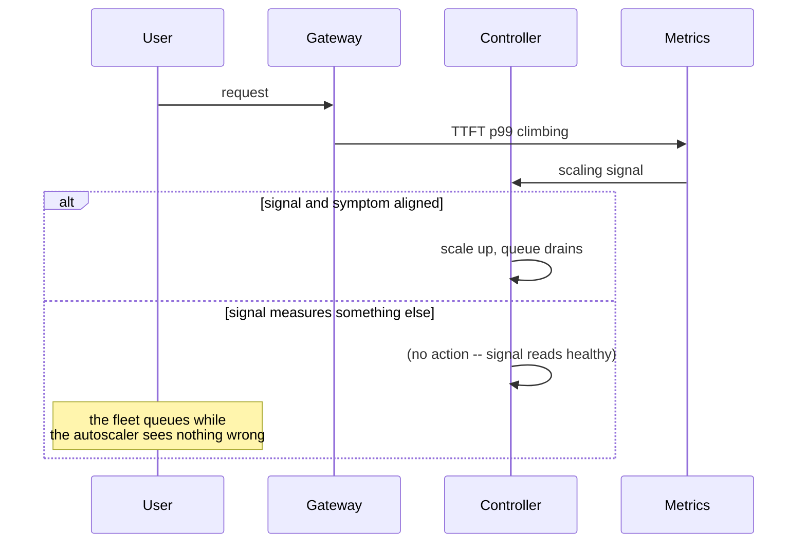
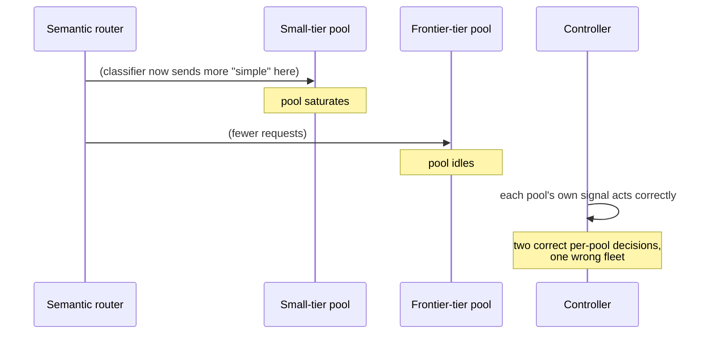

# T15 — End-to-end sequences

> `T15` · **Transcript coverage:** primary · [HLD](../HLD.md) · [LLD](../LLD.md)

Seven flows through the autoscaling loop. Each carries a diagram, prose per step, and a
**Where it fails** block — because this component's characteristic failure is that it is
**part of its own input**, so it can hide its own mistakes.

| # | Flow | The failure it exposes |
|---|---|---|
| 1 | Cold start of the fleet | capacity arrives `boot` steps after it was needed |
| 2 | Burst arrives, reactive scaling | the loop is always one boot window late |
| 3 | Burst arrives, predictive scaling | the ramp estimate is a pulse, not a trend |
| 4 | Scale-down during a lull | cancelling replicas that are still booting |
| 5 | Long cold start | autoscaling loses to overprovisioning |
| 6 | SLO breach under saturation | the signal and the symptom are different things |
| 7 | Tier-mix drift | a routing change that no per-pool loop can see |

---

## 1. Cold start of the fleet

**Step by step.** `min_replicas` is a **warm floor**, not a default. It exists so the first
request after an idle period does not pay a full cold start — HLD §10.

**Where it fails.**

- *`boot_seconds` not measured.* Every cooldown in the design is derived from it (LLD §4).
  If it is assumed rather than measured, the damping is wrong from the first day and wrong
  in the expensive direction.
- *`min_replicas` sized from the mean idle arrival rate.* The mean is exceeded by definition
  half the time, and the cost of exceeding it is a full cold start. Size for the p99.
- *Replicas counted as capacity while booting.* `run.py` §2: booting replicas are **9.5% of
  the bill** for a reactive policy and up to 13.7% for one that follows a perfect signal.
  They cost money and serve nothing.

---

## 2. Burst arrives, reactive scaling

**Step by step.** Reacting to the *current* queue is always `boot_steps` too late. By the
time the replicas started here are ready, the queue that justified them has been waiting
for the entire boot window.

**Where it fails.**

- *The boot window treated as latency-neutral.* It is not: `run.py` §5 measures a reactive
  policy at 76.8% SLO with a 60-step boot and 37.1% at 180 steps, against 100% for a static
  fleet that was already running.
- *Over-scaling from counting booting replicas.* A controller that includes pending pods in
  its current count overshoots, then has to scale back down — and `run.py` §2 shows `queue`
  reaching 48 replicas against a steady-state need of about five.
- *Assuming a better signal fixes it.* It does not. `cpu_ideal` — a perfect, uncompressed,
  lag-free signal — reaches the SLO and costs **1.98× the static baseline**, because the
  HPA's `ceil(current × signal / target)` control law moves geometrically.

---

## 3. Burst arrives, predictive scaling

**Step by step.** Same signal, same workload as flow 2, projected forward across the boot
window. `run.py` §3: **53% cheaper** than reacting to the current queue (2,235 vs 4,804
replica-steps) at 85.6% versus 100% SLO. It is the cheapest policy in the model that tracks
the workload at all.

**Where it fails.**

- *A two-point ramp.* Differencing two adjacent samples gives a **pulse** — large for
  exactly one window during a step change, then gone. The controller over-scales, then
  reverts and **cancels the replicas it just started booting**. This is the implementation
  detail that took two attempts in `sim/autoscaler.py`; the fix is to sample the arrival
  rate every `window` steps and fit the trend across several samples.
- *Extrapolating a step change linearly forever.* The projection is only meaningful during
  a ramp; once the ramp ends the correct target is the new steady rate.
- *Predicting from an assumed rate rather than observed arrivals.* The controller must be
  built on what it can see, which is why `PolicyState.observe` is fed actual arrivals.

---

## 4. Scale-down during a lull

**Step by step.** Scale-up fast, scale-down slow, and the slowness must be **derived from
the cold start** rather than hard-coded. A literal like `300s` looks conservative and is
correct only until the boot time changes.

`run.py` §4, with policy, signal and workload held fixed and only this term varied:

| scale-down hysteresis | SLO | boot waste |
|---|---|---|
| naive (same as up) | 93.4% | 29.7% |
| derived (2 × boot) | **100.0%** | **8.7%** |

**Where it fails.**

- *The symmetric cooldown.* This is the failure this flow exists to name, and it is
  invisible in latency: the SLO loss is 6.6 points while **29.7% of the bill** goes to
  replicas that never served.
- *The derived value computed once and frozen.* If the model, image or weight store
  changes, the boot time moves and the derivation must move with it. `alerts.yaml` carries
  a `ColdStartDrift` rule for exactly this.
- *Judging the fix on total cost.* The derived cooldown **costs more** (4,304 → 4,804
  replica-steps) because it holds capacity longer. It is still correct. Total spend is the
  wrong lens; **spend per served request** is the right one.

---

## 5. Long cold start: autoscaling loses

**Step by step.** The autoscaler made every correct decision. The plant has too much dead
time for the loop to control it.

`run.py` §5 — static overprovision against the best autoscaler at each boot delay:

| cold start | best autoscaler | static overprovision |
|---|---|---|
| 5 steps | 94.2% SLO at 2,015 | 100% at 2,700 |
| 20 steps | 100% at 4,804 | 100% at 2,700 |
| 60 steps | 76.8% at 9,653 | **100% at 2,700** |
| 180 steps | 37.1% at 17,266 | **100% at 2,700** |

**Where it fails.**

- *Reading this as "autoscaling is bad".* It is not — it is conditional. At a 5-step boot
  the predictive loop beats the static fleet on cost. The rule is: **autoscaling only pays
  when the cold start is short relative to the burst duration.**
- *Tuning the autoscaler instead of the cold start.* No policy change fixes dead time. The
  corpus's own un-quantized base images and fast weight mounts — startup from minutes to
  15–20 seconds `[R]` — are a **prerequisite for autoscaling**, not a separate optimisation.
- *Ignoring the possibility that the static fleet is cheaper.* A design review that treats
  overprovisioning as obviously wasteful has not read this table.

---

## 6. SLO breach under saturation

**Step by step.** The signal and the symptom must be the same thing. If the scaling signal
is KV occupancy and the deployment is prefill-heavy with fast turnover, the cache may never
fill while the fleet queues — and the loop is structurally blind.

**Where it fails.**

- *A signal that cannot reach its target.* `run.py` §2: a CPU signal topping out at 0.85
  against a 0.70 target is reached only at ~2.5× overload. The loop sits at its setpoint
  while the fleet fails. Detected by asking whether the signal ever approaches its target in
  production — a month-one question nobody asks.
- *Percentiles read without sheds.* T14 §5: under a shedding policy the surviving requests
  are not a random sample, and mean wait **improves** during starvation. Survivorship bias
  is the default.
- *SLO read without cost.* An autoscaler that scales up enough makes its own signal look
  healthy regardless of whether the fleet is five times too large. Only cost per served
  request reveals it (LLD §9).

---

## 7. Tier-mix drift

**Step by step.** With a semantic router choosing between model tiers (T14 §6), the arrival
rate at each pool is an output of the **classifier**, not of the workload. Each per-pool
autoscaler sees its own signal and reacts correctly to what is really a classification
change.

**Where it fails.**

- *Per-pool autoscaling with no fleet-level view.* One pool permanently saturated and
  another permanently idle, while every individual scaling decision looks right. This is
  the failure a single-pool model cannot express.
- *No `tier_mix` metric.* The divergence between the mix the fleet was scaled for and the
  mix it is receiving is the only leading indicator, and it has no equivalent in T14's
  routing metrics.
- *Blaming the workload.* The workload did not change; the classifier did. A
  classifier retrained and republished on a regular cadence `[T]` is a routine event that
  can move the fleet's shape, and nothing in the arrival-rate signal says so.

---

## The thread running through all seven

Every flow has a step where **the loop is the last to know**: a warm floor that is not warm
(1), a decision that is one boot window late (2), a ramp that is a pulse (3), a cooldown
shorter than the boot (4), a correct decision on a plant with too much dead time (5), a
signal that cannot reach its own target (6), and a demand shift that is really a
classification change (7).

The unifying property: **an autoscaler is part of its own input.** Scaling changes the
signal that decides the next scale. That is why every table in this blueprint carries a
cost column beside its SLO column — the SLO alone is something the loop can satisfy while
being wrong, and cost is the only metric that says so.

## Sources

- `refs/vLLM_Inference_Meetup_Bengaluru_2026_transcripts/Scaling_Agentic_AI_Distributed_Inference_with_llm-d.txt`
  — saturation-based autoscaling as a feature; the workload variant autoscaler scaling
  Kubernetes pods up and down on real-time usage; the zero-to-one question and the
  speaker's explicit refusal to answer it; identify the prefill-vs-decode bottleneck and
  scale that variant; autoscaling as a reason the problem becomes cluster-level; the P:D
  ratio as workload-dependent.
- `refs/ai-system-design-guide-main/ai-system-design-guide-main/04-inference-optimization/06-serving-infrastructure.md`
  — "Scaling based on KV Cache utilization rather than CPU or standard memory usage"; cold
  booting from un-quantized base images with weights on a high-speed mount, minutes to
  15–20 seconds; heterogeneous clusters mixing H100s and L4s.
- `refs/ai-system-design-guide-main/ai-system-design-guide-main/11-infrastructure-and-mlops/01-llm-infrastructure.md`
  — the CPU-at-70% HorizontalPodAutoscaler, cited as the contradictory position (HLD §1)
  rather than as guidance.
- `refs/gpu-perf-engineering-resources-main/gpu-perf-engineering-resources-main/README.md`
  — Etalon (TTFT, TPOT, goodput, latency SLOs); DistServe (prefill/decode split optimised
  for goodput under latency constraints); ServeGen and BurstGPT; MLPerf Endpoints.
- `refs/vLLM_Inference_Meetup_Bengaluru_2026_transcripts/Distributed_Inference_on_ROCm_with_WideEP_on_vLLM_llm-d.txt`
  — the autoscaling path against a second backend.
