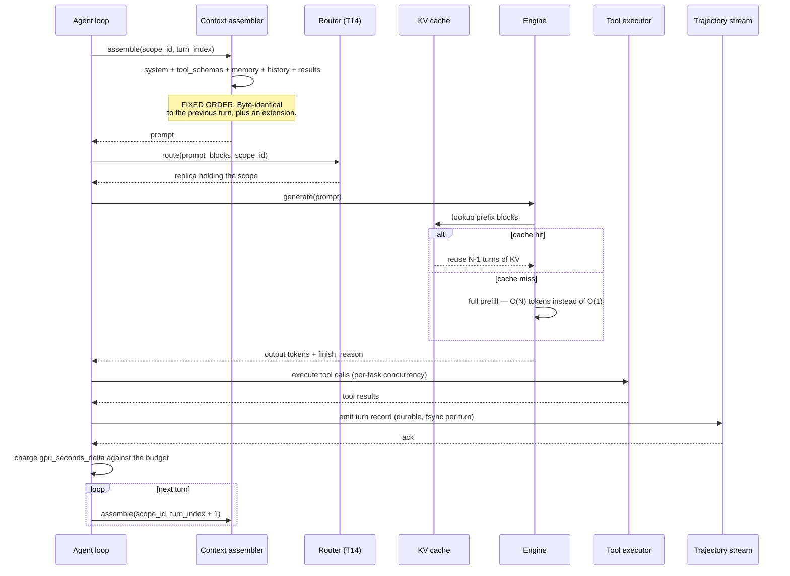
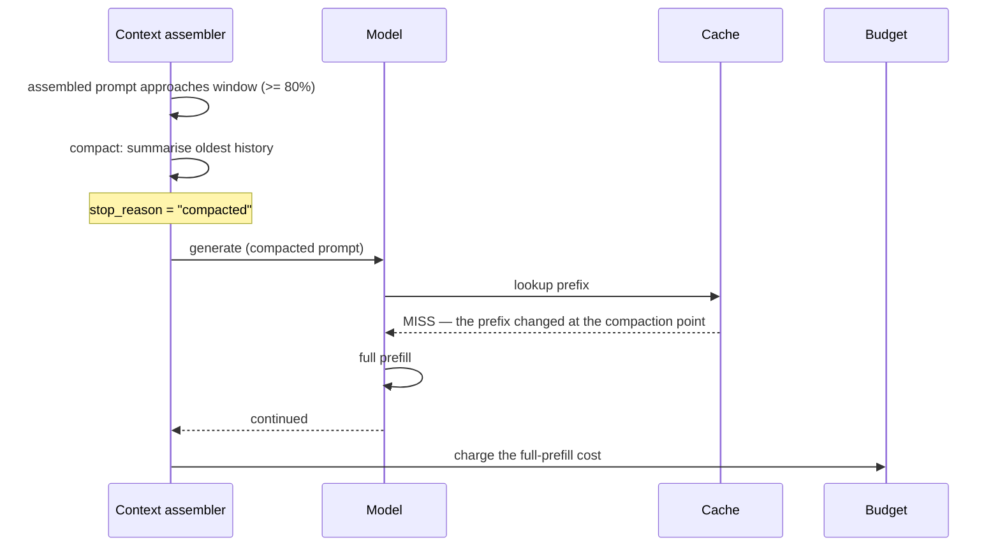
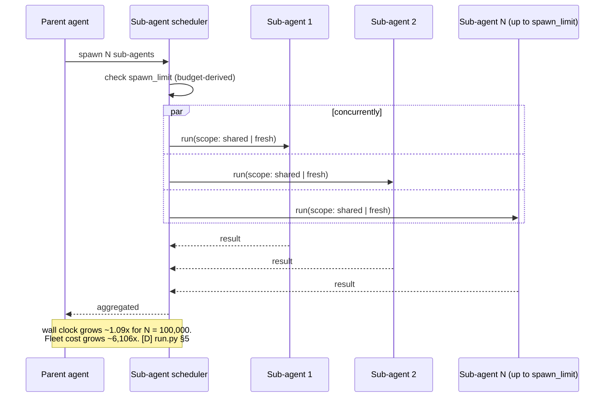
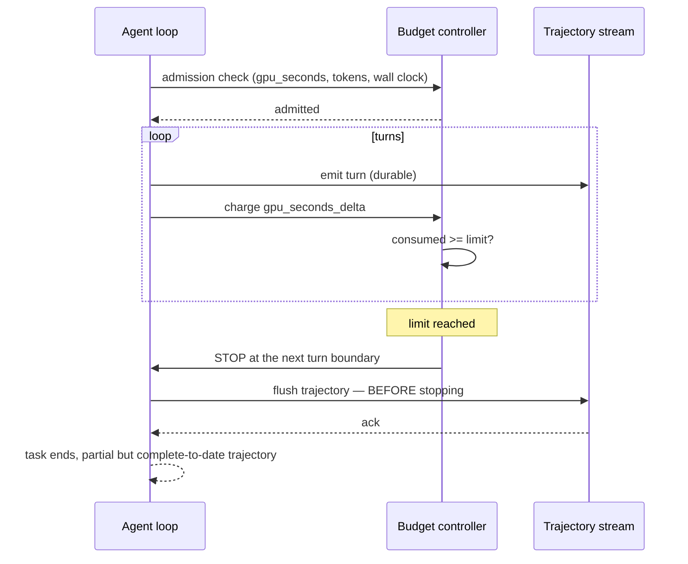
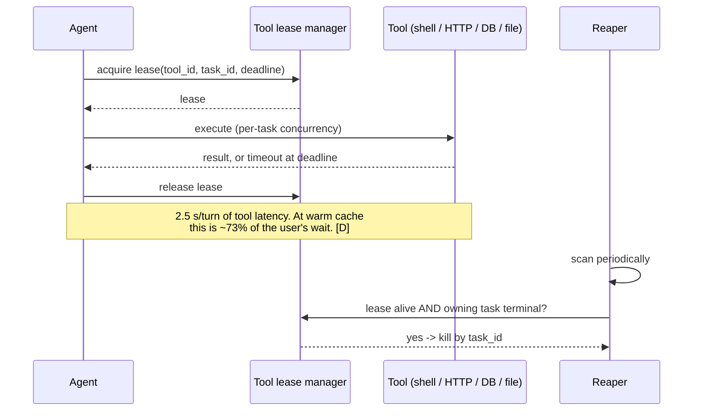

# T16 — Sequences: Agentic Inference, End to End

> **Transcript coverage:** primary · [HLD](../HLD.md) · [LLD](../LLD.md) · [production/](../production/README.md)

Five flows. An agent has no single request boundary — it has a **turn loop**, and every cost property
in the HLD is a property of that loop rather than of any individual call. Each flow below names
**where it fails**, because in this design the failures are silent (a cache that never hits, a
trajectory that never lands) far more often than they are loud.

`[T]` transcript · `[R]` repo · `[D]` derived.

---

## 1. One turn of a 40-turn task — the loop that everything follows from

**Why the assembler order is load-bearing.** Prefix caching matches on a byte prefix. The moment any
field *before* the growing history changes — a timestamp, a re-ordered tool dict, a per-turn request
id — the cache invalidates from that offset onward and every subsequent turn pays a full prefill. The
loop looks identical either way; only the bill differs. This is HLD §3's cold-cache column, and it is
what `context.stable_prefix_required` exists to prevent.

**Where this fails — the silent cache.** The assembly succeeds, the generation succeeds, the answer
is correct, and the fleet cost is **4.6× higher** than it should be because the prefix never matched.
Nothing in this sequence errors. The detection is the integration test LLD §13 names as the one
almost nobody writes: build the same prompt twice, one turn apart, and assert the second is a
**byte-extension** of the first. Cheap, and it catches every row of §3's violation table.

**Where this fails — the schema tax.** `tool_schemas` sit in the prefix and are re-sent every turn
regardless of whether any tool is called. At 6,000 tokens that is **19.1%** of all prompt tokens
across a 40-turn task `[D]` from the HLD's parameterisation. The share scales with **turns**, not
with work — so it is a fixed tax that grows as agents get longer. `max_schemas_per_task` in
[tool-registry.yaml](../production/README.md) is the lever, and its retrieval must be *deterministic*
or it reintroduces the instability it was meant to cure.

---

## 2. Context overflow mid-task — compaction, and the cache-miss spike it causes

**The failure to anticipate is not the compaction — it is the bill.** Compaction is correct behaviour;
it is required to keep the task alive. What surprises teams is the **cache-miss spike** at the moment
it happens, because compaction rewrites the prefix from the compaction point onward. The design
requirement is not to avoid the spike but to make it **attributable**: `stop_reason: "compacted"` is
emitted so the spike correlates with a named event instead of looking like a cache regression. Without
that field, an operator sees a cost discontinuity and has no way to tell it from a bug.

---

## 3. Fan-out — concurrent wall clock, multiplicative cost

**The asymmetry is the finding.** Wall clock scales with `1` because sub-agents run concurrently;
fleet cost scales with `N`. A latency dashboard therefore *structurally cannot see* a fan-out
problem — which is why HLD §3 insists the two metric groups are never graphed on one axis.

**The counterintuitive second-order effect.** Making the parent cheaper makes the fan-out ratio
**worse**: the multiplier rises from 6,106× to 12,615× when the parent's cache goes from cold to warm,
because the sub-agents keep their own cold start and their own history. Any change that flatters the
parent alone magnifies the fan-out. This is the single most useful design-review sentence in the HLD.

**Where this fails — scope choice.** Sharing the parent's context with a sub-agent is cheaper only
above a crossover: `run.py` §5 puts it at roughly **5.6 turns**, which is why
`fanout.shared_scope_max_turns: 5` exists. Below that, a *fresh* scope is cheaper — the shared prefix
is not yet large enough to repay the sub-agent's own cold start. The constant is **derived from this
parameterisation**, not a fact; recompute it for a real workload.

**Where this fails — cold placement.** A sub-agent routed to a replica that does not hold its
parent's scope pays **full cold prefill**. Per `run.py` §5 that is 1,924 vs 2,418 GPU-seconds per 512
sub-agents at 90% reuse — a **20% swing decided entirely by placement**. This is why `scope_id` is
added to T14's routing inputs, and why the router must subscribe to **evict** events as well as
create events: a replica can drop the scope between the routing decision and the request.

---

## 4. Budget exhaustion — stopping at the turn boundary

**Why the stop is at a turn boundary, and why the flush is ordered first.** A mid-turn stop leaves a
turn without a terminal `stop_reason`, which LLD §11 maps to `task = "failed"`. Stopping at a boundary
keeps the trajectory coherent. Flushing *before* stopping is the durability rule: the trajectory is
the training signal the harness exists to produce `[T]`, and it is the only failure in LLD §11's table
that is unrecoverable.

**Where this fails — the tenant budget, which is the one that matters.** A per-task budget stops a
runaway agent; it does not stop a thousand well-behaved agents. That is the normal case and the one
that produces the surprise. The per-tenant hourly GPU-second limit is the number that bounds the
fleet, and the flow above does not exercise it — which is exactly why it must be alerted separately.

---

## 5. Tool execution — the term with no optimiser

**The number to keep in design review.** At warm cache, tool execution is roughly **73% of the user's
wait** and **exactly 0% of the fleet bill** `[D]` HLD §3. It is worth having in the document so that a
review does not spend an afternoon applying a caching technique to a term no caching technique can
reach. The corollary is equally important: once the cache is warm, latency work is largely invisible
to the user unless it targets tools.

**Where this fails — a global concurrency limit.** Capping tool calls globally rather than per task
starves tasks: one long task holding slots blocks every other task's progress, and the symptom looks
like engine slowness rather than a scheduler bug. LLD §4 requires the limit be per-task. The reaper
is the second half: a lease whose owning task has gone terminal must be reclaimed by `task_id`, or
slots leak until the fleet stalls.

---

## Sources

- `refs/Agentic_AI_Infra_transcripts_2/Panel_Agentic_AI_Infrastructure_Platform.txt` — fan-out, "massive tool volume and token prefill"
- `refs/Agentic_AI_Infra_transcripts_2/Tim_Hockin_-_Is_Kubernetes_Good_for_Agents_Infrastructure_Solutions_for_Agent_Sh.txt` — idle fraction, substrate
- `refs/Agentic_AI_Infra_transcripts_2/Jerry_Tworek_-_Opportunities_and_Challenges_for_Long_Horizon_Agents.txt`
- `refs/Agentic_AI_Infra_transcripts_2/Jianfeng_Gao_-_Agentic_Modeling_via_Internalizing_Agent_Harnesses.txt`
- `refs/vLLM_Inference_Meetup_Bengaluru_2026_transcripts/Scaling_Agentic_AI_Distributed_Inference_with_llm-d.txt`

**All sequence structure, state names and span attribute names are `[D]`.** Absolute figures
(GPU-seconds, wall-clock seconds) are arithmetic on the parameters declared in `sim/agent_cost.py`,
not measurements; the ratios are the finding (HLD §3, §5).
