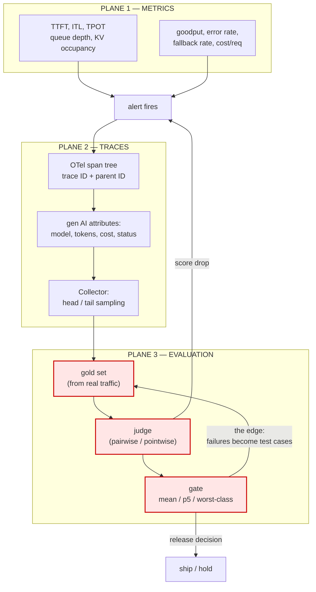
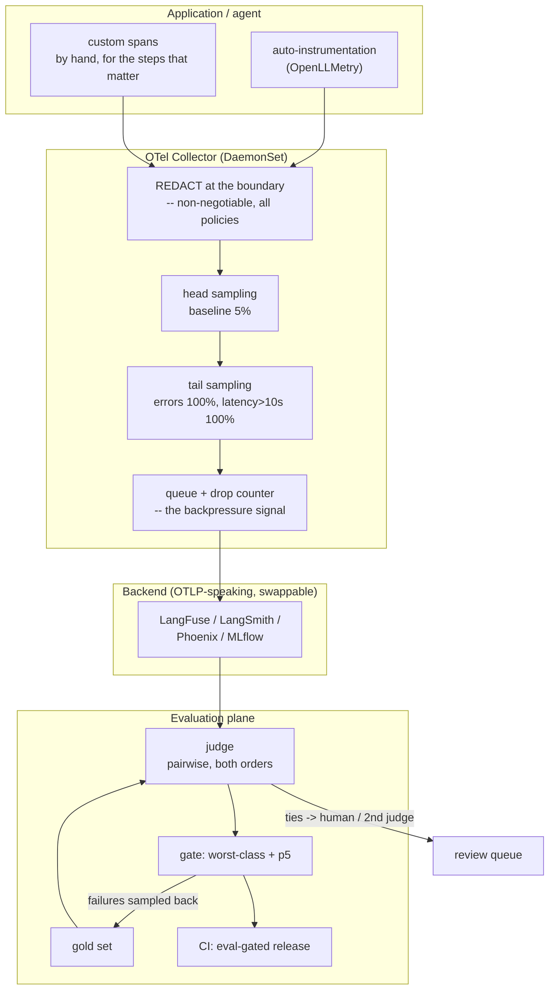

# T17 — Observability & Evaluation: high-level design

> `T17` · **Transcript coverage:** primary · [LLD](LLD.md) · [Cheat sheet](../../00-cheat-sheets/T17-observability-evals.md) · [Case study](../../01-case-studies/T17-observability-evals.md) · [Interview bank](../../02-interview-questions/T17-observability-evals.md) · [Runnable core](run.py) · [Production](production/README.md) · [Sequences](docs/SEQUENCES.md)

"Observability" is presented as one thing — dashboards, traces, evals, alerts — and it is **three
planes wearing one name**, joined by a fourth thing that is not a plane but an edge. The corpus says
this in three sentences that are usually read as a list of features `[T]`:

> "First, trace every request as a tree of nested spans. Second, build on the OpenTelemetry standard
> so your data stays portable across backends. Third, put P95 latency, cost, and error rate on a
> dashboard. And fourth, close the loop by feeding traces into your evaluations and alerts. Tracing
> without that loop is just storage. Tracing with it is how a live system teaches you to improve."

The fourth sentence is not a fourth feature. It is the only one that changes what the other three
*are* — and the same talk names the failure of treating it as optional: *"Worst of all is the
dashboard nobody owns. If no alert fires and no eval reads the traces, you have paid for storage, not
for insight."* `[T]`

**The organising claim of this blueprint** `[D]`: each plane answers a question the other two cannot,
and every observed failure in this topic is a team running one of them and believing they run all
three.

| Plane | Question it answers | Question it cannot answer | Module |
|---|---|---|---|
| **Metrics** | "is it healthy, fast, affordable?" | *why* | `sim/sampling.py` |
| **Traces** | "where did the time go?" | *was it any good?* | `sim/latency.py` |
| **Evaluation** | "was it any good?" | *what actually happened?* | `sim/judge.py`, `sim/stats.py`, `sim/gate.py` |
| **The loop** (an edge, not a plane) | "does any of this make the system better?" | — | `sim/loop.py` |

`[T]` transcript · `[R]` repo · `[D]` derived. Every modelled number below is reproducible from
[`run.py`](run.py); every corpus number is cited to its source. The judge and the failure taxonomy
are **synthetic and say so** — no fabricated benchmarks.

---

## 1. System context

Three planes, three cadences, three owners, and one edge that crosses all of them. The reason this
belongs in an inference-infrastructure blueprint rather than a tooling guide is the third row: an
eval has no ground truth unless someone builds one, so unlike metrics and traces it is
**a system you design**, not a system you install.

| Plane | Unit | Cadence | Owner | Ground truth? | Fails silently when… |
|---|---|---|---|---|---|
| Metrics | a time series | seconds | platform / SRE | inherently (it is the measurement) | a metric has no *name* attached (§3) |
| Traces | a request tree | per request | platform + service owner | the request itself | sampling drops the rare case (§5) |
| Evaluation | a score on an output | per release / per batch | quality / eval owner | **no — must be constructed** | the mean hides the tail (§11) |

The red cycle is the whole design. Cut it and the first three planes are a cost centre; §12 shows the
arithmetic of exactly that.

---

## 2. What "observability" is not

Four things are routinely called observability and are not, and each maps to a plane being run alone.

| Called observability | What it actually is | What it misses | Where this bites |
|---|---|---|---|
| A dashboard | plane 1 only | attribution | "p95 regressed" with no span to open `[T]` |
| A log aggregator | unstructured spans | the tree, and the standard attributes | cannot compute cost uniformly across backends `[T]` |
| An eval script in CI | plane 3, static | live distribution drift | the corpus's own point: *"mine real production traffic instead of inventing toy questions"* `[T]` |
| A tracing vendor | plane 2 + a lock-in | portability, and the loop | *"you never get locked into one vendor's dashboard"* is a property of the **standard**, not the vendor `[T]` |

The corpus is specific that the portability comes from the standard, not the tool `[T]`: *"Every major
tool now speaks the Open Telemetry standard, which is the important part. LangFuse, LangSmith,
Phoenix, and MLflow all read it."* And it names the cheap on-ramp: OpenLLMetry *"extends OpenTelemetry
to language model apps … auto-instrument the libraries you already use"* — with the operating
advice that matters: *"Start with auto-instrumentation for coverage, then add custom spans by hand for
the few steps you care most about."* `[T]`

**Decision: instrument once against OTel, choose the backend later.**

| Option | Pros | Cons | Exceptions | When to use |
|---|---|---|---|---|
| **OTel SDK + OTLP to any backend** | no lock-in; standard GenAI attributes; swap backends without touching app code `[T]` | you own the collector; attribute naming is your problem | a single-vendor stack where the vendor *is* the collector | default |
| **Vendor SDK direct** | fastest to first trace | the trace schema is the vendor's; migration is a rewrite | prototyping only | never in production |
| **Proxy-based (Helicone-style)** | *"tracks latency and cost with almost no code change"* `[T]` | cannot see inside the app — no custom spans, no tool-call detail | LLM calls only, no agent internals | a first week of visibility with zero engineering |
| **Auto-instrumentation (OpenLLMetry)** | spans appear with one init line across OpenAI/LangChain/LlamaIndex/vector DB `[T]` | shallow spans; retrieval and tool semantics are generic | — | start here, then add manual spans `[T]` |

---

## 3. Plane 1 — metrics, and the wall it hits

Metrics are the cheapest plane and the only one with an inherent ground truth: the counter *is* the
measurement. Nothing in this blueprint argues against them. The argument is about what happens when
they are the *only* plane.

The corpus's dashboard list is four items `[T]`, and the fourth is the one nobody ships:

1. *"median and 95th percentile latency broken down by span"* — so *"you know whether retrieval or
   generation is the problem"*;
2. *"cost per request and per day to catch spend creeping up"*;
3. *"your error and fallback rate"*;
4. *"trace coverage itself. A blind spot in your tracing is a blind spot in your whole system."*

Item 1 is a trace statistic rendered on a dashboard, and item 4 is a **meta-metric**: the fraction of
requests that produced a trace at all. It is the only metric whose subject is the observability
system rather than the serving system, and it is the one that detects a collector silently dropping
a namespace.

### 3.1 The wall: a metric has no name attached

The concrete demonstration is experiment 1. The same analysis, run over a chat turn and over an
agentic turn, produces two different span rankings:

| | end-to-end | leaf spans | rank by **self time** | rank by **span count** |
|---|---|---|---|---|
| chat turn | 1199.0 ms | 10 | `decode > ttft > retrieval > queue_wait > guardrail_out` | `queue_wait > prompt_assembly > …` — arbitrary, every span occurs once |
| agentic turn | 2116.0 ms | 25 | `decode > ttft > tool_call > retrieval > guardrail_out` | `tool_call > llm_turn > ttft > decode > queue_wait` — **disagrees** |

In the agentic case `tool_call` has 12 spans and 96.0 ms of self time (4.5% of end-to-end), while
`decode` has 5 spans and 1450.0 ms (68.5%). **Counting spans points at the wrong thing and loses by
more than an order of magnitude.** LLM spans own 1900 ms; tool calls own 96 ms.

A metrics dashboard cannot even form the question. "p95 latency regressed" and "tool calls are slow"
are the same sentence to a metric, because **a metric has no name attached**. That is the argument for
traces, and it strengthens as workloads become agentic — which the corpus says is where the traffic
went: *"about 70% of the inference traffic these days is agentic"*, and *"prefill is occupying like
98% of the tokens"* `[T]` (llm-d talk; see T12 for the prefill consequence).

### 3.2 Saturation signals

For the inference-serving specifics — what to scrape, what a KV-occupancy signal means, why TTFT and
ITL must be tracked separately — see [T15-autoscaling-slo](../T15-autoscaling-slo/HLD.md) and
[T06-inference-fundamentals](../T06-inference-fundamentals/HLD.md). The one signal that belongs in
*this* blueprint is the one that decides whether the other planes are trustworthy:

| Signal | Why it is here and not in T15 |
|---|---|
| `trace_coverage_ratio` | the plane's own health; a dropped namespace looks like a quiet system `[T]` |
| `collector_dropped_spans_total` | the backpressure signal; a full queue silently converts traces into metrics |
| `eval_judge_disagreement_rate` | the tie/undecided rate of §9 — the eval plane's equivalent of queue depth |

---

## 4. Plane 2 — traces, and the one property that makes them worth anything

A trace is worth its storage for exactly one reason: it **decomposes** the end-to-end time rather than
measuring it. The corpus's worked example `[T]`: *"Here is one real request drawn as a stack of spans.
The total was 1.2 seconds. Retrieval took 90 milliseconds. Generation took over a second. The
bottleneck is obvious the moment you can see it."* Reproduced in `run.py`, that request is 1199.0 ms,
of which `decode` alone is 864.0 ms — **72.1% of the wall clock in one span**.

### 4.1 The span model

| Field | Purpose | Corpus basis |
|---|---|---|
| `trace_id` + `parent_id` | *"how the nested tree gets rebuilt"* | `[T]` |
| start / end | durations and the tree | `[T]` |
| model, token counts, cost | cost attribution per request | `[T]` |
| status | *"so errors are visible"* | `[T]` |
| standard gen AI attributes | *"why different tools can read each other's traces"*; *"you can compute cost and latency the same way regardless of which backend stores the data"* | `[T]` |

### 4.2 The decomposition invariant, and the two ways to break it

**Self time is the only aggregation that sums to the end-to-end total without double counting.**
Experiment 1b verifies it exactly: the self-time sum equals the root for both request shapes (1199.0 ms
and 2116.0 ms; `equal: True`). The leaf-sum residual is reported as the instrument's health check — a
trace whose leaves do not sum to the root is a broken instrument, and clock skew across processes is
the usual cause.

Two traps produce a confidently wrong attribution table, and both are avoided in `attribution()`:

| Trap | What it produces | Fix | Cost of getting it wrong |
|---|---|---|---|
| **Including the root span** | "the top span by total is `request`" — the root owns 100% of the wall clock *by construction* | exclude it | an attribution table that says "your request is slow" |
| **Ranking by `total_ms`** | every nested span double-counted: `llm_turn` and its own `decode` child both appear, and the parent looks like a second cost | rank by `self_ms` | error proportional to **nesting depth**, so it over-reports agentic requests far more than chat turns — the instrument degrades exactly where the workload got complicated |

The second trap is why `attribution()` returns `count_discriminates`. In a chat turn every span occurs
once, so a count ranking is arbitrary and must not be presented as if it meant something
(`count_discriminates = False` there; `True` on the agentic turn).

### 4.3 When attribution needs a different statistic

| Question | Statistic | Why not self time |
|---|---|---|
| "what should I optimise?" | top span by **self time** | — |
| "can I hit the target at all?" | `max_possible_saving_ms` = the top span's self time | a target *below* the top span's own self time is unreachable by any reordering |
| "is this even worth decomposing?" | `decomposition_check.residual_pct` | if the tree does not sum, fix the instrument first |
| "why is this one request slow?" | the *distribution*, not one trace | one trace is an anecdote; tail sampling (§5) is how you get the right one |

---

## 5. The trace pipeline — sampling, and the cell the cost dashboard hides

Everything above assumes the trace exists. That assumption is where the corpus's most operationally
specific line lives `[T]`:

> "In development, trace everything. … In high-traffic production, sample the successes, but always
> keep 100% of the errors. And redact personal data at the boundary before it is ever written."

Experiment 2 over 100,000 requests per release (1.2% errored, 0.8% slow-but-not-errored):

| policy | kept | kept % | error coverage | slow coverage | MB/release | tail-based? |
|---|---|---|---|---|---|---|
| `trace_all` | 100,000 | 100.0% | 100% | 100% | 409.6 | no |
| `uniform_5pct` | 5,000 | 5.0% | **5%** | 5% | 20.5 | no |
| `uniform_1pct` | 1,000 | 1.0% | **1%** | 1% | 4.1 | no |
| `errors_only` | 1,200 | 1.2% | **100%** | **0%** | 4.9 | no |
| `tail_sample` | 6,891 | 6.9% | **100%** | **100%** | 28.2 | yes |

**The cell that matters** is the comparison between rows 2 and 5: `uniform_5pct` and `tail_sample` keep
almost the same number of spans (5.0% vs 6.9%) and have completely different error coverage (5% vs
100%). A cost dashboard shows the middle columns. An incident review needs the right ones. Tail
sampling costs 6.9% of trace-all storage to keep 100% of the errors — that is the entire frontier in
one line.

### 5.1 Why `errors_only` is a trap

It is cheaper than `tail_sample` (4.9 MB vs 28.2 MB) and has the same error coverage. It has **0% slow
coverage**, and the slow-but-successful request is the one that becomes the outage. The corpus's
collector description puts latency and errors in the same policy for this reason `[R]`: errors 100%,
latency > 10 s 100%, baseline probabilistic 5%.

### 5.2 The blind spot is rarity, not cost

The usual argument for tail sampling is "we can't afford everything". Experiment 3 shows that the
real argument is stronger, and different. Over a 10,000-request window (~1 hour at 3 rps):

| incident rate | keep | P(no trace) | P(caught) | requests for 95% confidence |
|---|---|---|---|---|
| 1.0% | 5% | 0.0067 | 0.9933 | 5,990 |
| 0.1% | 5% | 0.6065 | 0.3935 | 59,913 |
| 0.01% | 5% | **0.9512** | **0.0488** | 599,145 |
| 0.01% | 100% | 0.3679 | 0.6321 | 29,956 |

At 3 rps, a 1-in-10,000 failure needs **55.5 hours** of uniform 5% sampling to produce a single trace,
versus 2.77 hours at 100%. And the probability of having *no* trace is monotone in rarity, so **the
failures that matter most are the ones most likely to be invisible.**

That is the real content of *"always keep 100% of the errors"*: not that errors are cheap to store —
they are 1.2% of traffic — but that **a sampled error trace is an error trace you do not have. Tail
sampling is a correctness requirement for debuggability, not a cost optimisation.**

### 5.3 Redaction is orthogonal to sampling

The corpus's second clause — *"redact personal data at the boundary before it is ever written"* `[T]` —
is separate from the first for a reason, and the code enforces it. `redaction_is_orthogonal()` returns
`{"pii_risk_reduced_by_sampling": False, "requires_boundary_redaction": True}` for every policy in
`DEFAULT_POLICIES`, including `uniform_1pct`. **A 1% sample of unredacted prompts is still an incident,
just a smaller one.** The config surface therefore treats redaction as a collector precondition that
cannot be traded against a sampling rate (`production/README.md` §5, boot check 5).

The corpus names the other two failure modes alongside it `[T]`: *"Store user text without redaction,
and your trace store becomes an incident. Trace every token at full volume, and the signal disappears
under the noise."* Note the symmetry — one is too much data of the wrong kind, one is too much data of
the right kind. Neither is fixed by the other.

---

## 6. Plane 3 — evaluation, and why it is a system rather than a step

Metrics and traces have a ground truth: the counter is the measurement, the span is the request. An
**eval does not.** Someone has to decide what "good" means, encode it, and then prove that the encoding
measures it. Every failure in this plane is a team skipping the third step.

### 6.1 The gold set

The corpus is specific about provenance `[T]`: *"They mine real production traffic instead of inventing
toy questions because real users ask things you would never think to test."* And about size: *"A curated
200 examples often beats a random 10,000."*

| Source | Pros | Cons | When to use |
|---|---|---|---|
| **Mined from production** `[T]` | the distribution is real; drift is captured | requires redaction, and a sampling pipeline | default, once traffic exists |
| Hand-written | fast to start; covers known-hard cases | tests what you already thought of | pre-launch only |
| Synthetic generation | unlimited; cheap | tests the generator's imagination | bootstrapping, then replace |
| Failure-derived (the loop) | each entry is a *real* defect that shipped | slow to build; needs §12 | the steady state |

**A gold set has correctness conditions of its own, and they are checkable.** `GoldSet` exposes
`label_balance()`, `is_degenerate()`, `close_pairs()` and `family_mix()`. The first is load-bearing:
if the better answer sits in slot `a` in nearly every pair, then a judge with a *position bias* aimed
at slot `a` scores **as accuracy** — and Cohen's kappa collapses to 0.000, which is the only reason
the problem is visible at all. This was a real defect in an earlier version of this blueprint's own
gold set (§8.2, `PROGRESS.md`), and it is very easy to make when a set is assembled by hand from real
traffic. **`label_balance` is reported before every correction table for that reason.**

### 6.2 The judge, and the three documented biases

The corpus names all three, with the citation `[T]` (Jung et al. 2023):

> "the judge itself is biased. It tends to favor the first answer it sees. It rewards length even when
> length adds nothing, and it flatters outputs from its own model family. So, randomize the answer
> order, cap or normalize length, and never let a model be the sole judge of its own family."

**This blueprint does not measure a real judge.** It builds one with a *known* latent quality per
answer, injects each bias as an explicit parameter, and measures how far the verdicts move from the
truth. That is the only way to quantify a bias: with a real judge you can measure agreement but never
know which side was right. The consequence for the design is that **agreement against a
human-labelled gold set is the number that validates an eval**, and it must be re-measured whenever
the judge model or its prompt changes.

### 6.3 Scoring mode

The corpus gives both modes and when each is right `[T]`: *"Pointwise is scoring as the judge to rate
one answer from one to five. It is simple but noisy because absolute scores wander. Pairwise scoring
instead shows the judge two answers and asks which is better. Pairwise is far more reliable for close
calls."*

| Mode | Cost per comparison | Agreement (all pairs) | Agreement (close calls) | κ |
|---|---|---|---|---|
| pairwise | 1 judge call | 80.5% | 69.4% | 0.609 |
| pointwise | 1 judge call | 70.0% | **59.9%** | 0.400 |
| pairwise, close-calls-only subset | 1 | — | 64.3% | 0.265 |
| pointwise, close-calls-only subset | 1 | — | 59.9% | 0.181 |

The gap is +10.5 points overall and **+4.5 points on the close calls** — concentrated exactly where the
corpus says it is. The mechanism is *not* that pointwise is biased; the bias terms are identical in
both modes. It is that pointwise must place an answer against a *remembered rubric* instead of against
a *visible alternative*, so per-call noise is larger and the same true margin is harder to resolve.
**Both modes suffer the same biases and only one suffers the extra noise.** Hence: pointwise to gate,
pairwise to choose.

---

## 7. The judge corrections — the corpus's remedy, measured

The corpus's sentence prescribes three fixes in an order. Experiment 4 applies each **alone**, so the
value of each is separable (400 pairs, label balance 0.512, `degenerate=False`):

| variant | agreement | κ | close-call agreement |
|---|---|---|---|
| none (naive) | 75.5% | 0.507 | 70.1% |
| + randomize order | 76.8% | 0.535 | 70.1% |
| + length normalized | **80.5%** | 0.607 | 74.5% |
| + different family | 79.2% | 0.582 | 75.8% |
| + all three | 80.5% | 0.609 | 69.4% |

Ranked by what each single correction buys: **length normalized (+5.0) > different family (+3.7) >
randomize order (+1.2)**.

That ranking is not the one the corpus's sentence order suggests, and it is measurable rather than
assumed. The judge's length and self-preference terms are **continuous** — they fire on every pair —
while the position term only matters for pairs whose margin is smaller than the bias. §8 shows the
mechanism directly.

### 7.1 The corrections are not additive

The best single correction gets 80.5%; all three together get 80.5%. Once the dominant bias is fixed,
**the other two buy +0.0 points.**

This is not a defect in the corrections; it is a statement about the judge. Two of the three biases
were pulling the same verdicts in the same direction on this gold set, so fixing either one recovers
most of the error and fixing both recovers little more.

The cost asymmetry makes this a design decision rather than a curiosity:

| Correction | Engineering cost | Recurring cost | Measured value here |
|---|---|---|---|
| randomize order | one line | none | **+1.2** |
| length normalize | a prompt change; a rewrite or a cap | re-validate the prompt | **+5.0** |
| different family | a second judge integration | **a second vendor and a second bill** | **+3.7** |

A team that ships "the three fixes" as a bundle pays for a second vendor and cannot tell which one
carried the result. A team that measures each alone learns it may not need the third.

### 7.2 Read `label_balance` before trusting any of it

If the gold set puts the better answer in slot `a` almost always, a position bias aimed at `a` scores
as accuracy, kappa reads 0.000, and **the correction table inverts** — the fixes appear to make the
judge worse. That is not hypothetical: it was a real defect in this blueprint's own gold set, caught
only because kappa came out at exactly 0.000 for every variant. `is_degenerate()` is the check;
`production/README.md` §6 gates on it.

| Symptom | Actual cause | Fix |
|---|---|---|
| κ ≈ 0.000 for every variant | gold set label-imbalanced | rebalance slots; re-run |
| the fixes make agreement *worse* | same | same |
| close-call agreement is near chance on every variant | the gold set contains too few close pairs | mine harder negatives |

---

## 8. Position bias: the corpus's fix is not the strong one

This is the blueprint's second measured disagreement with the corpus, and it is the more consequential
one. Experiment 5 sweeps the position bias β and runs three handling strategies:

| β | fixed order | randomised | both orders, tie = wrong | both orders, decided only | tie rate |
|---|---|---|---|---|---|
| 0.00 | 78.8% | 78.8% | 71.2% | 84.6% | 15.8% |
| 0.20 | 78.5% | 80.2% | 67.2% | 84.3% | 20.2% |
| 0.40 | 76.0% | 76.8% | 62.5% | 85.3% | 26.8% |
| 0.60 | 73.5% | 74.0% | 52.2% | 90.1% | 42.0% |
| 0.80 | 71.5% | 71.8% | 46.5% | 94.4% | 50.7% |
| 1.00 | 67.0% | 67.8% | 38.0% | 95.0% | 60.0% |
| 1.20 | 63.5% | 65.0% | 29.5% | 95.9% | 69.2% |
| 1.50 | 60.8% | 61.8% | 20.5% | 98.8% | 79.2% |

**Randomising the order — the corpus's prescribed fix — buys +0.0 to +1.7 points across the whole
sweep.** It decorrelates the bias from the label, so the *signed* error disappears; but the bonus is
still applied, at random, on every call, and on a close pair a random bonus the size of the margin is
a coin flip. **It trades a systematic error for extra variance.**

The stronger fix, and the one this blueprint recommends operationally, is to **run both orders and
treat a disagreement as undecided**. That cancels the bonus exactly instead of in expectation. Read
the three right-hand columns together, because none means anything alone:

| Column | What it shows | Why it is not the headline |
|---|---|---|
| both orders, tie = wrong | 20.5% vs 60.8% at β=1.50 — *worse* than fixed order | honest, and not the reason to adopt the method |
| both orders, decided only | better than fixed order at **every** β, and the margin grows with the bias (84.6% vs 78.8% at β=0; 98.8% vs 60.8% at β=1.50) | the denominator shrinks — must be read with the tie rate |
| **tie rate** | rises monotonically 15.8% → 79.2% with β | **this is the deliverable** |

The tie rate is not noise. The pairs the bias flips are *exactly* the pairs whose verdict changes when
the order changes, so **the abstention set is a calibrated measurement of the judge's unreliability** —
and it is the only one of the three strategies that reports one at all.

> **Operational rule.** Run both orders. Publish decided accuracy *and* tie rate side by side. Route
> ties to a human or a second judge. A judge that silently calls a coin flip and a judge that says "I
> cannot call this" produce the same accuracy number and completely different decisions.

### 8.1 Verbosity bias survives every ordering

Verbosity is a **correlation** between length and score, not a positional artefact, so no ordering
strategy touches it. Measured (length generated independently of quality in the gold set):

| quantity | r |
|---|---|
| biased judge, score margin vs length margin | **+0.628** |
| length-normalized | +0.150 |
| **baseline:** length margin vs *quality* margin, sample | **+0.178** |

The baseline is the honesty check and it must be reported: the *true* association is 0 by
construction, but the *sample's* is not exactly 0, and **+0.178 is what the biased judge's +0.628 must
be compared against**. The corrected judge lands at +0.150, at the sample's own incidental level. A
judge whose r merely *matched* the baseline would not be exhibiting bias at all — it would be reading
the length-quality association that happens to be in the sample. Without the baseline, "+0.628" looks
alarming and "+0.150" looks adequate, and neither reading is available.

### 8.2 Decision table — how to handle a judge's position bias

| Option | Pros | Cons | Exceptions | When to use |
|---|---|---|---|---|
| Fixed order | cheapest; 1 call | systematic, label-correlated error; **silently wrong** | a gold set with balanced slots *and* a verified unbiased judge | never for a release gate |
| Randomise order `[T]` | free; removes the signed error | measured gain +0.0…+1.7; no uncertainty report | a large set where a point of noise is irrelevant | always, as a floor |
| **Both orders, tie = undecided** `[D]` | cancels the bias; **produces a calibrated tie rate** | 2× judge calls; a tie-handling policy is required | a stable judge where a 2× cost is unacceptable | the release gate |
| Different family | removes self-preference (+3.7 measured) | a second vendor and a second bill | — | when self-preference is confirmed by measurement |
| Longer rubric / few-shot anchors | cheap, no extra vendor | does not address a *stated* bias | as a supplement | with any of the above |

---

## 9. Eval-set sizing — three problems, three rates, one that binds

The corpus's caution `[T]`: *"With 20 examples, one lucky run looks like real progress. … And a mean of
4.2 can still hide the 5% of answers that leak data or invent facts. Always inspect the worst cases,
not just the average."* Experiment 7 turns that into three separate curves (pairwise win rate,
per-example sd 0.5):

| n | std err | MDE (80% power) | P(false +0.20) | power vs +0.20 | P(set contains a 5% class) |
|---|---|---|---|---|---|
| 20 | 0.112 | 0.443 | 3.7% | 49.8% | **64.2%** |
| 50 | 0.071 | 0.280 | 0.2% | 49.8% | 92.3% |
| 100 | 0.050 | 0.198 | 0.0% | 49.8% | 99.4% |
| 200 | 0.035 | 0.140 | 0.0% | 49.8% | **100.0%** |
| 400 | 0.025 | 0.099 | 0.0% | 49.8% | 100.0% |
| 1000 | 0.016 | 0.063 | 0.0% | 49.8% | 100.0% |

**Three different problems, three different rates of improvement, and one of them binds:**

1. **Power.** At n=20 the smallest detectable win-rate change is 0.443, so a *real* regression of 0.20
   is detected only ~50% of the time. **The break ships green.**
2. **False confidence.** At n=20 a change that did *nothing* reports a ≥0.20 improvement 3.7% of the
   time. This is the corpus's "one lucky run" — and it is the arm that **merges a bad change**.
3. **Tail representation.** At n=20 a set contains an example of a 5% failure class only 64.2% of the
   time. **A mean cannot report a problem in a class the set does not contain** — this is the corpus's
   "mean of 4.2 hiding the 5%".

At n=200 all three are adequate — which is why the corpus's *"curated 200 examples"* is not a round
number pulled from the air. n=100 is where (1) and (2) become acceptable; **(3) is usually the binding
constraint and it is the one nobody computes.**

> **Design consequence.** *"How big should the eval set be?"* has no single answer: the size that
> satisfies power is not the size that satisfies tail representation, and **the largest of the three
> requirements binds.**

Note what the table also says: detection power against a +0.20 effect is **flat at 49.8% for every n**.
That is correct and worth stating — the "power" column is computed for a *fixed* alternative, and at a
fixed effect size, power does rise with n only when the effect exceeds the MDE. Read the MDE column,
not the power column, to size a set.

---

## 10. The gate — mean, p5, or worst-class

The release gate is where the eval plane becomes a decision. The corpus's instruction is unambiguous
`[T]`: *"Most importantly, watch the fifth percentile, your worst cases. A great average with an ugly
tail is exactly the profile that produces embarrassing screenshots."*

Experiment 8 runs three gates over the *same* four releases' scores:

| release | mean | p5 | worst class | class | mean gate ≥4.0 | p5 gate ≥3.2 | class gate ≥3.6 |
|---|---|---|---|---|---|---|---|
| v1-baseline | 4.22 | 2.92 | 3.48 | hard | **PASS** | **FAIL** | **FAIL** |
| v2-reranker | 4.35 | 3.27 | 3.77 | hard | PASS | PASS | PASS |
| v3-aggressive | 4.39 | 2.95 | 3.73 | hard | **PASS** | **FAIL** | PASS |
| v4-safe | 4.32 | 3.08 | 3.65 | hard | **PASS** | **FAIL** | PASS |

The gates disagree on **3 of 4 releases**, and the disagreement is one-directional: **the mean passes
releases the tail gates fail.** Pass rates: mean 100%, p5 25%, worst-class 75%.

**The v3 row is the one to study.** It has the *highest mean of the four releases* and a bad tail, and
it also hides a safety regression:

| metric | v1 → v3 | reading |
|---|---|---|
| mean | 4.22 → 4.39 (**+0.17**) | IMPROVED |
| p5 | 2.92 → 2.95 (+0.03) | flat |
| safety slice | 4.28 → 4.20 (**−0.08**) | **WORSE** |

A team gating on the mean ships v3 and calls it the best release of the quarter. This is the same
**tail-over-mean** pattern this knowledge base finds independently in T08's goodput, T09's p99 and
T10's SNR — four unrelated topics, one signature.

### 10.1 Percentile versus slice

`worst_class` fails v3 where p5 does not have to, and the distinction is not stylistic: **a percentile
is a property of the whole distribution while a slice is a property of the population that gets
hurt.** A percentile gate assumes every example is exchangeable; a slice gate refuses that assumption.
For a safety slice, the refusal is correct.

| Gate | Pros | Cons | Exceptions / when to use |
|---|---|---|---|
| mean | stable; familiar; simple | **passes releases with bad tails and hidden regressions** | a first-pass smoke signal only, never the release gate |
| p5 / percentile `[T]` | catches the "ugly tail" directly | treats all examples as exchangeable; a thin slice can be invisible inside it | general quality gating |
| **worst-class / slice** | targets the population that gets hurt; catches safety regressions a percentile misses | needs a labelling of examples into classes; more slices → more chances to fail by noise | **safety, compliance, and any named customer-visible segment** |

**Gate configuration is a policy decision that must be versioned with the eval set**, and the
`slice: worst` setting plus a `context_lengths` list is why the T10 blueprint's manifest carries the
same shape (`../T10-quantization/production/README.md` §1). A gate whose statistic is not recorded
with the release is an un-auditable decision.

---

## 11. The loop — the fourth thing, and the only one that compounds

The corpus states the whole design in one paragraph `[T]`:

> "The non-obvious part is that tracing only pays off when it is connected to something. On their own,
> traces are logs nobody opens. The magic is the feedback loop. Score live traces with a judge, alert
> when the score drops, and sample the failures into a dataset. … Yesterday's production failure
> becomes today's test case, and your eval set gets stronger every week on its own."

Experiment 9 runs two deployments against the same stream of production failures over 24 releases,
differing in exactly one edge: **whether an observed failure is written back into the eval set.**

| | open loop (traces → storage) | closed loop (traces → judge → dataset → gate) |
|---|---|---|
| escaped, total | 99,591 | 4,401 |
| severity-weighted | 237,595 | 11,691 |
| per-release, first → last | 4,150 → **4,150 (flat)** | 4,150 → **0** |
| final class coverage | 0.0% | 100.0% |
| severity per escaped occurrence | 2.39 | **2.66** |
| eval set size | 60 (static) | 100 |
| storage over 24 releases | 1,152 GB | 1,152 GB |

Three properties of the result matter, and the second is the one that is not obvious:

**1. The ratio grows without bound.** The open loop's escapes are flat; the closed loop's fall to zero
at release 2 and stay there. So the value of the loop is not a constant factor — it **compounds**,
which is what *"gets stronger every week on its own"* means mechanically. The last-release ratio is not
a large number; it is a divide by zero, and **that is the result.**

**2. The weighted ratio is LOWER than the raw one (20.3× vs 22.6×), and that is a finding rather than
a detail.** The closed loop's residual escapes carry a *higher* mean severity than the open loop's
(2.66 vs 2.39), so **the classes that resist closure longest are the rare, expensive ones**. The
mechanism is in the sampling: a rare class produces few traced occurrences, and the noticing
probability falls with its rate. **The loop closes the head first and the tail last** — the same
tail-over-mean pattern, reproduced inside the loop that exists to fix it.

The consequence is operational, not theoretical: 100% class coverage is reached at release 2, so the
ramp is severity-skewed and **the first weeks are not representative of the steady state**. The fix is
not a larger sample rate for its own sake — it is **targeting the tail**, by seeding the eval set with
rare classes from incident review rather than waiting for 5% sampling to stumble on a 1-in-10,000
event (§5.2).

**3. The open loop's cost is not the problem — its return is.** 1,152 GB over 24 releases at 48 GB per
release is affordable. The defects prevented are **zero**, so the return per GB is zero and **any price
is too high.** This is the corpus's *"you have paid for storage, not for insight"* `[T]` as arithmetic.

> **Design consequence.** Instrumentation that does not feed a gate is a cost centre with no signal,
> and the fix is **one edge in a diagram, not more storage.**

### 11.1 The loop's own failure modes

| Failure | Symptom | Guard |
|---|---|---|
| Judge cannot see the class | coverage plateaus below 100% | `judge_sensitivity` is a parameter, not an assumption (§6.2) — measure agreement |
| Sample rate too low for the tail | long ramp; severity-skewed residual | target the tail from incident review (§11, finding 2) |
| Dataset grows without curation | duplicate and near-duplicate cases | the corpus's own caution: *"A curated 200 examples often beats a random 10,000"* `[T]` |
| Alert on score, not on coverage | score falls for a class the set never had | alert on `trace_coverage_ratio` and on class coverage, not the mean |
| Traces stored, loop never built | 1,152 GB, 0 defects prevented | the §12 boot check |

---

## 12. Deployment topology

The three design decisions this topology encodes, each argued above:

| Decision | Where | Why |
|---|---|---|
| **Redaction is inside the collector, before sampling** | `C1` before `C2`/`C3` | §5.3 — sampling does not substitute for it, at any rate |
| **Tail sampling is a policy, not a flag** | `C3` with an errors rule and a latency rule | §5.1 — `errors_only` has 0% slow coverage |
| **The gate fails to a slice, not to a mean** | `V3` | §10 — the mean passes v3; the slice does not |

---

## 13. Failure domains

Nine ways this system fails. Six are silent, which is the property that makes this topic dangerous.

| # | Failure | Plane | Silent? | Detection | Mitigation |
|---|---|---|---|---|---|
| 1 | Unredacted user text stored | 2 | **silent** | PII scan on the store | collector precondition; boot check refuses `redact: false` |
| 2 | Head sampling at 5%, rare incident at 0.01% | 2 | **silent** | `trace_coverage_ratio` alone cannot see it — needs per-class coverage | tail sampling on errors + latency `[T]` |
| 3 | Collector queue full, spans dropped | 2 | **silent** | `collector_dropped_spans_total` | treat drops as an alert, not a metric |
| 4 | Gold set label-imbalanced | 3 | **silent** | κ ≈ 0.000 for every variant | `is_degenerate()` gate (§7.2) |
| 5 | Judge position bias, single order | 3 | **silent** | tie rate is unavailable — you only see it by running both orders | both orders; publish tie rate (§8) |
| 6 | Verbosity bias | 3 | **silent** | r(length, score) with no baseline reads as fine | report the baseline r alongside (§8.1) |
| 7 | Eval set too small | 3 | **silent** | nothing fires; the break ships green | size the tail requirement, not the power requirement (§9) |
| 8 | Mean gate passes a tail regression | 3 | **loud but misattributed** | the *next* release's incident | worst-class slice gate (§10) |
| 9 | Loop never built | all | **silent, and expensive** | defects prevented = 0 | the boot check below |

**The boot check** — five assertions that catch the silent ones before traffic:

1. `redact` is configured and its stage precedes any sampling stage (§5.3);
2. at least one sampling rule covers **errors** at 100% `[T]`;
3. a latency-based tail rule exists (§5.1 — otherwise slow-but-successful requests are dark);
4. the gold set passes `label_balance` within tolerance (§7.2);
5. a gate exists whose statistic is a **slice or percentile**, not only a mean (§10).

A deployment that passes 1–3 and fails 4–5 has traces it cannot act on. A deployment that passes 4–5
and fails 1–3 has evals built on traces with holes in them. **Both are worse than an obvious outage,
because an obvious outage is loud.**

---

## 14. Build vs buy

| Layer | Buy | Build | Verdict |
|---|---|---|---|
| Trace store + UI | LangFuse / LangSmith / Phoenix / MLflow, all OTLP `[T]` | — | **buy**; the standard makes it swappable |
| Instrumentation | OpenLLMetry auto-instrumentation `[T]` | custom spans for the 3–5 steps you care about `[T]` | **buy the base, build the depth** |
| Collector config | — | sampling policy, redaction, drop alerting | **build**; this is where your policy lives |
| Gold set | — | mined from your production `[T]` | **build**; nobody else has your traffic |
| Judge | a frontier model as judge | bias corrections, both-order harness, agreement tracking | **build the harness**, rent the model |
| Gate + CI | — | statistics, slices, thresholds, versioning | **build**; this *is* the release process |
| The loop | — | the one edge in the diagram | **build**; nothing off-the-shelf wires your failures into *your* dataset |

The pattern: **everything with a wire in it is buyable; everything with a policy in it is not.** The
corpus's portability claim — *"Instrument once against OpenTelemetry and you can swap back ends later
without touching your application code. That portability is worth protecting."* `[T]` — is exactly the
statement that the store is a commodity and the policy is the asset.

---

## 15. What changes at 10×

| Dimension | At 1× | At 10× | What breaks first |
|---|---|---|---|
| Trace volume | 100k req/release | 1M req/release | storage, until tail sampling; then the **collector queue** |
| Sampling rate | 5% is affordable | 5% of 1M is 50k traces — the signal disappears under noise `[T]` | **the frontier's shape**, not its size (§5) |
| Rare-class noticing | ~2 releases to full coverage | unchanged *per release*, so the ramp is longer in wall-clock terms | the tail (§11, finding 2) |
| Eval set size | 200 adequate | **still 200** — the three constraints do not scale with traffic | nothing; this is the reassuring row |
| Judge cost | one pass per release | both-order judging doubles it | the second vendor bill (§7.1) |
| Gate | manual review of failures | review queue is the bottleneck | **tie handling** (§8) |
| Cardinality | per-request labels are fine | per-request labels become a metrics bill | metric label cardinality, not trace volume |

Three of these are counter-intuitive and worth stating plainly:

- **The eval set does not grow with traffic.** Its size is set by power, false-confidence and
  tail-representation requirements, none of which depend on request volume. A 10× system needs the
  same 200 curated examples — and *better curated ones*, because the tail classes are what changes.
- **The collector becomes the critical path.** At 10× the drop counter, not the disk, is the thing
  that fails — and it fails silently (§13, row 3).
- **Tie handling becomes a staffing decision.** At β=0.20 the tie rate is 20.2%; over 200 gated pairs
  that is ~40 human reviews per release. That is a real, budgetable number, and it only exists if you
  ran both orders.

---

## 16. Six takeaways

1. **Three planes, one edge.** Metrics answer "is it healthy", traces answer "where did the time go",
   evals answer "was it good" — and *"tracing without that loop is just storage"* `[T]`. The edge
   is the design; the planes are the parts.
2. **A metric has no name attached.** The agentic turn proves it: 12 tool calls beat 5 LLM turns on
   count and lose 96 ms to 1450 ms on self time. Rank by **self time**, exclude the root, and check
   that the leaves sum to the root.
3. **Tail sampling is a correctness requirement, not a cost optimisation.** At a 0.01% incident rate
   with 5% head sampling, an hour of traffic produces a trace with probability 0.005. *"Always keep
   100% of the errors"* `[T]` is about rarity, not about storage — and redaction is orthogonal to it at
   every rate.
4. **The corpus's judge fix is the weak one.** Randomising the order buys +0.0 to +1.7 points; running
   **both orders and treating disagreement as undecided** cancels the bias and produces a tie rate that
   is a calibrated measure of the judge's unreliability. Length normalization is the largest single
   correction (+5.0), and the three corrections together buy +0.0 beyond the best single one.
5. **Eval-set size is decided by the tail, not by power.** Three constraints improve at three rates;
   tail representation binds, and a mean cannot report a problem in a class the set does not contain.
   Meanwhile a mean *gate* passes the release with the highest mean and a hidden safety regression —
   the same tail-over-mean signature as T08's goodput, T09's p99 and T10's SNR.
6. **The loop compounds, and it closes the head before the tail.** The open loop stores 1,152 GB and
   prevents zero defects; the closed loop differs in one edge and its escape rate falls to zero. But
   its residual is severity-skewed upward (2.66 vs 2.39 per escape), because rare classes are noticed
   last — so seed the eval set from incident review, not from sampling alone.

---

## Sources

| File under `refs/` | Used for |
|---|---|
| `LLMOps_Agentic_AIOps_The_Hands-On_Playlist_2026_transcripts/LLM_Observability_Traces_Spans_OpenTelemetry_for_AI_Apps.txt` | the trace/span definition; the 1.2 s worked example; trace ID + parent ID; gen AI attributes; the four-item carry-out list; sampling rule and redaction at the boundary; the dashboard items incl. trace coverage; the OTel/LangFuse/LangSmith/Phoenix/MLflow/Helicone/OpenLLMetry passage; the three failure modes; the incident walkthrough |
| `LLMOps_Agentic_AIOps_The_Hands-On_Playlist_2026_transcripts/How_to_Evaluate_LLM_Apps_LLM-as-a-Judge_RAGAS_Without_the_Bias.txt` | the three judge biases (Jung et al. 2023); pointwise vs pairwise and the close-call claim; mining real traffic; "curated 200 beats a random 10,000"; "one lucky run"; "mean of 4.2 hiding the 5%"; the fifth-percentile instruction; RAGAS/DeepEval/PromptFoo |
| `vLLM_Inference_Meetup_Bengaluru_2026_transcripts/Scaling_Agentic_AI_Distributed_Inference_with_llm-d.txt` | "about 70% of the inference traffic these days is agentic"; "prefill is occupying like 98% of the tokens" |
| `Agentic_AI_Infra_transcripts_2/Weizhu_Chen_-_Continuous_Model_Improvement.txt` | "just define a grader"; the synthetic-data share; optimising the harness rather than the model |
| `CMU_Inference_Algorithms_for_Language_Modeling_Fall_2025_transcripts_2/CMU_LLM_Inference_2_Probability_Review_and_Code_Examples.txt` | deterministic metrics computed from generated text (diversity, cross-generation bigram overlap); the LM-as-judge comparison |
| `ai-system-design-guide-main/ai-system-design-guide-main/` | house style and the observability/MLOps framing |
| `llm-inference-engineering-main/llm-inference-engineering-main/README.md` | index used for cross-topic links (T06, T15) |

Related blueprints: [T06 inference fundamentals](../T06-inference-fundamentals/HLD.md) ·
[T08 batching & scheduling](../T08-batching-scheduling/HLD.md) · [T09 speculative decoding](../T09-speculative-decoding/HLD.md) ·
[T10 quantization](../T10-quantization/HLD.md) · [T15 autoscaling & SLO](../T15-autoscaling-slo/HLD.md) ·
[T18 guardrails & security](../T18-guardrails-security/HLD.md)
