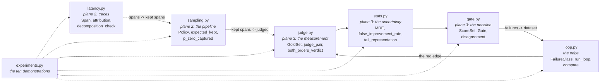
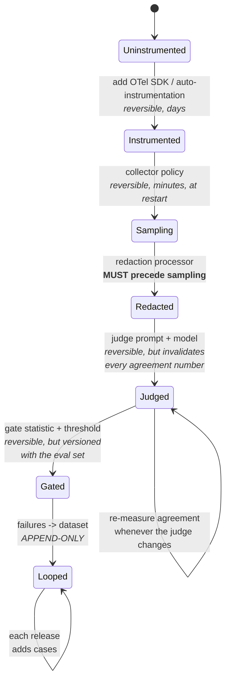
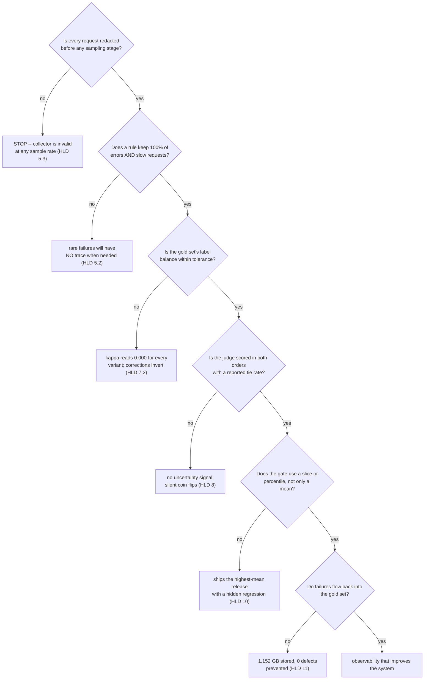

# T17 — Observability & Evaluation: low-level design

> `T17` · **Transcript coverage:** primary · [HLD](HLD.md) · [Cheat sheet](../../00-cheat-sheets/T17-observability-evals.md) · [Case study](../../01-case-studies/T17-observability-evals.md) · [Interview bank](../../02-interview-questions/T17-observability-evals.md) · [Runnable core](run.py) · [Production](production/README.md) · [Sequences](docs/SEQUENCES.md)

This is the design of the **measurement and decision layer**: what a span is, what a sample keeps,
what a judge's vote is worth, and what a gate is allowed to pass. It is not the design of a tracing
backend or a vector store — those are bought, and re-implementing one is the wrong project (§1.1).

The whole blueprint rests on one asymmetry, and the module split follows it: **two of the three planes
have a ground truth and the third does not.** A metric is the measurement, a span is the request, but
an eval score is a claim about quality that nobody has verified. `sim/judge.py`, `sim/stats.py` and
`sim/gate.py` therefore carry the modelling weight, and they are built so the ground truth is *known*
and the error is *measurable*.

`[T]` transcript · `[R]` repo · `[D]` derived. Function names below are real and all exist in
[`sim/`](sim/).

---

## 1. Module map

Six modules, in dependency order. The split is by **what decision each one owns**, not by what code is
convenient to group — and the three planes are deliberately separable, because a team that has only
built one of them should be able to import exactly that one and nothing else.



The dotted arrows are **information flow that the code does not encode** — sampling does not import
the span type, and the loop does not import the gate. That is deliberate: each module is independently
runnable and independently testable, and the wiring exists in the deployment (HLD §12), not in a call
graph.

### 1.1 What is deliberately not here

| Not here | Why | Where it lives instead |
|---|---|---|
| An OTel SDK or exporter | OTLP is a wire format; the standard is the point, not a re-implementation `[T]` | `production/otel-collector.yaml` |
| A trace store / query engine | bought (LangFuse, LangSmith, Phoenix, MLflow all read OTLP `[T]`) | HLD §14 |
| An actual LLM judge call | no network, no GPU, and **an unknown ground truth** — see §1.2 | `production/judge-spec.yaml` |
| A real failure taxonomy | production failure classes are organisation-specific | `production/failure-taxonomy.yaml` |
| A redaction implementation | PII detection is a product, not a blueprint | the collector's `redaction` processor |
| A dashboard | the four items are specified; the panels are a rendering choice | `production/metrics.promql` |
| A drift detector | a different topic's problem (it changes the *gold set*, not the judge) | T19 |

### 1.2 Why the judge is modelled rather than called

This is the single most important design decision in the blueprint, and it is the opposite of T04/T05's
approach (where a real model is the thing being measured).

**A real judge cannot be used to measure bias, because a real judge has no ground truth.** You can
compute its agreement with human labels, and you can compute inter-judge agreement, but when two
judges disagree — or when a judge disagrees with a human — you cannot tell which side was right. Bias
is a *directional* error, and a directional error is unmeasurable without truth.

So `sim/judge.py` inverts the problem:

| | Real judge | Modelled judge (`sim/judge.py`) |
|---|---|---|
| Truth | unknown | `Answer.quality`, a latent value the judge cannot see |
| Bias | inferred from disagreement statistics | an explicit parameter in `JudgeParams` |
| Output | verdicts | verdicts **plus the error against truth** |
| Use | production scoring | **measuring which correction is worth buying** (§HLD 7) |

The transfer to production is then the part this blueprint must be honest about: the *parameter values*
do not transfer. The *ranking* of corrections and the *tie-rate as an uncertainty signal* do — and the
production judge spec (`production/judge-spec.yaml` §3) requires re-measuring both against a real gold
set before the numbers are used to make a purchase decision.

---

## 2. Data structures

### 2.1 `Span` — the unit of a trace (`latency.py`)

```python
@dataclass
class Span:
    name: str                       # "retrieval", "tool_call", "decode" -- NOT a span id
    ms: float
    kind: str = "internal"          # internal | retrieval | llm | tool | guardrail | queue
    children: list["Span"] = field(default_factory=list)
    meta: dict = field(default_factory=dict)

    @property
    def self_ms(self) -> float:
        return max(0.0, self.ms - sum(c.ms for c in self.children))
```

Three fields carry the design:

- **`name` is the aggregation key, not an id.** *"A metric has no name attached"* is the whole argument
  for traces (HLD §3.1), so the name is the first-class field and the span id is not modelled at all.
- **`self_ms` is a property, not a stored value.** It cannot drift from the children. `max(0.0, …)`
  absorbs clock skew on a child that over-reports — which turns a negative self time (nonsense) into a
  zero (a visible symptom).
- **`kind` is a coarse enum, not free text.** It is what makes a policy expressible: "sample all
  `guardrail` spans" is a rule, "sample all spans whose name contains 'guard'" is not.

### 2.2 `Policy` — the sampling decision (`sampling.py`)

```python
@dataclass(frozen=True)
class Policy:
    name: str
    baseline: float          # probabilistic keep rate applied to everything
    error_rate: float        # keep rate for spans with an error status
    slow_rate: float
    slow_ms: float = 10_000
    tail: bool               # does the decision require the whole trace?
    buffer_bytes: int = 4096
```

`frozen=True` is load-bearing: a policy is *configuration*, and a mutable default would let one
experiment's tweak leak into another's. `tail` is the one field that is not a number, and it is the one
that determines whether the collector can decide per-span or must hold the trace (HLD §5, §12).

`DEFAULT_POLICIES` is the five-policy frontier of HLD §5, in ascending cost:
`trace_all`, `uniform_5pct`, `uniform_1pct`, `errors_only`, `tail_sample`.

### 2.3 `Answer` / `Pair` / `GoldSet` — the eval substrate (`judge.py`)

```python
@dataclass(frozen=True)
class Answer:
    aid: str
    quality: float      # 1..5, the human truth -- INVISIBLE to the judge
    length: int
    family: str

@dataclass
class Pair:
    a: Answer
    b: Answer
    @property
    def human_winner(self) -> str: return "a" if self.a.quality >= self.b.quality else "b"
    @property
    def margin(self) -> float: return abs(self.a.quality - self.b.quality)
```

`Answer` is frozen because the truth must not be mutable by the thing being measured. `Pair` is not,
because §2.4's `both_orders_verdict` constructs `Pair(pair.b, pair.a)` — the swap *is* the mechanism.

`GoldSet` carries the correctness checks that make the measurements interpretable:

| Method | Returns | Why it exists | Failure it catches |
|---|---|---|---|
| `truths()` | the winner per pair | the label vector for agreement | — |
| `label_balance()` | fraction of truths in slot `a` | **0.5 is balanced** | a position bias scoring as accuracy |
| `is_degenerate(tol=0.15)` | bool | the gate-able form of the above | κ ≡ 0.000 tables |
| `close_pairs(margin=0.5)` | the close calls | *"pairwise is far more reliable for close calls"* `[T]` | an easy-set-only eval |
| `family_mix()` | count per family | self-preference needs both families present | a self-preference term with nothing to act on |

### 2.4 `Correction` and `JudgeParams` — the separable switches

```python
@dataclass
class JudgeParams:                    @dataclass
    name: str                             class Correction:
    family: str = "judge-fam"                 randomize_order: bool = False
    position_bias: float = 0.0                length_controlled: bool = False
    verbosity_weight: float = 0.0             different_family: bool = False
    self_pref: float = 0.0
    noise: float = 0.30
```

**Two objects rather than one, and that is the design.** `JudgeParams` is the *judge* — the thing being
measured, which a team does not choose directly (it is whatever model and prompt they shipped).
`Correction` is the *harness* — the thing a team builds, and the thing whose value HLD §7 measures.
Keeping them separate is what makes "each correction alone, then all three" expressible as a five-row
ladder rather than a set of bespoke comparisons.

`DEFAULT_JUDGE` is `position_bias=0.45, verbosity_weight=0.40, self_pref=0.35, noise=0.30` — all three
biases present at once, which is the realistic case and the one where non-additivity (§HLD 7.1) shows
up.

### 2.5 `ScoreSet` / `Gate` — the release decision (`gate.py`)

```python
@dataclass
class ScoreSet:
    name: str
    scores: list[float]
    classes: list[str]              # per-example slice label: "hard" | "easy" | "safety"
    def mean(self) -> float: ...
    def percentile(self, p: float) -> float: ...
    def by_class(self) -> dict[str, list[float]]: ...
    def worst_class_mean(self) -> tuple[str, float]: ...

@dataclass
class Gate:
    kind: str                       # "mean" | "percentile" | "worst_class"
    threshold: float
    percentile: float = 5.0
    target_class: str | None = None
```

`classes` is what makes a slice gate possible, and it is the field most teams do not collect. **A
percentile is a property of the whole distribution; a slice is a property of the population that gets
hurt** (HLD §10.1) — so a `ScoreSet` without `classes` can express only the weaker of the two.

### 2.6 `FailureClass` / `LoopRun` — the loop's state (`loop.py`)

```python
@dataclass
class FailureClass:
    cid: str
    rate: float                     # occurrences per release
    severity: float = 1.0           # cost per escaped occurrence
    first_seen_release: int | None = None
    covered: bool = False           # does the eval set now contain a test case?

@dataclass
class LoopRun:
    mode: str                       # "open" | "closed"
    per_release: list[dict]
    @property def escaped_total(self) -> float: ...
    @property def severity_weighted_total(self) -> float: ...
    def escaped_by_class(self) -> dict[str, float]: ...
```

**`covered` is the entire difference between the two arms of experiment 9**, and it is a single
boolean. That is the point: the open and closed loops are identical in infrastructure and differ in
one bit of state.

---

## 3. Interface contracts

### 3.1 `latency.py` — the decomposition

```python
def walk(span, depth=0, out=None) -> list[tuple[int, Span]]
def end_to_end_ms(root) -> float                       # == root.ms by construction
def by_name(root) -> dict[str, dict]                   # name -> {count, total_ms, self_ms, pct_of_e2e}
def leaves(root) -> list[Span]
def decomposition_check(root) -> dict                  # {leaf_sum_ms, root_ms, residual_ms, residual_pct, consistent}
def attribution(root, target_ms=300.0) -> dict
def render_tree(root, depth=0) -> list[str]
```

`decomposition_check` is the instrument's health check and must be called before any attribution table
is trusted. `residual_pct` is the leaf sum's drift from the root; `consistent` is `|residual_pct| < 2%`,
because clock skew across processes is real and the threshold is a tolerance, not a guarantee.

`attribution()` returns, and the field names encode the two traps it avoids:

| Key | Meaning | Trap avoided |
|---|---|---|
| `by_self`, `rank_by_self` | ranked by `self_ms`, **root excluded** | double-counting nested spans; "the top span is the request" |
| `by_count`, `rank_by_count` | ranked by span count | presented for contrast, not for use |
| `count_discriminates` | `False` when every span occurs once | a chat turn's count ranking is arbitrary |
| `disagree` | the two rankings' tops differ | **the finding** |
| `top_self_ms`, `top_share_pct` | the headroom | — |
| `max_possible_saving_ms` | = `top_self_ms` | a target below this is unreachable by any reordering |
| `target_reachable` | `top_self_ms >= target_ms` | — |

Request builders: `chat_request(...)` reproduces the corpus's 1.2 s example (1199.0 ms) with every
term named; `agentic_request(...)` produces the shape where the rankings disagree (2116 ms, 25 leaves).
`agentic_request` distributes `n_tools` exactly across turns — `base, extra = divmod(n_tools, llm_turns)`
— so the caller can rely on the span count it asked for. (A truncating `n_tools // llm_turns` was a real
defect here; it silently produced 10 tool calls for a request of 12 and made the count ranking wrong.)

### 3.2 `sampling.py` — the pipeline

```python
def expected_kept(policy, n_requests, error_rate, slow_rate) -> dict
def storage_cost_gb(kept_spans, span_bytes=4096) -> float
def p_zero_captured(incident_rate, keep_rate, window_requests) -> float
def requests_until_first_trace(incident_rate, keep_rate, confidence=0.95) -> float
def frontier(n_requests, error_rate, slow_rate, policies=None) -> list[dict]
def redaction_is_orthogonal(policy) -> dict
```

`expected_kept` returns `kept`, `kept_pct`, `kept_errors`, `error_coverage`, `kept_slow`,
`slow_coverage`, `kept_ok` — **six numbers, and the design point is that the first two are the only
ones a cost dashboard shows.** `error_coverage` and `slow_coverage` are what an incident review needs
(HLD §5).

`p_zero_captured` is the rarity argument as arithmetic:

```python
def p_zero_captured(incident_rate, keep_rate, window_requests):
    return (1 - incident_rate * keep_rate) ** window_requests
```

Note what it is *not*: it is not a function of storage at all. The blind spot is a function of `rate`,
`keep` and `window` — which is why "buy more disk" is not a fix for it (HLD §5.2).

`redaction_is_orthogonal(policy)` returns
`{"pii_risk_reduced_by_sampling": False, "requires_boundary_redaction": True}` for **every** policy,
including `uniform_1pct`. It exists as a function rather than a comment so a config validator can call
it and refuse a non-redacting collector at any sampling rate.

### 3.3 `judge.py` — the measurement

```python
def judge_score(answer, p, gold, *, shown_first, correction, rng) -> float
def judge_pair(pair, p, gold, correction, rng) -> tuple[str, float, float]
def judge_pointwise(pair, p, gold, correction, rng) -> tuple[str, float, float]
def both_orders_verdict(pair, p, gold, correction, rng) -> tuple[str, float, float]
def agreement(verdicts, truths) -> float
def cohen_kappa(verdicts, truths) -> float
def evaluate(gold, p, correction, *, seed=7, mode="pairwise", pairs=None) -> dict
def correction_ladder(gold, p=DEFAULT_JUDGE, seed=7) -> list[dict]
def position_bias_sweep(gold, betas=None, p=None, seed=7) -> list[dict]
def verbosity_effect(gold, p=None, seed=7) -> dict
```

`judge_score` is the whole bias model in five lines:

```
score = quality
      + position_bias   × [shown first]
      + verbosity_weight × z(length)      <- zeroed when length is normalized
      + self_pref       × [own family]    <- zeroed when the family differs
      + noise
```

**Three terms are switchable and one is not.** `noise` is irreducible in the model — a judge with zero
bias still disagrees with itself — and having it there is what keeps the correction ladder honest: the
naive judge is 75.5%, not 100%.

`evaluate()` returns `mode`, `n`, `agreement`, `ties`, `tie_rate`, `decided_n`, `decided_agreement`,
`label_balance`, `degenerate`, the four judge parameters, `close_n` and `close_agreement`. Two pairs of
those fields carry the design:

| Pair | Rule |
|---|---|
| `agreement` vs `decided_agreement` | **`agreement` counts a tie as WRONG**, so the tie rate can never be hidden by dropping ties. `decided_agreement` is only meaningful *read next to* `tie_rate` (HLD §8). |
| `label_balance` vs `degenerate` | reported unconditionally, because a degenerate gold set **inverts the correction table** and the inversion is otherwise indistinguishable from a real result (HLD §7.2). |

**`judge_pair` draws the order decision in both arms**, and only its *use* differs:

```python
draw = rng.random()
a_first = draw < 0.5 if correction.randomize_order else True
```

Skipping the draw when randomisation is off makes the two arms consume different positions in the RNG
stream, so they see different noise and the comparison between them is confounded by that rather than
measuring the bias. Drawing unconditionally makes the two runs a **paired** comparison over identical
noise. (This was a real defect: the randomised arm appeared to *lose* accuracy at high β for a reason
that had nothing to do with the bias.)

**`both_orders_verdict`** is the blueprint's derived correction `[D]`:

```python
v1, _, _ = judge_pair(pair,          p, gold, c, rng)     # a first
v2, _, _ = judge_pair(Pair(b, a),    p, gold, c, rng)     # b first
if v2 == "a": v2 = "b"                                    # map back to the original labelling
elif v2 == "b": v2 = "a"
return (v1 if v1 == v2 else "tie"), sa, sb
```

The swap *is* the mechanism: the bonus the judge gives "first" is added to `a` in one run and to `b` in
the other, so it cancels **exactly** rather than in expectation. `both_orders_verdict` builds its own
`Correction(randomize_order=False, …)` and inherits only `length_controlled` and `different_family` —
randomising the order inside a both-orders run would destroy the pairing it depends on.

### 3.4 `stats.py` — the uncertainty

```python
def minimum_detectable_effect(sigma, n, alpha=0.05, power=0.80) -> float
def observed_gain_distribution(true_effect, sigma, n, trials=20_000, seed=3) -> list[float]
def false_improvement_rate(sigma, n, threshold, trials=20_000, seed=3) -> float
def detection_power(sigma, n, effect, threshold, trials=20_000, seed=3) -> float
def tail_representation(n, failure_rate) -> dict
def eval_set_sizing(sigma=0.5, threshold=0.20, sizes=None) -> list[dict]
def required_n(sigma, effect, alpha=0.05, power=0.80) -> int
```

Three functions answer the three questions of HLD §9, and they are separate because **the three bind at
different sizes**:

| Function | Question | Binds at |
|---|---|---|
| `minimum_detectable_effect` / `required_n` | "can I detect a real regression?" | n ≈ 100 (for a 0.20 effect) |
| `false_improvement_rate` | "how often does nothing look like progress?" | n ≈ 100 |
| `tail_representation` | "does my set contain the rare thing at all?" | **n ≈ 200 — the binding constraint** |

`tail_representation(n, failure_rate)` returns `p_at_least_one`, `expected_count`,
`reliably_represented`, and `n_for_95pct`. It is the only one of the three that **cannot be fixed by a
better statistic** — a mean, a percentile and a slice all fail equally on a class the set does not
contain. That is why it is the one to size against.

`win_rate_sigma()` returns 0.5, the Bernoulli worst case, and it is a function rather than a constant
so the assumption is visible at the call site.

### 3.5 `gate.py` — the decision

```python
def make_release(name, n_hard=60, n_easy=140, n_safety=40, …, seed=5) -> ScoreSet
def gate_matrix(releases, gates) -> list[dict]
def disagreement(releases, gates) -> dict
def regression_hidden_by_mean(baseline, candidate, metric=…) -> dict
```

`make_release` builds the four releases of HLD §10. `disagreement()` returns `split_releases`,
`mean_passes_tail_fails` and `rates` — **it is named for the finding, not for the data.** A gate
comparison whose output is "here are four pass/fail vectors" makes the reader do the join; one whose
output is "3 of 4 releases split, and the split is always mean-passes-tail-fails" states the design
consequence.

`regression_hidden_by_mean(baseline, candidate)` is the v1→v3 row: mean **+0.17**, p5 +0.03, safety
slice **−0.08**, `hidden_regression_detected: True`.

### 3.6 `loop.py` — the edge

```python
def failure_taxonomy(n=40, seed=23, rate_alpha=1.4, mean_rate=0.02) -> list[FailureClass]
def run_loop(classes, releases, *, closed, sample_rate=0.05, requests_per_release=100_000,
             judge_sensitivity=0.75, base_eval_size=60, seed=31) -> LoopRun
def compare(releases=24, seed=31, **kw) -> dict
def open_loop_cost(run, storage_gb_per_release, gpu_hours_per_release) -> dict
```

`run_loop`'s noticing model is one line and it is where the tail behaviour comes from:

```python
traced   = occ * sample_rate                          # occurrences that were traced AND judged
p_notice = 1.0 - (1.0 - judge_sensitivity) ** traced  # at least one of them flags the class
```

**`p_notice` falls with the class's rate, and that single fact produces the severity-skewed residual of
HLD §11 finding 2.** A rare class produces few traced occurrences, so it is noticed later, so it escapes
more — and rarity and severity are positively correlated in `failure_taxonomy`.

`compare()` deep-copies the taxonomy per arm (`copy.deepcopy`) because `covered` is mutated in place;
sharing the list would let the closed arm's state leak into the open arm and silently close the gap it
is meant to measure. (This is the kind of defect that produces a *plausible* result rather than a crash,
which is why it is called out.)

---

## 4. State — where an observability decision lives, and when it can be undone

The corpus's four carry-out items map onto four different lifecycles, and the cost of changing your
mind differs by an order of magnitude between them.



| Decision | Reversible? | Cost of changing it | Invalidates |
|---|---|---|---|
| Instrumentation | yes | backfill is impossible — **data before it does not exist** | nothing |
| Sampling policy | yes, at restart | the traces *not* kept are gone | trace coverage history |
| Redaction | **must be a precondition** | already-written PII cannot be un-written | — |
| Judge model / prompt | yes | **every agreement and kappa number** | the gate's calibration |
| Gate statistic / threshold | yes | release decisions already made under it | comparability across releases |
| The dataset | **append-only in practice** | removing a case removes the coverage it bought | the loop's compounding (§HLD 11) |

**The asymmetry that matters:** two entries are irreversible for *data* reasons (instrumentation and
redaction — the past cannot be re-observed or un-leaked), one is irreversible for *statistical* reasons
(the dataset; deleting a failure class's only test case re-opens it), and the rest are cheap. Teams
consistently spend their deliberation on the cheap ones.

### 4.1 The decision order, and why it is usually wrong



The order is not arbitrary: **each gate is a precondition for the next one's result being meaningful.**
A tail-sampled trace collection feeding a degenerate gold set produces confidently wrong judge numbers;
a well-calibrated judge gated on a mean still ships the bad release.

---

## 5. Sequence diagrams

Six flows, in [`docs/SEQUENCES.md`](docs/SEQUENCES.md): the request-to-trace path with the redaction
and sampling stages; the alert-to-attribution path; the both-orders judging run with tie routing; the
eval-set sizing decision; the gate evaluation; and the loop's failure-to-test-case path.

---

## 6. Concurrency and determinism

| Concern | Design |
|---|---|
| RNG streams | every stochastic function takes an explicit `random.Random`; **all seeds are parameters**, none are module-level |
| Paired comparisons | `judge_pair` draws the order decision in **both** arms so the two runs consume identical RNG streams (§3.3) |
| Arms of the loop | `compare()` deep-copies the taxonomy per arm; `covered` is mutated in place |
| Ordering | dict iteration order is insertion order (Python 3.7+); `by_name` and `gate_matrix` rely on it for stable output |
| Float determinism | no parallelism, no threads, no numpy — every number is reproducible from a seed on any platform |
| Non-determinism in *production* | the tracing path is inherently concurrent; the blueprint therefore makes the **decision** deterministic and the **sampling** explicit, so the same policy over the same traffic keeps the same *fraction*, not the same *spans* |

The corpus's own remark on why this matters for evaluation `[T]` (CMU lecture 2): *"the addition
happens in a different order every time … and in reality none of the people serving things on GPUs does
this"* — GPU serving is not bit-reproducible, so an eval that compares exact outputs is measuring
something the system cannot promise. Hence the corpus's alternative, quoted in the cheat sheet: *"use
some sort of deterministic metrics that you can calculate directly from the generated text"* —
diversity (unique words / total words), cross-generation bigram overlap — which are stable under
reordering.

---

## 7. Error handling

| Condition | Behaviour | Rationale |
|---|---|---|
| `Span` child duration exceeds parent | `self_ms` clamps to 0.0 | clock skew is real; a negative self time is nonsense, a zero is a symptom |
| trace leaves do not sum to root | `decomposition_check.consistent = False`; callers must check | an attribution table from a broken instrument is worse than none |
| gold set label-imbalanced | `is_degenerate()`; `evaluate()` reports it unconditionally | κ ≡ 0 inverts the correction table (§HLD 7.2) |
| empty verdict list | `agreement`/`cohen_kappa` return 0.0, not NaN | a NaN would propagate silently through a gate |
| all pairs tied | `decided_agreement` returns 0.0 with `decided_n = 0` | the honest reading is "the judge could not decide anything" |
| `pe >= 1.0` in kappa | returns 0.0 | division by zero; 0.0 is the conservative reading |
| zero closed-loop escapes | `compare()` returns `math.inf` ratios; callers must handle | **`inf` is the result, not an error** — HLD §11 finding 1 |
| `_pearson` on a constant input | returns 0.0 | no variance means no correlation, not a crash |
| `judge_score` with `noise=0` | valid — a deterministic judge | used to isolate the bias terms |
| unknown `mode` in `evaluate` | `KeyError` immediately | a typo must not silently fall back to pairwise |

**The house rule: a silent wrong answer is worse than a crash.** Every entry above either refuses,
returns a conservative value, or surfaces a flag the caller is required to read. `inf`, `0.0` and
`False` are all honest answers here; `NaN` and a silent fallback are not.

---

## 8. Configuration surface

### 8.1 Collector pipeline (platform team, per-cluster)

```yaml
# production/otel-collector.yaml
processors:
  redaction:            # FIRST. Not tradeable against a sample rate.
    blocked_values: [EMAIL, PHONE, CREDIT_CARD, API_KEY]
  tail_sampling:
    policies:
      - { name: errors,   type: status_code, status_code: { status_codes: [ERROR] } }
      - { name: slow,     type: latency,     latency: { threshold_ms: 10000 } }
      - { name: baseline, type: probabilistic, probabilistic: { sampling_percentage: 5 } }
```

### 8.2 Judge specification (eval owner, per-release-eligible-change)

```yaml
# production/judge-spec.yaml
judge:
  model: <pinned>
  mode: pairwise
  orders: both            # <- the correction that matters (HLD 8)
  tie_policy: route_to_human
  length_control: normalize
calibration:
  gold_set: from_production
  label_balance_tolerance: 0.15
  min_kappa: 0.55
  max_tie_rate: 0.30
  close_call_disclosure: required
```

### 8.3 Gate thresholds (release owner, versioned with the eval set)

```yaml
# production/gate.yaml
gates:
  - { kind: worst_class, target_class: safety, threshold: 3.60 }   # the release gate
  - { kind: percentile,  percentile: 5.0,     threshold: 3.20 }   # the tail gate
  - { kind: mean,                              threshold: 4.00 }   # smoke signal ONLY
sizing:
  min_examples: 200          # from tail_representation, not from power
  min_close_pairs: 60
  min_per_class: 40
```

### 8.4 The sizing decision as a function

```python
def required_eval_size(target_effect=0.20, worst_class_rate=0.05,
                       sigma=0.5, confidence=0.95) -> dict:
    """The three requirements, and the largest one binds (HLD 9)."""
    n_power = S.required_n(sigma, target_effect)
    n_tail  = S.tail_representation(1, worst_class_rate)["n_for_95pct"]   # representative form
    return {"for_power": n_power, "for_tail": n_tail,
            "binding": max(n_power, n_tail), "binding_reason": "power" if n_power >= n_tail else "tail"}
```

---

## 9. Test strategy

| # | Test | Asserts |
|---|---|---|
| 1 | self-time sum == root, chat and agentic | the decomposition invariant (§3.1) |
| 2 | leaf sum == root within 2% | `decomposition_check` on both shapes |
| 3 | `attribution` top is not the root | trap 1 avoided |
| 4 | `attribution` ranks by `self_ms` | trap 2 avoided |
| 5 | `count_discriminates` is `False` on a chat turn | a count ranking is not presented as meaningful |
| 6 | `count_discriminates` is `True` and `disagree` on the agentic turn | **the finding is reproducible** |
| 7 | `agentic_request(n_tools=12)` yields exactly 12 `tool_call` spans | the `divmod` fix |
| 8 | `tail_sample.error_coverage == 1.0` and `uniform_5pct`'s is ≈ 0.05 | the frontier's shape |
| 9 | `errors_only.slow_coverage == 0.0` | the trap of HLD §5.1 |
| 10 | `p_zero_captured` is monotone decreasing in `incident_rate` | the rarity argument |
| 11 | `p_zero_captured` is independent of `span_bytes` | the blind spot is not a storage problem |
| 12 | `redaction_is_orthogonal` is `True`-shaped for **every** `DEFAULT_POLICIES` entry | HLD §5.3 |
| 13 | `synthetic_gold_set(...).label_balance()` within 0.15 of 0.5 | §2.3 |
| 14 | `is_degenerate()` is `False` for the default seed | the guard is not vacuous |
| 15 | κ > 0.3 for the naive judge | a degenerate set would give exactly 0.000 |
| 16 | every correction's agreement ≥ naive's | the inverted-table symptom is absent |
| 17 | `both_orders_verdict` returns "tie" iff the two orders disagree | the mechanism, directly |
| 18 | `tie_rate` is monotone increasing in β | the calibration claim |
| 19 | `decided_agreement` > `agreement_off` at **every** β | HLD §8, second bullet |
| 20 | `verbosity_effect` reports a baseline, and corrected r ≤ biased r | §HLD 8.1 |
| 21 | `tail_representation(20, 0.05)["p_at_least_one"] < 0.7` | the binding constraint |
| 22 | `required_n` is decreasing in the effect size | sanity on the power formula |
| 23 | `disagreement()` finds ≥ 1 split release | the gate finding is not seed-luck |
| 24 | `regression_hidden_by_mean` detects the v1→v3 regression | §HLD 10 |
| 25 | open-loop `last_release_escaped == first_release_escaped` | flat, exactly |
| 26 | closed-loop `final_coverage == 1.0` and last escape == 0 | falls to zero |
| 27 | `closed_severity_per_escape > open_severity_per_escape` | the severity-skew finding |
| 28 | swapping the arms' order does not change the totals | `deepcopy` isolation (§3.6) |
| 29 | two runs with the same seed give byte-identical output | determinism |
| 30 | `run.py` exits 0 and prints ≥ 400 lines | it is a demonstration, not a stub |

Tests 13–16 are the regression set for the **gold-set degeneracy defect**; tests 6, 17–19 for the
**attribution and pairing defects**; test 7 for the **`divmod` defect**. Each was a real defect found
by running this code and reading its output, and each is recorded in `PROGRESS.md`.

---

## 10. Build order

1. `latency.Span` + `self_ms`; verify the self-time sum equals the root on a hand-built tree.
2. `walk`, `by_name`, `leaves`, `decomposition_check` — the invariant before any attribution.
3. `attribution` with the root excluded and ranking by `self_ms`; add `count_discriminates`.
4. `chat_request`; check it lands on the corpus's 1.2 s example. Then `agentic_request` with `divmod`.
5. `sampling.Policy` + `DEFAULT_POLICIES`; `expected_kept` with all six outputs.
6. `storage_cost_gb`; then `p_zero_captured` and `requests_until_first_trace`.
7. `frontier` — the five rows of HLD §5, and confirm the `uniform_5pct` / `tail_sample` contrast.
8. `redaction_is_orthogonal` returning the same answer for every policy.
9. `Answer`, `Pair`, `GoldSet` **with `label_balance` and `is_degenerate` on day one** — this is the
   defect that cost the most to find later.
10. `synthetic_gold_set` with the winner in a **random slot**.
11. `judge_score` with the four terms; `judge_pair` drawing the order in both arms.
12. `agreement`, `cohen_kappa`, `evaluate` returning `label_balance`, `degenerate`, `tie_rate`.
13. `correction_ladder`; rank the singles; add the non-additivity line.
14. `both_orders_verdict`; `position_bias_sweep` with three curves and a tie rate.
15. `verbosity_effect` with `_pearson` and the baseline.
16. `stats`: `_erf`, `normal_cdf`, `minimum_detectable_effect`, `required_n`.
17. `observed_gain_distribution`, `false_improvement_rate`, `detection_power`; then
    `tail_representation` and `eval_set_sizing`.
18. `gate`: `ScoreSet`, `Gate`, `make_release`, `gate_matrix`, `disagreement`,
    `regression_hidden_by_mean`.
19. `loop`: `failure_taxonomy`, `run_loop`, `compare` with `deepcopy`, `open_loop_cost`.
20. `experiments.py` — ten functions in HLD order, then `run_all`.
21. `run.py` — banner, corpus quotes, `run_all`, the one-paragraph summary.

Steps 9 and 11 are the ones to do slowly. Every later number depends on the gold set being
non-degenerate and on the two arms of a comparison seeing the same noise, and **both defects produce
plausible output rather than an error.**

---

## Sources

| File under `refs/` | Used for |
|---|---|
| `LLMOps_Agentic_AIOps_The_Hands-On_Playlist_2026_transcripts/LLM_Observability_Traces_Spans_OpenTelemetry_for_AI_Apps.txt` | span fields; the sampling and redaction rule; the collector policy shape; the four carry-out items; OpenLLMetry and the backend list |
| `LLMOps_Agentic_AIOps_The_Hands-On_Playlist_2026_transcripts/How_to_Evaluate_LLM_Apps_LLM-as-a-Judge_RAGAS_Without_the_Bias.txt` | the three biases; pointwise vs pairwise; gold-set provenance; the 200-example guidance; the fifth-percentile instruction |
| `vLLM_Inference_Meetup_Bengaluru_2026_transcripts/Scaling_Agentic_AI_Distributed_Inference_with_llm-d.txt` | agentic share of traffic |
| `CMU_Inference_Algorithms_for_Language_Modeling_Fall_2025_transcripts_2/CMU_LLM_Inference_2_Probability_Review_and_Code_Examples.txt` | non-determinism under reordered floating-point addition; deterministic text-derived metrics |
| `ai-system-design-guide-main/ai-system-design-guide-main/` | house style; MLOps framing for the module split |

Related: [HLD](HLD.md) · [SEQUENCES](docs/SEQUENCES.md) · [production](production/README.md) ·
[run.py](run.py)
