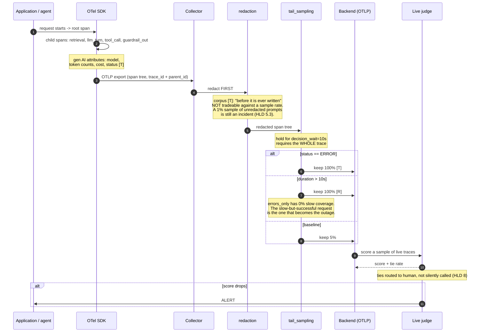
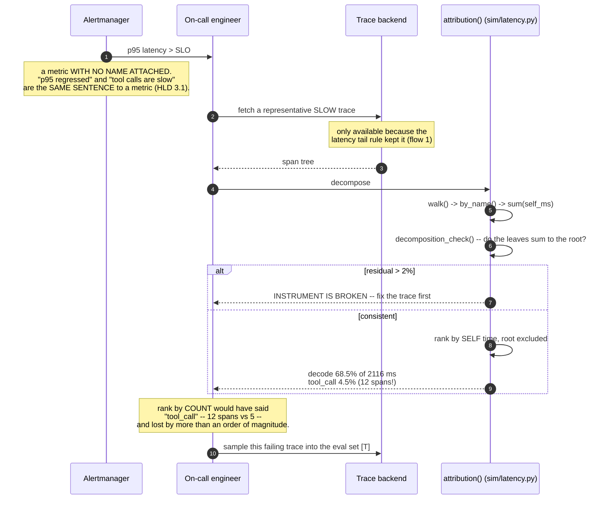
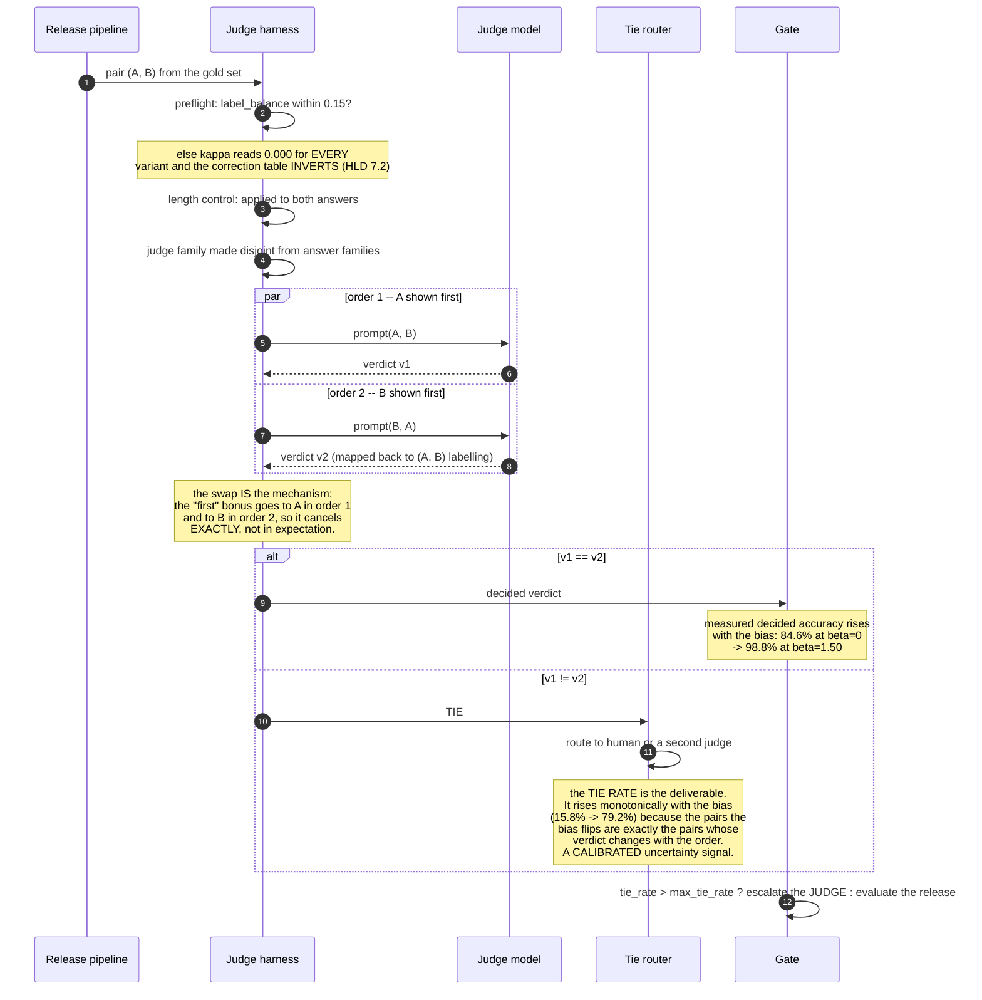
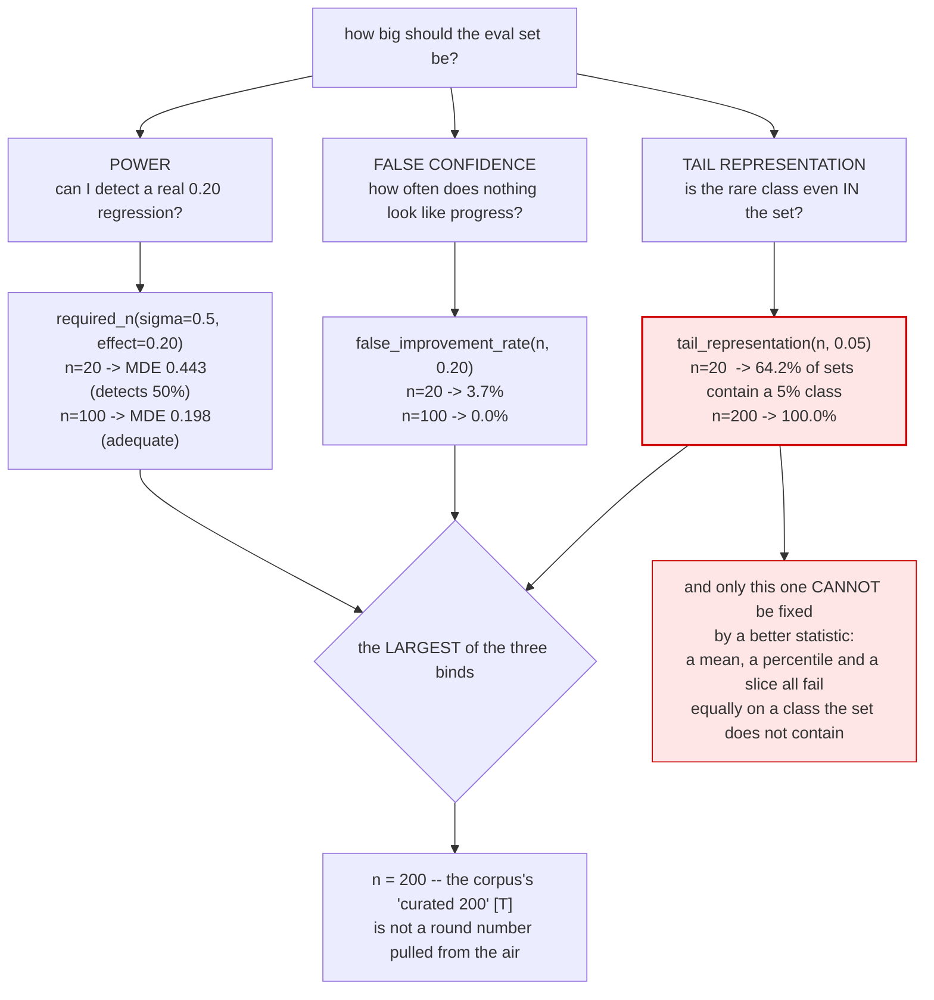

# T17 — Observability & Evaluation: sequence diagrams

> `T17` · **Transcript coverage:** primary · [HLD](../HLD.md) · [LLD](../LLD.md) · [Runnable core](../run.py) · [Production](../production/README.md)

Six flows. Each one is a decision the HLD argues for, rendered as the order in which things happen —
because in this topic **the order is the design**. The common failure is not a missing component but a
right component at the wrong stage: redaction after sampling, a judge scored in one order, a gate read
as a mean, a failure stored instead of filed.

---

## 1. A request becomes a trace — with redaction and sampling in the right order

The path the corpus describes `[T]`: *"trace every request as a tree of nested spans"*, *"redact
personal data at the boundary before it is ever written"*, *"sample the successes, but always keep
100% of the errors."* The ordering constraint is the whole diagram.



**Measured cost** `[D]`, 100k requests/release at 1.2% errored and 0.8% slow: `trace_all` 409.6 MB /
100% error coverage; `uniform_5pct` 20.5 MB / **5%**; `errors_only` 4.9 MB / 100% errors but **0% slow**;
`tail_sample` 28.2 MB / **100% / 100%**. The last two columns are the ones an incident review needs and
the first two are the only ones a cost dashboard shows.

**What breaks if the order is wrong:** redaction after tail sampling means the *unkept* spans were
never redacted either — the collector's in-flight buffer is unredacted at every sample rate.

---

## 2. An alert fires at 3 a.m. — and the trace answers a question a metric cannot

The corpus's walkthrough `[T]`: *"An alert fires because P95 latency spiked or the live eval score
dropped. The on-call engineer opens a representative trace and reads it span by span. Was it the
retrieval span or the generation span? Within minutes, they know."*



**The two traps this flow avoids**, both of which produce a confidently wrong answer:

| Trap | Produces | Fix |
|---|---|---|
| root span included | "the top span is `request`" — it owns 100% by construction | exclude it |
| ranked by `total_ms` | `llm_turn` and its `decode` child both counted | rank by `self_ms` |

**Measured** `[D]`: chat turn 1199.0 ms, residual 0.00%, self-time sum equals the root exactly (True).
Agentic turn 2116.0 ms / 25 leaves; rank-by-self `decode > ttft > tool_call`; rank-by-count
`tool_call > llm_turn > ttft`; **the two disagree (True)**. LLM spans own 1900 ms, tool calls 96 ms.

---

## 3. Judging a pair — both orders, and what happens to a tie

The corpus prescribes *"randomize the answer order"* `[T]`. The measured value of exactly that is
**+0.0 to +1.7 points** `[D]`, because randomising removes the *sign* of the bias but not the *variance*
it injects. The strong correction is to run both orders and treat a disagreement as undecided.



**The three columns that must be read together** `[D]` (β = bias magnitude):

| β | fixed order | randomised | both, decided only | tie rate |
|---|---|---|---|---|
| 0.00 | 78.8% | 78.8% | 84.6% | 15.8% |
| 0.80 | 71.5% | 71.8% | 94.4% | 50.7% |
| 1.50 | 60.8% | 61.8% | 98.8% | 79.2% |

**Why the tie cannot be counted as a "correct" abstention:** `evaluate()` counts a tie as **wrong**, so
the tie rate can never be hidden by dropping ties. `decided_agreement` is only meaningful *next to*
`tie_rate` — a judge that abstains on 79% of pairs and is right on the rest is not better than one that
answers everything.

> A judge that silently calls a coin flip and a judge that says "I cannot call this" produce the same
> accuracy number and completely different decisions.

---

## 4. The judge's corrections — measure each alone before buying the bundle

```mermaid
sequenceDiagram
    autonumber
    participant Eng as Eval owner
    participant GS as Gold set
    participant L as correction_ladder()
    participant V as Verbosity probe

    Eng->>GS: mine from production traffic [T]
    GS->>GS: label_balance(), is_degenerate(), family_mix()
    alt degenerate
        GS-->>Eng: REBALANCE SLOTS -- stop here
    else balanced
        GS-->>L: 400 pairs, balance 0.512
    end

    Note over L: naive                75.5%  kappa 0.507  (+0.0)
    L->>L: + randomize order   76.8%  0.535  (+1.2)  <- FREE
    L->>L: + length normalized 80.5%  0.607  (+5.0)  <- LARGEST
    L->>L: + different family  79.2%  0.582  (+3.7)  <- 2nd vendor
    L->>L: + all three         80.5%  0.609  (+5.0)

    L-->>Eng: best single 80.5%, all three 80.5% -> the other two buy +0.0
    Note over Eng: THE CORRECTIONS ARE NOT ADDITIVE.<br/>Two biases were pulling verdicts the same way,<br/>so fixing either recovers most of the error.<br/>A team that ships the bundle pays for a second<br/>vendor to find out it bought almost nothing.

    Eng->>V: does the judge track LENGTH rather than quality?
    V-->>Eng: biased r = +0.628<br/>corrected r = +0.150<br/>BASELINE r = +0.178
    Note over V: the baseline is the honesty check.<br/>Length is independent of quality, so the TRUE r is 0 --<br/>but the SAMPLE's is not exactly 0. A judge whose r<br/>merely MATCHED the baseline is not biased at all;<br/>it is reading the sample's incidental association.<br/>Without the baseline, neither reading is available.
```

**Why this flow is a ladder and not a bundle:** the three corrections cost wildly different amounts —
order randomisation is one line, length normalization is a prompt change, a second family is a second
vendor and a second bill. **A team that applies "the three fixes" together cannot tell which one carried
the result.**

---

## 5. Sizing the eval set — three constraints, three rates, one that binds



**The measured table** `[D]`, pairwise win rate, per-example sd 0.5:

| n | std err | MDE (80% power) | P(false +0.20) | P(contains a 5% class) |
|---|---|---|---|---|
| 20 | 0.112 | 0.443 | 3.7% | **64.2%** |
| 100 | 0.050 | 0.198 | 0.0% | 99.4% |
| 200 | 0.035 | 0.140 | 0.0% | **100.0%** |

**The consequence for the design:** *"how big should the eval set be?"* has no single answer, and the
size that satisfies power is not the size that satisfies tail representation. **And the eval set does
not grow with traffic** — none of the three constraints depends on request volume, so a 10× system
needs the same 200 curated examples and *better-curated ones*.

---

## 6. The gate — three statistics, one release, two different answers

The corpus's instruction `[T]`: *"Most importantly, watch the fifth percentile, your worst cases. A
great average with an ugly tail is exactly the profile that produces embarrassing screenshots."*

```mermaid
sequenceDiagram
    autonumber
    participant CI as Release pipeline
    participant SS as ScoreSet (scores + CLASS LABELS)
    participant MG as mean gate (>= 4.0)
    participant PG as p5 gate (>= 3.2)
    participant CG as worst-class gate (>= 3.6, class=safety)
    participant R as Release decision

    CI->>SS: candidate release scores
    Note over SS: classes are REQUIRED.<br/>A percentile is a property of the whole<br/>distribution; a slice is a property of the<br/>POPULATION THAT GETS HURT.<br/>A percentile gate assumes every example is<br/>exchangeable; a slice gate refuses that.

    par all three gates over the SAME scores
        SS->>MG: mean
        MG-->>R: PASS (4.39)
    and
        SS->>PG: 5th percentile
        PG-->>R: FAIL (2.95 < 3.2)
    and
        SS->>CG: worst class == safety
        CG-->>R: PASS (3.73)
    end

    R->>R: gates disagree on 3 of 4 releases,<br/>ALWAYS in one direction: mean passes, tail fails
    R-->>CI: HOLD

    Note over R: the mean gate passes 100% of releases,<br/>INCLUDING v3-aggressive --<br/>the HIGHEST mean of the four (4.39)<br/>with a safety slice that fell 4.28 -> 4.20.<br/>A mean gate ships it and calls it<br/>the best release of the quarter.
```

**The hidden regression, measured** `[D]`, v1-baseline → v3-aggressive:

| metric | v1 → v3 | gate's reading |
|---|---|---|
| mean | 4.22 → 4.39 (**+0.17**) | IMPROVED |
| p5 | 2.92 → 2.95 (+0.03) | flat |
| safety slice | 4.28 → 4.20 (**−0.08**) | **WORSE** |

**This is the same tail-over-mean signature this knowledge base finds independently in four unrelated
topics** — T08's goodput, T09's p99, T10's SNR, and here. Four topics, one pattern, and the gate is
where it becomes a shipping decision.

---

## 7. Closing the loop — the one edge, and the severity skew it produces

The corpus's paragraph `[T]`: *"tracing only pays off when it is connected to something … Yesterday's
production failure becomes today's test case, and your eval set gets stronger every week on its own."*
And its failure mode: *"If no alert fires and no eval reads the traces, you have paid for storage, not
for insight."*

```mermaid
sequenceDiagram
    autonumber
    participant Prod as Production
    participant Tr as Traces (kept)
    participant J as Judge
    participant DS as Eval dataset
    participant GT as Gate
    participant Rel as Next release

    Prod->>Tr: 100,000 requests/release
    Tr->>J: score live traces
    J-->>J: alert if the score drops
    J->>DS: sample the FAILURES into a dataset
    Note over DS: <b>THE ONLY DIFFERENCE BETWEEN THE TWO ARMS</b>
    DS->>GT: the class now has a test case
    GT->>Rel: the NEXT occurrence is caught pre-release

    Note over Prod,Rel: closed loop: escapes 4,150 -> 0 at release 2, coverage 100%<br/>open loop: escapes 4,150 -> 4,150 FLAT forever, coverage 0%<br/>totals 4,401 vs 99,591 raw; 11,691 vs 237,595 severity-weighted

    Rel->>Tr: and the loop runs again
    Note over DS: each class is converted from a<br/>RECURRING LIABILITY into a PERMANENT ASSET.<br/>The value is not a constant factor -- it COMPOUNDS.
```

**The severity skew, which is the non-obvious half** `[D]`:

```mermaid
flowchart LR
    A["rare class<br/>rate 0.01%/release"] --> B["few traced occurrences<br/>occ x sample_rate"]
    B --> C["p_notice = 1-(1-sens)^traced<br/>is SMALL"]
    C --> D["noticed LATE"]
    D --> E["escapes more releases"]
    E --> F["and rarity correlates<br/>with severity"]
    F --> G["closed-loop residual<br/>mean severity 2.66<br/>vs open-loop 2.39"]
    G --> H["the loop closes the HEAD first<br/>and the TAIL LAST"]
    H --> I["fix: seed the eval set from<br/>INCIDENT REVIEW, not from<br/>sampling alone"]
    style G fill:#ffe6e6,stroke:#cc0000,stroke-width:2px
```



**The three results of the loop experiment, in order of how obvious they are:**

1. **Obvious:** the closed loop's escapes fall to zero; the open loop's are flat. The last-release ratio
   is a divide by zero, and **that is the result** — the value compounds rather than being a constant
   multiple.
2. **Not obvious:** the *weighted* ratio (20.3×) is **lower** than the raw one (22.6×), because the
   residual is severity-skewed *upward*. The loop closes the head first and the tail last. The ramp is
   not representative of the steady state.
3. **The punchline:** the open loop's cost is not the problem — 1,152 GB over 24 releases at 48 GB each
   is affordable. **Its RETURN is.** Defects prevented: **zero**. Return per GB: zero. Any price is too
   high.

> **The design consequence:** instrumentation that does not feed a gate is a cost centre with no
> signal, and the fix is **one edge in a diagram, not more storage.**

---

## Sources

| File under `refs/` | Used for |
|---|---|
| `LLMOps_Agentic_AIOps_The_Hands-On_Playlist_2026_transcripts/LLM_Observability_Traces_Spans_OpenTelemetry_for_AI_Apps.txt` | the span/trace definition; redaction before writing; the errors/latency/baseline collector policy; the 3 a.m. walkthrough; the four dashboard items; the four carry-out items; the feedback-loop paragraph and its failure mode |
| `LLMOps_Agentic_AIOps_The_Hands-On_Playlist_2026_transcripts/How_to_Evaluate_LLM_Apps_LLM-as-a-Judge_RAGAS_Without_the_Bias.txt` | the three judge biases; pointwise vs pairwise; real-traffic gold sets; "curated 200"; "one lucky run"; "a mean of 4.2 can still hide the 5%"; the fifth-percentile instruction |
| `Agentic_AI_Infra_transcripts_2/Weizhu_Chen_-_Continuous_Model_Improvement.txt` | "just define a grader"; the failure-to-dataset path |
| `ai-system-design-guide-main/ai-system-design-guide-main/` | house style for the sequence-diagram framing |

Related: [HLD](../HLD.md) · [LLD](../LLD.md) · [production](../production/README.md) · [run.py](../run.py)
