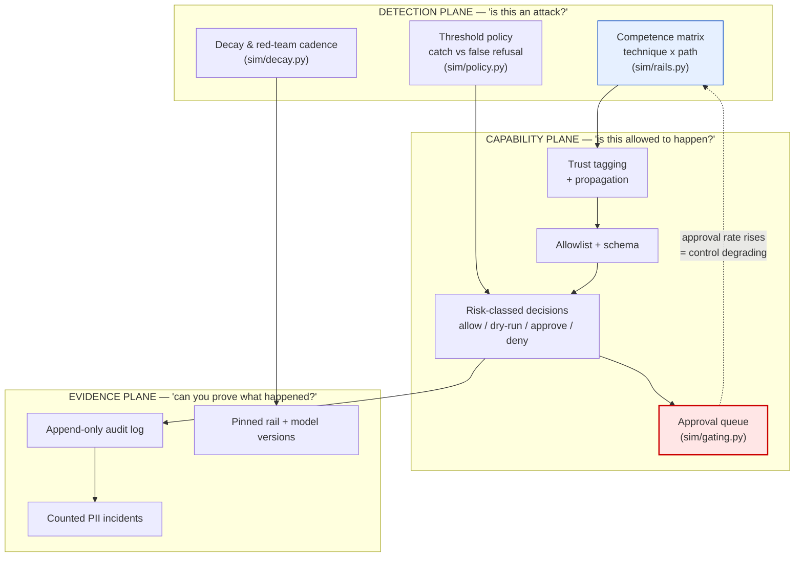
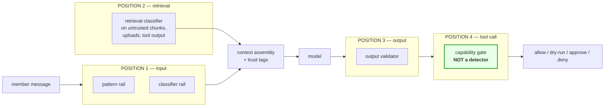
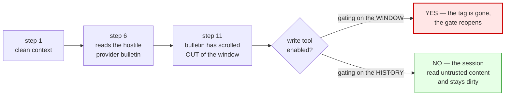
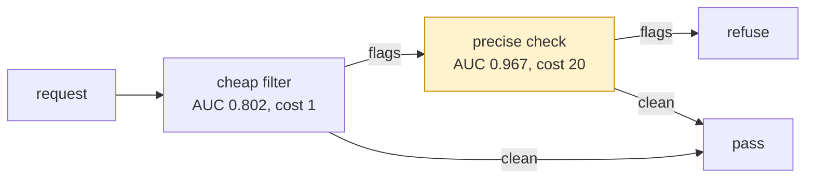
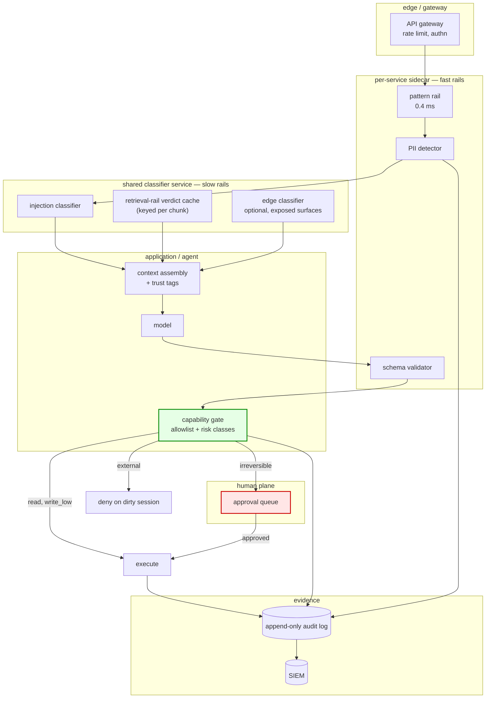

# T18 — Guardrails & Security: High-Level Design

> `T18` · **Transcript coverage:** primary · [LLD](LLD.md) · [Cheat sheet](../../00-cheat-sheets/T18-guardrails-security.md) · [Case study](../../01-case-studies/T18-guardrails-security.md) · [Interview bank](../../02-interview-questions/T18-guardrails-security.md) · [Runnable core](run.py) · [Production](production/README.md) · [Sequences](docs/SEQUENCES.md)

---

## 1. System context

### 1.1 The claim this design is built on

The corpus describes guardrails as **four rails wrapped around the model** [T]:

> "Think of rails as filters wrapped around the model at every stage of a request. Input rails screen the user's message before it reaches the model. Output rails inspect the reply before it reaches the user. Tool call rails sit in front of any real-world action. Screen the input, validate the output, and above all, gate the tool calls that can send money, email a customer, or delete a record. That last layer has the biggest blast radius." — *LLM Guardrails* [T]

That description is correct and it is two descriptions in one sentence. **A rail is not one kind of object.** Three of the four positions hold *detectors*: components that reduce harm by **recognising an attack**. The fourth holds a *capability gate*: a component that reduces harm by **removing the thing the attack needs**, and which never recognises anything.

Everything in this design follows from separating those two:

| | Detector | Capability gate |
|---|---|---|
| Reduces harm by | recognising the attack | removing the capability the attack needs |
| Strength depends on | attack novelty | the trust context and the human in the loop |
| Measured catch rate | 82.3% against this topic's attack mix (§3) | — it does not catch anything |
| Failure floor | the residual on an unseen technique: **8.0%** | the approval step: **0.045**, rising to **0.45** under load (§11) |
| Remaining headroom | **1.1 points** (§3.5) | **22x** (§7.2) |
| Degrades with | attacker adaptation (§10) | operator workload (§11) |

**The design conclusion is that the second column is where the next dollar goes**, and the corpus's ordering — *"gate the tool calls above all"* [T] — is correct for a stronger reason than blast radius: it is the only control whose strength does not depend on guessing what the attacker will do next.

### 1.2 The three planes of this design



The red edge is the loop the corpus's metric list [T] does not close: **"track the share of tool calls that actually pass through a gate"** is a coverage number, and the number that matters is the share that passed *and was actually looked at*. §11 measures it.

### 1.3 The four rail positions, and which of them are detectors



**Positions 1–3 hold detectors; position 4 holds a gate.** The corpus's own observation — *"teams reliably add the obvious input and output rails, and reliably skip the two that matter most: filtering the retrieved context and gating the tool calls"* [T] — is therefore two different criticisms bolted together:

- **the skipped detector (position 2)** is a **coverage** failure: the input rails are not weak, they simply never see an indirect injection;
- **the skipped gate (position 4)** is a **category** failure: it is not a better detector that was omitted, it is a different kind of control.

§3 measures the first. §7 measures the second. They are not comparable errors.

---

## 2. What a guardrail is not

### 2.1 Not a wall

> "And rails are not a wall. They are a filter that determined attackers learn to slip past. Research keeps demonstrating evasions, so treat red teaming as continuous, not one time." — *LLM Guardrails* [T]

This is a design constraint, not a disclaimer. It means **the specification cannot be "block all attacks"**, because that is not a state any configuration reaches. The specification has to be a *rate* with a *date*: a catch rate against a named attack mix, measured at a named time, at a named cadence. §10 is that section.

### 2.2 Not a scalar

A rail's catch rate described as a number — "our injection classifier catches 90%" — discards the two properties that decide the outcome:

| Discarded property | What it decides | Where it is measured |
|---|---|---|
| **Technique** | whether the rail can see this attack at all | §3.2 |
| **Path** | whether the attack reaches the rail at all | §3.3 |

A design review that lists four rails and their four catch rates **will produce `1 - (1-r₁)(1-r₂)(1-r₃)(1-r₄)`**, which for this topic's parameters is **99.986%**. The measured value is **82.3%**. That 17.7-point gap is the single most important number in this topic (§3.4).

### 2.3 Not a completion

> "The subtlest trap is treating safety as done." — *LLM Guardrails* [T]

A rail's strength is a function of time (§10) and of operator workload (§11). Neither appears anywhere in a rail's configuration, which is why both are invisible to the review that approves it.

### 2.4 Not a place where "tighter" is always better

> "Tune the rails too tight and you frustrate real users with false refusals, which is its own kind of failure." — *LLM Guardrails* [T]
> "A system that blocks everything is safe and useless." — *LLM Guardrails* [T]

§8 turns this into arithmetic and finds that the optimum **is** block-everything for a regulated payer and **is not** for a marketing bot — with the same detector. The corpus's sentence is one correct answer for one business and one wrong answer for another.

---

## 3. The detection plane: the competence matrix

### 3.1 Why the mechanism forces this model

The corpus explains why injection works in one sentence [T]:

> "To the model the instructions and the data are just one stream of text and it has no built-in way to tell which is which. That is why the defenses are about structure — strongly delimiting data, spotlighting it as untrusted, and never letting retrieved text reach the instruction slot."

The systems literature in the corpus reaches the same conclusion from the other side, calling it "the lack of separation of instructions and data in the context" and naming it as the source of "so many novel security threats associated with agents" [T] (Steinder).

If the payload is textually indistinguishable from data, then **a detector cannot be evaluated on the text alone**. It has to be evaluated on *which family of attack* the text belongs to and *which route* it arrived by, because those are the two things that determine whether the detector's rules apply.

### 3.2 The technique axis

| Technique | What it is | Caught by | Not caught by |
|---|---|---|---|
| `known_pattern` | matches a rule somebody already wrote | regex, blocklist, learned classifier | nothing — this is the easy class |
| `paraphrase` | the same attack in different words | learned classifier | regex |
| `structural` | a shape rather than a phrase: exfiltration markers, base64 payloads, delimiter escapes, out-of-band URLs | output validator, classifier | regex, unless the shape was anticipated |
| `novel` | a technique nobody has a rule or a training example for | **the residual only** | everything |

The **residual** is the concept the scalar model lacks. A learned classifier generalises a little past its training families — that is what a learned model is for — so it is not zero. In this design it is 3–6% per classifier, and it is the *entire* protection against the `novel` class:

```
catch(novel, retrieved) = 1 - (1 - 0.05) x (1 - 0.03) = 7.85%
```

**7.85%.** Every other number in the stack is a detail; this one sets the ceiling (§3.5).

### 3.3 The path axis

| Path | Arrives via | Seen by the input rails? | Corpus reference |
|---|---|---|---|
| `direct` | the user types it | yes | "Direct injection is the obvious kind" [T] |
| `retrieved` | inside a document the RAG system retrieved | **no** | "The attack is hidden inside a document your RAG system retrieves. So the user never typed it." [T] |
| `tool_output` | inside a tool's JSON response, after a legitimate call | **no** | edge case in the case study §6 |
| `uploaded_doc` | inside a file the user attached without reading | **no** | same class as `retrieved` |

The input rail's problem with an indirect injection is not that it is weak — **it is that the payload never passes through it.** Coverage, not competence. The measured consequence is stark:

| Attack mix by path | Share | Catch of the full stack |
|---|---|---|
| `direct` | 16.0% | 99.2% |
| `retrieved` | 53.0% | 84.8% |
| `tool_output` | 17.0% | 71.8% |
| `uploaded_doc` | 14.0% | 66.1% |

**The one path the input rails cover is 16% of attempted attacks.** The corpus's claim that teams skip the rails that matter most is therefore not a discipline failure — it is a **measurement failure**, and §3.4 computes the size of it.

### 3.4 The headline measurement

The scalar arithmetic, computed exactly:

| Configuration | Scalar `1-prod(1-r_i)` | Measured against the mix | Gap |
|---|---|---|---|
| input pattern only | 88.000% | **5.3%** | 82.7 |
| **the obvious two (input rails)** | **99.040%** | **15.1%** | **83.9** |
| the obvious two + output validator | 99.856% | 72.5% | 27.3 |
| **+ retrieval rail (the full stack)** | **99.986%** | **82.3%** | **17.7** |
| the full stack minus retrieval | 99.856% | 72.5% | 27.3 |

Two sentences a design review would accept as true, and their measurements:

> "We have an input pattern rail at 88% and an ML injection classifier at 92%. Combined, that is 99% coverage of injection attempts."
> **Measured: 15.1%.**

> "With the retrieval rail added, the four rails together give us effectively complete coverage."
> **Measured: 82.3%.**

### 3.5 The ceiling, which is the number that decides the design

| Quantity | Value |
|---|---|
| Full stack, measured | 82.3% |
| Full stack, every rail's `r` set to 1.0 (its theoretical maximum) | **83.4%** |
| **Remaining headroom in the entire detection approach** | **1.1 points** |

**The detection stack is already within 1.1 points of the best it can ever do.** The ceiling is not set by any rail's competence — it is set by the residual on the `novel` classes, and no amount of classifier improvement touches it. This is the measurement that makes §7's conclusion follow, and it is worth stating in the exact form a design review needs:

> "Improve the classifier" is not a lever in this system. There are 1.1 points available, permanently, and they are the 1.1 points that the residual already accounts for.

### 3.6 Coverage beats competence

The greedy build order over the four detection rails, computed rather than assumed:

| Step | Rail added | Marginal catch | Cumulative |
|---|---|---|---|
| 1 | **output_validator** | +70.2 | 70.2% |
| 2 | retrieval_rail | +9.8 | 80.0% |
| 3 | input_classifier | +2.2 | 82.2% |
| 4 | input_pattern | +0.1 | 82.3% |

**The single highest-value rail is the one that covers every path — not the one with the best catch rate.** The output validator alone (70.2%) beats the two input rails together (15.1%), and beats any other single rail, purely because it sits on all four paths.

And the leave-one-out view, which is the one to use when deciding what to *keep*:

| Remove | Catch falls to | Marginal value |
|---|---|---|
| retrieval_rail | 72.5% | **9.8 points** |
| output_validator | 75.4% | 6.9 points |
| input_classifier | 80.8% | 1.5 points |
| input_pattern | 82.2% | **0.1 points** |

> **Design rule.** Rank rails by *path coverage first, competence second*. A stack of four well-tuned rails sharing a coverage hole is one rail's worth of protection, and the input pattern rail — the one every deployment has — is worth **0.1 points** once a classifier is in place.

---

## 4. Severity weighting: the check the corpus's metric list omits

The corpus prescribes the metric [T]:

> "Run a red team suite and track the injection catch rate over time. Balance it against the false refusal rate … And treat any PII leak as a counted incident while tracking the share of tool calls that actually pass through a gate."

Three of those four are frequency-weighted. **None is consequence-weighted**, and the difference is the finding:

| Weighting | Catch | Escape rate |
|---|---|---|
| by **frequency** (what the corpus prescribes) | 82.3% | 17.7% |
| by **consequence** (severity 1–5 per class) | **76.9%** | **23.1%** |
| **skew** | **−5.4 points** | +5.4 points |

The reason is structural and not fixable by tuning: **the classes the stack cannot see are the classes with the highest severity**, because a novel technique is what a sophisticated attacker uses and a sophisticated attacker is aiming at something expensive.

| Class | Path | Severity | Catch | Escaped share of all attempts |
|---|---|---|---|---|
| rag_injection_novel | retrieved | 5 | 7.9% | 7.4% |
| uploaded_doc_novel | uploaded_doc | 5 | 7.9% | 4.6% |
| novel_exfil | tool_output | 5 | 7.9% | 4.6% |
| *…the ten remaining classes…* | | 2–5 | 98.5–99.9% | ≤0.3% each |

**17.7% of attempts escape, and they carry 23.1% of the consequence.** This is the fifth independent topic in this knowledge base where a frequency-weighted average reads better than a consequence-weighted one — after T08's goodput, T09's p99, T10's SNR and T17's gate — and it is the first one where **an adversary is choosing the shape of the tail**.

> **Design requirement:** the guardrail dashboard must carry a severity-weighted catch rate alongside the raw one. The corpus's own instruction to *"track the injection catch rate"* [T] is satisfied by a number that is 5.4 points optimistic.

---

## 5. Rail-by-rail

| Rail | Position | Sees | Covers | `r` | residual | Latency p50/p99 (ms) |
|---|---|---|---|---|---|---|
| `input_pattern` | input | `known_pattern` | direct | 0.88 | 0.00 | 0.4 / 1.5 |
| `input_classifier` | input | known, paraphrase | direct | 0.92 | 0.06 | 4.0 / 12.0 |
| `retrieval_rail` | retrieval | known, paraphrase, structural | retrieved, tool_output, uploaded_doc | 0.90 | 0.05 | 30.0 / 110.0 (**×5 chunks**) |
| `output_validator` | output | known, paraphrase, structural | **all paths** | 0.85 | 0.03 | 5.0 / 18.0 |

### 5.1 `input_pattern` — the rail everybody builds, worth 0.1 points

**Pros.** Free. Explainable — a security reviewer can read a regex. Zero latency. Catches the overwhelming majority of *attempts by volume*, which is what makes it feel effective.

**Cons.** A regex cannot match a family it has no rule for. Paraphrase defeats it entirely [T] (the corpus's "determined attackers learn to slip past" is, at this layer, a one-line change in wording).

**Exceptions — when it breaks.** Break it with a synonym. Its `residual` is 0.00 by construction, which is the definition of a pattern rail.

**When to use.** Always, as the first cheap pass and as a fast-path optimisation. Never as the basis of a coverage claim.

### 5.2 `input_classifier` — a learned detector with an accidental reach limit

**Pros.** Generalises past its training families; catches paraphrase.

**Cons.** It sits at the input position, so its coverage is `direct` — the same 16% of the mix as the pattern rail. This is the rail whose scalar value (92%) most badly misleads: alone it contributes 1.5 marginal points.

**Exceptions — when it breaks.** Any path that is not the user's own typing. The corpus's indirect-injection description [T] is exactly this exception.

**When to use.** Always, and never as a reason to skip position 2.

### 5.3 `retrieval_rail` — the one that is skipped, and the highest marginal value of the four

**Pros.** Covers 84% of the attack mix by path (retrieved + tool_output + uploaded_doc). Highest marginal value of any rail on the retrieval side: **9.8 points**. Covers `structural` techniques, which is where exfiltration markers live.

**Cons.** **The dominant latency line item** — it runs per retrieved chunk, so at k=5 it is 30 ms p50 / 110 ms p99, against 0.4 ms for the pattern rail. It is the expensive rail, and it is the one teams skip for cost rather than for principle.

**Exceptions — when it breaks.** A corpus consisting entirely of first-party curated content is `retrieved-trusted` and needs no scan. That exception is real and narrow; the moment a member can upload a document or a tool can return third-party text, it does not apply.

**When to use.** Every RAG path over externally-sourced, user-uploaded, or tool-returned content. Three cost controls, and the third is required not optional:

| Control | Effect | Measured |
|---|---|---|
| classify only `retrieved-untrusted` content | first-party corpora become free | — |
| classify after reranking, on the top-k | shrinks the multiplier | — |
| **cache the verdict per chunk, re-check on change** | **p50 39.4 → 15.4 ms** | §13.2 |

### 5.4 `output_validator` — the highest-value single rail

**Pros.** **Covers all four paths**, which is why it is worth more alone than the two input rails together. It is the only rail that sees `structural` techniques on the *response* side — exfiltration markers, base64 payloads, out-of-band URLs, instruction echoes — which is where a payload that slipped through every upstream rail still becomes detectable.

**Cons.** It sees the response after generation, so the model has already been persuaded; it can redact the leak but not stop the reasoning. Its `r` is the lowest of the four (0.85), which is the least important of its properties.

**Exceptions — when it breaks.** An attack whose *consequence* is a tool call rather than a response never reaches it. That is the gap §7 fills.

**When to use.** Always. Given the build-order result in §3.6, it is the first detection rail to build.

### 5.5 What is deliberately *not* in this table

- **The tool-call gate.** It is not a detector; see §7.
- **A model-based edge classifier** (PromptArmor-class, <1% FP/FN on AgentDojo [R]). It belongs in the same slot as `input_classifier` with a better `r`, and it would move the ceiling by 1.1 points. Buy it for the *false-refusal* profile, not for the catch rate.
- **Constitutional classifiers** (reported 86% → 4.4% jailbreak success [R], a vendor claim). Same slot, same ceiling argument.

---

## 6. The capability plane: trust tagging

### 6.1 The design that makes gating possible

The gate's input is the trust level of the content currently in context. That requires the corpus's rule [R]:

> "The trust level is data, not metadata: it travels in the same channel as the content, so the model itself can reason about it."

| Trust level | Rank | Meaning |
|---|---|---|
| `system` | 5 | the operator's own instructions |
| `user` | 4 | the member's own words |
| `retrieved_trusted` | 4 | first-party curated corpus |
| `tool_output` | 3 | a tool's response |
| `retrieved_untrusted` | 2 | scraped, third-party, or user-uploaded content |
| `unknown` | 0 | **the tag was lost** — see §9 |

### 6.2 Session trust is a minimum over history, not a snapshot of the window



> `session_trust(history) = min(rank(t) for t in history)`

**This is the single most-missed implementation detail in the topic.** An agent read a hostile email ten steps ago; the write tool is enabled because the email is no longer in the window. Gating on the current window is gating on the wrong thing.

---

## 7. The capability plane: the gate, and which lever to pull

### 7.1 The gate's decision surface

| Risk class | Examples | Min trust | Below min trust | Blast radius |
|---|---|---|---|---|
| `read` | look up a claim, search the corpus | 2 | allow, log | low — information disclosure at worst |
| `write_low` | draft a note, update a preference | 3 | **dry-run** | low — reversible internal state |
| `external` | send a member email, call a partner API | 4 | **deny** | medium — leaves the boundary |
| `irreversible` | disburse funds, delete a record, adjust a claim | 5 | **require approval** | high — the corpus's "biggest blast radius" [T] |
| — | anything not on the allowlist | — | **deny before execution** | — |

Three properties to note:

1. **`write_low` escalates to dry-run, not deny.** *"A dry run mode lets you watch what the agent would have done without doing it"* [T]. This is what makes the gate deployable without blocking work: the agent's plan is still observable and auditable.
2. **`irreversible` escalates to a human, not a denial.** The corpus's recipe [T]. It is also the gate's floor (§11).
3. **The allowlist is a deny-by-default list, and `register_new_tool` is in the tool set with `allowlisted=False`** to make the escape hatch explicit. An agent that can register a tool at runtime is an agent whose allowlist is advisory.

### 7.2 Which lever: the decomposition

Everything reduces to one product:

```
harm (per attack attempt) = (1 - catch) x gate_failure
```

Measured, at the current stack's catch rate (82.3%):

| Option | gate_failure | harm | reduction vs nothing |
|---|---|---|---|
| do nothing (pre-incident) | 1.0000 | 0.17706 | 0.0% |
| allowlist + strict schema only | 0.6000 | 0.10623 | 40.0% |
| **+ capability gating (fail-closed)** | **0.0450** | **0.00797** | **95.5%** |
| + capability gating (fail-open) | 0.0930 | 0.01089 | 93.8% |
| detectors at their **CEILING**, no gate | 1.0000 | 0.16587 | 6.3% |
| detectors at CEILING + schema | 0.6000 | 0.09952 | 43.8% |
| detectors at CEILING + gating | 0.0450 | 0.00746 | 95.8% |
| **detectors at ZERO + gating** | 0.0450 | **0.04500** | **74.6%** |

The two factors, stated as multipliers:

| Factor | Now | Best achievable | Factor |
|---|---|---|---|
| detection `(1 - catch)` | 0.1771 | 0.1659 | **1.07x** |
| gate | 1.0000 | 0.0450 | **22.2x** |

And the sentence that should be in every design review for this topic:

> **Turning the detectors completely OFF and adding a capability gate (0.04500) still beats running the detectors at their theoretical maximum with no gate (0.16587), by 3.7x.**

Why the gate is structurally immune where a detector is not: **it never tries to recognise the attack.** It asks a different question — *is this session allowed to touch this class of tool* — and that question has the same answer whether the payload was a regex-matchable phrase or a technique nobody has seen. The corpus's phrase for this is "structurally immune to persuasion" (case study §4.2 [R]); this is what it means as a number.

### 7.3 The build order this implies

| Order | Control | Why here |
|---|---|---|
| 1 | **Enumerate the tool surface; write the allowlist** | cheapest to build, no model, no latency, deny-by-default |
| 2 | **Strict argument schema** | *"a malformed or malicious call is rejected before it runs"* [T] — 40% of targeted calls, and it is also a reliability control (case study §4.6) |
| 3 | **Trust tagging at ingestion + assert at the model boundary** | the gate's input; worthless if it does not survive (§9) |
| 4 | **Capability gating by session trust** | 22x, and it does not erode |
| 5 | **Human approval for irreversible actions** | required by the corpus [T]; also the gate's new floor (§11) |
| 6 | `output_validator` | first *detection* rail: highest single value, all paths |
| 7 | `retrieval_rail` | second: 9.8 marginal points, with verdict caching |
| 8 | `input_classifier`, then `input_pattern` | 1.5 and 0.1 marginal points respectively |
| 9 | Edge classifier, if exposure warrants | buys the false-refusal profile, not the catch rate |

**Note the ordering against the corpus's own framing.** The corpus says input and output rails are the obvious ones and the retrieval rail and tool gate are the skipped ones [T]. The measured order agrees on positions 6–8 and puts the gate at steps 1–5 — *before any detector at all* — for the reason in §7.2.

---

## 8. The false-refusal trade

### 8.1 The arithmetic

A rail is not "a 90% catch rate". It is a **threshold**, and the catch rate is what the threshold happens to buy on the traffic it sees. Given attack scores ~ N(μ_a, 1) and benign ~ N(μ_b, 1):

```
catch(θ) = 1 - Φ(θ - μ_a)          fpr(θ) = 1 - Φ(θ - μ_b)
cost(θ)  = (1 - catch) · p · L  +  fpr · (1 - p) · F
```

The optimum is where marginal leak cost equals marginal false-refusal cost, and it has a closed form:

```
θ*  such that  f_attack(θ) / f_benign(θ) = (1 - p) · F / (p · L)
```

**There is no correct threshold. There is a correct threshold given an L/F ratio somebody has to name out loud.**

### 8.2 The optimum, priced for three businesses

Detector: cheap filter, AUC 0.802.

| Scenario | L | F | p | L/F ratio | θ* | catch | **fpr** | cost/req |
|---|---|---|---|---|---|---|---|---|
| health_payer | 50,000 | 50 | 0.02 | 20.4 | −1.90 | 99.9% | **97.1%** | 48.56 |
| marketing_bot | 500 | 40 | 0.02 | 0.3 | +1.75 | 29.1% | 4.0% | 8.66 |
| internal_tool | 2,000 | 5 | 0.005 | 2.0 | 0.00 | 88.5% | 50.0% | 3.64 |

**The health payer's cost-optimal operating point is a 97.1% false-refusal rate.** That is not a recommendation and not a modelling error. At a 20.4:1 leak-to-refusal ratio, the arithmetic genuinely says *block almost everything* — and no product team would ship it.

> **The design conclusion is not "tune the threshold better". It is that one threshold is the wrong architecture.** §8.4 is the fix.

### 8.3 The two endpoints, and the corpus's sentence measured

| Scenario | allow-all cost | block-all cost | block-all worse? |
|---|---|---|---|
| health_payer | 1000.00 | **49.00** | False — blocking is a **20x saving** |
| marketing_bot | 10.00 | **39.20** | **True** — blocking costs **3.9x** |
| internal_tool | 10.00 | 4.97 | False |

> "A system that blocks everything is safe and useless." [T]

**Correct for the marketing bot, and wrong by 20x for the health payer.** One sentence, two opposite correct answers, decided entirely by L/F. The design lesson is not that the corpus is wrong — it is that **a prose rule about a numeric trade is only valid for one value of the ratio**, and the ratio is different for every deployment.

### 8.4 The cascade — the architectural fix

Because the regulated optimum is unusable, the answer is to stop asking one detector to be both high-recall and precise.



| Scenario / architecture | θ | catch | fpr | detector cost | total |
|---|---|---|---|---|---|
| health / single cheap filter | 2.05 | 19.662% | 2.0% | 1.0 | 805.36 |
| health / precise only | 2.05 | 70.755% | 2.0% | 20.0 | 313.43 |
| **health / cascade** | −1.30 | **99.996%** | 1.8% | **1.5** | **2.39** |
| marketing / cascade | 0.40 | 98.883% | 0.7% | 1.5 | 1.85 |
| internal / cascade | −0.40 | 99.892% | 1.3% | 1.4 | 1.49 |

**At an identical 2% false-refusal budget** on the health payer:

| Architecture | catch |
|---|---|
| single cheap filter | 19.662% |
| precise detector alone (20x the cost) | 70.755% |
| **cascade** | **99.996%** |

Two facts in that table are worth carrying:

1. **The cascade runs the expensive detector on 2.4% of traffic.** It multiplies the two detectors' *independent errors* — the same "layering" move the rail stack makes (§3) — while paying the expensive component only on the flagged fraction.
2. **Paying 20x for a better detector, alone, is not a substitute for putting it in the right place.** 70.8% against 99.996%.

This is the corpus's "two-pass intent extraction then act" [R] presented as a security technique. It is really a **cost-architecture** technique, and the security framing is why teams under-use it.

### 8.5 The segment skew: one threshold is an average over a non-uniform population

At a global operating point of θ = 1.645 (**a 5% false-refusal rate on average**):

| Segment | Share | FPR | × overall |
|---|---|---|---|
| majority | 70.0% | 5.0% | 0.7x |
| terse | 10.0% | 8.9% | 1.3x |
| domain_jargon | 12.0% | 10.7% | 1.6x |
| **dialect_second_language** | 8.0% | **14.8%** | **2.2x** |

**The same 5% global rate lands as 14.8% on one segment.** The cost model treats `F` as one number; the users who pay it are not one population. And note the direction: the segment most likely to lose access is the one least likely to be able to route around it.

> **Design requirement:** the false-refusal metric must be reported **per segment**, not globally. *"Balance safety against false refusals"* [T] is an average over a distribution that is not uniform, and a global threshold tuned on the majority segment is a policy that is 2.2x harsher on a minority of users.

---

## 9. Trust-tag propagation: fail-open versus fail-closed

### 9.1 The arithmetic

```
P(tag survives) = (1 - loss_per_hop) ^ hops
```

| Hops | 1% loss | 3% loss | 5% loss | 10% loss |
|---|---|---|---|---|
| 1 | 0.990 | 0.970 | 0.950 | 0.900 |
| 3 | 0.970 | **0.913** | 0.857 | 0.729 |
| 5 | 0.951 | 0.859 | 0.774 | 0.590 |
| 8 | 0.923 | 0.784 | 0.663 | 0.430 |

**Every hop is a chance for a security control's input to disappear.** At 3 hops and 3% loss, 8.7% of untrusted content arrives with no label.

### 9.2 What the choice costs

| Posture | Tag survival | Arrives PRIVILEGED | Legitimate content restricted |
|---|---|---|---|
| **fail-open** (missing → trusted) | 91.3% | **8.7%** | 0% |
| **fail-closed** (missing → untrusted) | 91.3% | **0.0%** | **7.9%** |

### 9.3 The effect on harm — and the reason it is invisible

| Posture | gate_failure | harm | vs closed |
|---|---|---|---|
| fail-closed | 0.0450 | 0.00797 | — |
| **fail-open** | **0.0930** | **0.01647** | **+106.7%** |

And the fact that makes this a design trap rather than a bug:

```
catch rate under fail-open:     82.3%
catch rate under fail-closed:   82.3%   (identical)
gate widened by:                2.07x
```

**Nothing was detected, nothing was missed.** A metadata field was absent, the gate widened by 2.07x, and every detection metric in the stack is byte-identical. The corpus requires trust to travel as data [R] and the requirement is load-bearing in a way it does not state:

> **Design rules.** (1) **Fail closed.** The two options are "silently privileged" and "loudly refused", and only the second is measurable. (2) **Assert the tag's presence at the model boundary**, not at ingestion — every hop between them is a chance for it to vanish, and nothing downstream of the loss can tell that it existed. (3) The cost of fail-closed is 7.9% of legitimate content restricted, which is a *visible* number and therefore a tunable one.

---

## 10. Decay: the red-team cadence is the control

### 10.1 The mechanism

Two populations of attack are always live: techniques the pattern library covers, and techniques it does not. Attackers rotate toward the second. A red-team run converts some of the second into the first; nothing else does.

```
in-library catch      98.6%
novel (residual) catch 7.9%
rotation              6.0% of the in-library population per month
a red-team run finds  75% of the novel stock
```

### 10.2 The cadence table

| Cadence | Mean catch | **Trough** | Sev-weighted mean | Sev trough | Exposure |
|---|---|---|---|---|---|
| continuous (every release) | 96.7% | **93.4%** | 95.9% | 91.4% | 0.0% |
| quarterly | 87.5% | 73.6% | 83.7% | 66.7% | 9.2% |
| semi-annual | 77.0% | 62.5% | 71.0% | 54.5% | 19.6% |
| annual | 63.1% | **45.5%** | 55.7% | 38.0% | 33.6% |
| never (launch checkbox) | 45.4% | **24.7%** | 38.8% | 20.3% | **51.2%** |

The trough is the number to steer by, and it is the one nobody reports. Solved for a target:

| Keep the trough above | Cadence | Trough |
|---|---|---|
| 90% | continuous | 93.4% |
| 75% | continuous | 93.4% |
| 70% | **quarterly** | 73.6% |
| 60% | **semi-annual** | 62.5% |

> *"Red teaming has to be a recurring schedule, not a launch checkbox"* [T] is correct and under-specified. **The schedule is the whole decision**, and it can be solved for a stated exposure tolerance rather than chosen by habit.

### 10.3 Where this run disagrees with the rest of the knowledge base — stated plainly

This experiment **does not** reproduce the average-hides-the-tail signature, and the design says so rather than manufacturing a fifth instance:

| Reading | Start | End | Movement |
|---|---|---|---|
| mean catch | 77.8% | 24.7% | **−53.1 points** |
| severity-weighted catch | 71.6% | 20.3% | −51.2 points |
| novel-class catch | 7.9% | 7.9% | **0.0 points** |

The decay here is fast enough that the published mean is not hiding anything — it falls 53.1 points, and it falls because the attackers are winning. The severity gap *narrows* (6.3% → 4.4%) rather than widening, so the static signature found in §4 does not compound over time. **The drift dominates it.**

What the experiment shows instead is a different and sharper failure:

> **One reading is permanently dead.** The novel-class catch moves **0.0 points** across two years of accelerating decay, because it starts at its own floor (7.9%) and stays there. It cannot cross a threshold, so it cannot fire. An instrument pointed at the population that is entirely severity-5 is not insensitive — it is **silent by construction.**

The controls that *can* fire on this are ones that measure the adversary rather than the classifier:

| Signal | What it detects |
|---|---|
| count of injection ATTEMPTS (by source) | the population growing, regardless of catch |
| unexplained tool-call patterns | an agent acting on content that passed every rail |
| new-source / new-path signals | a corpus or tool integration appearing |
| the trough, with its DATE | *"a rail you tested in March may be bypassed by June"* [T] |

**And the mean's 53.1-point fall is a level, not a rate.** Nothing in the number says whether it is decaying fast or slow; a rate of change would. Reporting a red-team result without its date is the same class of error.

---

## 11. Human approval as a resource

### 11.1 The gate's floor is a queue

The corpus requires approval for irreversible actions [T] and does not say what happens when four hundred are waiting. The measurement:

```
approver pool: 2 reviewers x 40 decisions/hour = 80/hour over an 8h day
approver_accuracy(depth) = 0.95 x exp(-depth / 60)
```

| Utilisation | Queue depth | Latency | Approver accuracy | gate floor |
|---|---|---|---|---|
| 0.10 | 0.0 | 0.00 h | 0.950 | 0.0226 |
| 0.50 | 0.5 | 0.01 h | 0.942 | 0.0260 |
| 0.70 | 1.6 | 0.03 h | 0.924 | 0.0340 |
| 0.85 | 4.8 | 0.07 h | 0.877 | 0.0555 |
| 0.95 | 18.0 | 0.24 h | 0.703 | 0.1336 |
| **1.00** | **∞** | **∞** | **0.000** | **0.4500** |

| Queue depth | Approver accuracy | Gate failure |
|---|---|---|
| 0 | 0.950 | 0.0225 |
| 5 | 0.874 | 0.0567 |
| 20 | 0.681 | 0.1437 |
| 60 | 0.349 | 0.2927 |
| 400 | 0.001 | **0.4495** |

**The quantity §7.2 held at 0.0450 swings to 0.4495 — a 20x weakening of the control, with nothing in the control's own configuration having changed.** Approver accuracy halves at a queue depth of 38.5 items.

### 11.2 Why this is the same failure as §9 and §10

> **Three of this topic's six experiments end in the same place: a missing trust tag, a decaying rail, and a busy approver queue all weaken a control without any control reporting it.**

| Control | How it weakens | What reports it |
|---|---|---|
| trust tag | a middleware hop drops an attribute | **nothing** — every detection metric is flat |
| red-team rail | attackers rotate to novel techniques | **nothing** — the novel reading cannot fire |
| human approval | the queue deepens | **only the approval rate**, which nobody watches |

That is the operational hazard of this topic, and **it is not addressed by adding another classifier.** It is addressed by instrumenting the *controls* rather than the *attacks*.

### 11.3 The scaling question

| Irreversible actions/day | Per hour | Utilisation | Servable |
|---|---|---|---|
| 50 | 2.8 | 0.04 | ✅ |
| 1,000 | 56.2 | 0.70 | ✅ |
| 2,000 | 112.5 | 1.41 | ❌ |
| 5,000 | 281.2 | 3.52 | ❌ |

| Demand/day | Approvers needed | Multiple of today's 2 |
|---|---|---|
| 200 | 1 | 0.5x |
| 1,000 | 4 | 2.0x |
| 5,000 | 16 | 8.0x |
| 20,000 | 63 | **31.5x** |

**Approver headcount grows linearly with agent volume. Irreversibility does not have to.** The corpus never names the second option and it is the only one that scales:

> **Design requirement:** every irreversible action gets an **undo path** before the approval queue becomes the bottleneck. At 20,000 irreversible actions a day the queue needs 63 reviewers; the same volume with a compensating action on each requires the engineering time to build the undo and nothing else. *"Add an undo path"* is not a nicety at that scale — it is the design.

And the metric that says when the control stopped being real:

| Metric | What it shows |
|---|---|
| **approval rate** | rising with a stable request rate = reviewers have stopped reading |
| reversal rate | the share of approvals later undone |
| approval latency p95 | the queue, which is the mechanism |
| gated share of state-changing calls | the corpus's metric [T] — necessary, and it cannot see any of the above |

---

## 12. Deployment topology



**Placement rationale, and the trade:**

| Layer | Holds | Why there |
|---|---|---|
| sidecar | pattern, schema, PII | lowest latency (0.4–5 ms), no network hop, uniform across services |
| shared service | injection classifier, retrieval-rail verdicts, edge classifier | shared across teams, independently scalable — **and a slow classifier degrades one rail rather than the request path** |
| in-process gate | allowlist + risk decisions | the gate must be *on* the call path; it is 0.2 ms and it is not optional |
| human plane | approvals | out of band by definition |

**The retrieval rail's verdict cache is the single most valuable piece of infrastructure here.** Caching per-chunk verdicts takes the rail's p50 contribution from 30.0 ms to 6.0 ms and the whole stack from **39.4 ms to 15.4 ms** — a 61% reduction in added latency for zero change in coverage.

---

## 13. Failure domains

### 13.1 The table

| # | Failure | Symptom | Detection | Silent? |
|---|---|---|---|---|
| 1 | Indirect injection via retrieved doc | agent follows embedded instructions | retrieval rail hit; anomalous tool calls | no |
| 2 | **Trust tag lost in a middleware hop** | **none** | **none** — assert at the model boundary | **YES** |
| 3 | **Rail decayed since the last red-team run** | catch rate "fine" | **none** from the classifier metric | **YES** |
| 4 | **Approver queue beyond capacity** | actions wait | approval latency p95, approval rate | **YES** |
| 5 | **Capability gating on the wrong window** | writes allowed on a dirty session | session-history audit | **YES** |
| 6 | **Coverage hole shared by all rails** | none until an incident | path-coverage measurement | **YES** |
| 7 | **False refusal storm** | users blocked | false-refusal rate by segment | no |
| 8 | **Severity skew** | catch rate reads 5.4 points high | severity-weighted catch | **YES** |
| 9 | PII in a tool ARGUMENT (not the response) | output rail sees nothing | argument inspection | **YES** |
| 10 | Schema-rejection retry loop | budget consumed | attempt ceiling alarm | no |
| 11 | Malformed tool call executes | partial write | schema failures | no |
| 12 | Model phones home on load | unexpected egress | egress/DNS monitoring | no |
| 13 | Unsigned model swap | behaviour change, no deploy | model-hash comparison | **YES** |
| 14 | Audit log rewritten | none | tamper-evident storage check | **YES** |
| 15 | Over-redaction breaks a legitimate answer | wrong answer | redaction log review | no |

**Ten of fifteen are silent.** That ratio is the argument for §14's boot checklist, and it is the same ratio the T17 blueprint found in its own failure table.

### 13.2 Per-rail latency, and the one fix that matters

| Rail | Calls | p50 ms | p99 ms |
|---|---|---|---|
| input_pattern | 1 | 0.4 | 1.5 |
| input_classifier | 1 | 4.0 | 12.0 |
| **retrieval_rail** | **5 chunks** | **30.0** | **110.0** |
| output_validator | 1 | 5.0 | 18.0 |
| **TOTAL** | | **39.4** | **141.5** |
| TOTAL, retrieval verdict cached at 80% | | **15.4** | — |

> **The most valuable detection rail is not the most expensive one, and the most expensive one is the one teams skip.** The retrieval rail is 76% of the added p50. Caching the per-chunk verdict is a 61% reduction in stack latency and costs one keyed store.

### 13.3 The boot check — refuse to start

Five conditions under which the service should **fail to boot**, because three of them are silent at runtime:

1. Any tool in the registry whose risk class is `irreversible` and which has no approval route.
2. Any tool in the registry with `allowlisted=False` that is reachable by name.
3. Any ingestion path that emits content without a trust tag.
4. Any hop in the context pipeline that does not propagate the trust tag.
5. Any model or rail artefact without a pinned version hash.

---

## 14. Build vs buy

| Need | Buy | Build | Choose |
|---|---|---|---|
| Declarative rail layer | **NeMo Guardrails**, Guardrails AI — *"keeping those rules in one place is what lets a security reviewer actually audit them"* [T] | bespoke if-statements, "not auditable" | **buy**; move one rail out if the flow model cannot express a policy, never abandon the framework |
| PII detection/redaction | **Presidio**, Redact PII | regex only | **buy, plus your own domain patterns** — over-redaction of claim numbers is a domain problem |
| Injection detection | **Lakera**, Rebuff, PromptArmor-class | train on your own traffic | **buy first**; train only after the off-the-shelf options saturate, because the ceiling is 1.1 points away either way |
| Content safety | **Llama Guard** | — | **buy** |
| *"Layer three of those together and you have serious protection without training a single model of your own."* [T] | | | |
| Tool-call gate | nothing to buy — it is your tool registry | **build** | **build.** It is the highest-value control in the system and it is application logic, not a product |
| Trust tagging | nothing to buy | **build** | **build.** It has to be in your ingestion paths |
| Approval queue | ticketing systems, workflow engines | **build** if the volume is real | **buy if <1k/day; build if the undo path matters more** |
| Audit log | append-only storage (WORM), signed logs | application-level logging | **buy the storage property, build the events** — an audit log the application can rewrite is not evidence |
| Model signing | **Sigstore / OpenSSF Model Signing** [R] | — | **buy.** It answers *"is the model I am running the model I evaluated"* — the same control T19 calls attestation |

---

## 15. What changes at 10×

| Dimension | At 1× | At 10× | Consequence |
|---|---|---|---|
| Retrieval-rail cost | comfortable | visible in unit economics | verdict caching becomes mandatory, not an optimisation (§13.2) |
| Approval volume | a workflow | a headcount problem | **design the undo path**; approval cannot scale (§11.3) |
| Red-team cadence | annual feels fine | the trough is 45.5% and the interval is the exposure | continuous or near-continuous (§10.2) |
| False refusals | a support ticket | a segment-level access problem | per-segment reporting becomes a fairness requirement (§8.5) |
| Detection | 1.1 points of headroom | same 1.1 points | the only scaling lever is the gate (§7.2) |
| Review loop | human-led | **agent-to-agent** — *"your prompt-injection defenses are being probed by an attacker agent"* [R] | human-led review stays necessary and stops being sufficient |
| Supply chain | pin versions by habit | signed weights and signed evaluation reports | mandatory (§14) |
| **What survives** | instruction/data separation by structure; trust as data; capability gating; the four positions; severity-weighted measurement; the recurring cadence | | these are architectural |
| **What inverts** | at 0.1×, a read-only assistant with input and output rails is genuinely enough [T] | | **building four rails for a read-only assistant is waste** — the rails scale to the capability, and capability scales with the tool surface |

---

## 16. Six takeaways

1. **A rail's catch rate is not a scalar.** It is conditional on the attack *technique* and the *path*, and the arithmetic that ignores those overstates protection by **17.7 points** on a four-rail stack and **83.9 points** on the two rails teams actually build. One rail covering every path beats four sharing a hole.

2. **The detection approach is already within 1.1 points of its ceiling**, because the ceiling is set by the residual on unseen techniques. "Improve the classifier" is a rounding error. The gate has **22x**.

3. **The gate is the only control whose strength does not depend on recognising the attack** — which is why, with the detectors turned off, it still beats detectors at their theoretical maximum with no gate, by 3.7x. Build it first, and build it from the tool registry, not from a product.

4. **The false-refusal trade is a ratio you must name.** The same detector's cost-optimal threshold is a 97.1% refusal rate for a regulated payer and a 4.0% one for a marketing bot, and the two disagree about which endpoint is safe. When the optimum is unusable, the fix is a **cascade**, not a better threshold.

5. **The controls weaken without reporting it.** A lost trust tag doubles the gate's failure rate with every detection metric flat; a decayed rail reads "fine" on the prescribed metric; a deep approval queue swings the gate 20x. Instrument the controls, not only the attacks.

6. **A red-team cadence is a control whose failure mode is the interval.** Solve it for a trough, report it with a date, and pair it with something that measures the adversary — because the classifier reading aimed at the population that matters most is provably incapable of firing.

---

## Sources

| File under `refs/` | Used for |
|---|---|
| `LLMOps_Agentic_AIOps_The_Hands-On_Playlist_2026_transcripts/LLM_Guardrails_Stop_Injection_Leaks_Hallucination_NeMo_Guardrails.txt` | the four rail positions and the sentence that teams skip the two that matter most; the three-layer hostile-request walkthrough; "rails are a filter, not a wall"; the tool-call rail recipe (allowlist, strict schema, human approval, dry run, audit log); "the biggest blast radius"; scaling rails to capability (read-only / action / regulated); direct vs indirect injection and the instruction–data separation explanation; "tune the rails too tight"; "a system that blocks everything is safe and useless"; "a rail you tested in March may be bypassed by June"; the metric list (catch rate, false refusal rate, PII as counted incident, gated tool-call share); NeMo Guardrails, Colang, and "keeping those rules in one place is what lets a security reviewer actually audit them" |
| `LLMOps_Agentic_AIOps_The_Hands-On_Playlist_2026_transcripts_2/MCP_vs_A2A_How_AI_Agents_Connect_and_How_to_Govern_Them.txt` | "who is allowed to do what on whose behalf"; evaluating the whole trajectory rather than the final answer; least privilege; the access-policy gateway as the enforcement point; the governance metrics (tool-call authorization rate, denied attempts, trajectory eval pass rate) |
| `Agentic_AI_Infra_transcripts_3/Gosia_Steinder_-_Beyond_Harnesses_Platform_Solutions_for_Agent_Reliability_Secur.txt` | the lack of instruction/data separation in the context as the source of novel agent threats; zero-trust's dependence on a-priori interaction patterns and why agents break it; the interception layer as the uniform enforcement point |
| `CMU_Inference_Algorithms_for_Language_Modeling_Fall_2025_transcripts/CMU_LLM_Inference_10_Incorporating_Tools.txt` | the sandboxing ladder and its limit ("near impossible to get rid of all dangerous codes"); the prompt-injection threat example; the JSON-escaping failure mode that makes a schema validator a security control |
| `vLLM_Inference_Meetup_Bengaluru_2026_transcripts/The_Token_Raj_Rethinking_the_AI_Inference_Stack.txt` | the model that tried to open a network connection on load; Kata containers and network isolation; attestation |
| `ai-system-design-guide-main/ai-system-design-guide-main/12-security-and-access/01-llm-security.md` | the OWASP LLM Top 10 framing; injection types and mitigations; the five-layer IPI defence; **"the trust level is data, not metadata"**; **"capability gating is the most underused defense"**; insecure output handling and its safe replacements; the May 2026 arms-race timeline; PromptArmor, Constitutional Classifiers, Sigstore |
| `ai-system-design-guide-main/ai-system-design-guide-main/13-reliability-and-safety/01-guardrails.md` | the risk taxonomy; the defence-in-depth pipeline; input guardrails (topic classification, PII, length, rate); output guardrails (content safety, relevance, NLI factuality); injection detection patterns; hallucination mitigation and abstention; structured-output validation with retry-with-correction; action safety with risk classification; guardrail metrics; the NeMo Guardrails and Guardrails AI examples |
| `ai-system-design-guide-main/ai-system-design-guide-main/12-security-and-access/02-access-control.md` | authentication / authorization / isolation / audit; RBAC and ABAC; API key lifecycle; audit logging as compliance evidence |
| `ai-system-design-guide-main/ai-system-design-guide-main/13-reliability-and-safety/04-ai-governance-and-compliance.md` | the governance framing the guardrail stack has to satisfy |

Related: [LLD](LLD.md) · [Production configs](production/README.md) · [Sequence diagrams](docs/SEQUENCES.md) · [Runnable core](run.py) · [Case study](../../01-case-studies/T18-guardrails-security.md)
