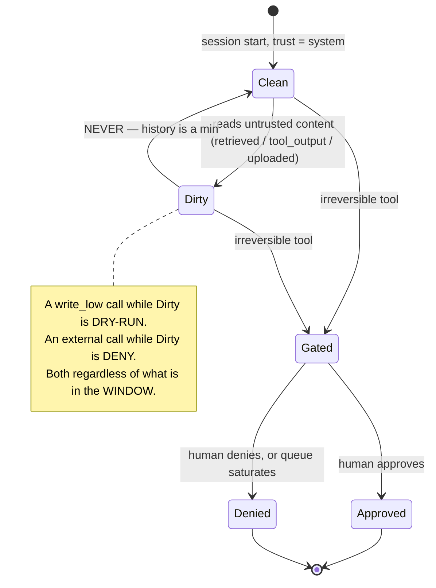

# T18 — Guardrails & Security: low-level design

> `T18` · **Transcript coverage:** primary · [HLD](HLD.md) · [Cheat sheet](../../00-cheat-sheets/T18-guardrails-security.md) · [Case study](../../01-case-studies/T18-guardrails-security.md) · [Interview bank](../../02-interview-questions/T18-guardrails-security.md) · [Runnable core](run.py) · [Production](production/README.md) · [Sequences](docs/SEQUENCES.md)

This document specifies the **interfaces, data structures, state and failure behaviour** of the four components that make this topic's design decide something: the competence matrix, the capability gate, the threshold policy and the decay schedule. It is written against the runnable core in [`sim/`](sim/) and every number quoted here is produced by `python run.py`.

---

## 1. Module map

```
03-design-blueprints/T18-guardrails-security/
  run.py                       six experiments, corpus quote block, summary
  sim/
    __init__.py                re-exports; the organising claim; module rationale
    rails.py      (DETECT)     competence matrix, attack mix, coverage vs competence,
                               ceiling, leave-one-out, build order, latency, tag survival
    gating.py     (GATE)       tools, risk classes, trust ranks, decision matrix,
                               gate failure decomposition, approver queue, blast radius
    policy.py     (BALANCE)    detectors, threshold cost model, closed-form optimum,
                               cascade, segment skew
    decay.py      (DECAY)      rotation/discovery, cadence sawtooth, metric blindness
    experiments.py             exp 1..6, formatting, run_all()
  HLD.md  LLD.md  production/  docs/SEQUENCES.md
```

### 1.1 What is deliberately not here

| Omitted | Why | Where it lives instead |
|---|---|---|
| An actual injection classifier | the design question is *where a rail sits and what it covers*, not which text classifier wins on a benchmark | `production/` names the buy options; the classifier is a slot with an `r` and a `residual` |
| A real vector store / retrieval path | T07/T12/T13 own that; here retrieval is a **path** with a trust rank | T12 blueprint |
| NeMo Guardrails Colang flows | the framework is a *buy*; the design's own logic is the gate | §8 config surface; `production/` |
| A PII detector implementation | Presidio is the industry default and its recall is not this topic's open question | `production/pii.yaml` |
| Anything needing a GPU or network | the whole core is stdlib-only and offline by construction | — |

### 1.2 Why the rails are modelled as a matrix rather than a list

The single design error this blueprint exists to prevent is `1 - prod(1 - r_i)`. That formula is what you get when a rail is a scalar. The model here refuses that representation: a rail is

```
Rail(sees: frozenset[str], covers: frozenset[str], r: float, residual: float)
```

and its catch on an attack is a function of **two** attributes of that attack, not one:

```python
def catch(self, technique: str, path: str) -> float:
    if path not in self.covers:
        return 0.0                       # COVERAGE failure -- not a low score, a zero
    return self.r if technique in self.sees else self.residual
```

The `0.0` on the second line is the whole document. An input rail does not score an indirect injection *lowly*; it never runs on it. Any model that represents that as "a rail with a weak score" will produce the 99.986% figure and ship a coverage hole.

---

## 2. Data structures

### 2.1 `Rail` — a detector with a reach limit (`rails.py`)

```python
@dataclass(frozen=True)
class Rail:
    name: str
    kind: str                 # "pattern" | "classifier"
    r: float                  # catch rate WITHIN competence
    residual: float           # catch rate OUTSIDE competence (generalisation)
    sees: frozenset           # techniques this rail can recognise
    covers: frozenset         # paths this rail is positioned on
    note: str = ""
```

| Field | Contract | Failure if misused |
|---|---|---|
| `r` | must be the **within-competence** rate. A rail whose headline "90% catch" is measured on a mixed population does not have `r = 0.90`; it has a lower `r` and a nonzero `residual`, and the split is the point | the scalar arithmetic reappears |
| `residual` | may be 0.0, and **is 0.0 for every pattern rail**. This is not a conservative choice — a regex genuinely cannot generalise to a family it has no rule for | treating residual as tunable |
| `sees` | the techniques the rail's mechanism can in principle act on | an over-broad `sees` inflates the ceiling |
| `covers` | the paths the rail is **positioned** on. This is a topology property, not a quality property | the `0.0` branch goes silent |

The four shipped rails:

| Rail | `kind` | `r` | `residual` | `sees` | `covers` |
|---|---|---|---|---|---|
| `INPUT_PATTERN` | pattern | 0.88 | 0.00 | {known_pattern} | {direct} |
| `INPUT_CLASSIFIER` | classifier | 0.92 | 0.06 | {known_pattern, paraphrase} | {direct} |
| `RETRIEVAL_RAIL` | classifier | 0.90 | 0.05 | {known_pattern, paraphrase, structural} | {retrieved, tool_output, uploaded_doc} |
| `OUTPUT_VALIDATOR` | classifier | 0.85 | 0.03 | {known_pattern, paraphrase, structural} | **ALL_PATHS** |

Note the third and fourth rows: **`OUTPUT_VALIDATOR` has the lowest `r` of the four and the highest `covers`.** It is the single most valuable rail (§3.6 of the HLD) with the worst competence. That inversion is the design lesson, and it is only visible if `r` and `covers` are separate fields.

### 2.2 `AttackClass` and `ATTACK_MIX` — the specification, not an assumption

```python
@dataclass(frozen=True)
class AttackClass:
    name: str
    technique: str        # known_pattern | paraphrase | structural | novel
    path: str             # direct | retrieved | tool_output | uploaded_doc
    weight: float         # share of attempts, sums to 1.00
    severity: int         # 1..5
```

Eleven classes summing to 1.00:

| Class | Technique | Path | Weight | Sev |
|---|---|---|---|---|
| direct_jailbreak | paraphrase | direct | 0.10 | 3 |
| direct_pattern | known_pattern | direct | 0.06 | 2 |
| rag_injection_known | known_pattern | retrieved | 0.17 | 3 |
| rag_injection_para | paraphrase | retrieved | 0.15 | 4 |
| rag_injection_struct | structural | retrieved | 0.06 | 4 |
| rag_injection_novel | **novel** | retrieved | 0.08 | **5** |
| tool_output_injection | structural | tool_output | 0.12 | 4 |
| uploaded_doc_known | known_pattern | uploaded_doc | 0.09 | 3 |
| uploaded_doc_novel | **novel** | uploaded_doc | 0.05 | **5** |
| exfil_via_output | structural | tool_output | 0.07 | **5** |
| novel_exfil | **novel** | tool_output | 0.05 | **5** |

**This table is the specification.** It is synthetic and says so — it must be, because the mix is deployment-specific. But the *shape* is not arbitrary: it is what makes the measurement honest.

| Property | Value | Why it must be this way |
|---|---|---|
| paths as a distribution | retrieved 53%, tool_output 17%, direct 16%, uploaded_doc 14% | the input rails' coverage is the smallest bucket — this is the corpus's "teams skip the rails that matter most" [T] expressed as a number |
| techniques as a distribution | known 32%, paraphrase 25%, structural 25%, novel 18% | if `novel` were 1%, the ceiling would be a curiosity; at 18% it is the binding constraint |
| mean severity | 3.77 | — |
| **all three `novel` classes at severity 5** | | this is not decoration. It is *why* the severity-weighted catch is 5.4 points below the frequency-weighted one (§4.3), and it is the property an adversary controls |

> **Design rule.** Replacing `ATTACK_MIX` with your own numbers is the intended use. Replacing it with numbers where the `novel` share is small, or where severity does not correlate with technique, silently deletes the finding. Write the mix down and defend it in the review.

### 2.3 `Tool` / `RiskClass` / `BlastRadius` (`gating.py`)

```python
READ, WRITE_LOW, EXTERNAL, IRREVERSIBLE = "read", "write_low", "external", "irreversible"
RISK_ORDER = (READ, WRITE_LOW, EXTERNAL, IRREVERSIBLE)

MIN_TRUST = {READ: 2, WRITE_LOW: 3, EXTERNAL: 4, IRREVERSIBLE: 5}
```

| Risk class | `MIN_TRUST` | On trust shortfall | Outcome constant |
|---|---|---|---|
| `read` | 2 (retrieved_untrusted) | allow, log | `ALLOW_LOGGED` |
| `write_low` | 3 (tool_output) | **dry-run** | `DRY_RUN` |
| `external` | 4 (user) | **deny** | `DENY` |
| `irreversible` | 5 (system) | **require approval** | `APPROVAL` |
| *(not allowlisted)* | — | deny before execution | `DENY` |

Three contracts worth stating explicitly:

1. **`MIN_TRUST` is keyed by risk class, never by tool name.** A per-tool trust threshold is a list that drifts; a per-class threshold is a policy.
2. **`write_low` → dry-run, not deny.** *"A dry run mode lets you watch what the agent would have done without doing it"* [T]. Deny loses the observation; dry-run keeps it.
3. **`irreversible` → human, not denial.** And that choice moves the gate's floor from a constant to a queue (§5.4).

The registry ships ten tools: three `read`, two `write_low`, two `external`, two `irreversible`, plus `register_new_tool` with `allowlisted=False` — present so the escape hatch is *explicit and visible in the registry*, rather than an unlisted capability.

### 2.4 `Decision`

```python
@dataclass(frozen=True)
class Decision:
    tool: str
    risk: str
    trust: int
    outcome: str
    reason: str
```

The `reason` field is not decoration. **Every non-allow outcome must carry a machine-readable reason**, because the audit log is the only place the gate's behaviour is checkable after the fact (§7.1), and "denied" without "because session trust was 2 and the class requires 4" is not evidence.

### 2.5 `Detector` / `Scenario` / `Segment` (`policy.py`)

```python
@dataclass(frozen=True)
class Detector:
    name: str
    mu_attack: float        # attack scores ~ N(mu_attack, 1)
    mu_benign: float        # benign scores ~ N(mu_benign, 1)
    cost_units: float

    @property
    def auc(self): return normal_cdf((self.mu_attack - self.mu_benign) / math.sqrt(2.0))

CHEAP_FILTER  = Detector("cheap_filter",  1.2, 0.0,  1.0)   # AUC 0.802
PRECISE_CHECK = Detector("precise_check", 2.6, 0.0, 20.0)   # AUC 0.967
```

```python
@dataclass(frozen=True)
class Scenario:
    name: str
    p: float          # attack prevalence
    L: float          # cost of a leak (money, or a chosen unit)
    F: float          # cost of a false refusal

SCENARIOS = (health_payer(0.02, 50_000, 50),
             marketing_bot(0.02,    500, 40),
             internal_tool(0.005, 2_000,  5))
```

**`L` and `F` must be the same unit and that unit must be named.** The entire disagreement between the health payer and the marketing bot is the ratio `L/F` = 20.4 versus 0.3. A scenario whose `L` is in dollars and `F` is in "user annoyance" has no optimum.

```python
@dataclass(frozen=True)
class Segment:
    name: str
    share: float
    mu_shift: float     # how this segment's benign traffic sits relative to the population

SEGMENTS = (majority(0.70, 0.0), terse(0.10, 0.30),
            domain_jargon(0.12, 0.40), dialect_second_language(0.08, 0.60))
```

`mu_shift` is the design's representation of *"this segment's legitimate traffic looks more like the attack distribution to the classifier"*. It is a modelling choice and it must be defended per deployment; what is not a modelling choice is that **the shift is nonzero**, because a classifier trained on majority traffic has never seen the others.

### 2.6 `DecayParams` / `Cadence` (`decay.py`)

```python
@dataclass
class DecayParams:
    novel_share_0: float = 0.18    # today's mix -- read from ATTACK_MIX, not assumed
    rotation: float = 0.06         # share of the in-library population rotating to novel per period
    discovery: float = 0.75        # share of the novel stock a red-team run finds
    periods: int = 24
    period_name: str = "month"
```

And the two constants **derived from the rail stack rather than assumed**:

```python
R_LIBRARY  = measured_catch(FULL_STACK, in_library_classes)   # 0.986
R_RESIDUAL = measured_catch(FULL_STACK, novel_classes)        # 0.079
```

This derivation matters. If `R_RESIDUAL` were a free parameter, the decay module could be tuned to produce whatever conclusion the author wanted. It is instead **the same number the rail stack produces in exp 1**, so §4's 5.4-point severity skew and §5.3's 7.9% novel catch are the same fact seen twice.

---

## 3. Interface contracts

### 3.1 `rails.py` — the four measurements

| Function | Signature | Returns | Contract |
|---|---|---|---|
| `scalar_catch` | `(rails) -> float` | `1 - prod(1-r)` | **the wrong number, computed correctly.** Its presence is the point: the blueprint computes the arithmetic everyone quotes so the gap can be shown |
| `stack_catch` | `(rails, cls) -> float` | per-class stack catch | `1 - prod over rails of (1 - rail.catch(...))` |
| `measured_catch` | `(rails, classes) -> float` | weight-weighted mean | the honest number |
| `severity_weighted_catch` | `(rails, classes) -> float` | severity-weighted mean | the one the corpus's metric list omits |
| `ceiling_catch` | `(rails, classes) -> float` | rebuilds rails at `r=1.0`, residual unchanged | **the bound.** 83.4% |
| `catch_by_class` / `_technique` / `_path` | `(rails) -> list` | sorted worst-first | for the report |
| `leave_one_out` | `(rails) -> list` | marginal value of each rail | what to *keep* |
| `build_order` | `(rails) -> list` | greedy marginal order | what to *build first* |

**The `ceiling_catch` contract is the one to get right:** it sets `r = 1.0` for every rail and **leaves `residual` alone**. A ceiling that also zeroed the residual would report 100% and say nothing. The honest ceiling is the residual on the classes no rail's mechanism applies to.

Computed outputs, for reference:

| Call | Result |
|---|---|
| `scalar_catch(FULL_STACK)` | 0.99986 |
| `measured_catch(FULL_STACK, ATTACK_MIX)` | 0.8229 |
| `measured_catch(OBVIOUS_TWO, ATTACK_MIX)` | 0.1511 |
| `ceiling_catch(FULL_STACK, ATTACK_MIX)` | 0.8344 |
| `severity_weighted_catch(FULL_STACK, ATTACK_MIX)` | 0.7690 |
| `measured_catch(FULL_STACK, all-novel classes)` | 0.0785 |

### 3.2 `gating.py` — the decomposition

```python
def gate_failure(level, approver_accuracy=0.90, tag_lost=0.0, fail_open=False) -> float
```

| `level` | Returns | Note |
|---|---|---|
| `"none"` | `1.0` | no control |
| `"schema"` | `1.0 - SCHEMA_CATCH` = `0.60` | schema rejection only |
| `"gated"` | see below | allowlist + capability gating |

```python
permit_irreversible = 1.0 - approver_accuracy          # the human misses it, or waves it through
permit_external     = tag_lost if fail_open else 0.0   # a dirty session with a lost tag
return P_TARGET_IRREVERSIBLE * permit_irreversible \
     + P_TARGET_EXTERNAL     * permit_external
```

Three parameters carry the design:

| Constant | Value | Meaning, and what it is NOT |
|---|---|---|
| `P_TARGET_IRREVERSIBLE` | 0.45 | the share of attempted attacks that are aimed at a money-moving tool |
| `P_TARGET_EXTERNAL` | 0.55 | …aimed at an outbound call. **Sums to 1.00 with the above** — an attack is aimed at one or the other |
| `SCHEMA_CATCH` | 0.40 | *"a malformed or malicious call is rejected before it runs"* [T] — 40% of targeted calls |

And the composed metric:

```python
def harm_rate(catch, level, approver_accuracy=0.90, tag_lost=0.0, fail_open=False) -> float:
    return (1.0 - catch) * gate_failure(level, approver_accuracy, tag_lost, fail_open)
```

**The contract here is that the two factors are independent.** That is the design's central claim (§7.2 of the HLD) and it is what makes the decomposition meaningful: detection quality cannot compensate for a missing gate, and vice versa. If they were coupled, the 3.7x statement — *detectors off + gate beats detectors at maximum + no gate* — would not be expressible.

### 3.3 `gating.py` — session trust

```python
def session_trust(history: Sequence[str]) -> int:
    return min(TRUST_RANK[t] for t in history)
```

**`min` over the whole history, not the current window.** The contract is stated as a one-line function because the bug it prevents is a one-line mistake:

> An agent read a hostile document at step 6. At step 11 the document has scrolled out of the context window. `session_trust(window)` returns 4; `session_trust(history)` returns 2. Only one of these is the control the design describes.

### 3.4 `policy.py` — the threshold

| Function | Signature | Contract |
|---|---|---|
| `expected_cost` | `(det, theta, scenario) -> float` | `(1-catch)·p·L + fpr·(1-p)·F` |
| `cost_curve` | `(det, scenario, lo, hi, n) -> list` | for the plot |
| `optimal_threshold` | `(det, scenario) -> (theta, cost)` | numeric minimisation (bisection on the derivative) |
| `closed_form_theta` | `(det, scenario) -> float` | `f_a(θ)/f_b(θ) = (1-p)F/(pL)`, solved in closed form |
| `cascade` | `(first, second, theta1, theta2, scenario) -> dict` | both must flag a benign request; **either** catches an attack |
| `find_operating_point` | `(det, target_fpr) -> theta` | bisection on the false-positive rate |
| `segment_fpr` | `(theta) -> list` | per-segment false-refusal rate at a global θ |

Two contracts that make this module trustworthy rather than merely plausible:

1. **`optimal_threshold` and `closed_form_theta` must agree.** They are computed by different methods (numeric bisection vs. the analytic solution) and the run checks them against each other. A cost model whose two solvers disagree is a cost model with a sign error in it.
2. **`cascade` composes the detectors' *errors*, not their scores.** A benign request is flagged only if **both** flag it; an attack is caught if **either** does. That is the exact opposite of the rail stack's `1 - prod(1-r)` composition, and the difference is deliberate: rails are independent detectors of *different things* (composed OR to catch), a cascade is a shared decision at two precisions (composed AND to avoid false positives).

### 3.5 `decay.py` — the schedule

```python
def run_decay(params) -> dict      # per-cadence trajectory, mean / trough / exposure / severity
def cadence_table(params) -> list  # the five cadences side by side
def cadence_for_trough(target, params) -> dict
def metric_blindness(params) -> dict
```

`cadence_for_trough` deserves its own contract because the implementation had a version of it that was wrong:

```python
for cad in sorted([c for c in CADENCES if c.every], key=lambda c: -c.every):
    if run_decay(params)["series"][cad.name]["trough"] >= target:
        return {...}
```

**Descending order.** The function answers *"what is the largest gap between red-team runs that still holds the trough above the target"*, so it must try the infeasible end first. Iterating ascending returns "continuous" for every target — technically a correct cadence, and useless as an answer. Solved outputs:

| Target trough | Cadence | Achieved |
|---|---|---|
| 0.90 | continuous | 93.4% |
| 0.75 | continuous | 93.4% |
| 0.70 | **quarterly** | 73.6% |
| 0.60 | **semi-annual** | 62.5% |

---

## 4. State — where a guardrail decision lives, and when it can be undone

### 4.1 The five state locations

| State | Lives in | Lifetime | Undoable? |
|---|---|---|---|
| **trust tag** | the content's own channel [R] | as long as the content | ✗ — a lost tag is silent (§4.2) |
| **session trust** | the session's history, not the window | the session | ✗ — a session that read hostile content stays dirty |
| **rail parameters** (`r`, thresholds) | config, versioned with the release | until the next red-team run | ✗ — decay is monotone between runs |
| **approval queue depth** | the human plane | transient | ✓ — capacity is addable, retroactively not |
| **audit log** | append-only storage | the retention policy | ✗ — **that is the point** |

**Four of five are not undoable, and three of them are not even observable.** §5 is what to do about that.

### 4.2 The decision order, and why the common order is wrong



**The common order is: classify → detect → execute.** It is wrong in the last step, and the correction is one word: **classify → detect → decide.** Detection is a probability; the decision is a policy over that probability *and* over the session's trust. A stack that has only detection has no place to put the second input.

### 4.3 The state that must be asserted, not assumed

The tag-survival arithmetic (`tag_survival(hops, loss) -> (1-loss)^hops`):

| Hops | 1% | 3% | 5% | 10% |
|---|---|---|---|---|
| 1 | 0.990 | 0.970 | 0.950 | 0.900 |
| **3** | 0.970 | **0.913** | 0.857 | 0.729 |
| 5 | 0.951 | 0.859 | 0.774 | 0.590 |
| 8 | 0.923 | 0.784 | 0.663 | 0.430 |

At 3 hops and 3% loss, `effective_privilege()` reports that **8.7%** of untrusted content is treated as privileged under fail-open, against **0.0%** under fail-closed, where `tag_loss_false_refusal()` reports **7.9%** of legitimate content restricted.

> **Assertion rule.** The trust tag must be **asserted at the model boundary**, not read at ingestion. Ingestion is the *producer*; the boundary is the *consumer*; every hop between them is a chance for the attribute to vanish, and nothing at the boundary can tell that it ever existed.

---

## 5. Failure behaviour

### 5.1 The four failures that matter, and their signatures

| # | Failure | Mechanism | Detection signal |
|---|---|---|---|
| 1 | **tag loss** | a middleware hop drops an attribute | **none in detection.** Only `gate_under_tag_loss` shows it: 0.0450 → 0.0930 |
| 2 | **decay** | attackers rotate to novel techniques | **none in the prescribed metric.** Only the trough, and the trough needs a date |
| 3 | **queue saturation** | approver capacity is finite | approval rate; approval latency p95 |
| 4 | **coverage hole** | all rails share a path gap | path-coverage measurement, which is a *design-time* artifact |

### 5.2 The gate under a lost tag — the worked comparison

```
gate_failure(fail-closed) = 0.0450      gate_failure(fail-open) = 0.0930
harm(fail-closed)         = 0.00797     harm(fail-open)         = 0.01647   (+106.7%)
catch rate, both postures = 0.8229      catch rate, both        = 0.8229    (IDENTICAL)
gate widened by           = 2.07x
```

**Every detection metric is byte-identical across the two postures.** The gate is 2.07x weaker and nothing in the detector stack can see it. This is why §7.1's audit log is a security control rather than an observability convenience.

### 5.3 The approval queue (`ApprovalQueue`, M/M/1)

```python
class ApprovalQueue:
    def __init__(self, arrival_per_hour, approver_pool, decisions_per_hour_per_approver)
    # rho  = arrival / capacity
    # depth = rho**2 / (1 - rho)          -- M/M/1 mean queue length, for rho < 1
```

```python
def approver_accuracy_at_depth(depth: float) -> float:
    if depth == float("inf"): return 0.0
    return BASE_APPROVER_ACCURACY * math.exp(-depth / APPROVER_ACCURACY_DECAY_DEPTH)
# BASE = 0.95, DECAY_DEPTH = 60.0 items
```

| Utilisation | Depth | Latency (h) | Approver acc. | Gate floor | Harm |
|---|---|---|---|---|---|
| 0.10 | 0.0 | 0.00 | 0.950 | 0.0226 | 0.00400 |
| 0.50 | 0.5 | 0.01 | 0.942 | 0.0260 | 0.00460 |
| 0.70 | 1.6 | 0.03 | 0.924 | 0.0340 | 0.00602 |
| 0.85 | 4.8 | 0.07 | 0.877 | 0.0555 | 0.00982 |
| 0.95 | 18.0 | 0.24 | 0.703 | 0.1336 | 0.02364 |
| **1.00** | **∞** | **∞** | **0.000** | **0.4500** | **0.07963** |

| Queue depth | Approver acc. | Gate failure |
|---|---|---|
| 0 | 0.950 | 0.0225 |
| 5 | 0.874 | 0.0567 |
| 20 | 0.681 | 0.1437 |
| 60 | 0.349 | 0.2927 |
| 150 | 0.078 | 0.4149 |
| 400 | 0.001 | **0.4495** |

**The break-even — where a reviewer is no better than a coin flip — is an analytic quantity, not a simulated one:**

```
0.95 · exp(-d/60) = 0.5   →   d = -60 · ln(0.5/0.95) = 38.5 items
```

The `sweep_queue` function should report this closed form rather than trying to find the crossing numerically: accuracy decays *continuously*, so a numerical search for "the first depth where the reviewer is useless" finds nothing but a tolerance artefact. **The control degrades continuously; there is no cliff to report, and reporting a cliff would be the wrong design signal.**

### 5.4 Failure-domain contract

| Condition | Required behaviour | Rationale |
|---|---|---|
| tool is `irreversible`, no approval route configured | **refuse to boot** | otherwise the action executes unapproved at 3am |
| tool is `allowlisted=False` and reachable by name | **refuse to boot** | the allowlist is advisory otherwise |
| an ingestion path emits content with no trust tag | **refuse to boot** | a missing tag has no runtime signature (§5.2) |
| a context-pipeline hop does not propagate the tag | **refuse to boot** | same |
| a model or rail artefact has no pinned version | **refuse to boot** | *"is the model I am running the model I evaluated"* |
| tag missing at the model boundary at runtime | **fail closed** | the alternative is unobservable |
| classifier service unreachable | **fail closed on `external`/`irreversible`; fail open on `read`** | the risk class, not the rail, sets the posture |
| approval queue depth > p95 threshold | **alert on the queue, not on the decisions** | §5.3 |
| schema rejection retry count > ceiling | **abort the task** | a retry loop is a budget drain |

---

## 6. Concurrency and determinism

| Component | Concurrency model | Why |
|---|---|---|
| pattern rail | pure function, no state | it can run in a sidecar per-request |
| classifier rail | stateless service, horizontal | share across teams |
| retrieval rail | **verdict cache keyed by chunk hash** | the only stateful rail, and the cache is what makes it affordable (§6.2) |
| gate | per-session read of `session_trust`, no writes | the session's history is append-only; the gate never mutates it |
| approval queue | single logical queue per risk class | mixing classes makes the depth number meaningless |
| audit log | append-only, one writer per session | concurrent writers to one log lose the ordering that makes it evidence |

### 6.1 Determinism

Every experiment in `run.py` is deterministic: no RNG, no clock, no network. The `normal_cdf` is a closed-form approximation, not a sampler. The `ApprovalQueue` uses the **M/M/1 mean formula** rather than a simulation, for the same reason — a simulated queue with a fixed seed is reproducible but its *variance* invites a discussion the design does not need.

### 6.2 The retrieval-rail cache — the one piece of state worth its complexity

```python
rail_latency(rails, chunks=5)          # -> 39.4 ms p50 / 141.5 ms p99
rail_latency(rails, chunks=5, cache_hit_rate=0.80)   # -> 15.4 ms p50
```

| Rail | Calls | p50 | p99 |
|---|---|---|---|
| input_pattern | 1 | 0.4 | 1.5 |
| input_classifier | 1 | 4.0 | 12.0 |
| **retrieval_rail** | **5** | **30.0** | **110.0** |
| output_validator | 1 | 5.0 | 18.0 |
| **total** | | **39.4** | **141.5** |
| total with 80% cache hits | | **15.4** | — |

**Contract:** the cache key is the **content hash of the chunk**, not the chunk's position or the query. A verdict is a property of the text. Keying on anything else means a verdict is reused for content it was never computed for — which is a security bug expressed as a cache key.

---

## 7. Interfaces

### 7.1 The audit event — the only durable output

```json
{
  "ts": "2026-09-27T14:02:11.412Z",
  "session_id": "s_8f3a...",
  "step": 11,
  "event": "tool_decision",
  "tool": "disburse_funds",
  "risk": "irreversible",
  "session_trust": 2,
  "min_trust_required": 5,
  "outcome": "approval",
  "reason": "session_trust_below_minimum",
  "history_len": 11,
  "history_min_trust": 2,
  "content_hashes": ["a91c...", "77fe..."],
  "rails": {"retrieval_rail": {"chunks": 5, "flagged": 1, "cached": 4}},
  "approval": {"queue_depth": 6, "queued_at": "...", "decided_at": null},
  "model_version": "…@sha256:…",
  "rail_config_version": "2026-09-01"
}
```

Field contracts that are non-negotiable:

| Field | Why it must be present |
|---|---|
| `session_trust` **and** `min_trust_required` | "denied" alone is not evidence; the pair makes the decision checkable |
| `history_min_trust` | proves the gate used history, not the window (§3.3) |
| `approval.queue_depth` | the only record of the gate's *actual* strength at decision time (§5.3) |
| `content_hashes` | ties the decision to the exact content, so a cache-key bug is detectable |
| `model_version` + `rail_config_version` | an incident six weeks old cannot be reconstructed without these |
| `rails.*.cached` | a cached verdict has never been re-evaluated; this is the only place that is visible |

**An audit log the application can rewrite is not evidence.** The storage must be append-only (WORM or signed); the *events* are the application's job, the *immutability* is the storage's.

### 7.2 The metrics contract

| Metric | Type | Weighting | Corpus citation |
|---|---|---|---|
| `guardrail.catch_rate` | gauge | **frequency** | *"track the injection catch rate over time"* [T] |
| `guardrail.catch_rate_severity_weighted` | gauge | **consequence** | — this report; 5.4 points below the above |
| `guardrail.catch_rate_novel` | gauge | novel classes only | **cannot fire** — it sits at its floor permanently (§5.3 of the HLD) |
| `guardrail.trough_catch` + `guardrail.last_red_team_ts` | gauge + timestamp | — | *"a rail you tested in March may be bypassed by June"* [T] — **the timestamp is the control** |
| `guardrail.false_refusal_rate` | gauge | **per segment** | *"balance it against the false refusal rate"* [T] |
| `guardrail.tag_loss_rate` | gauge | per hop | — this report |
| `guardrail.gated_tool_call_share` | gauge | — | *"the share of tool calls that actually pass through a gate"* [T] |
| `guardrail.approval_rate` | gauge | — | **the one that says the control stopped being real** |
| `guardrail.approval_queue_depth` | gauge | — | the mechanism behind the above |
| `guardrail.pii_incidents` | counter | — | *"treat any PII leak as a counted incident"* [T] |

Five of these carry contracts a dashboard must not break:

1. **`catch_rate_novel` is reported and never alerted on.** It is structurally incapable of crossing a threshold; alerting on it produces a permanent silent no-data. Alert instead on the **count of injection attempts by source**, which measures the adversary rather than the classifier.
2. **`trough_catch` without `last_red_team_ts` is meaningless.** They are one metric.
3. **`false_refusal_rate` is per segment or it is the wrong number.** A 5% global rate is 14.8% on `dialect_second_language`.
4. **`approval_rate` is the guardrail's own decay signal.** Rising with a stable request rate means reviewers have stopped reading. This is the only metric that fires on failure mode #3.
5. **`gated_tool_call_share` must not be reported as a safety metric.** It is a coverage number; it is 100% in the saturated-queue failure, where the control is worthless.

---

## 8. Configuration surface

### 8.1 Rail stack (security owner, per release)

```yaml
# production/rails.yaml
rails:
  input_pattern:    { enabled: true,  r: 0.88, residual: 0.00, position: input }
  input_classifier: { enabled: true,  r: 0.92, residual: 0.06, position: input,
                      endpoint: http://guard-classifier.svc/v1/score }
  retrieval_rail:   { enabled: true,  r: 0.90, residual: 0.05, position: retrieval,
                      apply_to: [retrieved_untrusted, tool_output, uploaded_doc],
                      cache: { enabled: true, key: content_sha256, ttl_s: 86400 } }
  output_validator: { enabled: true,  r: 0.85, residual: 0.03, position: output,
                      checks: [exfil_markers, base64_payload, out_of_band_url, instruction_echo] }
```

**The `apply_to` list on the retrieval rail is the highest-value line in this file.** It is what makes the rail's `covers` set real, and setting it to `first_party_only` is a decision that should require a signature, not a config edit.

### 8.2 The gate (platform owner, per tool-registry change)

```yaml
# production/gate.yaml
allowlist:
  lookup_claim:        { risk: read }
  search_corpus:       { risk: read }
  fetch_member_prefs:  { risk: read }
  draft_note:          { risk: write_low }
  update_preference:   { risk: write_low }
  send_member_email:   { risk: external }
  call_partner_api:    { risk: external }
  disburse_funds:      { risk: irreversible, approval: { pool: claims_review, sla_h: 4 } }
  delete_record:       { risk: irreversible, approval: { pool: data_steward, sla_h: 8 } }
  register_new_tool:   { risk: external, allowlisted: false }   # explicit escape hatch
min_trust: { read: 2, write_low: 3, external: 4, irreversible: 5 }
session_trust: { mode: history_min }        # NOT window
tag_missing:   { posture: fail_closed }
approval:
  approver_pool_size: 2
  decisions_per_hour_per_approver: 40
  alert_queue_depth_p95: 10
```

### 8.3 Thresholds (product owner, versioned with the scenario)

```yaml
# production/thresholds.yaml
scenarios:
  health_payer:   { p: 0.02,  L: 50000, F: 50, unit: "USD" }
  marketing_bot:  { p: 0.02,  L: 500,   F: 40, unit: "USD" }
  internal_tool:  { p: 0.005, L: 2000,  F: 5,  unit: "USD" }
detectors:
  cheap_filter:  { mu_attack: 1.2, cost_units: 1 }
  precise_check: { mu_attack: 2.6, cost_units: 20 }
architecture: cascade            # single | cascade
segments:
  - { name: majority,                 share: 0.70, mu_shift: 0.00 }
  - { name: terse,                    share: 0.10, mu_shift: 0.30 }
  - { name: domain_jargon,            share: 0.12, mu_shift: 0.40 }
  - { name: dialect_second_language,  share: 0.08, mu_shift: 0.60 }
```

**`L`, `F` and `unit` are required and `unit` must be a real unit.** A scenario file with `L: "high"` has no optimum and the config loader should reject it.

### 8.4 The sizing decision as a function

```python
def approvers_needed(irreversible_per_day, hours=8, per_approver_per_hour=40, target_rho=0.70):
    return math.ceil(irreversible_per_day / hours / per_approver_per_hour / target_rho)
```

| per day | per hour | utilisation @2 | servable | approvers @ρ=0.70 |
|---|---|---|---|---|
| 50 | 2.8 | 0.04 | ✅ | 1 |
| 1,000 | 56.2 | 0.70 | ✅ | 4 |
| 2,000 | 112.5 | 1.41 | ❌ | 8 |
| 5,000 | 281.2 | 3.52 | ❌ | 16 |
| 20,000 | 1,125 | 14.1 | ❌ | **63** |

**`target_rho = 0.70` is the parameter that matters**, not the headcount. At ρ = 0.95 the gate floor has already moved from 0.0226 to 0.1336 — a 5.9x weakening — and the headcount that looks adequate at ρ = 0.70 is not.

---

## 9. Test strategy

| Layer | What is tested | How | Corpus/repo grounding |
|---|---|---|---|
| **unit** | `Rail.catch` returns `0.0` when `path ∉ covers` | assert directly | the coverage-vs-competence distinction |
| **unit** | `ceiling_catch` leaves `residual` untouched | assert ceiling < 1.0 and equals residual-limited bound | — |
| **unit** | `optimal_threshold` ≈ `closed_form_theta` | assert within 1e-3 | two solvers, one answer |
| **unit** | `session_trust` uses history, not window | construct the 11-step scenario: window min = 4, history min = 2 | §3.3 |
| **unit** | `cadence_for_trough` returns the LARGEST feasible gap | assert target 0.70 → quarterly, not continuous | the ascending-order bug |
| **property** | `measured_catch ≤ scalar_catch` for every rail subset | enumerate all 16 subsets | the scalar arithmetic is an upper bound |
| **property** | harm is monotone decreasing in catch, monotone increasing in gate_failure | random sampling | the decomposition |
| **property** | `tag_survival` is monotone decreasing in hops and loss | exhaustive small grid | — |
| **red-team** | the 11 attack classes, run against the live stack, **quarterly** | the trough is the assertion, not the mean | *"red teaming has to be a recurring schedule"* [T] |
| **evasion** | paraphrased and structural variants of every `known_pattern` class | every red-team cycle | *"determined attackers learn to slip past"* [T] |
| **canary** | a synthetic untrusted document containing a canary instruction, injected into every ingestion path | continuous, in production | an ingestion path that emits no tag is otherwise invisible |
| **fail-closed** | pull the classifier service; assert `external`/`irreversible` deny and `read` allows | chaos test | §5.4 |
| **queue** | drive the approval queue to ρ = 0.95; assert `approval_rate` and depth alerts fire | load test the human plane | §5.3 |
| **supply chain** | verify the model signature and the rail config hash at boot | boot-time assertion | *"is the model I am running the model I evaluated"* |
| **audit** | attempt to rewrite a past event; assert the store refuses | storage-level test | §7.1 |

### 9.1 The three tests that are actually regression tests for this design

1. **The canary document.** Inject a document containing an instruction into every ingestion path on a schedule. If the agent follows it and no rail flags it, that is a **coverage** failure; if no tag arrived with it, that is a **propagation** failure. Both are silent in production traffic.
2. **The window-vs-history assertion.** A unit test, not an integration test, because the bug is in a one-line function and an integration test will pass by accident whenever the hostile content happens to still be in the window.
3. **The approval-rate test.** Drive the queue to ρ = 0.95 and assert the *metric* fires. A queue can saturate for weeks with every guardrail metric green.

---

## 10. Build order

| # | Deliverable | Depends on | Gate to proceed |
|---|---|---|---|
| 1 | tool registry + risk classes | nothing | every tool classified; `irreversible` list signed off |
| 2 | allowlist + strict schema validation | 1 | schema rejection rate measured and non-zero |
| 3 | trust tagging at every ingestion path | nothing | canary document test: every path emits a tag |
| 4 | tag propagation + boundary assertion | 3 | tag-loss rate measured per hop |
| 5 | `session_trust` over history + decision matrix | 1, 4 | the 11-step window/history test passes |
| 6 | approval queue + audit events | 5 | queue depth and approval rate on the dashboard |
| 7 | `output_validator` | 3 | catch by path measured, not assumed |
| 8 | `retrieval_rail` + verdict cache | 3 | p50 latency delta < 20 ms |
| 9 | `input_classifier`, then `input_pattern` | 3 | marginal value measured by leave-one-out |
| 10 | red-team suite + cadence | 7–9 | trough target chosen and **dated** |
| 11 | severity-weighted + per-segment metrics | 10 | the two readings both on the dashboard |
| 12 | undo paths for irreversible actions | 6 | approver headcount projection reviewed |

**Steps 1–6 are all capability plane and contain no detector.** That ordering is the design's conclusion (§7.3 of the HLD) and it is deliberately unlike a typical implementation plan, which starts with an input rail.

---

## Sources

| File under `refs/` | Used for |
|---|---|
| `LLMOps_Agentic_AIOps_The_Hands-On_Playlist_2026_transcripts/LLM_Guardrails_Stop_Injection_Leaks_Hallucination_NeMo_Guardrails.txt` | the four rail positions; the tool-call rail recipe (allowlist, strict schema, human approval, dry run, audit log) that `gate.yaml` encodes; "the biggest blast radius"; "rails are a filter, not a wall"; direct vs indirect injection; instruction/data separation; "tune the rails too tight"; "a system that blocks everything is safe and useless"; "a rail you tested in March may be bypassed by June"; the metric list implemented in §7.2; NeMo Guardrails and auditable-flow rationale |
| `LLMOps_Agentic_AIOps_The_Hands-On_Playlist_2026_transcripts_2/MCP_vs_A2A_How_AI_Agents_Connect_and_How_to_Govern_Them.txt` | "who is allowed to do what on whose behalf"; trajectory evaluation; least privilege; the access-policy gateway as the enforcement point; the governance metrics (`gated_tool_call_share` in §7.2) |
| `Agentic_AI_Infra_transcripts_3/Gosia_Steinder_-_Beyond_Harnesses_Platform_Solutions_for_Agent_Reliability_Secur.txt` | the interception layer as a uniform enforcement point; why zero-trust's a-priori interaction patterns do not hold for agents; novel threats from the missing instruction/data separation |
| `CMU_Inference_Algorithms_for_Language_Modeling_Fall_2025_transcripts/CMU_LLM_Inference_10_Incorporating_Tools.txt` | the sandboxing ladder; the JSON-escaping failure mode that makes schema validation a security control (§2.3, `SCHEMA_CATCH`) |
| `vLLM_Inference_Meetup_Bengaluru_2026_transcripts/The_Token_Raj_Rethinking_the_AI_Inference_Stack.txt` | the model opening a network connection on load; network isolation; attestation and signing (§5.4, §9) |
| `ai-system-design-guide-main/ai-system-design-guide-main/12-security-and-access/01-llm-security.md` | injection types and the five-layer IPI defence; **"the trust level is data, not metadata"** (§2.1, §3.3); **"capability gating is the most underused defense"** (§3.2); insecure output handling; PromptArmor and Constitutional Classifiers (§1.1); Sigstore |
| `ai-system-design-guide-main/ai-system-design-guide-main/13-reliability-and-safety/01-guardrails.md` | the risk taxonomy and defence-in-depth pipeline behind §8.1; structured-output validation with retry-with-correction (`§5.4` retry ceiling); action safety with risk classification (`§2.3`); guardrail metrics (§7.2) |
| `ai-system-design-guide-main/ai-system-design-guide-main/12-security-and-access/02-access-control.md` | authentication / authorization / isolation / audit; audit-log-as-evidence (§7.1) |

Related: [HLD](HLD.md) · [Production configs](production/README.md) · [Sequence diagrams](docs/SEQUENCES.md) · [Runnable core](run.py) · [Case study](../../01-case-studies/T18-guardrails-security.md)
