# T18 — Guardrails & Security: sequence diagrams

> `T18` · **Transcript coverage:** primary · [HLD](../HLD.md) · [LLD](../LLD.md) · [Runnable core](../run.py) · [Production](../production/README.md) · [Case study](../../../01-case-studies/T18-guardrails-security.md)

Eight sequences, one per decision in the design. Each is drawn so that the **failure** is visible in the diagram rather than described after it — which is the point, because three of this topic's controls weaken without any metric reporting it.

---

## 1. A hostile request through the four rail positions

The corpus's walkthrough, with each rail's decision marked, and with the number each rail actually contributes.

```mermaid
sequenceDiagram
    autonumber
    participant M as member
    participant IR as input rails
    participant RA as retrieval
    participant RR as retrieval_rail
    participant CTX as context assembly
    participant LLM as model
    participant OV as output_validator
    participant G as capability gate

    M->>IR: "Summarise Q3 for me"
    Note over IR: pattern r=0.88 → clean<br/>classifier r=0.92 → clean
    IR->>RA: forward
    RA->>RR: 5 chunks retrieved
    Note over RR: 1 chunk flagged (structural)<br/>verdict cached for the other 4
    RR->>CTX: 4 chunks + 1 flagged, tags attached
    CTX->>LLM: context with trust levels as DATA
    Note over CTX,LLM: instruction/data separation is<br/>textual, not structural — the model<br/>CAN be persuaded [T]
    LLM->>LLM: follows an instruction<br/>embedded in a retrieved chunk
    LLM->>OV: draft answer with an out-of-band URL
    Note over OV: exfil marker → BLOCK<br/>covers ALL paths — this is why it<br/>is worth 70.2% alone
    OV->>G: (blocked; no tool call)
    G-->>M: refusal

    Note over IR,G: WHERE THE ATTACK WAS ACTUALLY CAUGHT:<br/>not at the input rails. They saw 1 of 4 paths.
```

| Position | Saw the payload? | Would have caught it? |
|---|---|---|
| input pattern | no | — |
| input classifier | no | — |
| retrieval rail | **yes** | yes, if `structural` |
| output validator | **yes** | yes, if the payload produces a detectable response |

**The diagram's point:** in this run the input rails are not weak, they are *absent from the traffic*. The corpus's sentence — teams skip the rail that matters [T] — is a coverage statement, and this is what coverage looks like at the sequence level.

### 1.1 The same request with the retrieval rail skipped

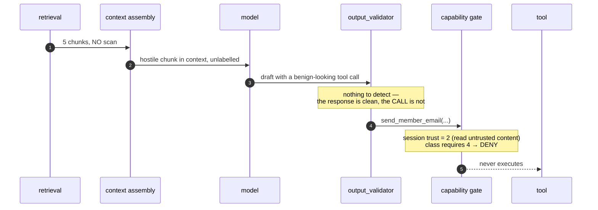

**The gate catches it and the detector never could.** Not because the gate is a better detector — it detects nothing — but because the question it asks has an answer that does not depend on recognising the payload.

---

## 2. The same payload, four paths

One attack class, four routes, four different outcomes. This is the measurement in §3.3 of the HLD drawn as four sequences.

| Path | Share of mix | Full-stack catch | Why |
|---|---|---|---|
| `direct` | 16.0% | **99.2%** | four rails positioned on it |
| `retrieved` | 53.0% | **84.8%** | retrieval rail + output validator only |
| `tool_output` | 17.0% | **71.8%** | same two, and the payload arrives later |
| `uploaded_doc` | 14.0% | **66.1%** | same two, and the upload may not be scanned at all |

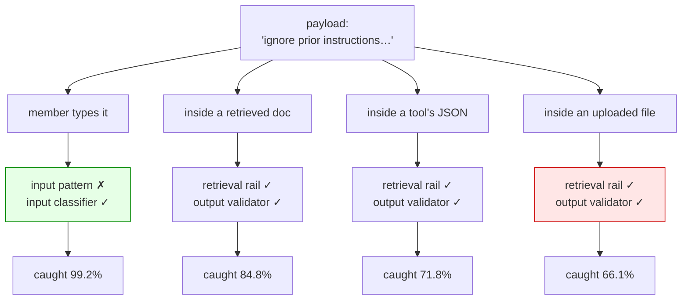

**Read the diagram downwards, not across.** The mechanism is identical in all four columns. Only the *positioning* differs. A rail cannot be evaluated without knowing which column the traffic is in.

---

## 3. The tool call — the gate decides, and the audit event is written

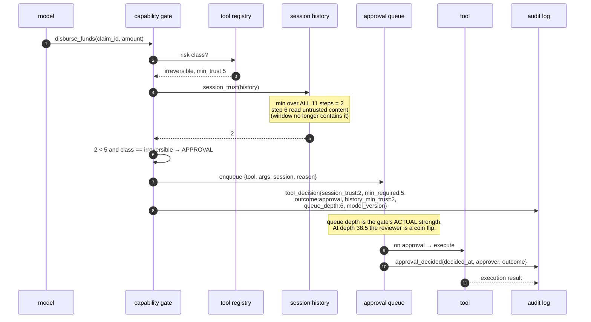

### 3.1 The same call, gated on the window instead

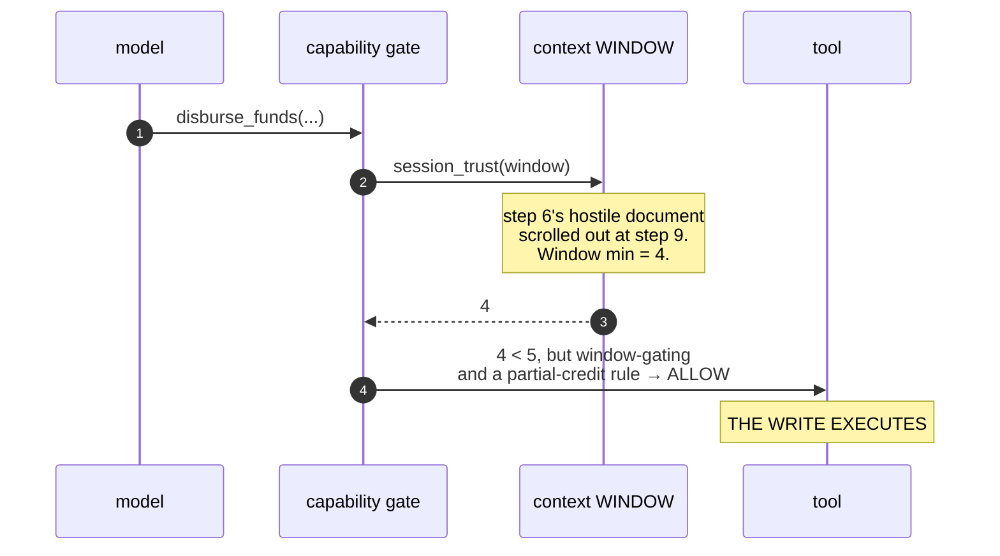

**Two lines of code apart, and the second one executes.** The LLD states `session_trust` as `min(history)` precisely because this is a one-line bug that integration tests pass by accident.

### 3.2 `write_low` while dirty — dry-run, not deny

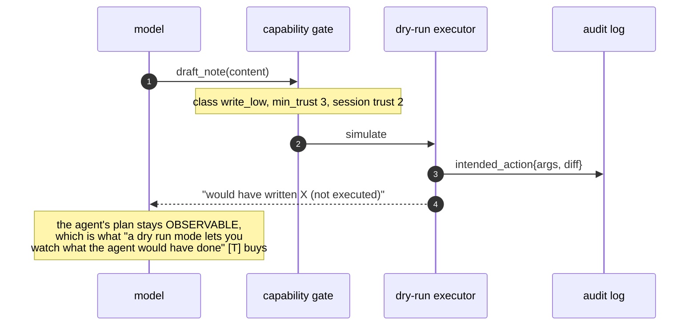

**Deny would have produced the same safety and destroyed the evidence.** Dry-run is why the gate is deployable on day one without blocking work.

---

## 4. The trust tag's journey — eight hops, and what fail-open does at the end

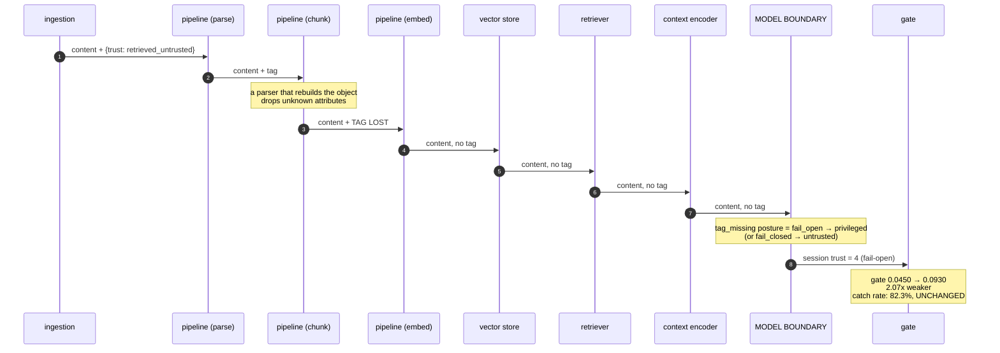

### 4.1 The two postures, side by side

| Posture | Tag survival @3 hops, 3% loss | Privileged untrusted content | Legitimate content restricted | Gate failure |
|---|---|---|---|---|
| **fail-open** | 91.3% | **8.7%** | 0.0% | **0.0930** |
| **fail-closed** | 91.3% | **0.0%** | 7.9% | 0.0450 |

**The detection metrics are byte-identical across the two rows.** The only signal that distinguishes them is a per-hop tag-loss metric, and the only place it can be measured is at the boundary — because by then the tag is already gone.

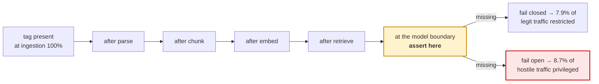

---

## 5. The false-refusal optimum — two businesses, one detector, opposite answers

The same cheap filter (AUC 0.802) on the same traffic, with two cost structures.

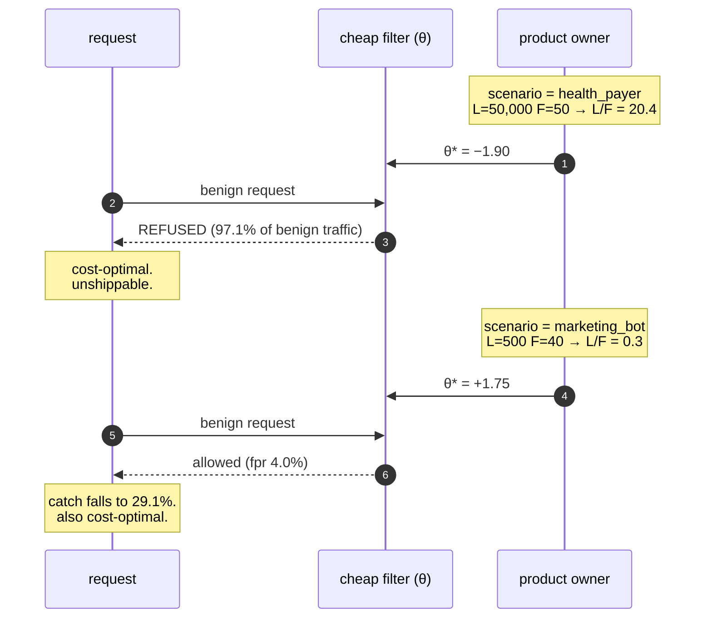

| | health_payer | marketing_bot |
|---|---|---|
| L/F | 20.4 | 0.3 |
| θ* | −1.90 | +1.75 |
| catch | 99.9% | 29.1% |
| **fpr** | **97.1%** | **4.0%** |
| allow-all cost | 1000.00 | **10.00** |
| block-all cost | **49.00** | **39.20** |
| block-all worse? | **False** (20x saving) | **True** (3.9x worse) |

**The optimum moves by 3.6 standard deviations between the two, and the two disagree about which endpoint is safe.** The corpus's *"a system that blocks everything is safe and useless"* [T] is correct for one row of this table and wrong by 20x for the other.

### 5.1 Why one threshold is the wrong architecture

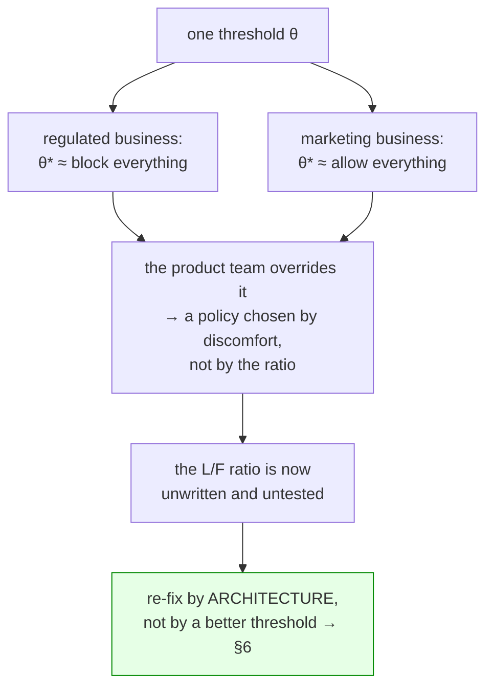

### 5.2 The segment skew inside a single global rate

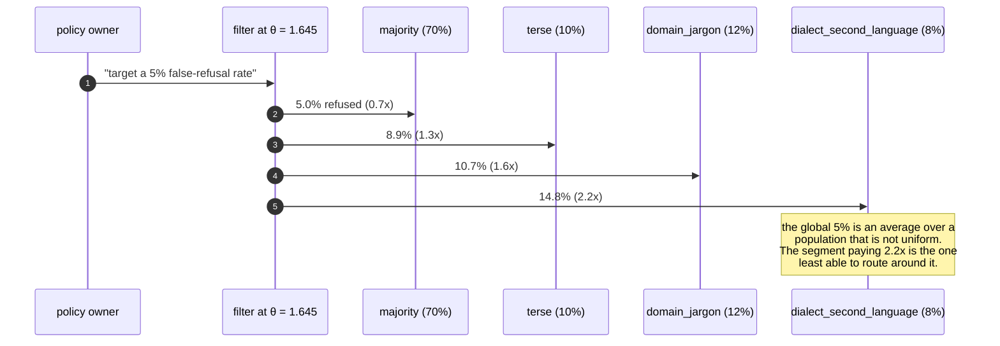

---

## 6. The cascade — 2.4% of traffic reaches the expensive detector

The architectural fix for §5.1, at an identical 2% false-refusal budget on the health payer.

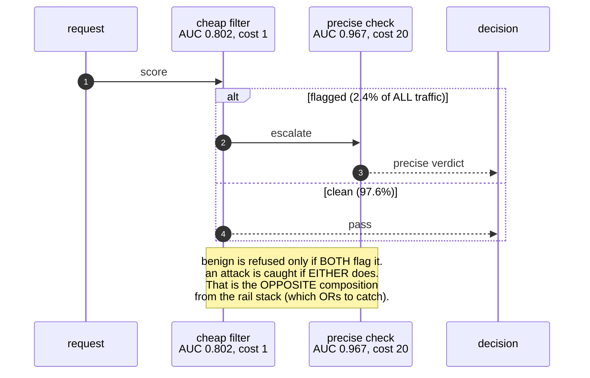

| Architecture | catch @ fpr 2% | detector cost | total |
|---|---|---|---|
| single cheap filter | 19.662% | 1.0 | 805.36 |
| precise detector alone | **70.755%** | 20.0 | 313.43 |
| **cascade** | **99.996%** | **1.5** | **2.39** |

**Two things to carry out of this diagram.** First, the cascade composes the detectors' *errors* — the same layering move the rail stack makes — while paying the expensive component on 2.4% of traffic. Second, **paying 20x for a better detector is not a substitute for putting it in the right place:** 70.755% against 99.996% at the same budget.

---

## 7. Red team on a schedule — the sawtooth and the trough

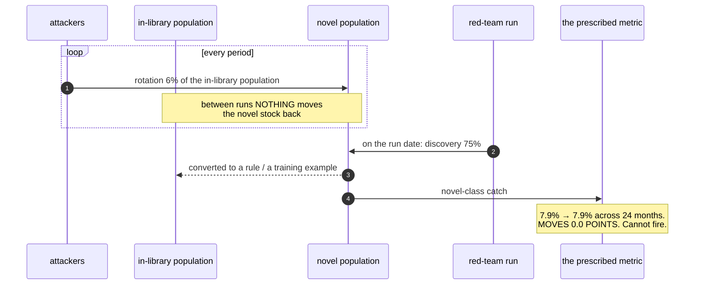

| Cadence | Mean | **Trough** | Sev mean | Sev trough | Exposure |
|---|---|---|---|---|---|
| continuous | 96.7% | **93.4%** | 95.9% | 91.4% | 0.0% |
| quarterly | 87.5% | 73.6% | 83.7% | 66.7% | 9.2% |
| semi-annual | 77.0% | 62.5% | 71.0% | 54.5% | 19.6% |
| annual | 63.1% | **45.5%** | 55.7% | 38.0% | 33.6% |
| never | 45.4% | **24.7%** | 38.8% | 20.3% | **51.2%** |

### 7.1 Solving for the schedule instead of choosing it

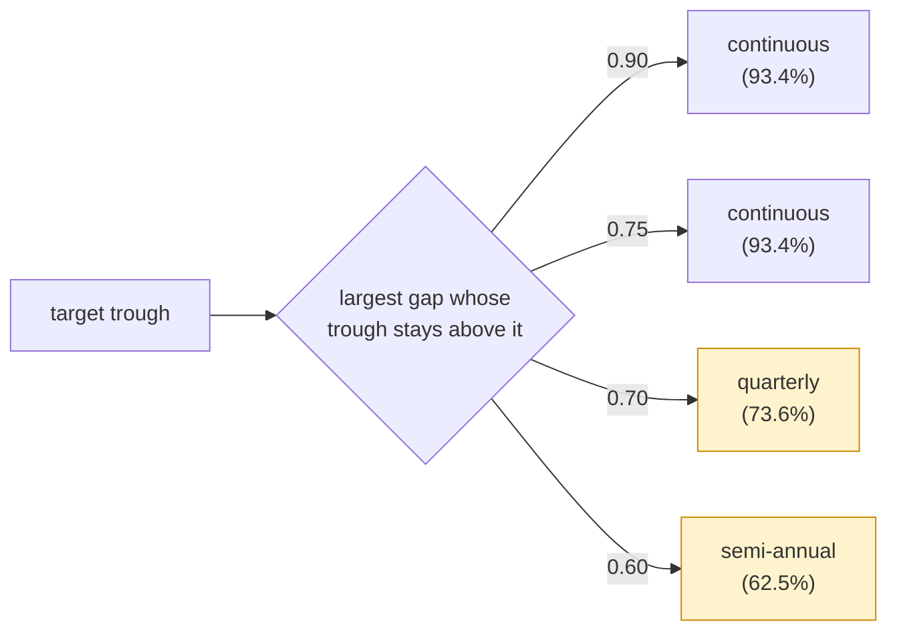

### 7.2 Where this run disagrees with the rest of the knowledge base

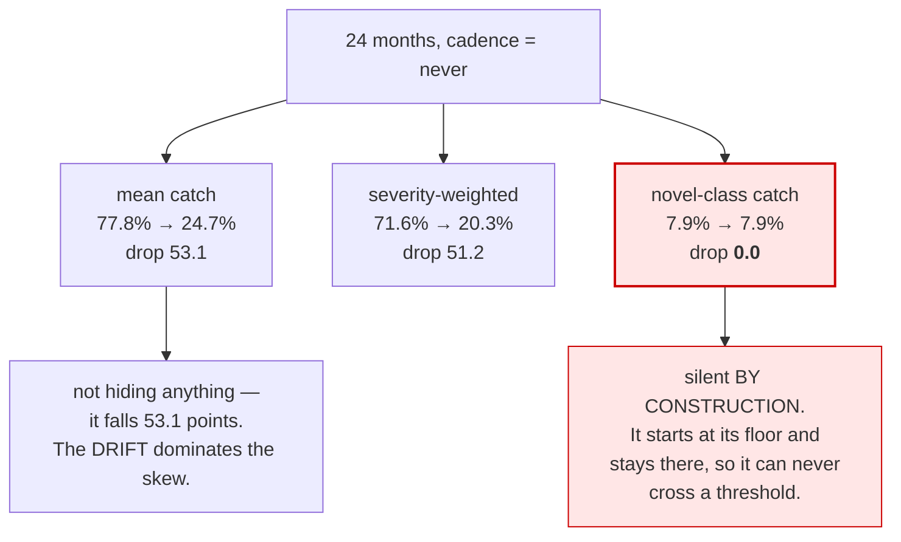

The average-hides-the-tail signature that T08, T09, T10 and T17 each reproduce **does not reproduce here**, and the run says so rather than manufacturing a fifth instance. The severity gap *narrows* (6.3% → 4.4%). What replaces it is a different failure: **the instrument aimed at the population that is entirely severity-5 is provably incapable of firing.** Alert instead on the count of injection *attempts* by source — a metric that measures the adversary rather than the classifier.

**And the mean's 53.1-point fall is a level, not a rate.** A red-team result reported without the date it was measured is the same class of error.

---

## 8. The approval queue — saturation, and the metric that says so

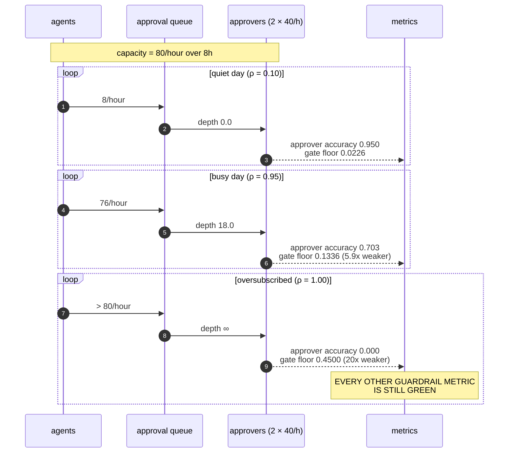

| Queue depth | Approver accuracy | Gate failure |
|---|---|---|
| 0 | 0.950 | 0.0225 |
| 5 | 0.874 | 0.0567 |
| 20 | 0.681 | 0.1437 |
| **38.5** | **0.500** | — the analytic break-even |
| 60 | 0.349 | 0.2927 |
| 400 | 0.001 | **0.4495** |

### 8.1 The scaling wall, and the only exit

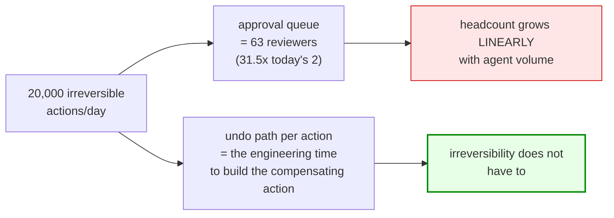

| Demand/day | Approvers needed | × today |
|---|---|---|
| 200 | 1 | 0.5x |
| 1,000 | 4 | 2.0x |
| 5,000 | 16 | 8.0x |
| **20,000** | **63** | **31.5x** |

**The metric that says the control stopped being real is the approval RATE, not the request rate.** A rising approval rate against a stable request rate means reviewers have stopped reading — and no detection metric, no coverage number and no configuration diff will show it.

---

## 9. The three silent failures, in one diagram

The through-line of this topic: **three of the six experiments end in the same place.**

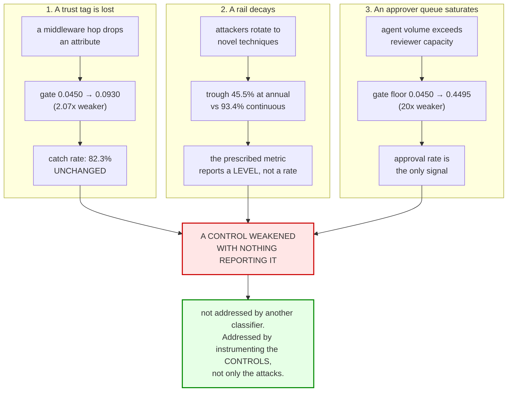

| Control | How it weakens | What reports it |
|---|---|---|
| trust tag | a hop drops an attribute | **nothing** — every detection metric is flat |
| red-team rail | attackers rotate to novel techniques | **nothing** — the novel reading cannot fire |
| human approval | the queue deepens | **only the approval rate**, which nobody watches |

---

## Sources

| File under `refs/` | Used for |
|---|---|
| `LLMOps_Agentic_AIOps_The_Hands-On_Playlist_2026_transcripts/LLM_Guardrails_Stop_Injection_Leaks_Hallucination_NeMo_Guardrails.txt` | the rail positions and the hostile-request walkthrough (§1); the tool-call rail recipe (allowlist, schema, approval, dry run, audit) driving §3; "the biggest blast radius"; "a system that blocks everything is safe and useless" (§5); "a rail you tested in March may be bypassed by June" (§7); "red teaming has to be a recurring schedule, not a launch checkbox"; the metric list behind §7.2 and §8.1 |
| `LLMOps_Agentic_AIOps_The_Hands-On_Playlist_2026_transcripts_2/MCP_vs_A2A_How_AI_Agents_Connect_and_How_to_Govern_Them.txt` | "who is allowed to do what on whose behalf" and the access-policy gateway (§3); the gated-tool-call share metric (§8.1) |
| `Agentic_AI_Infra_transcripts_3/Gosia_Steinder_-_Beyond_Harnesses_Platform_Solutions_for_Agent_Reliability_Secur.txt` | the lack of instruction/data separation in the context as the source of novel agent threats (§1, §2); why zero-trust's a-priori interaction patterns do not hold for agents; the interception layer as a uniform enforcement point (§3) |
| `CMU_Inference_Algorithms_for_Language_Modeling_Fall_2025_transcripts/CMU_LLM_Inference_10_Incorporating_Tools.txt` | the sandboxing ladder; the prompt-injection example behind §2; the JSON-escaping failure that makes the schema a security control |
| `vLLM_Inference_Meetup_Bengaluru_2026_transcripts/The_Token_Raj_Rethinking_the_AI_Inference_Stack.txt` | the model opening a network connection on load; attestation and the "is the model I am running the model I evaluated" question (§4) |
| `ai-system-design-guide-main/ai-system-design-guide-main/12-security-and-access/01-llm-security.md` | **"the trust level is data, not metadata"** (§4); the five-layer IPI defence and **"capability gating is the most underused defense"** (§3); the arms-race timeline behind §7.2; insecure output handling (§6) |
| `ai-system-design-guide-main/ai-system-design-guide-main/13-reliability-and-safety/01-guardrails.md` | action safety with risk classification (§3); structured-output validation with retry ceilings (§6); the guardrail metric list in §7.2 and §8.1 |

Related: [HLD](../HLD.md) · [LLD](../LLD.md) · [Production](../production/README.md) · [Runnable core](../run.py)
