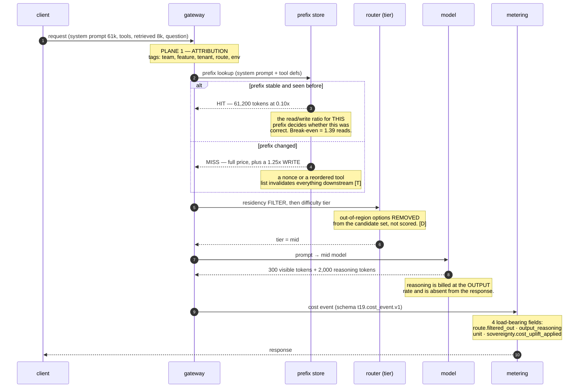
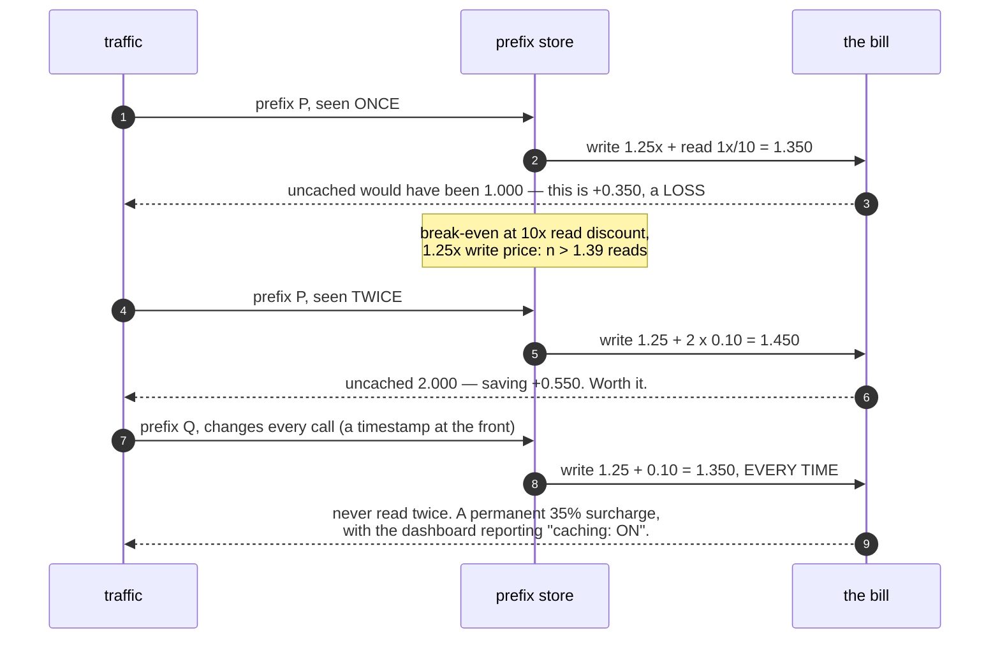
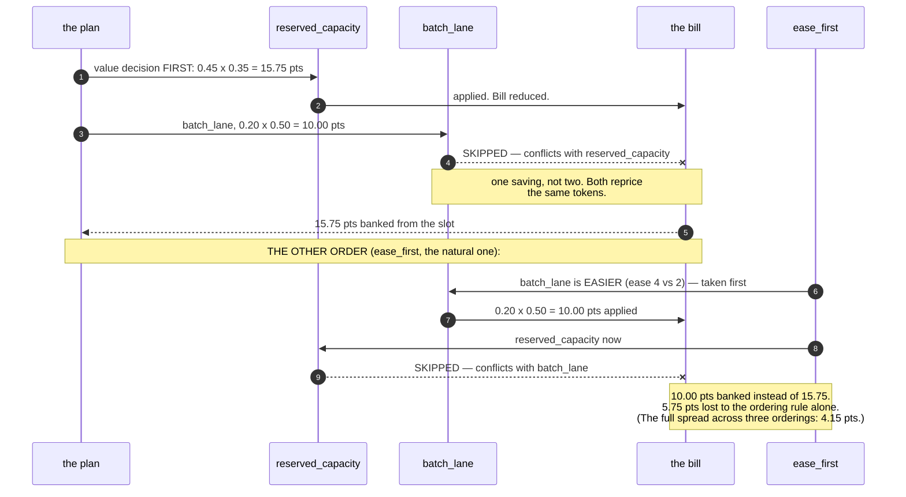
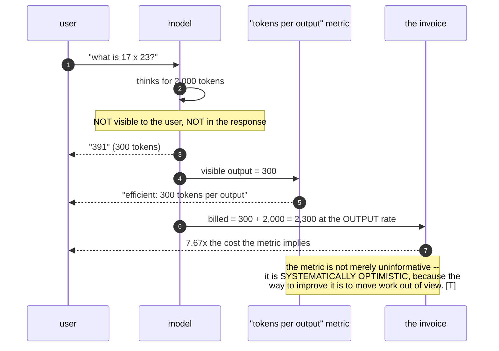
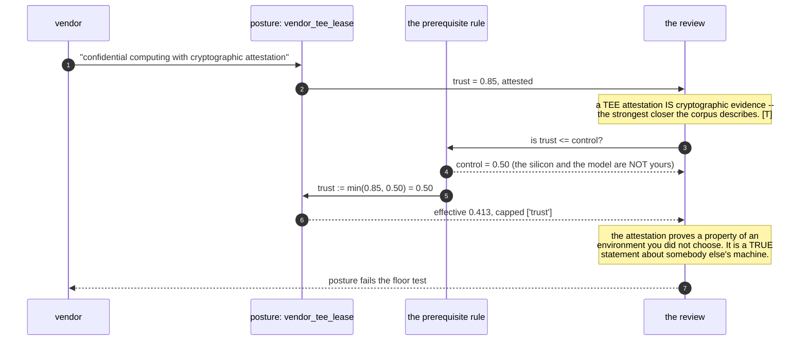
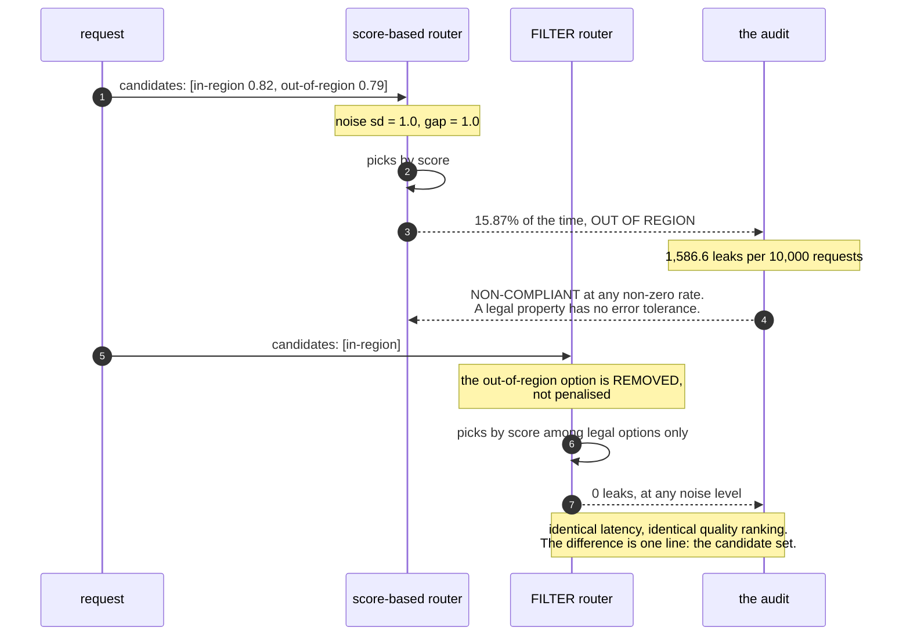
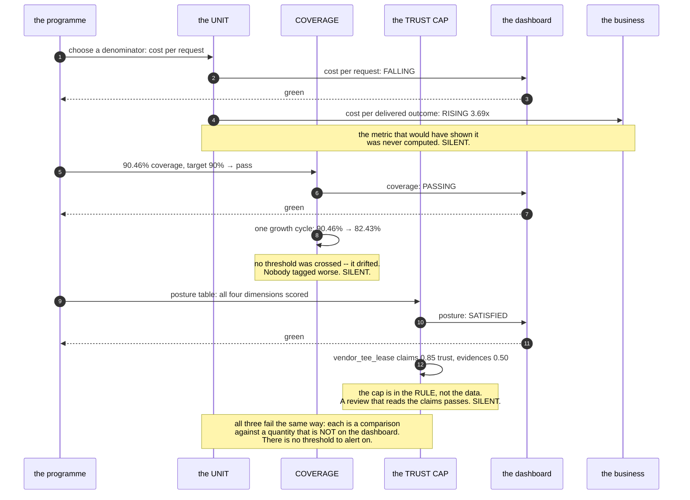

# T19 — FinOps, Token Economics & Sovereignty: sequence diagrams

> `T19` · **Transcript coverage:** primary · [HLD](../HLD.md) · [LLD](../LLD.md) · [Runnable core](../run.py) · [Production](../production/README.md) · [Case study](../../../01-case-studies/T19-finops-sovereignty.md)

Twelve sequences, one per decision in the design. Each is drawn so that the **failure is visible in the diagram rather than described after it** — which is the point, because three of this topic's measurements degrade without any metric reporting it.

---

## 1. One request through all four planes

The corpus's cost ladder applied to a single call, with the number each step actually contributes.



| Step | Reads | Banked | Note |
|---|---|---|---|
| prefix HIT | 61,200 tokens at 0.10× | **23.2%** of the bill at a 90% hit share | capped at **26.7%** by the asymptote |
| prefix MISS | full price + 1.25× write | **−0.35 units** | the only step here that can raise the bill |
| residency filter | removes options | 0 | no error tolerance, so not a score |
| reasoning tokens | 2,300 billed for 300 visible | — | **7.67×** amplification |

**The diagram's point:** four of the five cost decisions on this path are made *before* the model runs, and the fifth (reasoning) is invisible in the response. A cost dashboard built from model outputs alone sees one of them.

---

## 2. The discount curve, and the number that ends it

Why a better cache discount stops helping, drawn as a sequence of discounts rather than a table.

```mermaid
sequenceDiagram
    autonumber
    participant D as discount
    participant L as prefix line
    participant B as the bill

    D->>L: 2x
    L->>B: line 0.8600 → 0.5500 ; banked 11.2%
    D->>L: 5x
    L->>B: line 0.7760 → 0.2800 ; banked 19.8%
    D->>L: 10x  (the corpus's figure [T])
    L->>B: line 0.7480 → 0.1900 ; banked 23.2%
    D->>L: 50x
    L->>B: line 0.7256 → 0.1180 ; banked 26.0%
    D->>L: 100x
    L->>B: line 0.7228 → 0.1090 ; banked 26.4%
    D->>L: infinite (a FREE cache read)
    Note over L: line 0.7200 → 0.1000
    L->>B: banked 26.7%   <-- THE ASYMPTOTE
    B-->>D: "you cannot do better than this, at any price"

    Note over D,B: the uncached 10% of calls still pays full price,<br/>and nothing outside the prefix is touched at all.
```

**The diagram's point:** the return on the caching lever flattens by 10× and is finished by 50×. A business case that assumes a "better caching tier" will deliver more is assuming past the asymptote — and the asymptote is **26.7%**, which is 31.05% of bill times the 86.1% best-case line reduction.

---

## 3. The write premium — the only step that can be negative



**The diagram's point:** caching is not a switch, it is a per-prefix decision with a measurable break-even. The operating rule that falls out is **enable per prefix, alert when the read/write ratio falls below 2**. A global switch cannot express that rule, which is why the prefix store must report per-prefix reads (HLD §7).

---

## 4. The lever ladder — claim order against banked order

```mermaid
sequenceDiagram
    autonumber
    participant C as the CORPUS's claim
    participant A as achievable()
    participant B as the bill

    C->>A: distillation: 40x
    A->>B: 0.15 of model_tier (20%) x 0.80 = 2.4%
    Note over A,B: #1 by claim, #8 by banked

    C->>A: reasoning_gating: 15x
    A->>B: 1.00 of reasoning_tokens (15%) x 0.60 = 9.0%
    Note over A,B: #2 by claim, #4 by banked

    C->>A: prompt_caching: 10x
    A->>B: 1.00 of system_prompt (31.05%) x 0.746 = 23.2%
    Note over A,B: #3 by claim, #1 by banked

    C->>A: batch_lane: ~50%
    A->>B: 1.00 of the whole bill x 0.20 x 0.50 = 10.0%
    Note over A,B: #7 by claim, #3 by banked

    Note over C,B: EIGHT OF TEN LEVERS MOVE POSITION.<br/>The ladder is a list of DISCOUNTS;<br/>a programme banks discount x share_of_bill.
```

**The diagram's point:** two orderings derived from one source disagree, and the disagreement is the finding. The corpus's ladder is not wrong — it is a list of prices, and the plan that follows from it starts somewhere other than the top of the list.

---

## 5. The pricing slot — one lever, and the conflict that pays for it



**The diagram's point:** there is exactly **one** pricing slot per traffic slice, and both orderings are defensible readings of the same instruction. The difference is not effort or risk — it is which lever got there first, which is a decision, not a default.

---

## 6. The unit — two rows, three signs

```mermaid
sequenceDiagram
    autonumber
    participant F as Feb
    participant A as Apr
    participant U as the unit
    participant B as the business

    F->>A: cost 0.30c → 0.16c ; lines 630 → 91 ; files 8.2 → 3.6
    A->>U: per ARTIFACT
    U->>B: 0.5333 = -46.7%  "the price halved"
    A->>U: per FILE
    U->>B: 1.2148 = +21.5%  "each change costs more"
    A->>U: per LINE of delivered work
    U->>B: 3.6923 = +269.2%  "the work costs nearly four times as much"
    Note over U,B: SAME TWO ROWS. THREE SIGNS.<br/>The deliverable shrank faster than the price<br/>(lines to 14.4% of Feb, cost to 53.3%).

    B-->>U: which one was the programme measured on?
    Note over U: whichever denominator the person<br/>who built the dashboard chose. [D]
```

**The diagram's point:** the unit is chosen before the arithmetic and decides its sign. The design answer is the **unit memo** (HLD §6): the denominator, its owner, and the companion metric, signed before work starts.

---

## 7. The workload mix — the average that is the wrong basis for an order

```mermaid
sequenceDiagram
    autonumber
    participant M as the mix
    participant AV as the average
    participant T as the tail
    participant B as the bill (next year)

    M->>AV: 1,000,000 calls, mean cost 0.004194
    Note over AV: "the average call is cheap"
    M->>T: the agentic population: 10,000 calls at 0.1224
    T->>AV: that is 29.2x the mean, 1.0% of volume, 29.2% of the bill
    Note over AV,T: an order derived from the MEAN optimises<br/>a population that is 1% of the traffic

    M->>T: grow the tail 4.3x (the scenario's own rate [D])
    T->>B: chat 70.8% → 36.1% ; agentic 29.2% → 63.9%
    B-->>AV: the tail is now the majority of the bill
    Note over AV,B: and the lever that fails on the long tail<br/>(distillation) is now the lever whose<br/>failure is most expensive.
```

**The diagram's point:** the average is not wrong, it is answering a different question — *what does a typical call cost* rather than *where is the money*. Both are legitimate; only one is a basis for an optimisation order.

---

## 8. The reasoning-token asymmetry



**The diagram's point:** the corpus's instruction to stop using `tokens per output` **[T]** has a mechanical reason, and it is visible only when the invoice and the metric are drawn side by side. The remedy is a bill layer with its own lever (`reasoning_gating`, worth 9.0%) and a quality eval on the tasks gated **off**.

---

## 9. Sovereignty — the prerequisite cap, and the posture that hides it



**The diagram's point:** the attestation is not false — it is **about the wrong machine**. The prerequisite rule is the only thing that catches this, and it must be data (LLD §2.4) so that a reviewer can see the rule rather than trust the function.

---

## 10. Residency — a filter and a score, side by side



**The diagram's point:** the fix is not a better score, a wider gap, or a lower noise — it is **the candidate set**. A score-based implementation has a parameter for tolerance; a filter does not, and that absence is the design.

---

## 11. Continuity — the mean and the floor

```mermaid
sequenceDiagram
    autonumber
    participant A as architect
    participant L as the four layers
    participant MEAN as the reporting
    participant REV as the review

    A->>L: 2 accelerators, 3 model families, 2 engines, 1 cloud region
    L->>MEAN: 3 of 4 layers covered → mean 0.75
    MEAN-->>A: "good continuity posture"
    L->>REV: floor = 0 (cloud_region has ONE option)
    REV-->>A: SINGLE-VENDOR. A regulator or a vendor<br/>gets to choose the layer that fails.
    Note over A,REV: the mean is what a slide shows;<br/>the floor is what an adversary gets to choose.

    A->>L: alternative: 1 accelerator, 4 families, 2 engines, 3 regions
    L->>MEAN: same mean 0.75
    L->>REV: floor = 0, binding layer = ACCELERATOR
    Note over REV: same reading, different binding layer.<br/>Which one is fixable? The engine, not the silicon.<br/>Accelerator choice is fixed EARLIEST. [T]
```

**The diagram's point:** the floor names the binding layer, and the binding layer decides the cost of the fix. Three of the four examples here score a mean of 0.75 and a floor of zero.

---

## 12. Three silent failures, in one diagram

The three measurements in this topic that degrade without any metric reporting it.



**The diagram's point:** these are not three bugs. They are one design property — **a measurement whose reference value lives outside the system it measures** — appearing in the unit, the coverage figure and the posture table. Each has the same remedy shape: compute the companion quantity (the per-outcome cost, the growth rate, the prerequisite) and put it *beside* the number rather than replacing it.

---

## Sources

| File under `refs/` | Used for |
|---|---|
| `LLMOps_Agentic_AIOps_The_Hands-On_Playlist_2026_transcripts/Cut_LLM_Cost_Latency_KV_Cache_Batching_Quantization_vLLM.txt` | the ladder and its ordering instruction; "exhaust the free wins"; "roughly a tenth of the cost"; cache reads ~10× cheaper; the stable-prefix caveat; "optimization without measurement is just guessing" |
| `vLLM_Inference_Meetup_Bengaluru_2026_transcripts/The_Token_Raj_Rethinking_the_AI_Inference_Stack.txt` | the Feb→Apr artifact study; "tokens per output" as the metric to stop using; attestation; the three-way trust problem |
| `vLLM_Inference_Meetup_Bengaluru_2026_transcripts/Sovereign_AI_Inference_Own_Your_AI._Control_Your_Data.txt` | the four dimensions; the system-property framing; the TEE trade-off; accelerator choice as implementation strategy |
| `Agentic_AI_Infra_transcripts_2/Saurabh_Tiwary_-_From_Models_to_Agents_to_Discovery_Building_the_Full_Stack_of_A.txt` | the 10–100× agentic compute multiplier behind the tail population in sequences 7 and 9 |
| `ai-system-design-guide-main/ai-system-design-guide-main/11-infrastructure-and-mlops/04-finops-and-token-economics.md` | the eight-layer decomposition; the 69%/28% anchor; provider caching discount ranges; batch and provisioned pricing; the attribution-before-everything rule |
| `ai-system-design-guide-main/ai-system-design-guide-main/04-inference-optimization/07-cost-optimization-playbook.md` | cascade tiering; distillation's long-tail failure; the reasoning multiplier range |

Related blueprints: [T14 routing & gateways](../../T14-routing-gateways/HLD.md) ·
[T15 autoscaling & SLO](../../T15-autoscaling-slo/HLD.md) · [T17 observability & evals](../../T17-observability-evals/HLD.md) ·
[T18 guardrails & security](../../T18-guardrails-security/HLD.md)
