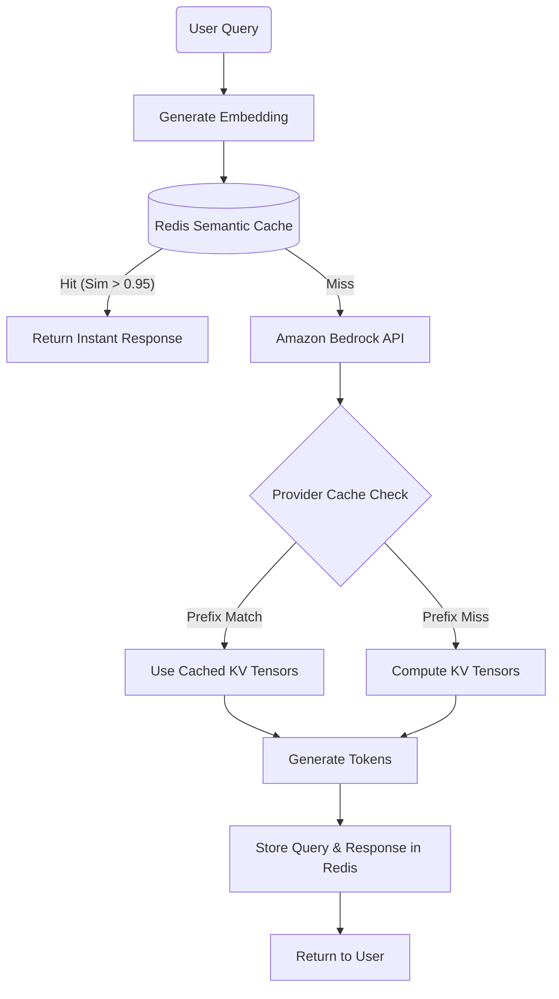

# 🧠 Prompt Caching & Semantic Caching Tradeoffs (Deep Dive)

## 1. The Physics and Economics of AI Inference Caching

In production Generative AI systems, the Time To First Token (TTFT) and API costs are the primary bottlenecks. Caching is the definitive mechanism for optimizing both.

### The Problem: Autoregressive Bottlenecks
When you send a prompt of 10,000 tokens to an LLM, the model must process all 10,000 tokens through its attention mechanism to compute the Key-Value (KV) tensors *before* it can generate token 10,001. This is known as the **Prefill Phase**. 
- The Prefill phase is compute-heavy.
- Repeating the Prefill phase for static text (like an un-changing 100-page corporate manual) across thousands of user queries burns millions of GPU cycles unnecessarily.

To solve this, we use two fundamentally different caching strategies: **Provider-Level Prompt Caching** and **Application-Level Semantic Caching**.

---

## 2. Provider-Level Prompt Caching (Exact Prefix Match)

Provider-level caching stores the actual KV cache state of a prompt prefix directly on the LLM provider's GPUs (e.g., Anthropic, Amazon Bedrock).

### Core Mechanics
- The LLM processes a designated block of text (the prefix) once.
- The resulting KV tensors are kept in the provider's VRAM.
- When a new request arrives with the **exact byte-for-byte matching prefix**, the LLM skips the Prefill phase for those tokens entirely.

### Implementation in AWS Bedrock / Anthropic (Boto3)
In Anthropic's Claude 3.5 Sonnet on Bedrock, you explicitly define which blocks of text should be cached by adding a `cache_control` object.

```python
import boto3
import json

bedrock_runtime = boto3.client('bedrock-runtime', region_name='us-west-2')

system_prompt = "You are an expert legal assistant. Here is the 500-page contract: [MASSIVE TEXT...]"

# The cache_control dictionary tells the provider to keep this block's KV tensors
system_block = {
    "type": "text", 
    "text": system_prompt,
    "cache_control": {"type": "ephemeral"}
}

body = {
    "anthropic_version": "bedrock-2023-05-31",
    "max_tokens": 1000,
    "system": [system_block],
    "messages": [
        {"role": "user", "content": "What is the liability clause in section 4?"}
    ]
}

response = bedrock_runtime.invoke_model(
    modelId="us.anthropic.claude-3-5-sonnet-20241022-v2:0",
    body=json.dumps(body)
)
```

### Advanced Considerations
- **Cost Structure:** Cached tokens are billed at a massive discount (e.g., 10% of the cost of standard input tokens).
- **TTL (Time To Live):** The cache is typically ephemeral. If the prefix isn't queried again within 5 minutes, it is evicted from VRAM to free up space.
- **Position Dependency:** Prompt caching is strictly order-dependent. If you have `[Doc A] + [Doc B]`, and later send `[Doc B] + [Doc A]`, the cache will MISS entirely because the positional encodings of the tokens have changed.

---

## 3. Application-Level Semantic Caching

Semantic caching operates entirely outside the LLM provider, sitting at the application/API layer. It uses dense vector embeddings to intercept queries *before* they reach the LLM.

### Core Mechanics
1. User asks: *"How to reset my password?"*
2. App generates a cheap embedding vector (e.g., using `amazon.titan-embed-text-v2`).
3. App queries a Vector Database (Redis, pgvector, Pinecone).
4. If a previously cached query (e.g., *"Password reset instructions"*) matches with Cosine Similarity > `0.95`, the cache returns the pre-generated LLM string.
5. **LLM API is bypassed entirely.**

### The Mathematics of Similarity
When retrieving a cache, we calculate the Cosine Similarity between vector $A$ (new query) and vector $B$ (cached query):
$$ \text{Cosine Similarity} = \frac{A \cdot B}{||A|| ||B||} $$
A score of `1.0` is an exact semantic match. A threshold of `0.95` or higher is typically required for caching to avoid hallucinations.

### Code Implementation: Redis Semantic Cache + LangChain

```python
from langchain_community.cache import RedisSemanticCache
from langchain_aws import BedrockEmbeddings
from langchain_core.globals import set_llm_cache
import redis

# Initialize Titan Embeddings
embeddings = BedrockEmbeddings(model_id="amazon.titan-embed-text-v2:0")

# Connect to Redis Cluster (Elasticache)
redis_url = "redis://my-elasticache-cluster:6379"

# Set global Langchain cache
set_llm_cache(RedisSemanticCache(
    redis_url=redis_url,
    embedding=embeddings,
    score_threshold=0.96  # CRITICAL: High threshold to prevent false positives
))

# Usage: 
# Call 1: "What are your banking hours?" -> Cache Miss, calls Bedrock, takes 3s, costs money.
# Call 2: "When does the bank open?" -> Cache Hit (Sim > 0.96), returns instantly, costs $0.
```

### Multi-Tenant Cache Invalidation (Edge Case)
If you build a SaaS application for multiple companies, Semantic Caching introduces a severe data leakage risk. If User A from Company X asks "What is our Q3 revenue?", and User B from Company Y asks "What is our Q3 revenue?", a naive cache will return Company X's revenue to Company Y.

**Solution:** You must namespace the semantic cache keys by `tenant_id` or apply pre-filtering in the vector search.

---

## 4. Deep Trade-off Matrix

| Metric | Provider Prompt Caching | Semantic Caching |
|--------|-------------------------|------------------|
| **Infrastructure** | Fully Managed (LLM Provider side) | Developer Managed (Redis / Vector DB) |
| **Match Mechanism** | Byte-for-byte exact prefix | Vector distance (Cosine, L2) |
| **LLM Call Status** | Performed (but Prefill is skipped) | Completely Intercepted (Bypassed) |
| **Latency Reduction** | Drops TTFT from ~15s to ~0.5s | Drops total latency from ~5s to ~30ms |
| **Cost Reduction** | ~80-90% discount on input tokens | 100% discount on both input AND output |
| **Data Leakage Risk** | Zero (Handled by Provider) | High (Requires rigorous tenant isolation) |
| **Best For...** | Books, Large Codebases, System Prompts | Tier-1 Support, FAQs, Static Data APIs |

---

## 5. Architectural Mermaid Diagram: The Hybrid Cache Pattern

In elite systems, both are used.



---

## 6. Exam & Interview Practice Questions

**Q1: A legal tech platform allows lawyers to upload 500-page contracts. The lawyer then asks a series of 20 distinct, highly nuanced questions about that specific contract in a single session. Which caching strategy will best optimize this workload?**
- A) Semantic Caching
- B) DynamoDB Key-Value Caching
- C) Provider-Level Prompt Caching
- D) Embedding the questions and caching the answers in OpenSearch
**Answer: C.** The questions are distinct, so Semantic Caching will fail (cache miss on every question). However, the 500-page contract (the prefix) remains exactly the same for all 20 questions. Provider-level prompt caching will cache the massive contract, drastically reducing input token costs and TTFT for questions 2 through 20.

**Q2: When implementing a Redis-based Semantic Cache for a multi-tenant B2B SaaS application, what is the most critical security configuration to implement?**
- A) Encrypting the Redis data at rest using AWS KMS.
- B) Setting a low cosine similarity threshold (e.g., 0.70) to catch more matches.
- C) Applying rigorous Tenant ID namespaces to the vector search to prevent cross-customer data leakage.
- D) Ensuring the cache TTL expires after 5 minutes.
**Answer: C.** If you do not isolate the vector space by Tenant ID, a generic question from Customer B will retrieve a cached answer generated from Customer A's proprietary data, resulting in a critical security breach.

**Q3: Which architectural change would completely invalidate an Anthropic Provider-Level Prompt Cache containing a 50k token system prompt and RAG context?**
- A) Changing the user's specific query appended at the very end of the prompt.
- B) Increasing the `max_tokens` generation parameter from 1000 to 2000.
- C) Reordering the retrieved RAG context documents inside the system prompt.
- D) Changing the temperature parameter from 0.0 to 0.7.
**Answer: C.** Provider prompt caching relies on exact byte-for-byte prefix matching and positional encodings. Reordering the documents changes the prefix entirely, resulting in a 100% cache miss. Changing the user query at the *end* (suffix) does not invalidate the prefix. Generation parameters (B, D) do not invalidate the input cache.
