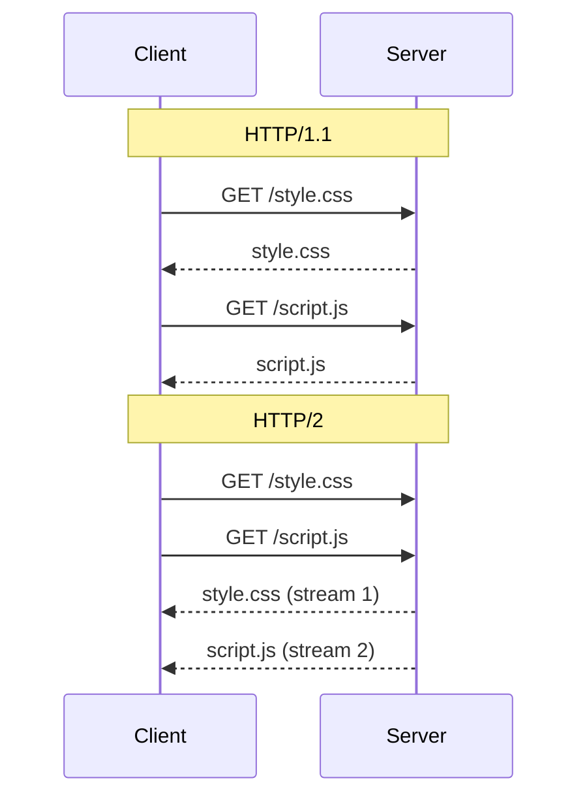

# Day 3: HTTP, REST & Web Basics

## 1. The Life of a Request

Before we build APIs, we must understand the protocol that powers the web: **HTTP (HyperText Transfer Protocol)**.

### 1.1 The Journey of a URL
When you type `https://api.example.com/users` into a browser or curl:
1.  **DNS Resolution**: The client asks a DNS server "What is the IP of `api.example.com`?"
2.  **TCP Handshake (SYN, SYN-ACK, ACK)**: The client establishes a TCP connection with the server IP on port 443.
3.  **TLS Handshake**: Keys are exchanged to encrypt the connection (HTTPS).
4.  **HTTP Request**: The client sends a text (or binary) message.
5.  **Processing**: The server parses the request, runs logic, queries DB.
6.  **HTTP Response**: The server sends back data + status code.
7.  **Connection Close** (or Keep-Alive).

---

## 2. HTTP Versions: Evolution of the Protocol

### 2.1 HTTP/1.1 (The Standard)
*   **Text-based**: You can read it with telnet.
*   **Keep-Alive**: Reuses TCP connections for multiple requests.
*   **Head-of-Line Blocking**: If request A takes 10 seconds, request B on the same connection must wait.
*   **Optimization**: Browsers open 6 parallel TCP connections per domain to mitigate blocking.

### 2.2 HTTP/2 (The Multiplexer)
*   **Binary Protocol**: Not human readable directly.
*   **Multiplexing**: Multiple requests/responses can be in flight *simultaneously* on a **single** TCP connection. No head-of-line blocking at the HTTP layer.
*   **Header Compression (HPACK)**: Saves bandwidth.
*   **Server Push**: Server can send CSS/JS before the client asks (rarely used now).



### 2.3 HTTP/3 (The UDP Revolution)
*   **QUIC Protocol**: Runs over UDP, not TCP.
*   **Solves TCP Head-of-Line Blocking**: In HTTP/2, if one TCP packet is lost, *all* streams wait. In HTTP/3, only the affected stream waits.
*   **Faster Handshake**: Combines TCP+TLS handshakes (0-RTT).
*   **Status**: Widely supported by Chrome/Cloudflare/Google, but backend support (e.g., Nginx/Node) is still maturing.

---

## 3. Anatomy of a Request & Response

### 3.1 The Request
```http
POST /users HTTP/1.1
Host: api.example.com
Authorization: Bearer abc123token
Content-Type: application/json
Accept: application/json

{
  "username": "alice"
}
```
*   **Method**: `POST` (The action).
*   **Path**: `/users` (The resource).
*   **Headers**: Metadata (Auth, format).
*   **Body**: The data payload.

### 3.2 The Response
```http
HTTP/1.1 201 Created
Date: Mon, 27 Nov 2025 12:00:00 GMT
Content-Type: application/json
Content-Length: 45

{
  "id": 101,
  "username": "alice"
}
```
*   **Status Line**: `201 Created`.
*   **Headers**: Metadata.
*   **Body**: The result.

---

## 4. HTTP Methods & Semantics

### 4.1 The Verbs
| Method | Meaning | Idempotent? | Safe? | Use Case |
| :--- | :--- | :--- | :--- | :--- |
| **GET** | Retrieve data | Yes | Yes | Read a user profile. |
| **POST** | Create data | **No** | No | Create a new order. |
| **PUT** | Replace data | Yes | No | Update *entire* user profile. |
| **PATCH** | Partial update | No* | No | Update just an email address. |
| **DELETE** | Remove data | Yes | No | Delete a comment. |

*   **Safe**: Does not modify server state (Read-only).
*   **Idempotent**: Making the request 10 times is the same as making it once.
    *   `DELETE /users/1` is idempotent. The first time it deletes. The next 9 times it returns 404 (or 200), but the state (user is gone) is the same.
    *   `POST /users` is NOT idempotent. It creates 10 users.

### 4.2 Status Codes (The Language of Success/Failure)
*   **2xx (Success)**
    *   `200 OK`: Standard success.
    *   `201 Created`: Resource created (usually returns `Location` header).
    *   `204 No Content`: Success, but body is empty (common for DELETE).
*   **3xx (Redirection)**
    *   `301 Moved Permanently`: SEO friendly redirect.
    *   `304 Not Modified`: Used for caching (ETags). "Client, your cached version is still good."
*   **4xx (Client Error)** - *You messed up.*
    *   `400 Bad Request`: Invalid JSON, missing fields.
    *   `401 Unauthorized`: Who are you? (Missing/Invalid Token).
    *   `403 Forbidden`: I know who you are, but you can't do this.
    *   `404 Not Found`: Resource doesn't exist.
    *   `429 Too Many Requests`: Rate limit hit.
*   **5xx (Server Error)** - *I messed up.*
    *   `500 Internal Server Error`: Uncaught exception.
    *   `502 Bad Gateway`: Upstream service (DB/Microservice) failed.
    *   `503 Service Unavailable`: Server is overloaded or maintenance.

---

## 5. REST (Representational State Transfer)

REST is not a protocol; it's an **architectural style** proposed by Roy Fielding (2000).

### 5.1 Key Principles
1.  **Client-Server**: Separation of concerns.
2.  **Stateless**: The server stores no session state between requests. Every request must contain all info (e.g., Auth Token) to process it.
3.  **Cacheable**: Responses must define if they can be cached.
4.  **Uniform Interface**:
    *   **Resource-Based**: `/users/123` not `/getUser?id=123`.
    *   **Standard Methods**: Use GET/POST/PUT/DELETE correctly.
    *   **HATEOAS** (Hypermedia As The Engine Of Application State): API returns links to next actions (rarely implemented fully in practice).

### 5.2 Resource Naming Best Practices
*   **Nouns, not Verbs**:
    *   ✅ `POST /orders` (Create an order)
    *   ❌ `POST /createOrder`
*   **Plural Nouns**:
    *   ✅ `/users`, `/products`
    *   ❌ `/user`, `/product`
*   **Hierarchy**:
    *   `/users/123/orders/456` (Order 456 belonging to User 123).
*   **Filtering/Sorting**:
    *   `GET /users?role=admin&sort=created_at`

---

## 6. Summary

Today we looked under the hood of the web.
*   **HTTP/1.1 vs 2 vs 3**: The shift from text to binary to UDP.
*   **Methods**: Why `POST` vs `PUT` matters (idempotency).
*   **Status Codes**: The difference between 401 and 403.
*   **REST**: Designing APIs around *Resources*, not *Actions*.

**Tomorrow (Day 4)**: We will take these REST principles and apply them to design a robust API. We'll discuss error modeling, JSON standards, and how to handle relationships properly.
