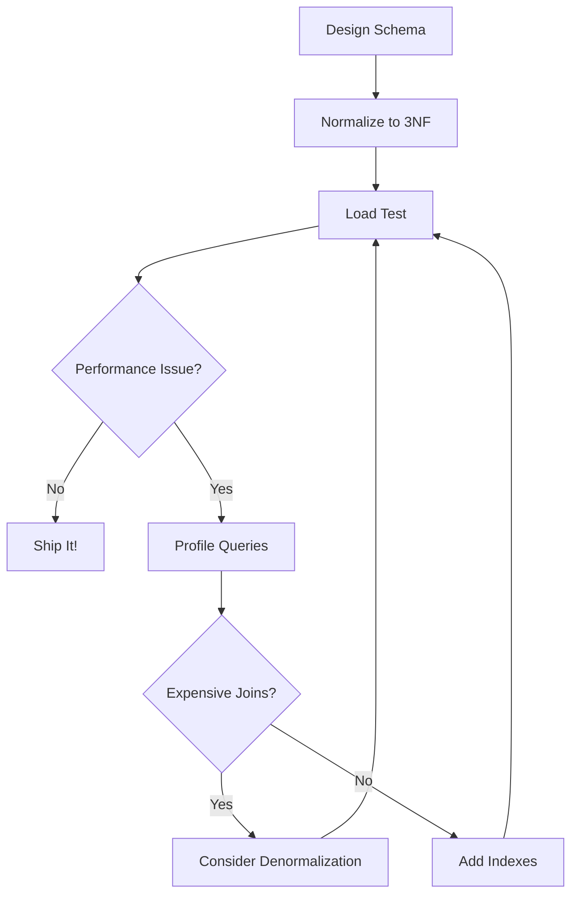

# Day 7: Normalization, Indexes & Database Design - Structuring Data for Scale

## Table of Contents
1. [Normalization Theory](#1-normalization-theory)
2. [Normal Forms Deep Dive](#2-normal-forms-deep-dive)
3. [Denormalization Trade-offs](#3-denormalization-trade-offs)
4. [Index Types & Strategies](#4-index-types--strategies)
5. [Index Optimization](#5-index-optimization)
6. [Database Design Patterns](#6-database-design-patterns)
7. [Schema Migration Strategies](#7-schema-migration-strategies)
8. [Performance Monitoring](#8-performance-monitoring)
9. [Best Practices](#9-best-practices)
10. [Summary](#10-summary)

---

## 1. Normalization Theory

### 1.1 Why Normalize?

**Goals of Normalization**:
1. **Eliminate Redundant Data**: Don't store same data multiple places
2. **Ensure Data Integrity**: Updates happen in one place
3. **Minimize Anomalies**: Prevent insert/update/delete anomalies

**Denormalized Example (Bad)**:
```
orders table:
id | customer_name | customer_email | customer_city | product_name | product_price
1  | Alice         | alice@ex.com   | NYC           | Laptop       | 1000
2  | Alice         | alice@ex.com   | NYC           | Mouse        | 20
```

**Problems**:
- Alice's email stored twice (redundancy)
- Update Alice's email → must update multiple rows (update anomaly)
- Delete all Alice's orders → lose customer info (delete anomaly)

**Normalized (Good)**:
```
customers:
id | name  | email        | city
1  | Alice | alice@ex.com | NYC

products:
id | name   | price
1  | Laptop | 1000
2  | Mouse  | 20

orders:
id | customer_id | product_id | quantity
1  | 1           | 1          | 1
2  | 1           | 2          | 1
```

---

## 2. Normal Forms Deep Dive

### 2.1 First Normal Form (1NF)

**Rule 1**: Each column contains atomic values (no arrays, no nested structures).

**Not 1NF**:
```sql
CREATE TABLE users (
    id INT,
    emails VARCHAR(500)  -- Storing "alice@ex.com,bob@ex.com"
);
```

**1NF Compliant**:
```sql
CREATE TABLE users (
    id INT PRIMARY KEY,
    email VARCHAR(255)
);
INSERT INTO users VALUES (1, 'alice@ex.com');
INSERT INTO users VALUES (1, 'bob@ex.com');  -- Multiple rows for multiple emails
```

**Rule 2**: Each row must be unique (primary key exists).

### 2.2 Second Normal Form (2NF)

**Rule**: Must be 1NF + No partial dependencies on composite keys.

**Composite Key Example (Not 2NF)**:
```sql
CREATE TABLE order_items (
    order_id INT,
    product_id INT,
    product_name VARCHAR(100),  -- ❌ Depends only on product_id, not on (order_id, product_id)
    quantity INT,
    PRIMARY KEY (order_id, product_id)
);
```

**2NF Compliant**:
```sql
CREATE TABLE products (
    id INT PRIMARY KEY,
    name VARCHAR(100)
);

CREATE TABLE order_items (
    order_id INT,
    product_id INT REFERENCES products(id),
    quantity INT,
    PRIMARY KEY (order_id, product_id)
);
```

###  2.3 Third Normal  Form (3NF)

**Rule**: Must be 2NF + No transitive dependencies.

**Not 3NF**:
```sql
CREATE TABLE employees (
    id INT PRIMARY KEY,
    name VARCHAR(100),
    department_id INT,
    department_name VARCHAR(100),  -- ❌ Depends on department_id (transitive dependency)
    department_location VARCHAR(100)  -- ❌ Also transitive
);
```

**3NF Compliant**:
```sql
CREATE TABLE departments (
    id INT PRIMARY KEY,
    name VARCHAR(100),
    location VARCHAR(100)
);

CREATE TABLE employees (
    id INT PRIMARY KEY,
    name VARCHAR(100),
    department_id INT REFERENCES departments(id)
);
```

### 2.4 Boyce-Codd Normal Form (BCNF)

**Rule**: Every determinant must be a candidate key.

**Not BCNF (rare edge case)**:
```
Table: course_instructor
student_id | course | instructor
1          | Math   | Prof. Smith
1          | Math   | Prof. Jones  -- Same course, different instructor
```

If constraint is "each course has one instructor per student", but multiple professors teach same course, this violates BCNF.

**BCNF Compliant**:
```
courses:
id | course_name | instructor_id

student_courses:
student_id | course_id
```

### 2.5 Normalization Quick Reference

| Form | Rule |
|:-----|:-----|
| 1NF | Atomic values, unique rows |
| 2NF | 1NF + No partial dependencies |
| 3NF | 2NF + No transitive dependencies |
| BCNF | 3NF + Every determinant is a candidate key |

**Reality**: Most databases stop at 3NF. BCNF is for edge cases.

---

## 3. Denormalization Trade-offs

### 3.1 When to Denormalize

**Scenario 1: Read-Heavy Workloads**

**Problem**:
```sql
-- Query runs millions of times per day
SELECT 
    orders.id,
    customers.name,
    products.name
FROM orders
JOIN customers ON orders.customer_id = customers.id
JOIN products ON orders.product_id = products.id;
-- 2 joins per query = slow
```

**Denormalized Solution**:
```sql
CREATE TABLE orders_denorm (
    id INT PRIMARY KEY,
    customer_id INT,
    customer_name VARCHAR(100),  -- Denormalized!
    product_id INT,
    product_name VARCHAR(100)     -- Denormalized!
);

SELECT id, customer_name, product_name FROM orders_denorm;
-- No joins = fast
```

**Trade-off**: Update customer name → must update ALL their orders.

### 3.2 Computed/Aggregate Columns

**Expensive query**:
```sql
SELECT 
    user_id,
    SUM(amount) AS total_spent
FROM orders
GROUP BY user_id;
-- Runs on every page load
```

**Denormalized (cache result)**:
```sql
ALTER TABLE users ADD COLUMN total_spent NUMERIC DEFAULT 0;

-- Update via trigger
CREATE TRIGGER update_total_spent
AFTER INSERT OR UPDATE OR DELETE ON orders
FOR EACH ROW
EXECUTE FUNCTION recalculate_user_spent();

-- Now query is fast
SELECT id, name, total_spent FROM users;
```

### 3.3 Document Embedding (NoSQL-style in SQL)

**PostgreSQL JSONB**:
```sql
CREATE TABLE posts (
    id SERIAL PRIMARY KEY,
    title VARCHAR(200),
    author JSONB,  -- Embedded document
    content TEXT
);

INSERT INTO posts (title, author, content) VALUES (
    'My Post',
    '{"id": 123, "name": "Alice", "email": "alice@example.com"}',
    'Post content...'
);

-- Query
SELECT title, author->>'name' AS author_name FROM posts;
```

**Benefit**: One query, no join.  
**Downside**: Updating author info → must update all posts.

---

## 4. Index Types & Strategies

### 4.1 B-Tree Index (Default)

**Structure**: Balanced tree, sorted data.

```sql
CREATE INDEX idx_users_email ON users (email);
```

**Good for**:
- Equality: `WHERE email = 'alice@example.com'`
- Range: `WHERE created_at BETWEEN '2024-01-01' AND '2024-12-31'`
- Sorting: `ORDER BY created_at`
- Prefix: `WHERE name LIKE 'Ali%'` (not `LIKE '%ice'`)

**Not good for**:
- Full-text search
- Pattern matching: `LIKE '%lice%'`

### 4.2 Hash Index

```sql
CREATE INDEX idx_users_email_hash ON users USING HASH (email);
```

**Good for**: Exact equality only (`=`).  
**Not good for**: Range queries (`>`, `<`, `BETWEEN`).

**Use case**: When you ONLY use `=` (rare in practice).

### 4.3 GiST (Generalized Search Tree)

```sql
CREATE INDEX idx_location ON places USING GIST (location);
```

**Good for**:
- Geometric data (PostGIS):  `WHERE location && ST_MakeEnvelope(...)`
- Full-text search: `WHERE text_column @@ to_tsquery('search')`

### 4.4 GIN (Generalized Inverted Index)

```sql
CREATE INDEX idx_tags ON posts USING GIN (tags);
```

**Good for**:
- Array containment: `WHERE 'python' = ANY(tags)`
- JSONB queries: `WHERE data @> '{"status": "active"}'`
- Full-text search

**Example**:
```sql
CREATE TABLE posts (
    id SERIAL PRIMARY KEY,
    title VARCHAR(200),
    tags TEXT[]
);

CREATE INDEX idx_posts_tags ON posts USING GIN (tags);

SELECT * FROM posts WHERE tags @> ARRAY['python', 'database'];  -- Fast!
```

### 4.5 Full-Text Search Index

```sql
ALTER TABLE articles ADD COLUMN search_vector tsvector;

UPDATE articles SET search_vector = to_tsvector('english', title || ' ' || content);

CREATE INDEX idx_articles_search ON articles USING GIN (search_vector);

-- Search
SELECT * FROM articles WHERE search_vector @@ to_tsquery('english', 'database & optimization');
```

### 4.6 Partial Index

```sql
CREATE INDEX idx_active_users ON users (email) WHERE status = 'active';
```

**Benefit**: Smaller index (only active users), faster queries.

**Use when**: Querying a subset frequently.

### 4.7 Covering Index (INCLUDE clause - Postgres 11+)

```sql
CREATE INDEX idx_users_email_covering ON users (email) INCLUDE (name, created_at);
```

**Benefit**: Index-only scan (no table access).

```sql
EXPLAIN SELECT name, created_at FROM users WHERE email = 'alice@example.com';
→ Index Only Scan using idx_users_email_covering
```

---

## 5. Index Optimization

### 5.1 Index Selectivity

**High Selectivity** (good for indexing):
```sql
-- email: Each value is unique → Index very useful
SELECT * FROM users WHERE email = 'alice@example.com';  -- Returns 1 row
```

**Low Selectivity** (bad for indexing):
```sql
-- status: Only 3 values ('active', 'inactive', 'banned') → Index not useful
SELECT * FROM users WHERE status = 'active';  -- Returns 90% of rows
-- Postgres will use Seq Scan instead of index
```

**Rule of Thumb**: Index when selectivity < 10%.

### 5.2 Composite Index Column Order

```sql
CREATE INDEX idx_users_city_age ON users (city, age);
```

**Fast** (uses index):
```sql
WHERE city = 'NYC' AND age = 30  -- Uses both columns
WHERE city = 'NYC'                -- Uses first column
```

**Slow** (doesn't use index):
```sql
WHERE age = 30  -- Second column only, can't use index
```

**Rule**: Put most selective column first.

### 5.3 Index Maintenance

**VACUUM** - Reclaim dead tuples:
```sql
VACUUM ANALYZE users;
```

**REINDEX** - Rebuild corrupted indexes:
```sql
REINDEX INDEX idx_users_email;
REINDEX TABLE users;
```

**Scheduled maintenance (PostgreSQL auto vacuum)**:
```ini
# postgresql.conf
autovacuum = on
autovacuum_vacuum_scale_factor = 0.1  -- Vacuum when 10% of table changed
```

### 5.4 Monitoring Index Usage

```sql
-- Unused indexes (Postgres)
 SELECT
    schemaname,
    tablename,
    indexname,
    idx_scan AS scans
FROM pg_stat_user_indexes
WHERE idx_scan = 0  -- Never used
ORDER BY pg_relation_size(indexrelid) DESC;

-- Drop unused indexes
DROP INDEX idx_never_used;
```

---

## 6. Database Design Patterns

### 6.1 Soft Deletes

```sql
ALTER TABLE users ADD COLUMN deleted_at TIMESTAMP;

-- "Delete" a user
UPDATE users SET deleted_at = NOW() WHERE id = 1;

-- Query active users
SELECT * FROM users WHERE deleted_at IS NULL;

-- Index
CREATE INDEX idx_users_active  ON users (id) WHERE deleted_at IS NULL;
```

**Benefit**: Recovery, audit trail.  
**Downside**: Queries must always filter `deleted_at`.

### 6.2 Temporal Tables (History Tracking)

**PostgreSQL (manual approach)**:
```sql
CREATE TABLE users (
    id SERIAL PRIMARY KEY,
    name VARCHAR(100),
    email VARCHAR(255),
    version INT DEFAULT 1,
    created_at TIMESTAMP DEFAULT NOW(),
    updated_at TIMESTAMP DEFAULT NOW()
);

CREATE TABLE users_history (
    history_id SERIAL PRIMARY KEY,
    user_id INT,
    name VARCHAR(100),
    email VARCHAR(255),
    version INT,
    changed_at TIMESTAMP DEFAULT NOW()
);

-- Trigger to save history on update
CREATE OR REPLACE FUNCTION save_user_history()
RETURNS TRIGGER AS $$
BEGIN
    INSERT INTO users_history (user_id, name, email, version)
    VALUES (OLD.id, OLD.name, OLD.email, OLD.version);
    NEW.version = OLD.version + 1;
    RETURN NEW;
END;
$$ LANGUAGE plpgsql;

CREATE TRIGGER user_history_trigger
BEFORE UPDATE ON users
FOR EACH ROW
EXECUTE FUNCTION save_user_history();
```

### 6.3 Polymorphic Associations

**Scenario**: Comments can belong to Posts OR Photos.

**Approach 1: Type Column**:
```sql
CREATE TABLE comments (
    id SERIAL PRIMARY KEY,
    commentable_type VARCHAR(50),  -- 'Post' or 'Photo'
    commentable_id INT,
    text TEXT
);

-- Query comments on post 123
SELECT * FROM comments WHERE commentable_type = 'Post' AND commentable_id = 123;
```

**Problem**: No foreign key constraint.

**Approach 2: Exclusive Arcs (Nullable FKs)**:
```sql
CREATE TABLE comments (
    id SERIAL PRIMARY KEY,
    post_id INT REFERENCES posts(id),
    photo_id INT REFERENCES photos(id),
    text TEXT,
    CHECK ((post_id IS NULL) != (photo_id IS NULL))  -- Exactly one must be set
);
```

**Approach 3: Separate Tables** (recommended):
```sql
CREATE TABLE post_comments (...);
CREATE TABLE photo_comments (...);
```

---

## 7. Schema Migration Strategies

### 7.1 Backward-Compatible Changes

**Safe** (no downtime):
- Add nullable column
- Add table
- Add index (concurrently in Postgres)

**Example**:
```sql
ALTER TABLE users ADD COLUMN phone VARCHAR(20);  -- Nullable, safe
```

### 7.2 Breaking Changes (Multi-Step Migration)

**Scenario**: Rename column `first_name` → `given_name`.

**Step 1**: Add new column
```sql
ALTER TABLE users ADD COLUMN given_name VARCHAR(100);
```

**Step 2**: Backfill data
```sql
UPDATE users SET given_name = first_name WHERE given_name IS NULL;
```

**Step 3**: Update application code to use `given_name`.

**Step 4** (days/weeks later): Drop old column
```sql
ALTER TABLE users DROP COLUMN first_name;
```

### 7.3 Large Table Migrations (Zero Downtime)

**Problem**: `ALTER TABLE` locks table for minutes.

**Solution**: `pt-online-schema-change` (MySQL) or `pg_repack` (Postgres).

**How it works**:
1. Create new table with desired schema
2. Copy data in small batches
3. Apply ongoing writes via triggers
4. Swap tables atomically

---

## 8. Performance Monitoring

### 8.1 Slow Query Log

**PostgreSQL**:
```ini
# postgresql.conf
log_min_duration_statement = 1000  # Log queries > 1 second
```

**MySQL**:
```ini
# my.cnf
slow_query_log = 1
long_query_time = 1
```

### 8.2 Query Statistics (pg_stat_statements)

```sql
-- Enable extension
CREATE EXTENSION pg_stat_statements;

-- Top 10 slowest queries (by total time)
SELECT
    query,
    calls,
    total_exec_time,
    mean_exec_time,
    max_exec_time
FROM pg_stat_statements
ORDER BY total_exec_time DESC
LIMIT 10;
```

### 8.3 Table Bloat

```sql
-- Check table sizes
SELECT
    schemaname,
    tablename,
    pg_size_pretty(pg_total_relation_size(schemaname||'.'||tablename)) AS size
FROM pg_tables
ORDER BY pg_total_relation_size(schemaname||'.'||tablename) DESC;

-- Bloat query (estimate)
SELECT
    tablename,
    pg_size_pretty(pg_total_relation_size(tablename::regclass)) AS total_size,
    pg_size_pretty(pg_relation_size(tablename::regclass)) AS table_size,
    pg_size_pretty(pg_total_relation_size(tablename::regclass) - pg_relation_size(tablename::regclass)) AS index_size
FROM pg_tables
WHERE schemaname = 'public';
```

---

## 9. Best Practices

### 9.1 Schema Design Checklist

- [ ] Primary keys on all tables
- [ ] Foreign keys for relationships
- [ ] NOT NULL on required columns
- [ ] CHECK constraints for validations
- [ ] Indexes on foreign keys
- [ ] Indexes on frequently queried columns
- [ ] Appropriate data types (don't use VARCHAR(255) for everything)

### 9.2 Indexing Strategy

✅ **DO**:
- Index foreign keys
- Index columns in WHERE/JOIN/ORDER BY
- Use partial indexes for subsets
- Create covering indexes for hot queries

❌ **DON'T**:
- Over-index (each index slows writes)
- Index low-selectivity columns (status, boolean)
- Index small tables (< 1000 rows)

### 9.3 Normalization Guidelines

**Normalize by default** (3NF).  
**Denormalize** when:
- Read-heavy workload
- Joins too expensive
- Caching aggregates

---

## 10. Summary

### 10.1 Key Takeaways

1. ✅ **Normalize to 3NF** - Eliminates anomalies
2. ✅ **Denormalize strategically** - For read performance
3. ✅ **B-Tree indexes** - Default, good for most cases
4. ✅ **GIN indexes** - For arrays, JSONB, full-text
5. ✅ **Composite indexes** - Column order matters
6. ✅ **Monitor index usage** - Drop unused ones
7. ✅ **Schema migrations** - Multi-step for zero downtime

### 10.2 Normalization Decision Tree



### 10.3 Tomorrow (Day 8): NoSQL (MongoDB & Redis)

- **Document Stores**: Schema flexibility, embedded docs
- **MongoDB**: Queries, aggregation pipeline
- **Redis**: Data structures, caching patterns
- **When to use NoSQL vs SQL**

See you tomorrow! 🚀

---

**File Statistics**: ~1100 lines | Normalization & indexing mastered ✅
