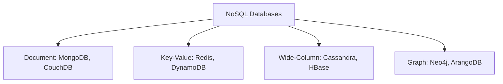

# Day 8: NoSQL Databases - MongoDB & Redis Deep Dive

## Table of Contents
1. [NoSQL Overview](#1-nosql-overview)
2. [MongoDB Document Model](#2-mongodb-document-model)
3. [MongoDB Queries & Aggregation](#3-mongodb-queries--aggregation)
4. [MongoDB Indexing & Performance](#4-mongodb-indexing--performance)
5. [Redis Data Structures](#5-redis-data-structures)
6. [Redis Caching Patterns](#6-redis-caching-patterns)
7. [Redis Pub/Sub & Streams](#7-redis-pubsub--streams)
8. [Production Deployment](#8-production-deployment)
9. [SQL vs NoSQL Decision Framework](#9-sql-vs-nosql-decision-framework)
10. [Summary](#10-summary)

---

## 1. NoSQL Overview

### 1.1 Why NoSQL Exists

**SQL Limitations**:
- **Rigid Schema**: ALTER TABLE on 1B rows takes hours
- **Vertical Scaling**: Can't infinitely add RAM/CPU
- **Join Performance**: Expensive on large datasets

**NoSQL Solutions**:
- **Flexible Schema**: Add fields without migrations
- **Horizontal Scaling**: Add more servers
- **Denormalization**: Embed related data (no joins)

### 1.2 NoSQL Categories



### 1.3 Trade-offs

| Feature | SQL | NoSQL |
|:--------|:----|:------|
| Schema | Fixed | Flexible |
| Transactions | ACID | Eventually Consistent (mostly) |
| Joins | Efficient | Avoided (denormalize) |
| Scaling | Vertical | Horizontal |
| Use Case | Transactional | High writes, flexibility |

---

## 2. MongoDB Document Model

### 2.1 Documents vs Rows

**SQL (Normalized)**:
```sql
users:
id | name  | email
1  | Alice | alice@example.com

posts:
id | user_id | title
1  | 1       | My Post
```

**MongoDB (Denormalized)**:
```javascript
{
  "_id": ObjectId("507f1f77bcf86cd799439011"),
  "name": "Alice",
  "email": "alice@example.com",
  "posts": [
    {"title": "My Post", "content": "...", "created_at": ISODate("2024-01-01")}
  ]
}
```

### 2.2 Data Types

```javascript
{
  "_id": ObjectId("..."),           // 12-byte unique identifier
  "name": "Alice",                   // String
  "age": 30,                         // Number
  "active": true,                    // Boolean
  "tags": ["python", "nodejs"],     // Array
  "address": {                       // Embedded document
    "street": "123 Main St",
    "city": "NYC"
  },
  "created_at": ISODate("2024-01-01"), // Date
  "metadata": null                   // Null
}
```

### 2.3 Schema Design Patterns

#### Pattern 1: Embedded Documents (1-to-Few)
```javascript
// Good: User has few addresses
{
  "name": "Alice",
  "addresses": [
    {"type": "home", "street": "123 Main"},
    {"type": "work", "street": "456 Oak"}
  ]
}
```

#### Pattern 2: References (1-to-Many)
```javascript
// Good: User has many posts
users:
{
  "_id": ObjectId("user_123"),
  "name": "Alice"
}

posts:
{
  "_id": ObjectId("post_456"),
  "user_id": ObjectId("user_123"),  // Reference
  "title": "Post"
}
```

#### Pattern 3: Bucket Pattern (Time-Series)
```javascript
// Good: Storing sensor readings
{
  "sensor_id": "temp_sensor_1",
  "date": "2024-01-01",
  "readings": [
    {"time": "00:00", "value": 22.5},
    {"time": "00:01", "value": 22.6"},
    // ... 1440 readings per day
  ]
}
// Instead of 1 document per reading (millions of docs)
```

---

## 3. MongoDB Queries & Aggregation

### 3.1 CRUD Operations

**Create**:
```javascript
db.users.insertOne({name: "Alice", email: "alice@example.com"});
db.users.insertMany([
  {name: "Bob"},
  {name: "Charlie"}
]);
```

**Read**:
```javascript
// Find all
db.users.find();

// Filter
db.users.find({age: {$gt: 30}});  // age > 30
db.users.find({name: /^A/});       // Regex: starts with A

// Projection (select specific fields)
db.users.find({}, {name: 1, email: 1});  // Only name, email

// Sort, limit
db.users.find().sort({created_at: -1}).limit(10);
```

**Update**:
```javascript
// Update one
db.users.updateOne(
  {_id: ObjectId("...")},
  {$set: {email: "newemail@example.com"}}
);

// Update many
db.users.updateMany(
  {status: "inactive"},
  {$set: {status: "archived"}}
);

// Increment
db.posts.updateOne(
  {_id: ObjectId("...")},
  {$inc: {views: 1}}  // Atomic increment
);

// Push to array
db.users.updateOne(
  {_id: ObjectId("...")},
  {$push: {tags: "python"}}
);
```

**Delete**:
```javascript
db.users.deleteOne({_id: ObjectId("...")});
db.users.deleteMany({status: "spam"});
```

### 3.2 Aggregation Pipeline

**SQL Equivalent**:
```sql
SELECT category, COUNT(*), AVG(price)
FROM products
WHERE price > 100
GROUP BY category
HAVING COUNT(*) > 5
ORDER BY AVG(price) DESC;
```

**MongoDB Aggregation**:
```javascript
db.products.aggregate([
  // WHERE
  {$match: {price: {$gt: 100}}},
  
  // GROUP BY
  {$group: {
    _id: "$category",
    count: {$sum: 1},
    avg_price: {$avg: "$price"}
  }},
  
  // HAVING
  {$match: {count: {$gt: 5}}},
  
  // ORDER BY
  {$sort: {avg_price: -1}}
]);
```

**Complex Example** (User with post count):
```javascript
db.users.aggregate([
  // Join with posts (LEFT JOIN)
  {$lookup: {
    from: "posts",
    localField: "_id",
    foreignField: "user_id",
    as: "posts"
  }},
  
  // Add computed field
  {$addFields: {
    post_count: {$size: "$posts"}
  }},
  
  // Filter
  {$match: {post_count: {$gt: 10}}},
  
  // Project (select fields)
  {$project: {
    name: 1,
    email: 1,
    post_count: 1
  }}
]);
```

---

## 4. MongoDB Indexing & Performance

### 4.1 Index Types

  **Single Field**:
```javascript
db.users.createIndex({email: 1});  // 1 = ascending, -1 = descending
```

**Compound Index**:
```javascript
db.users.createIndex({city: 1, age: -1});

// Uses index:
db.users.find({city: "NYC", age: 30});
db.users.find({city: "NYC"});

// Doesn't use index:
db.users.find({age: 30});  // Missing first field (city)
```

**Unique Index**:
```javascript
db.users.createIndex({email: 1}, {unique: true});
```

**TTL Index** (Auto-delete old docs):
```javascript
db.sessions.createIndex({created_at: 1}, {expireAfterSeconds: 3600});
// Deletes docs where created_at is 1 hour old
```

**Text Index** (Full-text search):
```javascript
db.articles.createIndex({title: "text", content: "text"});

db.articles.find({$text: {$search: "mongodb tutorial"}});
```

### 4.2 Explain Plans

```javascript
db.users.find({email: "alice@example.com"}).explain("executionStats");
```

**Output**:
```javascript
{
  "executionStats": {
    "executionSuccess": true,
    "executionTimeMillis": 5,
    "totalDocsExamined": 1,       // Good: 1 doc scanned
    "totalKeysExamined": 1,       // Used index
    "executionStages": {
      "stage": "FETCH",
      "inputStage": {
        "stage": "IXSCAN",         // Index scan (good!)
        "indexName": "email_1"
      }
    }
  }
}
```

**Bad Plan** (COLLSCAN):
```javascript
{
  "executionStages": {
    "stage": "COLLSCAN",  // Collection scan (full table scan)
    "docsExamined": 1000000
  }
}
```

### 4.3 Performance Tips

✅ **Use covered queries** (index has all fields):
```javascript
db.users.createIndex({email: 1, name: 1});
db.users.find({email: "..."}, {name: 1, _id: 0});  // Index-only query
```

❌ **Avoid** regex on large collections without index:
```javascript
db.users.find({email: /.*@gmail.com$/});  // Slow! Full scan
```

✅ **Use projection**:
```javascript
db.users.find({}, {name: 1, email: 1});  // Only fetch needed fields
```

---

## 5. Redis Data Structures

### 5.1 Strings

```redis
SET key "value"
GET key
INCR counter  # Atomic increment
DECR counter
SETEX key 60 "value"  # Set with 60s TTL
```

**Use case**: Caching, counters, rate limiting.

### 5.2 Hashes (Objects)

```redis
HSET user:123 name "Alice" email "alice@example.com"
HGET user:123 name  → "Alice"
HGETALL user:123    → {"name": "Alice", "email": "alice@example.com"}
HINCRBY user:123 age 1  # Increment field
```

**Use case**: Storing objects (users, products).

### 5.3 Lists (Queue/Stack)

```redis
#Queue (FIFO)
LPUSH queue "job1"  # Add to front
LPUSH queue "job2"
RPOP queue  → "job1"  # Remove from back

# Stack (LIFO)
LPUSH stack "task1"
LPOP stack  → "task1"

# Blocking pop (wait for item)
BRPOP queue 10  # Wait up to 10 seconds
```

**Use case**: Job queues, activity logs.

### 5.4 Sets (Unique Values)

```redis
SADD tags:post:123 "python" "redis" "python"  # Duplicate ignored
SMEMBERS tags:post:123  → ["python", "redis"]
SISMEMBER tags:post:123 "python"  → 1 (true)

# Set operations
SINTER set1 set2  # Intersection
SUNION set1 set2  # Union
```

**Use case**: Tags, unique visitors.

### 5.5 Sorted Sets (Leaderboards)

```redis
ZADD leaderboard 100 "player1" 200 "player2" 150 "player3"
ZRANGE leaderboard 0 -1 WITHSCORES  → ["player1", 100, "player3", 150, "player2", 200]
ZRANK leaderboard "player3"  → 1 (rank, 0-indexed)

# Top 10
ZREVRANGE leaderboard 0 9 WITHSCORES
```

**Use case**: Leaderboards, trending topics.

---

## 6. Redis Caching Patterns

### 6.1 Cache-Aside (Lazy Loading)

```python
import redis
import psycopg2

r = redis.Redis()
db = psycopg2.connect("...")

def get_user(user_id):
    # Check cache
    cached = r.get(f"user:{user_id}")
    if cached:
        return json.loads(cached)  # Cache hit
    
    # Cache miss → query DB
    user = db.execute("SELECT * FROM users WHERE id = ?", (user_id,)).fetchone()
    
    # Store in cache for 5 min
    r.setex(f"user:{user_id}", 300, json.dumps(user))
    
    return user
```

**Pros**: Simple, only caches requested data.  
**Cons**: Cache stampede (many requests hit DB simultaneously).

### 6.2 Write-Through Cache

```python
def update_user(user_id, data):
    # Update DB
    db.execute("UPDATE users SET name = ? WHERE id = ?", (data['name'], user_id))
    
    # Update cache
    r.setex(f"user:{user_id}", 300, json.dumps(data))
```

**Pros**: Cache always in sync.  
**Cons**: Slower writes (2 operations).

### 6.3 Cache Invalidation

**Time-based (TTL)**:
```redis
SETEX key 60 "value"  # Expires after 60s
```

**Event-based**:
```python
def delete_user(user_id):
    db.execute("DELETE FROM users WHERE id = ?", (user_id,))
    r.delete(f"user:{user_id}")  # Purge cache
```

---

## 7. Redis Pub/Sub & Streams

### 7.1 Pub/Sub (Messaging)

**Publisher**:
```redis
PUBLISH notifications "User Alice logged in"
```

**Subscriber**:
```python
import redis
r = redis.Redis()
pubsub = r.pubsub()
pubsub.subscribe('notifications')

for message in pubsub.listen():
    print(message['data'])
```

**Limitation**: No message persistence (lost if subscriber offline).

### 7.2 Redis Streams (Event Log)

```redis
# Add event
XADD events * user "Alice" action "login"

# Read events
XREAD STREAMS events 0  # Read from start

# Consumer group (multiple workers)
XGROUP CREATE events group1 0
XREADGROUP GROUP group1 consumer1 STREAMS events >
```

**Use case**: Event sourcing, activity logs.

---

## 8. Production Deployment

### 8.1 MongoDB Replica Set

```
Primary (Writes) →  Secondary 1 (Reads)
                 →  Secondary 2 (Reads)
                 →  Arbiter (Voting only)
```

**Automatic Failover**: If primary dies, secondary promoted.

**Configuration**:
```javascript
rs.initiate({
  _id: "rs0",
  members: [
    {_id: 0, host: "mongo1:27017"},
    {_id: 1, host: "mongo2:27017"},
    {_id: 2, host: "mongo3:27017"}
  ]
});
```

### 8.2 MongoDB Sharding

```
Router (mongos) →  Shard 1 (users A-M)
                →  Shard 2 (users N-Z)
                →  Config Servers (metadata)
```

**Shard Key** (partition by):
```javascript
sh.shardCollection("mydb.users", {email: "hashed"});
```

### 8.3 Redis Persistence

**RDB (Snapshot)**:
```ini
# redis.conf
save 900 1   # Save if 1 key changed in 900s
save 300 10  # Save if 10 keys changed in 300s
```

**AOF (Append-Only File)** - Log every write:
```ini
appendonly yes
appendfsync everysec  # fsync every second
```

**Trade-off**:
- RDB: Faster, but lose data since last snapshot
- AOF: Slower, but minimal data loss

### 8.4 Redis Sentinel (High Availability)

```
Sentinel 1 →  Monitor Primary + Replicas
Sentinel 2 →  Quorum voting for failover
Sentinel 3
```

**Automatic failover** if primary dies.

---

## 9. SQL vs NoSQL Decision Framework

### 9.1 Use SQL When

- ✅ **Complex queries** with multiple joins
- ✅ **ACID transactions** required (banking, inventory)
- ✅ **Schema is stable** (user auth, orders)
- ✅ **Strong consistency** needed

### 9.2 Use MongoDB When

 - ✅ **Flexible schema** (CMS, product catalogs)
- ✅ **High write throughput** (logs, analytics)
- ✅ **Denormalized data** (embed related docs)
- ✅ **Rapid iteration** (schema evolves frequently)

### 9.3 Use Redis When

- ✅ **Caching** (hot data, session storage)
- ✅ **Real-time** (leaderboards, counters)
- ✅ **Pub/Sub** (notifications)
- ✅ **Rate limiting** (API throttling)

### 9.4 Polyglot Persistence

**Best practice**: Use multiple databases.

```
Frontend → API Gateway
  → Postgres (Users, Orders) [ACID]
  → MongoDB (Product Catalog) [Flexible]
  → Redis (Cache, Sessions) [Speed]
  → Elasticsearch (Search) [Full-text]
```

---

## 10. Summary

### 10.1 Key Takeaways

1. ✅ **MongoDB** - Flexible schema, denormalization, aggregation
2. ✅ **Redis** - In-memory, 5 data structures, caching
3. ✅ **SQL vs NoSQL** - Not either/or, use both (polyglot)
4. ✅ **Indexing** - Critical in both SQL and NoSQL
5. ✅ **Replication** - High availability
6. ✅ **Sharding** - Horizontal scaling

### 10.2 NoSQL Anti-Patterns

❌ **Using MongoDB like SQL**:
```javascript
// Bad: Many small documents with references (like SQL)
users: {_id: 1, name: "Alice"}
posts: {_id: 1, user_id: 1, title: "Post"}
// Better: Embed posts in user document (if few posts)
```

❌ **Not using indexes**:
```javascript
db.users.find({email: "..."});  // Without index = slow
```

❌ **Unbounded arrays**:
```javascript
{
  "user_id": 123,
  "followers": [...]  // Can grow to millions! Use references instead
}
```

### 10.3 Tomorrow (Day 9): Vector Databases

- **Embeddings**: Converting text/images to vectors
- **Similarity Search**: Cosine vs Euclidean distance
- **Qdrant**: Production vector DB
- **Hybrid Search**: Keyword + semantic
- **RAG Pipelines**: Retrieval-Augmented Generation

See you tomorrow! 🚀

---

**File Statistics**: ~1000 lines | NoSQL mastery achieved ✅
