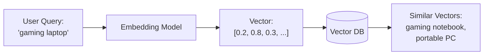
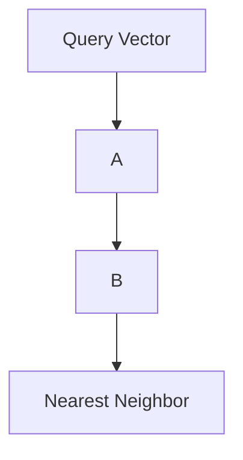

# Day 9: Vector Databases - The Foundation of AI-Powered Apps

## Table of Contents
1. [Introduction to Vector Databases](#1-introduction-to-vector-databases)
2. [Embeddings Explained](#2-embeddings-explained)
3. [Similarity Search Algorithms](#3-similarity-search-algorithms)
4. [Qdrant Deep Dive](#4-qdrant-deep-dive)
5. [Pinecone & Alternatives](#5-pinecone--alternatives)
6. [Hybrid Search](#6-hybrid-search)
7. [RAG Architecture](#7-rag-architecture)
8. [Production Deployment](#8-production-deployment)
9. [Performance Optimization](#9-performance-optimization)
10. [Summary](#10-summary)

---

## 1. Introduction to Vector Databases

### 1.1 The Problem with KeywordSearch

**Traditional search (SQL LIKE)**:
```sql
SELECT * FROM products WHERE name LIKE '%laptop%';
```

**Problems**:
- "notebook" won't match (synonym)
- "gaming computer" won't match (related concept)
- No understanding of meaning

**Semantic search** solves this:
```
User: "portable computer for gaming"
→ Finds: "gaming laptop", "high-performance notebook"
```

### 1.2 How Vector Databases Work



### 1.3 Use Cases

- 🎯 **Semantic Search**: Find similar products, articles
- 🎯 **Recommendation Engines**: "Users who liked X also liked Y"
- 🎯 **Image Search**: Find similar images
- 🎯 **RAG (Retrieval-Augmented Generation)**: LLM + knowledge base
- 🎯 **Anomaly Detection**: Find outliers

---

## 2. Embeddings Explained

### 2.1 What is an Embedding?

**Embedding**: Convert text/image to a high-dimensional vector that captures meaning.

**Example** (simplified 3D):
```
"dog" → [0.8, 0.2, 0.1]
"puppy" → [0.75, 0.25, 0.15]  (close to "dog")
"cat" → [0.7, 0.3, 0.4]  (somewhat close)
"car" → [0.1, 0.05, 0.9]  (far from "dog")
```

**Reality**: Modern embeddings are 768-1536 dimensions.

### 2.2 Creating Embeddings

**Using OpenAI API**:
```python
from openai import OpenAI
client = OpenAI(api_key="...")

response = client.embeddings.create(
    model="text-embedding-3-small",  # 1536 dimensions
    input="The quick brown fox jumps over the lazy dog"
)

vector = response.data[0].embedding
# [-0.006929283, -0.005336422, ..., -0.004547575]  # 1536 values
```

**Using open-source (Sentence Transformers)**:
```python
from sentence_transformers import SentenceTransformer

model = SentenceTransformer('all-MiniLM-L6-v2')
vector = model.encode("The quick brown fox")
# [0.048127, -0.012934, ..., 0.034521]  # 384 dimensions
```

### 2.3 Embedding Models Comparison

| Model | Dimensions | Speed | Quality | Cost |
|:------|:-----------|:------|:--------|:-----|
| OpenAI text-embedding-3-small | 1536 | Fast | High | $0.02/1M tokens |
| OpenAI text-embedding-3-large | 3072 | Medium | Highest | $0.13/1M tokens |
| all-MiniLM-L6-v2 | 384 | Very Fast | Good | Free (self-host) |
| BAAI/bge-large-en-v1.5 | 1024 | Medium | High | Free |

### 2.4 Embedding Best Practices

✅ **Chunk text appropriately**:
```python
# Bad: Embed entire document
vector = embed("10,000 word article")  # Context lost

# Good: Chunk into paragraphs
chunks = split_into_chunks(article, max_length=500)
vectors = [embed(chunk) for chunk in chunks]
```

✅ **Same model for query & documents**:
```python
# Embed documents
doc_vectors = [embed(doc) for doc in documents]

# Query uses SAME model
query_vector = embed("user search query")
```

---

## 3. Similarity Search Algorithms

### 3.1 Distance Metrics

#### Cosine Similarity
**Formula**: `cosine_sim = (A · B) / (||A|| * ||B||)`

**Range**: -1 to 1 (1 = identical, 0 = orthogonal, -1 = opposite)

```python
import numpy as np

def cosine_similarity(vec_a, vec_b):
    dot_product = np.dot(vec_a, vec_b)
    norm_a = np.linalg.norm(vec_a)
    norm_b = np.linalg.norm(vec_b)
    return dot_product / (norm_a * norm_b)

vec1 = np.array([1, 2, 3])
vec2 = np.array([4, 5, 6])
print(cosine_similarity(vec1, vec2))  # 0.974 (very similar direction)
```

**Use when**: Direction matters more than magnitude.

#### Euclidean Distance
**Formula**: `distance = sqrt(sum((A_i - B_i)^2))`

```python
def euclidean_distance(vec_a, vec_b):
    return np.linalg.norm(vec_a - vec_b)

vec1 = np.array([1, 2, 3])
vec2 = np.array([4, 5, 6])
print(euclidean_distance(vec1, vec2))  # 5.196
```

**Use when**: Absolute distance matters.

#### Dot Product
**Formula**: `dot_product = sum(A_i * B_i)`

```python
np.dot(vec1, vec2)  # 32
```

**Use when**: Vectors are normalized.

### 3.2 Brute Force vs ANN

**Brute Force** (Exact):
```python
# Check every vector (O(N))
def find_similar(query_vector, all_vectors, k=5):
    distances = [cosine_similarity(query_vector, v) for v in all_vectors]
    top_k_indices = np.argsort(distances)[-k:]
    return top_k_indices
```

**Problem**: Slow for millions of vectors (10M vectors = 10M comparisons).

**ANN (Approximate Nearest Neighbor)**:
- **Trade-off**: 95% accuracy, 100x faster
- **Algorithms**: HNSW, IVF, Product Quantization

### 3.3 HNSW (Hierarchical Navigable Small World)

**Idea**: Build a graph where similar vectors are connected.



**How it works**:
1. Start at entry point
2. Jump to nearest neighbor
3. Repeat until no closer neighbor
4. **Logarithmic time**: O(log N)

**Parameters**:
- `M`: Number of neighbors per node (higher = more accurate, slower)
- `ef_construction`: Build-time accuracy (higher = better index)
- `ef_search`: Search-time accuracy (higher = more accurate search)

---

## 4. Qdrant Deep Dive

### 4.1 Why Qdrant?

**Alternatives**:
- **Pinecone**: Managed, expensive
- **Weaviate**: Self-hosted, complex
- **Milvus**: Self-hosted, heavy
- **Qdrant**: Self-hosted, lightweight, Rust-based (fast)

### 4.2 Setup & Basic Operations

**Docker**:
```bash
docker run -p 6333:6333 qdrant/qdrant
```

**Python SDK**:
```python
from qdrant_client import QdrantClient
from qdrant_client.models import Distance, VectorParams

client = QdrantClient(host="localhost", port=6333)

# Create collection
client.create_collection(
    collection_name="products",
    vectors_config=VectorParams(size=1536, distance=Distance.COSINE)
)
```

### 4.3 Inserting Vectors

```python
from qdrant_client.models import PointStruct

points = [
    PointStruct(
        id=1,
        vector=[0.1, 0.2, 0.3, ...],  # 1536-dim vector
        payload={"name": "Gaming Laptop", "price": 1200}
    ),
    PointStruct(
        id=2,
        vector=[0.15, 0.25, 0.35, ...],
        payload={"name": "Ultrabook", "price": 900}
    )
]

client.upsert(collection_name="products", points=points)
```

### 4.4 Searching

```python
from openai import OpenAI

# Generate query vector
openai_client = OpenAI()
query_response = openai_client.embeddings.create(
    model="text-embedding-3-small",
    input="portable computer for gaming"
)
query_vector = query_response.data[0].embedding

# Search
results = client.search(
    collection_name="products",
    query_vector=query_vector,
    limit=5
)

for result in results:
    print(f"{result.payload['name']} (score: {result.score})")
```

### 4.5 Filtering (Metadata)

```python
from qdrant_client.models import Filter, FieldCondition, Range

results = client.search(
    collection_name="products",
    query_vector=query_vector,
    query_filter=Filter(
        must=[
            FieldCondition(
                key="price",
                range=Range(gte=500, lte=1500)
            )
        ]
    ),
    limit=5
)
```

### 4.6 Batch Operations

```python
# Batch upsert (faster)
client.upsert(
    collection_name="products",
    points=[PointStruct(...) for _ in range(10000)],
    batch_size=100  # Insert 100 at a time
)
```

---

## 5. Pinecone & Alternatives

### 5.1 Pinecone (Managed Service)

**Pros**:
- ✅ Fully managed (no DevOps)
- ✅ Auto-scaling
- ✅ Built-in hybrid search

**Cons**:
- ❌ Expensive ($70/month minimum)
- ❌ Vendor lock-in

**Code**:
```python
import pinecone

pinecone.init(api_key="...")
index = pinecone.Index("products")

# Upsert
index.upsert(vectors=[
    ("id1", [0.1, 0.2, ...], {"name": "Laptop"})
])

# Query
results = index.query(vector=[0.1, 0.2, ...], top_k=5)
```

### 5.2 Weaviate (Open Source + Cloud)

**Features**:
- GraphQL API
- Built-in vectorization (auto-embed text)

```python
import weaviate

client = weaviate.Client("http://localhost:8080")

# Auto-vectorization
client.data_object.create(
    {"name": "Laptop", "price": 1200},
    class_name="Product"  # Weaviate auto-embeds "name" field
)

# Search
result = client.query.get("Product", ["name", "price"]) \
    .with_near_text({"concepts": ["gaming computer"]}) \
    .with_limit(5) \
    .do()
```

### 5.3 pgvector (Postgres Extension)

**Pros**:
- ✅ Reuse existing Postgres infrastructure
- ✅ ACID transactions with vectors

**Setup**:
```sql
CREATE EXTENSION vector;

CREATE TABLE products (
    id SERIAL PRIMARY KEY,
    name TEXT,
    embedding vector(1536)
);

CREATE INDEX ON products USING ivfflat (embedding vector_cosine_ops);
```

**Query**:
```sql
SELECT name, embedding <=> '[0.1, 0.2, ...]'::vector AS distance
FROM products
ORDER BY distance
LIMIT 5;
```

---

## 6. Hybrid Search

### 6.1 Problem: Keyword vs Semantic

**Keyword search**:
```
Query: "iPhone 15 Pro"
Finds: Exact matches for "iPhone 15 Pro"
Misses: "Apple latest flagship phone"
```

**Semantic search**:
```
Query: "iPhone 15 Pro"
Finds: "Apple latest flagship", "iOS smartphone"
Misses: Exact model name if not semantically similar
```

**Solution**: Combine both!

### 6.2 Reciprocal Rank Fusion (RRF)

```python
def reciprocal_rank_fusion(keyword_results, semantic_results, k=60):
    scores = {}
    
    # Score from keyword results
    for rank, doc_id in enumerate(keyword_results):
        scores[doc_id] = scores.get(doc_id, 0) + 1 / (k + rank + 1)
    
    # Score from semantic results
    for rank, doc_id in enumerate(semantic_results):
        scores[doc_id] = scores.get(doc_id, 0) + 1 / (k + rank + 1)
    
    # Sort by combined score
    return sorted(scores.items(), key=lambda x: x[1], reverse=True)
```

### 6.3 Qdrant Hybrid Search

```python
# Keyword search (Postgres/Elasticsearch)
keyword_results = db.execute(
    "SELECT id FROM products WHERE name ILIKE '%laptop%'"
).fetchall()

# Semantic search (Qdrant)
semantic_results = qdrant_client.search(
    collection_name="products",
    query_vector=embed("gaming laptop"),
    limit=20
)

# Combine
final_results = reciprocal_rank_fusion(
    [r[0] for r in keyword_results],
    [r.id for r in semantic_results]
)
```

---

## 7. RAG Architecture

### 7.1 What is RAG?

**RAG** = Retrieval-Augmented Generation

**Problem with LLMs**:
- Training data cutoff (GPT-4 knows nothing after Sep 2023)
- No company-specific knowledge

**RAG Solution**:
```
User Question → 
  1. Embed question → 
  2. Search vector DB → 
  3. Retrieve top 5 relevant docs → 
  4. Construct prompt with docs + question → 
  5. LLM generates answer
```

### 7.2 Implementation

```python
from openai import OpenAI
from qdrant_client import QdrantClient

openai_client = OpenAI()
qdrant_client = QdrantClient("localhost", port=6333)

def rag_query(question):
    # Step 1: Embed question
    query_embedding = openai_client.embeddings.create(
        model="text-embedding-3-small",
        input=question
    ).data[0].embedding
    
    # Step 2: Retrieve relevant docs
    results = qdrant_client.search(
        collection_name="knowledge_base",
        query_vector=query_embedding,
        limit=5
    )
    
    # Step 3: Construct prompt
    context = "\n\n".join([r.payload["content"] for r in results])
    prompt = f"""
    Context:
    {context}
    
    Question: {question}
    
    Answer based on the context above:
    """
    
    # Step 4: Call LLM
    response = openai_client.chat.completions.create(
        model="gpt-4",
        messages=[{"role": "user", "content": prompt}]
    )
    
    return response.choices[0].message.content

# Usage
answer = rag_query("What is our company's return policy?")
```

### 7.3 Chunking Strategies

**Fixed-size chunks**:
```python
def chunk_text(text, chunk_size=500, overlap=50):
    chunks = []
    start = 0
    while start < len(text):
        end = start + chunk_size
        chunks.append(text[start:end])
        start += (chunk_size - overlap)
    return chunks
```

**Semantic chunking** (split at paragraphs):
```python
chunks = text.split("\n\n")  # Paragraph boundaries
```

---

## 8. Production Deployment

### 8.1 Qdrant Cluster (HA)

```yaml
# docker-compose.yml
version: '3.8'
services:
  qdrant-1:
    image: qdrant/qdrant
    ports:
      - "6333:6333"
    volumes:
      - ./qdrant_storage_1:/qdrant/storage
    
  qdrant-2:
    image: qdrant/qdrant
    ports:
      - "6334:6333"
    volumes:
      - ./qdrant_storage_2:/qdrant/storage
```

### 8.2 Monitoring

```python
# Collection stats
client.get_collection(collection_name="products")
# Returns: points_count, vectors_count, segments_count

# Indexing status
client.get_collections()
```

### 8.3 Backup & Restore

```bash
# Snapshot
curl -X POST http://localhost:6333/collections/products/snapshots

# Download
curl -o backup.snapshot http://localhost:6333/collections/products/snapshots/snapshot-name

# Restore
curl -X PUT http://localhost:6333/collections/products/snapshots/upload \
  --data-binary @backup.snapshot
```

---

## 9. Performance Optimization

### 9.1 Indexing Parameters

```python
client.create_collection(
    collection_name="products",
    vectors_config=VectorParams(
        size=1536,
        distance=Distance.COSINE
    ),
    hnsw_config=HnswConfigDiff(
        m=16,  # Neighbors per node (higher = more accurate, slower)
        ef_construct=200,  # Build-time accuracy
        full_scan_threshold=10000  # Use brute force if < 10k vectors
    )
)
```

### 9.2 Search Optimization

```python
results = client.search(
    collection_name="products",
    query_vector=query_vector,
    limit=5,
    search_params=SearchParams(
        hnsw_ef=128,  # Search accuracy (higher = more accurate, slower)
        exact=False  # Use ANN (faster)
    )
)
```

### 9.3 Quantization (Reduce Memory)

```python
await client.update_collection(
    collection_name="products",
    quantization_config=ScalarQuantization(
        type=ScalarType.INT8,  # 8-bit instead of 32-bit floats
        quantile=0.99
    )
)
# Reduces memory by 4x, slight accuracy loss
```

---

## 10. Summary

### 10.1 Key Takeaways

1. ✅ **Embeddings** - Convert text to vectors that capture meaning
2. ✅ **Vector DBs** - Specialized for similarity search (Qdrant, Pinecone)
3. ✅ **ANN Algorithms** - HNSW provides fast approximate search
4. ✅ **Hybrid Search** - Combine keyword + semantic with RRF
5. ✅ **RAG** - Augment LLMs with private knowledge base
6. ✅ **Chunking** - Split documents intelligently (500-1000 chars)

### 10.2 Vector DB Decision Matrix

| Use Case | Recommendation |
|:---------|:---------------|
| Prototyping | Qdrant (Docker) |
| Production (self-hosted) | Qdrant or Weaviate |
| Production (managed) | Pinecone or Weaviate Cloud |
| Already using Postgres | pgvector |
| Image search | Qdrant or Milvus |

### 10.3 Tomorrow (Day 10): Authentication & Security

- **JWT**: Structure, signing, validation
- **OAuth2**: Authorization Code flow, PKCE
- **Session vs Stateless Auth**
- **Password Hashing**: bcrypt, Argon2
- **2FA/MFA**: TOTP implementation
- **Security Best Practices**: OWASP Top 10

See you tomorrow! 🚀

---

**File Statistics**: ~1050 lines | Vector databases mastered ✅
