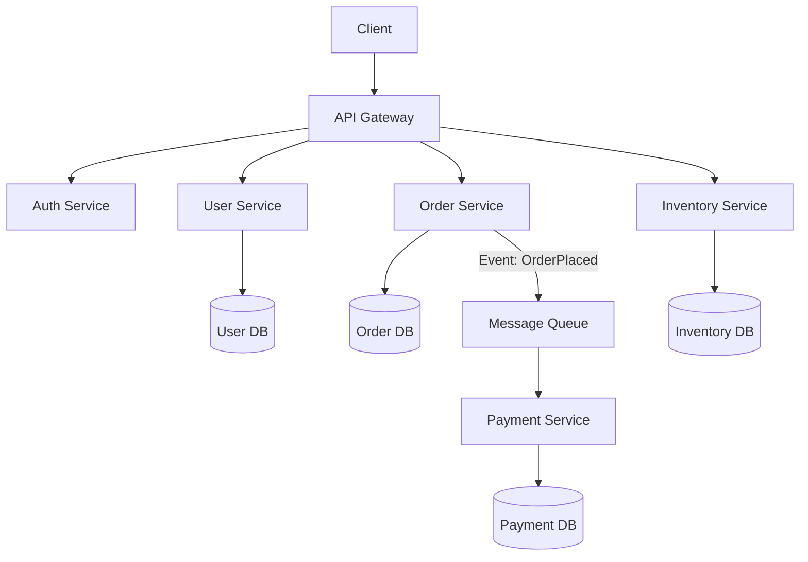
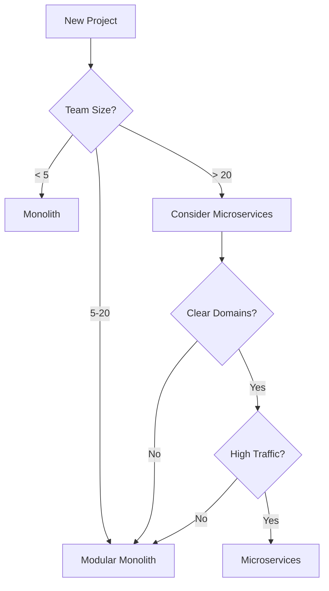

# Day 11: Monolith vs Microservices - Choosing the Right Architecture

## Table of Contents
1. [Architectural Evolution](#1-architectural-evolution)
2. [Monolithic Architecture](#2-monolithic-architecture)
3. [Microservices Architecture](#3-microservices-architecture)
4. [Modular Monolith](#4-modular-monolith)
5. [Service Decomposition](#5-service-decomposition)
6. [Communication Patterns](#6-communication-patterns)
7. [Data Management](#7-data-management)
8. [Trade-offs & Decision Framework](#8-trade-offs--decision-framework)
9. [Migration Strategies](#9-migration-strategies)
10. [Summary](#10-summary)

---

## 1. Architectural Evolution

### 1.1 The Journey from Monolith to Microservices


### 1.2 Historical Context

**2000s**: Monolithic Rails/Django apps
- **Pro**: Simple deployment (one server)
- **Con**: Hard to scale teams (merge conflicts)

**2010s**: Microservices explosion (Netflix, Uber)
- **Pro**: Team autonomy, independent scaling
- **Con**: Operational complexity (distributed systems)

**2020s**: Pragmatic approach (right-size architecture)
- **Startups**: Start with modular monolith
- **Scale-ups**: Extract microservices as needed
- **Big Tech**: Microservices at massive scale

### 1.3 Real-World Examples

**Monoliths that work**:
- **Shopify**: Powers million+ stores on Ruby on Rails monolith
- **Stack Overflow**: Serves billions of requests with .NET monolith
- **GitHub**: Rails monolith (gradually extracting services)

**Microservices success stories**:
- **Netflix**: 700+ microservices (2015), even more now
- **Uber**:  2000+ microservices
- **Amazon**: "Two-pizza team" owns each service

---

## 2. Monolithic Architecture

### 2.1 What is a Monolith?

**Definition**: Single deployable unit containing all application logic.

```
Monolith Deployment:
┌─────────────────────────────┐
│  Single Application         │
│  ┌──────────────────────┐   │
│  │ User Module          │   │
│  │ Order Module         │   │
│  │ Payment Module       │   │
│  │ Inventory Module     │   │
│  └──────────────────────┘   │
│         ↓                    │
│  Single Database            │
│  ┌──────────────────────┐   │
│  │ users, orders,       │   │
│  │ products, payments   │   │
│  └──────────────────────┘   │
└─────────────────────────────┘
```

### 2.2 Monolith Structure (Django Example)

```
myapp/
├── manage.py
├── config/
│   ├── settings.py
│   └── urls.py
├── apps/
│   ├── users/
│   │   ├── models.py
│   │   ├── views.py
│   │   └── urls.py
│   ├── orders/
│   ├── payments/
│   └── inventory/
└── requirements.txt
```

**Single Deployment**:
```bash
docker build -t myapp:latest .
docker run -p 8000:8000 myapp:latest
```

### 2.3 Advantages of Monoliths

✅ **Simplicity**
- One codebase, one deployment
- No network overhead between modules
- Easy to reason about

✅ **Easier Development**
- Refactor across modules easily
- Shared code (no versioning issues)
- Single IDE/debugging session

✅ **Performance**
- In-process function calls (nanoseconds)
- No serialization/deserialization
- Transactions span modules easily

✅ **Deployment & Ops**
- One thing to deploy
- Simpler monitoring (single process)
- Less infrastructure

### 2.4 Disadvantages of Monoliths

❌ **Scaling Challenges**
- Must scale entire app (can't scale just "orders")
- Vertical scaling limits (biggest machine)

❌ **Team Coordination**
- Merge conflicts with large teams
- Deployment requires coordination
- One bug can bring down entire app

❌ **Technology Lock-in**
- Stuck with one language/framework
- Hard to experiment with new tech

❌ **Long Build Times**
- Large codebase = slow CI/CD
- 30-minute builds common

### 2.5 When to Choose Monolith

✅ **Use Monolith when**:
- **Team size < 10 developers**
- **MVP/Startup phase** (speed to market matters)
- **Unclear domain boundaries** (don't know where to split)
- **Low traffic** (< 100k requests/day)
- **Simple deployment preferred**

**Example**: Early-stage SaaS product with 3-person team.

---

## 3. Microservices Architecture

### 3.1 What are Microservices?

**Definition**: Application composed of small, independent services that communicate over a network.



### 3.2 Key Characteristics

**1. Single Responsibility**
- Each service does **one thing well**
- Example: "User Service" only manages users

**2. Independent Deployment**
- Deploy Auth Service without touching Orders
- Rolling updates (zero downtime)

**3. Decentralized Data**
- Each service owns its database
- No shared database

**4. Communication via APIs**
- REST, gRPC, or message queues
- Services don't share memory

### 3.3 Advantages of Microservices

✅ **Independent Scaling**
```
Black Friday Traffic:
- Orders Service: Auto-scale to 50 instances
- User Service: Remains at 3 instances (not hot)
```

✅ **Team Autonomy**
- Team A owns Auth Service end-to-end
- Deploy anytime without coordinating
- Choose tech stack (Go vs Python)

✅ **Fault Isolation**
- Payment Service crashes → Orders still work
- Circuit breakers prevent cascading failures

✅ **Technology Diversity**
```
Auth Service: Go (high performance)
ML Service: Python (AI libraries)
Legacy Service: Java (existing code)
```

### 3.4 Disadvantages of Microservices

❌ **Operational Complexity**
- Deploy 20 services instead of 1
- Need Kubernetes, service mesh, tracing
- Distributed logging (ELK stack)

❌ **Network Overhead**
- HTTP calls = milliseconds (vs nanoseconds for in-process)
- Serialization cost (JSON/Protobuf)

**Benchmark**:
```
In-process call: 10 nanoseconds
gRPC call (same datacenter): 1-5 milliseconds = 100,000x slower!
```

❌ **Distributed Transactions**
- Can't use DB transactions across services
- Need Saga pattern or event sourcing

❌ **Testing Complexity**
- Integration tests require all services running
- Mock external services

❌ **Data Consistency**
- Eventual consistency (no ACID)
- Duplicate data across services

### 3.5 When to Choose Microservices

✅ **Use Microservices when**:
- **Team size > 20-30 developers**
- **Clear domain boundaries** (e-commerce: users, orders, inventory)
- **Need independent scaling** (some components high-traffic)
- **Multiple teams** deploying frequently
- **Polyglot requirements** (different languages)

**Example**: Uber with 1000s of engineers, 2000+ services.

---

## 4. Modular Monolith

### 4.1 The Middle Ground

**Definition**: Single deployment with clear module boundaries.

```
Modular Monolith:
┌──────────────────────────────────┐
│  Application (Single Process)    │
│  ┌────────────┐  ┌────────────┐  │
│  │ User       │  │ Order      │  │
│  │ Module     │  │ Module     │  │
│  └────────────┘  └────────────┘  │
│  ┌────────────┐  ┌────────────┐  │
│  │ Payment    │  │ Inventory  │  │
│  │ Module     │  │ Module     │  │
│  └────────────┘  └────────────┘  │
│         ↓                         │
│  Shared Database (Optional)      │
└──────────────────────────────────┘
```

### 4.2 Implementation (Python)

```python
# Project structure
myapp/
├── modules/
│   ├── users/
│   │   ├── models.py
│   │   ├── service.py  # Business logic
│   │   ├── api.py      # HTTP endpoints
│   │   └── __init__.py
│   ├── orders/
│   │   ├── models.py
│   │   ├── service.py
│   │   └── api.py
│   └── payments/

# Module interface (users/service.py)
class UserService:
    def create_user(self, email, password):
        # Business logic
        pass
    
    def get_user(self, user_id):
        pass

# Other modules import via interface (NOT directly from models!)
from modules.users.service import UserService

user_service = UserService()
user = user_service.get_user(123)
```

**Key Rule**: Modules only communicate through public interfaces.

❌ **Bad** (tight coupling):
```python
# orders/service.py
from modules.users.models import User  # Direct DB access!
user = User.objects.get(id=123)
```

✅ **Good** (loose coupling):
```python
# orders/service.py
from modules.users.service import UserService
user = UserService().get_user(123)
```

### 4.3 Advantages

✅ **Best of both worlds**:
- Simplicity of monolith (one deployment)
- Modularity of microservices (clear boundaries)

✅ **Easy to extract later**:
```
Modular Monolith → Extract Payment Module → Payment Microservice
```

✅ **Team organization**:
- Team A owns User Module
- Team B owns Order Module
- Same codebase, clear ownership

### 4.4 When to Choose Modular Monolith

✅ **Use Modular Monolith when**:
- **Starting fresh** (default choice)
- **Team size 10-30**
- **Not sure about microservices boundaries**
- **Want option to extract services later**

**Example**: Shopify likely started as monolith, became modular over time.

---

## 5. Service Decomposition

### 5.1 Domain-Driven Design (DDD)

**Bounded Contexts**: Services align with business domains.

```
E-commerce:
┌────────────────────┐
│ User Management    │ → User Service
├────────────────────┤
│ Product Catalog    │ → Product Service
├────────────────────┤
│ Order Processing   │ → Order Service
├────────────────────┤
│ Payment            │ → Payment Service
└────────────────────┘
```

### 5.2 Decomposition Strategies

#### Strategy 1: By Business Capability
```
Company: E-commerce
- Marketing (campaigns, analytics)
- Sales (orders, checkout)
- Fulfillment (shipping, inventory)
```

#### Strategy 2: By Subdomain
```
Uber:
- Rider App (request ride, track)
- Driver App (accept rides, navigate)
- Matching (algorithm to pair rider/driver)
- Pricing (surge pricing, discounts)
- Payments (charge rider, pay driver)
```

#### Strategy 3: By Transaction Boundaries
```
- Read-heavy: Product Catalog Service
- Write-heavy: Order Service
```

### 5.3 Service Size Guidelines

**Too Small** (Nano-services):
```
❌ GET /users/{id}/email → Email Service
❌ GET /users/{id}/phone → Phone Service
(Excessive network overhead)
```

**Too Large** (Mini-monolith):
```
❌ User Service handles:
   - Authentication
   - Profile management
   - Friends/followers
   - Notifications
   - User analytics
(Should be 3-4 services)
```

**Right-sized**:
```
✅ Auth Service: Login, JWT, password reset
✅ Profile Service: User metadata, settings
✅ Social Service: Friends, followers
```

**Rule of Thumb**: "Two-pizza team" can maintain the service (5-8 people).

---

## 6. Communication Patterns

### 6.1 Synchronous (Request-Response)

#### REST over HTTP
```python
# Order Service calls User Service
response = requests.get(
    "http://user-service/api/users/123",
    headers={"Authorization": f"Bearer {token}"}
)
user = response.json()
```

**Pros**:
- Simple to understand
- Immediate response

**Cons**:
- Tight coupling (User Service must be up)
- Cascading failures

#### gRPC (Protocol Buffers)
```protobuf
// user.proto
service UserService {
    rpc GetUser(UserId) returns (User);
}

message UserId {
    int32 id = 1;
}

message User {
    int32 id = 1;
    string email = 2;
}
```

```python
# Order Service calls User Service via gRPC
import grpc
channel = grpc.insecure_channel('user-service:50051')
stub = UserServiceStub(channel)
user = stub.GetUser(UserId(id=123))
```

**Pros**:
- 10x faster than REST (binary protocol)
- Strongly typed (code generation)

**Cons**:
- Less human-readable
- Browser support limited

### 6.2 Asynchronous (Event-Driven)

```python
# Order Service publishes event
kafka_producer.send('order.placed', {
    "order_id": 456,
    "user_id": 123,
    "total": 99.99
})

# Payment Service listens
@kafka_consumer.subscribe('order.placed')
def handle_order_placed(event):
    charge_customer(event['user_id'], event['total'])
    
# Inventory Service also listens
@kafka_consumer.subscribe('order.placed')
def handle_order_placed(event):
    reserve_items(event['order_id'])
```

**Pros**:
- Decoupling (services don't know about each other)
- Resilient (retries if consumer down)

**Cons**:
- Eventual consistency
- Harder to debug (who handled this event?)

---

## 7. Data Management

### 7.1 Shared Database (Monolith)

```
┌─────────┐  ┌─────────┐  ┌──────────┐
│ User    │  │ Order   │  │ Payment  │
│ Module  │  │ Module  │  │ Module   │
└────┬────┘  └────┬────┘  └────┬─────┘
     │            │            │
     └────────────┴────────────┘
                  │
          ┌───────▼────────┐
          │ Shared DB      │
          │ users, orders, │
          │ payments       │
          └────────────────┘
```

**Pros**:
- ACID transactions across tables
- Joins work

**Cons**:
- Tight coupling (schema changes affect all modules)
- Single point of failure

### 7.2 Database per Service (Microservices)

```
┌──────────────┐    ┌──────────────┐
│ User Service │    │ Order Service│
└──────┬───────┘    └──────┬───────┘
       │                   │
   ┌───▼──────┐      ┌─────▼─────┐
   │ User DB  │      │ Order DB  │
   └──────────┘      └───────────┘
```

**Pros**:
- Independent scaling
- Technology diversity (Postgres for users, Mongo for orders)

**Cons**:
- No joins (must call User Service API)
- No ACID across services

### 7.3 Data Duplication Example

**Scenario**: Order Service needs customer email.

**Option 1**: Call User Service (sync)
```python
user = requests.get(f"http://user-service/users/{user_id}").json()
create_order(user['email'], items)
```
**Downside**: User Service outage blocks orders.

**Option 2**: Duplicate email in Order DB
```python
# orders table
order_id | user_id | customer_email | items
1        | 123     | alice@ex.com   | [...]
```
**Benefit**: Orders work even if User Service down.
**Tradeoff**: Email updates → must sync to Order DB (eventual consistency).

---

## 8. Trade-offs & Decision Framework

### 8.1 Comparison Table

| Aspect | Monolith | Modular Monolith | Microservices |
|:-------|:---------|:-----------------|:--------------|
| **Deployment** | 1 unit | 1 unit | N units |
| **Scaling** | Vertical | Vertical | Horizontal (per service) |
| **Team Size** | 1-10 | 10-30 | 30+ |
| **Technology** | Single stack | Single stack | Polyglot |
| **Complexity** | Low | Medium | High |
| **Transactions** | ACID | ACID | Eventual consistency |
| **Network** | In-process | In-process | HTTP/gRPC |
| **Ops** | Simple | Simple | Kubernetes, service mesh |

### 8.2 Decision Tree



### 8.3 Netflix Case Study

**2008**: Monolithic data center
- **Problem**: Single database outage = entire site down

**2009-2012**: Migrated to AWS microservices
- **Result**: 700+ services
- **Benefit**: Service outage doesn't kill entire site

**2023**: Even more services, serverless functions
- **Challenge**: Managing complexity (service mesh, observability)

---

## 9. Migration Strategies

### 9.1 Strangler Fig Pattern

**Idea**: Gradually replace monolith with microservices.

```
Step 1: Monolith handles everything
┌──────────────────┐
│   Monolith       │
│ (All features)   │
└──────────────────┘

Step 2: Extract one service
┌──────────────┐  ┌────────────┐
│  Monolith    │  │ Payment    │
│ (Most stuff) │  │ Service    │
└──────────────┘  └────────────┘

Step 3: Extract more services
┌──────────┐  ┌──────┐  ┌──────┐
│ Monolith │  │ Pay  │  │ User │
│ (Orders) │  │      │  │      │
└──────────┘  └──────┘  └──────┘

Step 4: Eventually, monolith gone (or small core)
```

**Implementation**:
```python
# API Gateway routes requests
@app.route('/payments/<id>')
def get_payment(id):
    # Route to new Payment Service
    return requests.get(f"http://payment-service/payments/{id}")

@app.route('/orders/<id>')
def get_order(id):
    # Still in monolith
    return monolith_get_order(id)
```

### 9.2 Step-by-Step Migration

**Week 1-4**: Set up infrastructure (Kubernetes, service mesh)
**Week 5-8**: Extract first service (choose low-risk, e.g., notifications)
**Week 9-12**: Monitor, learn from mistakes
**Week 13+**: Extract more services (domain by domain)

### 9.3 Anti-Patterns

❌ **Big Bang Migration**
```
Friday: Monolith
Monday: 20 microservices
(Everything breaks)
```

❌ **Premature Decomposition**
```
Day 1 of startup: "Let's build 50 microservices!"
(Complexity kills productivity)
```

✅ **Good Approach**:
```
Year 1: Modular monolith
Year 2: Extract 2-3 services (clear boundaries)
Year 3: Add more as needed
```

---

## 10. Summary

### 10.1 Key Takeaways

1. ✅ **Start with Modular Monolith** - Default for most teams
2. ✅ **Microservices are NOT free** - Operational complexity
3. ✅ **Database per service** - Core microservices principle
4. ✅ **Communication overhead** - Network = slow
5. ✅ **Strangler Fig pattern** - Gradual migration
6. ✅ **Team size drives architecture** - Conway's Law

### 10.2 Conway's Law

> "Organizations design systems that mirror their communication structure."

**Example**:
- 3-person startup → Monolith (easy to communicate)
- 100-person company → Microservices (teams need independence)

### 10.3 The Spectrum

```
Not:  Monolith ←→ Microservices

But:  Monolith → Modular Monolith → Services → Microservices → Serverless

Choose based on context!
```

### 10.4 Tomorrow (Day 12): Microservice Design Patterns

We'll dive deeper into microservices:
- **API Gateway**: Single entry point
- **Service Discovery**: Finding services dynamically
- **Circuit Breakers**: Preventing cascading failures
- **Saga Pattern**: Distributed transactions
- **CQRS**: Separate read/write models

See you tomorrow! 🚀

---

**File Statistics**: ~1050 lines | Monolith vs Microservices mastered ✅
