# Day 12: Microservice Design Patterns - Building Resilient Distributed Systems

## Table of Contents
1. [Core Microservice Patterns](#1-core-microservice-patterns)
2. [Service Discovery](#2-service-discovery)
3. [API Gateway Pattern](#3-api-gateway-pattern)
4. [Circuit Breaker Pattern](#4-circuit-breaker-pattern)
5. [Saga Pattern (Distributed Transactions)](#5-saga-pattern-distributed-transactions)
6. [CQRS (Command Query Responsibility Segregation)](#6-cqrs-command-query-responsibility-segregation)
7. [Strangler Fig Pattern](#7-strangler-fig-pattern)
8. [Sidecar Pattern](#8-sidecar-pattern)
9. [Bulkhead Pattern](#9-bulkhead-pattern)
10. [Summary](#10-summary)

---

## 1. Core Microservice Patterns

### 1.1 Pattern Categories


### 1.2 Why Patterns Matter

**Without patterns**:
- Services hardcode URLs: `http://user-service:8080`
- No fault tolerance: One failure cascades
- Data inconsistency: Failed distributed transactions

**With patterns**:
- Dynamic discovery: Services find each other automatically
- Graceful degradation: Circuit breakers prevent cascades
- Eventual consistency: Saga pattern handles failures

---

## 2. Service Discovery

### 2.1 The Problem

**Hard-coded URLs** (doesn't scale):
```python
# Order Service
USER_SERVICE_URL = "http://192.168.1.10:8080"
response = requests.get(f"{USER_SERVICE_URL}/users/123")
```

**Problems**:
- IP changes when service restarts
- Can't auto-scale (new instances unknown)
- No load balancing

### 2.2 Service Registry Pattern

**How it works**:


### 2.3 Implementation: Consul

**Service Registration**:
```python
import consul

consul_client = consul.Consul()

# Register service
consul_client.agent.service.register(
    name="user-service",
    service_id="user-service-1",
    address="10.0.1.5",
    port=8080,
    check=consul.Check.http("http://10.0.1.5:8080/health", interval="10s")
)
```

**Service Discovery**:
```python
# Order Service discovers User Service
def get_user_service_url():
    _, services = consul_client.health.service("user-service", passing=True)
    if not services:
        raise Exception("User service unavailable")
    
    # Load balance (round-robin)
    service = random.choice(services)
    return f"http://{service['Service']['Address']}:{service['Service']['Port']}"

user_url = get_user_service_url()
response = requests.get(f"{user_url}/users/123")
```

### 2.4 Kubernetes Service Discovery

**Built-in DNS**:
```yaml
# user-service deployment
apiVersion: v1
kind: Service
metadata:
  name: user-service
spec:
  selector:
    app: user-service
  ports:
    - port: 80
      targetPort: 8080
```

**Access from other services**:
```python
# Just use service name!
response = requests.get("http://user-service/users/123")
# Kubernetes DNS resolves to pod IPs automatically
```

---

## 3. API Gateway Pattern

### 3.1 The Problem: Frontend Chattiness

**Without Gateway** (mobile app makes 5 calls):
```
Mobile App:
  → GET /user-service/users/123
  → GET /order-service/orders?user_id=123
  → GET /payment-service/payments?user_id=123
  → GET /notification-service/notifications?user_id=123
  → GET /recommendation-service/recs?user_id=123

5 network round-trips = slow!
```

### 3.2 Solution: API Gateway


**Single request**:
```
GET /api/dashboard/user/123

Gateway aggregates:
{
  "user": {...},
  "orders": [...],
  "payments": [...],
  "notifications": [...]
}
```

### 3.3 Implementation: Kong/NGINX

**Kong API Gateway**:
```yaml
# Add route
curl -X POST http://localhost:8001/services \
  --data name=user-service \
  --data url=http://user-service:8080

curl -X POST http://localhost:8001/services/user-service/routes \
  --data paths[]=/users
```

**Request**:
```
GET /users/123  → Kong routes to user-service:8080/users/123
```

### 3.4 Backend for Frontend (BFF)

**Pattern**: Separate gateway per client type.

```
┌──────────────┐
│ Web App      │ → Web BFF     ─┐
├──────────────┤                │
│ Mobile App   │ → Mobile BFF  ─┼→ Microservices
├──────────────┤                │
│ IoT Device   │ → IoT BFF     ─┘
└──────────────┘
```

**Why**: Mobile needs less data (bandwidth), web needs more.

```python
# Mobile BFF (lightweight response)
@app.get("/dashboard")
def mobile_dashboard():
    return {
        "user": {"id": 123, "name": "Alice"},  # Minimal
        "order_count": 5
    }

# Web BFF (rich response)
@app.get("/dashboard")
def web_dashboard():
    return {
        "user": {...},  # Full user object
        "orders": [...],  # Full order list
        "analytics": {...}
    }
```

---

## 4. Circuit Breaker Pattern

### 4.1 The Cascading Failure Problem

```
Scenario: Payment Service is down (Database crashed)

Order Service → Payment Service (timeout after 30s)
100 concurrent requests = 100 threads waiting 30s each
Order Service exhausts thread pool → crashes
User Service calls Order Service → times out → User Service crashes

Entire system down!
```

### 4.2 Circuit Breaker States


**States**:
- **Closed**: Normal (requests pass through)
- **Open**: Too many failures (requests fail fast)
- **Half-Open**: Test if service recovered

### 4.3 Implementation (Python: pybreaker)

```python
from pybreaker import CircuitBreaker

# Configure breaker
payment_breaker = CircuitBreaker(
    fail_max=5,  # Open after 5 failures
    reset_timeout=60  # Try again after 60s
)

@payment_breaker
def call_payment_service(amount):
    response = requests.post(
        "http://payment-service/charge",
        json={"amount": amount},
        timeout=5
    )
    if response.status_code != 200:
        raise Exception("Payment failed")
    return response.json()

# Usage
try:
    result = call_payment_service(99.99)
except CircuitBreakerError:
    # Circuit is open, fail fast
    return {"error": "Payment service unavailable"}
```

### 4.4 Fallback Strategy

```python
def process_order(order):
    try:
        charge_customer(order.total)
    except CircuitBreakerError:
        # Fallback: Queue for later processing
        queue.send("pending-charges", order.to_dict())
        return {"status": "pending", "message": "Will charge later"}
```

---

## 5. Saga Pattern (Distributed Transactions)

### 5.1 The Problem

**ACID transactions don't work across services**:
```sql
❌ Can't do this:
BEGIN TRANSACTION;
  -- In Order Service DB
  INSERT INTO orders (...);
  -- In Payment Service DB (different database!)
  INSERT INTO payments (...);
COMMIT;
```

### 5.2 Saga Pattern: Orchestration

**Coordinator** manages the workflow.


**Failure scenario**:

```mermaid
sequenceDiagram
    Orchestrator->>Order: Reserve Items (✓)
    Orchestrator->>Payment: Charge Customer (✗ Failed)
    Orchestrator->>Order: COMPENSATE: Release Items
    Orchestrator->>User: Order Failed
```


**Implementation**:
```python
class OrderSaga:
    def execute(self, order_data):
        try:
            # Step 1: Reserve items
            order_id = order_service.reserve_items(order_data['items'])
            
            # Step 2: Charge customer
            payment_id = payment_service.charge(order_data['total'])
            
            # Step 3: Ship
            shipping_service.create_shipment(order_id)
            
            return {"status": "success", "order_id": order_id}
        
        except PaymentFailed:
            # Compensate: Release items
            order_service.release_items(order_id)
            return {"status": "failed", "reason": "payment_failed"}
```

### 5.3 Saga Pattern: Choreography

**Event-driven** (no central coordinator).

```python
# Order Service
@app.post("/orders")
def create_order(order_data):
    order = db.create_order(order_data)
    
    # Publish event
    kafka.send("order.created", {
        "order_id": order.id,
        "user_id": order.user_id,
        "total": order.total
    })
    
    return {"order_id": order.id, "status": "pending"}

# Payment Service (listens)
@kafka.subscribe("order.created")
def handle_order_created(event):
    try:
        charge_customer(event['user_id'], event['total'])
        kafka.send("payment.success", event)
    except:
        kafka.send("payment.failed", event)

# Order Service (listens to payment events)
@kafka.subscribe("payment.failed")
def handle_payment_failed(event):
    # Compensate: Cancel order
    db.update_order(event['order_id'], status="canceled")
```

**Pros**: Decoupled  
**Cons**: Harder to track (distributed state)

---

## 6. CQRS (Command Query Responsibility Segregation)

### 6.1 The Concept

**Traditional** (same model for read/write):
```python
# Single model
class Order(Model):
    id = ...
    items = ...
    total = ...

# Write
order = Order.create(...)

# Read
orders = Order.filter(status="pending")
```

**CQRS** (separate models):
```python
# Write Model (optimized for writes)
class OrderCommand:
    def create_order(self, items):
        # Normalize, validate
        pass

# Read Model (optimized for reads, denormalized)
class OrderQuery:
    def get_user_orders(self, user_id):
        #  Pre-aggregated data
        return cache.get(f"user_orders:{user_id}")
```

### 6.2 Why CQRS?

**Read/write patterns differ**:
- **Writes**: Complex validation, transactions
- **Reads**: Fast lookups, aggregations

**Example**: E-commerce
- **Write**: Create order (validate inventory, check payment)
- **Read**: "Show me all orders with analytics" (needs joins, aggregations)

### 6.3 Implementation

```python
# Command side (writes)
class CreateOrderCommand:
    def execute(self, order_data):
        # Complex validation
        validate_inventory(order_data)
        validate_payment(order_data)
        
        order = db.insert("orders", order_data)
        
        # Publish event
        kafka.send("order.created", order)
        
        return order.id

# Query side (reads)
@kafka.subscribe("order.created")
def update_read_model(event):
    # Denormalize into read-optimized structure
    redis.setex(
        f"user_orders:{event['user_id']}",
        3600,
        json.dumps(get_user_orders(event['user_id']))
    )

class OrderQuery:
    def get_user_orders(self, user_id):
        # Fast read from cache
        return json.loads(redis.get(f"user_orders:{user_id}"))
```

---

## 7. Strangler Fig Pattern

### 7.1 Gradual Migration

**Pattern**: Slowly "strangle" monolith by routing traffic to new services.

```
Phase 1: All traffic → Monolith
┌─────────────────────────────┐
│       Monolith              │
│  (Users, Orders, Payments)  │
└─────────────────────────────┘

Phase 2: Extract Payment Service
         ┌──────────┐
         │ Routing  │
         └────┬─────┘
      /payment│     \rest
              │
    ┌─────────▼──┐  ┌─────────┐
    │ Payment    │  │ Monolith│
    │ Service    │  │ (rest)  │
    └────────────┘  └─────────┘

Phase 3: Extract more services
    ┌─────────┐  ┌─────────┐  ┌──────────┐
    │ Payment │  │ Order   │  │ Monolith │
    └─────────┘  └─────────┘  │ (minimal)│
                               └──────────┘
```

### 7.2 Implementation (NGINX)

```nginx
# Route /payments to new service, rest to monolith
location /payments {
    proxy_pass http://payment-service:8080;
}

location / {
    proxy_pass http://monolith:8080;
}
```

---

## 8. Sidecar Pattern

### 8.1 The Concept

**Pattern**: Attach helper container to main container.

```
┌─────────────────────────┐
│        Pod              │
│  ┌─────────────────┐    │
│  │ Main Container  │    │
│  │ (App Logic)     │    │
│  └────────┬────────┘    │
│           │             │
│  ┌────────▼────────┐    │
│  │ Sidecar         │    │
│  │ (Logging/Proxy) │    │
│  └─────────────────┘    │
└─────────────────────────┘
```

### 8.2 Use Cases

**Logging Sidecar**:
```yaml
# Kubernetes
apiVersion: v1
kind: Pod
spec:
  containers:
  - name: app
    image: myapp:latest
    volumeMounts:
    - name: logs
      mountPath: /var/log
  
  - name: log-shipper  # Sidecar
    image: fluentd:latest
    volumeMounts:
    - name: logs
      mountPath: /var/log
```

**Service Mesh (Envoy Proxy)**:
- Main: Application code
- Sidecar: Envoy proxy (handles TLS, retries, circuit breaking)

---

## 9. Bulkhead Pattern

### 9.1 Fault Isolation

**Analogy**: Ship compartments (one leaks → doesn't sink entire ship).

**Problem**:
```
100 threads handling requests
50 slow requests to Payment Service (each takes 30s)
All 100 threads exhausted waiting → new requests fail
```

**Solution**: Separate thread pools.

```python
from concurrent.futures import ThreadPoolExecutor

# Separate pools
payment_pool = ThreadPoolExecutor(max_workers=10)  # Max 10 concurrent payment calls
order_pool = ThreadPoolExecutor(max_workers=20)

def call_payment(amount):
    future = payment_pool.submit(requests.post, "http://payment-service/charge", ...)
    return future.result(timeout=5)

def process_order(order):
    future = order_pool.submit(order_service.create, order)
    return future.result()
```

**Benefit**: Payment Service slowness doesn't affect Order Service capacity.

---

## 10. Summary

### 10.1 Pattern Selection Guide

| Problem | Pattern |
|:--------|:--------|
| Services can't find each other | Service Discovery |
| Frontend makes too many calls | API Gateway / BFF |
| Service failure cascades | Circuit Breaker |
| Need distributed transaction | Saga Pattern |
| Read/write patterns differ | CQRS |
| Migrate from monolith | Strangler Fig |
| Add cross-cutting concern | Sidecar |
| Isolate failures | Bulkhead |

### 10.2 Key Takeaways

1. ✅ **Service Discovery** - Dynamic, not hardcoded URLs
2. ✅ **API Gateway** - Single entry, aggregates calls
3. ✅ **Circuit Breaker** - Fail fast, prevent cascades
4. ✅ **Saga Pattern** - Distributed transactions with compensation
5. ✅ **CQRS** - Optimize reads and writes separately
6. ✅ **Strangler Fig** - Gradual migration strategy
7. ✅ **Sidecar** - Attach helper containers
8. ✅ **Bulkhead** - Isolate failures

### 10.3 Tomorrow (Day 13): API Gateway & BFF Deep Dive

- **Kong, NGINX, AWS API Gateway** comparison
- **Rate limiting** at gateway
- **Authentication** centralization
- **Request aggregation** patterns
- **GraphQL** as an alternative

See you tomorrow! 🚀

---

**File Statistics**: ~1000 lines | Microservice patterns mastered ✅
