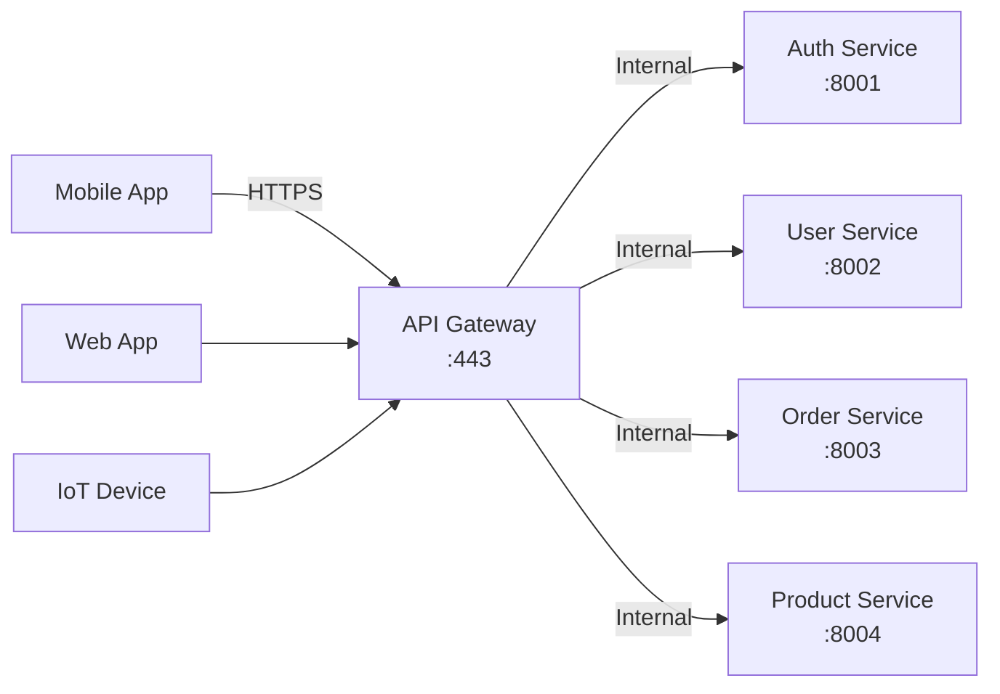
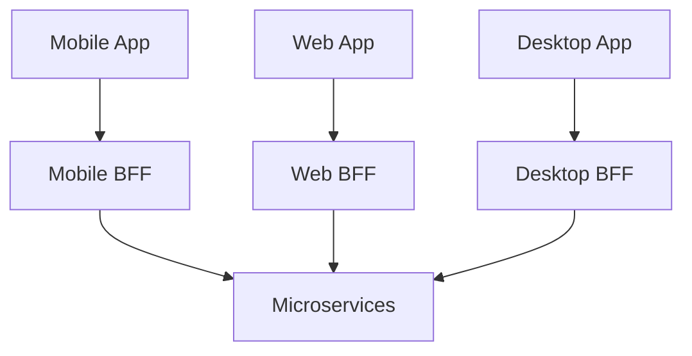
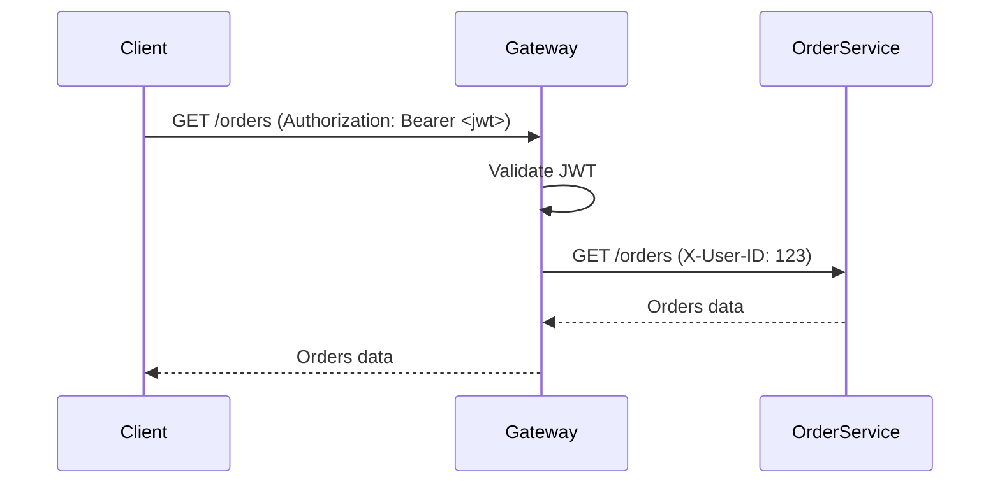

# Day 13: API Gateway & Backend for Frontend (BFF) - The Front Door

## Table of Contents
1. [API Gateway Fundamentals](#1-api-gateway-fundamentals)
2. [Gateway Responsibilities](#2-gateway-responsibilities)
3. [Popular API Gateway Solutions](#3-popular-api-gateway-solutions)
4. [Backend for Frontend (BFF)](#4-backend-for-frontend-bff)
5. [Request Aggregation](#5-request-aggregation)
6. [Authentication & Authorization](#6-authentication--authorization)
7. [Rate Limiting & Throttling](#7-rate-limiting--throttling)
8. [Caching at the Gateway](#8-caching-at-the-gateway)
9. [Production Patterns](#9-production-patterns)
10. [Summary](#10-summary)

---

## 1. API Gateway Fundamentals

### 1.1 What is an API Gateway?

**Definition**: Single entry point for all client requests to backend services.



###1.2 Why API Gateway?

**Without Gateway** (Problems):
```
Mobile App:
- Must know 10+ service URLs
- Handle authentication per service
- Retry logic per service
- Different protocols (REST, gRPC, WebSocket)
```

**With Gateway** (Benefits):
```
Mobile App:
- Single URL: https://api.example.com
- Single auth token
- Gateway handles retries, circuit breaking
- Protocol translation (clients use REST, services use gRPC)
```

### 1.3 Core Responsibilities

```
┌─────────────────────────────────────────┐
│         API Gateway                      │
├─────────────────────────────────────────┤
│ 1. Routing (path → service)             │
│ 2. Authentication & Authorization       │
│ 3. Rate Limiting                         │
│ 4. Request/Response Transformation      │
│ 5. Caching                              │
│ 6. Monitoring & Logging                 │
│ 7. Load Balancing                       │
│ 8. Circuit Breaking                     │
└─────────────────────────────────────────┘
```

---

## 2. Gateway Responsibilities

### 2.1 Routing

**Path-based routing**:
```nginx
# NGINX configuration
location /users {
    proxy_pass http://user-service:8080;
}

location /orders {
    proxy_pass http://order-service:8080;
}

location /products {
    proxy_pass http://product-service:8080;
}
```

**Header-based routing** (A/B testing):
```nginx
# Route based on X-Version header
map $http_x_version $backend {
    "v2" http://service-v2:8080;
    default http://service-v1:8080;
}

server {
    location / {
        proxy_pass $backend;
    }
}
```

### 2.2 Protocol Translation

**Client uses REST, Services use gRPC**:
```
Mobile (REST) → Gateway → Converts to gRPC → User Service (gRPC)
```

**Kong plugin example**:
```yaml
plugins:
  - name: grpc-gateway
    config:
      proto: /path/to/user.proto
```

### 2.3 Request/Response Transformation

**Add headers**:
```python
# Kong plugin (Lua)
kong.service.request.add_header("X-Consumer-ID", consumer.id)
kong.service.request.add_header("X-Request-ID", kong.request.get_request_id())
```

**Transform response**:
```python
# Remove sensitive fields
@app.after_request
def remove_sensitive_data(response):
    if "password_hash" in response.json:
        del response.json["password_hash"]
    return response
```

---

## 3. Popular API Gateway Solutions

### 3.1 Kong (Open Source + Enterprise)

**Features**:
- Plugin ecosystem (100+ plugins)
- Written in Lua/OpenResty (NGINX core)
- Database-backed (Postgres/Cassandra)

**Setup**:
```bash
docker run -d --name kong \
  -e "KONG_DATABASE=off" \
  -e "KONG_PROXY_ACCESS_LOG=/dev/stdout" \
  -p 8000:8000 \
  -p 8443:8443 \
  kong:latest
```

**Add service**:
```bash
curl -X POST http://localhost:8001/services \
  --data name=user-service \
  --data url=http://user-service:8080

curl -X POST http://localhost:8001/services/user-service/routes \
  --data paths[]=/users
```

**Enable rate limiting**:
```bash
curl -X POST http://localhost:8001/services/user-service/plugins \
  --data name=rate-limiting \
  --data config.minute=100
```

### 3.2 AWS API Gateway

**Features**:
- Fully managed (serverless)
- Integrates with Lambda, ALB, EC2
- Built-in caching, throttling

**CloudFormation**:
```yaml
Resources:
  MyApi:
    Type: AWS::ApiGateway::RestApi
    Properties:
      Name: MyAPI
  
  UsersResource:
    Type: AWS::ApiGateway::Resource
    Properties:
      ParentId: !GetAtt MyApi.RootResourceId
      PathPart: users
      RestApiId: !Ref MyApi
  
  UsersMethod:
    Type: AWS::ApiGateway::Method
    Properties:
      HttpMethod: GET
      ResourceId: !Ref UsersResource
      RestApiId: !Ref MyApi
      Integration:
        Type: HTTP_PROXY
        IntegrationHttpMethod: GET
        Uri: http://user-service.internal/users
```

### 3.3 NGINX

**Pros**:
- Lightweight, battle-tested
- Extremely fast

**Cons**:
- Config-heavy (no GUI)
- Limited plugin ecosystem

**Configuration**:
```nginx
http {
    upstream user_service {
        server user-service-1:8080;
        server user-service-2:8080;
        server user-service-3:8080;
    }
    
    server {
        listen 80;
        
        location /users {
            proxy_pass http://user_service;
            proxy_set_header Host $host;
            proxy_set_header X-Real-IP $remote_addr;
        }
    }
}
```

### 3.4 Comparison Table

| Feature | Kong | AWS API Gateway | NGINX | Envoy |
|:--------|:-----|:----------------|:------|:------|
| **Cost** | Free (OSS) | Pay-per-request | Free | Free |
| **Deployment** | Self-hosted | Managed | Self-hosted | Self-hosted |
| **Plugins** | 100+ | AWS-specific | Limited | Filter-based |
| **Performance** | High | Medium | Very High | High |
| **Learning Curve** | Medium | Low | High | High |
| **Use Case** | General | AWS-only | Simple routing | Service Mesh |

---

## 4. Backend for Frontend (BFF)

### 4.1 The Problem: One Size Doesn't Fit All

**Mobile app** needs:
```json
GET /dashboard
{
  "user": {"id": 123, "name": "Alice"},  // Minimal
  "unread_count": 5  // Just the count
}
```

**Web app** needs:
```json
GET /dashboard
{
  "user": {...},  // Full user object
  "activity_feed": [...],  // Last 50 activities
  "analytics": {...},  // Charts data
  "recommendations": [...]  // 20 products
}
```

**Problem**: Single endpoint can't satisfy both efficiently.

### 4.2 BFF Pattern

**Separate gateway per client type**:



### 4.3 Implementation (GraphQL BFF)

**Mobile BFF** (minimalist):
```graphql
# mobile-bff/schema.graphql
type Query {
    dashboard: MobileDashboard
}

type MobileDashboard {
    user: BasicUser
    unreadCount: Int
}

type BasicUser {
    id: ID!
    name: String!
}
```

```python
# mobile-bff/resolvers.py
def resolve_dashboard(root, info):
    user_id = info.context['user_id']
    
    return {
        "user": user_service.get_basic_info(user_id),
        "unreadCount": notification_service.get_count(user_id)
    }
```

**Web BFF** (feature-rich):
```graphql
# web-bff/schema.graphql
type Query {
    dashboard: WebDashboard
}

type WebDashboard {
    user: FullUser
    activityFeed: [Activity!]!
    analytics: Analytics
    recommendations: [Product!]!
}
```

---

## 5. Request Aggregation

### 5.1 The N+1 Problem

**Naive approach** (mobile makes 5 requests):
```
GET /users/123
GET /orders?user_id=123
GET /notifications?user_id=123
GET /payments/recent?user_id=123
GET /recommendations?user_id=123

5 network round-trips = 500ms total latency
```

### 5.2 Aggregation at Gateway

**Single request**:
```python
@app.get("/dashboard")
async def get_dashboard(user_id: int):
    # Parallel requests
    user, orders, notifications, payments = await asyncio.gather(
        get_user(user_id),
        get_orders(user_id),
        get_notifications(user_id),
        get_payments(user_id)
    )
    
    return {
        "user": user,
        "orders": orders,
        "notifications": notifications,
        "payments": payments
    }

async def get_user(user_id):
    async with httpx.AsyncClient() as client:
        response = await client.get(f"http://user-service/users/{user_id}")
        return response.json()
```

**Response**:
```json
{
  "user": {...},
  "orders": [...],
  "notifications": [...],
  "payments": [...]
}
```

---

## 6. Authentication & Authorization

### 6.1 Centralized Auth at Gateway

**Flow**:


**Implementation** (Kong JWT plugin):
```bash
curl -X POST http://localhost:8001/plugins \
  --data name=jwt \
  --data config.secret_is_base64=false
```

**Custom middleware** (Python/FastAPI):
```python
from fastapi import Request, HTTPException
import jwt

@app.middleware("http")
async def auth_middleware(request: Request, call_next):
    token = request.headers.get("Authorization", "").replace("Bearer ", "")
    
    if not token:
        raise HTTPException(status_code=401, detail="No token provided")
    
    try:
        payload = jwt.decode(token, SECRET_KEY, algorithms=["HS256"])
        request.state.user_id = payload['sub']
    except jwt.ExpiredSignatureError:
        raise HTTPException(status_code=401, detail="Token expired")
    
    # Forward to service with user ID
    response = await call_next(request)
    return response
```

### 6.2 OAuth Integration

```python
# Gateway handles OAuth
@app.get("/login")
def login():
    redirect_uri = "https://api.example.com/callback"
    return redirect(f"https://github.com/login/oauth/authorize?client_id={CLIENT_ID}&redirect_uri={redirect_uri}")

@app.get("/callback")
def callback(code: str):
    # Exchange code for token
    token_response = requests.post(
        "https://github.com/login/oauth/access_token",
        data={"client_id": CLIENT_ID, "client_secret": CLIENT_SECRET, "code": code}
    )
    
    access_token = token_response.json()['access_token']
    
    # Fetch user info
    user_response = requests.get(
        "https://api.github.com/user",
        headers={"Authorization": f"Bearer {access_token}"}
    )
    
    user = user_response.json()
    
    # Create internal JWT
    jwt_token = create_jwt(user['id'])
    
    return {"token": jwt_token}
```

---

## 7. Rate Limiting & Throttling

### 7.1 Why Rate Limit?

**Prevent abuse**:
- DDoS protection
- Fair resource allocation
- Cost control (pay-per-request APIs)

### 7.2 Algorithms

#### Fixed Window
```python
# Simple, but has burst problem
redis_key = f"rate_limit:{user_id}:{current_minute}"
count = redis.incr(redis_key)
redis.expire(redis_key, 60)

if count > 100:
    return 429  # Too Many Requests
```

**Problem**: 100 requests at 00:59, 100 at 01:00 = 200 in 1 second.

#### Sliding Window Log
```python
# Accurate, but memory-intensive
current_time = time.time()
window_start = current_time - 60  # Last 60 seconds

# Remove old entries
redis.zremrangebyscore(f"rate_limit:{user_id}", 0, window_start)

# Count requests in window
count = redis.zcard(f"rate_limit:{user_id}")

if count >= 100:
    return 429

# Add current request
redis.zadd(f"rate_limit:{user_id}", {current_time: current_time})
redis.expire(f"rate_limit:{user_id}", 60)
```

#### Token Bucket (Kong uses this)
```python
class TokenBucket:
    def __init__(self, capacity, refill_rate):
        self.capacity = capacity
        self.tokens = capacity
        self.refill_rate = refill_rate  # tokens per second
        self.last_refill = time.time()
    
    def consume(self, tokens=1):
        self._refill()
        
        if self.tokens >= tokens:
            self.tokens -= tokens
            return True
        return False
    
    def _refill(self):
        now = time.time()
        elapsed = now - self.last_refill
        refill_amount = elapsed * self.refill_rate
        self.tokens = min(self.capacity, self.tokens + refill_amount)
        self.last_refill = now
```

### 7.3 Kong Rate Limiting

**Per consumer**:
```bash
curl -X POST http://localhost:8001/plugins \
  --data name=rate-limiting \
  --data config.second=5 \
  --data config.minute=100 \
  --data config.policy=redis
```

**Response headers**:
```
 X-RateLimit-Limit-Minute: 100
X-RateLimit-Remaining-Minute: 87
```

---

## 8. Caching at the Gateway

### 8.1 Why Cache at Gateway?

**Before caching**:
```
Every GET /products → Product Service → Database → 50ms
1000 requests/sec = 1000 DB queries/sec
```

**After caching**:
```
First GET /products → Product Service → Database → Cache
Next 999 requests → Cache → 1ms

Database: 1 query/sec (99.9% reduction!)
```

### 8.2 Implementation (NGINX)

```nginx
proxy_cache_path /var/cache/nginx keys_zone=api_cache:10m max_size=1g;

server {
    location /products {
        proxy_cache api_cache;
        proxy_cache_valid 200 5m;  # Cache 200 responses for 5 minutes
        proxy_cache_key "$request_uri$is_args$args";
        proxy_pass http://product-service;
        
        add_header X-Cache-Status $upstream_cache_status;
    }
}
```

**Response headers**:
```
X-Cache-Status: HIT  (served from cache)
X-Cache-Status: MISS (fetched from service)
```

### 8.3 Cache Invalidation

**Problem**: Product updated → stale cache.

**Solution 1: TTL** (time-based):
```nginx
proxy_cache_valid 200 1m;  # Expire after 1 minute
```

**Solution 2: Purge API**:
```python
# Product Service notifies gateway after update
@app.put("/products/{id}")
def update_product(id, data):
    db.update(id, data)
    
    # Purge cache
    requests.post(f"http://gateway:8001/cache/purge/products/{id}")
```

---

## 9. Production Patterns

### 9.1 High Availability

**Multiple gateway instances**:
```
             Load Balancer
                  |
      +-----------+-----------+
      |           |           |
   Gateway1    Gateway2    Gateway3
```

**Kong cluster** (database-backed):
```yaml
# docker-compose.yml
version: '3'
services:
  kong1:
    image: kong:latest
    environment:
      KONG_DATABASE: postgres
      KONG_PG_HOST: postgres
  
  kong2:
    image: kong:latest
    environment:
      KONG_DATABASE: postgres
      KONG_PG_HOST: postgres
```

### 9.2 Circuit Breaking

```nginx
# NGINX  upstream {
    server service1:8080 max_fails=3 fail_timeout=30s;
    server service2:8080 max_fails=3 fail_timeout=30s;
}
```

**Kong circuit breaker**:
```bash
curl -X POST http://localhost:8001/plugins \
  --data name=circuit-breaker \
  --data config.max_failures=5 \
  --data config.window_size=60
```

### 9.3 Observability

**Logging**:
```nginx
log_format gateway '$remote_addr - $remote_user [$time_local] '
                    '"$request" $status $body_bytes_sent '
                    '"$http_referer" "$http_user_agent" '
                    'rt=$request_time uct="$upstream_connect_time"';

access_log /var/log/nginx/access.log gateway;
```

**Metrics** (Prometheus + Kong):
```bash
curl -X POST http://localhost:8001/plugins \
  --data name=prometheus
```

**Traces** (OpenTelemetry):
```python
from opentelemetry import trace

tracer = trace.get_tracer(__name__)

@app.get("/orders")
async def get_orders(user_id: int):
    with tracer.start_as_current_span("get_orders"):
        orders = await order_service.get(user_id)
        return orders
```

---

## 10. Summary

### 10.1 Key Takeaways

1. ✅ **API Gateway** - Single entry point for all clients
2. ✅ **BFF Pattern** - Separate gateway per client type
3. ✅ **Request Aggregation** - Reduce client round-trips
4. ✅ **Centralized Auth** - Validate once at gateway
5. ✅ **Rate Limiting** - Token bucket > fixed window
6. ✅ **Caching** - Reduce backend load drastically
7. ✅ **High Availability** - Multiple gateway instances

### 10.2 Gateway Selection Guide

| Use Case | Recommendation |
|:---------|:---------------|
| AWS-only | AWS API Gateway |
| Need plugins | Kong |
| Simple routing | NGINX |
| Service Mesh | Envoy |
| Serverless | AWS API Gateway, Azure APIM |

### 10.3 Tomorrow (Day 14): Event-Driven Architecture

- **Message Queues**: RabbitMQ, Kafka, AWS SQS
- **Event Patterns**: Pub/Sub, Competing Consumers
- **Event Sourcing**: Store events, not state
- **Saga Pattern**: Event choreography
- **Dead Letter Queues**: Handling failures

See you tomorrow! 🚀

---

**File Statistics**: ~1050 lines | API Gateway & BFF mastered ✅
