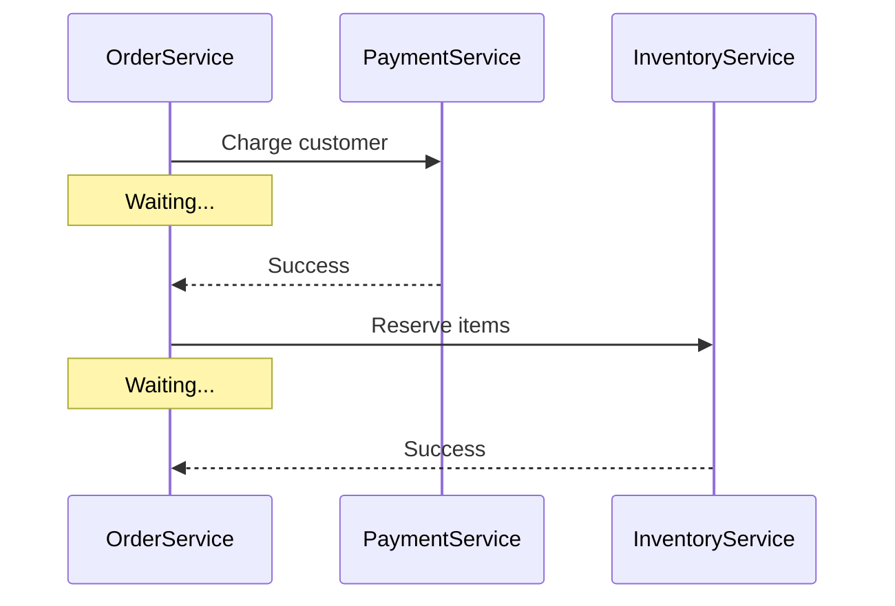
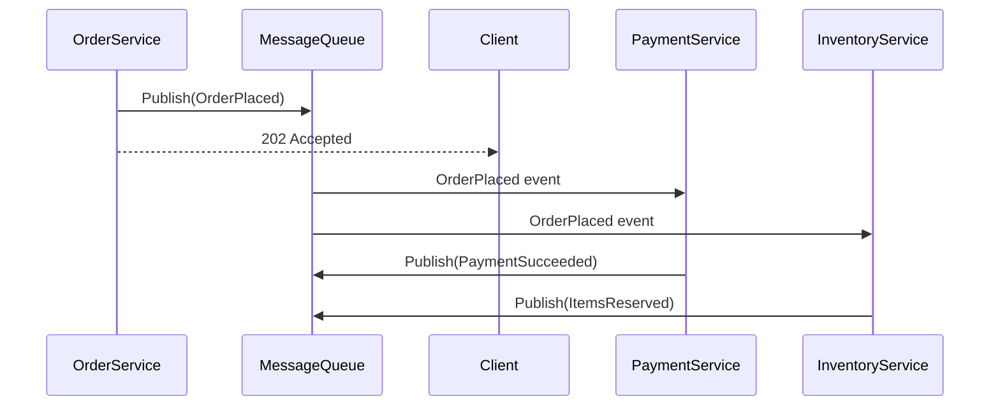
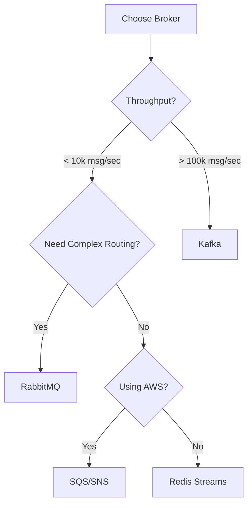

# Day 14: Event-Driven Architecture & Message Brokers

## Table of Contents
1. [Event-Driven Architecture Fundamentals](#1-event-driven-architecture-fundamentals)
2. [Message Brokers Overview](#2-message-brokers-overview)
3. [RabbitMQ Deep Dive](#3-rabbitmq-deep-dive)
4. [Apache Kafka Deep Dive](#4-apache-kafka-deep-dive)
5. [Event Patterns](#5-event-patterns)
6. [Choosing the Right Broker](#6-choosing-the-right-broker)
7. [Production Patterns](#7-production-patterns)
8. [Dead Letter Queues](#8-dead-letter-queues)
9. [Event Schema Evolution](#9-event-schema-evolution)
10. [Summary](#10-summary)

---

## 1. Event-Driven Architecture Fundamentals

### 1.1 Request-Response vs Event-Driven

**Request-Response** (Synchronous):


**Problem**: Tight coupling, cascading failures.

**Event-Driven** (Asynchronous):


**Benefits**:
- Services decoupled
- Order Service doesn't wait
- Resilient to failures

### 1.2 Key Concepts

**Event**: Something that happened (past tense).
```json
{
  "event_type": "OrderPlaced",
  "event_id": "evt_123",
  "timestamp": "2024-01-01T00:00:00Z",
  "data": {
    "order_id": 456,
    "user_id": 123,
    "total": 99.99
  }
}
```

**Producer**: Publishes events.  
**Consumer**: Listens to and processes events.  
**Broker**: Middleman that routes events.

---

## 2. Message Brokers Overview

### 2.1 Comparison Table

| Feature | RabbitMQ | Kafka | AWS SQS/SNS | Redis Streams |
|:--------|:---------|:------|:------------|:--------------|
| **Model** | Queue | Log | Queue/Topic | Log |
| **Ordering** | Per queue | Per partition | FIFO queues | Per stream |
| **Retention** | Until consumed | Days/weeks | 14 days max | Configurable |
| **Throughput** | 10k-50k msg/sec | 1M+ msg/sec | Unlimited (managed) | 100k+ msg/sec |
| **Use Case** | Worker queues | Event streaming | Serverless | Lightweight |
| **Persistence** | Disk | Disk | Managed | Disk/Memory |

### 2.2 When to Use What

**RabbitMQ**:
- Traditional job queues
- Complex routing
- Message priority

**Kafka**:
- Event streaming
- High throughput
- Replay events

**AWS SQS**:
- Serverless (Lambda)
- AWS-only
- Simple queues

---

## 3. RabbitMQ Deep Dive

### 3.1 Core Concepts

```
Producer → Exchange → Queue → Consumer
```

**Exchange Types**:
1. **Direct**: Routing key exact match
2. **Fanout**: Broadcast to all queues
3. **Topic**: Routing key pattern match
4. **Headers**: Match message headers

### 3.2 Direct Exchange

```python
import pika

connection = pika.BlockingConnection(pika.ConnectionParameters('localhost'))
channel = connection.channel()

# Declare queue
channel.queue_declare(queue='orders')

# Publish message
channel.basic_publish(
    exchange='',
    routing_key='orders',
    body='{"order_id": 123}'
)

print("Sent order")
connection.close()
```

**Consumer**:
```python
def callback(ch, method, properties, body):
    print(f"Received: {body}")
    ch.basic_ack(delivery_tag=method.delivery_tag)

channel.basic_consume(queue='orders', on_message_callback=callback)
print("Waiting for messages...")
channel.start_consuming()
```

### 3.3 Fanout Exchange (Pub/Sub)

```python
# Publisher
channel.exchange_declare(exchange='notifications', exchange_type='fanout')

channel.basic_publish(
    exchange='notifications',
    routing_key='',  # Ignored in fanout
    body='User logged in'
)

# Subscribers
# Email Service
channel.queue_declare(queue='email_queue')
channel.queue_bind(exchange='notifications', queue='email_queue')

# SMS Service
channel.queue_declare(queue='sms_queue')
channel.queue_bind(exchange='notifications', queue='sms_queue')
```

**Result**: Both services receive the event.

### 3.4 Topic Exchange (Pattern Matching)

```python
channel.exchange_declare(exchange='events', exchange_type='topic')

# Publisher
channel.basic_publish(
    exchange='events',
    routing_key='order.placed.us',
    body='...'
)

# Consumers
# Match all order events
channel.queue_bind(exchange='events', queue='analytics', routing_key='order.*')

# Match only US orders
channel.queue_bind(exchange='events', queue='us_orders', routing_key='order.*.us')

# Match all events
channel.queue_bind(exchange='events', queue='audit_log', routing_key='#')
```

### 3.5 Acknowledgments

```python
# Manual ACK (recommended)
def callback(ch, method, properties, body):
    try:
        process_message(body)
        ch.basic_ack(delivery_tag=method.delivery_tag)
    except Exception as e:
        # Negative ACK (requeue)
        ch.basic_nack(delivery_tag=method.delivery_tag, requeue=True)

channel.basic_consume(queue='orders', on_message_callback=callback, auto_ack=False)
```

---

## 4. Apache Kafka Deep Dive

### 4.1 Architecture

```
Topic: orders
┌─────────────────────────────────────────┐
│ Partition 0: [msg0, msg1, msg2, msg3...] │
│ Partition 1: [msg4, msg5, msg6, msg7...] │
│ Partition 2: [msg8, msg9, msg10, ...]    │
└─────────────────────────────────────────┘
```

**Key Concepts**:
- **Topic**: Category of messages (like `orders`, `payments`)
- **Partition**: Topic split for parallelism
- **Offset**: Message position in partition
- **Consumer Group**: Multiple consumers share work

### 4.2 Producer

```python
from kafka import KafkaProducer
import json

producer = KafkaProducer(
    bootstrap_servers='localhost:9092',
    value_serializer=lambda v: json.dumps(v).encode('utf-8')
)

# Send message
producer.send('orders', {
    "order_id": 123,
    "user_id": 456,
    "total": 99.99
})

producer.flush()
```

**With key** (ensures same-key messages go to same partition):
```python
producer.send(
    'orders',
    key=str(user_id).encode('utf-8'),  # Key
    value=order_data
)
# All orders for user 456 → same partition → ordered!
```

### 4.3 Consumer

```python
from kafka import KafkaConsumer

consumer = KafkaConsumer(
    'orders',
    bootstrap_servers='localhost:9092',
    group_id='payment-service',
    auto_offset_reset='earliest',
    value_deserializer=lambda m: json.loads(m.decode('utf-8'))
)

for message in consumer:
    order = message.value
    print(f"Processing order {order['order_id']}")
    charge_customer(order)
```

### 4.4 Consumer Groups

```
Topic: orders (3 partitions)
Consumer Group: payment-service (3 consumers)

Partition 0 → Consumer 1
Partition 1 → Consumer 2
Partition 2 → Consumer 3

(Each partition read by ONE consumer in the group)
```

**Scaling**: Add consumer → automatic rebalance.

```python
# 3 consumers in same group
consumer1 = KafkaConsumer('orders', group_id='payment-service')  # Gets partition 0
consumer2 = KafkaConsumer('orders', group_id='payment-service')  # Gets partition 1
consumer3 = KafkaConsumer('orders', group_id='payment-service')  # Gets partition 2
```

### 4.5 Offset Management

```python
# Manual commit (at-least-once delivery)
for message in consumer:
    try:
        process(message)
        consumer.commit()
    except Exception:
        # Don't commit → message will be retried
        pass
```

**Automatic commit** (easier, but risk of data loss):
```python
consumer = KafkaConsumer(
    'orders',
    enable_auto_commit=True,
    auto_commit_interval_ms=5000  # Commit every 5 seconds
)
```

### 4.6 Kafka Retention

**Time-based**:
```
retention.ms=604800000  # 7 days
```

**Size-based**:
```
retention.bytes=1073741824  # 1 GB per partition
```

**Replaying events**:
```python
# Start from beginning
consumer = KafkaConsumer(
    'orders',
    auto_offset_reset='earliest'  # Replay all events
)
```

---

## 5. Event Patterns

### 5.1 Pub/Sub (Multiple Consumers)

**RabbitMQ** (Fanout):
```python
# Publisher publishes once
publish_event("UserRegistered", user_data)

# Multiple services listen
# Email Service → Send welcome email
# Analytics Service → Track new user
# CRM Service → Create customer record
```

**Kafka** (Multiple Consumer Groups):
```python
# Each consumer group gets ALL messages
email_consumer = KafkaConsumer('user_events', group_id='email-service')
analytics_consumer = KafkaConsumer('user_events', group_id='analytics-service')
```

### 5.2 Competing Consumers (Load Balancing)

**RabbitMQ**:
```python
# 3 workers consuming from same queue
# Message processed by ONE worker

worker1 = consume_queue('image_processing')
worker2 = consume_queue('image_processing')
worker3 = consume_queue('image_processing')
```

**Kafka**:
```python
# 3 consumers in same group
# Each gets subset of partitions

worker1 = KafkaConsumer('jobs', group_id='workers')  # Partition 0
worker2 = KafkaConsumer('jobs', group_id='workers')  # Partition 1
worker3 = KafkaConsumer('jobs', group_id='workers')  # Partition 2
```

### 5.3 Request-Reply Pattern

**RabbitMQ**:
```python
# Requester
correlation_id = str(uuid.uuid4())
callback_queue = channel.queue_declare(queue='', exclusive=True).method.queue

channel.basic_publish(
    exchange='',
    routing_key='rpc_queue',
    properties=pika.BasicProperties(
        reply_to=callback_queue,
        correlation_id=correlation_id
    ),
    body='compute(42)'
)

# Worker
def on_request(ch, method, props, body):
    result = expensive_computation(body)
    
    ch.basic_publish(
        exchange='',
        routing_key=props.reply_to,
        properties=pika.BasicProperties(correlation_id=props.correlation_id),
        body=str(result)
    )
    ch.basic_ack(delivery_tag=method.delivery_tag)
```

---

## 6. Choosing the Right Broker

### 6.1 Decision Matrix



### 6.2 Use Case Examples

**E-commerce Order Processing**:
- **Broker**: RabbitMQ
- **Why**: Complex routing (priority orders), moderate throughput

**Real-time Analytics**:
- **Broker**: Kafka
- **Why**: High throughput, need to replay events

**Serverless Background Jobs**:
- **Broker**: AWS SQS + Lambda
- **Why**: Fully managed, auto-scales

### 6.3 Kafka vs RabbitMQ Detailed

**Kafka Strengths**:
- Massive throughput (1M+ msg/sec)
- Persistent log (replay events)
- Consumer manages offset (flexibility)

**RabbitMQ Strengths**:
- Lower latency (< 1ms)
- Complex routing (topic exchanges)
- Traditional queue behavior (message deleted after ACK)

**Example**: Uber likely uses Kafka for trip events (billions/day), RabbitMQ for driver notifications (low latency).

---

## 7. Production Patterns

### 7.1 Idempotent Consumers

**Problem**: Message processed twice due to retry.

```python
# Bad: Charge customer twice
def process_order(order):
    charge_customer(order.total)
```

**Solution**: Idempotency key
```python
def process_order(order):
    # Check if already processed
    if redis.get(f"processed:{order.id}"):
        return
    
    charge_customer(order.total)
    
    # Mark as processed
    redis.setex(f"processed:{order.id}", 86400, "1")  # 1 day TTL
```

### 7.2 Dead Letter Queues (DLQ)

**Problem**: Message fails repeatedly (poison pill).

```python
# RabbitMQ DLQ
channel.queue_declare(queue='orders', arguments={
    'x-dead-letter-exchange': 'dlx',
    'x-dead-letter-routing-key': 'orders_dlq'
})

# Consumer
def callback(ch, method, properties, body):
    try:
        process(body)
        ch.basic_ack(delivery_tag=method.delivery_tag)
    except Exception:
        # Reject (goes to DLQ after max retries)
        ch.basic_nack(delivery_tag=method.delivery_tag, requeue=False)
```

### 7.3 Saga Pattern (Event Choreography)

```python
# Order Service
@app.post("/orders")
def create_order(order_data):
    order = db.create(order_data)
    
    publish_event("OrderCreated", {
        "order_id": order.id,
        "user_id": order.user_id,
        "total": order.total
    })
    
    return {"order_id": order.id, "status": "pending"}

# Payment Service (listens)
@consume_event("OrderCreated")
def handle_order_created(event):
    try:
        charge_customer(event['user_id'], event['total'])
        publish_event("PaymentSucceeded", event)
    except:
        publish_event("PaymentFailed", event)

# Order Service (listens to payment events)
@consume_event("PaymentFailed")
def handle_payment_failed(event):
    # Compensate: Cancel order
    db.update(event['order_id'], status="canceled")
    publish_event("OrderCanceled", event)
```

---

## 8. Dead Letter Queues

### 8.1 DLQ Strategies

**Immediate DLQ** (no retries):
```python
try:
    process(message)
except ValidationError:
    # Unrecoverable error → DLQ immediately
    send_to_dlq(message)
```

**Retry with backoff**:
```python
MAX_RETRIES = 3

def process_with_retry(message):
    retries = get_retry_count(message)
    
    if retries >= MAX_RETRIES:
        send_to_dlq(message)
        return
    
    try:
        process(message)
    except TransientError:
        # Increment retry count
        increment_retry(message)
        
        # Delay before requeue (exponential backoff)
        delay = 2 ** retries  # 1s, 2s, 4s
        requeue_with_delay(message, delay)
```

### 8.2 DLQ Monitoring

```python
# Alert if DLQ grows
dlq_size = get_queue_size('orders_dlq')

if dlq_size > 100:
    alert("High DLQ count", {
        "queue": "orders_dlq",
        "size": dlq_size
    })
```

---

## 9. Event Schema Evolution

### 9.1 The Problem

**V1 Event**:
```json
{
  "event_type": "UserRegistered",
  "user_id": 123,
  "email": "alice@example.com"
}
```

**V2 Event** (added field):
```json
{
  "event_type": "UserRegistered",
  "user_id": 123,
  "email": "alice@example.com",
  "phone": "+1234567890"  // New field
}
```

**Problem**: Old consumers crash on new field.

### 9.2 Solution: Schema Registry

**Avro Schema**:
```json
{
  "type": "record",
  "name": "UserRegistered",
  "fields": [
    {"name": "user_id", "type": "int"},
    {"name": "email", "type": "string"},
    {"name": "phone", "type": ["null", "string"], "default": null}  // Optional
  ]
}
```

**Kafka + Schema Registry**:
```python
from confluent_kafka.avro import AvroProducer

producer = AvroProducer({
    'bootstrap.servers': 'localhost:9092',
    'schema.registry.url': 'http://localhost:8081'
})

producer.produce(
    topic='user_events',
    value={"user_id": 123, "email": "alice@example.com", "phone": "+123"}
)
```

**Old consumer** (ignores new field):
```python
# Still works! Avro handles backward compatibility
consumer.consume()  # Gets user_id, email (ignores phone)
```

---

## 10. Summary

### 10.1 Key Takeaways

1. ✅ **Event-Driven** - Decouples services, async communication
2. ✅ **RabbitMQ** - Complex routing, traditional queues
3. ✅ **Kafka** - High throughput, event streaming, replay
4. ✅ **Consumer Groups** - Parallel processing (Kafka)
5. ✅ **Idempotency** - Handle duplicate messages
6. ✅ **DLQ** - Isolate poison pills
7. ✅ **Schema Evolution** - Avro, backward compatibility

### 10.2 Event-Driven Best Practices

✅ **Do**:
- Use correlation IDs (trace events)
- Implement idempotent consumers
- Monitor DLQs
- Version events (V1, V2)

❌ **Don't**:
- Put large payloads in events (use reference IDs)
- Expect immediate consistency
- Skip retry logic

### 10.3 Tomorrow (Day 15): Event Sourcing & CQRS

- **Event Sourcing**: Store events, not state
- **Event Store**: Append-only log
- **Projections**: Build read models from events
- **CQRS**: Separate read/write models
- **Snapshotting**: Optimize replays
- **Temporal Queries**: "What was balance on Jan 1?"

See you tomorrow! 🚀

---

**File Statistics**: ~1100 lines | Event-Driven Architecture mastered ✅
