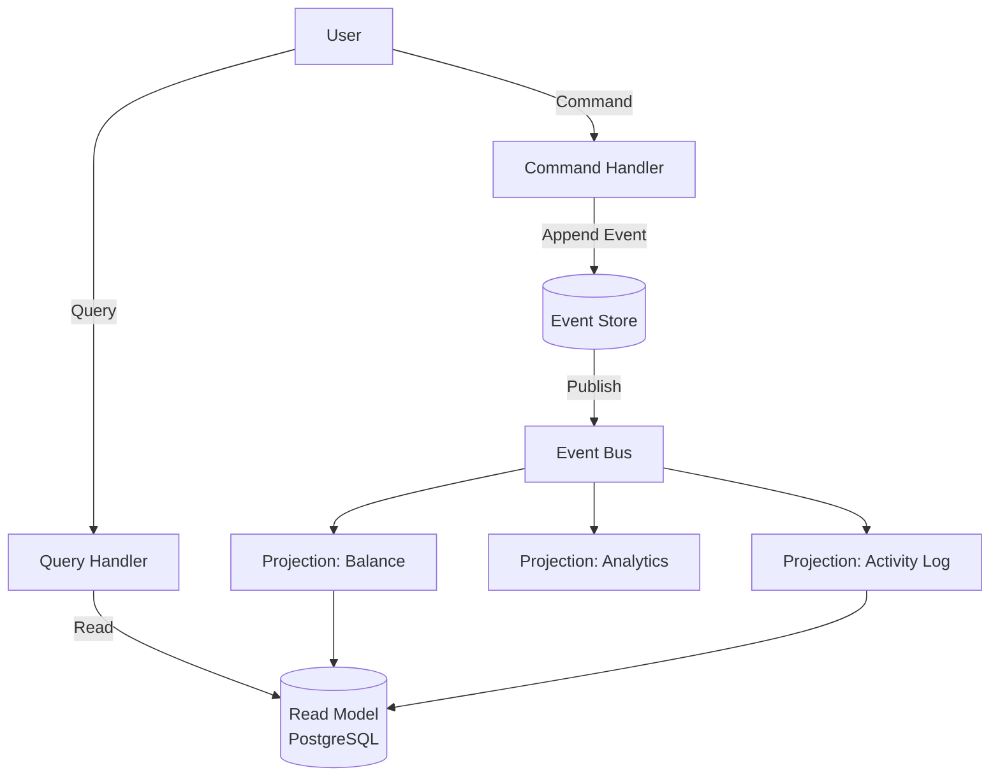

# Day 15: Event Sourcing & CQRS - Rethinking Data Architecture

## Table of Contents
1. [Event Sourcing Fundamentals](#1-event-sourcing-fundamentals)
2. [Event Store Implementation](#2-event-store-implementation)
3. [Projections & Read Models](#3-projections--read-models)
4. [CQRS Deep Dive](#4-cqrs-deep-dive)
5. [Snapshotting](#5-snapshotting)
6. [Temporal Queries](#6-temporal-queries)
7. [Combining Event Sourcing + CQRS](#7-combining-event-sourcing--cqrs)
8. [Production Patterns](#8-production-patterns)
9. [Trade-offs & When to Use](#9-trade-offs--when-to-use)
10. [Summary](#10-summary)

---

## 1. Event Sourcing Fundamentals

### 1.1 Traditional vs Event Sourcing

**Traditional (State-based)**:
```sql
users table:
id | name  | balance
1  | Alice | 100

UPDATE users SET balance = 150 WHERE id = 1;
-- Previous balance (100) is lost!
```

**Event Sourcing (Event-based)**:
```
Events:
1. AccountCreated {user_id: 1, initial_balance: 100}
2. FundsDeposited {user_id: 1, amount: 50}

Current State = Replay all events
balance = 100 + 50 = 150
```

**Key Insight**: Store **what happened** (events), not **current state**.

### 1.2 Benefits

✅ **Complete Audit Trail**
```
Who deposited $50?
When did balance become negative?
→ Replay events to find out
```

✅ **Time Travel**
```
What was Alice's balance on Jan 1, 2024?
→ Replay events up to Jan 1
```

✅ **Bug Recovery**
```
Bug: Incorrectly deducted $1000
Fix: Delete bad event, replay → correct state
```

✅ **New Features Without Migration**
```
New feature: "Total deposits last year"
→ Replay all Deposited events, sum amounts
```

### 1.3 Drawbacks

❌ **Complexity**: Harder to understand than CRUD  
❌ **Event Schema Migration**: Evolving events is tricky  
❌ **Performance**: Replaying millions of events is slow (solved with snapshots)

---

## 2. Event Store Implementation

### 2.1 Simple Event Store (SQL)

```sql
CREATE TABLE events (
    id SERIAL PRIMARY KEY,
    aggregate_id VARCHAR(36) NOT NULL,  -- e.g., user_123
    aggregate_type VARCHAR(50) NOT NULL,  -- e.g., User
    event_type VARCHAR(50) NOT NULL,  -- e.g., FundsDeposited
    event_data JSONB NOT NULL,
    version INT NOT NULL,  -- Optimistic locking
    created_at TIMESTAMP DEFAULT NOW()
);

CREATE INDEX idx_aggregate ON events (aggregate_id, aggregate_type);
```

**Storing events**:
```python
def append_event(aggregate_id, event_type, event_data):
    db.execute("""
        INSERT INTO events (aggregate_id, aggregate_type, event_type, event_data, version)
        VALUES (?, 'User', ?, ?, 
            (SELECT COALESCE(MAX(version), 0) + 1 FROM events WHERE aggregate_id = ?))
    """, (aggregate_id, event_type, json.dumps(event_data), aggregate_id))
```

### 2.2 Reading Events

```python
def get_events(aggregate_id):
    rows = db.execute("""
        SELECT event_type, event_data, created_at
        FROM events
        WHERE aggregate_id = ?
        ORDER BY version ASC
    """, (aggregate_id,)).fetchall()
    
    return [
        {"type": row[0], "data": json.loads(row[1]), "timestamp": row[2]}
        for row in rows
    ]
```

### 2.3 Aggregate Reconstruction

```python
class User:
    def __init__(self, user_id):
        self.id = user_id
        self.balance = 0
        self.status = "active"
    
    def apply_event(self, event):
        if event['type'] == 'AccountCreated':
            self.balance = event['data']['initial_balance']
        
        elif event['type'] == 'FundsDeposited':
            self.balance += event['data']['amount']
        
        elif event['type'] == 'FundsWithdrawn':
            self.balance -= event['data']['amount']
        
        elif event['type'] == 'AccountClosed':
            self.status = "closed"

def load_user(user_id):
    user = User(user_id)
    events = get_events(user_id)
    
    for event in events:
        user.apply_event(event)
    
    return user

# Usage
user = load_user("user_123")
print(user.balance)  # Current balance after replaying all events
```

### 2.4 Dedicated Event Stores

**EventStoreDB**:
```python
from eventstoredb import EventStoreDBClient

client = EventStoreDBClient(uri="esdb://localhost:2113")

# Append event
client.append_to_stream(
    stream_name="user-123",
    events=[{
        "type": "FundsDeposited",
        "data": {"amount": 50}
    }]
)

# Read events
events = client.read_stream(stream_name="user-123")
for event in events:
    print(event.type, event.data)
```

---

## 3. Projections & Read Models

### 3.1 The Problem

**Querying events is slow**:
```python
# Find all users with balance > 1000
users = []
for user_id in all_user_ids:
    user = load_user(user_id)  # Replay events (slow!)
    if user.balance > 1000:
        users.append(user)
# Takes minutes for 1 million users
```

### 3.2 Solution: Projections

**Build read-optimized view** from events:

```python
# Projection: users_balance (materialized view)
CREATE TABLE users_balance (
    user_id VARCHAR(36) PRIMARY KEY,
    balance NUMERIC,
    last_updated TIMESTAMP
);

# Event handler updates projection
@event_handler("FundsDeposited")
def on_funds_deposited(event):
    db.execute("""
        INSERT INTO users_balance (user_id, balance, last_updated)
        VALUES (?, ?, NOW())
        ON CONFLICT (user_id) DO UPDATE
        SET balance = users_balance.balance + ?,
            last_updated = NOW()
    """, (event['user_id'], event['amount'], event['amount']))

@event_handler("FundsWithdrawn")
def on_funds_withdrawn(event):
    db.execute("""
        UPDATE users_balance
        SET balance = balance - ?, last_updated = NOW()
        WHERE user_id = ?
    """, (event['amount'], event['user_id']))
```

**Fast queries**:
```sql
-- Instant!
SELECT * FROM users_balance WHERE balance > 1000;
```

### 3.3 Multiple Projections

**Projection 1: users_balance** (for balance queries)
**Projection 2: user_activity** (for recent transactions)

```python
CREATE TABLE user_activity (
    user_id VARCHAR(36),
    activity_type VARCHAR(50),
    amount NUMERIC,
    timestamp TIMESTAMP
);

@event_handler("FundsDeposited")
def log_activity(event):
    db.execute("""
        INSERT INTO user_activity (user_id, activity_type, amount, timestamp)
        VALUES (?, 'deposit', ?, NOW())
    """, (event['user_id'], event['amount']))
```

**Query**:
```sql
SELECT * FROM user_activity 
WHERE user_id = 'user_123' 
ORDER BY timestamp DESC 
LIMIT 10;
```

---

## 4. CQRS Deep Dive

### 4.1 Traditional Architecture

```
User → Controller → Service Layer → Database
                                      ↓
                                  Read/Write same tables
```

**Problem**: Read queries interfere with writes.

### 4.2 CQRS (Command Query Responsibility Segregation)

```
Commands (Writes):
User → CreateOrderCommand → Order Service → Event Store

Queries (Reads):
User → GetOrdersQuery → Query Service → Read Model (Projection)
```

### 4.3 Implementation

**Command Side** (writes):
```python
class CreateOrderCommand:
    def __init__(self, user_id, items):
        self.user_id = user_id
        self.items = items

class OrderCommandHandler:
    def handle(self, command):
        order_id = str(uuid.uuid4())
        
        # Append event
        event_store.append(order_id, {
            "type": "OrderCreated",
            "data": {
                "order_id": order_id,
                "user_id": command.user_id,
                "items": command.items
            }
        })
        
        return order_id
```

**Query Side** (reads):
```python
class GetUserOrdersQuery:
    def __init__(self, user_id):
        self.user_id = user_id

class OrderQueryHandler:
    def handle(self, query):
        # Read from projection (fast!)
        return db.execute("""
            SELECT * FROM orders_view WHERE user_id = ?
        """, (query.user_id,)).fetchall()
```

### 4.4 Separate Databases (Advanced)

```
Write Model:
- Event Store (PostgreSQL)
- Optimized for writes

Read Model:
- Elasticsearch (full-text search)
- Redis (caching)
- Denormalized SQL (fast joins)
```

**Asynchronous update**:
```
Event Store → Kafka → Projection Service → Elasticsearch
```

---

## 5. Snapshotting

### 5.1 The Performance Problem

**Without snapshots**:
```python
# 1 million events
user = load_user("user_123")  # Replays 1M events (slow!)
```

### 5.2 Snapshot Pattern

**Store periodic checkpoints**:

```sql
CREATE TABLE snapshots (
    aggregate_id VARCHAR(36) PRIMARY KEY,
    aggregate_type VARCHAR(50),
    version INT,  -- Event version at snapshot time
    snapshot_data JSONB,
    created_at TIMESTAMP
);
```

**Create snapshot**:
```python
def create_snapshot(user):
    db.execute("""
        INSERT INTO snapshots (aggregate_id, aggregate_type, version, snapshot_data)
        VALUES (?, 'User', ?, ?)
        ON CONFLICT (aggregate_id) DO UPDATE
        SET version = ?, snapshot_data = ?
    """, (user.id, user.version, json.dumps(user.__dict__), user.version, json.dumps(user.__dict__)))
```

**Load with snapshot**:
```python
def load_user_optimized(user_id):
    # 1. Load snapshot
    snapshot = db.execute("""
        SELECT version, snapshot_data FROM snapshots WHERE aggregate_id = ?
    """, (user_id,)).fetchone()
    
    if snapshot:
        user = User.from_snapshot(json.loads(snapshot[1]))
        version_after_snapshot = snapshot[0]
    else:
        user = User(user_id)
        version_after_snapshot = 0
    
    # 2. Replay events AFTER snapshot
    events = db.execute("""
        SELECT event_type, event_data
        FROM events
        WHERE aggregate_id = ? AND version > ?
        ORDER BY version ASC
    """, (user_id, version_after_snapshot)).fetchall()
    
    for event in events:
        user.apply_event({"type": event[0], "data": json.loads(event[1])})
    
    return user
```

**Performance**:
```
Without snapshot: Replay 1M events → 10 seconds
With snapshot (every 1000 events): Replay < 1000 events → < 10ms
```

### 5.3 Snapshot Strategy

**Option 1: Every N events**
```python
if user.version % 1000 == 0:
    create_snapshot(user)
```

**Option 2: Time-based** (daily)
```python
if last_snapshot_time < now() - 1 day:
    create_snapshot(user)
```

---

## 6. Temporal Queries

### 6.1 Point-in-Time Queries

**Question**: What was Alice's balance on Jan 1, 2024?

```python
def get_balance_at(user_id, timestamp):
    user = User(user_id)
    
    events = db.execute("""
        SELECT event_type, event_data
        FROM events
        WHERE aggregate_id = ? AND created_at <= ?
        ORDER BY version ASC
    """, (user_id, timestamp)).fetchall()
    
    for event in events:
        user.apply_event({"type": event[0], "data": json.loads(event[1])})
    
    return user.balance

# Usage
balance = get_balance_at("user_123", "2024-01-01 00:00:00")
```

### 6.2 Audit & Compliance

**Track every change**:
```python
def get_audit_trail(user_id):
    events = get_events(user_id)
    
    for event in events:
        print(f"{event['timestamp']}: {event['type']} - {event['data']}")

# Output:
# 2024-01-01 10:00:00: AccountCreated - {initial_balance: 100}
# 2024-01-05 14:30:00: FundsDeposited - {amount: 50, source: "paycheck"}
# 2024-01-10 09:15:00: FundsWithdrawn - {amount: 20, reason: "ATM withdrawal"}
```

---

## 7. Combining Event Sourcing + CQRS

### 7.1 The Full Pattern



### 7.2 Example: E-commerce Order System

**Command**: Place Order
```python
@command
def place_order(user_id, items):
    order_id = str(uuid.uuid4())
    
    # 1. Append event to event store
    event_store.append(order_id, {
        "type": "OrderPlaced",
        "data": {"order_id": order_id, "user_id": user_id, "items": items}
    })
    
    # 2. Event published to Kafka
    kafka.send("order-events", {...})
    
    return order_id
```

**Projections** (async):
```python
# Projection 1: orders_view (for queries)
@kafka_consumer("order-events", group="orders-projection")
def update_orders_view(event):
    if event['type'] == 'OrderPlaced':
        db.execute("""
            INSERT INTO orders_view (order_id, user_id, items, status,created_at)
            VALUES (?, ?, ?, 'pending', NOW())
        """, (event['order_id'], event['user_id'], json.dumps(event['items'])))

# Projection 2: user_stats (analytics)
@kafka_consumer("order-events", group="user-stats-projection")
def update_user_stats(event):
    if event['type'] == 'OrderPlaced':
        db.execute("""
            UPDATE user_stats SET total_orders = total_orders + 1 WHERE user_id = ?
        """, (event['user_id'],))
```

**Query**: Get Orders
```python
@query
def get_user_orders(user_id):
    # Fast read from projection
    return db.execute("""
        SELECT * FROM orders_view WHERE user_id = ? ORDER BY created_at DESC
    """, (user_id,)).fetchall()
```

---

## 8. Production Patterns

### 8.1 Eventual Consistency

**Write returns immediately**:
```
POST /orders → 201 Created (order created in event store)
GET /orders → 200 OK (projection might not be updated yet)
```

**Solution**: Show "pending" status
```json
{
  "order_id": "order_123",
  "status": "processing",
  "message": "Order is being processed"
}
```

### 8.2 Idempotent Event Handlers

```python
@event_handler("OrderPlaced")
def on_order_placed(event):
    # Check if already processed
    if db.exists("processed_events", event_id=event['id']):
        return  # Skip
    
    # Process event
    create_projection(event)
    
    # Mark as processed
    db.insert("processed_events", event_id=event['id'])
```

### 8.3 Rebuilding Projections

**Command to rebuild**:
```python
def rebuild_projection(projection_name):
    # 1. Clear existing projection
    db.execute(f"TRUNCATE TABLE {projection_name}")
    
    # 2. Replay ALL events
    events = event_store.get_all_events()
    
    for event in events:
        handler = get_handler(projection_name, event['type'])
        handler(event)
```

**Use case**: Fixing bugs in projection logic.

---

## 9. Trade-offs & When to Use

### 9.1 When Event Sourcing Makes Sense

✅ **Financial systems** (audit trail critical)  
✅ **Collaborative editing** (Google Docs - every keystroke is an event)  
✅ **Workflow engines** (track state transitions)  
✅ **Gaming** (replay matches, undo moves)

### 9.2 When NOT to Use

❌ **CRUD apps** (overkill for simple blog)  
❌ **Read-heavy, no audit needs** (product catalog)  
❌ **Team unfamiliar** (steep learning curve)

### 9.3 Real-World Examples

**Uber**:
- Trips are event-sourced (TripStarted, TripCompleted)
- Can replay to see exact route

**Banking**:
- Every transaction is an event
- Regulatory compliance requires full audit trail

---

## 10. Summary

### 10.1 Key Takeaways

1. ✅ **Event Sourcing** - Store events, not state
2. ✅ **Event Store** - Append-only log of domain events
3. ✅ **Projections** - Build read models from events
4. ✅ **CQRS** - Separate read/write models
5. ✅ **Snapshots** - Optimize event replay
6. ✅ **Temporal Queries** - Time-travel capability
7. ✅ **Eventual Consistency** - Projections update async

### 10.2 Event Sourcing vs Traditional

| Aspect | Traditional | Event Sourcing |
|:-------|:------------|:---------------|
| **Storage** | Current state | All events |
| **Audit** | Change logs (optional) | Built-in |
| **Time Travel** | Impossible | Easy |
| **Performance** | Fast reads/writes | Fast writes, slower reads (use projections) |
| **Complexity** | Low | High |

### 10.3 Tomorrow (Day 16): Docker & Containerization

- **Docker fundamentals**: Images, containers, layers
- **Dockerfile best practices**: Multi-stage builds
- **Docker Compose**: Orchestrating local dev
- **Container networking**: Bridge, host, overlay
- **Volumes & persistence**: Data management
- **Security**: Non-root users, scanning

See you tomorrow! 🚀

---

**File Statistics**: ~1050 lines | Event Sourcing & CQRS mastered ✅
