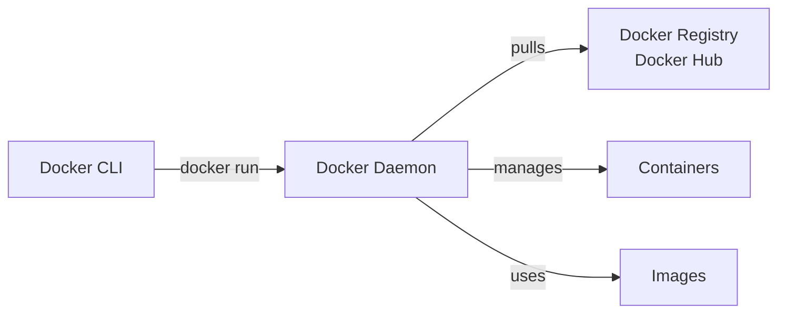

# Day 16: Docker & Containerization - Building Portable Applications

## Table of Contents
1. [Container Fundamentals](#1-container-fundamentals)
2. [Docker Architecture](#2-docker-architecture)
3. [Images & Layers](#3-images--layers)
4. [Dockerfile Best Practices](#4-dockerfile-best-practices)
5. [Multi-Stage Builds](#5-multi-stage-builds)
6. [Docker Networking](#6-docker-networking)
7. [Volumes & Data Persistence](#7-volumes--data-persistence)
8. [Docker Compose](#8-docker-compose)
9. [Security Best Practices](#9-security-best-practices)
10. [Summary](#10-summary)

---

## 1. Container Fundamentals

### 1.1 Virtual Machines vs Containers

**Virtual Machines**:
```
┌─────────────────────────────────┐
│    App A    │    App B          │
│  ┌────────┐ │  ┌────────┐       │
│  │ Bins   │ │  │ Bins   │       │
│  │ Libs   │ │  │ Libs   │       │
│  └────────┘ │  └────────┘       │
│  Guest OS   │  Guest OS         │
│  (1GB)      │  (1GB)            │
├─────────────┴───────────────────┤
│    Hypervisor (VMware/VirtualBox)│
├─────────────────────────────────┤
│    Host Operating System        │
├─────────────────────────────────┤
│    Physical Hardware            │
└─────────────────────────────────┘
```

**Containers**:
```
┌─────────────────────────────────┐
│  App A   │  App B   │  App C    │
│ ┌──────┐ │┌──────┐ │┌──────┐   │
│ │Bins  │ ││Bins  │ ││Bins  │   │
│ │Libs  │ ││Libs  │ ││Libs  │   │
│ └──────┘ │└──────┘ │└──────┘   │
├──────────┴─────────┴───────────┤
│  Docker Engine                  │
├─────────────────────────────────┤
│  Host Operating System          │
├─────────────────────────────────┤
│  Physical Hardware              │
└─────────────────────────────────┘
```

**Key Differences**:
- **VMs**: Each has full OS (GBs), boots in minutes
- **Containers**: Share host kernel (MBs), start in seconds

### 1.2 Why Containers?

✅ **"Works on my machine" solved**
```
Developer: Runs locally ✓
QA: Runs in staging ✗ (different Python version)

With Docker:
Same image everywhere → guaranteed consistency
```

✅ **Resource efficient**
```
10 VMs = 10 GB RAM
10 Containers = 100 MB RAM
```

✅ **Fast deployment**
```
VM boot: 1-2 minutes
Container start: < 1 second
```

---

## 2. Docker Architecture

### 2.1 Components



**Docker Client**: CLI you interact with (`docker run`, `docker build`)  
**Docker Daemon**: Background service that manages containers  
**Docker Registry**: Stores images (Docker Hub, AWS ECR, Google GCR)

### 2.2 Basic Commands

```bash
# Pull image
docker pull nginx:latest

# Run container
docker run -d -p 8080:80 --name my-nginx nginx

# List running containers
docker ps

# Stop container
docker stop my-nginx

# Remove container
docker rm my-nginx

# View logs
docker logs my-nginx

# Execute command in running container
docker exec -it my-nginx bash
```

---

## 3. Images & Layers

### 3.1 What is an Image?

**Image**: Read-only template with instructions for creating a container.

**Layers**: Images are built in layers (union filesystem).

```
Image Layers:
┌──────────────────────┐
│ 3. COPY app.py /app  │ ← Your code (10 MB)
├──────────────────────┤
│ 2. RUN pip install  │ ← Dependencies (200 MB)
├──────────────────────┤
│ 1. FROM python:3.11  │ ← Base OS (900 MB)
└──────────────────────┘
Total: 1.1 GB

Reuse:
If only app.py changes → only layer 3 rebuilds!
```

### 3.2 Layer Caching

```dockerfile
# Bad (cache invalidated by code changes)
FROM python:3.11
COPY . /app
RUN pip install -r requirements.txt

# Good (dependencies cached separately)
FROM python:3.11
COPY requirements.txt /app/
RUN pip install -r requirements.txt
COPY . /app
```

**Why**: If app code changes, dependencies don't rebuild (saves minutes).

### 3.3 Inspecting Images

```bash
# View layers
docker history myapp:latest

# Output:
IMAGE          CREATED BY                                      SIZE
abc123         COPY . /app                                     10MB
def456         RUN pip install -r requirements.txt             200MB
ghi789         FROM python:3.11                                900MB
```

---

## 4. Dockerfile Best Practices

### 4.1 Basic Dockerfile

```dockerfile
# Specify base image
FROM python:3.11-slim

# Set working directory
WORKDIR /app

# Copy requirements
COPY requirements.txt .

# Install dependencies
RUN pip install --no-cache-dir -r requirements.txt

# Copy application code
COPY . .

# Expose port
EXPOSE 8000

# Run application
CMD ["python", "app.py"]
```

### 4.2 Minimize Layer Count

❌ **Bad** (multiple RUN = multiple layers):
```dockerfile
RUN apt-get update
RUN apt-get install -y curl
RUN apt-get install -y git
```

✅ **Good** (single RUN):
```dockerfile
RUN apt-get update && \
    apt-get install -y curl git && \
    rm -rf /var/lib/apt/lists/*
```

### 4.3 Use .dockerignore

```
# .dockerignore
node_modules/
.git/
*.md
.env
__pycache__/
*.pyc
```

**Benefit**: Faster builds (don't copy unnecessary files).

### 4.4 Choose Minimal Base Images

```dockerfile
# Bad: Full Debian (1 GB)
FROM python:3.11

# Better: Slim variant (300 MB)
FROM python:3.11-slim

# Best: Alpine (50 MB, but compatibility issues)
FROM python:3.11-alpine
```

**Alpine**: Smallest, but uses musl libc (not glibc) → some packages fail.

---

## 5. Multi-Stage Builds

### 5.1 The Problem

**Single-stage build**:
```dockerfile
FROM golang:1.21
WORKDIR /app
COPY . .
RUN go build -o myapp
CMD ["./myapp"]
```

**Problem**: Image includes Go compiler (800 MB), but runtime only needs binary (10 MB).

### 5.2 Multi-Stage Solution

```dockerfile
# Stage 1: Build
FROM golang:1.21 AS builder
WORKDIR /app
COPY . .
RUN go build -o myapp

# Stage 2: Runtime
FROM alpine:latest
WORKDIR /app
COPY --from=builder /app/myapp .
CMD ["./myapp"]
```

**Result**:
- Builder stage: 800 MB (discarded)
- Final image: 15 MB ✅

### 5.3 Real-World Example (Node.js)

```dockerfile
# Stage 1: Install dependencies
FROM node:18 AS deps
WORKDIR /app
COPY package*.json ./
RUN npm ci --only=production

# Stage 2: Build frontend
FROM node:18 AS builder
WORKDIR /app
COPY package*.json ./
RUN npm ci
COPY . .
RUN npm run build

# Stage 3: Production runtime
FROM node:18-slim
WORKDIR /app
COPY --from=deps /app/node_modules ./node_modules
COPY --from=builder /app/dist ./dist
CMD ["node", "dist/server.js"]
```

**Size**: 1.2 GB → 200 MB

---

## 6. Docker Networking

### 6.1 Network Types

#### Bridge (default)
```bash
docker run -d --name app1 nginx
docker run -d --name app2 nginx

# app1 can reach app2 via container name
docker exec app1 ping app2
```

```
┌─────────────────────────────┐
│   Docker Bridge Network     │
│  ┌─────────┐   ┌─────────┐  │
│  │  app1   │   │  app2   │  │
│  │ 172.17. │   │ 172.17. │  │
│  │  0.2    │   │  0.3    │  │
│  └─────────┘   └─────────┘  │
└─────────────────────────────┘
        │
    NAT to host
```

#### Host Network
```bash
docker run --network host nginx
```

**Container uses host's IP directly** (no NAT).

**Use case**: Maximum performance, but less isolation.

#### Custom Network
```bash
# Create network
docker network create mynetwork

# Run containers on it
docker run -d --network mynetwork --name web nginx
docker run -d --network mynetwork --name api python-app

# web can reach api via DNS: http://api:8000
```

### 6.2 Port Mapping

```bash
# Map host port 8080 → container port 80
docker run -d -p 8080:80 nginx

# Access: http://localhost:8080 → nginx inside container
```

---

## 7. Volumes & Data Persistence

### 7.1 The Problem

**Containers are ephemeral**:
```bash
docker run -d --name db postgres
# Database stores data in container
docker stop db
docker rm db
# Data lost! ❌
```

### 7.2 Named Volumes

```bash
# Create volume
docker volume create mydata

# Run container with volume
docker run -d -v mydata:/var/lib/postgresql/data postgres

# Data persists even if container deleted
docker rm -f postgres
docker run -d -v mydata:/var/lib/postgresql/data postgres
# Data still there! ✅
```

### 7.3 Bind Mounts

```bash
# Mount host directory into container
docker run -d -v /host/path:/container/path nginx

# Example: Development setup
docker run -d -v $(pwd)/code:/app python-app
# Code changes on host → immediately reflected in container
```

### 7.4 tmpfs Mounts (In-Memory)

```bash
docker run -d --tmpfs /app/cache nginx

# Data stored in RAM (fast, but lost on restart)
```

---

## 8. Docker Compose

### 8.1 Why Compose?

**Without Compose** (manual):
```bash
docker network create mynetwork
docker run -d --network mynetwork --name db postgres
docker run -d --network mynetwork --name cache redis
docker run -d --network mynetwork -p 8000:8000 --name api python-app
```

**With Compose** (declarative):
```yaml
# docker-compose.yml
version: '3.8'
services:
  db:
    image: postgres:15
    environment:
      POSTGRES_PASSWORD: secret
    volumes:
      - db-data:/var/lib/postgresql/data
  
  cache:
    image: redis:7
  
  api:
    build: .
    ports:
      - "8000:8000"
    depends_on:
      - db
      - cache
    environment:
      DATABASE_URL: postgresql://postgres:secret@db:5432/mydb
      REDIS_URL: redis://cache:6379

volumes:
  db-data:
```

```bash
# Start everything
docker-compose up -d

# Stop everything
docker-compose down
```

### 8.2 Full Stack Example

```yaml
version: '3.8'

services:
  frontend:
    build: ./frontend
    ports:
      - "3000:3000"
    environment:
      REACT_APP_API_URL: http://localhost:8000
  
  backend:
    build: ./backend
    ports:
      - "8000:8000"
    depends_on:
      - db
      - redis
    env_file:
      - .env
  
  db:
    image: postgres:15
    environment:
      POSTGRES_DB: myapp
      POSTGRES_USER: user
      POSTGRES_PASSWORD: password
    volumes:
      - postgres-data:/var/lib/postgresql/data
  
  redis:
    image: redis:7-alpine
  
  nginx:
    image: nginx:alpine
    ports:
      - "80:80"
    volumes:
      - ./nginx.conf:/etc/nginx/nginx.conf
    depends_on:
      - frontend
      - backend

volumes:
  postgres-data:
```

### 8.3 Development Workflow

```bash
# Build and start
docker-compose up --build

# View logs
docker-compose logs -f backend

# Execute command in service
docker-compose exec backend python manage.py migrate

# Rebuild single service
docker-compose up -d --build backend

# Stop and remove everything
docker-compose down -v  # -v removes volumes
```

---

## 9. Security Best Practices

### 9.1 Non-Root User

❌ **Bad** (runs as root):
```dockerfile
FROM python:3.11
COPY . /app
CMD ["python", "app.py"]
```

✅ **Good** (runs as non-root):
```dockerfile
FROM python:3.11
RUN useradd -m appuser
USER appuser
WORKDIR /home/appuser/app
COPY --chown=appuser:appuser . .
CMD ["python", "app.py"]
```

**Why**: If attacker escapes container, they're root on host! ❌

### 9.2 Scan Images for Vulnerabilities

```bash
# Using Trivy
docker run aquasec/trivy image myapp:latest

# Output:
myapp:latest (debian 11.5)
==========================
Total: 45 (UNKNOWN: 0, LOW: 12, MEDIUM: 20, HIGH: 10, CRITICAL: 3)
```

**Fix**: Update base image, patch vulnerabilities.

### 9.3 Use Official Images

✅ **Trusted**:
```dockerfile
FROM python:3.11  # Official Python image
FROM node:18      # Official Node image
```

❌ **Untrusted**:
```dockerfile
FROM randomuser/python  # Unknown maintainer
```

### 9.4 Don't Store Secrets in Images

❌ **Bad**:
```dockerfile
ENV DATABASE_PASSWORD=supersecret  # Visible in image!
```

✅ **Good**:
```bash
# Pass at runtime
docker run -e DATABASE_PASSWORD=secret myapp

# Or use Docker secrets (Swarm/Kubernetes)
```

### 9.5 Limit Container Resources

```bash
# Limit CPU and memory
docker run -d --memory="512m" --cpus="0.5" myapp

# Prevent fork bombs
docker run -d --pids-limit 100 myapp
```

---

## 10. Summary

### 10.1 Key Takeaways

1. ✅ **Containers** - Lightweight, portable, fast startup
2. ✅ **Images** - Layered filesystem, cache-friendly
3. ✅ **Dockerfile** - Minimize layers, use multi-stage builds
4. ✅ **Networks** - Bridge for isolation, custom for multi-container
5. ✅ **Volumes** - Persist data outside containers
6. ✅ **Compose** - Define multi-container apps declaratively
7. ✅ **Security** - Non-root user, scan images, no secrets in images

### 10.2 Docker Best Practices Checklist

- [ ] Use minimal base images (slim/alpine)
- [ ] Leverage layer caching (dependencies before code)
- [ ] Multi-stage builds for compiled languages
- [ ] Run as non-root user
- [ ] Scan images for vulnerabilities
- [ ] Use .dockerignore
- [ ] Set resource limits in production
- [ ] Use named volumes for data persistence
- [ ] Don't store secrets in images

### 10.3 Tomorrow (Day 17): Kubernetes Fundamentals

- **K8s Architecture**: Pods, Nodes, Control Plane
- **Deployments**: Rolling updates, rollbacks
- **Services**: ClusterIP, NodePort, LoadBalancer
- **ConfigMaps & Secrets**: Configuration management
- **Health Checks**: Liveness, Readiness probes
- **Scaling**: Horizontal Pod Autoscaler

See you tomorrow! 🚀

---

**File Statistics**: ~1000 lines | Docker & Containerization mastered ✅
