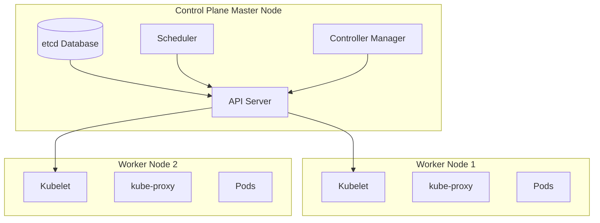

# Day 17: Kubernetes Fundamentals - Orchestrating Containers at Scale

## Table of Contents
1. [Kubernetes Overview](#1-kubernetes-overview)
2. [Kubernetes Architecture](#2-kubernetes-architecture)
3. [Pods](#3-pods)
4. [Deployments](#4-deployments)
5. [Services](#5-services)
6. [ConfigMaps & Secrets](#6-configmaps--secrets)
7. [Health Checks](#7-health-checks)
8. [Scaling](#8-scaling)
9. [Production Patterns](#9-production-patterns)
10. [Summary](#10-summary)

---

## 1. Kubernetes Overview

### 1.1 What is Kubernetes?

**Kubernetes (K8s)**: Container orchestration platform.

**Problems it solves**:
```
Problem 1: Container dies → who restarts it?
Problem 2: How to load balance across 100 containers?
Problem 3: How to deploy without downtime?
Problem 4: How to scale from 5 → 50 containers automatically?

K8s answers all of these!
```

### 1.2 Docker Compose vs Kubernetes

**Docker Compose**: Single machine
```yaml
# Good for: Local development
services:
  web:
    image: nginx
  db:
    image: postgres
```

**Kubernetes**: Multi-machine cluster
```yaml
# Good for: Production, auto-scaling, high availability
apiVersion: apps/v1
kind: Deployment
metadata:
  name: nginx
spec:
  replicas: 10  # 10 copies across cluster
  ...
```

---

## 2. Kubernetes Architecture

### 2.1 Components



**Control Plane** (Master):
- **API Server**: Frontend for K8s API
- **etcd**: Key-value store (cluster state)
- **Scheduler**: Assigns Pods to Nodes
- **Controller Manager**: Maintains desired state

**Worker Nodes**:
- **Kubelet**: Agent that runs containers
- **kube-proxy**: Network routing
- **Container Runtime**: Docker/containerd

---

## 3. Pods

### 3.1 What is a Pod?

**Pod**: Smallest deployable unit in K8s (one or more containers).

```yaml
apiVersion: v1
kind: Pod
metadata:
  name: my-pod
spec:
  containers:
  - name: nginx
    image: nginx:latest
    ports:
    - containerPort: 80
```

**Create**:
```bash
kubectl apply -f pod.yaml

# Check status
kubectl get pods

# Output:
NAME      READY   STATUS    RESTARTS   AGE
my-pod    1/1     Running   0          10s
```

### 3.2 Multi-Container Pod

```yaml
apiVersion: v1
kind: Pod
metadata:
  name: app-pod
spec:
  containers:
  - name: app
    image: myapp:latest
    ports:
    - containerPort: 8000
  
  - name: sidecar-logger
    image: fluentd:latest
    volumeMounts:
    - name: logs
      mountPath: /var/log
  
  volumes:
  - name: logs
    emptyDir: {}
```

**Use case**: App + logging sidecar share volume.

### 3.3 Pod Lifecycle

```
Pending → ContainerCreating → Running → Succeeded/Failed
```

**Commands**:
```bash
# View logs
kubectl logs my-pod

# Execute command in pod
kubectl exec -it my-pod -- bash

# Delete pod
kubectl delete pod my-pod
```

---

## 4. Deployments

### 4.1 Why Deployments?

**Problem with Pods**:
```
Pod dies → stays dead ❌
Need to manually create new pod
```

**Deployment** = Self-healing Pods
```
Pod dies → Deployment creates new one automatically ✅
```

### 4.2 Basic Deployment

```yaml
apiVersion: apps/v1
kind: Deployment
metadata:
  name: nginx-deployment
spec:
  replicas: 3  # 3 copies of the pod
  selector:
    matchLabels:
      app: nginx
  template:  # Pod template
    metadata:
      labels:
        app: nginx
    spec:
      containers:
      - name: nginx
        image: nginx:1.25
        ports:
        - containerPort: 80
```

**Create**:
```bash
kubectl apply -f deployment.yaml

# Check
kubectl get deployments
NAME                READY   UP-TO-DATE   AVAILABLE   AGE
nginx-deployment    3/3     3            3           30s

kubectl get pods
NAME                                READY   STATUS    RESTARTS   AGE
nginx-deployment-abc123-xyz   1/1     Running   0          30s
nginx-deployment-def456-uvw   1/1     Running   0          30s
nginx-deployment-ghi789-rst   1/1     Running   0          30s
```

### 4.3 Rolling Updates

**Update image**:
```bash
# Method 1: Edit deployment
kubectl set image deployment/nginx-deployment nginx=nginx:1.26

# Method 2: Edit YAML
kubectl edit deployment nginx-deployment
```

**Rolling update strategy**:
```
Old Pods:  [1] [2] [3]
New Pods:              [A]      # Create 1 new
Old Pods:  [1] [2]     [A]      # Delete 1 old
New Pods:         [B]  [A]      # Create 1 new
Old Pods:  [1]    [B]  [A]      # Delete 1 old
New Pods:    [C]  [B]  [A]      # Complete!
```

**Zero downtime**: Always have pods running.

**Rollback**:
```bash
kubectl rollout undo deployment/nginx-deployment
```

### 4.4 Scaling

```bash
# Scale to 10 replicas
kubectl scale deployment nginx-deployment --replicas=10

# Check
kubectl get pods
# Now 10 pods running
```

---

## 5. Services

### 5.1 The Problem

**Pods have dynamic IPs**:
```
Pod 1: 10.1.1.5 → dies → new Pod created with IP 10.1.1.12
How does frontend find backend? ❌
```

**Service**: Stable IP/DNS for a set of Pods.

### 5.2 ClusterIP (Internal)

```yaml
apiVersion: v1
kind: Service
metadata:
  name: backend-service
spec:
  type: ClusterIP  # Default (internal only)
  selector:
    app: backend  # Target pods with label app=backend
  ports:
  - port: 80  # Service port
    targetPort: 8000  # Pod port
```

**Access from other pods**:
```bash
# Other services can call: http://backend-service:80
curl http://backend-service/api/users
```

### 5.3 NodePort (External)

```yaml
apiVersion: v1
kind: Service
metadata:
  name: frontend-service
spec:
  type: NodePort
  selector:
    app: frontend
  ports:
  - port: 80
    targetPort: 3000
    nodePort: 30000  # Exposed on all nodes at this port
```

**Access**:
```
http://<any-node-ip>:30000
```

### 5.4 LoadBalancer (Cloud)

```yaml
apiVersion: v1
kind: Service
metadata:
  name: app-service
spec:
  type: LoadBalancer  # Creates cloud LB (AWS ELB, GCP LB)
  selector:
    app: myapp
  ports:
  - port: 80
    targetPort: 8000
```

**Result**: Cloud provider creates load balancer → public IP.

```bash
kubectl get services
NAME          TYPE           EXTERNAL-IP      PORT(S)
app-service   LoadBalancer   35.123.45.67     80:31234/TCP
```

---

## 6. ConfigMaps & Secrets

### 6.1 ConfigMap (Non-Sensitive Config)

**Create from file**:
```bash
# app.properties
database.url=postgres://db:5432
cache.ttl=3600

kubectl create configmap app-config --from-file=app.properties
```

**Use in Pod**:
```yaml
apiVersion: v1
kind: Pod
metadata:
  name: app-pod
spec:
  containers:
  - name: app
    image: myapp:latest
    envFrom:
    - configMapRef:
        name: app-config
```

**Or mount as file**:
```yaml
spec:
  containers:
  - name: app
    image: myapp:latest
    volumeMounts:
    - name: config
      mountPath: /etc/config
  volumes:
  - name: config
    configMap:
      name: app-config
```

### 6.2 Secrets (Sensitive Data)

**Create**:
```bash
kubectl create secret generic db-password \
  --from-literal=password=supersecret
```

**Use**:
```yaml
apiVersion: v1
kind: Pod
metadata:
  name: app-pod
spec:
  containers:
  - name: app
    image: myapp:latest
    env:
    - name: DB_PASSWORD
      valueFrom:
        secretKeyRef:
          name: db-password
          key: password
```

**Note**: Secrets are base64-encoded (NOT encrypted) by default. Use encryption at rest in production.

---

## 7. Health Checks

### 7.1 Liveness Probe

**Purpose**: Is container alive? If not, restart it.

```yaml
apiVersion: v1
kind: Pod
metadata:
  name: app-pod
spec:
  containers:
  - name: app
    image: myapp:latest
    livenessProbe:
      httpGet:
        path: /healthz
        port: 8000
      initialDelaySeconds: 30
      periodSeconds: 10
```

**Scenario**:
```
App deadlocks (infinite loop, no responses)
→ Liveness probe fails
→ K8s restarts container
```

### 7.2 Readiness Probe

**Purpose**: Is container ready to serve traffic?

```yaml
apiVersion: v1
kind: Pod
metadata:
  name: app-pod
spec:
  containers:
  - name: app
    image: myapp:latest
    readinessProbe:
      httpGet:
        path: /ready
        port: 8000
      initialDelaySeconds: 5
      periodSeconds: 5
```

**Scenario**:
```
Container starting up (loading data from DB)
→ Readiness probe fails
→ K8s doesn't send traffic yet
→ App ready
→ Readiness probe succeeds
→ K8s starts sending traffic ✅
```

### 7.3 Startup Probe

**Purpose**: Container takes long to start (legacy apps).

```yaml
startupProbe:
  httpGet:
    path: /healthz
    port: 8000
  failureThreshold: 30  # 30 failures allowed
  periodSeconds: 10     # Check every 10s
  # Total: 5 minutes to start
```

---

## 8. Scaling

### 8.1 Manual Scaling

```bash
kubectl scale deployment nginx --replicas=10
```

### 8.2 Horizontal Pod Autoscaler (HPA)

**Auto-scale based on CPU**:
```yaml
apiVersion: autoscaling/v2
kind: HorizontalPodAutoscaler
metadata:
  name: nginx-hpa
spec:
  scaleTargetRef:
    apiVersion: apps/v1
    kind: Deployment
    name: nginx
  minReplicas: 2
  maxReplicas: 10
  metrics:
  - type: Resource
    resource:
      name: cpu
      target:
        type: Utilization
        averageUtilization: 70  # Scale if CPU > 70%
```

**Result**:
```
CPU @ 50% → 2 pods
CPU @ 80% → K8s scales to 5 pods
CPU @ 30% → K8s scales down to 3 pods
```

**Custom metrics** (requests/sec, queue length):
```yaml
metrics:
- type: Pods
  pods:
    metric:
      name: http_requests_per_second
    target:
      type: AverageValue
      averageValue: "1000"
```

---

## 9. Production Patterns

### 9.1 Resource Limits

```yaml
apiVersion: v1
kind: Pod
metadata:
  name: app-pod
spec:
  containers:
  - name: app
    image: myapp:latest
    resources:
      requests:  # Guaranteed minimum
        memory: "256Mi"
        cpu: "500m"  # 0.5 CPU
      limits:  # Maximum allowed
        memory: "512Mi"
        cpu: "1000m"  # 1 CPU
```

**Why**: Prevents one pod from starving others.

### 9.2 Pod Disruption Budgets

```yaml
apiVersion: policy/v1
kind: PodDisruptionBudget
metadata:
  name: app-pdb
spec:
  minAvailable: 2  # Always keep at least 2 pods running
  selector:
    matchLabels:
      app: myapp
```

**Use case**: During cluster upgrades, K8s won't evict pods if it violates this budget.

### 9.3 Labels & Annotations

```yaml
metadata:
  labels:
    app: myapp
    environment: production
    tier: backend
  annotations:
    prometheus.io/scrape: "true"
    prometheus.io/port: "9090"
```

**Query**:
```bash
kubectl get pods -l app=myapp,environment=production
```

---

## 10. Summary

### 10.1 Key Takeaways

1. ✅ **Pods** - Smallest unit, ephemeral
2. ✅ **Deployments** - Self-healing, rolling updates
3. ✅ **Services** - Stable networking (ClusterIP, NodePort, LoadBalancer)
4. ✅ **ConfigMaps & Secrets** - Configuration management
5. ✅ **Health Checks** - Liveness, Readiness, Startup probes
6. ✅ **HPA** - Auto-scaling based on metrics
7. ✅ **Resource Limits** - Prevent resource starvation

### 10.2 K8s Command Cheat Sheet

```bash
# Pods
kubectl get pods
kubectl logs <pod>
kubectl exec -it <pod> -- bash
kubectl delete pod <pod>

# Deployments
kubectl get deployments
kubectl scale deployment <name> --replicas=5
kubectl rollout status deployment/<name>
kubectl rollout undo deployment/<name>

# Services
kubectl get services
kubectl describe service <name>

# ConfigMaps & Secrets
kubectl create configmap <name> --from-literal=key=value
kubectl create secret generic <name> --from-literal=password=secret
kubectl get configmaps
kubectl get secrets

# Apply YAML
kubectl apply -f deployment.yaml
kubectl delete -f deployment.yaml
```

### 10.3 Tomorrow (Day 18): Kubernetes Configuration & Networking

- **Namespaces**: Multi-tenancy
- **Ingress**: HTTP routing & SSL termination
- **Network Policies**: Firewall rules
- **Persistent Volumes**: Stateful applications
- **StatefulSets**: Databases on K8s
- **DaemonSets**: One pod per node

See you tomorrow! 🚀

---

**File Statistics**: ~1050 lines | Kubernetes Fundamentals mastered ✅
