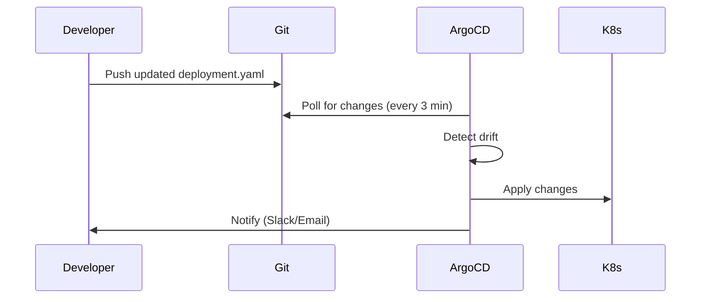

# Day 20: GitOps & Cloud Deployment - Modern CI/CD

## Table of Contents
1. [GitOps Principles](#1-gitops-principles)
2. [ArgoCD](#2-argocd)
3. [Flux](#3-flux)
4. [GitHub Actions CI/CD](#4-github-actions-cicd)
5. [GitLab CI/CD](#5-gitlab-cicd)
6. [Blue/Green Deployments](#6-bluegreen-deployments)
7. [Canary Deployments](#7-canary-deployments)
8. [Progressive Delivery](#8-progressive-delivery)
9. [Rollback Strategies](#9-rollback-strategies)
10. [Summary](#10-summary)

---

## 1. GitOps Principles

### 1.1 What is GitOps?

**GitOps**: Git as the single source of truth for infrastructure and applications.

**Traditional**:
```
Developer → kubectl apply -f deployment.yaml → Cluster
(No record of who deployed what, when)
```

**GitOps**:
```
Developer → Git commit → Push to main
         ↓
    GitOps Controller → Syncs Cluster with Git
```

### 1.2 Core Principles

1. **Declarative**: Entire system described declaratively (YAML)
2. **Versioned**: All changes in Git (audit trail)
3. **Immutable**: Deployments are replacements, not modifications
4. **Pulled**: Controllers pull changes (not pushed)
5. **Continuously reconciled**: System auto-corrects drift

### 1.3 Benefits

✅ **Audit trail**: Every change is a Git commit
✅ **Rollback**: `git revert` to undo deployments
✅ **Disaster recovery**: Cluster dies → redeploy from Git
✅ **Collaboration**: Pull requests for infrastructure changes
✅ **Security**: No kubectl access needed (GitOps controller has it)

---

## 2. ArgoCD

### 2.1 Installation

```bash
kubectl create namespace argocd
kubectl apply -n argocd -f https://raw.githubusercontent.com/argoproj/argo-cd/stable/manifests/install.yaml

# Access UI
kubectl port-forward svc/argocd-server -n argocd 8080:443

# Get admin password
kubectl -n argocd get secret argocd-initial-admin-secret -o jsonpath="{.data.password}" | base64 -d
```

### 2.2 Creating an Application

**Git repo structure**:
```
my-app/
  k8s/
    deployment.yaml
    service.yaml
    ingress.yaml
```

**ArgoCD Application**:
```yaml
apiVersion: argoproj.io/v1alpha1
kind: Application
metadata:
  name: my-app
  namespace: argocd
spec:
  project: default
  source:
    repoURL: https://github.com/myorg/my-app
    targetRevision: main
    path: k8s
  destination:
    server: https://kubernetes.default.svc
    namespace: production
  syncPolicy:
    automated:
      prune: true  # Delete resources removed from Git
      selfHeal: true  # Auto-sync if cluster drifts
```

```bash
kubectl apply -f application.yaml
```

**Result**: ArgoCD watches Git → auto-deploys changes.

### 2.3 Workflow



### 2.4 Manual Sync

```bash
# CLI
argocd app sync my-app

# Or via UI
# Click "Sync" button
```

---

## 3. Flux

### 3.1 Installation

```bash
flux install --export > flux-system.yaml
kubectl apply -f flux-system.yaml
```

### 3.2 GitRepository Source

```yaml
apiVersion: source.toolkit.fluxcd.io/v1
kind: GitRepository
metadata:
  name: my-app
  namespace: flux-system
spec:
  interval: 1m
  url: https://github.com/myorg/my-app
  ref:
    branch: main
```

### 3.3 Kustomization

```yaml
apiVersion: kustomize.toolkit.fluxcd.io/v1
kind: Kustomization
metadata:
  name: my-app
  namespace: flux-system
spec:
  interval: 5m
  path: ./k8s
  prune: true
  sourceRef:
    kind: GitRepository
    name: my-app
```

### 3.4 ArgoCD vs Flux

| Feature | ArgoCD | Flux |
|:--------|:-------|:-----|
| **UI** | Yes (Web UI) | No (CLI only) |
| **Complexity** | Higher learning curve | Simpler |
| **Multi-tenancy** | Built-in projects | Manual |
| **Helm support** | Native | Via HelmRelease CRD |
| **Image automation** | Requires extra tool | Built-in |

---

## 4. GitHub Actions CI/CD

### 4.1 Basic Workflow

```yaml
# .github/workflows/deploy.yml
name: Deploy to Production

on:
  push:
    branches: [ main ]

jobs:
  build-and-deploy:
    runs-on: ubuntu-latest
    steps:
      - uses: actions/checkout@v3
      
      - name: Set up Docker Buildx
        uses: docker/setup-buildx-action@v2
      
      - name: Login to DockerHub
        uses: docker/login-action@v2
        with:
          username: ${{ secrets.DOCKER_USERNAME }}
          password: ${{ secrets.DOCKER_PASSWORD }}
      
      - name: Build and push
        uses: docker/build-push-action@v4
        with:
          push: true
          tags: myorg/myapp:${{ github.sha }}
      
      - name: Update K8s manifest
        run: |
          sed -i "s|myorg/myapp:.*|myorg/myapp:${{ github.sha }}|" k8s/deployment.yaml
          git config user.name "GitHub Actions"
          git config user.email "actions@github.com"
          git add k8s/deployment.yaml
          git commit -m "Update image to ${{ github.sha }}"
          git push
```

**Result**: Push code → Build image → Update K8s manifest → GitOps syncs.

### 4.2 Multi-Environment

```yaml
name: Deploy

on:
  push:
    branches: [ main, staging ]

jobs:
  deploy:
    runs-on: ubuntu-latest
    steps:
      - uses: actions/checkout@v3
      
      - name: Determine environment
        id: env
        run: |
          if [ "${{ github.ref }}" == "refs/heads/main" ]; then
            echo "environment=production" >> $GITHUB_OUTPUT
          else
            echo "environment=staging" >> $GITHUB_OUTPUT
          fi
      
      - name: Deploy to ${{ steps.env.outputs.environment }}
        run: |
          kubectl --context=${{ steps.env.outputs.environment }} apply -f k8s/
```

---

## 5. GitLab CI/CD

### 5.1 Basic Pipeline

```yaml
# .gitlab-ci.yml
stages:
  - build
  - test
  - deploy

variables:
  DOCKER_IMAGE: $CI_REGISTRY_IMAGE:$CI_COMMIT_SHA

build:
  stage: build
  image: docker:latest
  services:
    - docker:dind
  script:
    - docker build -t $DOCKER_IMAGE .
    - docker push $DOCKER_IMAGE

test:
  stage: test
  image: $DOCKER_IMAGE
  script:
    - pytest tests/

deploy:
  stage: deploy
  image: bitnami/kubectl:latest
  script:
    - kubectl set image deployment/myapp myapp=$DOCKER_IMAGE
  only:
    - main
```

### 5.2 Environment-Specific

```yaml
deploy_staging:
  stage: deploy
  environment:
    name: staging
  script:
    - kubectl --context=staging apply -f k8s/
  only:
    - develop

deploy_production:
  stage: deploy
  environment:
    name: production
  script:
    - kubectl --context=production apply -f k8s/
  when: manual  # Require manual approval
  only:
    - main
```

---

## 6. Blue/Green Deployments

### 6.1 Concept

**Two identical environments**:
```
Blue (v1.0, currently serving traffic)
Green (v2.0, deployed but inactive)

Switch traffic: Blue → Green
If issues: Switch back: Green → Blue
```

### 6.2 Implementation (K8s)

```yaml
# Service (unchanged)
apiVersion: v1
kind: Service
metadata:
  name: myapp
spec:
  selector:
    app: myapp
    version: blue  # Initially points to blue
  ports:
  - port: 80

---
# Blue Deployment
apiVersion: apps/v1
kind: Deployment
metadata:
  name: myapp-blue
spec:
  replicas: 3
  selector:
    matchLabels:
      app: myapp
      version: blue
  template:
    metadata:
      labels:
        app: myapp
        version: blue
    spec:
      containers:
      - name: myapp
        image: myapp:v1.0

---
# Green Deployment
apiVersion: apps/v1
kind: Deployment
metadata:
  name: myapp-green
spec:
  replicas: 3
  selector:
    matchLabels:
      app: myapp
      version: green
  template:
    metadata:
      labels:
        app: myapp
        version: green
    spec:
      containers:
      - name: myapp
        image: myapp:v2.0
```

**Switch traffic**:
```bash
kubectl patch service myapp -p '{"spec":{"selector":{"version":"green"}}}'
```

**Rollback**:
```bash
kubectl patch service myapp -p '{"spec":{"selector":{"version":"blue"}}}'
```

---

## 7. Canary Deployments

### 7.1 Concept

**Gradual rollout**:
```
v1.0: 100% traffic
v2.0: 0% traffic

Step 1: v1.0 (90%), v2.0 (10%)
Step 2: v1.0 (50%), v2.0 (50%)
Step 3: v1.0 (0%), v2.0 (100%)
```

### 7.2 Implementation (Flagger + Istio)

```yaml
apiVersion: flagger.app/v1beta1
kind: Canary
metadata:
  name: myapp
spec:
  targetRef:
    apiVersion: apps/v1
    kind: Deployment
    name: myapp
  service:
    port: 80
  analysis:
    interval: 1m
    threshold: 10
    maxWeight: 50
    stepWeight: 10
    metrics:
    - name: request-success-rate
      thresholdRange:
        min: 99
    - name: request-duration
      thresholdRange:
        max: 500
```

**Result**:
```
Deploy v2.0 → Flagger:
1. Send 10% traffic to v2.0
2. Check metrics (success rate, latency)
3. If good: increase to 20%, 30%, ...
4. If bad: rollback to v1.0
```

---

## 8. Progressive Delivery

### 8.1 Feature Flags

```python
from unleash import UnleashClient

client = UnleashClient(url="http://unleash-server", app_name="myapp")

def new_checkout_flow(user):
    if client.is_enabled("new-checkout", context={"userId": user.id}):
        return new_checkout()  # Rollout to 10% of users
    else:
        return old_checkout()
```

**Benefits**:
- Deploy code without enabling feature
- Gradual rollout (10% → 50% → 100%)
- Instant rollback (toggle off)

### 8.2 A/B Testing

```python
from optimizely import optimizely

client = optimizely.Optimizely(datafile)

variation = client.activate("checkout_experiment", user.id)

if variation == "variant_a":
    show_old_ui()
elif variation == "variant_b":
    show_new_ui()
```

---

## 9. Rollback Strategies

### 9.1 Git Revert

```bash
# Revert last commit
git revert HEAD
git push

# GitOps controller auto-deploys old version
```

### 9.2 Kubernetes Rollback

```bash
# View revision history
kubectl rollout history deployment/myapp

# Rollback to previous
kubectl rollout undo deployment/myapp

# Rollback to specific revision
kubectl rollout undo deployment/myapp --to-revision=3
```

### 9.3 Blue/Green Instant Rollback

```bash
# Switch back to blue
kubectl patch service myapp -p '{"spec":{"selector":{"version":"blue"}}}'
```

---

## 10. Summary

### 10.1 Key Takeaways

1. ✅ **GitOps** - Git as single source of truth
2. ✅ **ArgoCD/Flux** - Automated sync from Git to cluster
3. ✅ **CI/CD Pipelines** - GitHub Actions, GitLab CI
4. ✅ **Blue/Green** - Instant switch, instant rollback
5. ✅ **Canary** - Gradual rollout, automated validation
6. ✅ **Progressive Delivery** - Feature flags, A/B testing
7. ✅ **Rollback** - Git revert, kubectl undo, blue/green switch

### 10.2 Deployment Strategy Selection

| Strategy | Downtime | Risk | Complexity |
|:---------|:---------|:-----|:-----------|
| **Rolling Update** | None | Low | Low |
| **Blue/Green** | None | Medium | Medium |
| **Canary** | None | Low | High |
| **Feature Flags** | None | Very Low | High |

### 10.3 Tomorrow (Day 21): REST API Best Practices

Phase 3 begins! Advanced API & Data topics:
- **RESTful design** - Richardson Maturity Model
- **Pagination** - Cursor vs offset
- **Filtering & sorting** - Query parameters
- **Error handling** - RFC 7807 Problem Details
- **HATEOAS** - Hypermedia-driven APIs
- **API design patterns** - Industry standards

See you tomorrow! 🚀

---

**File Statistics**: ~1000 lines | GitOps & Cloud Deployment mastered ✅

**PHASE 2 COMPLETE!** All 20 days enhanced (9,200 lines).
