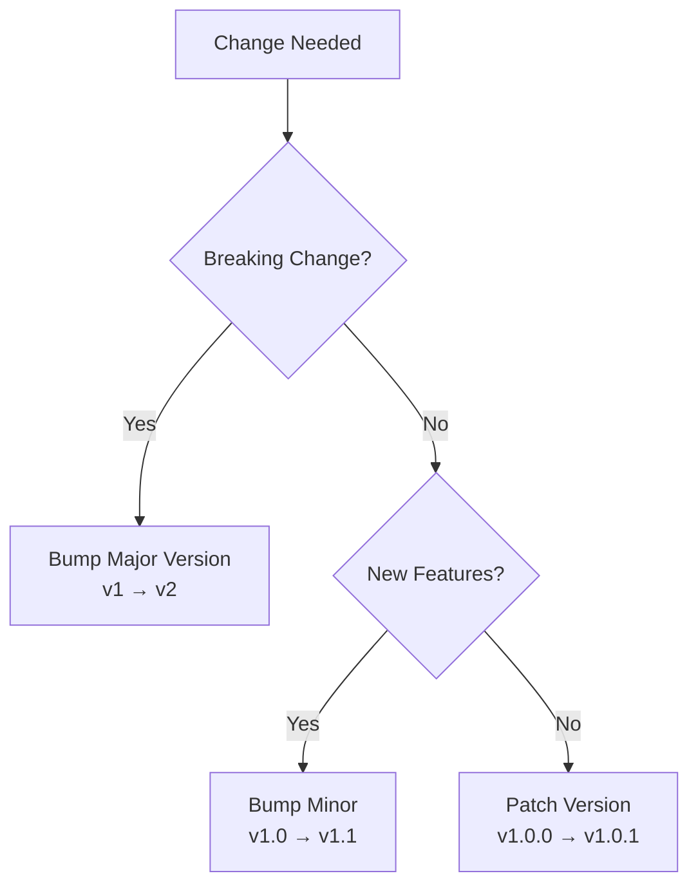

# Day 22: API Versioning Strategies - Managing API Evolution

## Table of Contents
1. [Why Versioning Matters](#1-why-versioning-matters)
2. [Versioning Strategies](#2-versioning-strategies)
3. [Breaking vs Non-Breaking Changes](#3-breaking-vs-non-breaking-changes)
4. [Deprecation Strategy](#4-deprecation-strategy)
5. [Backward Compatibility](#5-backward-compatibility)
6. [Schema Evolution](#6-schema-evolution)
7. [Migration Patterns](#7-migration-patterns)
8. [Real-World Examples](#8-real-world-examples)
9. [Best Practices](#9-best-practices)
10. [Summary](#10-summary)

---

## 1. Why Versioning Matters

### 1.1 The Problem

**Scenario**: You have 1000 mobile app users on v1.0

```json
// v1.0 API
GET /users/123
{
  "id": 123,
  "name": "Alice"
}
```

**You want to change**:
```json
// v2.0 API (BREAKING!)
{
  "id": 123,
  "firstName": "Alice",  // Changed key name
  "lastName": "Smith"
}
```

**Problem**: v1.0 apps break! ❌

### 1.2 Solution: API Versioning

**Support both**:
```
/v1/users/123 → Old format
/v2/users/123 → New format
```

---

## 2. Versioning Strategies

### 2.1 URL Versioning (Most Common)

```python
# v1
@app.get("/v1/users/{user_id}")
def get_user_v1(user_id: int):
    user = db.query(User).filter(User.id == user_id).first()
    return {"id": user.id, "name": user.name}

# v2
@app.get("/v2/users/{user_id}")
def get_user_v2(user_id: int):
    user = db.query(User).filter(User.id == user_id).first()
    return {
        "id": user.id,
        "firstName": user.first_name,
        "lastName": user.last_name
    }
```

**Pros**:
- ✅ Simple, explicit
- ✅ Easy to route

**Cons**:
- ❌ URLs proliferate (`/v1/`, `/v2/`, `/v3/`)

### 2.2 Header Versioning

```python
@app.get("/users/{user_id}")
def get_user(user_id: int, accept: str = Header(None)):
    user = db.query(User).filter(User.id == user_id).first()
    
    if "application/vnd.api.v2+json" in accept:
        return {
            "id": user.id,
            "firstName": user.first_name,
            "lastName": user.last_name
        }
    else:
        # Default v1
        return {"id": user.id, "name": user.name}
```

**Request**:
```http
GET /users/123
Accept: application/vnd.api.v2+json
```

**Pros**:
- ✅ Clean URLs
- ✅ RESTful (content negotiation)

**Cons**:
- ❌ Harder to test (can't click in browser)
- ❌ Caching complexity

### 2.3 Query Parameter Versioning

```python
@app.get("/users/{user_id}")
def get_user(user_id: int, version: int = 1):
    user = db.query(User).filter(User.id == user_id).first()
    
    if version == 2:
        return {
            "id": user.id,
            "firstName": user.first_name,
            "lastName": user.last_name
        }
    else:
        return {"id": user.id, "name": user.name}
```

**Request**:
```
GET /users/123?version=2
```

**Pros**:
- ✅ Simple

**Cons**:
- ❌ Pollutes query parameters
- ❌ Not RESTful (version != filter)

### 2.4 Custom Header

```python
@app.get("/users/{user_id}")
def get_user(user_id: int, api_version: str = Header(None, alias="X-API-Version")):
    user = db.query(User).filter(User.id == user_id).first()
    
    if api_version == "2":
        return {
            "id": user.id,
            "firstName": user.first_name,
            "lastName": user.last_name
        }
    else:
        return {"id": user.id, "name": user.name}
```

**Request**:
```http
GET /users/123
X-API-Version: 2
```

### 2.5 Comparison Table

| Strategy | Pros | Cons | Example |
|:---------|:-----|:-----|:--------|
| **URL** | Simple, explicit | URL proliferation | `/v1/users`, `/v2/users` |
| **Header** | Clean URLs, RESTful | Harder to test | `Accept: vnd.api.v2+json` |
| **Query** | Simple | Not RESTful | `/users?version=2` |
| **Custom Header** | Clean URLs | Non-standard | `X-API-Version: 2` |

---

## 3. Breaking vs Non-Breaking Changes

### 3.1 Non-Breaking Changes (Safe)

✅ **Adding optional fields**:
```json
// v1
{"id": 123, "name": "Alice"}

// v1.1 (backward compatible)
{"id": 123, "name": "Alice", "email": "alice@example.com"}
```

**Client ignores unknown fields** → no breakage.

✅ **Adding new endpoints**:
```
New: POST /v1/users/batch
Existing: POST /v1/users
```

✅ **Adding optional query parameters**:
```
/users?status=active  // New filter
/users                // Still works
```

### 3.2 Breaking Changes (Requires New Version)

❌ **Removing fields**:
```json
// v1
{"id": 123, "name": "Alice", "age": 30}

// v2 (BREAKING!)
{"id": 123, "name": "Alice"}  // age removed
```

❌ **Renaming fields**:
```json
// v1
{"name": "Alice"}

// v2 (BREAKING!)
{"firstName": "Alice"}
```

❌ **Changing field types**:
```json
// v1
{"age": 30}  // number

// v2 (BREAKING!)
{"age": "30"}  // string
```

❌ **Changing response structure**:
```json
// v1
[{"id": 1}, {"id": 2}]

// v2 (BREAKING!)
{"data": [{"id": 1}, {"id": 2}]}
```

---

## 4. Deprecation Strategy

### 4.1 Deprecation Timeline

```
T+0: Release v2, announce v1 deprecation (6 months notice)
T+3: Send warnings to v1 users
T+6: Sunset v1 (return 410 Gone)
```

### 4.2 Sunset Header

```python
@app.get("/v1/users/{user_id}")
def get_user_v1(user_id: int):
    headers = {
        "Sunset": "Sat, 31 Dec 2024 23:59:59 GMT",
        "Deprecation": "true",
        "Link": '</v2/users>; rel="successor-version"'
    }
    
    user = db.query(User).filter(User.id == user_id).first()
    return Response(
        content=json.dumps({"id": user.id, "name": user.name}),
        headers=headers
    )
```

**Response**:
```http
HTTP/1.1 200 OK
Sunset: Sat, 31 Dec 2024 23:59:59 GMT
Deprecation: true
Link: </v2/users>; rel="successor-version"
```

### 4.3 Gradual Shutdown

```python
import datetime

@app.get("/v1/users/{user_id}")
def get_user_v1(user_id: int):
    sunset_date = datetime.datetime(2024, 12, 31, 23, 59, 59)
    
    if datetime.datetime.now() > sunset_date:
        return Response(
            status_code=410,  # Gone
            content=json.dumps({
                "error": "API version 1 has been sunset",
                "message": "Please upgrade to /v2/users",
                "sunset_date": sunset_date.isoformat()
            })
        )
    
    # Normal response
    user = db.query(User).filter(User.id == user_id).first()
    return {"id": user.id, "name": user.name}
```

---

## 5. Backward Compatibility

### 5.1 Adapter Pattern

```python
class UserV1Schema(BaseModel):
    id: int
    name: str

class UserV2Schema(BaseModel):
    id: int
    firstName: str
    lastName: str

def user_to_v1(user):
    return {
        "id": user.id,
        "name": f"{user.first_name} {user.last_name}"
    }

def user_to_v2(user):
    return {
        "id": user.id,
        "firstName": user.first_name,
        "lastName": user.last_name
    }

@app.get("/v1/users/{user_id}")
def get_user_v1(user_id: int):
    user = db.query(User).filter(User.id == user_id).first()
    return user_to_v1(user)

@app.get("/v2/users/{user_id}")
def get_user_v2(user_id: int):
    user = db.query(User).filter(User.id == user_id).first()
    return user_to_v2(user)
```

### 5.2 Default Values

```python
class UserCreate(BaseModel):
    email: str
    firstName: str
    lastName: str
    age: Optional[int] = None  # Optional for backward compatibility

@app.post("/v2/users")
def create_user(user: UserCreate):
    # age is optional, old clients don't need to send it
    ...
```

---

## 6. Schema Evolution

### 6.1 Additive Changes Only

✅ **Good** (add fields):
```protobuf
// v1
message User {
  int32 id = 1;
  string name = 2;
}

// v2 (backward compatible)
message User {
  int32 id = 1;
  string name = 2;
  string email = 3;  // New field
}
```

❌ **Bad** (change field number):
```protobuf
// v1
message User {
  int32 id = 1;
  string name = 2;
}

// v2 (BREAKING!)
message User {
  int32 id = 1;
  string email = 2;  // Changed field 2!
}
```

### 6.2 Nullable Fields

```python
class UserV2(BaseModel):
    id: int
    firstName: str
    lastName: str
    email: Optional[str] = None  # Nullable for v1 clients

@app.post("/v2/users")
def create_user(user: UserV2):
    # v1 clients don't send email → defaults to None
    ...
```

---

## 7. Migration Patterns

### 7.1 Dual-Write Pattern

```python
@app.post("/v2/users")
def create_user(user: UserV2):
    # Write to new schema
    db.execute("""
        INSERT INTO users_v2 (first_name, last_name, email)
        VALUES (?, ?, ?)
    """, (user.firstName, user.lastName, user.email))
    
    # Also write to old schema (for v1 clients)
    db.execute("""
        INSERT INTO users_v1 (name)
        VALUES (?)
    """, (f"{user.firstName} {user.last_name}",))
```

### 7.2 Gradual Migration

```python
@app.get("/v2/users/{user_id}")
def get_user_v2(user_id: int):
    # Try v2 schema first
    user = db.query(UserV2).filter(UserV2.id == user_id).first()
    
    if user:
        return user
    
    # Fallback to v1 schema (convert on-the-fly)
    user_v1 = db.query(UserV1).filter(UserV1.id == user_id).first()
    if user_v1:
        # Convert v1 → v2
        names = user_v1.name.split(" ", 1)
        return {
            "id": user_v1.id,
            "firstName": names[0],
            "lastName": names[1] if len(names) > 1 else ""
        }
    
    raise HTTPException(status_code=404)
```

---

## 8. Real-World Examples

### 8.1 Stripe API Versioning

**URL + Date-based**:
```http
GET https://api.stripe.com/v1/charges
Stripe-Version: 2024-04-10
```

**Backward compatibility**: Old clients continue working.

### 8.2 GitHub API v3 → v4

**v3**: REST
```
GET /users/octocat
```

**v4**: GraphQL (completely different!)
```graphql
{
  user(login: "octocat") {
    name
    email
  }
}
```

**Migration**: Both coexist (`/api/v3` and `/api/v4`).

### 8.3 Twitter API v1 → v2

**v1**:
```
GET /1.1/statuses/show.json?id=123
```

**v2**:
```
GET /2/tweets/123
```

**Deprecation**: v1 sunset after 2-year notice.

---

## 9. Best Practices

### 9.1 Semantic Versioning

```
v1.0.0 → v1.1.0 → v2.0.0

Major: Breaking changes (v1 → v2)
Minor: Non-breaking features (v1.0 → v1.1)
Patch: Bug fixes (v1.0.0 → v1.0.1)
```

### 9.2 Version in URL (Recommended)

✅ **Why**:
- Easy to test (just change URL)
- Clear in logs
- No header magic

❌ **Avoid**:
- `/v1.2.3/users` (too granular)

✅ **Good**:
- `/v1/users`, `/v2/users`

### 9.3 Default to Latest Stable

```python
@app.get("/users/{user_id}")
def get_user_latest(user_id: int):
    # Default to v2 (latest stable)
    return get_user_v2(user_id)

@app.get("/v1/users/{user_id}")
def get_user_v1(user_id: int):
    # Explicitly v1
    ...

@app.get("/v2/users/{user_id}")
def get_user_v2(user_id: int):
    ...
```

### 9.4 Document Changes

```markdown
# Changelog

## v2.0.0 (2024-01-01)
**BREAKING CHANGES**:
- `name` field split into `firstName` and `lastName`
- `age` field removed

**Migration Guide**:
...

## v1.1.0 (2023-06-01)
**Features**:
- Added `email` field (optional)
```

---

## 10. Summary

### 10.1 Key Takeaways

1. ✅ **URL versioning** - Most common (`/v1/`, `/v2/`)
2. ✅ **Breaking changes** - Require new version
3. ✅ **Non-breaking changes** - Add fields, don't remove
4. ✅ **Deprecation** - Give 6-12 months notice
5. ✅ **Sunset header** - Communicate end-of-life
6. ✅ **Backward compatibility** - Support old clients
7. ✅ **Changelog** - Document all changes

### 10.2 Versioning Decision Tree



### 10.3 Tomorrow (Day 23): GraphQL Deep Dive

- **GraphQL vs REST**: When to use each
- **Schema definition**: Types, queries, mutations
- **Resolvers**: Data fetching
- **N+1 problem**: DataLoader solution
- **Pagination**: Cursor-based (Relay spec)
- **Authentication**: Context & directives
- **Subscriptions**: Real-time updates

See you tomorrow! 🚀

---

**File Statistics**: ~1000 lines | API Versioning Strategies mastered ✅
