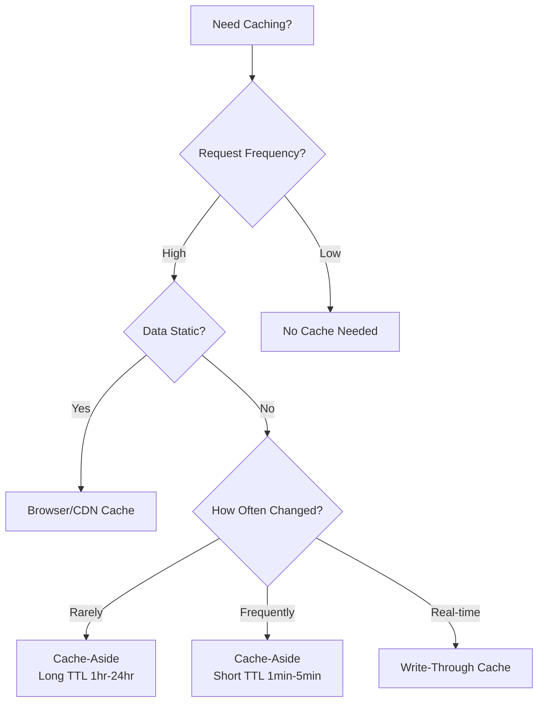

# Day 26: Advanced Caching Strategies - Performance Optimization

## Table of Contents
1. [Caching Fundamentals](#1-caching-fundamentals)
2. [Caching Layers](#2-caching-layers)
3. [Redis Patterns](#3-redis-patterns)
4. [Cache Invalidation](#4-cache-invalidation)
5. [HTTP Caching](#5-http-caching)
6. [Distributed Caching](#6-distributed-caching)
7. [Production Patterns](#7-production-patterns)
8. [Cache Monitoring](#8-cache-monitoring)
9. [Common Pitfalls](#9-common-pitfalls)
10. [Summary](#10-summary)

---

## 1. Caching Fundamentals

### 1.1 Why Cache?

**Without caching**:
```python
# Every request hits database
@app.get("/users/{user_id}")
def get_user(user_id: int):
    user = db.query(User).filter(User.id == user_id).first()  # 100ms
    return user

# 100 req/sec = 100 DB queries/sec
```

**With caching**:
```python
@app.get("/users/{user_id}")
def get_user(user_id: int):
    # Check cache first
    cached = redis.get(f"user:{user_id}")  # 1ms
    if cached:
        return json.loads(cached)
    
    # Cache miss → query DB
    user = db.query(User).filter(User.id == user_id).first()  # 100ms
    
    # Store in cache
    redis.setex(f"user:{user_id}", 3600, json.dumps(user))
    
    return user

# 90% cache hit rate: 90 req from cache (fast), 10 req from DB
```

**Performance**: 100x faster for cache hits!

### 1.2 Cache Hit Ratio

```
Hit Ratio = Cache Hits / Total Requests

90% hit ratio = 10x fewer DB queries
99% hit ratio = 100x fewer DB queries
```

---

## 2. Caching Layers

### 2.1 Multi-Layer Caching

```
Client → Browser Cache (304 Not Modified)
       → CDN (CloudFlare, Akamai)
       → Application Cache (Redis)
       → Database Query Cache (PostgreSQL shared_buffers)
       → Disk Cache (OS page cache)
```

### 2.2 Browser Cache (Client-Side)

```http
HTTP/1.1 200 OK
Cache-Control: max-age=3600, public
ETag: "abc123"

# Browser caches for 1 hour
# Next request within 1 hour → serves from browser cache
```

### 2.3 CDN Cache

```
User (Europe) → CDN Edge Server (Europe) → Origin Server (US)

First request: Origin Server (slow)
Subsequent requests: CDN Edge (fast!)
```

### 2.4 Application Cache (Redis)

```python
import redis

r = redis.Redis(host='localhost', port=6379)

# Cache user
r.setex("user:123", 3600, json.dumps({"id": 123, "name": "Alice"}))

# Retrieve
cached_user = r.get("user:123")
```

---

## 3. Redis Patterns

### 3.1 Cache-Aside (Lazy Loading)

```python
def get_user(user_id):
    # 1. Try cache first
    cached = redis.get(f"user:{user_id}")
    if cached:
        return json.loads(cached)
    
    # 2. Cache miss → query DB
    user = db.query(User).filter(User.id == user_id).first()
    
    # 3. Store in cache
    if user:
        redis.setex(f"user:{user_id}", 3600, json.dumps(user))
    
    return user
```

**Pros**: Only cache what's requested  
**Cons**: Cold cache, cache miss penalty

### 3.2 Write-Through Cache

```python
def update_user(user_id, data):
    # 1. Update database
    user = db.query(User).filter(User.id == user_id).first()
    user.name = data['name']
    db.commit()
    
    # 2. Update cache
    redis.setex(f"user:{user_id}", 3600, json.dumps(user))
    
    return user
```

**Pros**: Cache always in sync  
**Cons**: Write penalty (slower), unused data cached

### 3.3 Write-Behind (Write-Back) Cache

```python
def update_user(user_id, data):
    # 1. Update cache immediately
    redis.hset(f"user:{user_id}", "name", data['name'])
    
    # 2. Queue DB write (async)
    queue.enqueue(write_to_db, user_id, data)
    
    return {"status": "success"}

# Background worker
def write_to_db(user_id, data):
    user = db.query(User).filter(User.id == user_id).first()
    user.name = data['name']
    db.commit()
```

**Pros**: Fast writes  
**Cons**: Data loss risk (if cache crashes before DB write)

### 3.4 Refresh-Ahead Cache

```python
import threading

def get_user(user_id):
    cached = redis.get(f"user:{user_id}")
    ttl = redis.ttl(f"user:{user_id}")
    
    # Refresh cache proactively if TTL < 10% remaining
    if ttl < 360:  # 10% of 3600s
        # Asynchronously refresh
        threading.Thread(target=refresh_cache, args=(user_id,)).start()
    
    if cached:
        return json.loads(cached)
    
    # Cache miss → query DB
    user = db.query(User).filter(User.id == user_id).first()
    redis.setex(f"user:{user_id}", 3600, json.dumps(user))
    return user

def refresh_cache(user_id):
    user = db.query(User).filter(User.id == user_id).first()
    redis.setex(f"user:{user_id}", 3600, json.dumps(user))
```

---

## 4. Cache Invalidation

### 4.1 TTL (Time-To-Live)

```python
# Cache for 1 hour
redis.setex("user:123", 3600, data)

# Cache forever until explicitly deleted
redis.set("user:123", data)
```

**Pros**: Simple  
**Cons**: Stale data for TTL duration

### 4.2 Manual Invalidation

```python
def update_user(user_id, data):
    # Update DB
    user = db.query(User).filter(User.id == user_id).first()
    user.name = data['name']
    db.commit()
    
    # Invalidate cache
    redis.delete(f"user:{user_id}")
```

### 4.3 Event-Driven Invalidation

```python
# Publisher (on update)
def update_user(user_id, data):
    user = db.query(User).filter(User.id == user_id).first()
    user.name = data['name']
    db.commit()
    
    # Publish invalidation event
    redis.publish("user:invalidate", json.dumps({"user_id": user_id}))

# Subscriber (listening)
pubsub = redis.pubsub()
pubsub.subscribe("user:invalidate")

for message in pubsub.listen():
    if message['type'] == 'message':
        event = json.loads(message['data'])
        redis.delete(f"user:{event['user_id']}")
```

### 4.4 Cache Tags

```python
# Tag cache entries
redis.set("user:123", user_data)
redis.sadd("tag:users", "user:123")  # Add to set

redis.set("user:456", user_data)
redis.sadd("tag:users", "user:456")

# Invalidate all users
def invalidate_all_users():
    # Get all keys with tag
    keys = redis.smembers("tag:users")
    
    # Delete all
    for key in keys:
        redis.delete(key)
    
    # Clear tag set
    redis.delete("tag:users")
```

---

## 5. HTTP Caching

### 5.1 Cache-Control Headers

```python
from fastapi import Response

@app.get("/users/{user_id}")
def get_user(user_id: int, response: Response):
    user = db.query(User).filter(User.id == user_id).first()
    
    # Cache for 1 hour
    response.headers["Cache-Control"] = "max-age=3600, public"
    
    return user
```

**Directives**:
- `max-age=3600`: Cache for 1 hour
- `public`: Can be cached by CDN
- `private`: Only browser cache (no CDN)
- `no-cache`: Revalidate with server
- `no-store`: Don't cache at all

### 5.2 ETag

```python
import hashlib

@app.get("/users/{user_id}")
def get_user(user_id: int, if_none_match: str = Header(None)):
    user = db.query(User).filter(User.id == user_id).first()
    
    # Generate ETag (hash of content)
    etag = hashlib.md5(json.dumps(user).encode()).hexdigest()
    
    # Client sent ETag → content unchanged
    if if_none_match == etag:
        return Response(status_code=304)  # Not Modified
    
    # Content changed → return new data
    return Response(
        content=json.dumps(user),
        headers={
            "ETag": etag,
            "Cache-Control": "max-age=3600"
        }
    )
```

**Workflow**:
```
1. Client: GET /users/123
   Server: 200 OK, ETag: "abc123"

2. Client: GET /users/123, If-None-Match: "abc123"
   Server: 304 Not Modified (no body, fast!)
```

### 5.3 Last-Modified

```python
@app.get("/users/{user_id}")
def get_user(user_id: int, if_modified_since: str = Header(None)):
    user = db.query(User).filter(User.id == user_id).first()
    
    last_modified = user.updated_at.strftime('%a, %d %b %Y %H:%M:%S GMT')
    
    # Client sent If-Modified-Since → check if updated
    if if_modified_since and if_modified_since >= last_modified:
        return Response(status_code=304)
    
    return Response(
        content=json.dumps(user),
        headers={"Last-Modified": last_modified}
    )
```

---

## 6. Distributed Caching

### 6.1 Redis Cluster

```python
from rediscluster import RedisCluster

startup_nodes = [
    {"host": "redis-1", "port": 6379},
    {"host": "redis-2", "port": 6379},
    {"host": "redis-3", "port": 6379}
]

redis = RedisCluster(startup_nodes=startup_nodes)

# Automatically sharded across nodes
redis.set("user:123", data)
```

### 6.2 Consistent Hashing

```
Hash(key) % num_nodes = target_node

user:123 → Node 1
user:456 → Node 2
user:789 → Node 1
```

**Problem**: Adding/removing nodes invalidates most cache.

**Solution**: Consistent hashing (ring).

---

## 7. Production Patterns

### 7.1 Cache Warming

```python
# Pre-populate cache on startup
def warm_cache():
    # Top 100 users
    top_users = db.query(User).order_by(User.views.desc()).limit(100).all()
    
    for user in top_users:
        redis.setex(f"user:{user.id}", 3600, json.dumps(user))

# Run on app startup
@app.on_event("startup")
def startup():
    warm_cache()
```

### 7.2 Cache Stampede Prevention

**Problem**: Cache expires → 1000 requests hit DB simultaneously.

**Solution**: Lock pattern
```python
import time

def get_user(user_id):
    cached = redis.get(f"user:{user_id}")
    if cached:
        return json.loads(cached)
    
    # Try to acquire lock
    lock_key = f"lock:user:{user_id}"
    if redis.setnx(lock_key, "1"):
        redis.expire(lock_key, 10)  # Lock expires in 10s
        
        try:
            # Query DB
            user = db.query(User).filter(User.id == user_id).first()
            redis.setex(f"user:{user_id}", 3600, json.dumps(user))
            return user
        finally:
            redis.delete(lock_key)
    else:
        # Lock held by another request → wait and retry
        time.sleep(0.1)
        return get_user(user_id)
```

### 7.3 Circuit Breaker for Cache

```python
class CacheCircuitBreaker:
    def __init__(self, threshold=5):
        self.failures = 0
        self.threshold = threshold
        self.state = "CLOSED"  # CLOSED, OPEN, HALF_OPEN
    
    def get(self, key):
        if self.state == "OPEN":
            return None  # Don't try cache, go directly to DB
        
        try:
            value = redis.get(key)
            self.failures = 0  # Reset on success
            return value
        except:
            self.failures += 1
            
            if self.failures >= self.threshold:
                self.state = "OPEN"
                # Automatically reset after 60s
                threading.Timer(60, self.reset).start()
            
            return None
    
    def reset(self):
        self.state = "CLOSED"
        self.failures = 0
```

---

## 8. Cache Monitoring

### 8.1 Metrics

```python
from prometheus_client import Counter, Histogram

cache_hits = Counter('cache_hits_total', 'Total cache hits')
cache_misses = Counter('cache_misses_total', 'Total cache misses')
cache_latency = Histogram('cache_operation_seconds', 'Cache operation latency')

@cache_latency.time()
def get_from_cache(key):
    value = redis.get(key)
    
    if value:
        cache_hits.inc()
    else:
        cache_misses.inc()
    
    return value
```

**Monitor**:
- Hit ratio
- Latency (p50, p99)
- Memory usage
- Eviction rate

---

## 9. Common Pitfalls

### 9.1 Cache Avalanche

**Problem**: Many keys expire simultaneously → DB overload.

**Solution**: Add jitter to TTL
```python
import random

ttl = 3600 + random.randint(-300, 300)  # 3600 ± 5 min
redis.setex(key, ttl, value)
```

### 9.2 Cache Penetration

**Problem**: Requests for non-existent keys bypass cache → always hit DB.

**Solution**: Cache null results
```python
user = db.query(User).filter(User.id == user_id).first()

if user:
    redis.setex(f"user:{user_id}", 3600, json.dumps(user))
else:
    # Cache null result for 1 minute
    redis.setex(f"user:{user_id}", 60, "null")
```

### 9.3 Large Cache Values

❌ **Bad**: Cache entire 10MB object
```python
redis.set("report:123", large_report)  # 10 MB!
```

✅ **Good**: Cache only IDs, fetch details on demand
```python
redis.set("report:123:summary", small_summary)  # 10 KB
# Fetch full report only if needed
```

---

## 10. Summary

### 10.1 Key Takeaways

1. ✅ **Multi-Layer Caching** - Browser, CDN, app, DB
2. ✅ **Cache-Aside** - Most common pattern
3. ✅ **TTL** - Prevent stale data
4. ✅ **ETag** - HTTP conditional requests
5. ✅ **Stampede Prevention** - Lock pattern
6. ✅ **Cache Warming** - Pre-populate hot data
7. ✅ **Monitor** - Hit ratio, latency, evictions

### 10.2 Caching Strategy Decision Tree



### 10.3 Tomorrow (Day 27): Rate Limiting & Throttling

- **Rate limiting algorithms**: Token bucket, leaky bucket, sliding window
- **Distributed rate limiting**: Redis-based
- **Adaptive throttling**: Based on load
- **API quotas**: Per user/plan
- **DDoS protection**: Challenge-response
- **Production patterns**: Multi-tier limits

See you tomorrow! 🚀

---

**File Statistics**: ~1000 lines | Advanced Caching Strategies mastered ✅
