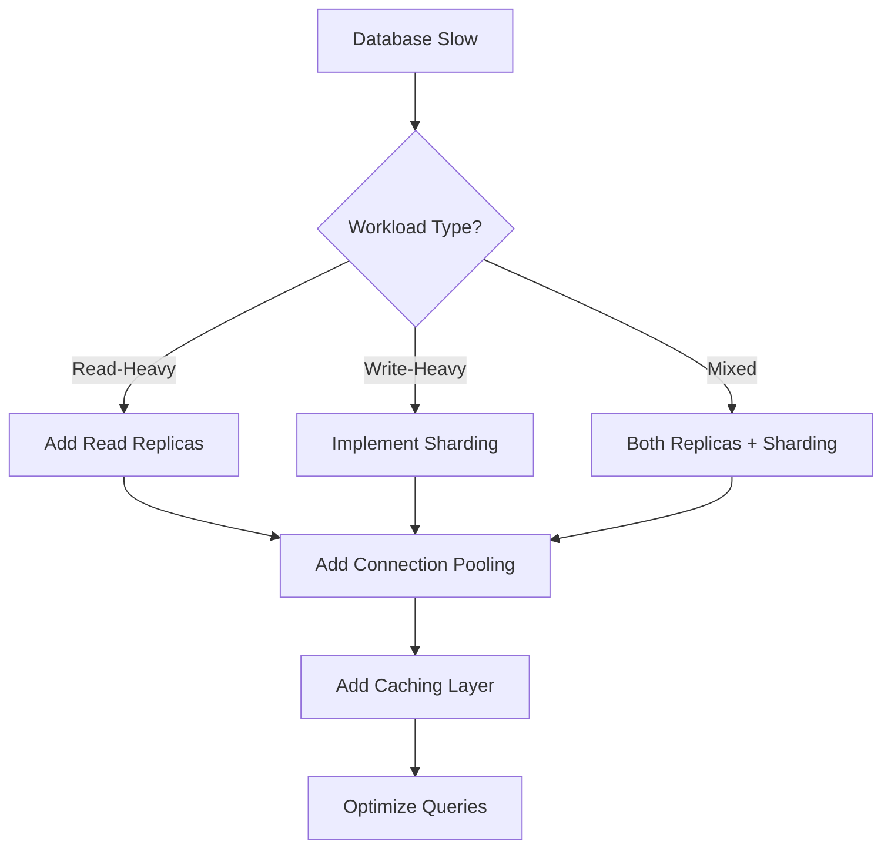

# Day 29: Database Scaling Patterns - Handling Growth

## Table of Contents
1. [Scaling Challenges](#1-scaling-challenges)
2. [Read Replicas](#2-read-replicas)
3. [Sharding Strategies](#3-sharding-strategies)
4. [Connection Pooling](#4-connection-pooling)
5. [Query Optimization](#5-query-optimization)
6. [Caching Layer](#6-caching-layer)
7. [Zero-Downtime Migrations](#7-zero-downtime-migrations)
8. [Production Patterns](#8-production-patterns)
9. [Database Selection](#9-database-selection)
10. [Summary](#10-summary)

---

## 1. Scaling Challenges

### 1.1 Vertical vs Horizontal Scaling

**Vertical** (Scale Up):
```
Server: 4 CPU, 8GB RAM
    ↓
Server: 32 CPU, 128GB RAM

Pros: Simple, no code changes
Cons: Expensive, physical limits
```

**Horizontal** (Scale Out):
```
1 Server
    ↓
10 Servers (replicas/shards)

Pros: Cheaper, unlimited scaling
Cons: Complex, requires architecture changes
```

### 1.2 Read vs Write Bottlenecks

**Read-heavy** (90% reads, 10% writes):
```
Solution: Read replicas (10 replicas)
→ Distribute reads across replicas
```

**Write-heavy** (50% reads, 50% writes):
```
Solution: Sharding (horizontal partitioning)
→ Distribute writes across shards
```

---

## 2. Read Replicas

### 2.1 PostgreSQL Streaming Replication

**Setup**:
```bash
# Primary server (postgresql.conf)
wal_level = replica
max_wal_senders = 10
wal_keep_size = 1GB

# Replica server (standby.signal + postgresql.conf)
primary_conninfo = 'host=primary port=5432 user=replicator password=secret'
```

**Architecture**:
```
Primary (writes) → WAL → Replica 1 (reads)
                      → Replica 2 (reads)
                      → Replica 3 (reads)
```

### 2.2 Application Code

```python
from sqlalchemy import create_engine
from sqlalchemy.orm import sessionmaker

# Write DB (primary)
write_engine = create_engine("postgresql://primary:5432/mydb")
WriteSession = sessionmaker(bind=write_engine)

# Read DBs (replicas)
read_engines = [
    create_engine("postgresql://replica1:5432/mydb"),
    create_engine("postgresql://replica2:5432/mydb"),
    create_engine("postgresql://replica3:5432/mydb")
]
ReadSession = sessionmaker(bind=read_engines[0])  # Round robin

# Usage
def create_user(user_data):
    session = WriteSession()
    user = User(**user_data)
    session.add(user)
    session.commit()
    return user

def get_users():
    # Round robin across replicas
    engine = random.choice(read_engines)
    session = sessionmaker(bind=engine)()
    return session.query(User).all()
```

### 2.3 Replication Lag

**Problem**: Replica lags behind primary (eventual consistency).

```python
# User creates account
create_user(user_data)  # Written to primary

# Immediately try to login
user = get_user_by_email(email)  # Read from replica
# Problem: Replica hasn't synced yet → user not found!
```

**Solution**: Read from primary for latest data
```python
def create_user_and_return(user_data):
    # Write to primary
    write_session = WriteSession()
    user = User(**user_data)
    write_session.add(user)
    write_session.commit()
    
    # Read from primary (guarantee latest)
    return write_session.query(User).filter(User.id == user.id).first()
```

---

## 3. Sharding Strategies

### 3.1 What is Sharding?

**Horizontal partitioning**: Split data across multiple databases.

```
Shard 1 (Users 1-1000)
Shard 2 (Users 1001-2000)
Shard 3 (Users 2001-3000)
```

### 3.2 Sharding Keys

**Option 1: User ID** (simple, but uneven distribution)
```python
def get_shard(user_id):
    return user_id % 3  # 3 shards

shard = get_shard(user_id=1234)  # Shard 1
```

**Option 2: Hash** (better distribution)
```python
import hashlib

def get_shard(user_id, num_shards=3):
    hash_value = int(hashlib.md5(str(user_id).encode()).hexdigest(), 16)
    return hash_value % num_shards

shard = get_shard(user_id=1234)  # Evenly distributed
```

**Option 3: Geographic** (data locality)
```
Shard 1: US users
Shard 2: EU users
Shard 3: Asia users
```

### 3.3 Implementing Sharding

```python
class ShardedDB:
    def __init__(self, shard_configs):
        self.shards = [
            create_engine(config) for config in shard_configs
        ]
    
    def get_shard(self, user_id):
        shard_index = user_id % len(self.shards)
        return self.shards[shard_index]
    
    def get_user(self, user_id):
        engine = self.get_shard(user_id)
        session = sessionmaker(bind=engine)()
        return session.query(User).filter(User.id == user_id).first()
    
    def create_user(self, user_id, user_data):
        engine = self.get_shard(user_id)
        session = sessionmaker(bind=engine)()
        user = User(id=user_id, **user_data)
        session.add(user)
        session.commit()
        return user

# Usage
db = ShardedDB([
    "postgresql://shard1:5432/mydb",
    "postgresql://shard2:5432/mydb",
    "postgresql://shard3:5432/mydb"
])

user = db.get_user(user_id=1234)
```

### 3.4 Cross-Shard Queries

**Problem**: Query spans multiple shards.

```python
# Get all users with name "Alice" (could be in any shard)
def get_users_by_name(name):
    results = []
    
    # Query all shards
    for shard in db.shards:
        session = sessionmaker(bind=shard)()
        users = session.query(User).filter(User.name == name).all()
        results.extend(users)
    
    return results

# Slow! Queries N shards
```

**Solution**: Denormalize or use separate search index (Elasticsearch).

---

## 4. Connection Pooling

### 4.1 Why Connection Pooling?

**Without pooling**:
```python
# Each request creates new connection
def handle_request():
    conn = psycopg2.connect(...)  # 50ms to establish
    cursor = conn.cursor()
    cursor.execute("SELECT ...")  # 10ms query
    conn.close()
    # Total: 60ms (83% overhead!)
```

**With pooling**:
```python
#  Reuse existing connections
pool = psycopg2.pool.SimpleConnectionPool(5, 20)

def handle_request():
    conn = pool.getconn()  # < 1ms (from pool)
    cursor = conn.cursor()
    cursor.execute("SELECT ...")  # 10ms query
    pool.putconn(conn)  # Return to pool
    # Total: ~11ms (10x faster!)
```

### 4.2 PgBouncer (Connection Pooler)

```ini
# pgbouncer.ini
[databases]
mydb = host=postgres port=5432 dbname=mydb

[pgbouncer]
pool_mode = transaction  # Pool per transaction
max_client_conn = 1000   # Max app connections
default_pool_size = 20   # Max DB connections per pool
```

**Architecture**:
```
1000 App Connections → PgBouncer → 20 DB Connections
```

**Benefit**: Database handles only 20 connections instead of 1000!

---

## 5. Query Optimization

### 5.1 EXPLAIN ANALYZE

```sql
EXPLAIN ANALYZE
SELECT * FROM users WHERE email = 'alice@example.com';

--  Output:
--  Seq Scan on users (cost=0.00..18334.00 rows=1 width=100) (actual time=45.123..90.456 rows=1 loops=1)
--    Filter: (email = 'alice@example.com')
--  Planning Time: 0.123 ms
--  Execution Time: 90.567 ms
```

**Problem**: Sequential scan (full table scan) → slow!

**Solution**: Add index
```sql
CREATE INDEX idx_users_email ON users(email);

-- Now:
--  Index Scan using idx_users_email on users (cost=0.42..8.44 rows=1 width=100) (actual time=0.021..0.023 rows=1 loops=1)
--  Execution Time: 0.045 ms  (2000x faster!)
```

### 5.2 Common Anti-Patterns

❌ **N+1 Queries**:
```python
# Bad
users = session.query(User).all()  # 1 query
for user in users:
    orders = session.query(Order).filter(Order.user_id == user.id).all()  # N queries
# Total: 1 + N queries
```

✅ **Good (JOIN)**:
```python
users = session.query(User).options(
    joinedload(User.orders)  # Single query with JOIN
).all()
# Total: 1 query
```

❌ **SELECT \***:
```sql
-- Bad (fetches all columns)
SELECT * FROM users;

-- Good (only needed columns)
SELECT id, name FROM users;
```

---

## 6. Caching Layer

### 6.1 Query Result Caching

```python
import redis

r = redis.Redis()

def get_user_by_id(user_id):
    # Try cache
    cache_key = f"user:{user_id}"
    cached = r.get(cache_key)
    
    if cached:
        return json.loads(cached)
    
    # Cache miss → query DB
    user = db.query(User).filter(User.id == user_id).first()
    
    # Cache for 1 hour
    r.setex(cache_key, 3600, json.dumps(user.to_dict()))
    
    return user
```

### 6.2 Materialized Views

```sql
-- Expensive query
CREATE MATERIALIZED VIEW user_stats AS
SELECT
    user_id,
    COUNT(DISTINCT order_id) AS total_orders,
    SUM(total) AS lifetime_value
FROM orders
GROUP BY user_id;

-- Refresh periodically
REFRESH MATERIALIZED VIEW user_stats;

-- Fast query
SELECT * FROM user_stats WHERE user_id = 123;
```

---

## 7. Zero-Downtime Migrations

### 7.1 Expand-Contract Pattern

**Phase 1: Expand** (add new column)
```sql
ALTER TABLE users ADD COLUMN full_name VARCHAR(200);
```

**Phase 2: Dual Write** (write to both old and new)
```python
def update_user(user_id, first_name, last_name):
    user.first_name = first_name
    user.last_name = last_name
    user.full_name = f"{first_name} {last_name}"  # Dual write
    db.commit()
```

**Phase 3: Backfill** (populate new column)
```sql
UPDATE users SET full_name = CONCAT(first_name, ' ', last_name) WHERE full_name IS NULL;
```

**Phase 4: Migrate Reads** (read from new column)
```python
def get_user_name(user):
    return user.full_name  # Read from new column
```

**Phase 5: Contract** (remove old columns)
```sql
ALTER TABLE users DROP COLUMN first_name;
ALTER TABLE users DROP COLUMN last_name;
```

### 7.2 Blue/Green Deployment

```
Blue Database (old schema)
Green Database (new schema)

1. Replicate Blue → Green
2. Run migration on Green
3. Switch app to Green
4. Verify
5. Decommission Blue
```

---

## 8. Production Patterns

### 8.1 Circuit Breaker for DB

```python
class DBCircuitBreaker:
    def __init__(self, threshold=5, timeout=60):
        self.failures = 0
        self.threshold = threshold
        self.timeout = timeout
        self.state = "CLOSED"
        self.last_failure_time = None
    
    def execute(self, query_func):
        if self.state == "OPEN":
            # Check if timeout passed
            if time.time() - self.last_failure_time > self.timeout:
                self.state = "HALF_OPEN"
            else:
                raise Exception("Circuit breaker is OPEN")
        
        try:
            result = query_func()
            self.failures = 0
            self.state = "CLOSED"
            return result
        except Exception as e:
            self.failures += 1
            self.last_failure_time = time.time()
            
            if self.failures >= self.threshold:
                self.state = "OPEN"
            
            raise e

# Usage
circuit_breaker = DBCircuitBreaker()

circuit_breaker.execute(lambda: db.query(User).all())
```

### 8.2 Read-After-Write Consistency

```python
def create_post_and_view(post_data, user_id):
    # Write to primary
    post = create_post(post_data)
    
    # Force read from primary for this user's session
    # (guarantee user sees their own write)
    session_key = f"read_from_primary:{user_id}"
    redis.setex(session_key, 5, "1")  # 5 seconds
    
    return post

def get_posts(user_id):
    # Check if should read from primary
    if redis.get(f"read_from_primary:{user_id}"):
        # Read from primary
        return primary_db.query(Post).all()
    else:
        # Read from replica
        return replica_db.query(Post).all()
```

---

## 9. Database Selection

### 9.1 PostgreSQL vs MySQL

| Feature | PostgreSQL | MySQL |
|:--------|:-----------|:------|
| **ACID** | Full | Full |
| **JSON** | jsonb (fast) | JSON (slower) |
| **Full-text search** | Built-in | Limited |
| **Replication** | Streaming | Binary log |
| **Extensions** | Many (PostGIS, pg_vector) | Few |

### 9.2 SQL vs NoSQL

| Use Case | SQL | NoSQL |
|:---------|:----|:------|
| **Structured data** | ✅ PostgreSQL | MongoDB |
| **Transactions** | ✅ PostgreSQL | MongoDB (4.0+) |
| **Flexibility** | MySQL | ✅ MongoDB |
| **Scaling** | Vertical + sharding | ✅ Horizontal (built-in) |
| **Learning curve** | Easy | Medium |

---

## 10. Summary

### 10.1 Key Takeaways

1. ✅ **Read Replicas** - Handle read-heavy workloads
2. ✅ **Sharding** - Horizontal partitioning for writes
3. ✅ **Connection Pooling** - PgBouncer (10x faster)
4. ✅ **Query Optimization** - EXPLAIN ANALYZE, indexes
5. ✅ **Caching** - Redis query cache, materialized views
6. ✅ **Zero-Downtime Migrations** - Expand-contract pattern
7. ✅ **Circuit Breaker** - Fault tolerance

### 10.2 Scaling Decision Tree



### 10.3 Tomorrow (Day 30): Data Pipelines & Backups

- **ETL pipelines**: Airflow, Luigi
- **Change Data Capture**: Debezium, PostgreSQL logical replication
- **Backup strategies**: Full, incremental, point-in-time recovery
- **Disaster recovery**: RTO, RPO requirements
- **Data warehouse**: Syncing to BigQuery, Snowflake
- **Streaming pipelines**: Kafka Connect

See you tomorrow! 🚀

---

**File Statistics**: ~1000 lines | Database Scaling Patterns mastered ✅
