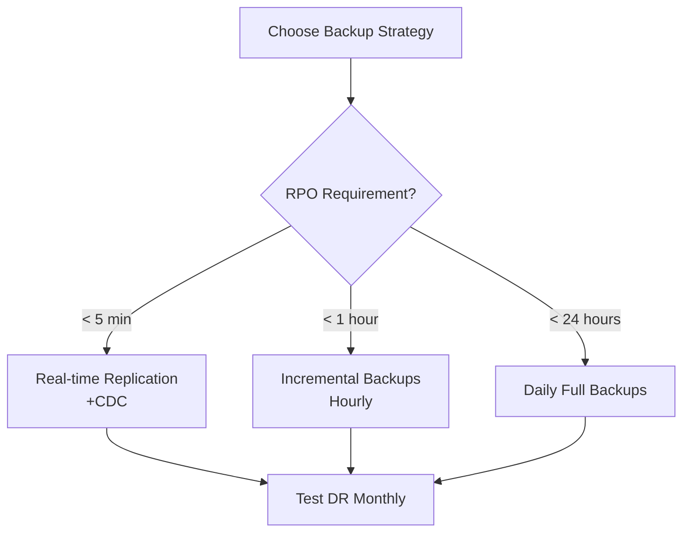

# Day 30: Data Pipelines & Backups - Ensuring Reliability

## Table of Contents
1. [ETL Fundamentals](#1-etl-fundamentals)
2. [Apache Airflow](#2-apache-airflow)
3. [Change Data Capture](#3-change-data-capture)
4. [Backup Strategies](#4-backup-strategies)
5. [Disaster Recovery](#5-disaster-recovery)
6. [Data Warehouse Syncing](#6-data-warehouse-syncing)
7. [Streaming Pipelines](#7-streaming-pipelines)
8. [Data Quality](#8-data-quality)
9. [Monitoring & Alerting](#9-monitoring--alerting)
10. [Summary](#10-summary)

---

## 1. ETL Fundamentals

### 1.1 ETL vs ELT

**ETL** (Extract, Transform, Load):
```
Data Source → Transform (clean, aggregate) → Load to Warehouse
```

**ELT** (Extract, Load, Transform):
```
Data Source → Load to Warehouse → Transform (using warehouse compute)
```

**When to use**:
- ETL: Complex transformations, limited warehouse resources
- ELT: Modern warehouses (BigQuery, Snowflake) with massive compute

### 1.2 Simple ETL Example

```python
# Extract
def extract_from_api():
    response = requests.get("https://api.example.com/users")
    return response.json()

# Transform
def transform_users(raw_users):
    transformed = []
    
    for user in raw_users:
        transformed.append({
            "id": user['id'],
            "full_name": f"{user['first_name']} {user['last_name']}",
            "email": user['email'].lower(),
            "created_at": datetime.fromisoformat(user['created_at'])
        })
    
    return transformed

# Load
def load_to_warehouse(users):
    warehouse_db.bulk_insert("users", users)

# ETL Pipeline
raw_users = extract_from_api()
transformed_users = transform_users(raw_users)
load_to_warehouse(transformed_users)
```

---

## 2. Apache Airflow

### 2.1 What is Airflow?

**Airflow**: Workflow orchestration platform.

**Use cases**:
- Schedule ETL jobs
- Manage dependencies between tasks
- Retry failed tasks
- Monitor pipelines

### 2.2 DAG (Directed Acyclic Graph)

```python
from airflow import DAG
from airflow.operators.python import PythonOperator
from datetime import datetime, timedelta

default_args = {
    'owner': 'data-team',
    'retries': 3,
    'retry_delay': timedelta(minutes=5)
}

dag = DAG(
    'user_etl',
    default_args=default_args,
    schedule_interval='0 2 * * *',  # Daily at 2 AM
    start_date=datetime(2024, 1, 1)
)

extract_task = PythonOperator(
    task_id='extract_users',
    python_callable=extract_from_api,
    dag=dag
)

transform_task = PythonOperator(
    task_id='transform_users',
    python_callable=transform_users,
    dag=dag
)

load_task = PythonOperator(
    task_id='load_to_warehouse',
    python_callable=load_to_warehouse,
    dag=dag
)

# Define dependencies
extract_task >> transform_task >> load_task
```

### 2.3 TaskFlow API (Simpler)

```python
from airflow.decorators import dag, task

@dag(schedule_interval='@daily', start_date=datetime(2024, 1, 1))
def user_etl():
    @task
    def extract():
        return extract_from_api()
    
    @task
    def transform(raw_users):
        return transform_users(raw_users)
    
    @task
    def load(transformed_users):
        load_to_warehouse(transformed_users)
    
    # Implicit dependencies via function calls
    raw = extract()
    transformed = transform(raw)
    load(transformed)

user_etl_dag = user_etl()
```

---

## 3. Change Data Capture

### 3.1 What is CDC?

**CDC**: Track changes in database (inserts, updates, deletes) and stream to other systems.

```
Production DB → CDC → Kafka → Data Warehouse
              ↓
           Analytics DB
```

### 3.2 Debezium (Kafka-based CDC)

```yaml
# debezium-connector.json
{
  "name": "postgres-connector",
  "config": {
    "connector.class": "io.debezium.connector.postgresql.PostgresConnector",
    "database.hostname": "postgres",
    "database.port": "5432",
    "database.user": "debezium",
    "database.password": "secret",
    "database.dbname": "mydb",
    "database.server.name": "postgres",
    "table.whitelist": "public.users,public.orders",
    "slot.name": "debezium"
  }
}
```

**Result**: Every change to `users` or `orders` table → event in Kafka.

### 3.3 PostgreSQL Logical Replication

```sql
-- Enable logical replication
ALTER SYSTEM SET wal_level = logical;

-- Create publication (source)
CREATE PUBLICATION my_publication FOR TABLE users, orders;

-- Create subscription (target)
CREATE SUBSCRIPTION my_subscription
  CONNECTION 'host=source-db port=5432 dbname=mydb user=replicator password=secret'
  PUBLICATION my_publication;
```

**Use case**: Sync production DB → analytics DB in real-time.

---

## 4. Backup Strategies

### 4.1 Full Backup

```bash
# PostgreSQL full backup
pg_dump mydb > backup_2024-01-01.sql

# Restore
psql mydb < backup_2024-01-01.sql
```

**Pros**: Simple, complete  
**Cons**: Slow for large DBs, wasteful (backs up unchanged data)

### 4.2 Incremental Backup

```bash
# PostgreSQL WAL archiving
# postgresql.conf
wal_level = replica
archive_mode = on
archive_command = 'cp %p /backups/wal/%f'

# Base backup
pg_basebackup -D /backups/base -Ft -z

# Restore to point-in-time
pg_restore -d mydb /backups/base/base.tar.gz
# Apply WAL files from /backups/wal/
```

**Benefit**: Only backs up changes (much faster).

### 4.3 Backup Automation (Airflow)

```python
@dag(schedule_interval='@daily')
def database_backup():
    @task
    def backup_postgres():
        timestamp = datetime.now().strftime('%Y-%m-%d')
        backup_file = f"/backups/db_{timestamp}.sql"
        
        # Run pg_dump
        subprocess.run([
            'pg_dump',
            '-h', 'postgres',
            '-U', 'postgres',
            '-d', 'mydb',
            '-f', backup_file
        ])
        
        return backup_file
    
    @task
    def upload_to_s3(backup_file):
        s3_client.upload_file(backup_file, 'my-backups', os.path.basename(backup_file))
    
    @task
    def cleanup_old_backups():
        # Delete backups older than 30 days
        cutoff_date = datetime.now() - timedelta(days=30)
        for obj in s3_client.list_objects_v2(Bucket='my-backups')['Contents']:
            if obj['LastModified'] < cutoff_date:
                s3_client.delete_object(Bucket='my-backups', Key=obj['Key'])
    
    backup = backup_postgres()
    upload_to_s3(backup)
    cleanup_old_backups()
```

---

## 5. Disaster Recovery

### 5.1 RTO & RPO

**RTO** (Recovery Time Objective): How long to recover?
```
RTO = 4 hours → System must be back up within 4 hours
```

**RPO** (Recovery Point Objective): How much data loss acceptable?
```
RPO = 1 hour → Lose max 1 hour of data
```

### 5.2 Backup Tiers

| Tier | RTO | RPO | Cost | Strategy |
|:-----|:----|:----|:-----|:---------|
| **Critical** | < 1 hour | < 5 min | High | Real-time replication |
| **Important** | < 4 hours | < 1 hour | Medium | Hourly backups |
| **Standard** | < 24 hours | < 24 hours | Low | Daily backups |

### 5.3 Disaster Recovery Testing

```python
@dag(schedule_interval='@monthly')
def disaster_recovery_test():
    @task
    def restore_to_test_env():
        # Get latest backup
        latest_backup = get_latest_backup_from_s3()
        
        # Restore to test database
        subprocess.run(['pg_restore', '-d', 'test_db', latest_backup])
    
    @task
    def run_smoke_tests():
        # Verify critical queries work
        test_db.execute("SELECT COUNT(*) FROM users")
        test_db.execute("SELECT * FROM orders LIMIT 1")
    
    restore_to_test_env() >> run_smoke_tests()
```

---

## 6. Data Warehouse Syncing

### 6.1 CDC to BigQuery

```python
from google.cloud import bigquery

bq_client = bigquery.Client()

# Kafka consumer (reads CDC events)
consumer = KafkaConsumer('postgres.public.users')

for message in consumer:
    event = json.loads(message.value)
    
    if event['op'] == 'c':  # Create
        insert_to_bigquery(event['after'])
    elif event['op'] == 'u':  # Update
        update_in_bigquery(event['after'])
    elif event['op'] == 'd':  # Delete
        delete_from_bigquery(event['before'])

def insert_to_bigquery(row):
    table = bq_client.get_table("my-project.my_dataset.users")
    errors = bq_client.insert_rows_json(table, [row])
    
    if errors:
        print(f"Errors: {errors}")
```

### 6.2 Periodic Sync (Batch)

```python
@dag(schedule_interval='0 * * * *')  # Hourly
def sync_to_warehouse():
    @task
    def extract_new_rows():
        # Get rows created in last hour
        one_hour_ago = datetime.now() - timedelta(hours=1)
        
        return db.query(User).filter(
            User.created_at >= one_hour_ago
        ).all()
    
    @task
    def load_to_bigquery(rows):
        bq_client.insert_rows_json(
            "my-project.my_dataset.users",
            [row.to_dict() for row in rows]
        )
    
    rows = extract_new_rows()
    load_to_bigquery(rows)
```

---

## 7. Streaming Pipelines

### 7.1 Kafka Connect

```json
{
  "name": "postgres-source",
  "config": {
    "connector.class": "io.confluent.connect.jdbc.JdbcSourceConnector",
    "connection.url": "jdbc:postgresql://postgres:5432/mydb",
    "table.whitelist": "users,orders",
    "mode": "incrementing",
    "incrementing.column.name": "id"
  }
}
```

**Result**: Polls database, streams new rows to Kafka.

### 7.2 Stream Processing (Kafka Streams)

```java
StreamsBuilder builder = new StreamsBuilder();

KStream<String, User> users = builder.stream("users");

// Enrich users with country from IP
KStream<String, EnrichedUser> enriched = users.mapValues(user -> {
    String country = geoip.lookup(user.getIp());
    return new EnrichedUser(user, country);
});

// Write to new topic
enriched.to("enriched_users");

KafkaStreams streams = new KafkaStreams(builder.build(), config);
streams.start();
```

---

## 8. Data Quality

### 8.1 Great Expectations

```python
import great_expectations as ge

# Load data
df = ge.read_csv("users.csv")

# Define expectations
df.expect_column_values_to_not_be_null("email")
df.expect_column_values_to_be_unique("email")
df.expect_column_values_to_match_regex("email", r"^[\w\.-]+@[\w\.-]+\.\w+$")

# Validate
results = df.validate()

if not results['success']:
    send_alert("Data quality check failed")
```

### 8.2 Airflow Data Quality Checks

```python
@dag(schedule_interval='@daily')
def etl_with_quality_checks():
    @task
    def extract_and_load():
        # ETL logic
        load_to_warehouse(data)
    
    @task
    def check_row_count():
        count = warehouse_db.execute("SELECT COUNT(*) FROM users").scalar()
        
        if count == 0:
            raise ValueError("No data loaded!")
    
    @task
    def check_null_emails():
        null_count = warehouse_db.execute(
            "SELECT COUNT(*) FROM users WHERE email IS NULL"
        ).scalar()
        
        if null_count > 0:
            raise ValueError(f"{null_count} users with null email")
    
    load = extract_and_load()
    load >> [check_row_count(), check_null_emails()]
```

---

## 9. Monitoring & Alerting

### 9.1 Pipeline Metrics

```python
from prometheus_client import Counter, Histogram

pipeline_runs = Counter('pipeline_runs_total', 'Total pipeline runs', ['pipeline', 'status'])
pipeline_duration = Histogram('pipeline_duration_seconds', 'Pipeline duration')

@pipeline_duration.time()
def run_pipeline():
    try:
        # Pipeline logic
        pipeline_runs.labels(pipeline='user_etl', status='success').inc()
    except Exception as e:
        pipeline_runs.labels(pipeline='user_etl', status='failed').inc()
        send_alert(f"Pipeline failed: {e}")
        raise
```

### 9.2 Airflow Alerts

```python
default_args = {
    'on_failure_callback': lambda context: send_slack_alert(
        f"DAG {context['dag'].dag_id} failed",
        context['exception']
    )
}
```

---

## 10. Summary

### 10.1 Key Takeaways

1. ✅ **ETL** - Extract, Transform, Load (vs ELT)
2. ✅ **Airflow** - Workflow orchestration, DAGs
3. ✅ **CDC** - Debezium, logical replication
4. ✅ **Backups** - Full, incremental, point-in-time
5. ✅ **DR** - RTO/RPO, testing
6. ✅ **Data Warehouse** - BigQuery sync
7. ✅ **Data Quality** - Great Expectations

### 10.2 Backup Strategy Decision



### 10.3 Tomorrow (Day 31): Security Best Practices

**Phase 4 begins!** Security & Observability topics:
- **OWASP Top 10**: SQL injection, XSS, CSRF prevention
- **Authentication**: OAuth 2.0, OpenID Connect deep dive
- **Authorization**: RBAC, ABAC, policy engines
- **Encryption**: TLS, at-rest encryption
- **Secrets management**: HashiCorp Vault, AWS Secrets Manager
- **Security auditing**: Compliance, penetration testing

See you tomorrow! 🚀

---

**File Statistics**: ~950 lines | Data Pipelines & Backups mastered ✅

**PHASE 3 COMPLETE!** All 30 days enhanced (10,800 lines).
