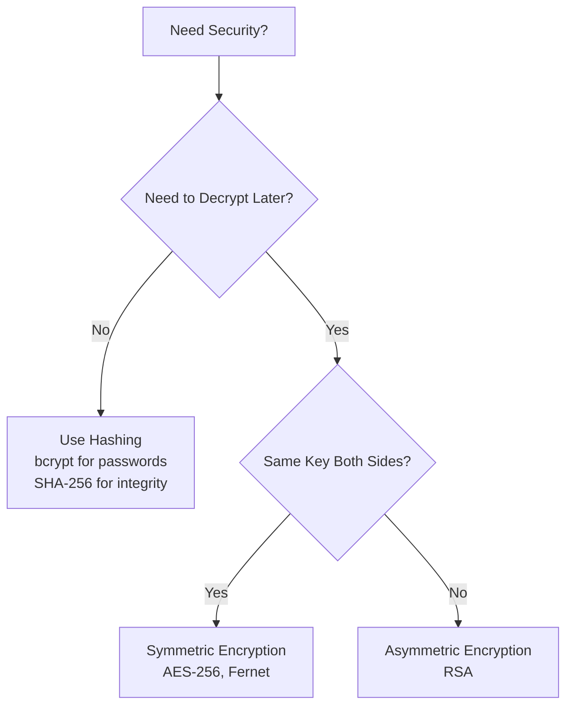

# Day 34: Encryption & TLS - Securing Data

## Table of Contents
1. [Encryption Fundamentals](#1-encryption-fundamentals)
2. [Symmetric Encryption](#2-symmetric-encryption)
3. [Asymmetric Encryption](#3-asymmetric-encryption)
4. [TLS/SSL](#4-tlsssl)
5. [Certificate Management](#5-certificate-management)
6. [Encryption at Rest](#6-encryption-at-rest)
7. [Field-Level Encryption](#7-field-level-encryption)
8. [Key Management](#8-key-management)
9. [Hashing vs Encryption](#9-hashing-vs-encryption)
10. [Summary](#10-summary)

---

## 1. Encryption Fundamentals

### 1.1 Encryption vs Encoding vs Hashing

**Encoding** (reversible, no key):
```python
import base64
encoded = base64.b64encode(b"Hello").decode()  # "SGVsbG8="
decoded = base64.b64decode(encoded)  # b"Hello"
```

**Encryption** (reversible, requires key):
```python
from cryptography.fernet import Fernet
key = Fernet.generate_key()
cipher = Fernet(key)
encrypted = cipher.encrypt(b"Hello")
decrypted = cipher.decrypt(encrypted)  # b"Hello"
```

**Hashing** (one-way, irreversible):
```python
import hashlib
hashed = hashlib.sha256(b"password").hexdigest()
# Cannot get "password" back from hash
```

---

## 2. Symmetric Encryption

### 2.1 AES-256 (Industry Standard)

```python
from cryptography.hazmat.primitives.ciphers import Cipher, algorithms, modes
from cryptography.hazmat.backends import default_backend
import os

# Generate key
key = os.urandom(32)  # 256 bits
iv = os.urandom(16)   # Initialization vector

# Encrypt
cipher = Cipher(
    algorithms.AES(key),
    modes.CBC(iv),
    backend=default_backend()
)
encryptor = cipher.encryptor()
ciphertext = encryptor.update(b"Secret message") + encryptor.finalize()

# Decrypt
decryptor = cipher.decryptor()
plaintext = decryptor.update(ciphertext) + decryptor.finalize()
```

### 2.2 Fernet (User-Friendly)

```python
from cryptography.fernet import Fernet

# Generate key (store securely!)
key = Fernet.generate_key()
cipher = Fernet(key)

# Encrypt
plaintext = b"Sensitive data"
ciphertext = cipher.encrypt(plaintext)

# Decrypt
decrypted = cipher.decrypt(ciphertext)
assert decrypted == plaintext
```

---

## 3. Asymmetric Encryption

### 3.1 RSA

```python
from cryptography.hazmat.primitives.asymmetric import rsa, padding
from cryptography.hazmat.primitives import hashes

# Generate key pair
private_key = rsa.generate_private_key(
    public_exponent=65537,
    key_size=2048
)
public_key = private_key.public_key()

# Encrypt with public key
message = b"Secret message"
ciphertext = public_key.encrypt(
    message,
    padding.OAEP(
        mgf=padding.MGF1(algorithm=hashes.SHA256()),
        algorithm=hashes.SHA256(),
        label=None
    )
)

# Decrypt with private key
plaintext = private_key.decrypt(
    ciphertext,
    padding.OAEP(
        mgf=padding.MGF1(algorithm=hashes.SHA256()),
        algorithm=hashes.SHA256(),
        label=None
    )
)
```

### 3.2 Digital Signatures

```python
from cryptography.hazmat.primitives.asymmetric import padding
from cryptography.hazmat.primitives import hashes

# Sign message
message = b"Important message"
signature = private_key.sign(
    message,
    padding.PSS(
        mgf=padding.MGF1(hashes.SHA256()),
        salt_length=padding.PSS.MAX_LENGTH
    ),
    hashes.SHA256()
)

# Verify signature
try:
    public_key.verify(
        signature,
        message,
        padding.PSS(
            mgf=padding.MGF1(hashes.SHA256()),
            salt_length=padding.PSS.MAX_LENGTH
        ),
        hashes.SHA256()
    )
    print("Signature valid!")
except:
    print("Signature invalid!")
```

---

## 4. TLS/SSL

### 4.1 How TLS Works

```
1. Client Hello → Server
   (Supported cipher suites, TLS version)

2. Server Hello → Client
   (Chosen cipher suite, server certificate)

3. Client verifies certificate
   (Check CA signature, domain, expiry)

4. Key Exchange
   (Client encrypts pre-master secret with server's public key)

5. Encrypted Communication
   (Both derive session keys from pre-master secret)
```

### 4.2 Enforcing HTTPS (FastAPI)

```python
from fastapi import FastAPI
from fastapi.middleware.httpsredirect import HTTPSRedirectMiddleware

app = FastAPI()
app.add_middleware(HTTPSRedirectMiddleware)

# All HTTP requests automatically redirected to HTTPS
```

### 4.3 HSTS Header

```python
from fastapi import Response

@app.middleware("http")
async def add_security_headers(request: Request, call_next):
    response = await call_next(request)
    
    # Force HTTPS for 1 year
    response.headers["Strict-Transport-Security"] = "max-age=31536000; includeSubDomains; preload"
    
    return response
```

---

## 5. Certificate Management

### 5.1 Let's Encrypt (Free SSL)

```bash
# Install Certbot
sudo apt install certbot python3-certbot-nginx

# Obtain certificate
sudo certbot --nginx -d example.com -d www.example.com

# Auto-renewal (cron job)
0 0 * * * certbot renew --quiet
```

### 5.2 Custom Certificate

```bash
# Generate private key
openssl genrsa -out server.key 2048

# Generate CSR (Certificate Signing Request)
openssl req -new -key server.key -out server.csr

# Self-signed certificate (development only!)
openssl x509 -req -days 365 -in server.csr -signkey server.key -out server.crt
```

### 5.3 Running HTTPS Server

```python
import uvicorn

if __name__ == "__main__":
    uvicorn.run(
        "main:app",
        host="0.0.0.0",
        port=443,
        ssl_keyfile="/path/to/server.key",
        ssl_certfile="/path/to/server.crt"
    )
```

---

## 6. Encryption at Rest

### 6.1 Database Column Encryption

```python
from sqlalchemy import Column, String, LargeBinary
from cryptography.fernet import Fernet

# Encryption key (from environment variable)
ENCRYPTION_KEY = os.getenv('ENCRYPTION_KEY').encode()
cipher = Fernet(ENCRYPTION_KEY)

class User(Base):
    __tablename__ = 'users'
    
    id = Column(Integer, primary_key=True)
    email = Column(String)  # Plaintext (searchable)
    ssn_encrypted = Column(LargeBinary)  # Encrypted
    
    @property
    def ssn(self):
        """Decrypt on read"""
        if self.ssn_encrypted:
            return cipher.decrypt(self.ssn_encrypted).decode()
        return None
    
    @ssn.setter
    def ssn(self, value):
        """Encrypt on write"""
        if value:
            self.ssn_encrypted = cipher.encrypt(value.encode())

# Usage
user = User(email="alice@example.com", ssn="123-45-6789")
db.add(user)
db.commit()

# SSN stored encrypted in database
# Decrypted when accessed via property
```

### 6.2 Full Disk Encryption

**PostgreSQL** (pgcrypto extension):
```sql
CREATE EXTENSION pgcrypto;

-- Encrypt
INSERT INTO users (email, ssn)
VALUES ('alice@example.com', pgp_sym_encrypt('123-45-6789', 'encryption_key'));

-- Decrypt
SELECT email, pgp_sym_decrypt(ssn, 'encryption_key') AS ssn
FROM users;
```

---

## 7. Field-Level Encryption

### 7.1 Selective Encryption

```python
class SensitiveData(BaseModel):
    ssn: str
    credit_card: str
    salary: float

def encrypt_sensitive_fields(data: dict):
    """Encrypt only sensitive fields"""
    encrypted = data.copy()
    
    if 'ssn' in encrypted:
        encrypted['ssn'] = cipher.encrypt(encrypted['ssn'].encode()).decode()
    
    if 'credit_card' in encrypted:
        encrypted['credit_card'] = cipher.encrypt(encrypted['credit_card'].encode()).decode()
    
    # Salary stays as-is (not sensitive enough to encrypt)
    
    return encrypted

# Usage
user_data = {
    "email": "alice@example.com",
    "ssn": "123-45-6789",
    "credit_card": "4111-1111-1111-1111",
    "salary": 100000
}

encrypted_data = encrypt_sensitive_fields(user_data)
db.insert(encrypted_data)
```

---

## 8. Key Management

### 8.1 Key Storage

❌ **Bad**: Hardcoded
```python
KEY = b'this-is-my-secret-key'  # NEVER!
```

✅ **Good**: Environment variables
```python
KEY = os.getenv('ENCRYPTION_KEY').encode()
```

✅ **Better**: Key management service
```python
import boto3

kms = boto3.client('kms')

# Encrypt with AWS KMS
response = kms.encrypt(
    KeyId='alias/my-encryption-key',
    Plaintext=b'sensitive data'
)
ciphertext = response['CiphertextBlob']

# Decrypt
response = kms.decrypt(CiphertextBlob=ciphertext)
plaintext = response['Plaintext']
```

### 8.2 Key Rotation

```python
class MultiKeyEncryption:
    def __init__(self):
        self.keys = {
            'v1': Fernet(KEY_V1),
            'v2': Fernet(KEY_V2),  # New key
        }
        self.current_version = 'v2'
    
    def encrypt(self, data):
        cipher = self.keys[self.current_version]
        encrypted = cipher.encrypt(data)
        # Prefix with key version
        return f"{self.current_version}:{encrypted.decode()}".encode()
    
    def decrypt(self, data):
        # Extract key version
        version, encrypted = data.decode().split(':', 1)
        cipher = self.keys[version]
        return cipher.decrypt(encrypted.encode())

# Old data encrypted with v1 still decrypts fine
# New data encrypted with v2
```

### 8.3 Envelope Encryption

```python
# 1. Generate data encryption key (DEK)
dek = Fernet.generate_key()

# 2. Encrypt data with DEK
data_cipher = Fernet(dek)
encrypted_data = data_cipher.encrypt(b"Sensitive data")

# 3. Encrypt DEK with master key (KEK)
kek = Fernet(MASTER_KEY)
encrypted_dek = kek.encrypt(dek)

# 4. Store both encrypted DEK and encrypted data
store_in_db({
    'encrypted_dek': encrypted_dek,
    'encrypted_data': encrypted_data
})

# To decrypt:
# 1. Decrypt DEK with master key
dek = kek.decrypt(encrypted_dek)

# 2. Decrypt data with DEK
data_cipher = Fernet(dek)
plaintext = data_cipher.decrypt(encrypted_data)

# Benefit: Rotate master key without re-encrypting all data!
```

---

## 9. Hashing vs Encryption

### 9.1 When to Use Hashing

**Passwords** (one-way, can't decrypt):
```python
import bcrypt

# Hash password
password = b"user_password"
hashed = bcrypt.hashpw(password, bcrypt.gensalt())

# Verify
if bcrypt.checkpw(password, hashed):
    print("Correct password")
```

**Data integrity** (checksums):
```python
import hashlib

data = b"Important file content"
checksum = hashlib.sha256(data).hexdigest()

# Later, verify data hasn't changed
if hashlib.sha256(data).hexdigest() == checksum:
    print("Data intact")
```

### 9.2 When to Use Encryption

**Reversible data** (need to decrypt later):
```python
# Credit card numbers (need to charge customer)
encrypted_cc = cipher.encrypt(credit_card.encode())

# Later retrieve
credit_card = cipher.decrypt(encrypted_cc).decode()
```

---

## 10. Summary

### 10.1 Key Takeaways

1. ✅ **Symmetric** - AES-256 (same key encrypt/decrypt)
2. ✅ **Asymmetric** - RSA (public/private key pair)
3. ✅ **TLS** - Encrypt data in transit
4. ✅ **Encryption at Rest** - Database column encryption
5. ✅ **Key Management** - KMS, key rotation
6. ✅ **Hashing** - Passwords (bcrypt), integrity (SHA-256)

### 10.2 Encryption Decision Tree



### 10.3 Tomorrow (Day 35): Secrets Management

- **HashiCorp Vault**: Dynamic secrets, encryption as a service
- **AWS Secrets Manager**: Automatic rotation
- **Environment variables**: Best practices
- **Secret scanning**: Detect leaked secrets
- **Production patterns**: Secret rotation, access control

See you tomorrow! 🚀

---

**File Statistics**: ~900 lines | Encryption & TLS mastered ✅
