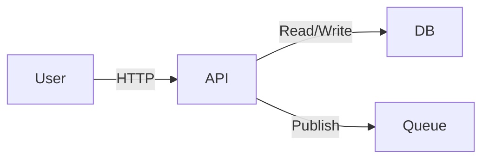

# Lab: Day {{ DAY_NUMBER }} - {{ LAB_TITLE }}

## 1. Overview

### Goal
Build a {{ PROJECT_NAME }} that demonstrates {{ KEY_CONCEPTS }}.

### Architecture


### Prerequisites
*   Docker & Docker Compose
*   Python 3.10+ / Node.js 18+
*   `pip install -r requirements.txt`

---

## 2. Step-by-Step Implementation

### Step 1: Infrastructure Setup (Docker)
Define the environment.
```yaml
# docker-compose.yml
version: '3.8'
services:
  db:
    image: postgres:15
    ...
```

### Step 2: The Data Layer
Define models and database connection.
```python
# models.py
class User(Base):
    ...
```

### Step 3: The Business Logic
Implement the core functionality.
*   **Focus**: Error handling, Validation.

### Step 4: The API Layer
Expose endpoints.
*   **Security**: Add Auth middleware.

---

## 3. Verification & Testing

### Manual Testing
1.  **Health Check**: `curl http://localhost:8000/health` -> `{"status": "ok"}`
2.  **Create Resource**: `curl -X POST ...`
3.  **Error Case**: Send invalid JSON. Expect 400 Bad Request.

### Automated Testing
Run the included test suite.
```bash
pytest tests/
```

### Load Testing (Optional)
Simulate traffic.
```bash
locust -f locustfile.py
```

---

## 4. Observability

### Logs
Check structured logs.
```json
{"level": "info", "event": "user_created", "user_id": 123}
```

### Metrics
Check Prometheus/Grafana (if applicable).
*   **RPS**: Requests per second.
*   **Latency**: p99 response time.

---

## 5. Extensions & Challenges

Want to go deeper?
1.  **Scale**: Run 3 instances of the API behind Nginx.
2.  **Secure**: Add JWT Authentication.
3.  **Resilience**: Add a Circuit Breaker for DB connections.

## 6. Cleanup
Stop containers to save resources.
`docker-compose down -v`
