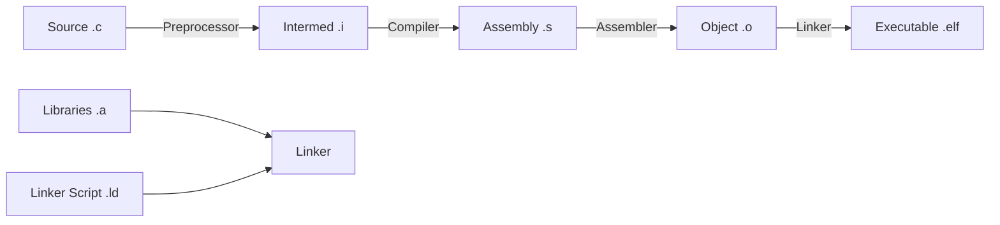

# Day 1: Introduction to Embedded Systems
## Phase 1: Core Embedded Engineering Foundations | Week 1: Embedded C Fundamentals

---

> **📝 Content Creator Instructions:**
> This document is designed to produce **comprehensive, industry-grade educational content**. 
> - **Target Length:** The final filled document should be approximately **1000+ lines** of detailed markdown.
> - **Depth:** Do not skim over details. Explain *why*, not just *how*.
> - **Structure:** If a topic is complex, **DIVIDE IT INTO MULTIPLE PARTS** (Part 1, Part 2, etc.).
> - **Code:** Provide complete, compilable code examples, not just snippets.
> - **Visuals:** Use Mermaid diagrams for flows, architectures, and state machines.

---

## 🎯 Learning Objectives
*By the end of this day, the learner will be able to:*
1.  **Define** what an embedded system is and distinguish it from general-purpose computing.
2.  **Analyze** the core components of an embedded architecture (CPU, Memory, Peripherals).
3.  **Understand** the memory hierarchy and its implications on performance and cost.
4.  **Set up** a professional embedded development environment (GCC, OpenOCD, VS Code).
5.  **Compile and Debug** a "Hello World" equivalent (Blinky) on an ARM Cortex-M microcontroller.

---

## 📚 Prerequisites & Preparation
*   **Hardware Required:**
    *   STM32F4 Discovery Board (or any Cortex-M4 based board)
    *   USB Mini-B Cable
    *   Jumper wires (optional for logic analyzer)
*   **Software Required:**
    *   VS Code (IDE)
    *   ARM GCC Toolchain (`arm-none-eabi-gcc`)
    *   OpenOCD (Debugger)
    *   STM32CubeProgrammer (optional flashing tool)
    *   Make (Build system)
*   **Prior Knowledge:**
    *   Basic C programming (pointers, structures)
    *   Basic digital logic (binary, hex, logic gates)
*   **Datasheets:**
    *   [STM32F407VG Datasheet](https://www.st.com/resource/en/datasheet/stm32f407vg.pdf)
    *   [STM32F4 Reference Manual (RM0090)](https://www.st.com/resource/en/reference_manual/dm00031020-stm32f405-415-stm32f407-417-stm32f427-437-and-stm32f429-439-advanced-arm-based-32-bit-mcus-stmicroelectronics.pdf)

---

## 📖 Theoretical Deep Dive

### 🔹 Part 1: Core Concepts & Architecture

#### 1.1 What is an Embedded System?
An embedded system is a computing system—comprising a processor, memory, and input/output peripheral devices—that has a dedicated function within a larger mechanical or electrical system. Unlike a general-purpose computer (like a laptop or server), which is designed to run a wide range of applications, an embedded system is engineered for specific tasks, often with real-time computing constraints.

**Key Characteristics:**
*   **Dedicated Function:** Designed to do one thing extremely well (e.g., an ABS controller brakes the car; it doesn't run spreadsheets).
*   **Resource Constrained:** Limited memory (RAM/Flash), processing power, and energy.
*   **Real-Time Operation:** Must respond to stimuli within a strict time window.
    *   *Hard Real-Time:* Missing a deadline is catastrophic (e.g., pacemaker, airbag).
    *   *Soft Real-Time:* Missing a deadline degrades performance but isn't fatal (e.g., video streaming).
*   **Reliability:** Often expected to run for years without a reboot (e.g., satellites, industrial controllers).

#### 1.2 Embedded vs. General Purpose Computing
| Feature | Embedded System | General Purpose System |
| :--- | :--- | :--- |
| **Purpose** | Dedicated task (Control, Monitor) | General tasks (Compute, Browse, Play) |
| **OS** | RTOS or Bare-metal (No OS) | GPOS (Windows, Linux, macOS) |
| **Interaction** | Limited (Buttons, LEDs, Sensors) | Rich (Keyboard, Mouse, Screen) |
| **Hardware** | Custom, optimized for cost/power | Generic, optimized for speed |
| **Boot Time** | Instant (ms) | Slow (seconds/minutes) |

#### 1.3 Microprocessor (MPU) vs. Microcontroller (MCU)
*   **Microprocessor (MPU):** Contains only the CPU core. Requires external RAM, Flash, and peripherals. Used in high-performance systems (e.g., Smartphones, Raspberry Pi).
*   **Microcontroller (MCU):** A "System on Chip" (SoC). Contains CPU, RAM, Flash, and Peripherals (GPIO, UART, ADC) all on a single silicon die. Used in cost-sensitive, low-power applications (e.g., Microwave, Remote Control, STM32).

```mermaid
%% Diagram: MCU vs MPU
graph TD
    subgraph MCU [Microcontroller (Single Chip)]
        CPU_M[CPU Core]
        RAM_M[SRAM]
        Flash_M[Flash Memory]
        IO_M[Peripherals (GPIO/ADC)]
        CPU_M --- RAM_M
        CPU_M --- Flash_M
        CPU_M --- IO_M
    end

    subgraph MPU [Microprocessor System (PCB Level)]
        CPU_P[CPU Core]
        RAM_P[External DDR RAM]
        Flash_P[External NAND/NOR Flash]
        IO_P[External Peripherals]
        CPU_P ---|Bus| RAM_P
        CPU_P ---|Bus| Flash_P
        CPU_P ---|Bus| IO_P
    end
```

### 🔹 Part 2: Embedded Architecture & Memory Hierarchy

#### 2.1 The Von Neumann vs. Harvard Architecture
*   **Von Neumann:** Single memory space for both Instructions (Code) and Data. Single bus for fetching both. Bottleneck: "Von Neumann Bottleneck" (cannot fetch instruction and data simultaneously).
*   **Harvard:** Separate memory spaces and buses for Instructions and Data. Allows simultaneous access. Most modern MCUs (like Cortex-M) use a modified Harvard architecture (separate buses, unified address space).

#### 2.2 Memory Hierarchy in Embedded Systems
Understanding memory is crucial because it's often the most expensive and limiting resource.

1.  **Registers (CPU Core):**
    *   Fastest access (1 cycle).
    *   Located inside the CPU.
    *   Used for arithmetic and logic operations.
    *   Example: `R0` to `R15` in ARM.

2.  **SRAM (Static RAM):**
    *   Fast access (1-2 cycles).
    *   Volatile (loses data when power is off).
    *   Used for variables (`.data`, `.bss`), Stack, and Heap.
    *   Expensive per bit.

3.  **Flash Memory:**
    *   Slower access (Wait states required at high speeds).
    *   Non-volatile (retains data without power).
    *   Used for code storage (`.text`) and constant data (`.rodata`).
    *   Limited write cycles (endurance).

4.  **EEPROM (Electrically Erasable Programmable ROM):**
    *   Byte-addressable, non-volatile.
    *   Used for configuration parameters.
    *   Often emulated in Flash in modern MCUs.

```mermaid
%% Memory Hierarchy Pyramid
graph BT
    EEPROM[EEPROM / External Flash] --> Flash[Internal Flash (Code)]
    Flash --> SRAM[Internal SRAM (Data)]
    SRAM --> Regs[CPU Registers]
    style Regs fill:#f9f,stroke:#333,stroke-width:2px
    style SRAM fill:#bbf,stroke:#333,stroke-width:2px
    style Flash fill:#bfb,stroke:#333,stroke-width:2px
    style EEPROM fill:#fbb,stroke:#333,stroke-width:2px
```

### 🔹 Part 3: The Build Process (Compilation)

#### 3.1 From C Code to Machine Code
The transformation from human-readable C code to binary machine code involves four distinct steps:

1.  **Preprocessing:** Handles directives starting with `#` (`#include`, `#define`). Replaces macros, includes files, removes comments. Output: `.i` file.
2.  **Compilation:** Translates C code into Assembly language specific to the target architecture (ARMv7-M). Output: `.s` file.
3.  **Assembly:** Translates Assembly instructions into Machine Code (Object files). Output: `.o` file.
4.  **Linking:** Combines multiple object files and libraries. Resolves symbols (function calls). Assigns absolute memory addresses based on the Linker Script (`.ld`). Output: `.elf` (Executable and Linkable Format) or `.bin`.



---

## 💻 Implementation: Setting Up the Toolchain

> **Instruction:** We will set up a professional command-line environment. This is preferred over "Black Box" IDEs like Keil or IAR for learning because it exposes exactly what is happening under the hood.

### 🛠️ Hardware/System Configuration

#### 1. Install ARM GCC Toolchain
*   **Windows:** Download `gcc-arm-none-eabi` from the ARM developer website. Add the `bin` folder to your System PATH.
*   **Linux:** `sudo apt-get install gcc-arm-none-eabi`
*   **Verify:**
    ```bash
    arm-none-eabi-gcc --version
    ```

#### 2. Install Build Tools (Make)
*   **Windows:** Install via Chocolatey (`choco install make`) or download binaries.
*   **Linux:** `sudo apt-get install make`

#### 3. Install OpenOCD (Debugger)
*   **Windows:** Download pre-compiled binaries (e.g., from xPack). Add `bin` to PATH.
*   **Linux:** `sudo apt-get install openocd`
*   **Verify:**
    ```bash
    openocd --version
    ```

### 👨‍💻 Code Implementation: The "Bare Metal" Blinky

We will write a program to blink an LED without using any libraries (HAL/Standard Peripheral Lib). This forces us to understand memory mapping.

#### Step 1: Memory Map Analysis
Refer to the STM32F407 Datasheet.
*   **Peripheral Base Address:** `0x40000000`
*   **AHB1 Bus Base:** `0x40020000` (Where GPIOs live)
*   **GPIOD Base:** `0x40020C00` (LEDs are on PD12, PD13, PD14, PD15)
*   **RCC (Reset and Clock Control) Base:** `0x40023800`

#### Step 2: Register Definitions
We need to define pointers to these specific addresses.

```c
#include <stdint.h>

// Base Addresses
#define PERIPH_BASE        0x40000000UL
#define AHB1PERIPH_BASE    (PERIPH_BASE + 0x00020000UL)
#define GPIOD_BASE         (AHB1PERIPH_BASE + 0x0C00UL)
#define RCC_BASE           (AHB1PERIPH_BASE + 0x3800UL)

// Register Structures
typedef struct {
    volatile uint32_t MODER;    // Mode register
    volatile uint32_t OTYPER;   // Output type register
    volatile uint32_t OSPEEDR;  // Output speed register
    volatile uint32_t PUPDR;    // Pull-up/pull-down register
    volatile uint32_t IDR;      // Input data register
    volatile uint32_t ODR;      // Output data register
    volatile uint32_t BSRR;     // Bit set/reset register
    volatile uint32_t LCKR;     // Configuration lock register
    volatile uint32_t AFR[2];   // Alternate function registers
} GPIO_TypeDef;

typedef struct {
    volatile uint32_t CR;       // Clock control register
    volatile uint32_t PLLCFGR;  // PLL configuration register
    volatile uint32_t CFGR;     // Clock configuration register
    volatile uint32_t CIR;      // Clock interrupt register
    volatile uint32_t AHB1RSTR; // AHB1 peripheral reset register
    volatile uint32_t AHB2RSTR; // AHB2 peripheral reset register
    volatile uint32_t AHB3RSTR; // AHB3 peripheral reset register
    uint32_t RESERVED0;
    volatile uint32_t APB1RSTR; // APB1 peripheral reset register
    volatile uint32_t APB2RSTR; // APB2 peripheral reset register
    uint32_t RESERVED2[2];
    volatile uint32_t AHB1ENR;  // AHB1 peripheral clock enable register
    // ... (truncated for brevity)
} RCC_TypeDef;

// Pointers to Registers
#define GPIOD ((GPIO_TypeDef *) GPIOD_BASE)
#define RCC   ((RCC_TypeDef *) RCC_BASE)
```

#### Step 3: The Main Logic
1.  **Enable Clock:** Peripherals are disabled by default to save power. We must enable the clock for GPIOD.
2.  **Configure Pin:** Set PD12 (Green LED) to Output Mode.
3.  **Toggle Loop:** Turn LED on, wait, turn LED off, wait.

```c
void delay(uint32_t count) {
    while(count--) {
        __asm("nop"); // No Operation assembly instruction
    }
}

int main(void) {
    // 1. Enable Clock for GPIOD (Bit 3 in AHB1ENR)
    RCC->AHB1ENR |= (1 << 3);

    // 2. Configure PD12 as Output
    // Clear bits 24 and 25
    GPIOD->MODER &= ~(3 << 24);
    // Set bit 24 (01 = Output)
    GPIOD->MODER |= (1 << 24);

    while(1) {
        // 3. Set PD12 High (Turn ON)
        GPIOD->ODR |= (1 << 12);
        
        delay(1000000);

        // 4. Set PD12 Low (Turn OFF)
        GPIOD->ODR &= ~(1 << 12);

        delay(1000000);
    }
}
```

#### Step 4: The Linker Script (`linker.ld`)
The linker script tells the linker where to put the code and data in the MCU's memory.

```ld
/* Entry Point */
ENTRY(Reset_Handler)

/* Memory Layout */
MEMORY
{
    FLASH (rx) : ORIGIN = 0x08000000, LENGTH = 1024K
    RAM (rwx)  : ORIGIN = 0x20000000, LENGTH = 128K
}

/* Sections */
SECTIONS
{
    .text :
    {
        *(.isr_vector)  /* Interrupt Vector Table */
        *(.text)        /* Program Code */
        *(.rodata)      /* Read-only Data */
        _etext = .;     /* End of text section */
    } > FLASH

    .data :
    {
        _sdata = .;     /* Start of data section */
        *(.data)        /* Initialized Data */
        _edata = .;     /* End of data section */
    } > RAM AT> FLASH

    .bss :
    {
        _sbss = .;      /* Start of bss section */
        *(.bss)         /* Uninitialized Data */
        _ebss = .;      /* End of bss section */
    } > RAM
}
```

#### Step 5: Startup Code (`startup.c`)
We need a minimal startup file to initialize the stack pointer and call main.

```c
#include <stdint.h>

extern uint32_t _estack;
extern uint32_t _etext;
extern uint32_t _sdata;
extern uint32_t _edata;
extern uint32_t _sbss;
extern uint32_t _ebss;

extern int main(void);

void Reset_Handler(void) {
    // 1. Copy .data section from Flash to RAM
    uint32_t *pSrc = &_etext;
    uint32_t *pDest = &_sdata;
    while (pDest < &_edata) {
        *pDest++ = *pSrc++;
    }

    // 2. Zero initialize .bss section
    pDest = &_sbss;
    while (pDest < &_ebss) {
        *pDest++ = 0;
    }

    // 3. Call main
    main();
}

// Minimal Vector Table
uint32_t *vector_table[] __attribute__((section(".isr_vector"))) = {
    (uint32_t *)0x20020000, // Stack Pointer (Top of RAM)
    (uint32_t *)Reset_Handler // Reset Handler
};
```

---

## 🔬 Lab Exercise: Lab 1.1 - The First Blink

### 1. Lab Objectives
- Verify toolchain installation.
- Compile a bare-metal C program.
- Flash the program to the STM32 board.
- Observe the LED blinking.

### 2. Step-by-Step Guide

#### Phase A: Hardware Setup
1.  Connect the STM32F4 Discovery board to your PC via the USB Mini-B cable (CN1).
2.  Verify that the PWR LED (Red) is ON.
3.  Ensure the COM LED is blinking or ON (indicating ST-Link communication).

#### Phase B: Software Configuration
1.  Create a folder `Lab_1_Blinky`.
2.  Create `main.c`, `startup.c`, and `linker.ld` with the code provided above.
3.  Create a `Makefile`:

```makefile
CC = arm-none-eabi-gcc
CFLAGS = -mcpu=cortex-m4 -mthumb -g
LDFLAGS = -T linker.ld -nostdlib

all: blinky.elf

blinky.elf: main.o startup.o
	$(CC) $(LDFLAGS) -o $@ $^

main.o: main.c
	$(CC) $(CFLAGS) -c -o $@ $<

startup.o: startup.c
	$(CC) $(CFLAGS) -c -o $@ $<

clean:
	rm -f *.o *.elf
```

#### Phase C: Coding & Deployment
1.  Open a terminal in the folder.
2.  Run `make`.
    *   *Expected Output:* `arm-none-eabi-gcc ... -o blinky.elf ...`
3.  Flash the board using OpenOCD:
    ```bash
    openocd -f interface/stlink.cfg -f target/stm32f4x.cfg -c "program blinky.elf verify reset exit"
    ```

### 3. Expected Output / Verification
- **Console Output:**
  ```text
  ** Programming Started **
  ** Programming Finished **
  ** Verify Started **
  ** Verified OK **
  ** Resetting Target **
  ```
- **Visual Verification:** The Orange LED (PD13) or Green LED (PD12) on the board should start blinking at approximately 1 Hz (depending on the default clock speed).

---

## 🧪 Additional / Advanced Labs

### Lab 2: Multi-LED Pattern
- **Goal:** Control all 4 LEDs (Green, Orange, Red, Blue) on the Discovery board.
- **Challenge:** Create a "rotating" pattern (Green -> Orange -> Red -> Blue -> Green).
- **Steps:**
    1.  Define the bits for all 4 LEDs (PD12, PD13, PD14, PD15).
    2.  Configure all 4 pins as outputs in `MODER`.
    3.  Write a loop that sets one bit in `ODR` and clears the others sequentially.

### Lab 3: Variable Blink Speed
- **Scenario:** Visualizing clock speed impact.
- **Task:** Modify the `delay` function to take a variable. Change the delay in each iteration to make the blinking speed up and then slow down (breathing effect).

---

## 🐞 Debugging & Troubleshooting

### Common Issues

#### 1. "Error: libusb_open() failed with LIBUSB_ERROR_NOT_FOUND"
*   **Symptom:** OpenOCD cannot find the ST-Link.
*   **Possible Causes:**
    *   ST-Link drivers are missing.
    *   USB cable is charge-only (no data lines).
*   **Solution:**
    *   Install ST-Link drivers from ST website.
    *   Try a different USB cable.

#### 2. "undefined reference to `_estack`"
*   **Symptom:** Linker error.
*   **Possible Causes:**
    *   Linker script is not passed to the linker.
    *   Symbol names in `startup.c` do not match `linker.ld`.
*   **Solution:** Check the `Makefile` `LDFLAGS` and ensure `linker.ld` defines `_estack`.

#### 3. LED not blinking
*   **Symptom:** Program flashes successfully, but nothing happens.
*   **Possible Causes:**
    *   Clock not enabled for GPIOD (`RCC->AHB1ENR`).
    *   Wrong pin configured.
    *   Delay is too short (blinking too fast to see).
*   **Solution:**
    *   Check the RCC enable bit.
    *   Increase the delay loop count.

### Debugging Techniques
- **GDB:** Use `arm-none-eabi-gdb blinky.elf`. Connect to OpenOCD (`target remote :3333`).
- **Inspect Registers:** In GDB, use `info registers` or `x/x 0x40020C14` (to read ODR).
- **Step Through:** Use `step` and `next` to execute line by line and verify logic.

---

## ⚡ Optimization & Best Practices

### Performance Optimization
- **Inline Functions:** For small functions like `delay`, use `static inline` to avoid function call overhead.
- **Bit Manipulation:** Use `BSRR` (Bit Set/Reset Register) instead of `ODR` for atomic pin changes. `ODR` requires read-modify-write, which is slower and not interrupt-safe.

### Code Quality
- **Volatile:** Always use `volatile` for peripheral register pointers. The compiler might optimize away reads/writes if it thinks the variable isn't changing, but hardware registers change outside the program flow.
- **Macros:** Use descriptive macros (e.g., `GPIO_MODER_OUTPUT`) instead of magic numbers (`0x01`).

---

## 🧠 Assessment & Review

### Knowledge Check
1.  **Q:** Why do we need the `volatile` keyword for register definitions?
    *   **A:** To prevent the compiler from optimizing away access to the memory address, as the value can change due to hardware events (external to the code flow).
2.  **Q:** What is the difference between `.data` and `.bss` sections?
    *   **A:** `.data` contains initialized global/static variables (copied from Flash to RAM). `.bss` contains uninitialized variables (zeroed out in RAM at startup).

### Challenge Task
> **Task:** Modify the code to use the `BSRR` register for toggling the LED instead of `ODR`.
> **Hint:** `BSRR` has separate "Set" (lower 16 bits) and "Reset" (upper 16 bits) fields. Writing a '1' to a bit triggers the action; writing '0' has no effect.

---

## 📚 Further Reading & References
- [Bare Metal C Programming for ARM](https://github.com/cpq/bare-metal-programming-guide)
- [STM32F4 Discovery User Manual](https://www.st.com/resource/en/user_manual/dm00039084-discovery-kit-with-stm32f407vg-mcu-stmicroelectronics.pdf)
- [Linker Script Syntax](https://sourceware.org/binutils/docs/ld/Scripts.html)

---
