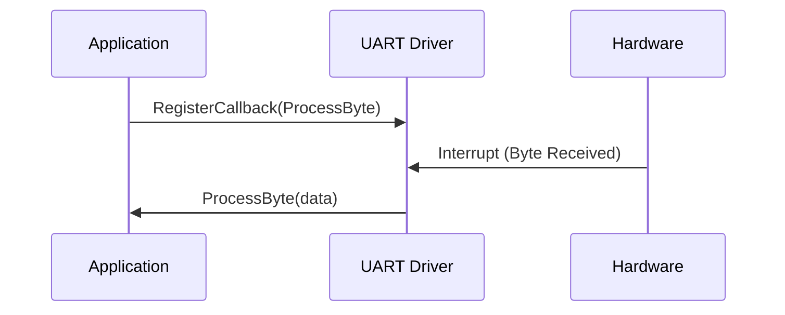

# Day 3: Pointers and Memory in Embedded Systems
## Phase 1: Core Embedded Engineering Foundations | Week 1: Embedded C Fundamentals

---

> **📝 Content Creator Instructions:**
> This document is designed to produce **comprehensive, industry-grade educational content**. 
> - **Target Length:** The final filled document should be approximately **1000+ lines** of detailed markdown.
> - **Depth:** Do not skim over details. Explain *why*, not just *how*.
> - **Structure:** If a topic is complex, **DIVIDE IT INTO MULTIPLE PARTS** (Part 1, Part 2, etc.).
> - **Code:** Provide complete, compilable code examples, not just snippets.
> - **Visuals:** Use Mermaid diagrams for flows, architectures, and state machines.

---

## 🎯 Learning Objectives
*By the end of this day, the learner will be able to:*
1.  **Master** pointer arithmetic and its application in navigating memory buffers.
2.  **Understand** the concept of Memory-Mapped I/O and how pointers access hardware registers.
3.  **Implement** function pointers for callback mechanisms and interrupt handling.
4.  **Analyze** the risks of pointer misuse (dangling pointers, memory leaks) in embedded contexts.
5.  **Write** a driver that uses structure pointers to manage peripheral instances.

---

## 📚 Prerequisites & Preparation
*   **Hardware Required:**
    *   STM32F4 Discovery Board
*   **Software Required:**
    *   VS Code with ARM GCC Toolchain
*   **Prior Knowledge:**
    *   Day 2 concepts (Data types, volatile)
    *   Basic C pointer syntax (`*`, `&`)

---

## 📖 Theoretical Deep Dive

### 🔹 Part 1: Pointer Fundamentals Review

#### 1.1 What is a Pointer?
A pointer is simply a variable that stores a memory address. In a 32-bit system (like Cortex-M4), a pointer is always 32 bits (4 bytes) wide, regardless of what it points to (`char*`, `int*`, `struct*`).

**Key Operators:**
*   `&` (Address-of): Get the address of a variable.
*   `*` (Dereference): Access the value at the address stored in the pointer.

#### 1.2 Pointer Arithmetic
Adding `1` to a pointer increases its address by `sizeof(type)`.
*   `char *p = 0x1000; p + 1` -> `0x1001`
*   `int *p = 0x1000; p + 1` -> `0x1004` (assuming 32-bit int)
*   `struct MyStruct *p = 0x1000; p + 1` -> `0x1000 + sizeof(struct MyStruct)`

**Why is this useful?**
Iterating through arrays, buffers, and memory regions without array indexing overhead.

### 🔹 Part 2: Memory-Mapped I/O (MMIO)

#### 2.1 The Concept
In embedded systems, hardware peripherals (GPIO, UART, Timers) are mapped to specific addresses in the memory space. To control a peripheral, we read/write to these addresses just like we read/write variables.

**The "Magic" of Casting:**
How do we tell C that address `0x40020C14` is an integer we want to write to?
```c
*(volatile uint32_t *)0x40020C14 = 0xFFFF;
```
1.  `0x40020C14`: The raw address (integer literal).
2.  `(volatile uint32_t *)`: Cast it to a pointer to a volatile unsigned 32-bit integer.
3.  `*`: Dereference it to write the value.

#### 2.2 Pointers to Structures (The Professional Way)
Instead of managing individual addresses, we group registers into structures.
```c
typedef struct {
    volatile uint32_t MODER;
    volatile uint32_t OTYPER;
    // ...
} GPIO_TypeDef;

#define GPIOD ((GPIO_TypeDef *) 0x40020C00)
```
Now we can access `GPIOD->MODER`. This uses pointer arithmetic implicitly. `MODER` is at offset 0, `OTYPER` is at offset 4.

### 🔹 Part 3: Function Pointers & Callbacks

#### 3.1 What is a Function Pointer?
Code also lives in memory. The name of a function is actually a pointer to its entry point in Flash.
```c
void my_function(int a) { ... }
void (*func_ptr)(int) = &my_function;
func_ptr(10); // Calls my_function(10)
```

#### 3.2 Use Case: Callbacks
Callbacks allow low-level drivers to notify the application layer without hardcoding application logic into the driver.
*   **Scenario:** A UART driver receives a byte. It shouldn't decide *what* to do with it (print it? parse it?). It should call a user-registered callback.



---

## 💻 Implementation: Generic GPIO Driver with Callbacks

> **Instruction:** We will build a GPIO driver that allows the user to attach a function to be called when a button is pressed.

### 🛠️ Hardware/System Configuration
*   **Button:** PA0 (User Button on Discovery Board).
*   **LED:** PD12 (Green LED).

### 👨‍💻 Code Implementation

#### Step 1: Define the Callback Type
```c
#include <stdint.h>
#include <stddef.h>

// Define a function pointer type for the callback
// It takes no arguments and returns void
typedef void (*ButtonCallback_t)(void);

// Global variable to hold the registered callback
static ButtonCallback_t user_button_callback = NULL;
```

#### Step 2: Driver Functions
```c
// Register the callback
void GPIO_RegisterCallback(ButtonCallback_t callback) {
    user_button_callback = callback;
}

// Simulated Interrupt Handler (call this from main loop for now)
void GPIO_CheckButton(void) {
    // Check if PA0 is High (Button Pressed)
    // Assuming GPIOA_IDR address is known or defined
    volatile uint32_t *GPIOA_IDR = (uint32_t *)(0x40020000 + 0x10);
    
    if (*GPIOA_IDR & (1 << 0)) {
        // Debounce logic would go here
        
        // Execute callback if valid
        if (user_button_callback != NULL) {
            user_button_callback();
        }
        
        // Wait for release to avoid multiple triggers
        while (*GPIOA_IDR & (1 << 0));
    }
}
```

#### Step 3: Application Code
```c
#include <stdio.h>

// User defined function
void ToggleLED(void) {
    printf("Button Pressed! Toggling LED...\n");
    // Toggle PD12 code here
}

int main(void) {
    // 1. Initialize Hardware (Clock, Pins)
    // ... (Init code from Day 1)
    
    // 2. Register the callback
    GPIO_RegisterCallback(ToggleLED);
    
    // 3. Main Loop
    while (1) {
        GPIO_CheckButton(); // Polling for button press
    }
}
```

---

## 🔬 Lab Exercise: Lab 3.1 - Pointer Navigation

### 1. Lab Objectives
- Manually parse a raw byte buffer using pointers.
- Extract different data types (int, float) from a mixed byte stream.

### 2. Step-by-Step Guide

#### Phase A: Setup
Create `lab3_pointers.c`.

#### Phase B: Coding
```c
#include <stdint.h>
#include <stdio.h>

void lab3_main(void) {
    // A simulated data packet: [Header: 2 bytes][ID: 4 bytes][Value: 4 bytes]
    uint8_t buffer[] = {0xAA, 0xBB, 0x01, 0x00, 0x00, 0x00, 0xCD, 0xCC, 0x8C, 0x3F};
    // 0x3F8CCCCD is 1.1 in float (Little Endian)

    uint8_t *ptr = buffer;

    // 1. Read Header (2 bytes)
    uint16_t header = *(uint16_t *)ptr;
    ptr += 2; // Move pointer forward

    // 2. Read ID (4 bytes)
    uint32_t id = *(uint32_t *)ptr;
    ptr += 4;

    // 3. Read Value (Float)
    float value = *(float *)ptr;

    printf("Header: 0x%04X\n", header);
    printf("ID: %d\n", id);
    printf("Value: %f\n", value);
}
```

#### Phase C: Analysis
*   **Expected Output:**
    *   Header: 0xBBAA (Note: Little Endian! 0xAA is at lower address)
    *   ID: 1
    *   Value: 1.100000

### 3. Verification
Change the buffer values and predict the output before running.

---

## 🧪 Additional / Advanced Labs

### Lab 2: The "Void Pointer" Generic Driver
- **Goal:** Create a function `void Flash_Write(uint32_t address, void *data, uint32_t size)` that can accept any data type.
- **Steps:**
    1.  Inside the function, cast `void *data` to `uint8_t *`.
    2.  Loop `size` times and write byte-by-byte.
    3.  Call it with an `int`, a `struct`, and an `array`.

### Lab 3: Jump Table (State Machine)
- **Scenario:** Implementing a state machine using an array of function pointers.
- **Task:**
    1.  Define `typedef void (*StateFunc)(void);`
    2.  Create functions `State_Idle`, `State_Active`, `State_Error`.
    3.  Create array `StateFunc fsm[] = {State_Idle, State_Active, State_Error};`
    4.  Call `fsm[current_state]();` inside the main loop.

---

## 🐞 Debugging & Troubleshooting

### Common Issues

#### 1. Dereferencing NULL
*   **Symptom:** Hard Fault (UsageFault or MemManageFault).
*   **Cause:** `int *p = NULL; *p = 5;`
*   **Solution:** Always check `if (p != NULL)` before dereferencing, especially for function pointers.

#### 2. Dangling Pointers
*   **Symptom:** Unpredictable behavior, data corruption.
*   **Cause:** Returning a pointer to a local stack variable.
    ```c
    int* get_val() {
        int x = 10;
        return &x; // BAD! x is destroyed when function returns.
    }
    ```
*   **Solution:** Only return pointers to static, global, or heap-allocated variables.

#### 3. Alignment Faults
*   **Symptom:** Crash when casting `uint8_t*` to `uint32_t*`.
*   **Cause:** The address is not a multiple of 4.
*   **Solution:** Check alignment or use `memcpy`.

---

## ⚡ Optimization & Best Practices

### Performance Optimization
- **Pointer Aliasing:** The compiler assumes pointers might overlap. Use `restrict` keyword (C99) to tell the compiler they don't, allowing better optimization.
    ```c
    void copy(int * restrict src, int * restrict dst, int n);
    ```

### Code Quality
- **Const Correctness:** Use `const` whenever possible. `const void *` for read-only buffers.
- **Type Safety:** Avoid `void *` unless necessary (like in generic drivers). It bypasses type checking.

---

## 🧠 Assessment & Review

### Knowledge Check
1.  **Q:** If `uint32_t *p = 0x20000000`, what is the address of `p + 2`?
    *   **A:** `0x20000008` (Increments by 2 * 4 bytes).
2.  **Q:** How do you declare a pointer to a function that takes two ints and returns a float?
    *   **A:** `float (*ptr)(int, int);`

### Challenge Task
> **Task:** Implement a "Command Parser" using function pointers.
> **Hint:** Create a struct `{ char *cmd_name; void (*handler)(void); }`. Search an array of these structs for a matching string and call the handler.

---

## 📚 Further Reading & References
- [The C Programming Language (K&R)](https://en.wikipedia.org/wiki/The_C_Programming_Language)
- [Function Pointers in C](https://www.geeksforgeeks.org/function-pointer-in-c/)
- [ARM Cortex-M4 Generic User Guide](https://developer.arm.com/documentation/dui0553/latest/)

---
