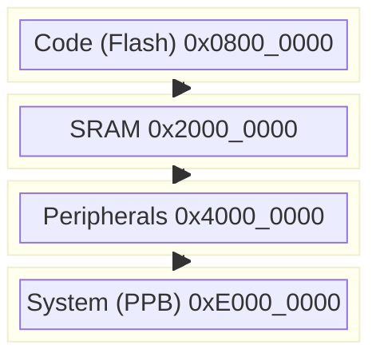

# Day 5: Memory-Mapped I/O
## Phase 1: Core Embedded Engineering Foundations | Week 1: Embedded C Fundamentals

---

> **📝 Content Creator Instructions:**
> This document is designed to produce **comprehensive, industry-grade educational content**. 
> - **Target Length:** The final filled document should be approximately **1000+ lines** of detailed markdown.
> - **Depth:** Do not skim over details. Explain *why*, not just *how*.
> - **Structure:** If a topic is complex, **DIVIDE IT INTO MULTIPLE PARTS** (Part 1, Part 2, etc.).
> - **Code:** Provide complete, compilable code examples, not just snippets.
> - **Visuals:** Use Mermaid diagrams for flows, architectures, and state machines.

---

## 🎯 Learning Objectives
*By the end of this day, the learner will be able to:*
1.  **Explain** the unified memory map architecture of ARM Cortex-M microcontrollers.
2.  **Navigate** the vendor-provided CMSIS (Cortex Microcontroller Software Interface Standard) headers.
3.  **Construct** peripheral access structures from scratch to match datasheet offsets.
4.  **Implement** safe register access patterns using `volatile` and memory barriers.
5.  **Write** a reusable driver layer that abstracts raw memory addresses.

---

## 📚 Prerequisites & Preparation
*   **Hardware Required:**
    *   STM32F4 Discovery Board
*   **Software Required:**
    *   VS Code with ARM GCC Toolchain
*   **Prior Knowledge:**
    *   Day 3 (Pointers)
    *   Day 4 (Bit Manipulation)
*   **Datasheets:**
    *   [STM32F407 Reference Manual (Memory Map Section)](https://www.st.com/resource/en/reference_manual/dm00031020.pdf)

---

## 📖 Theoretical Deep Dive

### 🔹 Part 1: The Unified Memory Map

#### 1.1 4GB Address Space
A 32-bit processor can address $2^{32}$ bytes = 4 Gigabytes of memory. In a microcontroller, this space is divided into regions for Code, Data, and Peripherals.

**Typical Cortex-M4 Map:**
*   **Code (Flash):** `0x0000_0000` to `0x1FFF_FFFF` (512MB)
*   **SRAM:** `0x2000_0000` to `0x3FFF_FFFF` (512MB)
*   **Peripherals:** `0x4000_0000` to `0x5FFF_FFFF` (512MB)
*   **External RAM:** `0x6000_0000` to `0x9FFF_FFFF` (1GB)
*   **System (Core Peripherals):** `0xE000_0000` to `0xFFFF_FFFF` (512MB) - NVIC, SysTick live here.



#### 1.2 Peripheral Buses (AHB vs APB)
Peripherals are connected to different buses based on their speed requirements.
*   **AHB (Advanced High-performance Bus):** Fast. Connects Core, Flash, RAM, and high-speed peripherals (USB, DMA, GPIO).
*   **APB (Advanced Peripheral Bus):** Slower, lower power. Connects UART, I2C, SPI, Timers.
    *   **APB1:** Low speed (max 42 MHz on STM32F4).
    *   **APB2:** High speed (max 84 MHz on STM32F4).

**Why does this matter?**
You must enable the clock for the *specific bus* where the peripheral lives. Enabling AHB1 clock won't turn on a UART on APB1.

### 🔹 Part 2: CMSIS Standard

#### 2.1 What is CMSIS?
CMSIS (Cortex Microcontroller Software Interface Standard) is a vendor-independent hardware abstraction layer for the Cortex-M processor series. It defines:
*   **Core Peripheral Access:** Access to NVIC, SysTick, MPU (same across all Cortex-M chips).
*   **Device Peripheral Access:** Vendor-specific definitions (e.g., `stm32f4xx.h`) that define `GPIO_TypeDef`, `RCC_TypeDef`, etc.

#### 2.2 Navigating `stm32f4xx.h`
This file is massive (thousands of lines). You don't read it top-to-bottom. You search for:
1.  **Peripheral Base Addresses:**
    ```c
    #define PERIPH_BASE           0x40000000UL
    #define APB1PERIPH_BASE       PERIPH_BASE
    #define AHB1PERIPH_BASE       (PERIPH_BASE + 0x00020000UL)
    #define GPIOD_BASE            (AHB1PERIPH_BASE + 0x0C00UL)
    ```
2.  **Register Structure Definitions:**
    ```c
    typedef struct {
      __IO uint32_t MODER;    /*!< GPIO port mode register */
      __IO uint32_t OTYPER;   /*!< GPIO port output type register */
      // ...
    } GPIO_TypeDef;
    ```
3.  **Peripheral Declaration:**
    ```c
    #define GPIOD               ((GPIO_TypeDef *) GPIOD_BASE)
    ```

### 🔹 Part 3: Safe Register Access

#### 3.1 The `__IO` Macro
In CMSIS, you see `__IO uint32_t`. This expands to `volatile uint32_t`.
*   `__I`: `volatile const` (Read-only register)
*   `__O`: `volatile` (Write-only register)
*   `__IO`: `volatile` (Read/Write register)

#### 3.2 Memory Barriers (`__DMB`, `__DSB`, `__ISB`)
Modern CPUs (like Cortex-M7) have pipelines and write buffers. They might reorder instructions for performance.
*   **Scenario:** You enable a clock and immediately try to write to the peripheral.
    ```c
    RCC->AHB1ENR |= GPIO_EN;
    GPIOD->MODER = OUTPUT; // Might fail!
    ```
    The write to `MODER` might reach the peripheral *before* the clock enable signal propagates through the silicon.
*   **Fix:** Read back the register or use a barrier.
    ```c
    RCC->AHB1ENR |= GPIO_EN;
    (void)RCC->AHB1ENR; // Dummy read (forces wait)
    GPIOD->MODER = OUTPUT;
    ```

---

## 💻 Implementation: Creating a Peripheral Struct from Scratch

> **Instruction:** We will manually define the structure for the **SysTick** timer (a core peripheral) to understand how CMSIS does it.

### 🛠️ Hardware/System Configuration
STM32F4 Discovery.

### 👨‍💻 Code Implementation

#### Step 1: Datasheet Lookup
Refer to the Cortex-M4 Generic User Guide.
SysTick Base Address: `0xE000E010`
Registers:
*   `CSR` (Control & Status): Offset 0x00
*   `RVR` (Reload Value): Offset 0x04
*   `CVR` (Current Value): Offset 0x08
*   `CALIB` (Calibration): Offset 0x0C

#### Step 2: Struct Definition
```c
#include <stdint.h>

// 1. Define the Struct
typedef struct {
    volatile uint32_t CSR;   // Control and Status Register
    volatile uint32_t RVR;   // Reload Value Register
    volatile uint32_t CVR;   // Current Value Register
    volatile uint32_t CALIB; // Calibration Value Register
} MySysTick_TypeDef;

// 2. Define the Pointer
#define MY_SYSTICK_BASE  (0xE000E010UL)
#define MY_SYSTICK       ((MySysTick_TypeDef *) MY_SYSTICK_BASE)

// 3. Bit Definitions
#define SYSTICK_CSR_ENABLE      (1U << 0)
#define SYSTICK_CSR_TICKINT     (1U << 1)
#define SYSTICK_CSR_CLKSOURCE   (1U << 2)
#define SYSTICK_CSR_COUNTFLAG   (1U << 16)
```

#### Step 3: Usage (Blocking Delay)
```c
void SysTick_Init(uint32_t ticks) {
    // 1. Disable SysTick during setup
    MY_SYSTICK->CSR = 0;

    // 2. Set Reload Value (e.g., for 1ms delay)
    // Assuming 16MHz clock: 16000 ticks = 1ms
    MY_SYSTICK->RVR = ticks - 1;

    // 3. Clear Current Value
    MY_SYSTICK->CVR = 0;

    // 4. Enable SysTick | Enable Interrupt | Select Processor Clock
    MY_SYSTICK->CSR = SYSTICK_CSR_ENABLE | SYSTICK_CSR_CLKSOURCE;
}

// Simple blocking delay using the COUNTFLAG
void Delay_ms(uint32_t ms) {
    // Assuming SysTick is configured for 1ms overflow
    for (uint32_t i = 0; i < ms; i++) {
        // Wait until COUNTFLAG is set
        while (!(MY_SYSTICK->CSR & SYSTICK_CSR_COUNTFLAG));
    }
}
```

---

## 🔬 Lab Exercise: Lab 5.1 - Mapping the Unknown

### 1. Lab Objectives
- Given a "Mystery Peripheral" description (fictional or real), create a C header file to interface with it.
- Use the STM32 **CRC (Cyclic Redundancy Check)** peripheral for this exercise.

### 2. Step-by-Step Guide

#### Phase A: Research
Look up the CRC peripheral in the STM32F4 Reference Manual.
*   Base Address: `0x40023000` (AHB1)
*   Registers: `DR` (Data), `IDR` (Independent Data), `CR` (Control).

#### Phase B: Coding
Create `crc_driver.h`.
```c
#ifndef CRC_DRIVER_H
#define CRC_DRIVER_H

#include <stdint.h>

#define CRC_BASE  0x40023000UL

typedef struct {
    volatile uint32_t DR;   // Data register (Offset 0x00)
    volatile uint32_t IDR;  // Independent data register (Offset 0x04)
    volatile uint32_t CR;   // Control register (Offset 0x08)
} CRC_TypeDef;

#define CRC ((CRC_TypeDef *) CRC_BASE)

// RCC Enable for CRC is Bit 12 of AHB1ENR
#define RCC_AHB1ENR_CRCEN (1U << 12)

#endif
```

#### Phase C: Implementation
Write a main function to enable CRC, reset it, write a value, and read the result.
```c
int main(void) {
    // Enable Clock
    RCC->AHB1ENR |= RCC_AHB1ENR_CRCEN;

    // Reset CRC Calculation
    CRC->CR = 1; // RESET bit

    // Feed data
    CRC->DR = 0x12345678;

    // Read result
    uint32_t result = CRC->DR;
    
    // Check against expected CRC-32 (MPEG-2) of 0x12345678
}
```

### 3. Verification
Verify the calculated CRC matches an online CRC calculator (Standard CRC-32 used by STM32).

---

## 🧪 Additional / Advanced Labs

### Lab 2: Bit-Banding Implementation
- **Goal:** Toggle a GPIO pin using Bit-Banding.
- **Theory:** `AliasAddr = AliasBase + (ByteOffset * 32) + (BitNum * 4)`
- **Task:** Calculate the alias address for `GPIOD->ODR` Bit 12 and write `1` to it.

### Lab 3: MPU Region Setup (Advanced)
- **Scenario:** Protect a region of RAM from being written to (make it Read-Only).
- **Task:** Configure the Cortex-M Memory Protection Unit (MPU) to mark the bottom 1KB of SRAM as Read-Only. Try to write to it and trigger a `MemManage` fault.

---

## 🐞 Debugging & Troubleshooting

### Common Issues

#### 1. Hard Fault on Register Access
*   **Symptom:** Code crashes immediately when accessing `MY_PERIPH->REG`.
*   **Cause:** Peripheral Clock is NOT enabled. Accessing a disabled peripheral on the bus generates a Bus Fault (which escalates to Hard Fault if Bus Fault handler isn't enabled).
*   **Solution:** Always check `RCC` registers first.

#### 2. Optimization Breaking Logic
*   **Symptom:** Code works with `-O0` but fails with `-O2`.
*   **Cause:** Missing `volatile` on the struct members.
*   **Solution:** Ensure all register typedefs use `volatile` or `__IO`.

---

## ⚡ Optimization & Best Practices

### Performance Optimization
- **Base Pointers:** Passing `GPIO_TypeDef *port` to functions is efficient. It passes a single 32-bit address.
    ```c
    void GPIO_SetHigh(GPIO_TypeDef *port, uint16_t pin) {
        port->BSRR = (1 << pin);
    }
    ```

### Code Quality
- **Asserts:** In driver development, validate inputs.
    ```c
    void GPIO_Init(GPIO_TypeDef *port) {
        assert_param(IS_GPIO_ALL_PERIPH(port));
        // ...
    }
    ```

---

## 🧠 Assessment & Review

### Knowledge Check
1.  **Q:** What is the difference between AHB and APB?
    *   **A:** AHB is for high-speed, low-latency peripherals (Flash, RAM, DMA). APB is for lower-speed peripherals (UART, I2C) to save power.
2.  **Q:** Why do we need a "Dummy Read" after enabling a clock?
    *   **A:** To ensure the write operation to the RCC register has completed and propagated to the peripheral logic before we attempt to access the peripheral's registers.

### Challenge Task
> **Task:** Write a function `uint32_t * GetBitBandAlias(uint32_t address, uint8_t bit)` that returns a pointer to the bit-band alias address for any given SRAM address and bit number.

---

## 📚 Further Reading & References
- [The Definitive Guide to ARM Cortex-M3 and Cortex-M4 Processors (Joseph Yiu)](https://www.amazon.com/Definitive-Guide-Cortex%C2%AE-M3-Cortex%C2%AE-M4-Processors/dp/0124080820)
- [STM32F4 Programming Manual](https://www.st.com/resource/en/programming_manual/dm00046982.pdf)

---
