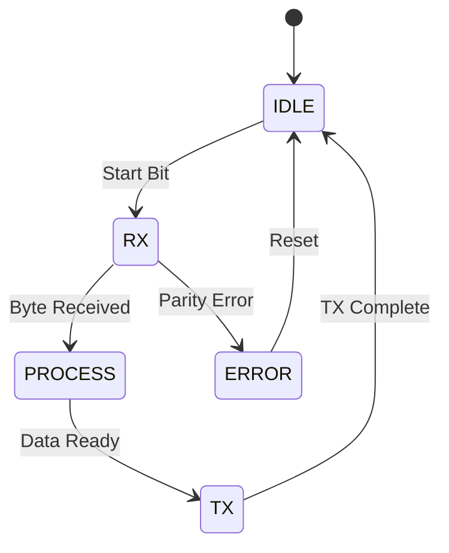

# Day 6: Structures, Unions, and Enumerations
## Phase 1: Core Embedded Engineering Foundations | Week 1: Embedded C Fundamentals

---

> **📝 Content Creator Instructions:**
> This document is designed to produce **comprehensive, industry-grade educational content**. 
> - **Target Length:** The final filled document should be approximately **1000+ lines** of detailed markdown.
> - **Depth:** Do not skim over details. Explain *why*, not just *how*.
> - **Structure:** If a topic is complex, **DIVIDE IT INTO MULTIPLE PARTS** (Part 1, Part 2, etc.).
> - **Code:** Provide complete, compilable code examples, not just snippets.
> - **Visuals:** Use Mermaid diagrams for flows, architectures, and state machines.

---

## 🎯 Learning Objectives
*By the end of this day, the learner will be able to:*
1.  **Design** memory-efficient structures by understanding alignment and padding.
2.  **Utilize** Unions to create register overlays and handle multi-format data.
3.  **Implement** robust state machines using Enumerations.
4.  **Apply** `__attribute__((packed))` correctly and understand its performance implications.
5.  **Create** a complex driver configuration structure used in HALs.

---

## 📚 Prerequisites & Preparation
*   **Hardware Required:**
    *   STM32F4 Discovery Board
*   **Software Required:**
    *   VS Code with ARM GCC Toolchain
*   **Prior Knowledge:**
    *   Day 2 (Data Types)
    *   Day 5 (Memory Mapping)

---

## 📖 Theoretical Deep Dive

### 🔹 Part 1: Structure Alignment & Padding

#### 1.1 The Alignment Rule
CPUs access memory most efficiently in "words" (4 bytes for ARM Cortex-M). To ensure speed, the compiler inserts "padding" bytes to align data members to their natural boundaries.
*   `char` (1 byte): Any address.
*   `short` (2 bytes): Even addresses (0, 2, 4...).
*   `int` (4 bytes): Divisible by 4 (0, 4, 8...).

**Example:**
```c
struct Bad {
    uint8_t a;   // 1 byte
    // 3 bytes padding inserted here!
    uint32_t b;  // 4 bytes
    uint8_t c;   // 1 byte
    // 3 bytes padding inserted here (to make total size multiple of 4)
};
// Total Size: 12 bytes
```

#### 1.2 Structure Reordering
We can save memory simply by reordering members from largest to smallest.
```c
struct Good {
    uint32_t b;  // 4 bytes
    uint8_t a;   // 1 byte
    uint8_t c;   // 1 byte
    // 2 bytes padding
};
// Total Size: 8 bytes (33% savings!)
```

#### 1.3 Packed Structures
Sometimes we *must* match a specific binary format (e.g., a network packet or file header) where padding is forbidden.
```c
struct __attribute__((packed)) Packet {
    uint8_t id;
    uint32_t payload;
};
// Total Size: 5 bytes
```
**Warning:** Accessing unaligned data is slower and can cause Hard Faults on some architectures (though Cortex-M4 handles unaligned access, it takes extra cycles).

### 🔹 Part 2: Unions in Embedded Systems

#### 2.1 The Concept
A `union` allows multiple members to share the *same* memory location. The size of the union is the size of its largest member.

#### 2.2 Use Case 1: Register Access (Bitfields + Raw)
This is the "Holy Grail" of register definition.
```c
typedef union {
    uint32_t ALL; // Access the whole 32-bit register
    struct {
        uint32_t ENABLE : 1;
        uint32_t MODE   : 2;
        uint32_t        : 29; // Reserved
    } BITS;
} ControlReg_t;

ControlReg_t cr;
cr.ALL = 0;          // Clear everything
cr.BITS.ENABLE = 1;  // Set just one bit
```

#### 2.3 Use Case 2: Data Conversion
Converting bytes to float or int without math.
```c
typedef union {
    float f;
    uint8_t bytes[4];
} FloatConverter;

FloatConverter fc;
fc.f = 3.14159;
// Send fc.bytes[0]...fc.bytes[3] over UART
```

### 🔹 Part 3: Enumerations & State Machines

#### 3.1 Enums for Readability
Instead of `#define STATE_IDLE 0`, use Enums.
```c
typedef enum {
    STATE_IDLE = 0,
    STATE_RX,
    STATE_TX,
    STATE_ERROR
} UART_State_t;
```
**Best Practice:** Always define the first element as 0.

#### 3.2 Finite State Machines (FSM)
Enums are the backbone of FSMs, which control the logic of most embedded systems.



---

## 💻 Implementation: Configuration Structs

> **Instruction:** We will implement a "HAL-style" configuration pattern, where a struct is used to pass initialization parameters to a driver.

### 🛠️ Hardware/System Configuration
STM32F4 Discovery (GPIO).

### 👨‍💻 Code Implementation

#### Step 1: Define Enums and Structs (`gpio_driver.h`)

```c
#ifndef GPIO_DRIVER_H
#define GPIO_DRIVER_H

#include <stdint.h>
#include "stm32f4xx.h" // Assuming CMSIS is available

// 1. Enums for Configuration
typedef enum {
    GPIO_PIN_0  = 0x0001,
    GPIO_PIN_1  = 0x0002,
    GPIO_PIN_12 = 0x1000,
    GPIO_PIN_ALL = 0xFFFF
} GPIO_Pin_t;

typedef enum {
    GPIO_MODE_INPUT = 0x00,
    GPIO_MODE_OUTPUT = 0x01,
    GPIO_MODE_ALT = 0x02,
    GPIO_MODE_ANALOG = 0x03
} GPIO_Mode_t;

typedef enum {
    GPIO_PULL_NO = 0x00,
    GPIO_PULL_UP = 0x01,
    GPIO_PULL_DOWN = 0x02
} GPIO_Pull_t;

// 2. Configuration Structure
typedef struct {
    uint16_t Pin;       // Bitmask of pins
    GPIO_Mode_t Mode;   // Input/Output/etc
    GPIO_Pull_t Pull;   // Pull-up/down
    uint8_t Speed;      // Low/Med/High
} GPIO_Init_t;

// 3. Function Prototypes
void GPIO_Init(GPIO_TypeDef *GPIOx, GPIO_Init_t *Config);

#endif
```

#### Step 2: Driver Implementation (`gpio_driver.c`)

```c
#include "gpio_driver.h"

void GPIO_Init(GPIO_TypeDef *GPIOx, GPIO_Init_t *Config) {
    uint32_t pinpos;
    
    // Iterate through all 16 pins
    for (pinpos = 0; pinpos < 16; pinpos++) {
        // Check if this pin is selected in the Config->Pin bitmask
        if (Config->Pin & (1 << pinpos)) {
            
            // 1. Configure Mode (2 bits per pin)
            // Clear old mode
            GPIOx->MODER &= ~(0x03 << (pinpos * 2));
            // Set new mode
            GPIOx->MODER |= (Config->Mode << (pinpos * 2));
            
            // 2. Configure Pull-up/down (2 bits per pin)
            GPIOx->PUPDR &= ~(0x03 << (pinpos * 2));
            GPIOx->PUPDR |= (Config->Pull << (pinpos * 2));
            
            // 3. Configure Speed (2 bits per pin)
            // ... (similar logic)
        }
    }
}
```

#### Step 3: User Application (`main.c`)

```c
#include "gpio_driver.h"

int main(void) {
    // Enable Clock (Raw register access for now)
    RCC->AHB1ENR |= (1 << 3); // GPIOD

    // Initialize PD12, PD13, PD14, PD15 (LEDs)
    GPIO_Init_t led_config;
    led_config.Pin = GPIO_PIN_12 | GPIO_PIN_13 | GPIO_PIN_14 | GPIO_PIN_15;
    led_config.Mode = GPIO_MODE_OUTPUT;
    led_config.Pull = GPIO_PULL_NO;
    led_config.Speed = 0; // Low speed
    
    GPIO_Init(GPIOD, &led_config);

    while(1) {
        // Blink code...
    }
}
```

---

## 🔬 Lab Exercise: Lab 6.1 - The Packet Parser

### 1. Lab Objectives
- Use a `union` + `struct` to parse a raw byte stream into meaningful data fields without bit shifting.

### 2. Step-by-Step Guide

#### Phase A: Scenario
You receive a 6-byte packet from a sensor:
*   Byte 0: Start Byte (0xAA)
*   Byte 1: Sensor ID
*   Byte 2-5: Timestamp (32-bit integer)

#### Phase B: Coding
```c
#include <stdio.h>
#include <stdint.h>

// Define the packet structure
typedef struct __attribute__((packed)) {
    uint8_t start_byte;
    uint8_t sensor_id;
    uint32_t timestamp;
} SensorPacket_t;

// Define the union
typedef union {
    uint8_t raw_buffer[6];
    SensorPacket_t packet;
} PacketParser_u;

int main(void) {
    PacketParser_u parser;
    
    // Simulate receiving bytes (e.g., from UART)
    uint8_t incoming_data[] = {0xAA, 0x05, 0x78, 0x56, 0x34, 0x12};
    
    // Copy data into the union's buffer
    for(int i=0; i<6; i++) {
        parser.raw_buffer[i] = incoming_data[i];
    }
    
    // Access via struct
    printf("Start: 0x%02X\n", parser.packet.start_byte);
    printf("ID: %d\n", parser.packet.sensor_id);
    printf("Time: 0x%08X\n", parser.packet.timestamp);
    
    return 0;
}
```

#### Phase C: Analysis
*   **Expected Output:**
    *   Start: 0xAA
    *   ID: 5
    *   Time: 0x12345678 (Little Endian!)

### 3. Verification
What happens if you remove `__attribute__((packed))`? The `timestamp` might be aligned to offset 4, making the struct size 8 bytes, and the data will be misaligned.

---

## 🧪 Additional / Advanced Labs

### Lab 2: State Machine Implementation
- **Goal:** Implement a Traffic Light Controller.
- **States:** `RED`, `GREEN`, `YELLOW`.
- **Logic:**
    *   `RED` for 5s -> `GREEN`
    *   `GREEN` for 5s -> `YELLOW`
    *   `YELLOW` for 2s -> `RED`
- **Task:** Use an `enum` for states and a `switch-case` in the main loop. Use `SysTick` for timing.

### Lab 3: Nested Structures
- **Scenario:** A device has multiple configurations.
- **Task:** Create a `DeviceConfig` struct that contains `UARTConfig` and `SPIConfig` structs. Initialize it and pass it to a setup function.

---

## 🐞 Debugging & Troubleshooting

### Common Issues

#### 1. Endianness in Unions
*   **Symptom:** `union { uint32_t i; uint8_t b[4]; }` gives unexpected byte order.
*   **Cause:** ARM is Little Endian. `b[0]` is the LSB.
*   **Solution:** Be aware of the architecture. Don't assume `b[0]` is the MSB.

#### 2. Enum Size
*   **Symptom:** Passing an enum to a function expecting `uint8_t` causes warnings or stack corruption.
*   **Cause:** The compiler chooses the size of an enum (usually `int`, 4 bytes).
*   **Solution:** Use compiler flags `-fshort-enums` or explicit casting.

---

## ⚡ Optimization & Best Practices

### Performance Optimization
- **Structure Passing:** Pass large structures by pointer (`const MyStruct *cfg`), not by value. Passing by value copies the entire struct to the stack.
- **Bit Fields:** Avoid them for performance-critical code. Use bitwise macros.

### Code Quality
- **Anonymous Unions:** Use anonymous unions inside structs for cleaner syntax (C11 feature).
    ```c
    struct {
        union {
            uint32_t R;
            struct { uint32_t A:1; } B;
        };
    } Reg;
    // Access: Reg.R or Reg.B.A (instead of Reg.u.B.A)
    ```

---

## 🧠 Assessment & Review

### Knowledge Check
1.  **Q:** Why do we use `__attribute__((packed))`?
    *   **A:** To prevent the compiler from inserting padding bytes, ensuring the data structure matches a specific binary format (like a protocol header).
2.  **Q:** What is the size of a union?
    *   **A:** The size of its largest member.

### Challenge Task
> **Task:** Create a "Register Map" struct for a fictional peripheral that has:
> *   Control Reg (Offset 0x00)
> *   Status Reg (Offset 0x04)
> *   Data Reg (Offset 0x10) - Note the gap!
> **Hint:** Use `uint32_t RESERVED[2];` to fill the gap between 0x04 and 0x10.

---

## 📚 Further Reading & References
- [The Lost Art of Structure Packing](http://www.catb.org/esr/structure-packing/)
- [State Machines in C](https://barrgroup.com/embedded-systems/how-to/state-machines-event-driven-systems)

---
