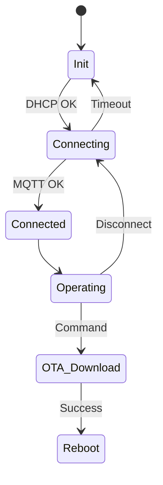

# Day 70: Week 10 Review and Project
## Phase 1: Core Embedded Engineering Foundations | Week 10: Advanced RTOS & IoT

---

> **📝 Content Creator Instructions:**
> This document is designed to produce **comprehensive, industry-grade educational content**. 
> - **Target Length:** The final filled document should be approximately **1000+ lines** of detailed markdown.
> - **Depth:** Do not skim over details. Explain *why*, not just *how*.
> - **Structure:** If a topic is complex, **DIVIDE IT INTO MULTIPLE PARTS** (Part 1, Part 2, etc.).
> - **Code:** Provide complete, compilable code examples, not just snippets.
> - **Visuals:** Use Mermaid diagrams for flows, architectures, and state machines.

---

## 🎯 Learning Objectives
*By the end of this day, the learner will be able to:*
1.  **Synthesize** Week 10 concepts (TLS, MQTT, OTA, Shadows) into a production-ready IoT firmware.
2.  **Architect** a secure, updateable, and resilient connected device.
3.  **Implement** a state machine handling Network Loss, Cloud Disconnects, and OTA Triggers.
4.  **Debug** complex interactions between RTOS tasks and Network stacks.
5.  **Conduct** a self-assessment of Week 10 knowledge.

---

## 📚 Prerequisites & Preparation
*   **Hardware Required:**
    *   STM32F4 Discovery Board
*   **Software Required:**
    *   VS Code with ARM GCC Toolchain
    *   AWS/Azure Account.
*   **Prior Knowledge:**
    *   Days 64-69 (Week 10 Content)

---

## 📖 Theoretical Deep Dive

### 🔹 Part 1: The "Smart Device" Lifecycle
1.  **Boot:** Verify Integrity. Jump to App.
2.  **Provision:** Load Certs (if not present).
3.  **Connect:** DHCP -> DNS -> TLS -> MQTT.
4.  **Operate:**
    *   Publish Telemetry (QoS 0).
    *   Sync Shadow (QoS 1).
    *   Listen for Commands (QoS 1).
5.  **Update:** Download new FW -> Reboot.

### 🔹 Part 2: Resilience
*   **Exponential Backoff:** If connection fails, wait 1s, 2s, 4s, 8s... to avoid flooding the network.
*   **Watchdogs:** Task-level monitoring. If Network Task hangs (e.g., inside TLS handshake), reset.



---

## 💻 Implementation: Smart Connected Device

### 🛠️ Hardware/System Configuration
*   **Network:** Ethernet (RMII).
*   **Storage:** Internal Flash (Slots A/B).

### 👨‍💻 Code Implementation

#### Step 1: Global State
```c
typedef enum {
    STATE_INIT,
    STATE_CONNECTING,
    STATE_CONNECTED,
    STATE_OTA
} DeviceState_t;

DeviceState_t g_State = STATE_INIT;
QueueHandle_t hTelemetryQueue;
```

#### Step 2: Network Task (The Manager)
```c
void vTaskNetwork(void *p) {
    // Init LwIP
    LwIP_RTOS_Init();
    
    while(1) {
        switch(g_State) {
            case STATE_INIT:
                if (gnetif.ip_addr.addr != 0) g_State = STATE_CONNECTING;
                vTaskDelay(100);
                break;
                
            case STATE_CONNECTING:
                if (MQTT_Secure_Connect() == 0) {
                    g_State = STATE_CONNECTED;
                    // Subscribe to Shadow
                    mqtt_subscribe(client, "$aws/things/MyDevice/shadow/update/delta", 1);
                } else {
                    vTaskDelay(5000); // Retry
                }
                break;
                
            case STATE_CONNECTED:
                // Process Incoming MQTT
                mqtt_yield(client, 100);
                
                // Process Outgoing Telemetry
                Telemetry_t msg;
                if (xQueueReceive(hTelemetryQueue, &msg, 0)) {
                    MQTT_Publish_Json(&msg);
                }
                break;
                
            case STATE_OTA:
                // Handled by OTA Task
                vTaskDelay(1000);
                break;
        }
    }
}
```

#### Step 3: Application Task
```c
void vTaskApp(void *p) {
    while(1) {
        if (g_State == STATE_CONNECTED) {
            Telemetry_t msg;
            msg.temp = Read_Temp();
            msg.uptime = xTaskGetTickCount();
            
            xQueueSend(hTelemetryQueue, &msg, 0);
        }
        vTaskDelay(10000); // Every 10s
    }
}
```

#### Step 4: OTA Handler (Callback)
```c
void On_Delta_Received(char *json) {
    // Check for "firmware_url" in delta
    char *url = Parse_Json(json, "firmware_url");
    if (url) {
        printf("Starting OTA from %s\n", url);
        g_State = STATE_OTA;
        xTaskCreate(vTaskOTA, "OTA", 4096, url, 5, NULL);
    }
}
```

---

## 🔬 Lab Exercise: Lab 70.1 - Full System Test

### 1. Lab Objectives
- Flash v1.0 Firmware.
- Connect to Cloud.
- Observe Telemetry.
- Trigger OTA to v2.0.

### 2. Step-by-Step Guide

#### Phase A: v1.0
1.  Compile with `#define VERSION "1.0"`.
2.  Flash.
3.  Console: "Booting v1.0... Connected... Publishing".
4.  Cloud: See data arriving.

#### Phase B: v2.0
1.  Compile with `#define VERSION "2.0"`.
2.  Host `app_v2.bin` on HTTP Server.
3.  Cloud: Update Shadow Desired: `{"firmware_url": "http://192.168.1.5:8000/app_v2.bin"}`.

#### Phase C: The Magic
1.  STM32 receives Delta.
2.  Starts Download.
3.  Reboots.
4.  Console: "Booting v2.0... Connected".
5.  Cloud: Shadow Reported updates to `{"firmware_version": "2.0"}`.

### 3. Verification
If OTA fails, check Flash Layout. Ensure Slot B doesn't overlap with Slot A or File System.

---

## 🧪 Additional / Advanced Labs

### Lab 2: Secure Element (ATECC608)
- **Goal:** Hardware Security.
- **Task:**
    1.  Store Private Key in ATECC608 chip (I2C).
    2.  Modify mbedTLS to use PKCS#11 or custom hooks to sign the handshake using the chip.
    3.  **Result:** Private Key never leaves the hardware.

### Lab 3: Fleet Provisioning
- **Goal:** Mass deployment.
- **Task:**
    1.  Flash all devices with same "Claim Cert".
    2.  Device connects, calls `RegisterThing`.
    3.  Cloud generates unique Cert, sends it back.
    4.  Device saves unique Cert, reboots, connects as itself.

---

## 🐞 Debugging & Troubleshooting

### Common Issues

#### 1. Heap Fragmentation
*   **Cause:** LwIP + mbedTLS + MQTT + JSON all malloc/free constantly.
*   **Solution:** Use `Heap_4`. Monitor `xPortGetMinimumEverFreeHeapSize()`. If it drops low, increase Heap or optimize buffers.

#### 2. Watchdog Reset during TLS
*   **Cause:** RSA calculation takes > 1s on 168MHz MCU.
*   **Solution:** Kick the dog *inside* the RNG callback or mbedTLS hooks.

---

## ⚡ Optimization & Best Practices

### Code Quality
- **Error Handling:** Never assume `malloc` succeeds. Always check NULL. In embedded, if malloc fails, you might need to reset.

---

## 🧠 Assessment & Review

### Knowledge Check
1.  **Q:** Why use a Queue for Telemetry?
    *   **A:** Decoupling. The App task produces data at its own rate. The Network task consumes it when the connection is ready. If network drops, queue buffers the data.
2.  **Q:** What is "Exponential Backoff"?
    *   **A:** A retry strategy that doubles the wait time after each failure (1s, 2s, 4s...) to prevent server overload.

### Challenge Task
> **Task:** Implement "Config over Bluetooth". If WiFi/Ethernet fails, enable BLE. User connects via Phone App, sets WiFi credentials / Broker URL. Device saves to Flash and retries.

---

## 📚 Further Reading & References
- [AWS IoT Device Defender](https://aws.amazon.com/iot-device-defender/)

---
