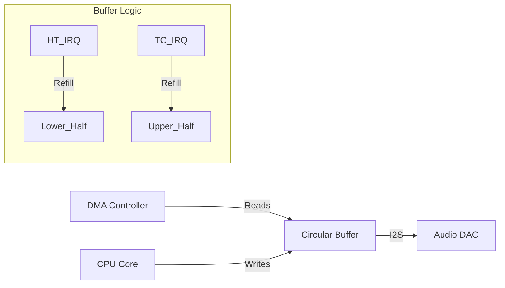

# Day 75: Audio Processing Pipeline (DMA + Double Buffering)
## Phase 1: Core Embedded Engineering Foundations | Week 11: DSP & Audio Processing

---

> **📝 Content Creator Instructions:**
> This document is designed to produce **comprehensive, industry-grade educational content**. 
> - **Target Length:** The final filled document should be approximately **1000+ lines** of detailed markdown.
> - **Depth:** Do not skim over details. Explain *why*, not just *how*.
> - **Structure:** If a topic is complex, **DIVIDE IT INTO MULTIPLE PARTS** (Part 1, Part 2, etc.).
> - **Code:** Provide complete, compilable code examples, not just snippets.
> - **Visuals:** Use Mermaid diagrams for flows, architectures, and state machines.

---

## 🎯 Learning Objectives
*By the end of this day, the learner will be able to:*
1.  **Explain** the concept of Double Buffering (Ping-Pong) and why it prevents audio glitches.
2.  **Configure** the DMA controller to feed the I2S peripheral in Circular Mode.
3.  **Handle** `HalfTransfer` (HT) and `TransferComplete` (TC) interrupts to refill buffers in real-time.
4.  **Implement** a seamless audio playback pipeline.
5.  **Debug** buffer underruns and synchronization issues.

---

## 📚 Prerequisites & Preparation
*   **Hardware Required:**
    *   STM32F4 Discovery Board
*   **Software Required:**
    *   VS Code with ARM GCC Toolchain
*   **Prior Knowledge:**
    *   Day 74 (I2S)
    *   Day 13 (DMA)
*   **Datasheets:**
    *   [STM32F4 DMA Controller](https://www.st.com/resource/en/reference_manual/dm00031020.pdf)

---

## 📖 Theoretical Deep Dive

### 🔹 Part 1: The Glitch Problem
In Day 74, we used a `while` loop to push data.
*   **Problem:** If the CPU gets interrupted (e.g., Systick, USB), it stops pushing data. The DAC runs out of data (Underrun) -> Output drops to 0 -> **"Click"**.
*   **Solution:** DMA. The DMA pushes data from RAM to I2S automatically.

### 🔹 Part 2: Double Buffering (Ping-Pong)
We cannot write to the buffer while DMA is reading it (Corruption).
*   **Strategy:** Use one large buffer (e.g., 1024 samples) divided into two halves.
    *   **Lower Half (Ping):** DMA reads this. CPU writes to Upper Half.
    *   **Upper Half (Pong):** DMA reads this. CPU writes to Lower Half.
*   **Interrupts:**
    *   **Half Transfer (HT):** DMA finished Lower Half. CPU can now refill Lower Half.
    *   **Transfer Complete (TC):** DMA finished Upper Half (and wraps to start). CPU can now refill Upper Half.



---

## 💻 Implementation: DMA Audio Driver

> **Instruction:** Play a continuous sine wave using DMA.

### 🛠️ Hardware/System Configuration
*   **DMA1 Stream 7 Channel 0:** I2S3_TX.
*   **Buffer Size:** 1024 samples (Stereo = 2048 int16_t).

### 👨‍💻 Code Implementation

#### Step 1: Buffer Definition
```c
#define AUDIO_BUF_SIZE 2048 // 1024 Stereo Samples
int16_t AudioBuffer[AUDIO_BUF_SIZE];
```

#### Step 2: DMA Init
```c
void DMA_Audio_Init(void) {
    // Enable DMA1 Clock
    RCC->AHB1ENR |= (1 << 21);
    
    // Stream 7 Config
    DMA1_Stream7->CR = 0; // Disable
    while(DMA1_Stream7->CR & 1);
    
    // Channel 0 (Bits 25:27 = 000)
    // Mem->Periph (Dir = 01)
    // Circular Mode (Circ = 1)
    // PSize = 16b (01), MSize = 16b (01)
    // Inc Memory (Min = 1), Fixed Periph
    // Priority High (PL = 10)
    // Interrupts: TC, HT (Bits 4, 3)
    DMA1_Stream7->CR = (1 << 6) | (1 << 8) | (1 << 10) | (1 << 13) | (2 << 16) | (1 << 4) | (1 << 3);
    
    // Addresses
    DMA1_Stream7->PAR = (uint32_t)&SPI3->DR;
    DMA1_Stream7->M0AR = (uint32_t)AudioBuffer;
    DMA1_Stream7->NDTR = AUDIO_BUF_SIZE;
    
    // Enable IRQ
    NVIC_EnableIRQ(DMA1_Stream7_IRQn);
}
```

#### Step 3: Start Playback
```c
void Audio_Play(void) {
    // Pre-fill buffer with silence or initial tone
    Fill_Buffer(AudioBuffer, AUDIO_BUF_SIZE);
    
    // Enable DMA Stream
    DMA1_Stream7->CR |= 1;
    
    // Enable I2S DMA Request
    SPI3->CR2 |= (1 << 1); // TXDMAEN
}
```

#### Step 4: Interrupt Handler
```c
void DMA1_Stream7_IRQHandler(void) {
    // Check Half Transfer
    if (DMA1->HISR & (1 << 26)) {
        DMA1->HIFCR |= (1 << 26); // Clear Flag
        // Refill Lower Half (0 to Size/2)
        Refill_Audio(&AudioBuffer[0], AUDIO_BUF_SIZE/2);
    }
    
    // Check Transfer Complete
    if (DMA1->HISR & (1 << 27)) {
        DMA1->HIFCR |= (1 << 27); // Clear Flag
        // Refill Upper Half (Size/2 to Size)
        Refill_Audio(&AudioBuffer[AUDIO_BUF_SIZE/2], AUDIO_BUF_SIZE/2);
    }
}
```

---

## 🔬 Lab Exercise: Lab 75.1 - Glitch-Free Sine

### 1. Lab Objectives
- Implement the `Refill_Audio` function to generate a continuous sine wave.
- Verify smooth playback.

### 2. Step-by-Step Guide

#### Phase A: Refill Logic
```c
float phase = 0;
float freq = 440.0f;

void Refill_Audio(int16_t *buffer, int count) {
    for(int i=0; i<count; i+=2) {
        int16_t sample = (int16_t)(30000.0f * arm_sin_f32(phase));
        buffer[i] = sample;   // Left
        buffer[i+1] = sample; // Right
        
        phase += 2*PI*freq / 48000.0f;
        if (phase > 2*PI) phase -= 2*PI;
    }
}
```

#### Phase B: Test
1.  Run code.
2.  Listen.
3.  Add a `Delay_ms(10)` in the main loop to simulate load.
4.  **Observation:** Audio remains perfect because DMA handles the transfer while CPU sleeps.

### 3. Verification
If audio stutters, check if `Refill_Audio` takes longer than the playback time of half buffer.
*   Half Buffer = 512 samples.
*   @ 48kHz, 512 samples = 10.6ms.
*   Your calculation must finish in < 10ms.

---

## 🧪 Additional / Advanced Labs

### Lab 2: Frequency Sweep
- **Goal:** Chirp signal.
- **Task:**
    1.  In `Refill_Audio`, increment `freq` slightly every sample.
    2.  Hear the pitch rise smoothly.

### Lab 3: WAV Player (SD Card)
- **Goal:** Play a file.
- **Task:**
    1.  In `Refill_Audio`, read 1KB from SD Card (`f_read`).
    2.  Convert 8-bit/16-bit WAV format to DAC format.
    3.  Handle End of File.

---

## 🐞 Debugging & Troubleshooting

### Common Issues

#### 1. Swapped Channels
*   **Cause:** Writing to `i` and `i+1` incorrectly.
*   **Check:** I2S interleaves Left/Right. Usually Left first (if WS=0).

#### 2. Static Noise
*   **Cause:** Data type mismatch. `int16_t` vs `uint16_t`. Audio is signed.
*   **Solution:** Ensure 0 is silence. -32768 is min, +32767 is max.

---

## ⚡ Optimization & Best Practices

### Code Quality
- **Double Buffering Class:** Encapsulate this logic into a C++ class or a clean C struct `AudioStream` to manage pointers and callbacks.

---

## 🧠 Assessment & Review

### Knowledge Check
1.  **Q:** What happens if the CPU is too slow to refill?
    *   **A:** The DMA wraps around and plays the *old* data again. You hear a "stutter" or repeat of the last 10ms.
2.  **Q:** Why Circular Mode?
    *   **A:** So DMA automatically restarts from the beginning of the buffer without CPU intervention. In Normal mode, you'd have to re-enable DMA in the ISR (risky timing).

### Challenge Task
> **Task:** Implement "Triple Buffering". Use 3 buffers. DMA plays 1. CPU fills 2 and 3. Useful if refill time varies significantly (jitter).

---

## 📚 Further Reading & References
- [STM32 Audio Playback and Recording (AN5084)](https://www.st.com/resource/en/application_note/dm00443567-audio-playback-and-recording-using-the-stm32f4-discovery-board-stmicroelectronics.pdf)

---
