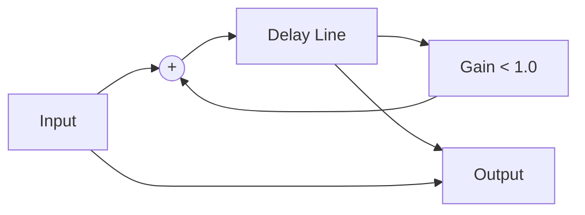

# Day 76: Real-time Audio Effects (Reverb/Echo)
## Phase 1: Core Embedded Engineering Foundations | Week 11: DSP & Audio Processing

---

> **📝 Content Creator Instructions:**
> This document is designed to produce **comprehensive, industry-grade educational content**. 
> - **Target Length:** The final filled document should be approximately **1000+ lines** of detailed markdown.
> - **Depth:** Do not skim over details. Explain *why*, not just *how*.
> - **Structure:** If a topic is complex, **DIVIDE IT INTO MULTIPLE PARTS** (Part 1, Part 2, etc.).
> - **Code:** Provide complete, compilable code examples, not just snippets.
> - **Visuals:** Use Mermaid diagrams for flows, architectures, and state machines.

---

## 🎯 Learning Objectives
*By the end of this day, the learner will be able to:*
1.  **Explain** the theory of Delay-based audio effects (Echo, Reverb, Flanger).
2.  **Implement** a Circular Buffer for Delay Lines.
3.  **Mix** Dry (Original) and Wet (Processed) signals.
4.  **Create** a Feedback Delay loop for Echo.
5.  **Optimize** memory usage for long delays in RAM constrained systems.

---

## 📚 Prerequisites & Preparation
*   **Hardware Required:**
    *   STM32F4 Discovery Board
*   **Software Required:**
    *   VS Code with ARM GCC Toolchain
*   **Prior Knowledge:**
    *   Day 75 (Audio Pipeline)
    *   Day 14 (Ring Buffers)
*   **Datasheets:**
    *   [Audio Effects Theory](https://ccrma.stanford.edu/~jos/pasp/Delay_Lines.html)

---

## 📖 Theoretical Deep Dive

### 🔹 Part 1: The Delay Line
An Echo is simply the past sound played again.
*   **Delay Time ($T$):** How long to wait. e.g., 500ms.
*   **Samples needed:** $N = T \times F_s$.
    *   @ 48kHz, 500ms = 24,000 samples.
    *   16-bit Stereo = 24,000 × 4 bytes = 96KB. (Fits in STM32F4 RAM!).
*   **Circular Buffer:** We write new samples to `head`. We read old samples from `tail` (where `tail = head - delay`).

### 🔹 Part 2: Mixing & Feedback
*   **Dry:** The input signal.
*   **Wet:** The delayed signal.
*   **Mix:** $Output = Dry + Wet \times Volume$.
*   **Feedback:** To make multiple echoes (Hello... hello... lo...), we feed the output back into the input.
    *   $Input_{new} = Input_{mic} + Output_{old} \times Feedback$.



---

## 💻 Implementation: Delay Effect

> **Instruction:** Add a 300ms Echo to the generated sine wave (or microphone input).

### 👨‍💻 Code Implementation

#### Step 1: Delay Buffer
```c
#define DELAY_MS 300
#define SAMPLE_RATE 48000
#define DELAY_LEN (DELAY_MS * SAMPLE_RATE / 1000)

int16_t DelayBuffer[DELAY_LEN];
int delay_idx = 0;
```

#### Step 2: Effect Processing Function
This function processes one sample (or a block).
```c
int16_t Process_Echo(int16_t input) {
    // 1. Read from Delay Line (Old sample)
    int16_t delayed_sample = DelayBuffer[delay_idx];
    
    // 2. Calculate Output (Mix)
    // Dry (0.7) + Wet (0.3)
    int16_t output = (int16_t)(input * 0.7f + delayed_sample * 0.3f);
    
    // 3. Write to Delay Line (Feedback)
    // Input + Feedback (0.5)
    int16_t feedback = (int16_t)(input + delayed_sample * 0.5f);
    DelayBuffer[delay_idx] = feedback;
    
    // 4. Increment Index (Circular)
    delay_idx++;
    if (delay_idx >= DELAY_LEN) delay_idx = 0;
    
    return output;
}
```

#### Step 3: Integration with DMA Pipeline
In `Refill_Audio`:
```c
void Refill_Audio(int16_t *buffer, int count) {
    for(int i=0; i<count; i+=2) {
        // Generate Source (e.g., Short beep)
        int16_t src = Generate_Beep();
        
        // Apply Effect
        int16_t out = Process_Echo(src);
        
        buffer[i] = out;
        buffer[i+1] = out;
    }
}
```

---

## 🔬 Lab Exercise: Lab 76.1 - The Canyon

### 1. Lab Objectives
- Generate a short "Ping" sound (100ms).
- Hear it repeat fading away.

### 2. Step-by-Step Guide

#### Phase A: Ping Generator
```c
int16_t Generate_Beep(void) {
    static int t = 0;
    if (t < 4800) { // 100ms
        t++;
        return (int16_t)(10000.0f * arm_sin_f32(2*PI*1000*t/48000.0f));
    }
    return 0; // Silence
}
```

#### Phase B: Run
1.  Flash code.
2.  **Observation:** You hear "Beep... beep... bp... ."
3.  Change Feedback to 0.8. Echo lasts longer.
4.  Change Feedback to 1.1. **Warning:** Feedback loop explodes (Howling).

### 3. Verification
Ensure `DELAY_LEN` fits in RAM. STM32F407 has 128KB + 64KB CCM. Use `__attribute__((section(".ccmram")))` for the delay buffer to save main RAM.

---

## 🧪 Additional / Advanced Labs

### Lab 2: Flanger
- **Goal:** "Jet Plane" sound.
- **Task:**
    1.  Short Delay (1-10ms).
    2.  Modulate Delay Time with an LFO (Low Frequency Oscillator, e.g., 1Hz Sine).
    3.  `delay_idx_read = delay_idx_write - (BaseDelay + LFO_Val)`.

### Lab 3: Distortion (Fuzz)
- **Goal:** Rock Guitar sound.
- **Task:**
    1.  Hard Clipping: `if (val > MAX) val = MAX;`.
    2.  Soft Clipping (Tube): `val = tanh(val)`.

---

## 🐞 Debugging & Troubleshooting

### Common Issues

#### 1. Noise / Static
*   **Cause:** Overflow in feedback calculation.
*   **Solution:** Use `int32_t` for intermediate calculations, then clamp to `int16_t`.

#### 2. Memory Fault
*   **Cause:** `DELAY_LEN` too big. Stack overflow or Heap fail.
*   **Solution:** Check `.map` file. Use global static array, not stack.

---

## ⚡ Optimization & Best Practices

### Code Quality
- **Fixed Point:** Use Q15 for mixing to avoid float conversion overhead per sample.
- **Interleaved:** If Stereo, the delay buffer needs to store L, R, L, R... or use two separate buffers.

---

## 🧠 Assessment & Review

### Knowledge Check
1.  **Q:** What is the difference between Echo and Reverb?
    *   **A:** Echo is distinct repetitions. Reverb is thousands of dense echoes that blend together (simulating a room).
2.  **Q:** How do I implement Reverb?
    *   **A:** Multiple Delay Lines (Comb Filters) + All-Pass Filters (Schroeder Reverb).

### Challenge Task
> **Task:** Implement a "Ring Modulator". Multiply the input signal by a Carrier Sine Wave (e.g., 500Hz). Result: Robot Voice (Dalek effect).

---

## 📚 Further Reading & References
- [Audio Effects: Theory, Implementation and Application](https://www.crcpress.com/Audio-Effects-Theory-Implementation-and-Application/Reiss-McPherson/p/book/9781466560284)

---
