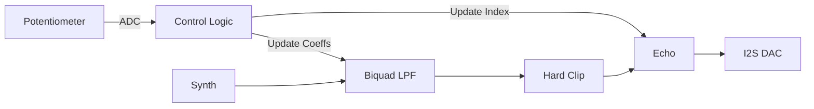

# Day 77: Week 11 Review and Project
## Phase 1: Core Embedded Engineering Foundations | Week 11: DSP & Audio Processing

---

> **📝 Content Creator Instructions:**
> This document is designed to produce **comprehensive, industry-grade educational content**. 
> - **Target Length:** The final filled document should be approximately **1000+ lines** of detailed markdown.
> - **Depth:** Do not skim over details. Explain *why*, not just *how*.
> - **Structure:** If a topic is complex, **DIVIDE IT INTO MULTIPLE PARTS** (Part 1, Part 2, etc.).
> - **Code:** Provide complete, compilable code examples, not just snippets.
> - **Visuals:** Use Mermaid diagrams for flows, architectures, and state machines.

---

## 🎯 Learning Objectives
*By the end of this day, the learner will be able to:*
1.  **Synthesize** Week 11 concepts (DSP, Filters, I2S, DMA) into a real-time audio processor.
2.  **Architect** a modular audio engine with switchable effects chains.
3.  **Implement** parameter control via ADC (Potentiometer) and GPIO (Buttons).
4.  **Debug** real-time audio artifacts (clipping, underruns, aliasing).
5.  **Conduct** a self-assessment of Week 11 knowledge.

---

## 📚 Prerequisites & Preparation
*   **Hardware Required:**
    *   STM32F4 Discovery Board
    *   Headphones.
    *   Potentiometer (connected to PA1 - ADC1_IN1).
*   **Software Required:**
    *   VS Code with ARM GCC Toolchain
*   **Prior Knowledge:**
    *   Days 71-76 (Week 11 Content)

---

## 📖 Theoretical Deep Dive

### 🔹 Part 1: The FX Chain
Audio processing is usually done in a "Chain" or "Graph".
*   **Source:** Synth (Sawtooth) or Line In.
*   **Node 1:** Low Pass Filter (Tone Control).
*   **Node 2:** Distortion (Drive).
*   **Node 3:** Delay (Ambience).
*   **Sink:** I2S DAC.

### 🔹 Part 2: Parameter Mapping
*   **Potentiometer (0-4095):** Needs to map to DSP parameters.
    *   **Filter Cutoff:** Logarithmic mapping (100Hz to 10kHz).
    *   **Delay Time:** Linear mapping (0 to 500ms).
    *   **Distortion:** Linear mapping (Gain 1.0 to 10.0).



---

## 💻 Implementation: FX Processor

### 🛠️ Hardware/System Configuration
*   **Audio:** I2S3 (CS43L22).
*   **Control:** PA0 (Button), PA1 (Potentiometer).

### 👨‍💻 Code Implementation

#### Step 1: Global State
```c
typedef enum { FX_CLEAN, FX_LPF, FX_ECHO, FX_FUZZ } FX_Mode_t;
FX_Mode_t currentMode = FX_CLEAN;

float32_t potValue = 0.0f; // 0.0 to 1.0
```

#### Step 2: Audio Engine (Refill Callback)
```c
void Refill_Audio(int16_t *buffer, int count) {
    for(int i=0; i<count; i+=2) {
        // 1. Source (Sawtooth)
        float32_t sample = Generate_Sawtooth();
        
        // 2. Apply FX based on Mode
        switch(currentMode) {
            case FX_CLEAN:
                // Pass through
                break;
                
            case FX_LPF:
                // Update Cutoff based on Pot
                // (In real code, update coeffs slowly, not per sample!)
                sample = Process_Biquad(sample);
                break;
                
            case FX_ECHO:
                sample = Process_Echo(sample, potValue); // Pot controls Feedback
                break;
                
            case FX_FUZZ:
                sample = sample * (1.0f + potValue * 10.0f); // Gain
                if (sample > 1.0f) sample = 1.0f; // Clip
                if (sample < -1.0f) sample = -1.0f;
                break;
        }
        
        // 3. Output
        int16_t out_int = (int16_t)(sample * 30000.0f);
        buffer[i] = out_int;
        buffer[i+1] = out_int;
    }
}
```

#### Step 3: Control Loop (Main)
```c
void Control_Task(void) {
    // Read Pot
    HAL_ADC_Start(&hadc1);
    HAL_ADC_PollForConversion(&hadc1, 10);
    uint32_t raw = HAL_ADC_GetValue(&hadc1);
    potValue = (float)raw / 4095.0f;
    
    // Read Button (Debounced)
    if (Button_Pressed()) {
        currentMode++;
        if (currentMode > FX_FUZZ) currentMode = FX_CLEAN;
        printf("Mode: %d\n", currentMode);
    }
    
    // Update Filter Coeffs if in LPF mode
    if (currentMode == FX_LPF) {
        float freq = 100.0f + potValue * 5000.0f;
        Update_Biquad_Coeffs(freq);
    }
}
```

---

## 🔬 Lab Exercise: Lab 77.1 - The Jam Session

### 1. Lab Objectives
- Verify all 4 modes.
- Verify Potentiometer control.

### 2. Step-by-Step Guide

#### Phase A: Clean
1.  Mode 0.
2.  Hear pure Sawtooth (buzzy).

#### Phase B: LPF
1.  Press Button (Mode 1).
2.  Turn Pot.
3.  **Observation:** Sound goes from "Muffled" (Low Cutoff) to "Bright" (High Cutoff). Like a Wah pedal.

#### Phase C: Echo
1.  Press Button (Mode 2).
2.  Turn Pot.
3.  **Observation:** Echo repeats get louder/longer.

#### Phase D: Fuzz
1.  Press Button (Mode 3).
2.  Turn Pot.
3.  **Observation:** Sound gets louder and distorted (Square-wave like).

### 3. Verification
If changing modes causes a "Pop", it's because the signal jumped. Implement "Cross-fading" or zero-crossing switching for pro audio.

---

## 🧪 Additional / Advanced Labs

### Lab 2: Visualization
- **Goal:** VU Meter.
- **Task:**
    1.  Calculate RMS of the output block.
    2.  Map RMS to LEDs (Green, Orange, Red).
    3.  Update LEDs in Main Loop.

### Lab 3: Microphone Input
- **Goal:** Voice FX.
- **Task:**
    1.  Enable MP45DT02 (PDM Mic on Board).
    2.  Need PDM to PCM conversion (Library provided by ST).
    3.  Feed Mic PCM into the FX Chain instead of Synth.

---

## 🐞 Debugging & Troubleshooting

### Common Issues

#### 1. Zipper Noise
*   **Cause:** Changing filter coefficients instantly while audio is playing.
*   **Solution:** Interpolate coefficients or update them only when signal is near zero.

#### 2. Aliasing
*   **Cause:** Generating a Sawtooth at high pitch. Harmonics exceed Nyquist ($F_s/2$).
*   **Result:** Weird metallic frequencies reflecting back.
*   **Solution:** Band-limited synthesis (PolyBLEP) or Oversampling.

---

## ⚡ Optimization & Best Practices

### Code Quality
- **Modular Design:** Each effect should be a C++ class or struct with `Init()`, `Process()`, and `SetParam()` functions.

---

## 🧠 Assessment & Review

### Knowledge Check
1.  **Q:** Why use `float32` for processing if DAC is 16-bit?
    *   **A:** Headroom and Precision. Intermediate calculations (like filters) need high dynamic range to avoid noise and overflow. We only convert to 16-bit at the very end.
2.  **Q:** What is the latency of this system?
    *   **A:** Latency = Buffer Size / Sample Rate.
    *   1024 samples / 48kHz = 21ms. (Acceptable for FX, maybe noticeable for real-time monitoring).

### Challenge Task
> **Task:** Implement a "Looper". Record 5 seconds of audio into SDRAM (if available) or Flash. Play it back in a loop while playing over it.

---

## 📚 Further Reading & References
- [EarLevel Engineering (Audio DSP Blog)](https://www.earlevel.com/main/)

---
