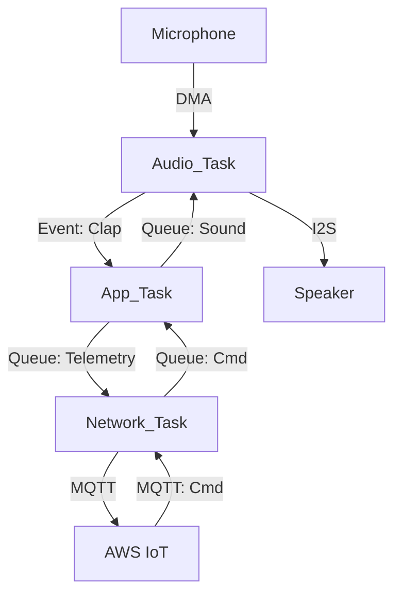

# Day 78: Capstone Project Planning & Architecture
## Phase 1: Core Embedded Engineering Foundations | Week 12: Capstone Project Phase 1

---

> **📝 Content Creator Instructions:**
> This document is designed to produce **comprehensive, industry-grade educational content**. 
> - **Target Length:** The final filled document should be approximately **1000+ lines** of detailed markdown.
> - **Depth:** Do not skim over details. Explain *why*, not just *how*.
> - **Structure:** If a topic is complex, **DIVIDE IT INTO MULTIPLE PARTS** (Part 1, Part 2, etc.).
> - **Code:** Provide complete, compilable code examples, not just snippets.
> - **Visuals:** Use Mermaid diagrams for flows, architectures, and state machines.

---

## 🎯 Learning Objectives
*By the end of this day, the learner will be able to:*
1.  **Define** the requirements and scope for the "Smart Home Hub" Capstone Project.
2.  **Architect** the system using a layered approach (Drivers, Middleware, App).
3.  **Design** the RTOS Task Model, including priorities and communication paths.
4.  **Plan** the Memory Map (Flash/RAM partitioning) for OTA and Audio buffers.
5.  **Set up** the project structure and Version Control strategy.

---

## 📚 Prerequisites & Preparation
*   **Hardware Required:**
    *   STM32F4 Discovery Board
    *   All sensors/modules used in previous weeks (Ethernet, Mic, Audio, etc.).
*   **Software Required:**
    *   VS Code with ARM GCC Toolchain
    *   Git
*   **Prior Knowledge:**
    *   Weeks 1-11 (Everything!)

---

## 📖 Theoretical Deep Dive

### 🔹 Part 1: Project Scope - "Smart Home Hub"
The goal is to build a device that acts as a central controller for a smart home.
*   **Features:**
    1.  **Voice Command:** Detect "Clap" or simple keywords (DSP).
    2.  **Cloud Sync:** Report status to AWS/Azure (IoT).
    3.  **Audio Feedback:** Play notification sounds (I2S).
    4.  **Local Control:** Buttons/LEDs for manual override.
    5.  **OTA Updates:** Remote firmware upgrade.
    6.  **Shell:** UART CLI for debugging.

### 🔹 Part 2: System Architecture
We will use a **Layered Architecture**:
*   **Application Layer:** `App_Main`, `App_Cloud`, `App_Audio`.
*   **Middleware Layer:** `FreeRTOS`, `LwIP`, `mbedTLS`, `FatFS`.
*   **HAL/BSP Layer:** `STM32_HAL`, `BSP_Audio`, `BSP_Net`.
*   **Hardware:** STM32F407.

### 🔹 Part 3: RTOS Task Model
| Task Name | Priority | Stack | Responsibility |
| :--- | :--- | :--- | :--- |
| **Audio_Task** | High (5) | 1KB | Process Mic/Speaker buffers (Real-time). |
| **Network_Task** | Medium (3) | 4KB | Handle LwIP/MQTT/TLS. |
| **App_Task** | Low (2) | 2KB | Business Logic (State Machine). |
| **CLI_Task** | Low (1) | 1KB | UART Command Line. |
| **OTA_Task** | Low (1) | 4KB | Download FW (Spawned on demand). |



---

## 💻 Implementation: Project Setup

> **Instruction:** Create the folder structure and empty files.

### 👨‍💻 Code Implementation

#### Step 1: Folder Structure
```text
Project_Root/
├── Core/
│   ├── Inc/ (main.h, stm32f4xx_it.h)
│   └── Src/ (main.c, stm32f4xx_it.c, system_stm32f4xx.c)
├── Drivers/
│   ├── CMSIS/
│   └── STM32F4xx_HAL_Driver/
├── Middlewares/
│   ├── Third_Party/
│   │   ├── FreeRTOS/
│   │   ├── LwIP/
│   │   └── mbedTLS/
├── App/
│   ├── Inc/ (app_config.h)
│   └── Src/ (app_main.c, app_audio.c, app_net.c)
└── BSP/
    ├── cs43l22.c
    └── stm32f4_discovery.c
```

#### Step 2: Memory Map (Linker Script)
We need to reserve space for OTA.
*   **Sector 0-7 (128KB):** Bootloader (Future). For now, just App.
*   **Sector 8-11 (384KB):** App Slot A (Active).
*   **Sector 12-23 (512KB):** App Slot B (Download) / File System.

For Phase 1, we will use a simpler map:
*   **Flash:** 1MB for App.
*   **RAM:** 128KB Main + 64KB CCM.
    *   **CCM:** Use for Audio Buffers and RTOS Stacks (No DMA access to CCM!).
    *   **Main:** Use for LwIP/TLS buffers (DMA accessible).

#### Step 3: `main.c` Skeleton
```c
#include "main.h"
#include "cmsis_os.h"

// Task Handles
TaskHandle_t hAudioTask;
TaskHandle_t hNetTask;
TaskHandle_t hAppTask;

int main(void) {
    HAL_Init();
    SystemClock_Config();
    
    // Init BSP
    BSP_LED_Init();
    BSP_Button_Init();
    
    // Create Tasks
    xTaskCreate(vTaskAudio, "Audio", 512, NULL, 5, &hAudioTask);
    xTaskCreate(vTaskNet,   "Net",   1024, NULL, 3, &hNetTask);
    xTaskCreate(vTaskApp,   "App",   512, NULL, 2, &hAppTask);
    
    // Start Scheduler
    vTaskStartScheduler();
    
    while(1);
}
```

---

## 🔬 Lab Exercise: Lab 78.1 - The Skeleton

### 1. Lab Objectives
- Compile the empty project.
- Verify RTOS is running (Blinky in App Task).
- Verify Memory Layout (.map file).

### 2. Step-by-Step Guide

#### Phase A: Create Tasks
1.  `vTaskApp`: Toggle LED every 1s.
2.  `vTaskAudio`: Print "Audio Ready" once.
3.  `vTaskNet`: Print "Net Ready" once.

#### Phase B: Compile & Run
1.  `make all`.
2.  Flash.
3.  **Observation:** LED blinks. UART prints messages.

### 3. Verification
Check `xPortGetFreeHeapSize()` at start. Ensure we have enough RAM for TLS later (need ~50KB free).

---

## 🧪 Additional / Advanced Labs

### Lab 2: Git Repo
- **Goal:** Version Control.
- **Task:**
    1.  `git init`.
    2.  Create `.gitignore` (ignore `build/`, `*.o`, `*.bin`).
    3.  `git add .` -> `git commit -m "Initial Commit"`.

### Lab 3: Unit Test Framework
- **Goal:** Preparation for TDD.
- **Task:**
    1.  Add `Unity` (C Unit Test framework).
    2.  Write a simple test: `TEST_ASSERT_EQUAL(1, 1)`.
    3.  Run it in `main()` before scheduler starts.

---

## 🐞 Debugging & Troubleshooting

### Common Issues

#### 1. HardFault immediately
*   **Cause:** Stack size too small for `main` (before scheduler) or Interrupt Vector Table offset wrong.
*   **Solution:** Check `_estack` in linker script.

#### 2. Linker Error: RAM overflow
*   **Cause:** Too many large static arrays.
*   **Solution:** Move large buffers to `.ccmram` section using `__attribute__((section(".ccmram")))`.

---

## ⚡ Optimization & Best Practices

### Code Quality
- **Config Header:** Create `app_config.h` to store all system-wide defines (e.g., `AUDIO_BUF_SIZE`, `MQTT_TOPIC_PREFIX`). Don't hardcode magic numbers in `.c` files.

---

## 🧠 Assessment & Review

### Knowledge Check
1.  **Q:** Why put Audio Task at highest priority?
    *   **A:** Audio is hard real-time. If it misses a deadline (buffer underrun), the user hears a glitch. Network can wait a few ms without issue.
2.  **Q:** What is CCM RAM?
    *   **A:** Core Coupled Memory. Tightly coupled to the CPU. Fast access, no wait states. But **DMA cannot see it**.

### Challenge Task
> **Task:** Draw the full system Block Diagram including Power, Clocks, and Data Flow. Save it as a Mermaid diagram in `docs/architecture.md`.

---

## 📚 Further Reading & References
- [Embedded Software Architecture (Patterns)](https://www.embedded.com/embedded-software-architecture-patterns/)

---
