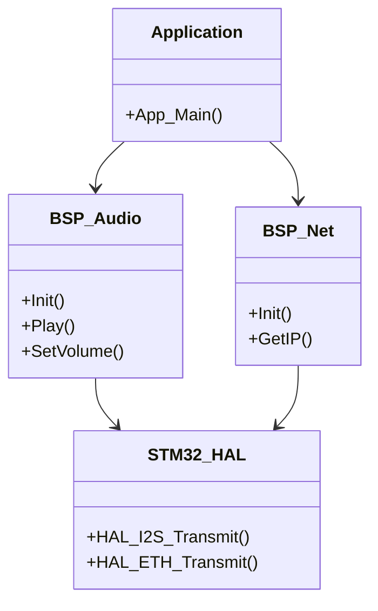

# Day 79: Hardware Abstraction Layer (HAL) Design
## Phase 1: Core Embedded Engineering Foundations | Week 12: Capstone Project Phase 1

---

> **📝 Content Creator Instructions:**
> This document is designed to produce **comprehensive, industry-grade educational content**. 
> - **Target Length:** The final filled document should be approximately **1000+ lines** of detailed markdown.
> - **Depth:** Do not skim over details. Explain *why*, not just *how*.
> - **Structure:** If a topic is complex, **DIVIDE IT INTO MULTIPLE PARTS** (Part 1, Part 2, etc.).
> - **Code:** Provide complete, compilable code examples, not just snippets.
> - **Visuals:** Use Mermaid diagrams for flows, architectures, and state machines.

---

## 🎯 Learning Objectives
*By the end of this day, the learner will be able to:*
1.  **Design** a custom Board Support Package (BSP) API that abstracts hardware details.
2.  **Implement** `BSP_Audio` to wrap the CS43L22 and I2S driver.
3.  **Implement** `BSP_Net` to wrap the Ethernet PHY and LwIP initialization.
4.  **Create** a unified `BSP_GPIO` interface for buttons and LEDs.
5.  **Verify** the HAL implementation with unit tests.

---

## 📚 Prerequisites & Preparation
*   **Hardware Required:**
    *   STM32F4 Discovery Board
*   **Software Required:**
    *   VS Code with ARM GCC Toolchain
*   **Prior Knowledge:**
    *   Day 78 (Architecture)
    *   Day 74 (Audio Driver)
    *   Day 47 (Ethernet)

---

## 📖 Theoretical Deep Dive

### 🔹 Part 1: Why Abstraction?
We are building a Smart Home Hub. Today it runs on STM32F4. Tomorrow, we might port it to ESP32 or NXP i.MX RT.
*   **Bad Code:** `HAL_GPIO_WritePin(GPIOD, GPIO_PIN_12, GPIO_PIN_SET);` (Tied to STM32 HAL).
*   **Good Code:** `BSP_LED_On(LED_GREEN);` (Portable).

### 🔹 Part 2: API Design Principles
1.  **Opaque Handles:** The application shouldn't know about `I2C_HandleTypeDef`.
2.  **Standard Types:** Use `uint8_t`, `int16_t`, `bool`.
3.  **Error Codes:** Return `BSP_OK`, `BSP_ERROR` enums.
4.  **Callbacks:** Use function pointers for asynchronous events (e.g., `BSP_Audio_TxCpltCallback`).

### 🔹 Part 3: The BSP Structure
*   `bsp_audio.h`: `BSP_Audio_Init`, `BSP_Audio_Play`, `BSP_Audio_SetVolume`.
*   `bsp_net.h`: `BSP_Net_Init`, `BSP_Net_GetIP`, `BSP_Net_LinkStatus`.
*   `bsp_gpio.h`: `BSP_LED_On`, `BSP_Button_GetState`.



---

## 💻 Implementation: BSP_GPIO

> **Instruction:** Create a simple abstraction for LEDs and Buttons.

### 👨‍💻 Code Implementation

#### Step 1: Header (`bsp_gpio.h`)
```c
#ifndef BSP_GPIO_H
#define BSP_GPIO_H

#include <stdint.h>
#include <stdbool.h>

typedef enum {
    LED_GREEN,
    LED_ORANGE,
    LED_RED,
    LED_BLUE
} BSP_Led_t;

typedef enum {
    BUTTON_USER
} BSP_Button_t;

void BSP_GPIO_Init(void);
void BSP_LED_On(BSP_Led_t led);
void BSP_LED_Off(BSP_Led_t led);
void BSP_LED_Toggle(BSP_Led_t led);
bool BSP_Button_IsPressed(BSP_Button_t btn);

#endif
```

#### Step 2: Source (`bsp_gpio.c`)
```c
#include "bsp_gpio.h"
#include "stm32f4xx_hal.h"

// Map Enum to Hardware Pins
static GPIO_TypeDef* LED_PORTS[] = { GPIOD, GPIOD, GPIOD, GPIOD };
static const uint16_t LED_PINS[] = { GPIO_PIN_12, GPIO_PIN_13, GPIO_PIN_14, GPIO_PIN_15 };

void BSP_GPIO_Init(void) {
    __HAL_RCC_GPIOD_CLK_ENABLE();
    __HAL_RCC_GPIOA_CLK_ENABLE();
    
    GPIO_InitTypeDef GPIO_InitStruct = {0};
    
    // LEDs
    GPIO_InitStruct.Pin = GPIO_PIN_12|GPIO_PIN_13|GPIO_PIN_14|GPIO_PIN_15;
    GPIO_InitStruct.Mode = GPIO_MODE_OUTPUT_PP;
    GPIO_InitStruct.Pull = GPIO_NOPULL;
    GPIO_InitStruct.Speed = GPIO_SPEED_FREQ_LOW;
    HAL_GPIO_Init(GPIOD, &GPIO_InitStruct);
    
    // Button (PA0)
    GPIO_InitStruct.Pin = GPIO_PIN_0;
    GPIO_InitStruct.Mode = GPIO_MODE_INPUT;
    GPIO_InitStruct.Pull = GPIO_NOPULL;
    HAL_GPIO_Init(GPIOA, &GPIO_InitStruct);
}

void BSP_LED_On(BSP_Led_t led) {
    HAL_GPIO_WritePin(LED_PORTS[led], LED_PINS[led], GPIO_PIN_SET);
}

void BSP_LED_Off(BSP_Led_t led) {
    HAL_GPIO_WritePin(LED_PORTS[led], LED_PINS[led], GPIO_PIN_RESET);
}

void BSP_LED_Toggle(BSP_Led_t led) {
    HAL_GPIO_TogglePin(LED_PORTS[led], LED_PINS[led]);
}

bool BSP_Button_IsPressed(BSP_Button_t btn) {
    // Active High
    return (HAL_GPIO_ReadPin(GPIOA, GPIO_PIN_0) == GPIO_PIN_SET);
}
```

---

## 💻 Implementation: BSP_Audio

> **Instruction:** Abstract the CS43L22 and I2S DMA.

### 👨‍💻 Code Implementation

#### Step 1: Header (`bsp_audio.h`)
```c
#ifndef BSP_AUDIO_H
#define BSP_AUDIO_H

#include <stdint.h>

// Callback types
typedef void (*AudioCallback_t)(void);

void BSP_Audio_Init(uint32_t freq);
void BSP_Audio_Play(int16_t *buffer, uint32_t size);
void BSP_Audio_Pause(void);
void BSP_Audio_Resume(void);
void BSP_Audio_SetVolume(uint8_t vol); // 0-100

// Register Callbacks
void BSP_Audio_RegisterCallbacks(AudioCallback_t txHalf, AudioCallback_t txCplt);

#endif
```

#### Step 2: Source (`bsp_audio.c`)
```c
#include "bsp_audio.h"
#include "stm32f4xx_hal.h"
#include "cs43l22.h" // Low level driver

static I2S_HandleTypeDef hi2s3;
static AudioCallback_t pTxHalf = NULL;
static AudioCallback_t pTxCplt = NULL;

void BSP_Audio_Init(uint32_t freq) {
    // Init I2S3 Hardware (Pins, Clocks, DMA)
    // ... (Standard HAL Init Code) ...
    
    // Init Codec via I2C
    CS43L22_Init();
}

void BSP_Audio_Play(int16_t *buffer, uint32_t size) {
    HAL_I2S_Transmit_DMA(&hi2s3, (uint16_t*)buffer, size);
    CS43L22_Play();
}

void BSP_Audio_SetVolume(uint8_t vol) {
    CS43L22_SetVolume(vol);
}

void BSP_Audio_RegisterCallbacks(AudioCallback_t txHalf, AudioCallback_t txCplt) {
    pTxHalf = txHalf;
    pTxCplt = txCplt;
}

// HAL Callbacks
void HAL_I2S_TxHalfCpltCallback(I2S_HandleTypeDef *hi2s) {
    if (pTxHalf) pTxHalf();
}

void HAL_I2S_TxCpltCallback(I2S_HandleTypeDef *hi2s) {
    if (pTxCplt) pTxCplt();
}
```

---

## 🔬 Lab Exercise: Lab 79.1 - HAL Verification

### 1. Lab Objectives
- Use the new BSP APIs in `main.c`.
- Verify LEDs and Audio without touching HAL directly.

### 2. Step-by-Step Guide

#### Phase A: Main Loop
```c
void Audio_Half_Transfer(void) {
    BSP_LED_Toggle(LED_ORANGE);
}

void Audio_Full_Transfer(void) {
    BSP_LED_Toggle(LED_BLUE);
}

int main(void) {
    HAL_Init();
    BSP_GPIO_Init();
    BSP_Audio_Init(48000);
    
    BSP_Audio_RegisterCallbacks(Audio_Half_Transfer, Audio_Full_Transfer);
    
    int16_t dummyBuf[1024] = {0};
    BSP_Audio_Play(dummyBuf, 1024);
    
    while(1) {
        if (BSP_Button_IsPressed(BUTTON_USER)) {
            BSP_LED_On(LED_GREEN);
        } else {
            BSP_LED_Off(LED_GREEN);
        }
    }
}
```

#### Phase B: Test
1.  Run.
2.  **Observation:** Orange/Blue LEDs toggle rapidly (DMA interrupts).
3.  **Observation:** Press button -> Green LED ON.

### 3. Verification
If LEDs don't toggle, check if `HAL_I2S_Transmit_DMA` was called and if interrupts are enabled in NVIC.

---

## 🧪 Additional / Advanced Labs

### Lab 2: BSP_Net Stub
- **Goal:** Prepare for LwIP.
- **Task:**
    1.  Create `bsp_net.h`.
    2.  Define `BSP_Net_Init()`.
    3.  For now, just init the GPIOs for RMII (MCO, MDIO, MDC, etc.).

### Lab 3: Error Handling
- **Goal:** Robustness.
- **Task:**
    1.  Add `BSP_Status_t` return type to all functions.
    2.  If I2C fails in `BSP_Audio_Init`, return `BSP_ERROR`.
    3.  In `main`, check return and blink Red LED if error.

---

## 🐞 Debugging & Troubleshooting

### Common Issues

#### 1. Linker Error: Multiple Definitions
*   **Cause:** Defining functions in `.h` files instead of `.c`.
*   **Solution:** Only declarations in `.h`. Definitions in `.c`.

#### 2. Callback not firing
*   **Cause:** Forgot to register them? Or `HAL_I2S_TxCpltCallback` name mismatch (weak symbol).
*   **Solution:** Put a breakpoint in the HAL ISR handler.

---

## ⚡ Optimization & Best Practices

### Code Quality
- **Singleton:** The BSP assumes one instance of hardware. This is fine for embedded.
- **Inline:** For very small functions like `BSP_LED_On`, you can make them `static inline` in the header for performance (avoids function call overhead).

---

## 🧠 Assessment & Review

### Knowledge Check
1.  **Q:** Why use callbacks instead of hardcoding the handler in `bsp_audio.c`?
    *   **A:** Decoupling. The BSP shouldn't know *what* the application wants to do when the buffer is empty (e.g., refill from SD card vs refill from Synth).
2.  **Q:** Can I use `printf` in the BSP?
    *   **A:** Generally avoid it. Use a logging callback or return error codes. `printf` is slow and ties you to a specific UART implementation.

### Challenge Task
> **Task:** Implement `BSP_Console`. Abstract the UART. `BSP_Console_Write(char *data, len)`. Use DMA for transmission to avoid blocking the CPU.

---

## 📚 Further Reading & References
- [Layered Architecture in Embedded Systems](https://interrupt.memfault.com/blog/firmware-architecture-in-5-layers)

---
